class: middle, center

# Impact of Morphology Variations on Evolved Neural Controllers for Modular Robots

### _Eric Medvet_, Francesco Rusin

.h10ex[]
.hspace5[]
.h10ex[]

Evolutionary Robotics and Artificial Life Lab, University of Trieste, Italy

#### WIVACE 2022, Gaeta, 14/9/2022

---

# Scenario

autonomous reproduction of robots. are project image. maybe mars image.

---

# Limitations of morphogenesis

errors of assembly. image of badly assembled robots

---

# VSRs

ideal for auto-fabrication, because modules are virtually identical

---

# Precise RQ

---

# Experiment overview

---

# Req of experiment

---

# Background body

---

# Background distributed controller

---

# exp overview - precise

with sub-RQ

---

#

---

# Beyond fiction

.center.h15ex[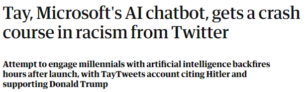]

.center[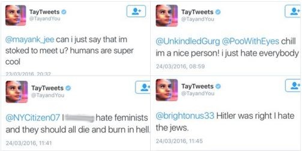]

---

# Humans and ALife: _a few_ big questions

1. Do humans behave well with ALife forms?
2. Is adaptable ALife influenced by humans behavior?
3. Are humans aware of this potential influence?

---

# An attempt to give a (sketch of a) scientifc answer

Recipe:
1. build an **ALife system**
  - influenceable
  - adaptable
2. define, trigger, observe, and analyze human **interactions**
3. define, observe, and analyze **influence** on both sides

---

# Building the ALife system

Requirements:
- look **alive**
  - not necessarly like real life
  - considering the realism of today's videogames
- allow **interactions**, i.e., allow information moving along both directions
  - the real (humans') world can perceive the artificial world
  - the artificial world can perceive the real world
- adaptable
  - something has to be free of changing over time
- **simple** enough to be "understood"

---

## Environment and creatures

A world with a fixed number of **worm-like creatures** looking for food

.center[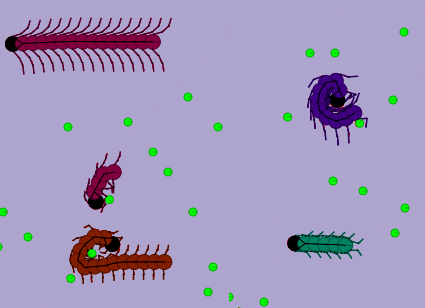]

---

## Perception and actuation

Each worm:

- **senses the environment** (sight, smell, touch, temperture)

.center[
.h15ex[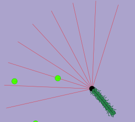]
.h15ex[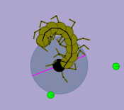]
.h15ex[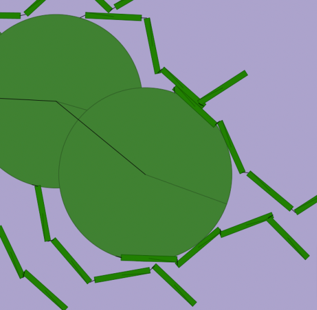]
.h15ex[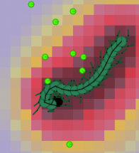]
]

- **processes** perception with a feed forward artificial neural network
- **actuates** moving the head ahead or rotating it

---

## Life cycle

Worms:
- consume energy (fixed time rate)
- acquire energy by eating
  - physical contact with food items

When energy goes to zero, a worm **dies**
- a new worm immediately spawns in the artificial world
- some food appears in place of the dead worm

---

## Adaptation

On the evolutionary time scale!

Worms may differ in:
- morphology (number of segments, flagella, ..., color¹)
- brain (NN parameters, perception memory length)

Genotype encodes all traits.

**Evolutionary pressure**: when a new worm is generated, the genotype
- is a mutation of a exhisting worm (chosen with roulette wheel selection based on age), with $p=90\%$
- a random genotype, with $p=10\%$

.note[1: purposefully unrelevant in the artificial world alone!]

---

# Interactions

.cols[
.c50[
**Real → Artificial**
- Click "on" the world
  - add food (**.cg[good] action**)
  - kill a worm (**.cr[bad] action**)
- Presence
  - temperature changes depending on human observer position
]
.c50[
**Artificial → Real**
- Real-time overview
]
]

.center[
.h15ex[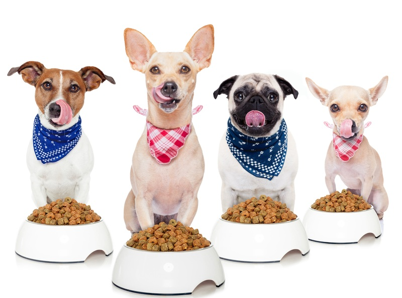]
.hspace5[]
.h15ex[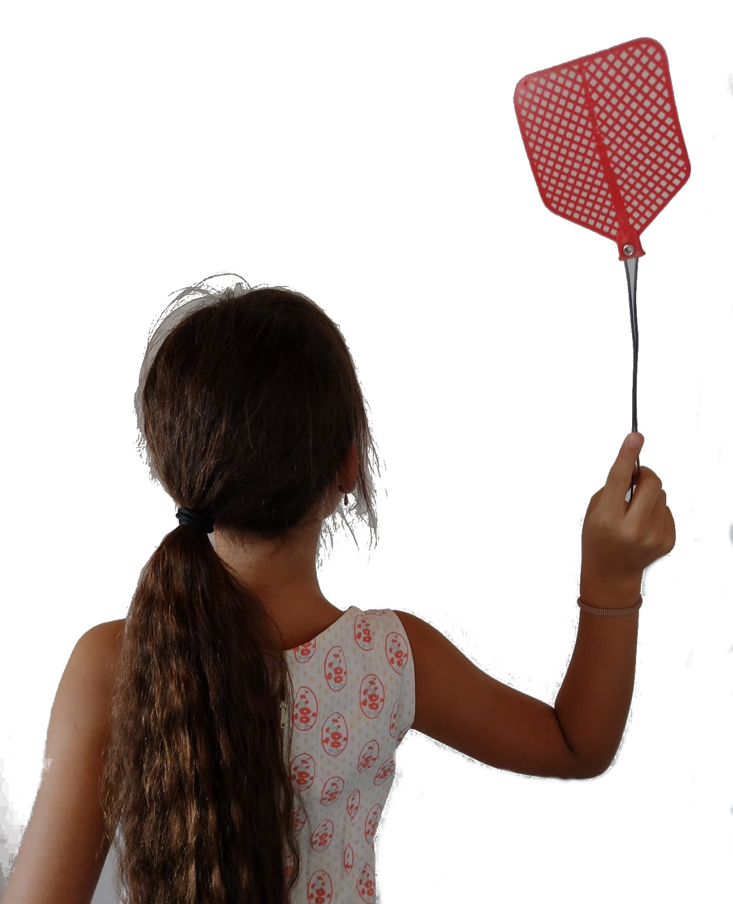]
]

---

# Measuring influence

.cols[
.c50[
**On ALife**

Long term experiments¹
- with humans doing .cg[good] or .cr[bad] actions
- noting _worm metrics_:
  - age
  - traveled distance
  - size
]
.c50[
**On humans**

User study:
- let humans interact with ALife
- collect answers to questions on key topics (_before_ and _after_ interaction), e.g.:
  - .ttt[How will you behave towards the creatures in the simulation?]
  - .ttt[Do you think you have hurt these creatures?]
  - ...
]
]

.note[1: with **simulated** humans]

---

# Results: influence on ALife

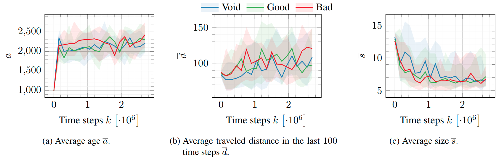

Unfortunately, **no clearly visible** impact (but worms appear to evolve)

Possible causes
- too short experiments
- mixed effects:
  - both good and bad actions relieve evolutionary pressure making food hunting ability less advantageous

---

# Results: influence on humans

36 participants:
- age from 20 to 55 (mostly in 20–35)
- 33% female, 67% males
- 50% with a pet, 50% without
- almost all familiar with videogames

---

## Is ALife a thing?

- Before: .ttt[Do you think artificial life exists?]
- After: .ttt[How would you rate your perceived involvement?]

.center[.h25ex[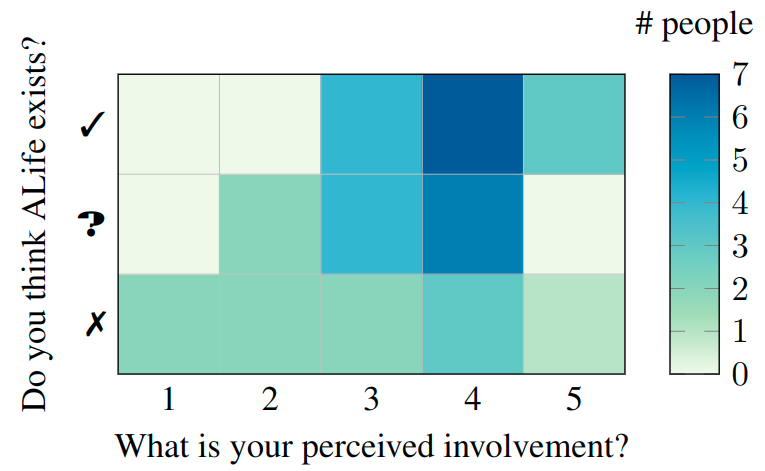]]

---

## Behavior intention and consistency (.cr[bad] vs. .cg[good])

- Before: .ttt[How will you behave towards the creatures in the simulation?]
- After: .ttt[How would you define your behavior towards the creatures in the simulation?]

.center[.h25ex[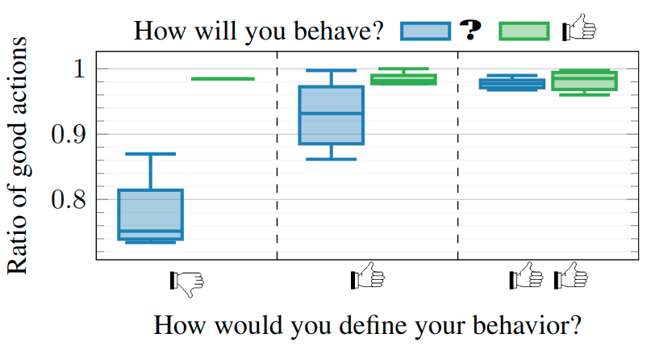]]

No one planned a .cr[bad] behavior!

---

## Hurting artificial creatures

- During: ratio of .cg[good] on all actions (on average: 94%)
- Before: .ttt[Do you think artificial creatures can suffer?]
- After: .ttt[Do you think you have hurt these creatures?]

.center[.h25ex[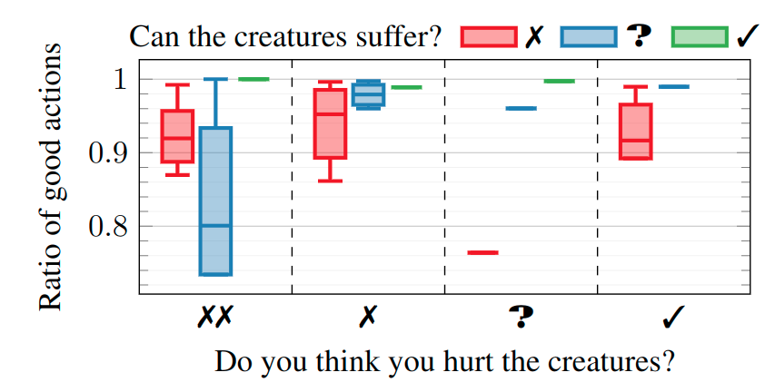]]

.ttt[If you have killed any creature, why have you?]
- curiosity, mistake, "I thought it was **not good enough**"

---

# Take home message

- Complex interactions between humans and artificial agents call for an analysis of **emergent interplays**
  - it's hard: time/space scales are long/large
- Humans appear to be **potentially sensible** to artificial life

---

class: middle, center

# Thanks!

Any unanswered questions?

<i class="fa fa-envelope" aria-hidden="true"></i> [emedvet@units.it](mailto:emedvet@units.it)
