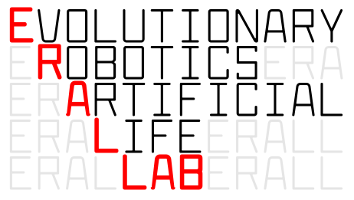
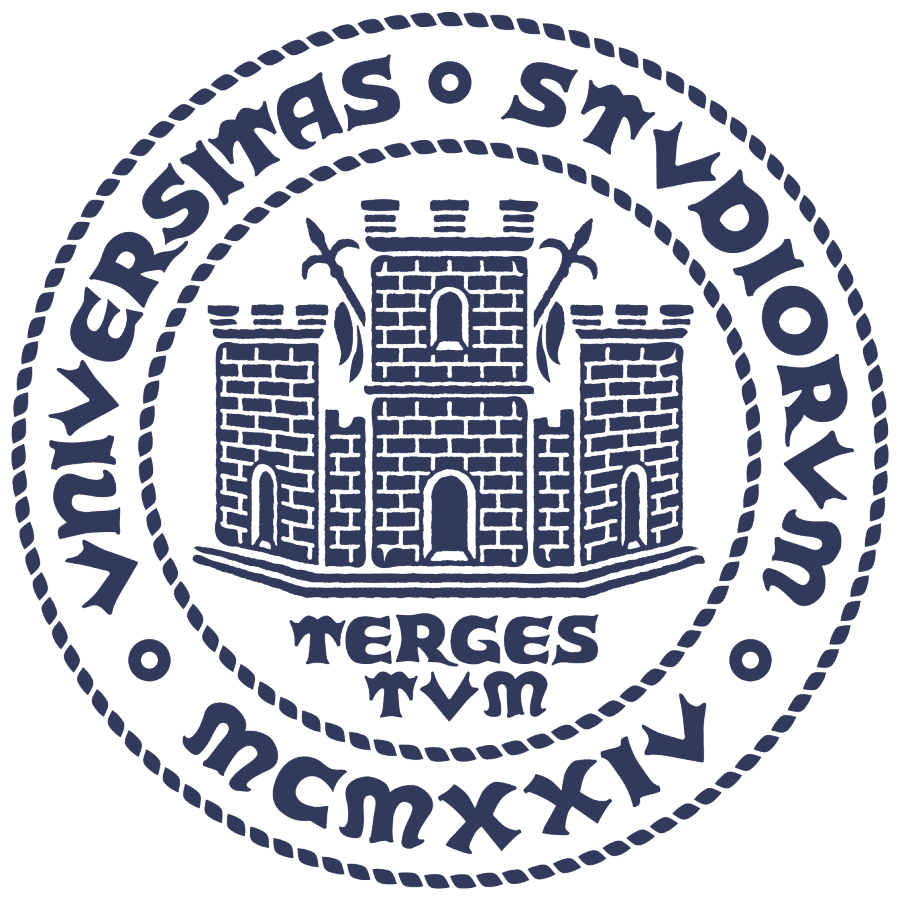

class: middle, center

# Impact of Morphology Variations on Evolved Neural Controllers for Modular Robots

### _Eric Medvet_, Francesco Rusin

.h10ex[]
.hspace5[]
.h10ex[]

Evolutionary Robotics and Artificial Life Lab, University of Trieste, Italy

#### WIVACE 2022, Gaeta, 14/9/2022

---

# Scenario

autonomous reproduction of robots. are project image. maybe mars image.

---

# Limitations of morphogenesis

errors of assembly. image of badly assembled robots

---

# VSRs

ideal for auto-fabrication, because modules are virtually identical

---

# Precise RQ

---

# Experiment overview

---

# Req of experiment

---

# Background body

---

# Background distributed controller

---

# exp overview - precise

with sub-RQ on reopt

---

# modified shapes

---

# seeded re-optimization

---

# interesting shapes

---

class: middle, center

# Thanks!

Questions?

<i class="fa fa-envelope" aria-hidden="true"></i> [emedvet@units.it](mailto:emedvet@units.it)
