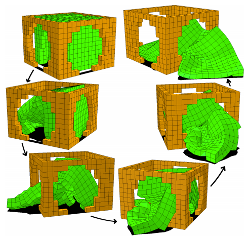
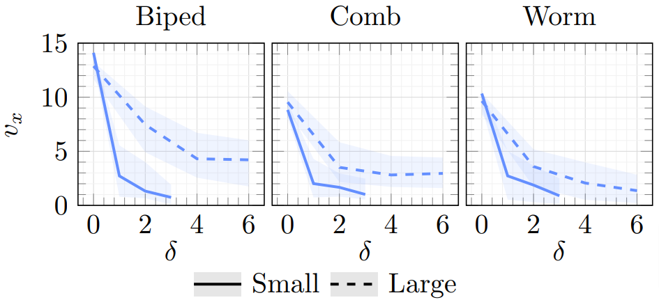
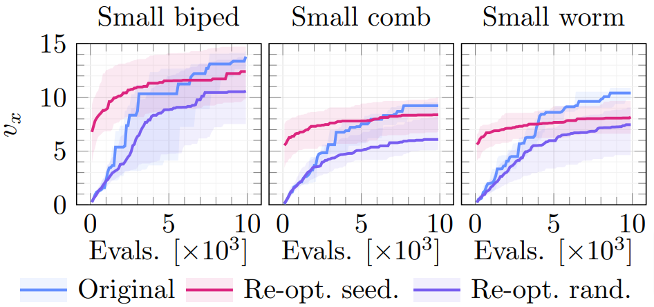

class: middle, center

# Impact of Morphology Variations on Evolved Neural Controllers for Modular Robots

### _Eric Medvet_, Francesco Rusin

.h10ex[]
.hspace5[]
.h10ex[]

Evolutionary Robotics and Artificial Life Lab, University of Trieste, Italy

#### WIVACE 2022, Gaeta, 14/9/2022

---

# Autonomous robots

.cols[
.c50[
Dangerous or inaccessible environments, where human operators cannot intervene

Robots should be:
- autonomous
- adaptable
- capable of **auto-fabrication** and re-use
]
.c50[
.w100p.center[]

.refnote[From Eiben, Agoston E., et al. "Towards autonomous robot evolution." Software Engineering for Robotics. Springer, Cham, 2021. 29-51.]
]
]

---

# Modular (soft) robots

.cols[
.c50[

**Ideal** for auto-fabrication:
- all modules are virtually *identical*
- easy re-use
- compliance
- *expressive* control

.h15ex.center[]
.refnote[Corucci, Francesco, et al. "Evolving soft locomotion in aquatic and terrestrial environments: effects of material properties and environmental transitions." Soft robotics 5.4 (2018): 475-495.]
]
.c50[
.h30ex.center[]
.refnote[Cheney, Nick, Josh Bongard, and Hod Lipson. "Evolving soft robots in tight spaces." Proceedings of the 2015 annual conference on Genetic and Evolutionary Computation. 2015.]
]
]

---

# Modular soft robots ecosystem

A few tasks, with corresponding best suited few morphology+controller combinations

Life cycle
1. modules are assembled to form a robot in given morphology
2. associated with a controller (*auto-fabrication*)
3. robot "lives" and does its stuff
4. robot is disposed: modules become available again

---

# Limits of auto-fabrication

What if auto-fabrication sometimes does not work as expected?  
What if the assmbled **morphology is (slightly) different** from the expected one?

.center[
.vam.h15ex[] .large[→]
.vam.h15ex[] .large[→]
.vam.h15ex[]
]

Will the **controller work well** with the slightly different morphology?

---

# Research question

**RQ**: What is the **impact of small morphology variations** on the effectiveness of controllers optimized through neuroevolution?

Overview of the plan (**experimental** answer):
1. consider a task and a few base morphologies
2. evolve a controller for each morphology
3. apply small variations to each morphology
4. measure impact on controller

**RQ-bis**: how to **re-align** a controller to the varied morphology?

---

# Background: VSR morphology

.cols[
.c60[
- 2D:
  - faster simulation
  - discrete time
- identical soft blocks (*voxels*):
  - softness as spring-damper systems
  - active:  
    $a^\{(k)\}=-1$ → expand  
    $a^\{(k)\}=+1$ → contract
- sensors in each voxel:
  - area ratio
  - ground contact
  - $x$- and $y$-velocity

]
.c40[
.center[
.h15ex[]

<video width="320" height="240" autoplay loop>
    <source src="videos/hopping-vsr.mp4" type="video/mp4"/>
</video>
]
]
]

---

# VSR distributed controller

**Key requirement**: the controller has to be **agnostic wrt the morphology**

.small.center[
$\left[a\_{x,y}^{(k)} \; \boldsymbol{i}\_{x,y}^{\vartriangle(k)} \; \boldsymbol{i}\_{x,y}^{\triangledown(k)} \; \boldsymbol{i}\_{x,y}^{\triangleleft(k)} \; \boldsymbol{i}\_{x,y}^{\triangleright(k)}\right] = \text{NN}\_{\boldsymbol{\theta}}\left(\left[\boldsymbol{s}\_{x,y}^{(k)} \; \boldsymbol{i}\_{x,y-1}^{\vartriangle(k-1)} \; \boldsymbol{i}\_{x,y+1}^{\triangledown(k-1)} \; \boldsymbol{i}\_{x+1,y}^{\triangleleft(k-1)} \; \boldsymbol{i}\_{x+1,y}^{\triangleright(k-1)}\right] \right)$
]

.center[]

**Same NN** on all the voxels!
Just  one $\boldsymbol{\theta} \in \mathbb{R}^p$ to be optmized.

Bonus: interconnections facilitate effective periodic behaviors  
.note[$a\_{x,y}^{(k)}$ is applied at 5 Hz (instead of 60 Hz) for discouraging vibrational behaviors (*"reality" gap*)] 

---

# Controller neuroevolution

**Search space**: $\mathbb{R}^p$  
**Fitness**: locomotion velocity $v_x$ of candidate controller $\boldsymbol{\theta}$ coupled with given morphology

Simple $\mu + \lambda$ EA:
1. randomly select crossover or mutation (80% vs. 20%)
2. select 2 or 1 parents with tournament selection
3. apply operator:
    - crossover: geometric crossover + Gaussian mutation
    - mutation: Gaussian mutation
4. add offspring to parents
5. retain only best individuals

---

# Base/varied morphologies

Evolution on **base morphologies**: biped, comb, worm $\times$ S, L

Morphology **variation**: given base and target variation $\delta$, build 10 perturbate morpholodies

.center.w100p[]
.note[Examples with $\theta=1$ for S, $\theta=2$ for L]

---

# Results

.center.w100p[]

- clear drop in $v_x$ also for small variations ($\delta=1$)
- small biped appears less robust to variations
- large morphologies appear more robust

.note[$1 \times 10$ measures for $\delta=0$, $10 \times 10$ measures for $\delta \ge 1$]

---

# Re-optimization

.center.w100p[]

- re-optimized controller achieve on-par performance with (most) varied morphologies
- re-optimization is **costly**:
  - red: just apply archived controller
  - blue: run entire EA on varied morphology

---

# Re-optimization

.center[
<video width="700" height="500" autoplay loop>
    <source src="videos/video-small.mp4" type="video/mp4"/>
</video>
]

---

# Seeded re-optimization

.center.w100p[]

- seeded re-optimization always convenient!

.note[For $\delta=1$ and small morphologies]

---

# Side finding

.cols[
.c50[
Some varied morphologies are more effective than the base ones!

$\Rightarrow$ **evolving** ecosystem:
1. assemble robot to target morphology $m$
2. associated with a controller **and briefly re-align it**, if $m' \ne m$ 
3. robot "lives" and does its stuff
4. robot is disposed: modules become available again
5. if $m'$ is better than $m$, keep it!

]
.c50[
.center.w100p[]
]
]

---

class: center

# Recap

.cols[
.c50[
.h40ex[]

]
.c50[
.h20ex[]

Authors/contacts:

.h10ex[]
.h10ex[]

<i class="fa fa-envelope" aria-hidden="true"></i> [emedvet@units.it](mailto:emedvet@units.it)  
<i class="fa fa-twitter" aria-hidden="true"></i> [@EricMedvetTs](https://twitter.com/EricMedvetTs)  
<i class="fa fa-twitter" aria-hidden="true"></i> [@EralLabTs](https://twitter.com/EralLabTs)
]
]

