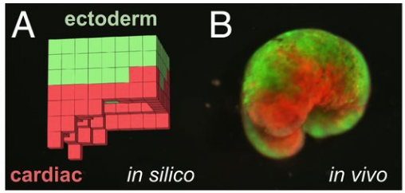

class: middle, center

# GP for Continuous Control: Teacher or Learner? The Case of Simulated Modular Soft Robots

### _Eric Medvet_, Giorgia Nadizar

.h10ex[]
.hspace5[]
.h10ex[]

Evolutionary Robotics and Artificial Life Lab, University of Trieste, Italy

#### GPTP 2023, Michigan State University, East Lansing, 2/6/2023

---

# Regression vs. control

.cols[
.c50[
**Regression**: given some data, **find** a function that fits the data.

.w75p.center[]

When optimizing .col1[$f$]:
- time does not matter
- data .col2[$(\\vect{x}^{(i)},y^{(i)})_i$] is freezed

]
.c50[
**Control**: given a dynamical system, **find** *a way* to make it steer towards a goal.

.w75p.center[]

When optimizing the .col1[controller]:
- time matters
- .col2[environment] is freezed, $(o^{(k)})_k$ may change 
]
]

---

## Control and special cases

In general, the .col1[controller] is $f\_C,g\_C$:
.cols[
.c50.center[
$g\_C: S\_C \\times O \\to S\_C$  
$f\_C: S\_C \\times O \\to A$
]
.c50.center[
$s\_C^{(k)}=g\_C(s\_C^{(k-1)}, o^{(k)})$  
$a^{(k)}=f\_C(s\_C^{(k)}, o^{(k)})$
]
]
The .col2[environment] is a dynamical system $f\_E,g\_E$ too.

Special case of practical relevance (**continuous control**): $O = \\mathbb{R}^n$, $A = \\mathbb{R}^m$.

Further special case of practical relevance (**stateless controller**):
.center[
$S\_C = \\emptyset$  
$f\_C: O \\to A$
]
- the controller is just a stateless $f_C$, but the overall system (controller + environment) is still dynamic!

---

## Control with an $f: \\mathbb{R}^n \\to \\mathbb{R}^m$

When the controller is defined by "just" an $f: \\mathbb{R}^n \\to \\mathbb{R}^m$, **finding** a .col1[controller] is solving a search problem in the space of functions, $\\approx$ (multivariate) regression.

.cols[
.c50[
**(Multivariate) regression**: given some data, **find** an .col1[$f: \\mathbb{R}^n \\to \\mathbb{R}^m$] that fits the data .col2[$(\\vect{x}^{(i)},y^{(i)})_i$].
]
.c50[
**Control**: given an environment, **find** an .col1[$f: \\mathbb{R}^n \\to \\mathbb{R}^m$] that makes the environment .col2[$f\_E,g\_E$] steer towards a goal.
]
]

.center[
$\\downarrow$

The same search methods might work for both cases. .note[maybe...]
]

---

# Research questions

1. Is **GP** good for **continuous control**? .note[**It is** for regression!] 
  - Is it better than a common alternative (MLP+GA)?
  - Are GP-generated controllers different than the baseline?
  
2. Is optimizing a controller different than fitting some data?
  - Can controller optimization be cast as a form of regression?
  
Here: in the context of **simulated modular soft robots**

---

# Simulated modular soft robots

.cols[
.c50.center[
<video width="280" height="210" autoplay loop>
    <source src="videos/ga-1-001.mp4" type="video/mp4"/>
</video>
]
.c50.center[
.w75p[]
]
]

**Voxel-based soft robots** (VSRs):
- **simulated** in discrete time, in **2-D**
- at each $k$, each square may expand or contract
  - this is what the controller decides
- softness simulated through spring-hamper systems (dynamical system!)
  - actuation as instantaneous rest-length change

Most of the dynamics is in the mechanical part, rather than in the controller
.note["embodied" intelligence, *morphological* computation, ...]

---

## Practical relevance

.cols[
.c30[
.w100p[]

W/ foam cubes.

.refnote[Hiller, Jonathan, and Hod Lipson. "Automatic design and manufacture of soft robots." IEEE Transactions on Robotics 28.2 (2011): 457-466.]
]
.c30[
.w100p[]

W/ living cells!

.refnote[Kriegman, Sam, et al. "A scalable pipeline for designing reconfigurable organisms." Proceedings of the National Academy of Sciences 117.4 (2020): 1853-1859.]
]
.c30[
.w100p[]

W/ sylicon boxes.

.refnote[Legrand, Julie, et al. "Reconfigurable, multi-material, voxel-based soft robots." IEEE Robotics and Automation Letters (2023).]
]
]

Currently, reality is very far from simulation.
But...

---

## The controller

Here, a **distributed controller**:
$$\\left[v\_{x,y}^{(k)} \\; \\vect{c}\_{x,y}^{(k)}\\right] = f\\left(\\left[\vect{r}\_{x,y}^{(k)} \\; \\vect{c}\_{x,y-1}^{(k-1)} \\; \\vect{c}\_{x,y+1}^{(k-1)} \\; \\vect{c}\_{x+1,y}^{(k-1)} \\; \\vect{c}\_{x+1,y}^{(k-1)}\\right] \\right)$$

.cols[
.c60.compact[
- the **same .col1[$f$]** inside each voxel
- observation $\\c{3}{o^{(k)}} \\in O = \\mathbb{R}^{4+4n\_c}$
  - $4$ local sensor readings $\\vect{r}\_{x,y}^{(k)}$
  - $4n\\sub{c}$ values from neighb. voxels $\\vect{r}\_{x',y'}^{(k)}$
- action $\\c{4}{a^{(k)}} \\in A = \\mathbb{R}^{1+n\_c}$
  - $1$ local comtract/expand value
  - $n\_c$ values to neighb. voxels
]
.c40[
.w75p.center[]
]
]

---

## Why VSRs?

.cols[
.c60[
For each controller .col1[$f$], the environment is *everything else*:
- local sensors (as input), local actuator (as output), local mechanical model
- other voxels (controller + mechanical model)
- actual environment (terrain)
]
.c40[
.w75p.center[]
]
]

The **overall dynamics** comes more from the "body" than from the "brain".
- likely this control task is very different from regression

---

# Finding the $f$

Using evolutionary optimization:
- **representation**: what's the search space $G$ and how an $g \\in G$ represents an $f: \\mathbb{R}^n \\to \\mathbb{R}^m$
- evolutionary algorithm (**EA**): how to search over $G$

While searchingm, each $f$ is evaluated **through simulation**.

Three contenders:
- MLP + GA
- multi-tree GP
- GraphEA

---

## MLP + GA

.cols[
.c60.compact[
Representation:
- an $f$ is an **MLP with a predefined topology**
  - $n$ inputs, $m$ outputs .note[1 hidden layer w\ $0.65 n$ nodes]
- $G = \\mathbb{R}^p$, with $p$ given by the topology

EA:
- pretty standard EA
  - overlapping
  - tournament selection for reproduction
  - truncation selection for survival selection
- genetic operators for $\\mathbb{R}^p$
  - Gaussian mutation
  - geometric crossover

Widely used for control of robots and alike
- "sota" with VSRs
]
.c40[
.w75p.center[]
]
]

---

## Multi-tree GP

.cols[
.c60.compact[
Representation:
- an $f$ is a **list of $m$** regression trees
  - each using 0+ of $n$ input vars
- $G = T^m\_{n,O,C}$
  - $O = \\{+,-,\\times,\\div\\}$
  - $C = \\{0,0.5,1,\\dots,5\\}$
- $\\tanh$ on outputs to enforce $\\in [-1,1]$

EA:
- pretty standard EA (as above)
- genetic operators for $T^m\_{n,O,C}$
  - element-wise standard subtree mutation
  - element-wise standard tree crossover
  - uniform crossover
- **diversity promotion scheme**

Never used on VSRs.
]
.c40[
.w75p.center[]
]
]

---

## GraphEA

.cols[
.c60.compact[
Representation:
- an $f$ is a **graph**
  - $n$ input nodes, $m$ output nodes
  - $|C|$ nodes with constants
  - inner nodes with operators $O$
- $G = \\mathcal{G}\_{n,m,O,C}$
  - $O = \\{+,-,\\times,\\div\\}$
  - $C = \\{0,0.5,1,\\dots,5\\}$
- $\\tanh$ on outputs to enforce $\\in [-1,1]$

EA:
- **speciation**
- genetic operators for $\\mathcal{G}\_{n,m,O,C}$
  - a few mutations

Never used on VSRs.
]
.c40[
.w75p.center[]
]
]

---

# Direct evolution

---

# Imitation learning

---

# VSR distributed controller

---

class: center

# Recap

.cols[
.c50[
.h40ex[]

]
.c50[

Authors:

.h10ex[]
.h10ex[]  
<i class="fa fa-twitter" aria-hidden="true"></i> [@EricMedvetTs](https://twitter.com/EricMedvetTs)  
<i class="fa fa-twitter" aria-hidden="true"></i> [@GNadizar](https://twitter.com/GNadizar)

Contact:

<i class="fa fa-envelope" aria-hidden="true"></i> [emedvet@units.it](mailto:emedvet@units.it)    
<i class="fa fa-twitter" aria-hidden="true"></i> [@EralLabTs](https://twitter.com/EralLabTs)
]
]

