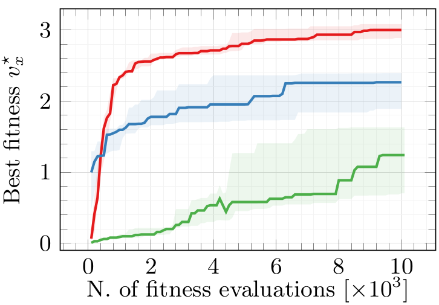

class: middle, center

# GP for Continuous Control: Teacher or Learner? The Case of Simulated Modular Soft Robots

### _Eric Medvet_, Giorgia Nadizar

.h10ex[]
.hspace5[]
.h10ex[]

Evolutionary Robotics and Artificial Life Lab, University of Trieste, Italy

#### GPTP 2023, Michigan State University, East Lansing, 2/6/2023

---

# Regression vs. control

.cols[
.c50[
**Regression**: given some data, **find** a function that fits the data.

.w75p.center[]

When optimizing .col1[$f$]:
- time does not matter
- data .col2[$\\left(\\vect{x}^{(i)},y^{(i)}\\right)_i$] is fixed

]
.c50[
**Control**: given a dynamical system, **find** *a way* to make it steer towards a goal.

.w75p.center[]

When optimizing the .col1[controller]:
- time matters
- .col2[environment] is fixed, $\\left(o^{(k)}\\right)_k$ may change 
]
]

---

## Control and special cases

In general, the .col1[controller] is $(f\_C,h\_C)$:
.cols[
.c50.center[
$h\_C: S\_C \\times O \\to S\_C$  
$f\_C: S\_C \\times O \\to A$
]
.c50.center[
$s\_C^{(k)}=h\_C\\left(s\_C^{(k-1)}, o^{(k)}\\right)$  
$a^{(k)}=f\_C\\left(s\_C^{(k)}, o^{(k)}\\right)$
]
]
The .col2[environment] is a dynamical system $(f\_E,h\_E)$ too.

Special case of practical relevance (**continuous control**): $O = \\mathbb{R}^n$, $A = \\mathbb{R}^m$.

Further special case of practical relevance (**stateless controller**):
.center[
$S\_C = \\emptyset$  
$f\_C: O \\to A$
]
- the controller is just a stateless $f_C$, but the overall system (controller + environment) is still dynamic!

---

## Control with an $f: \\mathbb{R}^n \\to \\mathbb{R}^m$

When the controller is defined by "just" an $f: \\mathbb{R}^n \\to \\mathbb{R}^m$, **finding** a .col1[controller] is solving a search problem in the space of functions, $\\approx$ (multivariate) regression.

.cols[
.c50[
**(Multivariate) regression**: given some data, **find** an .col1[$f: \\mathbb{R}^n \\to \\mathbb{R}^m$] that fits the data .col2[$\\left(\\vect{x}^{(i)},y^{(i)}\\right)_i$].
]
.c50[
**Control**: given an environment, **find** an .col1[$f: \\mathbb{R}^n \\to \\mathbb{R}^m$] that makes the environment .col2[$(f\_E,h\_E)$] steer towards a goal.
]
]

.center[
$\\downarrow$

The same search methods might work for both cases. .note[maybe...]
]

---

# Research questions

1. Is **GP** good for **continuous control**? .note[**It is** for regression!] 
  - Is it better than a common alternative (MLP+GA)?
  - Are GP-generated controllers different than the baseline?
  
2. Is optimizing a controller different than fitting some data?
  - Can controller optimization be cast as a form of regression?
  
Here: in the context of **simulated modular soft robots**

---

# Simulated modular soft robots

.cols[
.c50.center[
<video width="280" height="210" autoplay loop>
    <source src="videos/ga-1-001.mp4" type="video/mp4"/>
</video>
]
.c50.center[
.h15ex[]
]
]
**Voxel-based soft robots** (VSRs):
- **simulated** in discrete time, in **2-D**
- at each $k$, each square may expand ($+1$) or contract ($-1$)
  - this is what the controller decides
- softness simulated through spring-damper systems (dynamical system!)
  - actuation as instantaneous rest-length change

Most of the dynamics is in the mechanical part, rather than in the controller
.note["embodied" intelligence, *morphological* computation, ...]

---

## Practical relevance

.cols[
.c30[
.w100p[]
]
.c30[
.w100p[]
]
.c30[
.w100p[]
]
]

.cols[
.c30[
W/ foam cubes.

.refnote[Hiller, Jonathan, and Hod Lipson. "Automatic design and manufacture of soft robots." IEEE Transactions on Robotics 28.2 (2011): 457-466.]
]
.c30[
W/ living cells!

.refnote[Kriegman, Sam, et al. "A scalable pipeline for designing reconfigurable organisms." Proceedings of the National Academy of Sciences 117.4 (2020): 1853-1859.]
]
.c30[
W/ sylicon boxes.

.refnote[Legrand, Julie, et al. "Reconfigurable, multi-material, voxel-based soft robots." IEEE Robotics and Automation Letters (2023).]
]
]

Currently, reality is very far from simulation.
But...

---

## The controller

Here, a **distributed controller**:
$$\\c{3}{\\left[v\_{x,y}^{(k)} \\; \\vect{c}\_{x,y}^{(k)}\\right]} = f\\left(\\c{4}{\\left[\vect{r}\_{x,y}^{(k)} \\; \\vect{c}\_{x,y-1}^{(k-1)} \\; \\vect{c}\_{x,y+1}^{(k-1)} \\; \\vect{c}\_{x+1,y}^{(k-1)} \\; \\vect{c}\_{x+1,y}^{(k-1)}\\right]} \\right)$$

.cols[
.c60.compact[
- the **same .col1[$f$]** inside each voxel
- observation $\\c{3}{o^{(k)}} \\in O = \\mathbb{R}^{4+4 n\\subtext{comm}}$
  - $4$ local sensor readings .col3[$\\vect{r}\_{x,y}^{(k)}$]
  - $4 n\\subtext{comm}$ values from adjacent voxels .col3[$\\vect{c}\_{x',y'}^{(k)}$]
- action $\\c{4}{a^{(k)}} \\in A = \\mathbb{R}^{1+n\\subtext{comm}}$
  - $1$ local contract/expand value .col4[$v\_{x,y}^{(k)}$]
  - $n\\subtext{comm}$ values to adjacent voxels .col4[$\\vect{c}\_{x,y}^{(k)}$]
]
.c40[
.w75p.center[]
]
]

Practical relevance (potential): enables true modularity $\\rightarrow$ **collective intelligence**!  
.refnote[Nadizar, Giorgia, et al. "A Fully-distributed Shape-aware Neural Controller for Modular Robots." Proceedings of the Genetic and Evolutionary Computation Conference. 2023.]
.refnote[Nadizar, Giorgia, et al. "Collective control of modular soft robots via embodied Spiking Neural Cellular Automata." arXiv preprint arXiv:2204.02099 (2022).]

---

## Why VSRs?

.cols[
.c60[
For each controller .col1[$f$], **the environment is _everything else_**:
- local sensors (as input), local actuator (as output), local mechanical model
- other voxels (controller + mechanical model)
- actual environment (terrain)
]
.c40[
.w75p.center[]
]
]

The **overall dynamics** comes more from the "body" than from the "brain".
- likely this control task is very different from regression

---

# Finding the $f$

Using evolutionary optimization:
- **representation**: what's the search space $G$ and how a $g \\in G$ represents an $f: \\mathbb{R}^n \\to \\mathbb{R}^m$
- evolutionary algorithm (**EA**): how to search over $G$

While searching, each $f$ is evaluated **through simulation**.

Three contenders:
- MLP+GA
- multi-tree GP
- GraphEA

---

## NE (i.e., MLP+GA)

.cols[
.c60.compact[
Representation:
- an $f$ is an **MLP with a predefined topology**
  - $n$ inputs, $m$ outputs .note[1 hidden layer w/ $0.65 n$ nodes]
  - $\\tanh$ as activation function
- $G = \\mathbb{R}^p$, with $p$ given by the topology

EA:
- pretty standard EA
  - overlapping
  - tournament selection for reproduction
  - truncation selection for survival selection
- genetic operators for $\\mathbb{R}^p$
  - Gaussian mutation
  - geometric crossover

Widely used for control of robots and alike
- "sota" with VSRs
- a form of **neuroevolution** (NE)
]
.c40[
.w100p.center[]
]
]

---

## Multi-GP

.cols[
.c60.compact[
Representation:
- an $f$ is a **list of $m$ regression trees**
  - each using 0+ of $n$ input vars
- $G = T^m\_{n,O,C} = T\_{n,O,C} \\times \\dots \\times T\_{n,O,C}$
  - $O = \\{+,-,\\times,\\div\\}$
  - $C = \\{0,0.5,1,\\dots,5\\}$
- $\\tanh$ on outputs to enforce $\\in [-1,1]$

EA:
- pretty standard EA (as above)
- genetic operators for $T^m\_{n,O,C}$
  - element-wise standard subtree mutation
  - element-wise standard tree crossover
  - uniform crossover
- **diversity promotion scheme**

Never used on VSRs.
]
.c40[
.w100p.center[]
]
]

---

## GraphEA

.cols[
.c60.compact[
Representation:
- an $f$ is a **graph**
  - $n$ input nodes, $m$ output nodes
  - $|C|$ nodes with constants
  - inner nodes with operators $O$
- $G = \\mathcal{G}\_{n,m,O,C}$
  - $O = \\{+,-,\\times,\\div, \\log\\}$
  - $C = \\{0,0.5,1,\\dots,5\\}$
- $\\tanh$ on outputs to enforce $\\in [-1,1]$

EA:
- **speciation**
- genetic operators for $\\mathcal{G}\_{n,m,O,C}$
  - a few mutations

Never used on VSRs.

.note[Why not CGP?]
]
.c40[
.w100p.center[]
]
]

---

# Direct evolution (DE)

Task: **locomotion**
- fitness: average velocity in a simulation of 30 seconds
- two cases: $n\\subtext{comm}=1$ and $n\\subtext{comm}=3$ ($\\approx$ search space size)
- 10 runs

Point of view:
> **Control**: given a dynamical system, **find** *a way* to make it steer towards a goal.

Dynamical system? Goal?
- dynamical system: VSR + environment
- state $s^{(k)}$ of the dynamical system:
  - $s^{(k)}$ is the VSR $x$-position $\\Rightarrow$ goal is non-equilib. ($\\lim\_{k \\to +\\infty} s^{(k)} = +\\infty$)
  - $s^{(k)}$ is the VSR $x$-velocity $\\Rightarrow$ goal is point equilibrium $v\_\\text{max}$
  - $s^{(k)}$ is the VSR pose $\\Rightarrow$ goal is a cyclic equilibrium

---

## DE results: best fitness

.w100p.center[]

Findings:
- both NE and multi-GP converge; GraphEA does not
- multi-GP $\simeq$ NE with $n\\subtext{comm}=3$, i.e., with larger search space .note[unexpected?]

---

## DE results: best size

.w100p.center[]

Findings:
- both NE and multi-GP converge; GraphEA does not
- multi-GP solutions are not proportionally larger for $n\\subtext{comm}=3$
  - single trees are smaller!

---

## DE results: behavior ($n\\subtext{comm}=1$)

.cols.compact[
.c30.center[
NE, $n\\subtext{comm}=1$, seed 1

<video width="280" height="210" autoplay loop>
    <source src="videos/ga-1-001.mp4" type="video/mp4"/>
</video>
]
.c30.center[
Multi-GP, $n\\subtext{comm}=1$, seed 1

<video width="280" height="210" autoplay loop>
    <source src="videos/gp-1-001.mp4" type="video/mp4"/>
</video>
]
.c30.center[
GraphEA, $n\\subtext{comm}=1$, seed 1

<video width="280" height="210" autoplay loop>
    <source src="videos/graphea-1-001.mp4" type="video/mp4"/>
</video> 
]
]

Findings:
- NE behavior is smoother
- GP, GraphEA look like **bang-bang** control

---

## DE results: behavior ($n\\subtext{comm}=3$)

.cols.compact[
.c30.center[
NE, $n\\subtext{comm}=3$, seed 1

<video width="280" height="210" autoplay loop>
    <source src="videos/ga-3-001.mp4" type="video/mp4"/>
</video> 
]
.c30.center[
Multi-GP, $n\\subtext{comm}=3$, seed 1

<video width="280" height="210" autoplay loop>
    <source src="videos/gp-3-001.mp4" type="video/mp4"/>
</video> 
]
.c30.center[
GraphEA, $n\\subtext{comm}=3$, seed 1

<video width="280" height="210" autoplay loop>
    <source src="videos/graphea-3-001.mp4" type="video/mp4"/>
</video>
]
]

Findings:
- NE behavior is "same as" $n\\subtext{comm}=1$
- GP looks even more like bang-bang control
  - "denser recurrency" makes the search easier for GP

---

## Research ~~questions~~ answers

1. Is **GP** good for **continuous control**?  
.col1[Yes] .note[no tuning of params, vanilla GP, no sofistications]
  - Is it better than a common alternative (MLP+GA)?  
  .col1[Not terribly worse]
  - Are GP-generated controllers different than the baseline?  
  .col1[Yes, less smooth, more like bang-bang]
  
---

# Offline imitation learning (OIL)

In direct evolution, the candidate $f$ may directly interact with the environment.

What if we look for a $f$ that aims at reproducing the "behavior" of another $f'$?
- $f$: the learner
- $f'$: the teacher
- "behavior": pairs $\\left(o^{(k)},a^{(k)}\\right)\_k$ (i.e., $\\left(\\vect{x}^{(k)},\\vect{y}^{(k)}\\right)\_k$ generated by $f'$
- a form of **offline imitation learning**
  - offline: $f$ cannot directly experience the environment
  - imitation: $f \\leftarrow \\left(\\vect{x}^{(k)},\\vect{y}^{(k)}\\right)\_k \\leftarrow f'$

In principle, offline imitation learning is **closer to multivariate regression** than direct evolution. 

---

## Procedure

For each $n\\subtext{comm}$:
1. obtain the teachers' behaviors
  - for each teacher $f'$, get $\\left(\\vect{x}^{(k)},\\vect{y}^{(k)}\\right)\_k$ .note[$10 \\times 3$ times]  
  .note[one sample every 0.2s, subsampling $\\rightarrow$ 375 samples]
2. do OIL, i.e., solve multivariate regression (**learning**)
  - for each $\\left(\\vect{x}^{(k)},\\vect{y}^{(k)}\\right)\_k$ .note[$10 \\times 3$ times], perform 5 EA runs for NE, multi-GP, GraphEA .note[$5 \\times 3$ times]  
  - using average MSE (across the $m$ vars) as fitness
3. for each evolved $f$, put it inside a VSR and assess it ("**embodiment**") .note[$10 \\times 3 \\times 5 \\times 3 = 450$ times]

---

## OIL: phase 2, learning

.cols[
.c70[
.w100p.center[]
]
.c30.compact[
Findings:
- NE, multi-GP converge
- NE is the best learner; GraphEA the worst
- Multi-GP (teacher) behavior with $n\\subtext{comm}=3$ is the hardest to learn
  - the "most bang-bang"ish
]
]

---

## OIL: phase 3, "embodiment"

.w100p.center[]

.cols[
.c70[
Finding:
- **offline imitation learning does not work**!
  - at most $v\_x=0.12$ (NE from NE, $n\\subtext{comm}=1$) or $0.15$ (multi-GP from multi-GP, $n\\subtext{comm}=3$), was $\\approx 3$ with direct evolution
]
.c30[
.w100p.center[]
]
]

---

## Research ~~questions~~ answers

1. Is **GP** good for **continuous control**?  
.col1[Yes] .note[no tuning of params, vanilla GP, no sofistication]
  - Is it better than a common alternative (MLP+GA)?  
  .col1[Not terribly worse]
  - Are GP-generated controllers different than the baseline?  
  .col1[Yes, less smooth, more like bang-bang]
2. Is optimizing a controller different than fitting some data?  
.col1[Yes! A lot!] .note[with this GP, in this scenario, i.e., with these VSRs, these sensors, ...]
  - Can controller optimization be cast as a form of regression?  
  .col1[Yes, but it **does not work**!]

---

# Lesson learned, perspectives

.note[with this GP, in this scenario, i.e., with these VSRs, these sensors, ...]

Controller evolution for VSRs likely has a very rugged fitness lanscape:
- many "optima"
- slighlty perturbing a good solution is disruptive  
.refnote[Medvet, Eric, and Francesco Rusin. "Impact of Morphology Variations on Evolved Neural Controllers for Modular Robots." Artificial Life and Evolutionary Computation: 16th Italian Workshop, WIVACE 2022, Gaeta, Italy, September 14–16, 2022, Revised Selected Papers. Cham: Springer Nature Switzerland, 2023.]
- attempting to imitate a good solution does not give a good solution

The quality of a controller is to "match" the body dynamics, rather than to determine it!
- direct evolution permits an explorative interaction with the dynamics, imitation learning does not
  - sort-of Baldwin effect  
  .refnote[Pigozzi, Federico, et al. "How the Morphology Encoding Influences the Learning Ability in Body-Brain Co-Optimization"; ACM Genetic and Evolutionary Computation Conference (GECCO); 2023]

---

class: center

# Recap

.cols[
.c50[
.h40ex[]

]
.c50[

Authors:

.h10ex[]
.h10ex[]  
<i class="fa fa-twitter" aria-hidden="true"></i> [@EricMedvetTs](https://twitter.com/EricMedvetTs)  
<i class="fa fa-twitter" aria-hidden="true"></i> [@GNadizar](https://twitter.com/GNadizar)

Contact:

[medvet.inginf.units.it](https://medvet.inginf.units.it/)  
<i class="fa fa-envelope" aria-hidden="true"></i> [emedvet@units.it](mailto:emedvet@units.it)  
<i class="fa fa-twitter" aria-hidden="true"></i> [@EralLabTs](https://twitter.com/EralLabTs)
]
]

