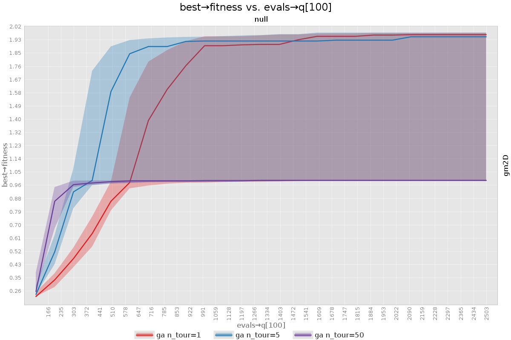
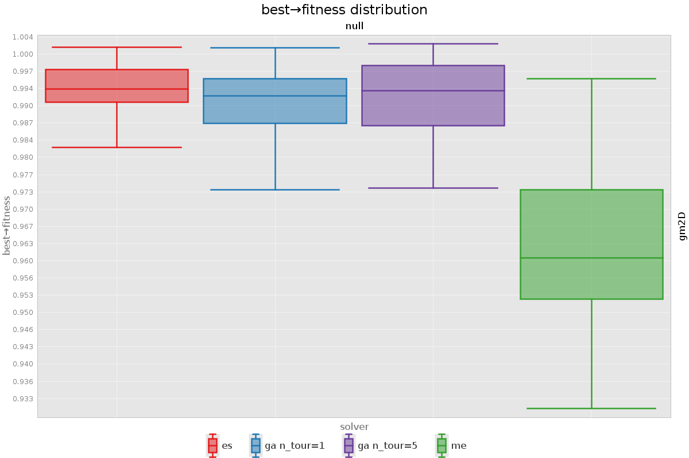
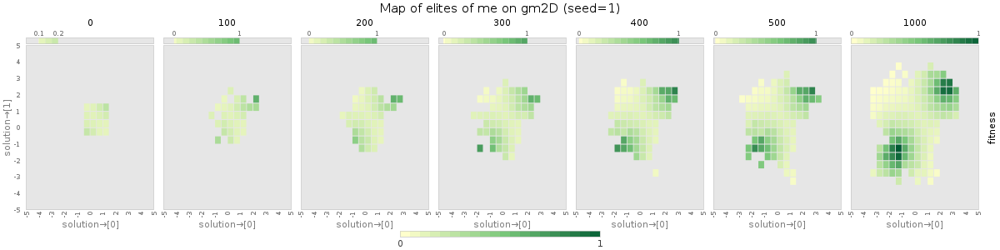
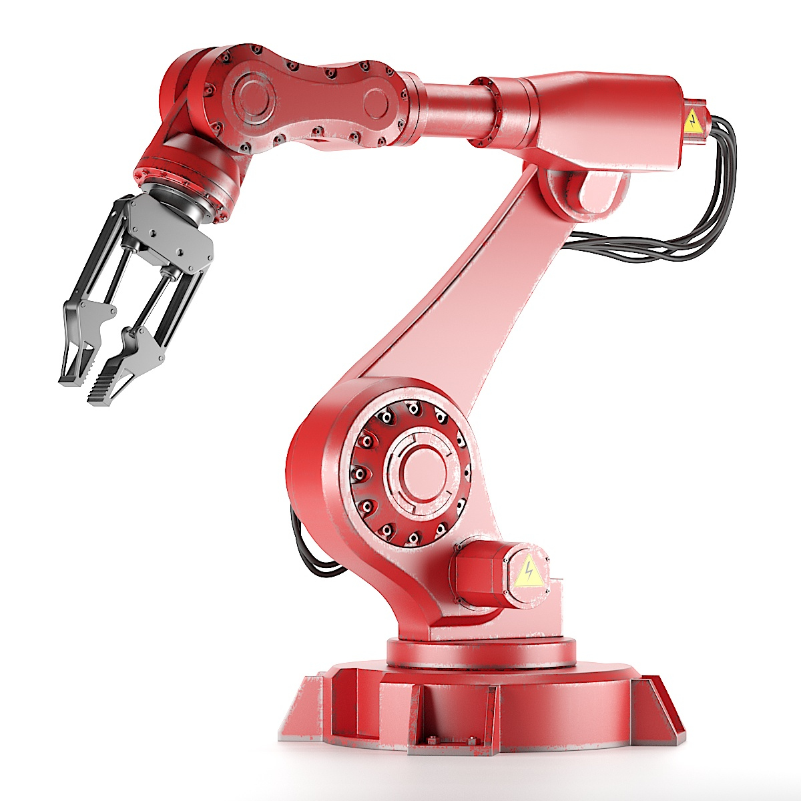
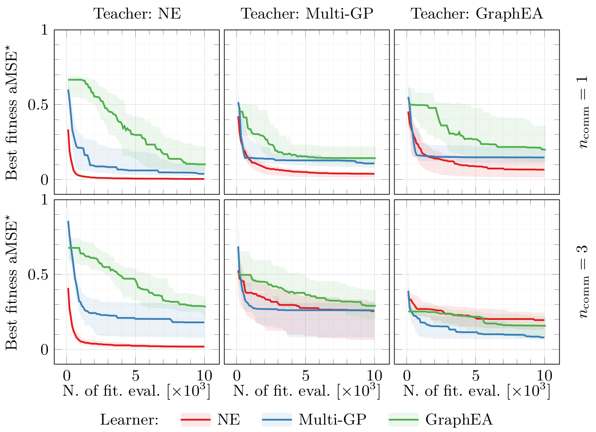

class: middle, center

# Evolutionary robotics

### in a nutshell

[Eric Medvet](http://medvet.inginf.units.it/)

February 2024 - Liceo Scientifico Galileo Galilei Trieste

---

## What is evolutionary robotics?

.important[
.key[Evolutionary robotics] is the science of applying **evolutionary computation** for the _optimization_ of the body, the brain, or both of **robots**.
]

---

class: middle, center

# Evolutionary computation

---

## The problem

Given:
- a set $S$
- a **partial order** $\\prec$ over $S$
  - $s\_1 \\prec s\_2$ reads "$s\_1$ is better than $s\_2$"
  - formally $\\prec: S \\times S \\to \\{\\text{first}, \\text{second}, \\text{same}, \\text{not-comparable}\\}$
  
The pair $(S,\\prec)$ is an .key[global optimization problem]. .note[$\\prec$ alone is the problem, $S$ is implicit, since $\\prec$ implicitly defines $S$]
- $S$: .key[solution space] or .key[search space], *where to search for a solution?*
- $\\prec$: *what to search for?*

.vspace1[]

The goal is to find the set $S^\\star$ of **optimal solutions**:
$$S^\\star = \\{s \\in S: \\forall s' \\in S, s' \\not\\prec s\\}$$
- **global**, because we look for $S^\\star$ elements in the entire $S$
- not simply a $s^\\star=\\argmax_\{s \in S\}$, because $\\prec$ is just a partial order!

---

## Very broad

$S$ can be **any** set!
- discrete or continuous
- finite or infinite
- naturally ordered or not
- with or without a natural metric defined on it
- ...

.example[Examples]:
.cols[
.c30[
**Regression models** on $\\mathbb{R}^p$
- $S = \\mathcal{F}\_{\\mathbb{R}^p \\to \\mathbb{R}}$
- $s\_1 \\prec s\_2$ iff $s\_1$ better fits (e.g., with MSE) a given dataset $D=\\bag{(\\vect{x}^{(i)}, y^{(i)})}\_{i}$
.note[here, $\\prec$ is indeed a total order]
]
.c30[
**Sorting** of arrays
- $S = \\{\\text{sorting programs}\\}$
.note[in a given programming language, with the proper interface]
- $s\_1 \\prec s\_2$ iff  $s\_1$ "sorts better" than $s\_2$ some arrays $A \\subset \\mathbb{R}^*=\\bigcup_{i=1}^{i=\\infty} \\mathbb{R}^i$
]
.c30[
**Robot control policies**
- $S = \\{\\text{controllers}$ $\\text{for robot } R\\}$
- $s\_1 \\prec s\_2$ iff $R$ with $s\_1$ performs better than $R$ with $s\_2$ on task $T$
]
]

For all cases, many other problem instances with same $S$ and different $\\prec$!

---

## One single approach?

Is there a **single approach** for solving $(S, \\prec)$ that works **for any $S$ and any $\\prec$**?

.note[For a few "kinds" of $S$ (and $\\prec$) there are many effective/efficient ways for solving $(S, \\prec)$ problems, e.g., $S=\\mathbb{R}^p$]

--

.vspace1[]

One source of *inspiration*: **natural evolution**!

- $S = \\{\\text{natural things}\\}$ .note[things one can build with physical matter]
- $s\_1 \\prec s\_2$ iff $s\_1$ is more **able to be alive** than $s\_2$

**Natural evolution** is long (and ongoing) process, after which we have a pretty good set $S^\\star$ of things that are able to be alive!

---

## Evolutionary computation

.important[
.key[Evolutionary computation] (EC) is the science of designing, developing, and using algorithms inspired by natural evolution for solving optimization problems.
]

.vspace1[]

.key[Evolutionary algorithms] (EAs) differ in:
- **effectiveness**: how well they solve optimization problems
- **efficiency**: how many resources they take to solve problems
- **applicability**: how many constraints they impose on $S$ and $\\prec$, how other components they require to users

.vspace1[]

.cols[
.c50[
Close relatives:
- global optimization (GO)
- bio-inspired optimization (BIO)
- population-based optimization (PO)
]
.c50[
... and relationships:
- GO $\\supset$ BIO $\\supseteq$ PO $\\supset$ EC
.note[but boundaries are not sharp!]
]
]

---

## Evolution: general scheme

What happens in reality:
- a **population of individuals** compete for limited resources
- individuals **die and are born** (the population is dynamic)
- fittest individuals **reproduce** and survive **more**
- offspring **inherit some characters** from parents (they are similar, but not identical)

.vspace1[]

Can we run this scheme on a computer?

---

## A first EA

.cols[
.c50.compact[
Ingredients (i.e., parameters):
1. a probability distribution .col2[$B$] over $S$ .note[$B$ for builder]
  - $B \\in \\mathcal{P}\_S$, i.e., $B: S \to [0,1]$, with $\\sum\_{s \\in S} B(s) = 1$
  - $s \\setsample B$ denotes sampling from $B$, briefly $\\sim B$
2. a stochastic (unary) operator .col2[$o\\subtext{mut}$] on $S$ (**mutation**)
  - $o\\subtext{mut}: S \\to \\mathcal{P}\_S$, $s' \\setsample o\\subtext{mut}(s)$
3. a stochastic binary operator .col2[$o\\subtext{xover}$] on $S$ (**crossover**)
  - $o\\subtext{xover}: S \\times S \\to \\mathcal{P}\_S$, $s' \\setsample o\\subtext{mut}(s\_1,s\_2)$
4. a population size $\\c{2}{n\\subtext{pop}} \\in \\mathbb{N}$
5. a number of iterations $\\c{2}{n\\subtext{gen}} \\in \\mathbb{N}$
6. a reproduction **selection criterion** .col2[$c\\subtext{repr}$]
  - given a bag $A$ and a partial order $\\prec$ on $A$, $c\\subtext{repr}(A,\\prec) \\in \\mathcal{P}\_A$
7. a $\\neg$survival **selection criterion** .col2[$c\\subtext{die}$]

1, 2, 3 depend on $S$; 6, 7 may depend on $S$; 4, 5 are $S$ agnostic
]
.c50[
.pseudo-code.compact[
function $\\text{solve}(\\c{1}{\\prec}; \\c{2}{B, o\\subtext{mut}, o\\subtext{xover}, n\\subtext{pop}, n\\subtext{gen}, c\\subtext{repr}, c\\subtext{die}})$ {  
.i[]$S\\subtext{pop} \\seteq \\bag{}$ .comment[// $S'$ is a bag of .key[candidate solutions]]   
.i[]while $|S\\subtext{pop}| < n\\subtext{pop}$ { .comment[// population initialization]  
.i[].i[]$S\\subtext{pop} \\seteq S\\subtext{pop} \\oplus \\bag{\\sim B}$  
.i[]}  
.i[]$n \\seteq 0$  
.i[]while $n < n\\subtext{gen}$ { .comment[// iterations (aka .key[generations])]  
.i[].i[]$n \\seteq n+1$  
.i[].i[]$S\\subtext{offspring} \\seteq \\bag{}$ .comment[// bag of "children" (aka .key[offspring])]  
.i[].i[]while $|S\\subtext{offspring}| < n\\subtext{pop}$ { .comment[// reproduction]  
.i[].i[].i[]$s\_1 \\setsample c\\subtext{repr}(S\\subtext{pop},\\prec)$ .comment[// first .key[parent]]  
.i[].i[].i[]$s\_2 \\setsample c\\subtext{repr}(S\\subtext{pop}, \\prec)$ .comment[// second .key[parent]]  
.i[].i[].i[]$s' \\setsample o\\subtext{mut}(\\sim o\\subtext{xover}(s\_1, s\_2))$ .comment[// .key[variation]]  
.i[].i[].i[]$S\\subtext{offspring} \\seteq S\\subtext{offspring} \\oplus \\bag{s'}$  
.i[].i[]}  
.i[].i[]$S\\subtext{pop} \\seteq S\\subtext{pop} \\oplus S\\subtext{offspring}$  
.i[].i[]while $|S\\subtext{pop}| > n\\subtext{pop}$ { .comment[// trim]  
.i[].i[].i[]$S\\subtext{pop} \\seteq S\\subtext{pop} \\ominus \\bag{\\sim c\\subtext{die}(S\\subtext{pop},\\prec)}$  
.i[].i[]}  
.i[]}  
.i[]return .col3[$S\\subtext{pop}$]  
}
]
.compact[
.col1[Input: $\\prec$] .note[and, implicitly, $S$] .hspace5[] .col3[Output: $S\\subtext{pop}$]  
.col2[Params: $B, o\\subtext{mut}, o\\subtext{xover}, n\\subtext{pop}, n\\subtext{gen}, c\\subtext{repr}, c\\subtext{die}$]
]
]
]

---

### Link with general scheme

.cols[
.c50[
- a population of individuals .col1[compete for limited resources]
  - resource: the right to stay in the population
- individuals die and are born (the population is dynamic)
  - in a synchronized way, .col2[time flows **through generations**]
  - "life" is istantaneous
- fittest individuals .col3[reproduce] and .col1[survive more]
  - actually depends on $c\\subtext{repr}$ and $c\\subtext{die}$
- offspring .col4[inherit some characters from parents] (they are similar, but not identical)
  - actually depends on $o\\subtext{mut}$ and $o\\subtext{xover}$
  
**Effectiveness**? Efficiency? **Applicability**?
- depend on the parameters

]
.c50[
.pseudo-code.compact[
function $\\text{solve}(\\prec; B, o\\subtext{mut}, o\\subtext{xover}, n\\subtext{pop}, n\\subtext{gen}, c\\subtext{repr}, c\\subtext{die})$ {  
.i[]$S\\subtext{pop} \\seteq \\bag{}$  
.i[]while $|S\\subtext{pop}| < n\\subtext{pop}$ {  
.i[].i[]$S\\subtext{pop} \\seteq S\\subtext{pop} \\oplus \\bag{\\sim B}$  
.i[]}  
.i[]$n \\seteq 0$  
.i[]while $n < n\\subtext{gen}$ {  
.i[].i[].col2[$n \\seteq n+1$]  
.i[].i[]$S\\subtext{offspring} \\seteq \\bag{}$  
.i[].i[]while $|S\\subtext{offspring}| < n\\subtext{pop}$ {  
.i[].i[].i[].col3[$s\_1 \\setsample c\\subtext{repr}(S\\subtext{pop},\\prec)$]  
.i[].i[].i[].col3[$s\_2 \\setsample c\\subtext{repr}(S\\subtext{pop}, \\prec)$]  
.i[].i[].i[]$\\c{3}{s' \\setsample} \\c{4}{o\\subtext{mut}(\\sim o\\subtext{xover}(s\_1, s\_2))}$  
.i[].i[].i[]$S\\subtext{offspring} \\seteq S\\subtext{offspring} \\c{3}{\\oplus \\bag{s'}}$  
.i[].i[]}  
.i[].i[]$S\\subtext{pop} \\seteq S\\subtext{pop} \\oplus S\\subtext{offspring}$  
.i[].i[]while $|S\\subtext{pop}| > n\\subtext{pop}$ {  
.i[].i[].i[]$S\\subtext{pop} \\seteq S\\subtext{pop} \\c{1}{\\ominus \\bag{\\sim c\\subtext{die}(S\\subtext{pop},\\prec)}}$  
.i[].i[]}  
.i[]}  
.i[]return $S\\subtext{pop}$  
}
]
]
]

---

## Problems with fitness

In the vast majority of cases, you don't compare directly the solutions, but instead you:
- have a way to **measure the quality** of any solution
- **compare the quality measure**

A .note[global optimization] problem is hence given by:
- a set $S$
- a .key[fitness function] (or quality function) $f: S \\to \\mathbb{R}$ .note[like the loss function]
- an order in $\\mathbb{R}$
  - usually a total order, namely either $<$ (**minimization** problem) or $>$ (**maximization** problem)

.vspace1[]

.example[Example]: **regression models** on $D=\\bag{(\\vect{x}^{(i)}, y^{(i)})}\_{i}$, with $\\vect{x}^{(i)} \\in \\mathbb{R}^p$
- $S = \\mathcal{F}\_{\\mathbb{R}^p \\to \\mathbb{R}}$
- $f(s)=\\text{MSE}(s;D)=\\frac{1}{|D|} \\sum\_i (s(\\vect{x}^{(i)})-y^{(i)})^2$ 
- $<$

In natural language: "find the function with the lowest MSE on $D$"

---

### Fitness proportional selection

.cols[
.c50[
.pseudo-code.compact[
function $\\text{fitProp}(S',f;\\gamma)$ {  
.i[]$W \\seteq \\bag{}$  
.i[]while $s \\in S'$ {  
.i[].i[]$W \\seteq W \\oplus \\bag{(s,f(s)^\\gamma)}$  
.i[]}  
.i[]return $\\c{1}{\\text{roulette}}(W)$  
}
]
**Assume** maximization and $f(\\cdot) \ge 0$!

**Effectiveness**:
- .good[] tunable preference .note[negative $\\gamma$ for minimization]
  - $\\gamma=0$ like uniform $\\Rightarrow$ no preference
  - $\\gamma \\rightarrow +\\infty$ like best $\\Rightarrow$ max preference
  - $\\gamma=1$ "reasonable" preference
- .bad[] preference **depends on scale of $f$** and $\\gamma$!

**Applicability**:  
- .soandso[] need to consider scale of $f$ to set $\\gamma$

**Efficiency**:  
- .good[] (after $|S'|$ fitness computation)

]
.c50[
.pseudo-code.compact[
.col1[function $\\text{roulette}(\\bag{(a^{(i)},x^{(i)})}\_{i})$] {    
.i[]$x \\setsample U([0,\\sum\_i x^{(i)}])$  
.i[]for $(a^{(i)},x^{(i)}) \\in \\bag{(a^{(i)},x^{(i)})}\\sub{i}$ {  
.i[].i[]if $x \\le x^{(i)}$ {  
.i[].i[].i[]return $a^{(i)}$  
.i[].i[]}  
.i[]}  
}
]
**Assume** maximization and $x^{(i)}\ge 0$!

The probability of an $a^{(i)}$ item to be selected is proportional to its $x^{(i)}$.

.example[Example]: in $\\bag{(a,1),(b,10),(a,4)}$
- $b$ has a probability of $\\frac{2}{3}$
- $a$ has a probability of $\\frac{1}{3}=\\frac{1}{15}+\\frac{4}{15}$
]
]

---

## $S$-dependent parameters

.cols[
.c60.compact[
.cols[
.c50[
For initialization:
- $\\c{1}{B} \\in \\mathcal{P}_S$
]
.c50[
For variation:
- $\\c{2}{o\\subtext{mut}}: S \\to \\mathcal{P}_S$
- $\\c{2}{o\\subtext{xover}}: S \\times S \\to \\mathcal{P}_S$
]
]

What does it mean "depend on $S$"?
- "regression problem on $\\mathbb{R}^{p\_1}$" $\\Rightarrow$ $B$, $o\\subtext{mut}$, $o\\subtext{xover}$ for regression models in $\\mathbb{R}^{p\_1}$
- "regression problem on $\\mathbb{R}^{p\_2}$" $\\Rightarrow$ another $B$, $o\\subtext{mut}$, $o\\subtext{xover}$
- "sorting program in Java" $\\Rightarrow$ $B$, $o\\subtext{mut}$, $o\\subtext{xover}$ for sorting programs in Java
- "sorting program in Python" $\\Rightarrow$ another $B$, $o\\subtext{mut}$, $o\\subtext{xover}$
- "robots with 6 wheels on task $T$ $\\Rightarrow$ $B$, $o\\subtext{mut}$, $o\\subtext{xover}$ for 6-wheels robot
- "robots with 8 wheels on task $T$ $\\Rightarrow$  another $B$, $o\\subtext{mut}$, $o\\subtext{xover}$
- ...

.vspace1[]

Reinvent the wheel every time! 👎👎👎
- **does not scale well** (in human terms)
]
.c40[
.pseudo-code.compact[
function $\\text{solve}(\\prec; \\c{1}{B}, \\c{2}{o\\subtext{mut}}, \\c{2}{o\\subtext{xover}}, n\\subtext{pop}, n\\subtext{evals}, c\\subtext{repr}, c\\subtext{die})$ {  
.i[]$S\\subtext{pop} \\seteq \\bag{}$  
.i[]while $|S\\subtext{pop}| < n\\subtext{pop}$ {  
.i[].i[]$S\\subtext{pop} \\seteq S\\subtext{pop} \\oplus \\bag{\\sim \\c{1}{B}}$  
.i[]}  
.i[]$n \\seteq 0$  
.i[]while $n < n\\subtext{evals}$ {  
.i[].i[]$n \\seteq n+n\\subtext{pop}$  
.i[].i[]$S\\subtext{offspring} \\seteq \\bag{}$  
.i[].i[]while $|S\\subtext{offspring}| < n\\subtext{pop}$ {  
.i[].i[].i[]$s\_1 \\setsample c\\subtext{repr}(S\\subtext{pop},\\prec)$  
.i[].i[].i[]$s\_2 \\setsample c\\subtext{repr}(S\\subtext{pop}, \\prec)$  
.i[].i[].i[]$s' \\setsample \\c{2}{o\\subtext{mut}}(\\sim \\c{2}{o\\subtext{xover}}(s\_1, s\_2))$  
.i[].i[].i[]$S\\subtext{offspring} \\seteq S\\subtext{offspring} \\oplus \\bag{s'}$  
.i[].i[]}  
.i[].i[]$S\\subtext{pop} \\seteq S\\subtext{pop} \\oplus S\\subtext{offspring}$  
.i[].i[]while $|S\\subtext{pop}| > n\\subtext{pop}$ {  
.i[].i[].i[]$S\\subtext{pop} \\seteq S\\subtext{pop} \\ominus \\bag{\\sim c\\subtext{die}(S\\subtext{pop},\\prec)}$  
.i[].i[]}  
.i[]}  
.i[]return $S\\subtext{pop}$  
}
]
]
]

---

### Wish list for $B$, $o\\subtext{mut}$, $o\\subtext{xover}$

**Variation**, i.e., $o\\subtext{mut}$, $o\\subtext{xover}$:

With respect to the natural counterpart:
- "offspring inherit some characters from parents (they are similar, but not identical" (aka **variational inheritance principle**)

With respect to the **exploration/exploitation trade-off**:
- if $o\\subtext{mut}(s)$ is too similar to $s$ $\\rightarrow$ exploitation
  - "$s$ is doing great, let's just build an almost perfect copy of it"
- if $o\\subtext{mut}(s)$ is too dissimilar to $s$ $\\rightarrow$ exploration
  - "don't care about $s$, let's drastically change it"
  
.vspace1[]

**Initialization**, i.e., $B$:

The population at the first iteration, generated from $B$, acts like a starting point of the search
- ideally, $B$ should sample *uniformly* $S$

In general, meeting these requirements makes it **harder to design** of $B$, $o\\subtext{mut}$, $o\\subtext{xover}$ for a given $S$

---

## Genotype and phenotype

Consider:
- a .key[genotype space] $G$
- a .key[phenotype space] $P$
- a **genotype-phenotype mapping function** (aka encoding) $\\phi: G \\to P$

and set $S = G \\times P$. .note[a solution is a pair genotype, phenotype]

.vspace1[]

Slightly different point of view, consider: .note[formally more confortable]
- a .key[genotype space] $G$
- a **genotype-solution mapping function** $\\phi: G \\to S$ .note[a phenotype is a solution]

Important!
- you do not need to tailor $B$, $o\\subtext{mut}$, $o\\subtext{xover}$ to every $S$!
  - they operate on $G$, not on $S$
- you *just* tailor $\\phi$ and choose some predifined $G$ and the corresponding $B$, $o\\subtext{mut}$, $o\\subtext{xover}$

$\\phi$ defines the .key[solution representation]

---

## EA with the representation

.cols[
.c40[
The EA evolves a population of individuals, rather than just solutions
- $I\\subtext{pop} \\subseteq G \\times S$
- individuals are selected by $c\\subtext{repr}$ and $c\\subtext{die}$ using their second element, i.e., the solution:
  - .col2[$\\text{second}\\ \\circ \\prec$] means first take the second element of the pair, then apply the partial order $\\prec$
- .col3[only solutions are returned]

.vspace1[]

**Important**: no one of the params depends on $S$!
- "solve this problem ($\\prec$) using this representation ($\\phi$)
- clearly wide applicability 👍👍👍
  
]
.c60[
.pseudo-code.compact[
function $\\text{solve}(\\c{1}{\\phi}, \\prec; B, o\\subtext{mut}, o\\subtext{xover}, n\\subtext{pop}, n\\subtext{evals}, c\\subtext{repr}, c\\subtext{die})$ {  
.i[]$I\\subtext{pop} \\seteq \\bag{}$  
.i[]while $|I\\subtext{pop}| < n\\subtext{pop}$ {  
.i[].i[]$g \\setsample B$  
.i[].i[]$I\\subtext{pop} \\seteq I\\subtext{pop} \\oplus \\bag{(g,\\c{1}{\\phi}(g))}$  
.i[]}  
.i[]$n \\seteq 0$  
.i[]while $n < n\\subtext{evals}$ {  
.i[].i[]$n \\seteq n+n\\subtext{pop}$  
.i[].i[]$I\\subtext{offspring} \\seteq \\bag{}$  
.i[].i[]while $|I\\subtext{offspring}| < n\\subtext{pop}$ {  
.i[].i[].i[]$g\_1 \\seteq\\text{first}(\\sim c\\subtext{repr}(I\\subtext{pop},\\c{2}{\\text{second}\\ \\circ \\prec}))$  
.i[].i[].i[]$g\_2 \\seteq\\text{first}(\\sim c\\subtext{repr}(I\\subtext{pop},\\c{2}{\\text{second}\\ \\circ \\prec}))$  
.i[].i[].i[]$g' \\setsample o\\subtext{mut}(\\sim o\\subtext{xover}(g\_1, g\_2))$  
.i[].i[].i[]$I\\subtext{offspring} \\seteq I\\subtext{offspring} \\oplus \\bag{(g',\\c{1}{\\phi}(g))}$  
.i[].i[]}  
.i[].i[]$I\\subtext{pop} \\seteq I\\subtext{pop} \\oplus I\\subtext{offspring}$  
.i[].i[]while $|I\\subtext{pop}| > n\\subtext{pop}$ {  
.i[].i[].i[]$I\\subtext{pop} \\seteq I\\subtext{pop} \\ominus \\bag{\\sim c\\subtext{die}(S\\subtext{pop}, \\c{2}{\\text{second}\\ \\circ \\prec})}$  
.i[].i[]}  
.i[]}  
.i[]return .col3[$\\text{second}(I\\subtext{pop})$]  
}
]
]
]

---

## "Popular" genotype spaces

- numerical space: $G = \\mathbb{R}^p$ .hspace2[] $\\to$ .key[continuous optimization]
- strings of symbols: .hspace2[] $\\to$ **discrete optimization**
  - fixed-length: $G = A^p$, with $A$ small and discrete
  - variable-length: $G = A^*$, with $A$ small and discrete .note[less common]
  - particular case (**bit strings**): $G=\\{\\texttt{0},\\texttt{1}\\}^p$ or $G=\\{\\texttt{0},\\texttt{1}\\}^*$
- trees: $G = T\_{N,L}$ where $N$ are non-terminal node labels, $L$ are terminal node labels
  - for symbolic regression for $\\mathbb{R}^p$: $G = T\_{O,V\\cup C}$ with
      - operators¹ $O=\\{+,-,\\times,\\div \\}$
      - variable $V=\\{x\_1,\\dots,x\_p\\}$
      - constants $C=\\{0.1,1,5\\}$

Since $G$ is the genotype space, $o\\subtext{mut}$ and $o\\subtext{xover}$ are called .key[genetic operators].

.footnote[
1. possibly with 1-arity operators, possibly with protected operators
]

---

## Numerical space ($G=\\mathbb{R}^p$)

**Initialization** $B$: .hspace2[] $\\vect{g} \\sim U([g\\subtext{min},g\\subtext{max}]^p)$, i.e., $(g\_1, \\dots, g\_p)$ with each $g\_i \\sim U([g\\subtext{min},g\\subtext{max}])$
- covers uniformly $[g\\subtext{min},g\\subtext{max}]^p \\subset \\mathbb{R}^p$

.key[Gaussian mutation]: .hspace2[] $\\vect{g'} \\sim o\\subtext{mut}(\\vect{g})=\\vect{g}+\\sim N(\\vect{0},\\sigma\\subtext{mut}\\vect{I})$, i.e., each $g'\_i=g\_i+ \\sim N(0,\\sigma\\subtext{mut})$
- $\\sigma\\subtext{mut}$ impacts on variational inheritance, hence on exploration/exploitation trade-off

.key[Segment geometric crossover]: .hspace2[] $\\vect{g}' \\sim o\\subtext{xover}(\\vect{g}\_1, \\vect{g}\_2)=\\vect{g}\_1+ \\sim U([0,1]) (\\vect{g}\_2-\\vect{g}\_1)$
- no parameters
- cannot escape from the hypercube enclosing the population
  - **extended** version: $\\vect{g} =\\vect{g}\_1+ \\sim U([-\\alpha,1+\\alpha]) (\\vect{g}\_2-\\vect{g}\_1)$, where $\\alpha$ impacts var. inheritance
  
.key[Hypercube geometric crossover]: .hspace2[] $\\vect{g}' =\\vect{g}\_1+ \\sim U([0,1]^p) \\odot (\\vect{g}\_2-\\vect{g}\_1)$
- no parameters
- cannot escape from the hypercube enclosing the population
  - **extended** version

Many others...

---

class: middle, center

## Evolution at work

---

## GA on simple unimodal problem

.cols[
.c70.compact[
**Problem**:
- $S=\\mathbb{R}^2$
- $f(\\vect{s})=e^{-\\lVert\\vect{s}-\\vect{s}^\\star\\rVert^2}$ 
  - one single optimum at $\\vect{s}^\\star=(3,1)$ (a .key[unimodal] problem)

**EA and representation**:
- GA with $n\\subtext{pop}=50$, $n\\subtext{tour}=3$, $p\\subtext{xover}=0.8$
- $\\phi = $ identity, $B=U([-1,1])^2$, gaussian mutation with $\\sigma\\subtext{mut}=0.35$, segment crossover followed by gaussian mutation
]
.c30[
<video autoplay muted loop><source src="exps/eat01-landscape-gm2D-ga-1.mp4" type="video/mp4"/></video>
]
]

.w90p.center[]

---

### GA on deceptive problem
.cols[
.c70.compact[
**Problem**:
- $S=\\mathbb{R}^2$
- $f(\\vect{s})=2e^{-\\lVert\\vect{s}-\\vect{s}\_1^\\star\\rVert^2}+e^{-\\lVert\\vect{s}-\\vect{s}\_2\\rVert^2}$ 
  - one global optimum at $\\vect{s}\_1^\\star=(3,2)$
  - one local optimum at $\\vect{s}\_2=(-2,-2)$ (**closer to $(0,0)$!**)

**EA and representation**:
- as before
]
.c30[
<video autoplay muted loop><source src="exps/eat02-landscape-gm2D-ga n_tour=5-1.mp4" type="video/mp4"/></video>
]
]

.w90p.center[]

---

### With different selective pressures ($n\\subtext{tour}$)

.cols[
.c30.center[
$n\\subtext{tour}=1$

<video autoplay muted loop><source src="exps/eat02-landscape-gm2D-ga n_tour=1-1.mp4" type="video/mp4"/></video>
]
.c30.center[
$n\\subtext{tour}=5$

<video autoplay muted loop><source src="exps/eat02-landscape-gm2D-ga n_tour=5-1.mp4" type="video/mp4"/></video>
]
.c30.center[
$n\\subtext{tour}=50$

<video autoplay muted loop><source src="exps/eat02-landscape-gm2D-ga n_tour=50-1.mp4" type="video/mp4"/></video>
]
]

---

## Comparing EAs

.cols[
.c60[
EA are **stochastic**!
- you should **never** say than EA1 is better than EA2 just by looking at the outcome of one run!

Hence:
1. do **many runs** ($n\\subtext{run}$)
  - reviewers like $n\\subtext{run} \ge 30$
2. properly present results
  - median of (final) best fitness, or median $\\pm$ st. dev., or median with interquartile range
  - boxplots
  - statistical significance test

**In this case** (with $n\\subtext{run} = 30$):
- GA with $n\\subtext{tour}=50$ never converges to global optimum
  - $f(\\vect{s}\_1^\\star)\\approx 2$, $f(\\vect{s}\_2)\\approx 1$ 
- GA with $n\\subtext{tour}=1,5$ sometimes converges to global optimum
]
.c40[
.w95p.center[]
.w95p.center[]
]
]

---

## GA vs. ES on a bimodal problem

.cols[
.c40.compact[
**Problem**:
- $S=\\mathbb{R}^2$
- $f(\\vect{s})=e^{-\\lVert\\vect{s}-\\vect{s}\_1^\\star\\rVert^2}+e^{-\\lVert\\vect{s}-\\vect{s}\_2^\\star\\rVert^2}$ 
  - $\\vect{S}^\\star=\\{(2,2), (-2,-2)\\}$

**EA and representation**:
- GA with $n\\subtext{pop}=100$, $n\\subtext{tour}\\in \\{1, 2\\}$
- ES with $n\\subtext{pop}=30$, $\\sigma\\subtext{mut}=0.35$, $n\\subtext{elite}=1$
]
.c20.center[
GA $n\\subtext{tour}=1$

<video autoplay muted loop><source src="exps/eat03-landscape-gm2D-ga n_tour=1-1.mp4" type="video/mp4"/></video>

]
.c20.center[
GA $n\\subtext{tour}=5$

<video autoplay muted loop><source src="exps/eat03-landscape-gm2D-ga n_tour=5-1.mp4" type="video/mp4"/></video>
]
.c20.center[
ES

<video autoplay muted loop><source src="exps/eat03-landscape-gm2D-es-1.mp4" type="video/mp4"/></video>
]
]

.cols[
.c50[
.w75p.center[]
]
.c50[
.w75p.center[]
]
]

---

### And MAP-Elites

.compact[
$d =$ identity (i.e., $d(\\vect{s}) = \\vect{s} =(s\_1,s\_2)$), $\\vect{d}\\subtext{min}=(-5,-5)$, $\\vect{d}\\subtext{max}=(5,5)$, $n\\subtext{bins}=20$ 
]

.cols[
.c80[
.w100p.center[]
]
.c20[
<video autoplay muted loop><source src="exps/eat03-landscape-gm2D-me-1.mp4" type="video/mp4"/></video>
]
]
.cols[
.c80[
.w100p.center[]
]
.c20[
<video autoplay muted loop><source src="exps/eat03-me-archive-gm2D-me-1.mp4" type="video/mp4"/></video>
]
]

- **diversity** in the descriptor space is ensured!
- usually at the expenses of speed of convergence

---

class: middle, center

# EC in/for robotics

---

## What is evolutionary robotics?

.important[
.key[Evolutionary robotics] is the science of applying **evolutionary computation** for the _optimization_ of the body, the brain, or both of **robots**.
]

--

More on evolutionary robotics:

.cols.compact[
.c30[
.h15ex.center[]

.ref[Nolfi, Stefano, and Dario Floreano. Evolutionary robotics: The biology, intelligence, and technology of self-organizing machines. MIT press, 2000.]

- the "Italian school"
]
.c30[
.h15ex.center[]

.ref[Nolfi, Stefano. Behavioral and cognitive robotics: an adaptive perspective. Stefano Nolfi, 2021.]
]
.c30[
.h15ex.center[]

.ref[Banzhaf, Wolfgang, Penousal Machado, and Mengjie Zhang. "Handbook of Evolutionary Machine Learning." (2023).]

- with chapter .ref[Medvet, Eric, et al. "Evolutionary Machine Learning in Robotics." Handbook of Evolutionary Machine Learning. Singapore: Springer Nature Singapore, 2023. 657-694.]
]
]

---

## Dynamical system

.cols[
.c60[
A .note[time invariant¹] .key[dynamical system] $D$ in **discrete time** ($k \\in \\mathbb{N}$) is defined by:
- a **state update function**² $f\\suptext{state}: S \\times I \\to S$
- an **output function**² $f\\suptext{out}: S \\times I \\to O$
- an initial state $s^{(0)} \\in S$

where
- $S$ is the .key[state space]
- $I$ is the **input space**
- $O$ is the **output space**
]
.c40[
.diagram.center[
link([0,25,100,25],'a')
rect(100,0,200,50)
link([300,25,400,25],'a')
otext(50,10,'$i^{(k)}$')
otext(350,10,'$o^{(k)}$')
otext(200,25,'$f\\\\suptext{state},f\\\\suptext{out},s^{(0)}$')
]

The system evolves (i.e., changes) over time as:  
$s^{(k)} \\seteq f\\suptext{state}(s^{(k-1)}, i^{(k)})$  
$o^{(k)} \\seteq f\\suptext{out}(s^{(k-1)}, i^{(k)})$

.vspace1[]

Set of dynamical systems on $I, O, S$:  
$\\mathcal{D}\\sub{I,O,S}=\\mathcal{F}\\sub{S \\times I \\to S} \\times \\mathcal{F}\\sub{S \\times I \\to O} \\times S$
]
]

.compact[
Particular case: **stateless** dynamical .note[i.e., static] system
- $S = \\emptyset$, i.e., no memory
- no $f\\suptext{state}$, $f\\suptext{out}: I \\to O$, i.e., just a function $\\Rightarrow$ $\\mathcal{D}\\sub{I,O,\\emptyset}=\\mathcal{F}\\sub{I \\to O}$
]

.footnote[
1. more generally, given $t = k \\delta t$, $f\\suptext{state}: \\mathbb{R}^+ \\times S \\times I \\to S$, $f\\suptext{out}: \\mathbb{R}^+ \\times S \\times I \\to O$
2. potentially stochastic functions, $f\\suptext{state}: S \\times I \\to \\mathcal{P}\_S$, $f\\suptext{out}: S \\times I \\to \\mathcal{P}\_O$
]

---

## Agent (and environment)

.cols[
.c40[
.key[Agent]: an entity capable of performing actions which may result in changing its **state** or the .key[environment] state.
]
.c60[
.diagram.center[
link([100,175,0,175,0,25,100,25],'a')
otext(200,-15,'Agent')
rect(100,0,200,50)
link([300,25,400,25,400,175,300,175],'a')
otext(50,10,'$o^{(k)}$')
otext(350,10,'$a^{(k)}$')
otext(200,25,'$f\\\\suptext{state}\\\\sub{A},f\\\\suptext{out}\\\\sub{A},s\\\\sub{A}^{(0)}$')
otext(200,135,'Environment')
rect(100,150,200,50)
otext(200,175,'$f\\\\suptext{state}\\\\sub{E},f\\\\suptext{out}\\\\sub{E},s\\\\sub{E}^{(0)}$')
link([-10,100,10,100],'t')
otext(75,100,'$k \\\\to k+1$', 'compact')
]
]
]

.compact[
Both agent and environment are **dynamical systems**, but terminology reflects the agent point of view:
- agent $A \\in \\mathcal{D}\\sub{O,A,S\_A}$
  - an input is an observation (of the environment): $I\_A=O$, the .key[observation space] 
  - an output is an action (on the environment): $O\_A=A$, the .key[action space] .note[former $O$]
- environment $E \\in \\mathcal{D}\\sub{A,O,S\_E}$
  - an input is the agent's action: $I\_E=A$
  - an output is what the agent will observe at $k+1$: $O\_E=O$
  
Also with more than one agent $\\to$ **multi-agent systems** (MASs):
- $f\\suptext{state}\\sub{E}: S \\times A\_1 \\times A\_2 \\times \\dots \\to S$ (and same for $f\\suptext{out}\\sub{E}$)
]

---

## Robot

.key[Robot]¹: an agent with a **body**².

.diagram.center[
otext(450,-15,'Agent')
rect(50,0,800,110)
otext(190,35,'Body (sensors) $B\\\\subtext{in}$')
rect(90,50,200,50)
otext(190,75,'$f\\\\suptext{state}\\\\sub{B\\\\subtext{in}},f\\\\suptext{out}\\\\sub{B\\\\subtext{in}},s\\\\sub{B\\\\subtext{in}}^{(0)}$')
otext(450,35,'Brain $C$')
rect(350,50,200,50)
otext(450,75,'$f\\\\suptext{state}\\\\sub{C},f\\\\suptext{out}\\\\sub{C},s\\\\sub{C}^{(0)}$')
otext(710,35,'Body (actuators) $B\\\\subtext{out}$')
rect(610,50,200,50)
otext(710,75,'$f\\\\suptext{state}\\\\sub{B\\\\subtext{out}},f\\\\suptext{out}\\\\sub{B\\\\subtext{out}},s\\\\sub{B\\\\subtext{out}}^{(0)}$')
otext(450,130,'Environment')
rect(350,150,200,50)
otext(450,175,'$f\\\\suptext{state}\\\\sub{E},f\\\\suptext{out}\\\\sub{E},s\\\\sub{E}^{(0)}$')
link([350,175,0,175,0,75,50,75],'a')
link([-10,125,10,125],'t')
link([850,75,900,75,900,175,550,175],'a')
link([50,75,90,75],'a')
otext(320,60,'$o^{(k)}$')
link([290,75,350,75],'a')
otext(580,60,'$a^{(k)}$')
link([550,75,610,75],'a')
link([810,75,850,75],'a')
]

- the **brain** (or .key[controller], $C$) observes the environment through .key[sensors], part $B\\subtext{in}$ of the body
- the **brain** acts on the environment through .key[actuators], part $B\\subtext{out}$ of the body
- the body (both $B\\subtext{in}$ and $B\\subtext{out}$) is a dynamical system
- from the point of view of the brain, the environment _includes_ the body

.note[More generally, a _link_ may exist betwee $B\\subtext{in}$ and $B\\subtext{out}$, hence having $O \\times H$ as output space for $B\\subtext{in}$ and $A \\times H$ as input space for $B\\subtext{out}$, with $H$ being the set of info traveling on that link]

.footnote[
1. for what concerns this course
2. simulated or not
]

---

### Examples

.diagram.center[
otext(450,-15,'Agent')
rect(50,0,800,110)
otext(190,35,'Body (sensors) $B\\\\subtext{in}$')
rect(90,50,200,50)
otext(190,75,'$f\\\\suptext{state}\\\\sub{B\\\\subtext{in}},f\\\\suptext{out}\\\\sub{B\\\\subtext{in}},s\\\\sub{B\\\\subtext{in}}^{(0)}$')
otext(450,35,'Brain $C$')
rect(350,50,200,50)
otext(450,75,'$f\\\\suptext{state}\\\\sub{C},f\\\\suptext{out}\\\\sub{C},s\\\\sub{C}^{(0)}$')
otext(710,35,'Body (actuators) $B\\\\subtext{out}$')
rect(610,50,200,50)
otext(710,75,'$f\\\\suptext{state}\\\\sub{B\\\\subtext{out}},f\\\\suptext{out}\\\\sub{B\\\\subtext{out}},s\\\\sub{B\\\\subtext{out}}^{(0)}$')
otext(450,130,'Environment')
rect(350,150,200,50)
otext(450,175,'$f\\\\suptext{state}\\\\sub{E},f\\\\suptext{out}\\\\sub{E},s\\\\sub{E}^{(0)}$')
link([350,175,0,175,0,75,50,75],'a')
link([-10,125,10,125],'t')
link([850,75,900,75,900,175,550,175],'a')
link([50,75,90,75],'a')
otext(320,60,'$o^{(k)}$')
link([290,75,350,75],'a')
otext(580,60,'$a^{(k)}$')
link([550,75,610,75],'a')
link([810,75,850,75],'a')
]

.cols[
.c15[
.w100p.center[]
]
.c35[
Actuators have an inner, low-level controller, usually a proportional integrative derivative (PID) controller
- $B\\subtext{in}$ has a state!
]
.c15[
.w100p.center[]
]
.c35[
Sensors may perform a moving average of the perceived distances
- $B\\subtext{out}$ has a state!
]
]

---

### In practice

.diagram.center[
otext(450,-15,'Agent')
rect(50,0,800,110)
otext(190,35,'Body (sensors) $B\\\\subtext{in}$')
rect(90,50,200,50)
otext(190,75,'$f\\\\suptext{state}\\\\sub{B\\\\subtext{in}},f\\\\suptext{out}\\\\sub{B\\\\subtext{in}},s\\\\sub{B\\\\subtext{in}}^{(0)}$')
otext(450,35,'Brain $C$')
rect(350,50,200,50)
otext(450,75,'$f\\\\suptext{state}\\\\sub{C},f\\\\suptext{out}\\\\sub{C},s\\\\sub{C}^{(0)}$')
otext(710,35,'Body (actuators) $B\\\\subtext{out}$')
rect(610,50,200,50)
otext(710,75,'$f\\\\suptext{state}\\\\sub{B\\\\subtext{out}},f\\\\suptext{out}\\\\sub{B\\\\subtext{out}},s\\\\sub{B\\\\subtext{out}}^{(0)}$')
otext(450,130,'Environment')
rect(350,150,200,50)
otext(450,175,'$f\\\\suptext{state}\\\\sub{E},f\\\\suptext{out}\\\\sub{E},s\\\\sub{E}^{(0)}$')
link([350,175,0,175,0,75,50,75],'a')
link([-10,125,10,125],'t')
link([850,75,900,75,900,175,550,175],'a')
link([50,75,90,75],'a')
otext(320,60,'$o^{(k)}$')
link([290,75,350,75],'a')
otext(580,60,'$a^{(k)}$')
link([550,75,610,75],'a')
link([810,75,850,75],'a')
]

Very often:
- numeric observations ($O = \\mathbb{R}^p$) and actions ($A=\\mathbb{R}^q$) $\\to$ .key[continuous control]
- stateless controller ($C$ is only $f\\suptext{out}\\sub{C}$, often called .key[policy])
- $C$ is stateless and numeric ($C \\in \\mathcal{D}\\sub{\\mathbb{R}^p,\\mathbb{R}^q,\\emptyset} =\\mathcal{F}\\sub{\\mathbb{R}^p \\to \\mathbb{R}^q}$)

.vspace1[]

.question[Question] (actually 4 questions): what about the input/output spaces of $B\\subtext{in}$ and $B\\subtext{out}$?

---

## And the fitness?

Ok, we know what is $S$ in evolutionary robotics.

What about $\\prec$?

Usually, evolutionary robotics problems are problems with fitness:
- $f: S \\to \\mathbb{R}$ (single-objective), where $f(s)$ measures the **effectiveness** of $s$ (degree of achievement) on a given .key[task]
  - often in **simulation**, sometimes in reality
  - sometimes on more than one task
- $f: S \\to \\mathbb{R}^k$ (multi-objective, often $k=2$), where $f(s)=(f\_1(s), f\_2(s))$ and
  - $f\_1(s)$ measures the **effectiveness** of $s$ on a given task
  - $f\_2(s)$ the efficiency of $s$ (on the same task), or something else

---

class: middle, center

## Morphological development in simulated modular soft robots

.ref[Kriegman, Sam, Nick Cheney, and Josh Bongard. "How morphological development can guide evolution." Scientific reports 8.1 (2018): 13934.]

.ref[Nadizar, Giorgia, Eric Medvet, and Karine Miras. "On the schedule for morphological development of evolved modular soft robots." European Conference on Genetic Programming (Part of EvoStar). Cham: Springer International Publishing, 2022.]

---

### Research question

In .ref[Kriegman, Sam, Nick Cheney, and Josh Bongard. "How morphological development can guide evolution." Scientific reports 8.1 (2018): 13934.]

Is morphological **development** beneficial for evolution? Why?
- evolutionary robotics exploited to answer a question **much broader** than robotics...
- ... with a rather trivial experiment with simulated "robots"

.vspace1[]

.cols[
.c40[
> This exposes a previously unknown detail about the Baldwin effect: instead of all useful traits becoming genetically assimilated, only traits that render the agent robust to changes in other traits become assimilated. We refer to this as _differential canalization_.
]
.c20[
.h20ex.center[]
.note[James Mark Baldwin, January 12, 1861, Columbia, South Carolina – November 8, 1934, Paris]
]
.c40[
> an organism's ability to learn new behaviours (e.g. to acclimatise to a new stressor) will affect its reproductive success and will therefore have an effect on the genetic makeup of its species through natural selection

**Baldwin effect**: A new factor in evolution

]
]

---

### Voxel-based soft robots (VSRs)

.cols[
.c60[
In general:
- many **soft cubes** "glued" together
  - "infinite" degrees of freedom
- each can expand or contract over time, behavior resulting from aggregation
- **morphological computation**!
- optimizable body and brain
  - **body** $\\approx$ how many, where placed, what material
  - **brain** $\\approx$ how volumes change over time
- actually fabricable, but .note[currently] poorly controllable

.vspace1[]

.bnote[
Top image from .ref[Hiller, Jonathan, and Hod Lipson. "Automatic design and manufacture of soft robots." IEEE Transactions on Robotics 28.2 (2011): 457-466.]

Bottom image from .ref[Legrand, Julie, et al. "Reconfigurable, multi-material, voxel-based soft robots." IEEE Robotics and Automation Letters 8.3 (2023): 1255-1262.], then many works
]

]
.c40[
.w100p.center[]

.w100p.center[]
]
]

---

### Body, brain, and development

.cols.compact[
.c70[
**Body**:
- fixed $4 \\times 4 \\times 3$ voxels body

**Brain**:
- **open loop** controller with $f\\suptext{out}\\sub{C}: \\mathbb{R}^+ \\to [-1,1]^{48}$
- each $i$-th voxel controlled with $f\\suptext{out}\\sub{C,i}(t) = \\c{1}{v^0\_i} + \\c{2}{a} \\sin(2 \\pi \\c{3}{f} k \\Delta t + \\c{4}{\\phi\_i})$
  - .col2[amplitude $a$], .col3[frequency $f$]: same for all voxels
  - .col1[resting volume $v^0\_i$], .col4[phase $\\phi\_i$]: voxels dependent $\\to$ **optimizable**
      - resting volumes with bilateral simmetry
      
**Development**:
- **with**: each resting volume linearly changes over lifetime, i.e., $v\_i(t)=\\left(v\\suptext{final}\_i-v\\suptext{init}\_i\\right) \\frac{t}{t\\subtext{final}}$
- **without**: as above, with $v\_i(t)=v^0\_i$

**Body/brain** peculiar point of view:
- .col1[resting volume $v^0\_i$] $\\to$ body, and its way to change (**slowly**, i.e., develop) during life
- .col4[phase $\phi\_i$] $\\to$ brain, and its way to **rapidly** change the body
]
.c30[
**Representation, EA**:
- a simple mutation-only age-fitness EA
  - all parents mutated
  - only survival selection ("worst")
  - bi-objective: fitness and age .note[i.e., number of generations] for **diversity**
  - one new (age zero) individual per generation
- $G = \\mathbb{R}^{72}$ (no devo) or $G = \\mathbb{R}^{96}$ (devo)
  - $\\approx$ gaussian mutation
  
**Fitness**:
- undirected .key[locomotion] task
  - $f(s)$ is the traveled distance (normalized by body size)
  - fixed time simulation
]
]

---

### Slow and fast body change

.w90p.center[]

---

### Results (and [videos](https://www.youtube.com/watch?v=Ee2sU-AZWC4))

.w90p.center[]

---

class: middle, center

## Imitation "learning" with evolved controllers

.ref[Medvet, Nadizar; GP for Continuous Control: Teacher or Learner? The Case of Simulated Modular Soft Robots; XX Genetic Programming Theory & Practice (GPTP); 2023]

---

### Research question and sketch of solution

Given two radically different kinds of brains suitable for continuous control, can one learn from another? $\\to$ **imitation learning**

--

.vspace1[]

Sketch of solution:
- consider multi-regression-tree-based and NN-based representation, then
1. evolve brain with representation 1  **online** (i.e., in the robot)
2. evolved robot is used to collect pairs of $(\\vect{o}, \\vect{a}) \\in O \\times A = \\mathbb{R}^{p\\subtext{in}} \\times \mathbb{R}^{p\\subtext{out}}$
3. evolve brain with representation 2 **offline**, as for solving the regression problem given by $(\\vect{o}, \\vect{a})$ pairs

On 2D VSRs.

---

### Experiments

**Search space, fitness**:
- $S\_C=\\emptyset$, $O = \\mathbb{R}^{p\\subtext{in}}$ and $A = \mathbb{R}^{p\\subtext{out}}$ $\\to$ **continuous control**
  - but one $f\\suptext{out}\_C$ for each voxel $\\to$ **distributed controller**, **collective intelligence**
  - overall, a recurrent NN
      - single NNs communicate with $n\\subtext{comm}$ *channels* on each side
- $S = \\mathcal{F}\\sub{\\mathbb{R}^{p\\subtext{in}} \\to \\mathbb{R}^{p\\subtext{out}}}$
- $f$ is average velocity ("undirected" locomotion)

**Representation, EA**:
.cols.compact[
.c40[
**GA with MLPs**: .note[a simple form of .key[neuroevolution] (NE)]
- $S = \\mathcal{F}\\sub{\\mathbb{R}^{p\\subtext{in}} \\to \\mathbb{R}^{p\\subtext{out}}}$
  - each $f\\suptext{out}\_C$ is an MLP
- $G = \\mathbb{R}^p$, with $p \\approx 50$ or $\\approx 220$
- gaussian mutation as $o\\subtext{mut}$, geometric crossover as $o\\subtext{xover}$
- standard selection, generational model
]
.c60[
**Multi-tree GP**:
- $S =$ symbolic expressions
- $G = T\_{O,V\\cup C}^{p\\subtext{out}}$
  - each $f\\suptext{out}\_C$ from a list of regression trees
- element-wise standard subtree mutation, element-wise standard subtree crossover, uniform crossover
- standard selection, generational model
- **diversity promotion** with best-effort duplicate avoidance
]
]

.compact[
And a third, graph-based representation.
]

---

### Results: online ~~learning~~ evolution

.h25ex.center[]

.cols[
.c25.center[
NE ($n\\subtext{comm}=1$)

<video autoplay muted loop><source src="images/imitation-ga-1-001.mp4" type="video/mp4"/></video>
]
.c25.center[
NE ($n\\subtext{comm}=3$)

<video autoplay muted loop><source src="images/imitation-ga-3-001.mp4" type="video/mp4"/></video>
]
.c25.center[
Multi-GP ($n\\subtext{comm}=1$)

<video autoplay muted loop><source src="images/imitation-gp-1-001.mp4" type="video/mp4"/></video>
]
.c25.center[
Multi-GP ($n\\subtext{comm}=3$)

<video autoplay muted loop><source src="images/imitation-gp-3-001.mp4" type="video/mp4"/></video>
]
]

---

### Results: imitation ~~learning~~ evolution

.cols[
.c75[
.w100p.center[]
]
.c25[
For comparison:
.w100p.center[]
]
]
