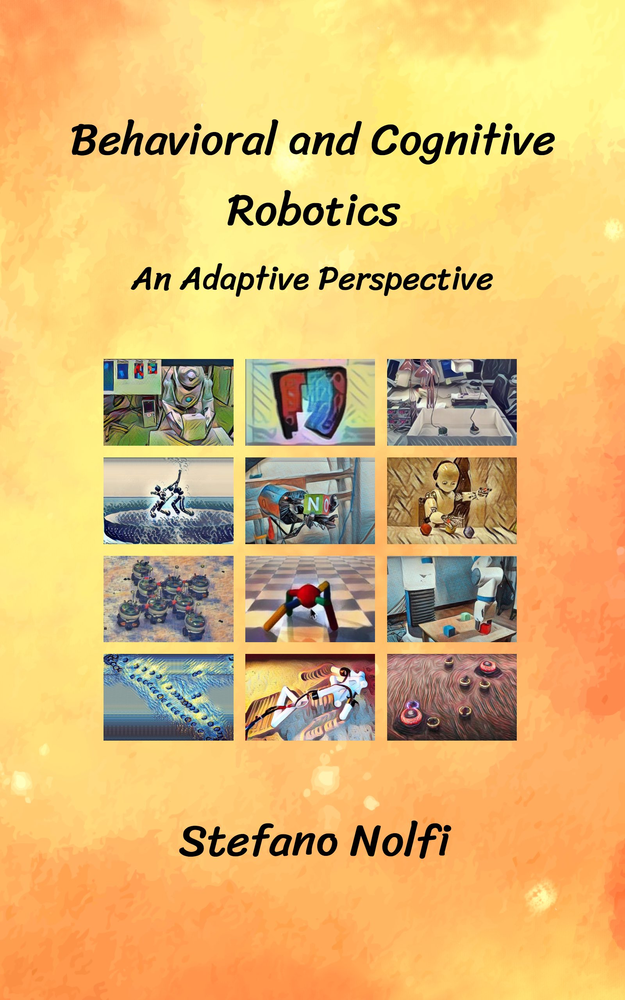
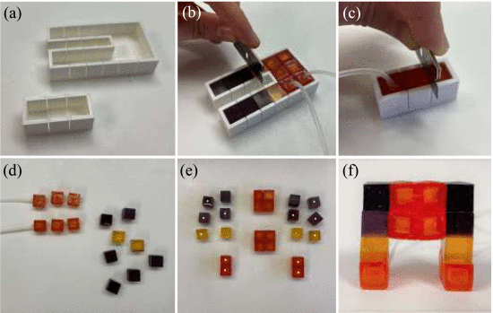
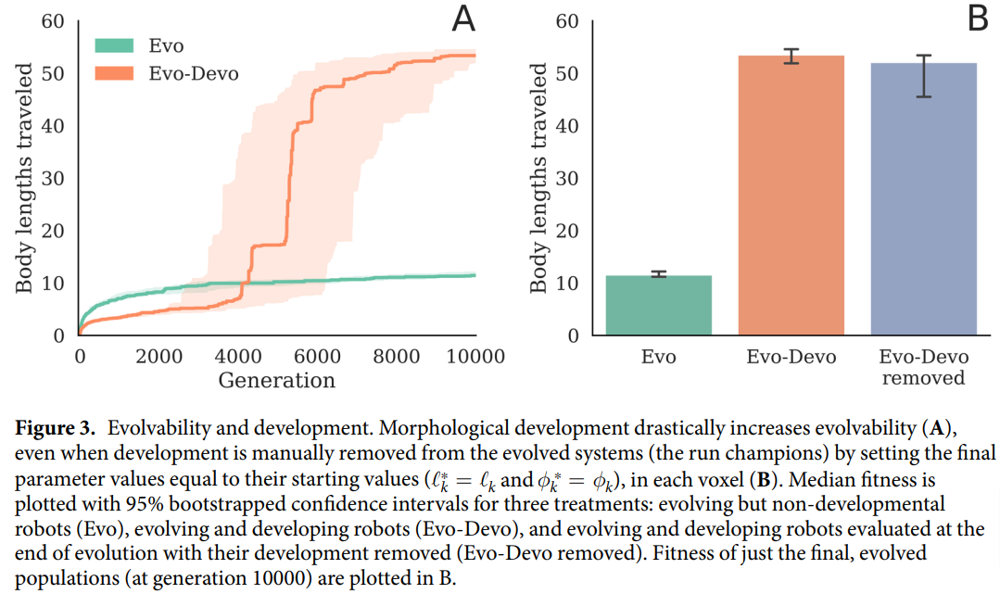
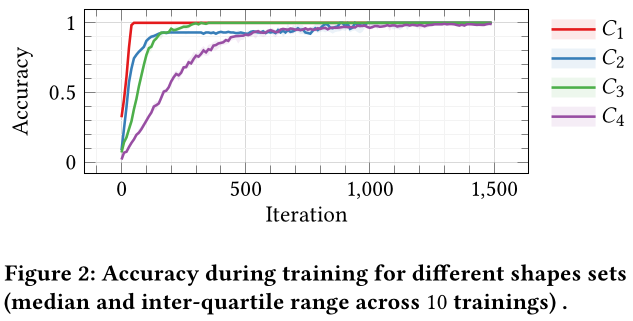

class: middle, center

# Beyond policy search: optimizing body and brain of simulated robotic agents
### MESS Summer School 2024

[Eric Medvet](http://medvet.inginf.units.it/)

.vspace1[]

Catania (Italy)

July, 18th 2024

---

## What is evolutionary robotics?

.important[
.key[Evolutionary robotics] is the science of applying **evolutionary computation** for the _optimization_ of the body, the brain, or both of **robots**.
]

--

More on evolutionary robotics:

.cols.compact[
.c30[
.h15ex.center[]

.ref[Nolfi, Stefano, and Dario Floreano. Evolutionary robotics: The biology, intelligence, and technology of self-organizing machines. MIT press, 2000.]

- the "Italian school"
]
.c30[
.h15ex.center[]

.ref[Nolfi, Stefano. Behavioral and cognitive robotics: an adaptive perspective. Stefano Nolfi, 2021.]
]
.c30[
.h15ex.center[]

.ref[Banzhaf, Wolfgang, Penousal Machado, and Mengjie Zhang. "Handbook of Evolutionary Machine Learning." (2023).]

- with chapter .ref[Medvet, Eric, et al. "Evolutionary Machine Learning in Robotics." Handbook of Evolutionary Machine Learning. Singapore: Springer Nature Singapore, 2023. 657-694.]
]
]

---

## Dynamical system

.cols[
.c60[
A .note[time invariant¹] .key[dynamical system] $D$ in **discrete time** ($k \\in \\mathbb{N}$) is defined by:
- a **state update function**² $f\\suptext{state}: S \\times I \\to S$
- an **output function**² $f\\suptext{out}: S \\times I \\to O$
- an initial state $s^{(0)} \\in S$

where
- $S$ is the .key[state space]
- $I$ is the **input space**
- $O$ is the **output space**
]
.c40[
.diagram.center[
link([0,25,100,25],'a')
rect(100,0,200,50)
link([300,25,400,25],'a')
otext(50,10,'$i^{(k)}$')
otext(350,10,'$o^{(k)}$')
otext(200,25,'$f\\\\suptext{state},f\\\\suptext{out},s^{(0)}$')
]

The system evolves (i.e., changes) over time as:  
$s^{(k)} \\seteq f\\suptext{state}(s^{(k-1)}, i^{(k)})$  
$o^{(k)} \\seteq f\\suptext{out}(s^{(k-1)}, i^{(k)})$

.vspace1[]

Set of dynamical systems on $I, O, S$:  
$\\mathcal{D}\\sub{I,O,S}=\\mathcal{F}\\sub{S \\times I \\to S} \\times \\mathcal{F}\\sub{S \\times I \\to O} \\times S$
]
]

.compact[
Particular case: **stateless** dynamical .note[i.e., static] system
- $S = \\emptyset$, i.e., no memory
- no $f\\suptext{state}$, $f\\suptext{out}: I \\to O$, i.e., just a function $\\Rightarrow$ $\\mathcal{D}\\sub{I,O,\\emptyset}=\\mathcal{F}\\sub{I \\to O}$
]

.footnote[
1. more generally, given $t = k \\delta t$, $f\\suptext{state}: \\mathbb{R}^+ \\times S \\times I \\to S$, $f\\suptext{out}: \\mathbb{R}^+ \\times S \\times I \\to O$
2. potentially stochastic functions, $f\\suptext{state}: S \\times I \\to \\mathcal{P}\_S$, $f\\suptext{out}: S \\times I \\to \\mathcal{P}\_O$
]

---

## Agent (and environment)

.cols[
.c40[
.key[Agent]: an entity capable of performing actions which may result in changing its **state** or the .key[environment] state.
]
.c60[
.diagram.center[
link([100,175,0,175,0,25,100,25],'a')
otext(200,-15,'Agent')
rect(100,0,200,50)
link([300,25,400,25,400,175,300,175],'a')
otext(50,10,'$o^{(k)}$')
otext(350,10,'$a^{(k)}$')
otext(200,25,'$f\\\\suptext{state}\\\\sub{A},f\\\\suptext{out}\\\\sub{A},s\\\\sub{A}^{(0)}$')
otext(200,135,'Environment')
rect(100,150,200,50)
otext(200,175,'$f\\\\suptext{state}\\\\sub{E},f\\\\suptext{out}\\\\sub{E},s\\\\sub{E}^{(0)}$')
link([-10,100,10,100],'t')
otext(75,100,'$k \\\\to k+1$', 'compact')
]
]
]

.compact[
Both agent and environment are **dynamical systems**, but terminology reflects the agent point of view:
- agent $A \\in \\mathcal{D}\\sub{O,A,S\_A}$
  - an input is an observation (of the environment): $I\_A=O$, the .key[observation space] 
  - an output is an action (on the environment): $O\_A=A$, the .key[action space] .note[former $O$]
- environment $E \\in \\mathcal{D}\\sub{A,O,S\_E}$
  - an input is the agent's action: $I\_E=A$
  - an output is what the agent will observe at $k+1$: $O\_E=O$
  
Also with more than one agent $\\to$ **multi-agent systems** (MASs):
- $f\\suptext{state}\\sub{E}: S \\times A\_1 \\times A\_2 \\times \\dots \\to S$ (and same for $f\\suptext{out}\\sub{E}$)
]

---

## Robot

.key[Robot]¹: an agent with a **body**².

.diagram.center[
otext(450,-15,'Agent')
rect(50,0,800,110)
otext(190,35,'Body (sensors) $B\\\\subtext{in}$')
rect(90,50,200,50)
otext(190,75,'$f\\\\suptext{state}\\\\sub{B\\\\subtext{in}},f\\\\suptext{out}\\\\sub{B\\\\subtext{in}},s\\\\sub{B\\\\subtext{in}}^{(0)}$')
otext(450,35,'Brain $C$')
rect(350,50,200,50)
otext(450,75,'$f\\\\suptext{state}\\\\sub{C},f\\\\suptext{out}\\\\sub{C},s\\\\sub{C}^{(0)}$')
otext(710,35,'Body (actuators) $B\\\\subtext{out}$')
rect(610,50,200,50)
otext(710,75,'$f\\\\suptext{state}\\\\sub{B\\\\subtext{out}},f\\\\suptext{out}\\\\sub{B\\\\subtext{out}},s\\\\sub{B\\\\subtext{out}}^{(0)}$')
otext(450,130,'Environment')
rect(350,150,200,50)
otext(450,175,'$f\\\\suptext{state}\\\\sub{E},f\\\\suptext{out}\\\\sub{E},s\\\\sub{E}^{(0)}$')
link([350,175,0,175,0,75,50,75],'a')
link([-10,125,10,125],'t')
link([850,75,900,75,900,175,550,175],'a')
link([50,75,90,75],'a')
otext(320,60,'$o^{(k)}$')
link([290,75,350,75],'a')
otext(580,60,'$a^{(k)}$')
link([550,75,610,75],'a')
link([810,75,850,75],'a')
]

- the **brain** (or .key[controller], $C$) observes the environment through .key[sensors], part $B\\subtext{in}$ of the body
- the **brain** acts on the environment through .key[actuators], part $B\\subtext{out}$ of the body
- the body (both $B\\subtext{in}$ and $B\\subtext{out}$) is a dynamical system
- from the point of view of the brain, the environment _includes_ the body

.note[More generally, a _link_ may exist betwee $B\\subtext{in}$ and $B\\subtext{out}$, hence having $O \\times H$ as output space for $B\\subtext{in}$ and $A \\times H$ as input space for $B\\subtext{out}$, with $H$ being the set of info traveling on that link]

.footnote[
1. for what concerns this course
2. simulated or not
]

---

### Examples

.diagram.center[
otext(450,-15,'Agent')
rect(50,0,800,110)
otext(190,35,'Body (sensors) $B\\\\subtext{in}$')
rect(90,50,200,50)
otext(190,75,'$f\\\\suptext{state}\\\\sub{B\\\\subtext{in}},f\\\\suptext{out}\\\\sub{B\\\\subtext{in}},s\\\\sub{B\\\\subtext{in}}^{(0)}$')
otext(450,35,'Brain $C$')
rect(350,50,200,50)
otext(450,75,'$f\\\\suptext{state}\\\\sub{C},f\\\\suptext{out}\\\\sub{C},s\\\\sub{C}^{(0)}$')
otext(710,35,'Body (actuators) $B\\\\subtext{out}$')
rect(610,50,200,50)
otext(710,75,'$f\\\\suptext{state}\\\\sub{B\\\\subtext{out}},f\\\\suptext{out}\\\\sub{B\\\\subtext{out}},s\\\\sub{B\\\\subtext{out}}^{(0)}$')
otext(450,130,'Environment')
rect(350,150,200,50)
otext(450,175,'$f\\\\suptext{state}\\\\sub{E},f\\\\suptext{out}\\\\sub{E},s\\\\sub{E}^{(0)}$')
link([350,175,0,175,0,75,50,75],'a')
link([-10,125,10,125],'t')
link([850,75,900,75,900,175,550,175],'a')
link([50,75,90,75],'a')
otext(320,60,'$o^{(k)}$')
link([290,75,350,75],'a')
otext(580,60,'$a^{(k)}$')
link([550,75,610,75],'a')
link([810,75,850,75],'a')
]

.cols[
.c15[
.w100p.center[]
]
.c35[
Actuators have an inner, low-level controller, usually a proportional integrative derivative (PID) controller
- $B\\subtext{out}$ has a state!
]
.c15[
.w100p.center[]
]
.c35[
Sensors may perform a moving average of the perceived distances
- $B\\subtext{in}$ has a state!
]
]

---

### In practice

.diagram.center[
otext(450,-15,'Agent')
rect(50,0,800,110)
otext(190,35,'Body (sensors) $B\\\\subtext{in}$')
rect(90,50,200,50)
otext(190,75,'$f\\\\suptext{state}\\\\sub{B\\\\subtext{in}},f\\\\suptext{out}\\\\sub{B\\\\subtext{in}},s\\\\sub{B\\\\subtext{in}}^{(0)}$')
otext(450,35,'Brain $C$')
rect(350,50,200,50)
otext(450,75,'$f\\\\suptext{state}\\\\sub{C},f\\\\suptext{out}\\\\sub{C},s\\\\sub{C}^{(0)}$')
otext(710,35,'Body (actuators) $B\\\\subtext{out}$')
rect(610,50,200,50)
otext(710,75,'$f\\\\suptext{state}\\\\sub{B\\\\subtext{out}},f\\\\suptext{out}\\\\sub{B\\\\subtext{out}},s\\\\sub{B\\\\subtext{out}}^{(0)}$')
otext(450,130,'Environment')
rect(350,150,200,50)
otext(450,175,'$f\\\\suptext{state}\\\\sub{E},f\\\\suptext{out}\\\\sub{E},s\\\\sub{E}^{(0)}$')
link([350,175,0,175,0,75,50,75],'a')
link([-10,125,10,125],'t')
link([850,75,900,75,900,175,550,175],'a')
link([50,75,90,75],'a')
otext(320,60,'$o^{(k)}$')
link([290,75,350,75],'a')
otext(580,60,'$a^{(k)}$')
link([550,75,610,75],'a')
link([810,75,850,75],'a')
]

Very often:
- numeric observations ($O = \\mathbb{R}^p$) and actions ($A=\\mathbb{R}^q$) $\\to$ .key[continuous control]
- stateless controller ($C$ is only $f\\suptext{out}\\sub{C}$, often called .key[policy])
- $C$ is stateless and numeric ($C \\in \\mathcal{D}\\sub{\\mathbb{R}^p,\\mathbb{R}^q,\\emptyset} =\\mathcal{F}\\sub{\\mathbb{R}^p \\to \\mathbb{R}^q}$)

.vspace1[]

.question[Question] (actually 4 questions): what about the input/output spaces of $B\\subtext{in}$ and $B\\subtext{out}$?

---

## Brain vs. body vs. body+brain evolution

.diagram.center[
otext(450,-15,'Agent')
rect(50,0,800,110)
otext(190,35,'Body (sensors) $B\\\\subtext{in}$')
rect(90,50,200,50)
otext(190,75,'$f\\\\suptext{state}\\\\sub{B\\\\subtext{in}},f\\\\suptext{out}\\\\sub{B\\\\subtext{in}},s\\\\sub{B\\\\subtext{in}}^{(0)}$')
otext(450,35,'Brain $C$')
rect(350,50,200,50)
otext(450,75,'$f\\\\suptext{state}\\\\sub{C},f\\\\suptext{out}\\\\sub{C},s\\\\sub{C}^{(0)}$')
otext(710,35,'Body (actuators) $B\\\\subtext{out}$')
rect(610,50,200,50)
otext(710,75,'$f\\\\suptext{state}\\\\sub{B\\\\subtext{out}},f\\\\suptext{out}\\\\sub{B\\\\subtext{out}},s\\\\sub{B\\\\subtext{out}}^{(0)}$')
otext(450,130,'Environment')
rect(350,150,200,50)
otext(450,175,'$f\\\\suptext{state}\\\\sub{E},f\\\\suptext{out}\\\\sub{E},s\\\\sub{E}^{(0)}$')
link([350,175,0,175,0,75,50,75],'a')
link([-10,125,10,125],'t')
link([850,75,900,75,900,175,550,175],'a')
link([50,75,90,75],'a')
otext(320,60,'$o^{(k)}$')
link([290,75,350,75],'a')
otext(580,60,'$a^{(k)}$')
link([550,75,610,75],'a')
link([810,75,850,75],'a')
]

.cols.compact[
.c35[
**Brain only** .note[largely most commont]

1. fix the body ($B\\subtext{in}, B\\subtext{out}$)
  - $f\\suptext{out}\\sub{B\\subtext{in}}: \\cdot \\to \\c{1}{O}$
  - $f^\\cdot\\sub{B\\subtext{out}}: \\cdot \\times \\c{2}{A} \\to \\cdot$
2. choose a genotype space .col3[$G$] and a compatible EA
3. design $\\phi: \\c{3}{G} \\to \\mathcal{D}\\sub{\\c{1}{O},\\c{2}{A},\\cdot}$

**Easy!**
- often easier: $\\phi: \\c{3}{G} \\to \\mathcal{F}\\sub{\\c{1}{\\mathbb{R}^p} \\to \\c{2}{\\mathbb{R}^q}}$, **policy search**
]
.c25[
**Body only**
1. fix the brain $C$, hence .col1[$O$] and .col2[$A$]
2. choose a genotype space .col3[$G$] and a compatible EA
3. design $\\phi: \\c{3}{G} \\to \\mathcal{D}\\sub{\\cdot,\\c{1}{O},\\cdot} \\times \\mathcal{D}\\sub{\\c{2}{A},\\cdot,\\cdot}$
]
.c40[
**Body+brain only**
1. choose a genotype space .col3[$G$] and a compatible EA
2. design $\\phi: \\c{3}{G} \\to \\mathcal{D}\\sub{\\cdot,\\c{1}{O},\\cdot} \\times \\mathcal{D}\\sub{\\c{1}{O}, \\c{2}{A},\\cdot} \\times \\mathcal{D}\\sub{\\c{2}{A},\\cdot,\\cdot}$
  - possibly with "free" $O$ and $A$
  
Or co-evolve:
1. fix .col1[$O$] and .col2[$A$]
2. choose and design:
- EA1 w/ $\\phi\_1: \\c{3}{G\_1} \\to \\mathcal{D}\\sub{\\cdot,\\c{1}{O},\\cdot} \\times \\mathcal{D}\\sub{\\c{2}{A},\\cdot,\\cdot}$
- EA2 w/ $\\phi\_2: \\c{3}{G\_2} \\to \\mathcal{D}\\sub{\\c{1}{O},\\c{2}{A},\\cdot}$
]
]

---

## And the fitness?

Ok, we know what is $S$ in evolutionary robotics.

What about $\\prec$?

Usually, evolutionary robotics problems are problems with fitness:
- $f: S \\to \\mathbb{R}$ (single-objective), where $f(s)$ measures the **effectiveness** of $s$ (degree of achievement) on a given .key[task]
  - often in **simulation**, sometimes in reality
  - sometimes on more than one task
- $f: S \\to \\mathbb{R}^k$ (multi-objective, often $k=2$), where $f(s)=(f\_1(s), f\_2(s))$ and
  - $f\_1(s)$ measures the **effectiveness** of $s$ on a given task
  - $f\_2(s)$ the efficiency of $s$ (on the same task), or something else

---

### Behavior vs. fitness space

$f$ often operates on the .key[behavior] of the agent:
- a behavior $\\beta \\in \\mathcal{B}$ being some description of what the agent does

$f = f' \\circ f''$
- $f': S \\to \\mathcal{B}$ is running/simulating the agent
  - may be noisy, stochastic, hardly characterizable
- $f'': \\mathcal{B} \\to \\mathbb{R}$ .note[or $\\mathbb{R}^k$ for multi-objective] is computing some quantitative metric out of the behavior

.vspace1[]

Longer trip from the genotype to the fitness space: $G \\xrightarrow{\\phi} S \\xrightarrow{f'} \\mathcal{B} \\xrightarrow{f''} \\mathbb{R}$
- ideally, the full mapping process (i.e., $\\phi \\circ f' \\circ f''$) should comply with variational inheritance principle

---

## ER by examples

- **Interpretable controllers** for continuos control
- **Imitation** "learning" with evolved controllers
- **Morphological development** in simulated modular soft robots
- **Multi-morphology** controllers
- How to fight the **reality gap** in ER
- How to **design a fitness function**

---

class: middle, center

## Interpretable controllers for continuos control

.ref[Nadizar, Medvet, Wilson; Naturally Interpretable Control Policies via Graph-based Genetic Programming; 27th European Conference on Genetic Programming (EuroGP); 2024]

---

### Research question and sketch of solution

Can you optimize a controller which is effective **and** interpretable*?
- *: here "interpretable" means more transparent than a black box model

--

.vspace1[]

Just try:
1. consider some (here 8) continuous control tasks
2. use EAs wich evolve natively interpretable controllers
  - **cartesian GP** (CGP), the policy is a graph
  - **linear GP** (LGP), the policy is a list of instructions
3. compare results with evolution of black box policies
  - and (attempt to) interpret the CGP/LGP ones!

---

### Experiments

.cols.compact[
.c40[
**Search space, fitness**:
- $O$ and $A$ continuous and task-dependent
- $S\_C=\\emptyset$ and $f\\suptext{out}\\sub{C} \\in \\mathcal{F}\\sub{\\mathbb{R}^{p\\subtext{in}} \\to \\mathbb{R}^{p\\subtext{out}}}$
- $f$ task-dependent
]
.c60[
.w100p.center[]
]
]

.compact[
**Representations, EAs**:
.cols[
.c60[
**CGP**:
- **CGP** $S$, a graph
- **CGP** $G$, a string of ints with proper domains
- operators $H=\\{+,-,\\times,\\div,|\\cdot |, \\exp, \\sin, \\cos, \\log, <, >\\}$
- constants $C = \\{0.1, 1\\}$
- 50 nodes
]
.c40[
**LGP**:
- **LGP** $S$, a program
- **LGP** $G$, a string of ints with proper domains
- $p\\subtext{in}+p\\subtext{out}+5$ registers
- 15 lines of code
]
]
]

.compact[
**Other remarks**:
- **reinforcement learning** (RL) as comparison baseline (for effectiveness)
  - proximal policy optimization (PPO), soft actor critic (SAC)
  - both producing NNs (MLPs), with $4 \\times 32$ (PPO) or $2 \\times 256$ (SAC) inner neurons 
- developed with [Brax](https://github.com/google/brax)
]

---

### Tasks

Part of the [Gymnasium](https://gymnasium.farama.org/) framework for RL

.cols[
.c25.center[
Inverted pendulum

.w80p[]

Hopper

.w80p[]
]
.c25.center[
Inverted doub. pend.

.w80p[]

Walker2d

.w80p[]
]
.c25.center[
Reacher

.w80p[]

Half cheetah

.w80p[]
]
.c25.center[
Swimmer

.w80p[]

Ant

.w80p[]
]
]

---

### Results: effectiveness

.w80p.center[]

---

### Results: interpretability

.cols[
.c70[
.w80p.center[]
]
.c30[
Swimmer .note["Swimmer"...]

.w80p[]

.vspace1[]

"I can see the policy" $\\ne$ "I can understand its decision"
- but better than nothing
]
]

---

class: middle, center

## Morphological development in simulated modular soft robots

.ref[Kriegman, Sam, Nick Cheney, and Josh Bongard. "How morphological development can guide evolution." Scientific reports 8.1 (2018): 13934.]

.ref[Nadizar, Giorgia, Eric Medvet, and Karine Miras. "On the schedule for morphological development of evolved modular soft robots." European Conference on Genetic Programming (Part of EvoStar). Cham: Springer International Publishing, 2022.]

---

### Research question

In .ref[Kriegman, Sam, Nick Cheney, and Josh Bongard. "How morphological development can guide evolution." Scientific reports 8.1 (2018): 13934.]

Is morphological **development** beneficial for evolution? Why?
- evolutionary robotics exploited to answer a question **much broader** than robotics...
- ... with a rather trivial experiment with simulated "robots"

.vspace1[]

.cols[
.c40[
> This exposes a previously unknown detail about the Baldwin effect: instead of all useful traits becoming genetically assimilated, only traits that render the agent robust to changes in other traits become assimilated. We refer to this as _differential canalization_.
]
.c20[
.h20ex.center[]
.note[James Mark Baldwin, January 12, 1861, Columbia, South Carolina – November 8, 1934, Paris]
]
.c40[
> an organism's ability to learn new behaviours (e.g. to acclimatise to a new stressor) will affect its reproductive success and will therefore have an effect on the genetic makeup of its species through natural selection

**Baldwin effect**: A new factor in evolution

]
]

---

### Voxel-based soft robots (VSRs)

.cols[
.c60[
In general:
- many **soft cubes** "glued" together
  - "infinite" degrees of freedom
- each can expand or contract over time, behavior resulting from aggregation
- **morphological computation**!
- optimizable body and brain
  - **body** $\\approx$ how many, where placed, what material
  - **brain** $\\approx$ how volumes change over time
- actually fabricable, but .note[currently] poorly controllable

.vspace1[]

.bnote[
Top image from .ref[Hiller, Jonathan, and Hod Lipson. "Automatic design and manufacture of soft robots." IEEE Transactions on Robotics 28.2 (2011): 457-466.]

Bottom image from .ref[Legrand, Julie, et al. "Reconfigurable, multi-material, voxel-based soft robots." IEEE Robotics and Automation Letters 8.3 (2023): 1255-1262.], then many works
]

]
.c40[
.w100p.center[]

.w100p.center[]
]
]

---

### Body, brain, and development

.cols.compact[
.c70[
**Body**:
- fixed $4 \\times 4 \\times 3$ voxels body

**Brain**:
- **open loop** controller with $f\\suptext{out}\\sub{C}: \\mathbb{R}^+ \\to [-1,1]^{48}$
- each $i$-th voxel controlled with $f\\suptext{out}\\sub{C,i}(t) = \\c{1}{v^0\_i} + \\c{2}{a} \\sin(2 \\pi \\c{3}{f} k \\Delta t + \\c{4}{\\phi\_i})$
  - .col2[amplitude $a$], .col3[frequency $f$]: same for all voxels
  - .col1[resting volume $v^0\_i$], .col4[phase $\\phi\_i$]: voxels dependent $\\to$ **optimizable**
      - resting volumes with bilateral simmetry
      
**Development**:
- **with**: each resting volume linearly changes over lifetime, i.e., $v\_i(t)=\\left(v\\suptext{final}\_i-v\\suptext{init}\_i\\right) \\frac{t}{t\\subtext{final}}$
- **without**: as above, with $v\_i(t)=v^0\_i$

**Body/brain** peculiar point of view:
- .col1[resting volume $v^0\_i$] $\\to$ body, and its way to change (**slowly**, i.e., develop) during life
- .col4[phase $\phi\_i$] $\\to$ brain, and its way to **rapidly** change the body
]
.c30[
**Representation, EA**:
- a simple mutation-only age-fitness EA
  - all parents mutated
  - only survival selection ("worst")
  - bi-objective: fitness and age .note[i.e., number of generations] for **diversity**
  - one new (age zero) individual per generation
- $G = \\mathbb{R}^{72}$ (no devo) or $G = \\mathbb{R}^{96}$ (devo)
  - $\\approx$ gaussian mutation
  
**Fitness**:
- undirected .key[locomotion] task
  - $f(s)$ is the traveled distance (normalized by body size)
  - fixed time simulation
]
]

---

### Slow and fast body change

.w90p.center[]

---

### Results (and [videos](https://www.youtube.com/watch?v=Ee2sU-AZWC4))

.w90p.center[]

---

### Further research question (and sketch of solution)

In .ref[Nadizar, Giorgia, Eric Medvet, and Karine Miras. "On the schedule for morphological development of evolved modular soft robots." European Conference on Genetic Programming (Part of EvoStar). Cham: Springer International Publishing, 2022.]

**When** should morphological development occur?
- at the beginning, like for (most of) real life forms?
- constantly? never?

Here:
- on 2D simulated VSRs
- with "real" development: voxels are added during the lifetime

--

.vspace[]
Experimentally:
1. find a representation that
  - allows for the same brain to deal with a developing body
  - describe where a new voxel is added, when "triggered"
2. define schedule as "when to trigger"
3. compare experimentally different schedules

---

### Body+devo+brain representation

.cols[
.c40[
Two alternatives for **body+devo** representation:
- vector-based ($G = \\mathbb{R}^p$)
- tree-based ($G \\simeq T\\sub{\\mathbb{R},\\mathbb{R}}$) with arity being 4 or 0

Three alternatives for **brain** representation:
- vector-based phase ($G = \\mathbb{R}^p$) **open-loop** phase-optimizable controller
- vector-based NN (MLP with fixed architecture) controller ($G = \\mathbb{R}^p$)
- tree-based phase ($G \\simeq T\\sub{\\mathbb{R},\\mathbb{R}}$) **open-loop** phase-optimizable controller

Four resulting combinations.
]
.c60[
.w90p.center[]

.w90p.center[]
]
]

---

### Results

With a rather standard GA with proper $B, o\\subtext{mut}, o\\subtext{xover}$; "undiretected" locomotion task ($f$ measures the velocity in a fixed time simulation)

.w90p.center[]

.w90p.center[]

---

### More results

.cols[
.c70[
.w90p.center[]
]
.c30[
<video autoplay muted loop><source src="images/devo-nadizar-example.mp4" type="video/mp4"/></video>
]
]

---

class: middle, center

## Imitation "learning" with evolved controllers

.ref[Medvet, Nadizar; GP for Continuous Control: Teacher or Learner? The Case of Simulated Modular Soft Robots; XX Genetic Programming Theory & Practice (GPTP); 2023]

---

### Research question and sketch of solution

Given two radically different kinds of brains suitable for continuous control, can one learn from another? $\\to$ **imitation learning**

--

.vspace1[]

Sketch of solution:
- consider multi-regression-tree-based and NN-based representation, then
1. evolve brain with representation 1  **online** (i.e., in the robot)
2. evolved robot is used to collect pairs of $(\\vect{o}, \\vect{a}) \\in O \\times A = \\mathbb{R}^{p\\subtext{in}} \\times \mathbb{R}^{p\\subtext{out}}$
3. evolve brain with representation 2 **offline**, as for solving the regression problem given by $(\\vect{o}, \\vect{a})$ pairs

On 2D VSRs.

---

### Experiments

**Search space, fitness**:
- $S\_C=\\emptyset$, $O = \\mathbb{R}^{p\\subtext{in}}$ and $A = \mathbb{R}^{p\\subtext{out}}$ $\\to$ **continuous control**
  - but one $f\\suptext{out}\_C$ for each voxel $\\to$ **distributed controller**, **collective intelligence**
  - overall, a recurrent NN
      - single NNs communicate with $n\\subtext{comm}$ *channels* on each side
- $S = \\mathcal{F}\\sub{\\mathbb{R}^{p\\subtext{in}} \\to \\mathbb{R}^{p\\subtext{out}}}$
- $f$ is average velocity ("undirected" locomotion)

**Representation, EA**:
.cols.compact[
.c40[
**GA with MLPs**: .note[a simple form of .key[neuroevolution] (NE)]
- $S = \\mathcal{F}\\sub{\\mathbb{R}^{p\\subtext{in}} \\to \\mathbb{R}^{p\\subtext{out}}}$
  - each $f\\suptext{out}\_C$ is an MLP
- $G = \\mathbb{R}^p$, with $p \\approx 50$ or $\\approx 220$
- gaussian mutation as $o\\subtext{mut}$, geometric crossover as $o\\subtext{xover}$
- standard selection, generational model
]
.c60[
**Multi-tree GP**:
- $S =$ symbolic expressions
- $G = T\_{O,V\\cup C}^{p\\subtext{out}}$
  - each $f\\suptext{out}\_C$ from a list of regression trees
- element-wise standard subtree mutation, element-wise standard subtree crossover, uniform crossover
- standard selection, generational model
- **diversity promotion** with best-effort duplicate avoidance
]
]

.compact[
And a third, graph-based representation.
]

---

### Results: online ~~learning~~ evolution

.h25ex.center[]

.cols[
.c25.center[
NE ($n\\subtext{comm}=1$)

<video autoplay muted loop><source src="images/imitation-ga-1-001.mp4" type="video/mp4"/></video>
]
.c25.center[
NE ($n\\subtext{comm}=3$)

<video autoplay muted loop><source src="images/imitation-ga-3-001.mp4" type="video/mp4"/></video>
]
.c25.center[
Multi-GP ($n\\subtext{comm}=1$)

<video autoplay muted loop><source src="images/imitation-gp-1-001.mp4" type="video/mp4"/></video>
]
.c25.center[
Multi-GP ($n\\subtext{comm}=3$)

<video autoplay muted loop><source src="images/imitation-gp-3-001.mp4" type="video/mp4"/></video>
]
]

---

### Results: imitation ~~learning~~ evolution

.cols[
.c75[
.w100p.center[]
]
.c25[
For comparison:
.w100p.center[]
]
]

---

class: middle, center

## Multi-morphology controller

.ref[Mertan, Cheney. "Towards Multi-Morphology Controllers with Diversity and Knowledge Distillation." In Proceedings of the Genetic and Evolutionary Computation Conference (GECCO '24)]

.ref[Nadizar, Giorgia, et al. "A fully-distributed shape-aware neural controller for modular robots." Proceedings of the Genetic and Evolutionary Computation Conference. 2023.]

---

### Research question

Can we have a single controller that works with different morphologies?

.vspace1[]

**Brief answer** of .ref[Mertan, Cheney. "Towards Multi-Morphology Controllers with Diversity and Knowledge Distillation." In Proceedings of the Genetic and Evolutionary Computation Conference (GECCO '24)]:
- yes, with some imitation learning and teacher controllers found with quality diversity

**Brief answer** of .ref[Nadizar, Giorgia, et al. "A fully-distributed shape-aware neural controller for modular robots." Proceedings of the Genetic and Evolutionary Computation Conference. 2023.]
- yes, with a controller which is indeed a library of controllers and a module able to recognize the morphology in a distributed way

---

### Obtaining good teacher controllers

Sketch of solution:
1. use MAP-elites for doing body-brain evolution, with descriptors describing the bodyu
2. sample "uniformly" the archive to get many robots with different bodies
3. use them as teachers
  - with supervised learning, given all the $\\bag{(\\vect{o}^{(i)}, \\vect{a}^{(i)})}\_{i}$, one per teacher

Many variants:
- how to sample the archive
- what's a controller

---

### MAP-elites for VSR body-brain evolution

.cols.compact[
.c50[
2D VSRs¹ doing locomotion

.vspace1[]

**Search space and representation**:
- body $\\in \\{0,1,2,3,4\\}^\{5 \\times 5\}$, up to $5 \\times 5$ morphology with 4 materials:
  - active $\\leftrightarrow$, active $\\updownarrow$, passive rigid, passive soft
- modular controller with $O=\\mathbb{R}^\{p\\subtext{in}\}$, $A=\\mathbb{R}^\{p\\subtext{out}\}$, the same for each voxel .note[and other variants]
  - a NN $\\in \\mathcal{F}\\sub{\\mathbb{R}^\{p\\subtext{in}\} \\to \\mathbb{R}^\{p\\subtext{out}\}}$ with $p$ params, $S\_C=\\emptyset$
  - $\\vect{o}$ includes sensor readings of neighbor voxels
  - **morphology-agnostic**!
- $G = \\{0,1,2,3,4\\}^\{5 \\times 5\} \\times \\mathbb{R}^p$
  - composed mutation: "int flip" and Gaussian mutation
  
**MAP-elites descriptors**:
- number of active voxels
- number of voxels

.vspace1[]

.note[
1. .ref[Bhatia, Jagdeep, et al. "Evolution gym: A large-scale benchmark for evolving soft robots." Advances in Neural Information Processing Systems 34 (2021): 2201-2214.]
]
]
.c50[
Best robots as teachers:
.w90p.center[]

Uniform sample of the archive:
.w90p.center[]

]
]
  
---

### Beyond teachers: unseen morphologies

.w55p.center[]

---

### Other approach: library of controllers

.w65p.center[]

Sketch of solution:
1. take some morphology, evolve a modular controller for each one
  - same NN inside each voxel $\\Rightarrow$ morphology-agnostic
2. use a distributed mechanims for morphology detection
  - inside each voxel, based on cellular automata (CA)
  - a multi-class classification problem
3. select the controller based on CA detected morphology

.footnote[.ref[Nadizar, Giorgia, et al. "A fully-distributed shape-aware neural controller for modular robots." Proceedings of the Genetic and Evolutionary Computation Conference. 2023.]]

---

### Classification with an NCA

.cols.compact[
.c60[
**Cellular automata (CA)**:
- a distributed computation paradigm .note[usuallu] in discrete time
- each cell updates its state based on the state of the neighborhood according to some rule
- in **neural CA** (NCA), the state is $\\in \\mathbb{R}^q$ and the rule is a NN

**NCA for classification** of VSR shape:
- one cell inside each voxel
- one additional channel in the state for each possible shape
  - at a given NCA time, each voxel "estimates" what's the overall shape
- training:
  - find the NN params that make all voxels guess the correct shape after a some given NCA time, for each shape
  - with stochastic gradient descent (Adam)
  
.w100p.center[]

]
.c40[
.w55p.center[]
]
]

---

### Evolution of each controller

2D VSRs doing locomotion

**Search space and representation**:
- modular controller with $O=\\mathbb{R}^\{p\\subtext{in}\}$, $A=\\mathbb{R}^\{p\\subtext{out}\}$, the same for each voxel, one for each shape
  - a NN $\\in \\mathcal{F}\\sub{\\mathbb{R}^\{p\\subtext{in}\} \\to \\mathbb{R}^\{p\\subtext{out}\}}$ with $p$ params, $S\_C=\\emptyset$
  - $\\vect{o}$ includes communications from neighbor voxels
  - $\\vect{a}$ includes communications to neighbor voxels
  - overall, a recurrent NN
  - morphology-agnostic
- $G = \\mathbb{R}^\{57\}$

**EA**:
- a simple ES

---

### Results

.cols[
.c50[
**NCA classificationa accuracy**:

.w100p.center[]
- $C\_i$ is a set of shapes
- $|C\_1|=3$, $|C\_1|=9$, $|C\_1|=15$, $|C\_1|=39$
]
.c50[
**Accuracy/performance vs. classification time**:

.w100p.center[]

- classification time in training was set to $[25,50]$ steps
- useful for "online" re-classification
]
]

---

class: middle, center

## How to fight the reality gap in ER

.ref[Koos, Sylvain, Jean-Baptiste Mouret, and Stéphane Doncieux. "The transferability approach: Crossing the reality gap in evolutionary robotics." IEEE Transactions on Evolutionary Computation 17.1 (2012): 122-145.]

---

### Research question

How to practically tackle the .key[reality gap] issue?

**Brief answer**: with a multi-objective approach, where the secondary objective is the **transferability** of the controller.

--

.vspace1[]

.w100p.center[]

---

### Sketch of the solution

.w90p.center[]

---

### Experiments: case study 1

.cols[
.c60.compact[
**Search space, fitness**:
- $O=\\mathbb{R}^7$ .note[5 IR sensors, 2 color sensors]
- $A=\\mathbb{R}^2$ .note[2 motors]
- $S\_C=\\mathbb{R}^p$ and $f\\suptext{state}\\sub{C},f\\suptext{out}\\sub{C} =$ RNN with predefined architecture (with enforced simmetry)
  - recurrent neural networks (RNNs) have a **state**!
- $f\_1$ is distance ($d\_x+d\_y$) $+$ bonus

**Representation, EA**:
- $G \\simeq \\mathbb{R}^{35}$, but each number encoded with 4 bits
- $o\\subtext{mut} =$ bit flip; $o\\subtext{xover} =$ uniform
- NSGA-II

**Other remarks**:
- transferability descriptors: trajectory distance
- diversity measure: genotype distance
- ML features: min distance to left/right, traveled distance
- interesting case of *non-brain computation*
  - can be solved with a stateless controller...
  - ... but here with a stateful controller
]
.c40[
.w100p.center[]

.vspace1[]

.w100p.center[]
]
]

---

### Experiments: case study 2

.cols[
.c60.compact[
**Search space, fitness**:
- $O=\\emptyset$ $\\to$ **open-loop controller**!
- $A=\\mathbb{R}^8$ .note[8 degrees of freedom (8-DOF)]
- $S\_C=\\emptyset$ and $f\\suptext{out}\\sub{C} =$ a set of sinusoidal functions parametrized with 2 parameters
- $f\_1$ is distance

**Representation, EA**:
- $G = [0,1]^2$
- $o\\subtext{mut} =$ bit flip; $o\\subtext{xover} =$ uniform
- NSGA-II

.w100p.center[]

]
.c40.compact[
**Other remarks**:
- transferability descriptors: trajectory distance
- ML features: traveled distance, mean center height, final angle
- diversity measure: behavioral diversity in ML features space
- simulated with [PyBullet](https://pybullet.org/wordpress/)

.w100p.center[]
]
]

---

class: middle, center

## How to design a fitness function

.ref[Divband Soorati, Mohammad, and Heiko Hamann. "The effect of fitness function design on performance in evolutionary robotics: The influence of a priori knowledge." Proceedings of the 2015 Annual Conference on Genetic and Evolutionary Computation. 2015.]

---

### Research question and sketch of solution

If/how to use the **a priori knowledge** about the problem and desired solution when **designing the fitness**?
- very well captured in the title: *The effect of fitness function design on performance in evolutionary robotics: The influence of a priori knowledge*

--

Sketch of solution:
1. define *a priori knowledge*
2. define the *effect of*
3. consider $>1$ ER problems (for **generality** of the findings) where the fitness can include more or less a priori knowledge
4. experiment

**Brief answer**: .note[not so brief...]
> Fitness functions that include a high degree of a priori knowledge (here TFF and BFF) influence the performance positively.
> They help to simplify the evolution of a successful controller and hence simplify the chosen task.
> However, we also know that incorporating a high degree of a priori knowledge foils the dominant idea of evolutionary computation as a black-box optimizer.

---

### Robot and tasks

.cols[
.c30[
**Robot**:
- simulated differential drive robot with 8 proximity sensors
  - 6 on the front
  - 2 on the back
]
.c70[
**Tasks**:
- **Obstacle avoidance (OA)**
  - easy
  - roam without colliding with walls
- **Goal homing (GH)**
  - medium
  - reach a target (here, a **light source**) without colliding with walls
- **Periodic goal homing (PGH)**
  - hard
  - reach and get away from a target without colliding with walls
]
]
.w75p.center[]

---

### A priori knowledge

Just two levels (and two combined cases):
- **Aggregate fitness function** (AFF): what matters is final result, no expections about how to achieve it
  - **what is achieved** $\\to$ low a priori knowledge
- **Behavioral fitness function** (BFF): there is an expected good behavior and the fitness captures it
  - **how it is achieved** $\\to$ "high" a priori knowledge
- **Tailored fitness function** (TFF): .q[combine elements of] AFF and BFF .note[suboptimal name]
- **Functional incremental fitness function** (FIFF): .q[sets of fitness functions that are applied separately and gradually]
  - sort of **curriculum learning**

---

### Fitnesses

.cols[
.c70.compact[
**Obstacle avoidance** (OA) .note[maximization]
- **AFF**: $f\\subtext{AFF} = \\delta$
  - "go!"
- **BFF**: $f\\subtext{BFF} = \\c{1}{\\left(\\frac{\\bar{v}\_l+\\bar{v}\_r}{2}\\right)} \\c{2}{\\left(1-\\sqrt{\\left | \\bar{v}\_l-\\bar{v}\_r \\right |} \\right)} \\c{3}{\\frac{1}{\\theta} \\min\_t \\left( \\min\_i \\left( s\_i(t) \\right) \\right)}$
  - ".col1[go fast], .col2[go straight], .col3[don't collide]" 

**Goal homing** (GH) .note[maximization]
- **AFF**: $f\\subtext{AFF} = \\sum\_t I(t)$
  - "catch as much light as you can"
- **BFF**: $f\\subtext{BFF} = \\sum\_t \\left| c I(t) - \\Delta d(t) \\right|$ .note[$c$ is a scale coefficient]
  - "run in the dark, stand in the light"
  
**Periodic goal homing** (PGH) .note[maximization]
- **AFF**: $f\\subtext{BFF} = \\sigma(I)$
  - "perceive variable light intensity"
- **BFF**: $f\\subtext{BFF} = \\sum\_t \\varphi(t) \\Delta d(t)$, with $\\varphi(t)=\\begin{cases} -1 &\\c{1}{\\text{if }0.3 < I(t) < 0.7}\\\\+1 &\\c{2}{\\text{otherwise}} \\end{cases}$
  - "stay short in .col1[medium light] intensity, run fast in .col2[dark or light]"
]
.c30[
Legend:
- $\\delta$: distance traveled
- $\\bar{v}\_l=\\frac{1}{T} \\sum\_t v\_l(t)$: average left wheel speed (same for right)
- $s\_i(t)$: proximity sensor reading
- $\\theta$: penalty ($1$ or $10^3$, if collision)
- $I(t)$: perceived light intensity
- $\\Delta d(t)$: robot current speed
]
]

.footnote[I would have chosen a different notation...]

---

### Experiments

.cols[
.c40.compact[
**Search space, fitness**:
- $O=\\mathbb{R}^{10}$ .note[8 proximity sensors, 2 light sensors]
- $A=\\mathbb{R}^2$ .note[2 motors]
- $S\_C=\\emptyset$ and $f\\suptext{out}\\sub{C} =$ NN with *free* architecture
- $f$ is AFF, BFF, TFF, FIFF

**Representation, EA**:
- **NEAT**¹ (Neuroevolution of augmented topologies)
  - complexification
  - innovation protection via speciation
  - meaningful crossover
- $G$ given by NEAT

**Other remarks**:
- **112 days** (days!) of computation
- simulated with [Stage](https://github.com/rtv/Stage)
- actually, no clear results

.vspace1[]

.bnote[1: .ref[Stanley, Kenneth O., and Risto Miikkulainen. "Evolving neural networks through augmenting topologies." Evolutionary computation 10.2 (2002): 99-127.]]

]
.c60[
.w90p.center[]

.q[post-evaluated with AFF (1st column), BFF (2nd column), TFF (3rd column)]
]
]

---

### NEAT in a nutshell

.cols[
.c50[
.w90p.center[]

Key contributions:
1. complexification: start with minimal NNs, only increase
2. innovation protection via **speciation** and fitness sharing
3. meaningful crossover via alignment

2 and 3 thanks to **historical marking**
]
.c50[
.w90p.center[]
]
]

