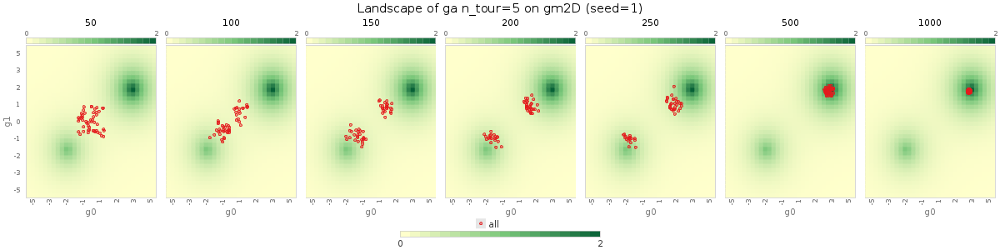

class: middle, center

# Evolutionary Robotics and Artificial Life lab

.w50p.center[]

[Eric Medvet](http://medvet.inginf.units.it/) - March 2024

---

## What is evolutionary robotics?

.diagram.center[
otext(450,-15,'Agent')
rect(50,0,800,110)
otext(190,35,'Body (sensors) $B\\\\subtext{in}$')
rect(90,50,200,50)
otext(190,75,'$f\\\\suptext{state}\\\\sub{B\\\\subtext{in}},f\\\\suptext{out}\\\\sub{B\\\\subtext{in}},s\\\\sub{B\\\\subtext{in}}^{(0)}$')
otext(450,35,'Brain $C$')
rect(350,50,200,50)
otext(450,75,'$f\\\\suptext{state}\\\\sub{C},f\\\\suptext{out}\\\\sub{C},s\\\\sub{C}^{(0)}$')
otext(710,35,'Body (actuators) $B\\\\subtext{out}$')
rect(610,50,200,50)
otext(710,75,'$f\\\\suptext{state}\\\\sub{B\\\\subtext{out}},f\\\\suptext{out}\\\\sub{B\\\\subtext{out}},s\\\\sub{B\\\\subtext{out}}^{(0)}$')
otext(450,130,'Environment')
rect(350,150,200,50)
otext(450,175,'$f\\\\suptext{state}\\\\sub{E},f\\\\suptext{out}\\\\sub{E},s\\\\sub{E}^{(0)}$')
link([350,175,0,175,0,75,50,75],'a')
link([-10,125,10,125],'t')
link([850,75,900,75,900,175,550,175],'a')
link([50,75,90,75],'a')
otext(320,60,'$o^{(k)}$')
link([290,75,350,75],'a')
otext(580,60,'$a^{(k)}$')
link([550,75,610,75],'a')
link([810,75,850,75],'a')
]

.vspace1[]

.important[
.key[Evolutionary robotics] is the science of applying **evolutionary computation** for the **optimization** of the body, the brain, or both of **robots**.
]

.vspace1[]

.key[Evolutionary computation] (EC) is the science of designing, developing, and using algorithms inspired by **natural evolution** for solving **optimization** problems.

---

## Evolution, algorithmically

.cols[
.c50.compact[
Ingredients (i.e., parameters):
1. a probability distribution .col2[$B$] over $S$ .note[$B$ for builder]
  - $B \\in \\mathcal{P}\_S$, i.e., $B: S \to [0,1]$, with $\\sum\_{s \\in S} B(s) = 1$
  - $s \\setsample B$ denotes sampling from $B$, briefly $\\sim B$
2. a stochastic (unary) operator .col2[$o\\subtext{mut}$] on $S$ (**mutation**)
  - $o\\subtext{mut}: S \\to \\mathcal{P}\_S$, $s' \\setsample o\\subtext{mut}(s)$
3. a stochastic binary operator .col2[$o\\subtext{xover}$] on $S$ (**crossover**)
  - $o\\subtext{xover}: S \\times S \\to \\mathcal{P}\_S$, $s' \\setsample o\\subtext{mut}(s\_1,s\_2)$
4. a population size $\\c{2}{n\\subtext{pop}} \\in \\mathbb{N}$
5. a number of iterations $\\c{2}{n\\subtext{gen}} \\in \\mathbb{N}$
6. a reproduction **selection criterion** .col2[$c\\subtext{repr}$]
  - given a bag $A$ and a partial order $\\prec$ on $A$, $c\\subtext{repr}(A,\\prec) \\in \\mathcal{P}\_A$
7. a $\\neg$survival **selection criterion** .col2[$c\\subtext{die}$]

1, 2, 3 depend on $S$; 6, 7 may depend on $S$; 4, 5 are $S$ agnostic
]
.c50[
.pseudo-code.compact[
function $\\text{solve}(\\c{1}{\\prec}; \\c{2}{B, o\\subtext{mut}, o\\subtext{xover}, n\\subtext{pop}, n\\subtext{gen}, c\\subtext{repr}, c\\subtext{die}})$ {  
.i[]$S\\subtext{pop} \\seteq \\bag{}$ .comment[// $S'$ is a bag of .key[candidate solutions]]   
.i[]while $|S\\subtext{pop}| < n\\subtext{pop}$ { .comment[// population initialization]  
.i[].i[]$S\\subtext{pop} \\seteq S\\subtext{pop} \\oplus \\bag{\\sim B}$  
.i[]}  
.i[]$n \\seteq 0$  
.i[]while $n < n\\subtext{gen}$ { .comment[// iterations (aka .key[generations])]  
.i[].i[]$n \\seteq n+1$  
.i[].i[]$S\\subtext{offspring} \\seteq \\bag{}$ .comment[// bag of "children" (aka .key[offspring])]  
.i[].i[]while $|S\\subtext{offspring}| < n\\subtext{pop}$ { .comment[// reproduction]  
.i[].i[].i[]$s\_1 \\setsample c\\subtext{repr}(S\\subtext{pop},\\prec)$ .comment[// first .key[parent]]  
.i[].i[].i[]$s\_2 \\setsample c\\subtext{repr}(S\\subtext{pop}, \\prec)$ .comment[// second .key[parent]]  
.i[].i[].i[]$s' \\setsample o\\subtext{mut}(\\sim o\\subtext{xover}(s\_1, s\_2))$ .comment[// .key[variation]]  
.i[].i[].i[]$S\\subtext{offspring} \\seteq S\\subtext{offspring} \\oplus \\bag{s'}$  
.i[].i[]}  
.i[].i[]$S\\subtext{pop} \\seteq S\\subtext{pop} \\oplus S\\subtext{offspring}$  
.i[].i[]while $|S\\subtext{pop}| > n\\subtext{pop}$ { .comment[// trim]  
.i[].i[].i[]$S\\subtext{pop} \\seteq S\\subtext{pop} \\ominus \\bag{\\sim c\\subtext{die}(S\\subtext{pop},\\prec)}$  
.i[].i[]}  
.i[]}  
.i[]return .col3[$S\\subtext{pop}$]  
}
]
.compact[
.col1[Input: $\\prec$] .note[and, implicitly, $S$] .hspace5[] .col3[Output: $S\\subtext{pop}$]  
.col2[Params: $B, o\\subtext{mut}, o\\subtext{xover}, n\\subtext{pop}, n\\subtext{gen}, c\\subtext{repr}, c\\subtext{die}$]
]
]
]

---

## In practice

This (the **evolutionary algorithm**):
.cols[
.c80[
.w100p.center[]
]
.c20[
<video autoplay muted loop><source src="exps/eat02-landscape-gm2D-ga n_tour=5-1.mp4" type="video/mp4"/></video>
]
]

For obtaining this (the "**robot**"):
.cols[
.c25.center[
<video autoplay muted loop><source src="images/imitation-ga-1-001.mp4" type="video/mp4"/></video>
]
.c25[
<video autoplay muted loop><source src="images/imitation-gp-1-001.mp4" type="video/mp4"/></video>
]
.c50[
.w50p.center[]
]
]

.note[Right image: .ref[Legrand, Julie, et al. "Reconfigurable, multi-material, voxel-based soft robots." IEEE Robotics and Automation Letters (2023).]]

---

## Not just numbers (and not just "robots")

.cols[
.c60[
.w90p.center[]
]
.c40.center[
.h15ex[]
.h15ex[]

.h15ex[]
.h15ex[]
]
]

