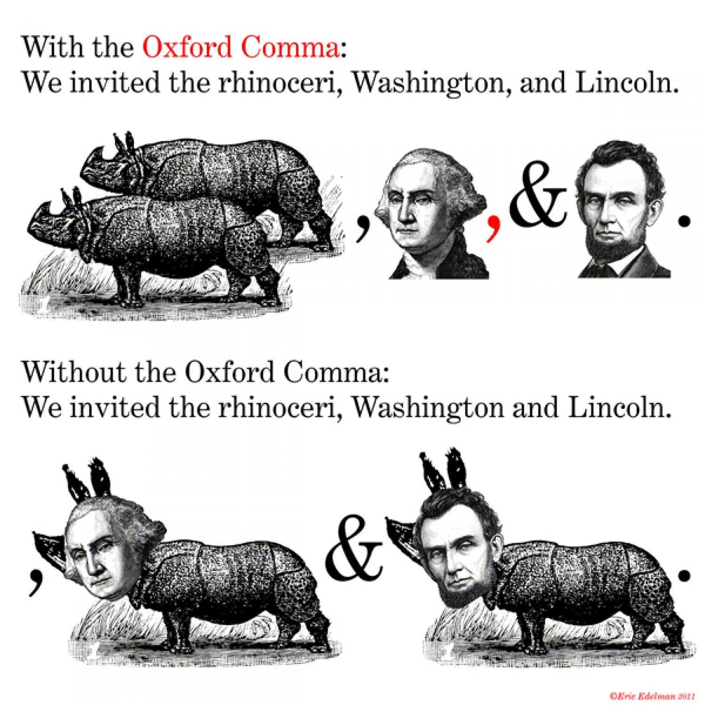
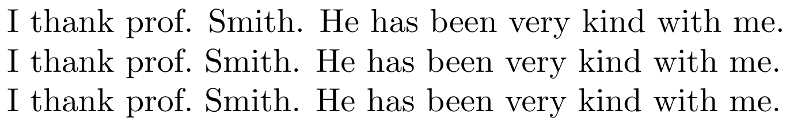
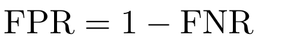
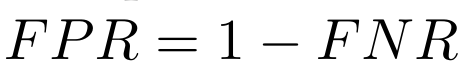
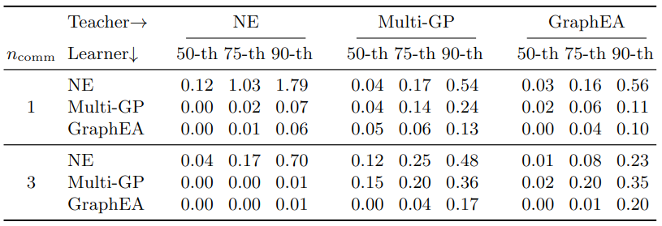
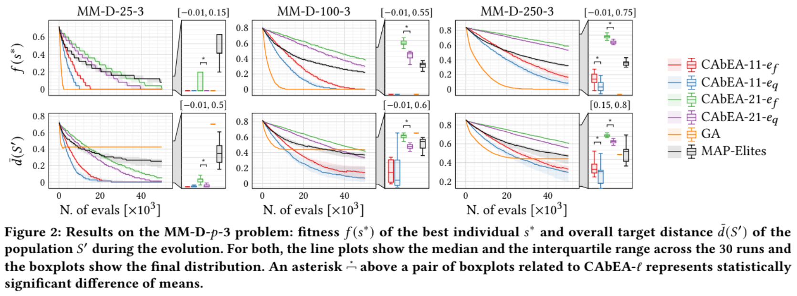
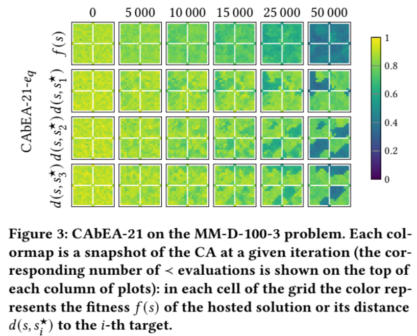
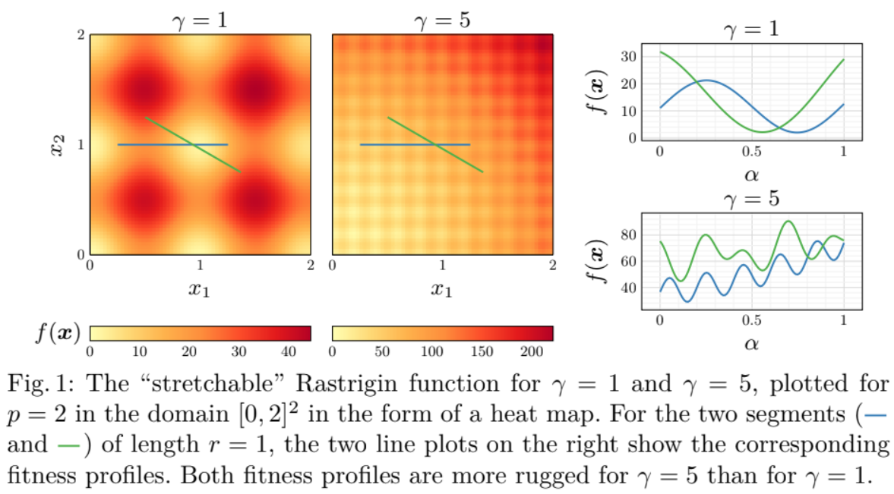

class: middle, center

# Authoring a pretty looking paper: practical tips and tricks
### SPECIES Summer School 2024

[Eric Medvet](http://medvet.inginf.units.it/)

.vspace1[]

Moraira (Spain)

August, 30th 2024

---

## Key premise!

.important[
Here:
- **personal** advices, based on my **personal** experience
- not a set of **rules** 
- there are many other points of views/advices, **sometimes conflicting** with mines
]

.vspace1[]

However:
- many of these advices are widely accepted and can be seen as expectations
- I (or someone like me) might be on the *other side*

.footnote[A web version of these advices is available on [my website](https://medvet.inginf.units.it/teaching/how-to-write)]

---

## Goals and pre-requisites

Ultimate goal: 
1. **please your reader**, by making your paper **pretty and enjoyable** from many points of view: .note[in descending order of granularity]
  - general structure
  - language
  - typography
2. and **yourself (and co-authors)**, by making your paper .note[and your research pipeline] **easier to maintain** and its production more **efficient**:
  - LaTeX constructs and packages
  - LaTeX source code style

.vspace1[]

Pre-requisites:
- basic knowledge of LaTeX

---

### Your readership

Who's that?
- other **scientists/researchers**:
  - they want to understand/enjoy your paper, maybe specific parts (algorithm, experiments, results, motivation, ...)
- **reviewers**
  - they want to ~~reject~~ understand your paper, but actually they are looking for defects, issues, reasons to complain
  
---

class: middle, center

## General structure

---

## Abstract

1. One or two sentences presenting the **general context** (e.g., robotics).
2. One or two sentences presenting the more **specific context** (e.g., design of controllers for modular robots).
3. One sentence, possibly *bold*, saying what is the current **gap, problem, or limitation**.
4. A few sentences introducing the **proposal of the paper**, clearly connecting them to the gap/problem/limitation of the previous sentence.
This part of the abstract usually starts with _In this paper, we propose..._.
5. One or two sentences mentioning the **experimental evaluation** of the proposal, possibly detailing (briefly!) the peculiarities of the experiments and anticipating the salient results.
6. Optionally (but nice to have!) one sentence attempting to summarize the **broader impact** of the research, beyond the specific context.

.note[Different communities might have different expectations]

---

### Example 1 .note[from [this paper](https://medvet.inginf.units.it/publications/2023-c-mpm-general/)]

.cols[
.c30[
1. .col1[general context]
2. .col2[specific context]
3. .col3[gap, problem, limitation]
4. .col4[proposal of the paper]
5. .col5[experimental evaluation]
6. .col6[broader impact]
]
.c70.compact[
.tc[
.col1[Graphs are a way to describe complex entities and their relations that apply to many practically relevant domains.]
.col2[However, domains often differ not only in the properties of nodes and edges, but also in the constraints imposed to the overall structure.]
.col3[This makes hard to define a general representation and genetic operators for graphs that permit the evolutionary optimization over many domains.]
.col4[In this paper, we tackle this challenge. We first propose a representation template that can be customized by users for specific domains: the constraints and the genetic operators are given in Prolog, a declarative programming language for operating with logic. Then, we define an adaptive evolutionary algorithm that can work with a large number of genetic operators by modifying their usage probability during the evolution: in this way, we relieve the user from the burden of selecting in advance only operators that are “good enough”.]
.col5[We experimentally evaluate our proposal on two radically different domains to demonstrate its applicability and effectiveness: symbolic regression with trees and text extraction with finite-state automata. The results are promising: our approach does not trade effectiveness for versatility and is not worse than other domain-tailored approaches.]
]]
]

---

### Example 2 .note[from [this paper](https://medvet.inginf.units.it/publications/2023-j-pbscsrmm-deep/)]

.cols[
.c30[
1. .col1[general context]
2. .col2[specific context]
3. .col3[gap, problem, limitation]
4. .col4[proposal of the paper]
5. .col5[experimental evaluation]
6. .col6[broader impact]
]
.c70.compact[
.tc[
.col1[The recent and rapid progresses in Machine Learning (ML) tools and methodologies paved the way for an accessible market of ML services.]
.col2[In principle, small and medium-sized enterprises, as well as big companies, could act as providers and consumers of services, resulting in an intense exchange of ML services where a consumer may ask many providers for a service preview based on its particular business case, that is, its data.]
.col3[In practice, however, many potential service consumers are reluctant to release their data, when seeking for ML services, because of privacy or intellectual property concerns. As a consequence, the market of ML services is not as fluid as it could be. An alternative to providing real data when looking for an ML service consists in generating and releasing synthetic data. The synthetic data should (a) allow the service provider to preview an ML service whose performance is predictive of the one the same service will achieve on the real data and (b) prevent the disclosure of the real data.]
.col4[In this paper, we propose a data synthesis technique tailored to a family of very relevant business cases: supervised and unsupervised learning on single-table datasets and relational datasets. Our technique is based on generative deep learning models and we instantiate it in three variants: standard Variational Autoencoders (VAEs), beta-VAEs, and Introspective VAEs.]
.col5[We experimentally evaluate the two variants to measure the degree to which they meet the two requirements above, using several performance indexes that capture different aspects of the quality of the generated data.]
.col6[The results suggest that data synthesis is a practical answer to the need of decoupling ML service providers and consumers and, hence, can favor the arising of an active and accessible market of ML services.]
]]
]

---

### Example 3 .note[from [this paper](https://arxiv.org/abs/2406.09787)]

.cols[
.c30[
1. .col1[general context]
2. .col2[specific context]
3. .col3[gap, problem, limitation]
4. .col4[proposal of the paper]
5. .col5[experimental evaluation]
6. .col6[broader impact]
]
.c70.compact[
.tc[
.col1[Biological neural networks are characterized by their high degree of plasticity, a core property that enables the remarkable adaptability of natural organisms.]
.col2[Importantly, this ability affects both the synaptic strength and the topology of the nervous systems.]
.col3[Artificial neural networks, on the other hand, have been mainly designed as static, fully connected structures that can be notoriously brittle in the face of changing environments and novel inputs.]
.col4[Building on previous works on Neural Developmental Programs (NDPs), we propose a class of self-organizing neural networks capable of synaptic and structural plasticity in an activity and reward-dependent manner which we call Lifelong Neural Developmental Program (LNDP). We present an instance of such a network built on the graph transformer architecture and propose a mechanism for pre-experience plasticity based on the spontaneous activity of sensory neurons.]
.col5[Our results demonstrate the ability of the model to learn from experiences in different control tasks starting from randomly connected or empty networks.]
.col6[We further show that structural plasticity is advantageous in environments necessitating fast adaptation or with non-stationary rewards.]
]]
]

---

## Tenses and sections

.cols[
.c20[
**Where**¹

Abstract  
Introduction
]
.c30[
**Tense**

Present tense
]
.c50[
**Examples**

.tc[We propose...]  
.tc[Current techniques have this limitation...]
]
]

.cols[
.c20[
Related works
]
.c30[
Past tense
]
.c50[
.tc[Smith et al. proposed...]  
.tc[revious works showed that...]
]
]

.cols[
.c20[
Problem statement  
Our approach
]
.c30[
Present tense
]
.c50[
.tc[Let $x$ be...]  
.tc[We repeat the following procedure $n$ times...]
]
]

.cols[
.c20[
Experimental evaluation
]
.c30[
Past (for what you did) and present (for comments) tense
]
.c50[
.tc[We considered four datasets...]  
.tc[We repeated the learning three times...]  
.tc[Figure 3 shows the results of...]  
.tc[We explain this gap in performance with...]
]
]

.cols[
.c20[
Conluding remarks
]
.c30[
Past (for recap) and future (for "promises") tense
]
.c50[
.tc[We considered the problem of...]  
.tc[We showed that...]  
.tc[We will extend the approach to...]
]
]

.footnote[
1. titles may be different
]

---

class: middle, center

## Language

---

## Use active voice

.center[.key[Use active voice!]]

It makes clear who is the actor/author of an action/claim, i.e., who is responsible
- .tc[We did something...]
- .tc[The algorithm works as follows: it initializes a set of..., it selects one...]
- .tc[Smith et al. showed that...]

.vspace1[]

.cols[
.c50[
#### ✅ Good

- .tc[**We run** BO for $20$ iterations and use the best $\eta$ seen during optimization as the final output.]
- .tc[To check the validity of the dimensionality reduction method used in our visualization methods, **we randomly selected** ten ideas (three about audio devices, three about transportation, two about music players, and two about cameras) and obtained their locations in Fig. 2 (Table II).]
]
.c50[
#### ❌ Bad

- .tc[Various measures **are derived** from the concepts and validated in two experiments that highlight their strengths and weaknesses.] By whom? Who did the experiments?
- .tc[Damage type 0 **was chosen** as it is similar to damage inflicted on the robot in other damage recovery research...] By whom? Who is accountable for this choice?
]

]

---

## Contracted forms

**Avoid contracted forms**
They are suitable for informal discourse
- ✅ **Good**: .tc[is not], .tc[does not], .tc[cannot], .tc[we will do]
- ❌ **Bad**: .tc[isn't], .tc[doesn't], .tc[can't], .tc[we'll do]

Unless, in trouble with text lenght, use parsimonously:
- .tc[w.r.t.] for .tc[with respect to]
- .tc[approx.] for .tc[approximatively]

If you use them, do it **consistently**, i.e., either always or never!

---

## Acronyms

Use acronyms for very frequent technical terms, e.g.:
- .tc[GP] for .tc[genetic programming]
- .tc[FPR] for .tc[false positive rate]

In general:
- expanded version with acronym at the **first usage**
  - .tc[We use genetic programming (GP) for optimizing...]
- acronym only at **every subsequent usage**
  - .tc[Figure 2 shows that GP performs better than...]

... with some exceptions:
- if term is used only once in the abstract, show just the expanded version in the abstract
- reintroduce expanded+acronym at first usage after abstract
- (possibly) reintroduce expanded+acronym at first usage in conclusions
- (possibly) use expanded+acronym if in section title

---

### Capitalization and articles

Be **consistent** with capitalization:
- ✅ **Good**: .tc[Genetic Programming (GP)] and .tc[False Positive Rate (FPR)]
- ✅ **Good**: .tc[genetic programming (GP)] and .tc[false positive rate (FPR)]
- ❌ **Bad**: .tc[Genetic Programming (GP)] and .tc[false positive rate (FPR)]

... but caring about special cases:
- .tc[Smith’s sorting algorithm (SSA)] even with .tc[genetic programming (GP)]

.vspace1[]

Use proper article, if any, before:
- **expanded**, the proper one
  - .tc[we employ **a** multilayer perceptron (MLP)]
- **acronym**, the one used if you pronounce the letters
  - .tc[we employ **an** MLP]

---

### How?

A lot of things to care about for acronyms .note[the what]

.vspace1[]

🤔 How to do that? .note[the how]
- "easy", with the proper LaTeX package (later)

---

## British vs. American English

🇺🇸: .tc[color], .tc[behavior], .tc[focused], .tc[labeled], ...

🇬🇧: .tc[colour], .tc[behaviour], .tc[focussed], .tc[labelled], ...

.note[this is just about basic differences]

.vspace1[]

Choose one and use it **consistently**.
- exploit your authoring tool (e.g., Overleaf with spell checking and language setting)

---

## Possessive case

.center[to .tc['s] or not to .tc['s]?]

In theory:
- .tc['s] with:
  - **people** (both proper and common names): ✅ .tc[the user's preference], ✅ .tc[Smith's sorting algorithm], ✅ .tc[the authors' opinion]
  - (some) physical places (cities, countries) .note[usually not relevant in papers]
  - (some) temporal adverbs: ✅ .tc[today's meeting]
- no .tc['s] elsewhere
  - ✅ .tc[the algorithm complexity], ❌ .tc[the algorithm's complexity]
  - same for .tc[policy], .tc[genotype], ...

.vspace1[]

Many corner cases:
- 🤔 .tc[individual]
- 🤔 .tc[robot]
- 🤔 .tc[agent]

---

class: middle, center

## Typography

---

## I.e., e.g., and vs.

- .tc[i.e.] stays for .tc[*id est*] (Latin for .tc[that is])
- .tc[e.g.] stays for .tc[example given]
- .tc[vs.] stays for .tc[versus] (Latin for .tc[against])

For both:
- **a comma before and a comma after**
  - ✅ .tc[we increase $i$, i.e., the counter]
  - ❌ .tc[we increase $i$, i.e. the counter] .note[missing the comma after also trigger a space "rendering" problem, see later]
  
For i.e. and vs.:
- since it is Latin, possibly show it in alternative font variant, i.e., italics:
  - ✅ .tc[we increase $i$, *i.e.*, the counter]
- ideally, use italics consistently also for .tc[et al.]¹, .tc[etc.]

.footnote[
1. Ideally, you never write .tc[et al.] directly, since you use a LaTeX package for writing references)
]

---

## Dashes

There are three dashes:
- **hyphen** - (`-` in LaTeX), for **composed words**
  - without spaces before and after
  - if you use two similar composed works close to each other, you can shorten one: .tc[we tested an MLP- and a random-based controller...]
- **en-dash** – (`--` in LaTeX), for ranges: .tc[$25\text{--}35$]
  - possibly rely on proper LaTeX packages .note[later] for ranges
- **em-dash** — (`---` in LaTeX), for parenthetical thought (**asides**)
  - without spaces before and after: .tc[We tested this approach with an MLP—we also experimented with other kinds of controller with no qualitative different findings.]

---

## Oxford comma

A pretty **popular** matter:
.cols[
.c50.center[
.h25ex.center[]
]
.c50.center[
.h25ex.center[]
]
]

.center.tc[We experimented with **GA, GP.col2[,] and GE**.]

Use it! .note[my personal advice]

Or don't use it, but be **consistent**!

---

## Ordinal numbers

Three .note[at least] possible forms:
- .tc[$i$-th] .note[my preferred one]
- .tc[$i$th]
- .tc[$i^\\text{th}$]

Choose your preferred one and be **consistent**!

.vspace1[]

When you have few ordinals, use the extended form:
- ✅ .tc[We take the second element of the vector]
- ✅ .tc[where $\\vect{x}^{(j)}$ is the $j$-th sample of the data sequence]

---

## Typesetting mathematical notation

- **Premise 1**.
Choosing the mathematical notation for an entity is like choosing the **name of a variable/type/method**/... in a piece of code: choosing the **right** name is often half of the **modeling** job.
So it's much more than just typography.

- **Premise 2**.
There are specific praxes and expectations in some scientific communities.
If possible, try to conform to those praxes if your document will be consumed by people belonging to a community.

---

## Single-letter entities

Try (hardly!) to use **only one letter** for math entities!

Example:
- if one single parameter concerning the quantity of something
  - ✅ .tc[$n$]
- if two of them:
  - ✅  .tc[$n$] and .tc[$m$]
- several of them, use **subscripts**:
  - ✅ .tc[$n\\subtext{pop}$], .tc[$n\\subtext{gen}$], and .tc[$n\\subtext{tour}$]
  - ❌ .tc[$n\\_{pop}$], .tc[$n\\_{gen}$], and .tc[$n\\_{tour}$] .note[see later]
  - ❌ .tc[$\\text{pop}$], .tc[$\\text{gen}$], and .tc[$\\text{tour}$]
  - ❌ .tc[$pop$], .tc[$gen$], and .tc[$tour$] .note[see later]
  
---

## Collections and vectors

- **collections** (sets, bags) of items $\\rightarrow$ uppercase letters: .tc[$A$]
- their **elements** $\\rightarrow$ consistent lowercase letters: .tc[$a \\in A$]
- **collections of collections** $\\rightarrow$ *calligraphic* uppercase letters: .tc[$\\mathcal{A}$] .note[`\mathcal{}` in LaTeX]
- **vectors** (or, intuitively, fixed-length homogeneous sequences) $\\rightarrow$ bold: .tc[$\\vect{x}$]
  - prettier/lighter than upper arrow, in particular with superscripts: .tc[$\\vec{x}^{(i)}$] vs. .tc[$\\vect{x}^{(i)}$]
  - possibly use also for matrices: .tc[$\\vect{a} \\in \\mathbb{R}^{n \\times m}$] or .tc[$\\vect{A} \\in \\mathbb{R}^{n \\times m}$] 

For delimiting the content:
- order matters (vectors, sequences, tuples): round parentheses
  - extended version: .tc[pair $p=(a,b)$], .tc[vector $\\vect{x}=(x\\sub{1}, x\\sub{2}, x\\sub{3})$] .note[also square brackets, but better for vector concatenation .tc[$\\vect{x} = [\\vect{x}\\subtext{train} \\; \\vect{x}\\subtext{test}]$]]
  - contracted version: .tc[$\\vect{s}=(s\\_i)\\_i$] (or, with explicit bounds, .tc[$\\vect{s}=(s\\_i)\\sub{i=1}\\sup{i=n}$])
- order does not matter (sets, bags): curly brackets
  - expanded: .tc[set $A=\\\\{a\\sub{1},a\\sub{2},\\dots\\\\}$] with "unkown" size, or .tc[set $A=\\\\{a\\sub{1},\\dots,a\\sub{n}\\\\}$] with "known" size $n$
  - contracted: .tc[dataset $D\\subtext{learn}=\\left\\\\{\\left(x^{(i)},y^{(i)}\\right)\\right\\\\}\\sub{i}$]
  
Example:
.tc[Given a set $\\mathcal{X} = \\\\{X\\_1,X\\_2,\\dots\\\\}$ of datasets, where each $X\\_j=\\left\\\\{\\vect{x}^{(1)}, \\vect{x}^{(2)}, \\dots\\right\\\\}$, with $\\vect{x}^{(j)}=\\left(x\\sub{i}^{(j)}\\right)\\sub{i=1}\\sup{i=p} \\in \\mathbb{R}^p$, we do this and that...]

---

## Functions signature and mapping

In general, formally specify the **domain** of math entities (at least once)
- .tc[the genotype $g \\in \\mathbb{R}^p \\times \\\\{\\text{true}, \\text{false}\\\\}$ is a pair of a $p$-long real vector and a Boolean]
- this answers the key question "what's a $g$?"

Functions and mappings:
- domain and co-domain: .tc[$f: \\mathbb{R} \\to [0,1]$] .note[`\to` in LaTeX]
  - specify the *signature* of any valid $f$, i.e., from what to what, not the how .note[like an `interface`]
- actual processing of an $f$: .tc[$x \\mapsto \\min(x^2,1)$] .note[`\mapsto` in LaTeX]
  - specify the actual working of one specific $f$ .note[like a `class`]
  
---

class: middle, center

## LaTeX

---

## Ellipses

Use `\dots`, not a literal `...`, both in text and math mode!
.note[There's an ellipses char `…`]

.vspace1[]

.cols[
.c50[
#### ✅ Good (with `\dots`)

.tc[$\text{We tested with one, two, \\dots users}$]

.tc[$A=\\\\{a\\sub{1},\\dots,a\\sub{n}\\\\}$]
]
.c50[
#### ❌ Bad (with `...`)
.tc[$\text{We tested with one, two, ... users}$]

.tc[$A=\\\\{a\\sub{1},...,a\\sub{n}\\\\}$]
]
]

---

## Double quotes

Use <code>\`\`something''</code>, not `"something"`!

.vspace1[]

.cols[
.c50[
#### ✅ Good (with <code>\`\`...''</code>)

.tc[$\\text{Users stated to be ``satisfied''}$]

]
.c50[
#### ❌ Bad (with `"..."`)
.tc[$\\text{Users stated to be "satisfied"}$]
]

.footnote[
When you need to extensively use quotes, maybe because you are literally quoting others' text, use a package, e.g., `csquotes`.]
]

---

## Emphasis

For emphasized text, use `\emph{}`, not `\textit{}`!

Why?
1. `\emph{}` makes clear you are giving a role (i.e., to be emphasized) to the argument, not just a rendering directive; `\textit{}` looks like a rendering directive .note[many languages try to separate concerns, what from how; LaTeX is not good at this]
2. when rendering `\emph{}` takes context (i.e., surrounding text) into account
  - e.g., `\begin{theorem}...\end{theorem}` often renders text in italics: a `\textit{}` wouldn't have effect, an `\emph{}` has
  
When to emphasize?
- at the first occurrence of key terms, usually at their definition
  - .tc[A *strategy* is a function $s: [0,1]^2 \\to [0,1]^2$ that maps one coordinate to another coordinate...]
  
---

## Controlled and unbreakable spaces

When rendering, LaTeX usually puts a larger space after a fullstop, to ease readabilty by separating sentences; however it does not tell apart actual sentences separators from other usages of the fullstop.

Use:
- controlled space `\ ` for spaces after *fake* fullstops
- unbreakable space `~` to prevent linebreaking after (*fake*) fullstops

.vspace1[]

LaTeX:

❌ `I thank prof. Smith. He has been very kind with me.`  
✅ `I thank prof.\ Smith. He has been very kind with me.`  
✅ `I thank prof.~Smith. He has been very kind with me.`

Rendered:

.w75p[]

---

### Small/tiny details

Should I really care about those tiny details?

You could overlook at them, but remember:
- **you submitted** your paper to reviewers, **asking them to evaluate** it
- they do their job, they evaluate it
  - 🧐 often, they are very **picky** and attentive
  - 😈 often, they are more than happy to find issues/reasons to reject
  
.vspace1[]

**You**: "*Please, come to my house to taste my food,*" (my food = my research) "*but please don't mind the dirt on the cutlery*" (the cutlery .note[what is needed to consume the food] = my presentation of my research)

**Reviewer**: "*If they are not even able to clean the cutlery, should I trust them in their ability to prepar complex foods?*"

---

## Multi-letter math entities

(Recall: avoid multi-letter names!)

Words in math environment $\\rightarrow$ enclose within `\text{}`

For some "popular" functions, there's a LaTeX command, e.g., `\max`
- or you may define it: `\DeclareMathOperator*{\argmax}{\arg\,max}` .note[`\,` puts a nice short space between arg and max]

.cols[
.c50[
#### ✅ Good (with `\text{}`)

.tc[$\text{FPR}=1-\text{TNR}$]

.h3ex[]

.tc[$n\\subtext{pop}$]

.tc[$\max_{x} f(x)$]

.tc[$\argmax\\sub{\\vect{g}} \\frac{\text{weight}(\\vect{g})}{\\lVert\\vect{g}\\rVert}$]

]
.c50[
#### ❌ Bad (without `\text{}`)

.tc[$FPR=1-TNR$]

.h3ex[]

.tc[$n\\sub{pop}$]

.tc[$max_{x} f(x)$]

.tc[$argmax\\sub{\\vect{g}} \\frac{weight(\\vect{g})}{\\lVert\\vect{g}\\rVert}$]
]
]

---

## Bracket size

Use `\left` and `\right` before brackets (of any type) to make them fit their content

.vspace1[]

.cols[
.c70[
#### ✅ Good (with `\left` and `\right`)
]
.c30[
#### ❌ Bad (without)
]
]
.cols[
.c70[
`k \left(\frac{1}{n+1}\right)` $\\rightarrow$ .tc[$k \\left(\\frac{1}{n+1}\\right)$]
]
.c30[
.tc[$k (\\frac{1}{n+1})$]
]
]

.cols[
.c70[
`\left\{\vect{v}^{(k)}\right\}_k` $\\rightarrow$ .tc[$\\left\\\\{\\vect{v}^{(k)}\\right\\\\}\\_k$]
]
.c30[
.tc[$\\\\{\\vect{v}^{(k)}\\\\}\\_k$]
]
]

.cols[
.c70[
`\left\lfloor n \frac{j}{k} \right\rfloor` $\\rightarrow$ .tc[$\\left\\lfloor n \\frac{j}{k} \\right\\rfloor$]
]
.c30[
.tc[$\\lfloor n \\frac{j}{k} \\rfloor$]
]
]

.cols[
.c70[
`\left\langle \vect{x}^\intercal \vect{x} \right\rangle` $\\rightarrow$ .tc[$\\left\\langle \\vect{x}^\\intercal \\vect{x} \\right\\rangle$]
]
.c30[
.tc[$\\langle \\vect{x}^\\intercal \\vect{x} \\rangle$]
]
]

---

class: middle, center

## Useful LaTeX packages

---

## Premise

- LaTeX is very old: **1985** .note[I'm older, actually...]
- Typesetting scientific documents is even older!

.center[$\Downarrow$]

Very very likely, you are not the first one trying to do one certain thing:
- e.g., properly formatting a table
- e.g., showing authors' names for some references
- ...

.center[$\Downarrow$]

- if you think your document is not nice enough, e.g., with ugly tables, search for suggestions
- if you think your document *is* nice, but actually it is not, look at other nice documents!

---

## `siunitx` for quantities and measures

For raw numbers (i.e., raw quantities, usually not for years and dates) with `\num`:
- in text: `we performed this procedure \num{30} times`
- in math with big numbers `$x=\num{10000}$`, rendered as $10\\,000$ instead of $10000$

For quantities with measure with `\qty`:
- `the experiment lasted more than \qty{35}{\second}`
- `we used a machine with \qty{16}{\giga\byte} RAM`

For ranges and lists:
- `runs took \qtyrange{10}{25}{\minute}`
- `we experimented with \numlist{1;10;15;25} moves for each user` (with Oxford comma if `\sisetup{list-final-separator = {, and }}`)

In tables for making nicely aligned columns, by specifying format:
- `S[table-format:3.2]`

---

## `glossaries` for acronyms

Define all of them at the beginning of the document:
- `\newacronym{ea}{EA}{evolutionary algorithm}` (name, rendered short version, rendered extended version)

Use them:
- `\gls{ea}` gives .tc[evolutionary algorithm] at the first occurrence and .tc[EA] later
- `\glspl{ea}` gives .tc[evolutionary algorithms] at the first occurrence and .tc[EAs] later
- `\Gls{ea}` gives .tc[Evolutionary algorithm] at the first occurrence and .tc[EA] later
- ...

Possibly reset occurrences after abstract with `\glsresetall`

If you use `\hyperref` all acronyms are rendered with a link, which might be annoying: disable it with `\glsdisablehyper`

---

## `natbib` for citations

**Premise**: the format of citations *in the text* and of references *in the References* section is almost always **dictated by the template** of the document (i.e., by the journal/conference).
Adhere to it!

However:
- `\citet{smith19cost} showed that the cost` gives .tc[Smith et al. [32] showed that the cost], i.e., you don't actually write `Smith`

Other examples [here](https://it.overleaf.com/learn/latex/Natbib_citation_styles).

---

## `enumitem` for lists

In particular for inline lists:
- e.g., .tc[We proceed as follows: (i) we compute the initial value, (ii) we increase it...]
- e.g., .tc[Our algorithm meets the two aforementioned requirements, because (a) it always produces a valid solution and (b) it does not require...]
- improves readability
- remarks importance
- makes items referenceable

Use:
- preamble: `\usepackage[inline]{enumitem}`
- in place:
  - begin: `\begin{enumerate*}[label=(\roman*)]` .note[or `(\alph*)` or `\arabic*.`...)
  - item (with label): `\item \label{item:alg-desc-find} we compute...`
  - end: `\end{enumerate*}`
- possibly reference: `Step~\ref{item:alg-desc-choose-rule} is the main contribution of this work.` 

---

## `booktables` for tables

**General rules**:
- no vertical rules, only vertical (`\toprule`, `\midrule`, `\bottomrule`)
- separation through grouping (`\multirow`, `\multicolumn`, `\cmidrule`) and spacing (`@{\hspace{1mm}}`)
- align numbers with decimal separator (`S[table-format=1.2]`, not just `r` or `c`)

.w100p.center[]

.note[source code [here](https://medvet.inginf.units.it/teaching/how-to-write/#tables-with-codebooktables%2fcode)]

---

## `pgfplots` for plots (and more)

Making **nice and informative** plots is hard!

A good tool may help for:
- greater style consistency
- greater efficiency

`pgfplots` is **the** tool .note[in the LaTeX ecosystem]

But:
- the learning curve is very steep
- some possibilities are still unexplored
- something is simply "impossible" .note[I'm pointing at you, Violin plot!]

---

### Complex plot 1

.w100p[]

.footnote[From [this](https://medvet.inginf.units.it/publications/2024-c-pnm-role/) paper.]

---

### Complex plot 2

.center.w65p[]

.footnote[From [this](https://medvet.inginf.units.it/publications/2024-c-pnm-role/) paper.]

---

### Complex plot 3

.center.w90p[]

.footnote[From [this](https://medvet.inginf.units.it/publications/2024-c-emnst-factors/) paper.]

