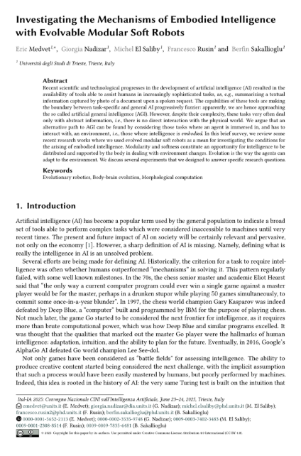

class: middle, center

# Investigating the Mechanisms of Embodied Intelligence with Evolvable Modular Soft Robots

[Eric Medvet](http://medvet.inginf.units.it/), Giorgia Nadizar, Michel El Saliby, Francesco Rusin, Berfin Sakallioglu

Evolutionary Robotics and Artificial Life Lab, Dip. di Ingegneria e Architettura, Università di Trieste

.vspace1[]

.center[
.h10ex[]
]

Ital-IA - Workshop su AI per la Robotica, 23 June 2025, Trieste

.vspace1[]

.center[
.h5ex[]
.hspace5[]
.h5ex[]
.hspace5[]
.h5ex[]
]

---

## Intelligence?

> **in·​tel·​li·​gence** - *in-ˈte-lə-jən(t)s*
> - the ability to learn or understand or to deal with **new or trying** situations
> - the ability to apply knowledge to **manipulate one's environment** or to think abstractly as measured by objective criteria

- "new", "trying": time matters $\\rightarrow$ .key[adaptation]
- "manipulates one's environment"  $\\rightarrow$ .key[agent] (=**brain+body**) within .key[environment]

--

**When** (for how long) does adaptation occur? 
- for many agents' life: evolution
- for an entire agent's life: development
- for a part of agent's life: **learning**

**Where** does adaptation occure?
- only in a **centralized brain**
- in coordinating parts of a distributed brain
- in brain and body

---

## Voxel-based soft robots

.cols[
.c70[
- many **soft cubes** "glued" together
  - "infinite" degrees of freedom
  - also as **collective intelligence**!
- each can expand or contract over time, aggregated behavior
- optimizable body and brain
  - **body** $\\approx$ how many, where placed, what material
  - **brain** $\\approx$ how volumes change over time
- actually fabricable, but .note[currently] poorly controllable in reality
  - use a **simulated** version

<video autoplay muted loop><source src="images/striscia.mp4" type="video/mp4"/></video>

.vspace1[]

]
.c30[
.w100p.center[]

.w100p.center[]

]
]

.bnote[
Top image from .ref[Hiller, Jonathan, and Hod Lipson. "Automatic design and manufacture of soft robots." IEEE Transactions on Robotics 28.2 (2011): 457-466.]

Bottom image from .ref[Legrand, Julie, et al. "Reconfigurable, multi-material, voxel-based soft robots." IEEE Robotics and Automation Letters 8.3 (2023): 1255-1262.], then many works
]

---

## Coupling of body and brain: criticality1

**Research question**: what makes a body good for different tasks? (locomotion, cave escape, jump)
- here as: what makes a single body "intelligent"?

Idea:
1. "critical systems allow for optimal information processing" $\\rightarrow$ **criticality**
  - the property of being on the boundary between order and chaos (intuitively)
2. *define* criticality for bodies
3. optimize bodies for criticality
4. check if high-criticality bodies are better then low-criticality bodies across different tasks

.footnote[
1. .ref[Talamini, Medvet, Nichele; Criticality-driven Evolution of Adaptable Morphologies of Voxel-Based Soft-Robots; Frontiers in Robotics and AI (FRAI); 2021]
]

--

.vspace1[]

.cols[
.c70[
Measuring body criticality (**task agnostic**!):
1. apply one stimulus to only one voxel
2. count how many voxels it impacts on (**avalanche** size)
3. measure how well the distribution of the avalanche size fits

$\\Rightarrow$ can be used to **drive on optimization** on bodies!
]
.c30[
.center.w90p[]
]
]

---

### Results: bodies optimized for criticality are adaptable!!!

.cols[
.c30.center[
"Manual" bodies
.w75p[]

Random bodies
.w100p[]

Grown bodies
.w100p[]

**Optimized bodies**
.w100p[]
]
.c70[
Procedure:
1. take a body $b$
2. optimize a brain for $b$ for a task $t$ .note[always same type of brain]
3. compute the **average rank** $\\mu_r$ of $b$+optimized brain in $t$ .note[w.r.t. all bodies with their optimized brains]
  - the lower $\\mu_r$, the better!
  
.center.w50p[]

Here: **the larger the body complexity** ($\\approx$criticality)**, the more intelligent** ($\\approx$adaptable) **the robot!**
]
]

---

## Beyond the single body+brain

.cols[
.c70[
Being modular, a VSR can be seen as a "swarm" of robots
- w.r.t. "classical" swarms, **tighter** interactions among robots
]
.c30.center[
.w75p[]
]
]

.diagram.center[
otext(450,-15,'One agent')
rect(50,0,800,110)
otext(190,35,'Body (sensors) $B\\\\subtext{in}$')
rect(90,50,200,50)
otext(190,75,'$f\\\\suptext{state}\\\\sub{B\\\\subtext{in}},f\\\\suptext{out}\\\\sub{B\\\\subtext{in}},s\\\\sub{B\\\\subtext{in}}^{(0)}$')
otext(450,35,'Brain $C$')
rect(350,50,200,50)
otext(450,75,'$f\\\\suptext{state}\\\\sub{C},f\\\\suptext{out}\\\\sub{C},s\\\\sub{C}^{(0)}$')
otext(710,35,'Body (actuators) $B\\\\subtext{out}$')
rect(610,50,200,50)
otext(710,75,'$f\\\\suptext{state}\\\\sub{B\\\\subtext{out}},f\\\\suptext{out}\\\\sub{B\\\\subtext{out}},s\\\\sub{B\\\\subtext{out}}^{(0)}$')
otext(450,130,'Environment (including the other agents)')
rect(350,150,200,50)
otext(450,175,'$f\\\\suptext{state}\\\\sub{E},f\\\\suptext{out}\\\\sub{E},s\\\\sub{E}^{(0)}$')
link([350,175,0,175,0,75,50,75],'a')
link([-10,125,10,125],'t')
link([850,75,900,75,900,175,550,175],'a')
link([50,75,90,75],'a')
otext(320,60,'$o^{(k)}$')
link([290,75,350,75],'a')
otext(580,60,'$a^{(k)}$')
link([550,75,610,75],'a')
link([810,75,850,75],'a')
]

.cols[
.c50[
"**Where's the intelligence?**" answer gains a dimension:
- before: body vs. brain
- now: single agent vs. collection of agents .note[in VSRs, agent$=$voxel]
]
.c50[
Open topics:
- voxels **communication**
- voxels **specialization**
- voxels **collaboration**
]
]

---

## Intelligence is collective (if needed)1

**Identical** agents: same body, **some brain**!
- not constrained to stay physically attached
- can attach/detach

.cols[
.c50[
.center[Goal: run **all together** (avg $v\_x$)]
.w75p[
<video autoplay muted loop>
    <source src="images/collective-locomotion-avg.mp4" type="video/mp4"/>
</video>
]
]
.c50[
.center[Goal: **one** run (max $v\_x$)]
.w75p[
<video autoplay muted loop>
    <source src="images/collective-locomotion-max.mp4" type="video/mp4"/>
</video>

- **specialization** emerges!
  - without plasticity
  - "between" agent and environment
]
]
]

.footnote[
1. .ref[Rusin, Medvet "How Perception, Actuation, and Communication Impact on the Emergence of Collective Intelligence in Simulated Modular Robots"] .note[ongoing work]
]

---
class: middle, center

## Investigating the Mechanisms of Embodied Intelligence with Evolvable Modular Soft Robots

.cols[
.c30.center[
This slide deck:

<!-- with https://www.qrcode-monkey.com/# -->
.w75p.center[]
]
.c40.center[
Paper:

.w50p.center[[.framed[]](https://medvet.inginf.units.it/publications/2025-c-mners-investigating/)]
]
.c30[
Authors:

**Eric Medvet**  
Giorgia Nadizar  
Michel El Saliby  
Francesco Rusin  
Berfin Sakallioglu
]
]

More at [medvet.inginf.units.it](http://medvet.inginf.units.it/)

