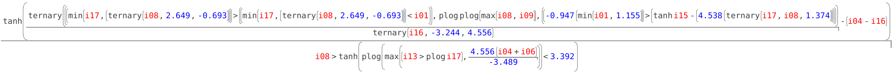
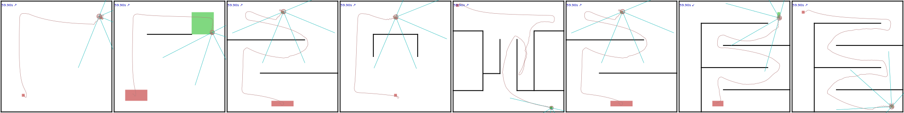

class: middle, center

# Hierarchical intelligence
## (seed for discussion)

[Eric Medvet](http://medvet.inginf.units.it/)

*Evolutionary Robotics and Artificial Life Lab, Dip. di Ingegneria e Architettura, Università di Trieste*

.vspace1[]

ALICE Workshop, 2 February 2026, Copenhagen

.vspace1[]

.center[
.h5ex[]
.hspace5[]
.h5ex[]
.hspace5[]
.h5ex[]
]

---

## Case: navigation

.cols[
.c30[
<video autoplay muted loop><source src="navigation/me.dpos-mono-tree-0.5-02/train.progressive/best-test-maze-traj.mp4" type="video/mp4"/></video>
]
.c70[
What is this?
- $7 \times 3$ inputs, $2$ outputs
- symbolic brain, optimized through evolutionary computation (MAP-Elites)
- reactive behavior

**Opportunity**
- "long-term" planning, *then* executrion
- about *time*
]
]
.w100p.center[]
.w100p.center[]

---

## Case: modular soft robots

.cols[
.c40[
<video autoplay muted loop><source src="vsr/ga-1-001.mp4" type="video/mp4"/></video>

.w100p.center[]
]
.c60[
What is this?
- one brain in each module $\\Rightarrow$ no central "authority"
- $4+4$ inputs, $1+4$ outputs
- ANN-based brain, optimized through evolutionary computation (GA)
- reactive behavior

**Opportunity**
- high-level body roles, local executrion
- about *space*
- but also about time
]
]

---

## Questions?

- what kind of bodies and brain allow for hierarchical intelligence?
- what's the hierarchy? are two levels enough? how to detect an hierarchical organization?
- should different levels have the same goals?
- should the information (amount and time resolution) available to levels be the same?

---

class: middle, center

# Discussion

---

## Outline

1. Do you think this is a relevant topic? Do you like it?
2. Are you aware of related things?
3. What would you start from? What would be the first research question?
4. How would you define a set of experiments for answering the research question(s)?

---

## Relevance

Do you think this is a relevant topic? Do you like it?

- the things you would write in an introduction (first paragraph(s)) for motivating the research
- the thing you would write in the conclusions as a perspective impact of the work

---

## Related works

Are you aware of related things?

---

## Research question(s)

What would you start from? What would be the first research question?

Likely necessary:
- a definition of hierarchical

Possible questions:
- is some (forcibly) hierarchical brain better than a non-hierarchical brain?
- does hierarchy naturally emerges?
- is there an "optimal" number of levels in the hierarchy?
- does hierarchy lead to different behaviors?
- ...

---

## Experiment design

How would you define a set of experiments for answering the research question(s)?

- what kind of agent? toy vs. "realistic" setting?
- what kind of brain? (and body)
- what kind of optimization? evolution/development/plasticity/learning?
