class: middle, center

# Evolutionary modular robotics

## A tool for investigating embodied intelligence

[Eric Medvet](http://medvet.inginf.units.it/)

.vspace1[]

The 23rd International Conference on **Unconventional Computation and Natural Computation**

26 June 2026 - Trieste

.vspace1[]

.vspace1[]

.center[
.h5ex[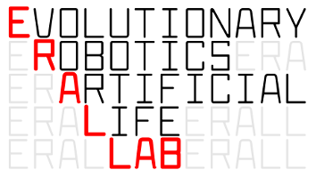]
.hspace5[]
.h5ex[]
.hspace5[]
.h5ex[]
]

---

## Intelligence?

> **in·​tel·​li·​gence** - *in-ˈte-lə-jən(t)s*
> - the ability to learn or understand or to deal with **new or trying** situations
> - the ability to apply knowledge to **manipulate one's environment** or to think abstractly as measured by objective criteria

- "new", "trying": time matters $\\rightarrow$ .key[dynamical systems]
- "manipulates one's environment"  $\\rightarrow$ .key[agent]/.key[environment]

---

## Dynamical system

.cols[
.c60[
A .note[time invariant1] .key[dynamical system] $D$ in **discrete time** ($k \\in \\mathbb{N}$) is defined by:
- a **state update function**2 $f\\suptext{state}: S \\times I \\to S$
- an **output function**2 $f\\suptext{out}: S \\times I \\to O$
- an initial state $s^{(0)} \\in S$

where
- $S$ is the **state space**
- $I$ is the **input space**
- $O$ is the **output space**
]
.c40[
.diagram.center[
link([0,25,100,25],'a')
rect(100,0,200,50)
link([300,25,400,25],'a')
otext(50,10,'$i^{(k)}$')
otext(350,10,'$o^{(k)}$')
otext(200,25,'$f\\\\suptext{state},f\\\\suptext{out},s^{(0)}$')
]

The system evolves (i.e., changes) over time as:  
$s^{(k)} \\seteq f\\suptext{state}(s^{(k-1)}, i^{(k)})$  
$o^{(k)} \\seteq f\\suptext{out}(s^{(k-1)}, i^{(k)})$

.vspace1[]

Set of dynamical systems on $I, O, S$:  
$\\mathcal{D}\\sub{I,O,S}=\\mathcal{F}\\sub{S \\times I \\to S} \\times \\mathcal{F}\\sub{S \\times I \\to O} \\times S$
]
]

.compact[
Particular case: **stateless** dynamical .note[i.e., static] system
- $S = \\emptyset$, i.e., no memory
- no $f\\suptext{state}$, $f\\suptext{out}: I \\to O$, i.e., just a function $\\Rightarrow$ $\\mathcal{D}\\sub{I,O,\\emptyset}=\\mathcal{F}\\sub{I \\to O}$
]

.footnote[
1. more generally, given $t = k \\delta t$, $f\\suptext{state}: \\mathbb{R}^+ \\times S \\times I \\to S$, $f\\suptext{out}: \\mathbb{R}^+ \\times S \\times I \\to O$
2. potentially stochastic functions, $f\\suptext{state}: S \\times I \\to \\mathcal{P}\_S$, $f\\suptext{out}: S \\times I \\to \\mathcal{P}\_O$
]

---

## Agent/environment

.cols[
.c40[
.key[Agent]: an entity capable of performing actions which may result in changing its **state** or the .key[environment] state.
]
.c60[
.diagram.center[
link([100,175,0,175,0,25,100,25],'a')
otext(200,-15,'Agent')
rect(100,0,200,50)
link([300,25,400,25,400,175,300,175],'a')
otext(50,10,'$o^{(k)}$')
otext(350,10,'$a^{(k)}$')
otext(200,25,'$f\\\\suptext{state}\\\\sub{A},f\\\\suptext{out}\\\\sub{A},s\\\\sub{A}^{(0)}$')
otext(200,135,'Environment')
rect(100,150,200,50)
otext(200,175,'$f\\\\suptext{state}\\\\sub{E},f\\\\suptext{out}\\\\sub{E},s\\\\sub{E}^{(0)}$')
link([-10,100,10,100],'t')
otext(75,100,'$k \\\\to k+1$', 'compact')
]
]
]

Both agent and environment are **dynamical systems**, but terminology reflects the agent point of view:
- agent $A \\in \\mathcal{D}\\sub{O,A,S\_A}$
  - an input is an observation (of the environment): $I\_A=O$, the **observation space** 
  - an output is an action (on the environment): $O\_A=A$, the **action space** .note[former $O$]
- environment $E \\in \\mathcal{D}\\sub{A,O,S\_E}$
  - an input is the agent's action: $I\_E=A$
  - an output is what the agent will observe at $k+1$: $O\_E=O$

---

## Embodied agent

.key[Embodied agent]1 (or **robot**): an agent with a **body**2.

.diagram.center[
otext(450,-15,'Agent')
rect(50,0,800,110)
otext(190,35,'Body (sensors) $B\\\\subtext{in}$')
rect(90,50,200,50)
otext(190,75,'$f\\\\suptext{state}\\\\sub{B\\\\subtext{in}},f\\\\suptext{out}\\\\sub{B\\\\subtext{in}},s\\\\sub{B\\\\subtext{in}}^{(0)}$')
otext(450,35,'Brain $C$')
rect(350,50,200,50)
otext(450,75,'$f\\\\suptext{state}\\\\sub{C},f\\\\suptext{out}\\\\sub{C},s\\\\sub{C}^{(0)}$')
otext(710,35,'Body (actuators) $B\\\\subtext{out}$')
rect(610,50,200,50)
otext(710,75,'$f\\\\suptext{state}\\\\sub{B\\\\subtext{out}},f\\\\suptext{out}\\\\sub{B\\\\subtext{out}},s\\\\sub{B\\\\subtext{out}}^{(0)}$')
otext(450,130,'Environment')
rect(350,150,200,50)
otext(450,175,'$f\\\\suptext{state}\\\\sub{E},f\\\\suptext{out}\\\\sub{E},s\\\\sub{E}^{(0)}$')
link([350,175,0,175,0,75,50,75],'a')
link([-10,125,10,125],'t')
link([850,75,900,75,900,175,550,175],'a')
link([50,75,90,75],'a')
otext(320,60,'$o^{(k)}$')
link([290,75,350,75],'a')
otext(580,60,'$a^{(k)}$')
link([550,75,610,75],'a')
link([810,75,850,75],'a')
]

- the **brain** (or .key[controller], $C$) observes the environment through .key[sensors], part $B\\subtext{in}$ of the body
- the **brain** acts on the environment through .key[actuators], part $B\\subtext{out}$ of the body
- the body (both $B\\subtext{in}$ and $B\\subtext{out}$) is a dynamical system
- from the point of view of the brain, the environment _includes_ the body

.note[More generally, a _link_ may exist betwee $B\\subtext{in}$ and $B\\subtext{out}$, hence having $O \\times H$ as output space for $B\\subtext{in}$ and $A \\times H$ as input space for $B\\subtext{out}$, with $H$ being the set of info traveling on that link]

.footnote[
1. not an authoritative definition
2. simulated or not
]

---

### Examples

.diagram.center[
otext(450,-15,'Agent')
rect(50,0,800,110)
otext(190,35,'Body (sensors) $B\\\\subtext{in}$')
rect(90,50,200,50)
otext(190,75,'$f\\\\suptext{state}\\\\sub{B\\\\subtext{in}},f\\\\suptext{out}\\\\sub{B\\\\subtext{in}},s\\\\sub{B\\\\subtext{in}}^{(0)}$')
otext(450,35,'Brain $C$')
rect(350,50,200,50)
otext(450,75,'$f\\\\suptext{state}\\\\sub{C},f\\\\suptext{out}\\\\sub{C},s\\\\sub{C}^{(0)}$')
otext(710,35,'Body (actuators) $B\\\\subtext{out}$')
rect(610,50,200,50)
otext(710,75,'$f\\\\suptext{state}\\\\sub{B\\\\subtext{out}},f\\\\suptext{out}\\\\sub{B\\\\subtext{out}},s\\\\sub{B\\\\subtext{out}}^{(0)}$')
otext(450,130,'Environment')
rect(350,150,200,50)
otext(450,175,'$f\\\\suptext{state}\\\\sub{E},f\\\\suptext{out}\\\\sub{E},s\\\\sub{E}^{(0)}$')
link([350,175,0,175,0,75,50,75],'a')
link([-10,125,10,125],'t')
link([850,75,900,75,900,175,550,175],'a')
link([50,75,90,75],'a')
otext(320,60,'$o^{(k)}$')
link([290,75,350,75],'a')
otext(580,60,'$a^{(k)}$')
link([550,75,610,75],'a')
link([810,75,850,75],'a')
]

.cols[
.c15[
.w100p.center[]
]
.c35[
Actuators have an inner, low-level controller, usually a proportional integrative derivative (PID) controller
- $B\\subtext{out}$ has a state!
]
.c15[
.w100p.center[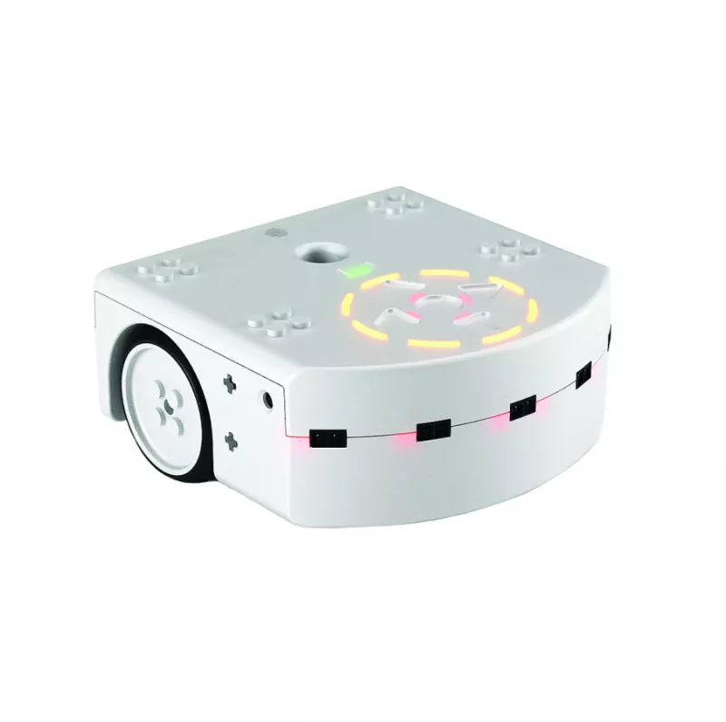]
]
.c35[
Sensors may perform a moving average of the perceived distances
- $B\\subtext{in}$ has a state!
]
]

.cols[
.c60[
<video autoplay muted loop><source src="images/striscia.mp4" type="video/mp4"/></video>
]
.c40[
Softness is modeled as an aggregate of spring-hamper systems
- $B\\subtext{out}$ has a (quite rich) state!
]
]

---

## Where's the intelligence?

.diagram.center[
otext(450,-15,'Agent')
rect(50,0,800,110)
otext(190,35,'Body (sensors) $B\\\\subtext{in}$')
rect(90,50,200,50)
otext(190,75,'$f\\\\suptext{state}\\\\sub{B\\\\subtext{in}},f\\\\suptext{out}\\\\sub{B\\\\subtext{in}},s\\\\sub{B\\\\subtext{in}}^{(0)}$')
otext(450,35,'Brain $C$')
rect(350,50,200,50)
otext(450,75,'$f\\\\suptext{state}\\\\sub{C},f\\\\suptext{out}\\\\sub{C},s\\\\sub{C}^{(0)}$')
otext(710,35,'Body (actuators) $B\\\\subtext{out}$')
rect(610,50,200,50)
otext(710,75,'$f\\\\suptext{state}\\\\sub{B\\\\subtext{out}},f\\\\suptext{out}\\\\sub{B\\\\subtext{out}},s\\\\sub{B\\\\subtext{out}}^{(0)}$')
otext(450,130,'Environment')
rect(350,150,200,50)
otext(450,175,'$f\\\\suptext{state}\\\\sub{E},f\\\\suptext{out}\\\\sub{E},s\\\\sub{E}^{(0)}$')
link([350,175,0,175,0,75,50,75],'a')
link([-10,125,10,125],'t')
link([850,75,900,75,900,175,550,175],'a')
link([50,75,90,75],'a')
otext(320,60,'$o^{(k)}$')
link([290,75,350,75],'a')
otext(580,60,'$a^{(k)}$')
link([550,75,610,75],'a')
link([810,75,850,75],'a')
]

> **in·​tel·​li·​gence** - *in-ˈte-lə-jən(t)s*
> - the ability to learn or understand or to deal with **new or trying** situations
> - the ability to apply knowledge to **manipulate one's environment** or to think abstractly as measured by objective criteria

.center[$\\downarrow$]

.important.center[Is intelligence just in the **brain** $C$? Or is it also in the **body** $B\\subtext{in}, B\\subtext{out}$?]

Common belief: **intelligence is in the brain**!
And/thus we usually opitimize this!

---

## Why relevant?

.important.center[Is intelligence just in the **brain** $C$? Or is it also in the **body** $B\\subtext{in}, B\\subtext{out}$?]

- an alternative path towards artificial (general) intelligence
  - .key[embodied] **AI**, **morphological computation**
  - more balanced efforts (not just on "big" brains)
- better understanding of what's intelligence

.footnote[
Further reading:
- .ref[Paul, Chandana. “Morphological computation: A basis for the analysis of morphology and control requirements.” Robotics and Autonomous Systems 54.8 (2006): 619-630]
- .ref[Füchslin, Rudolf M., et al. “Morphological computation and morphological control: steps toward a formal theory and applications.” Artificial life 19.1 (2013): 9-34]
- .ref[Zahedi, Keyan, and Nihat Ay. “Quantifying morphological computation.” Entropy 15.5 (2013): 1887-1915]
]

---

## How to answer?

.important.center[Is intelligence just in the **brain** $C$? Or is it also in the **body** $B\\subtext{in}, B\\subtext{out}$?]

I don't know. But...1

.footnote[
1. .ref[Medvet, Nadizar, El Saliby, Rusin, Sakallioglu; Investigating the Mechanisms of Embodied Intelligence with Evolvable Modular Soft Robots; 5th Convegno Nazionale CINI sull'Intelligenza Artificiale (Ital-IA); 2025]
]

--

**General hypothesis**: **intelligence** $\\sim$ **complexity** and, for dynamical systems, complexity $\\approx$
- ability to store information (**complexity** of the state $s \\in S$)
-  ability to process it (**complexity** of the functions $f\\suptext{state}, f\\suptext{out}$)

--

Hence, one possible approach is:
1. set/change the relative storing/processing **capacity** of body/brain
2. **measure** the change in intelligence, i.e., "deal with situations" $\\rightarrow$ **perform a task**
      - with **evolution** as "distribution" mechanism (global optimization)
  
For 1, we need an agent where we can also play with **body complexity**!

---

## Voxel-based soft robots (VSRs1)

.cols[
.c60[
In general:
- many **soft cubes** "glued" together (the .key[modules])
  - "infinite" degrees of freedom
  - also as **collective intelligence**!
- each can expand or contract over time, behavior resulting from aggregation
- optimizable body and brain
  - **body** $\\approx$ how many, where placed, what material
  - **brain** $\\approx$ how volumes change over time
- actually fabricable, but .note[currently] poorly controllable

.vspace1[]

.bnote[
Top image from .ref[Hiller, Jonathan, and Hod Lipson. "Automatic design and manufacture of soft robots." IEEE Transactions on Robotics 28.2 (2011): 457-466]

Bottom image from .ref[Legrand, Julie, et al. "Reconfigurable, multi-material, voxel-based soft robots." IEEE Robotics and Automation Letters 8.3 (2023): 1255-1262], then many works

1. aka Virtual Soft Robots, from .ref[Mertan, Alican, and Nick Cheney. "Investigating Premature Convergence in Co-optimization of Morphology and Control in Evolved Virtual Soft Robots." EuroGP 2024]
]
]
.c40[
.w100p.center[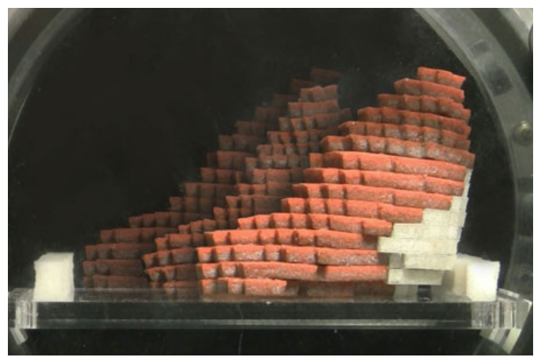]

.w100p.center[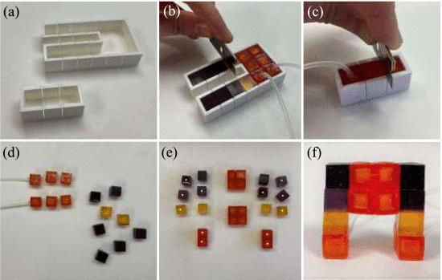]
]
]

---

## Agenda

1. brain complexity
2. body complexity
3. evolving them together .note[spoiler: it's hard!]
4. overcoming body-brain poor evolvability
  - with quality-diversity
  - with (social) learning
  - with plasticity
5. towards collective intelligence

---

## Brain complexity: different brain types1

.cols[
.c60[
Different neural network models, different **brain complexity**:
.compact[
- multi-layer perceptron (MLP)
- recurrent neural network (RNN) .note[layered]
- spiking neural network (SNN) .note[layered]
  - also with **homeostasis** (SNN-H)
]

Brain **complexity**:
- of the state (**storing**), $\\approx$ by state size $|\\vect{s}|$
- of the functions (**processing**), $\\approx$ by number of params $|\\vect{\\theta}|$

Coupled with three bodies (and two control frequencies):
.center.w50p[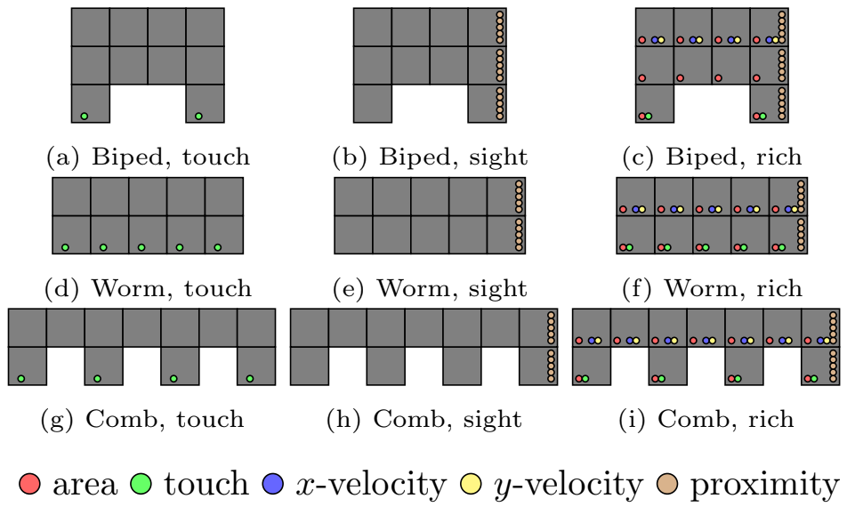]
]
.c40[
.center.w100p[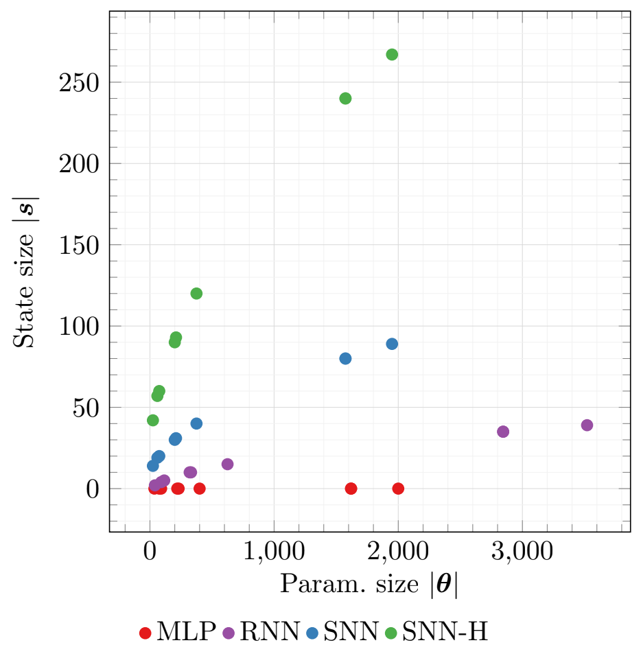]
]
]
 
.footnote[
1. .ref[Nadizar, Medvet, Nichele, Pontes-Filho; An Experimental Comparison of Evolved Neural Network Models for Controlling Simulated Modular Soft Robots; Applied Soft Computing (ASOC); 2023]
]

---

### Results: better with a state!

.center.w90p[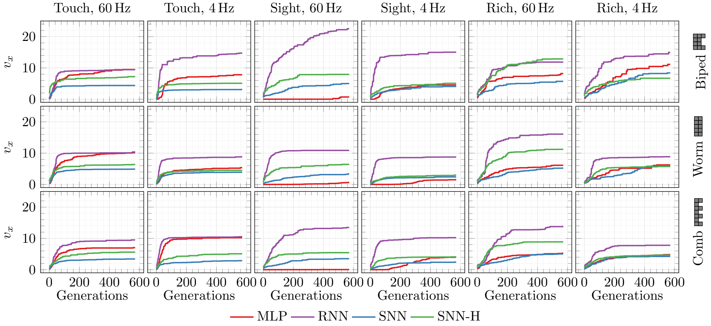]

- **RNNs** are in general more effective and efficient
- unclear impact of perception 🤔, unclear impact of **body complexity** 🤔
- frequency $\\rightarrow$ cap on brain role (low, stronger limit) $\\rightarrow$ **sound!**

---

## Body complexity: criticality

**Research question**1: what makes a body good for different tasks? (locomotion, cave escape, jump)
- here as: what makes a single body "intelligent"?

Idea:
1. "critical systems allow for optimal information processing" $\\rightarrow$ **criticality**
  - the property of being on the boundary between order and chaos (intuitively)
2. *define* criticality for bodies
3. optimize bodies for criticality
4. check if high-criticality bodies are better then low-criticality bodies across different tasks

.footnote[
1. .ref[Talamini, Medvet, Nichele; Criticality-driven Evolution of Adaptable Morphologies of Voxel-Based Soft-Robots; Frontiers in Robotics and AI (FRAI); 2021]
]

--

.vspace1[]

.cols[
.c70[
Measuring body criticality (**task agnostic**!):
1. apply one stimulus to only one voxel
2. count how many voxels it impacts on (**avalanche** size)
3. measure how well the distribution of the avalanche size fits

$\\Rightarrow$ can be used to **drive on optimization** on bodies!
]
.c30[
.center.w90p[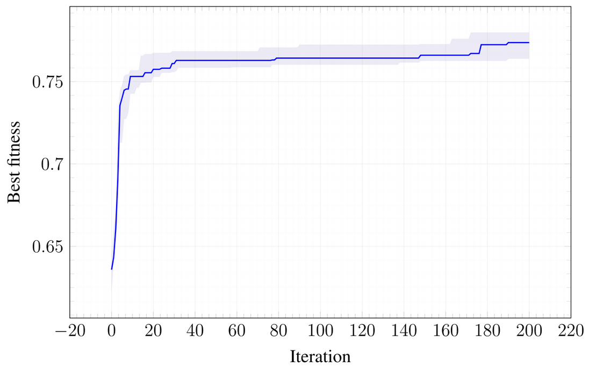]
]
]

---

### Results: bodies optimized for criticality are adaptable!

.cols[
.c30.center[
"Manual" bodies
.w75p[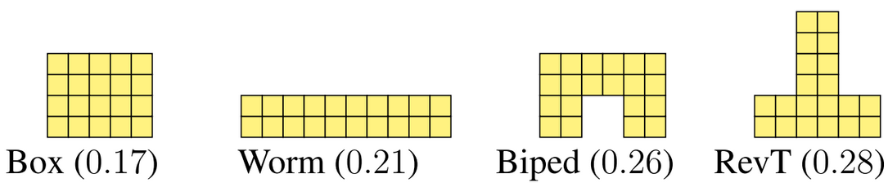]

Random bodies
.w100p[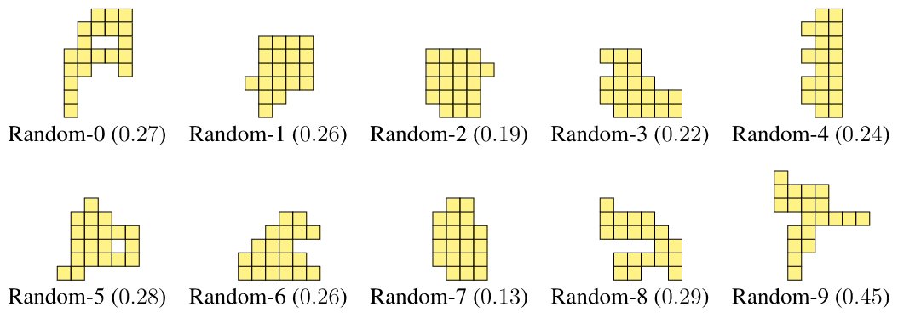]

Grown bodies
.w100p[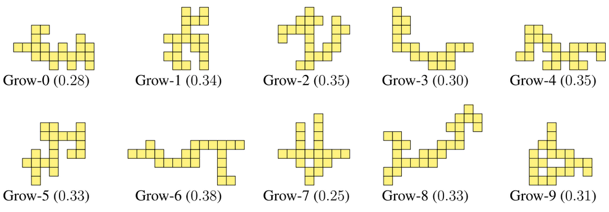]

**Optimized bodies**
.w100p[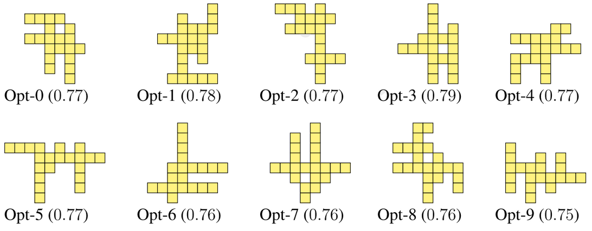]
]
.c70[
Procedure:
1. take a body $b$
2. optimize a brain for $b$ for a task $t$ .note[always same type of brain]
3. compute the **average rank** $\\mu_r$ of $b$+optimized brain in $t$ .note[w.r.t. all bodies with their optimized brains]
  - the lower $\\mu_r$, the better!
  
.center.w50p[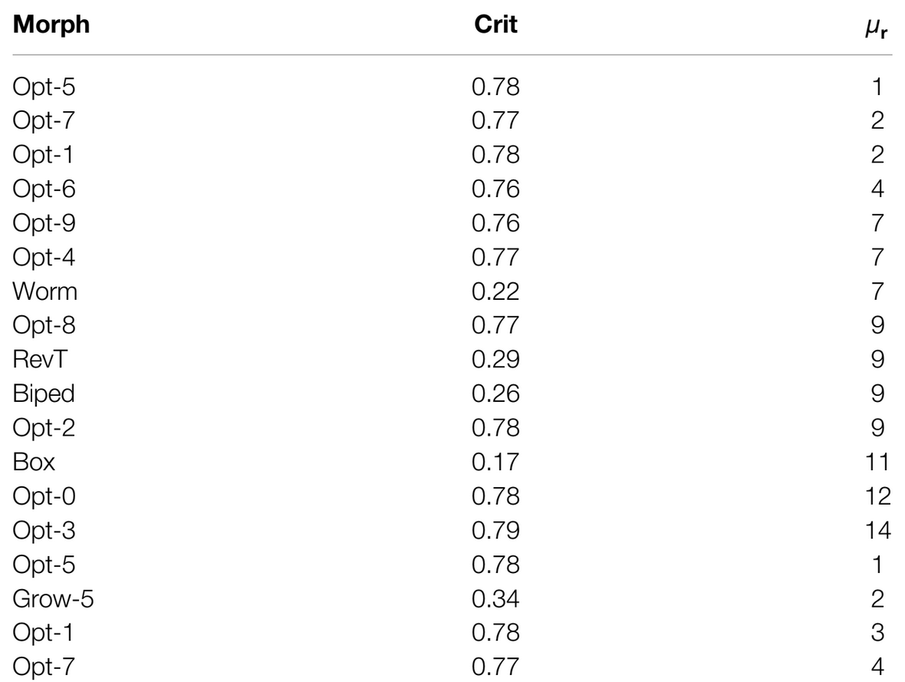]

Here: **the larger the body complexity** ($\\approx$criticality)**, the more intelligent** ($\\approx$adaptable) **the robot!**
]
]

---

## Body-brain interplay: brain _transferability_

**Research question**1: can a brain control control a slightly different body (wrt the one it has been evolved for)?
- why relevant? If "no", then the body likely matters a lot!

.footnote[
1. .ref[Medvet, Rusin; Impact of Morphology Variations on Evolved Neural Controllers for Modular Robots; XVI International Workshop on Artificial Life and Evolutionary Computation (WIVACE); 2022]
]

--

.vspace1[]

.cols[
.c50[
A **body-agnostic brain**:

.center.w90p[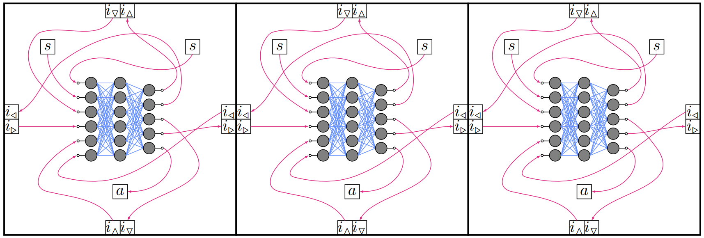]

- same NN (**same weights**!) in every voxel
- NNs exchange numbers as I/O
]
.c50[
Body variations:

.center.w90p[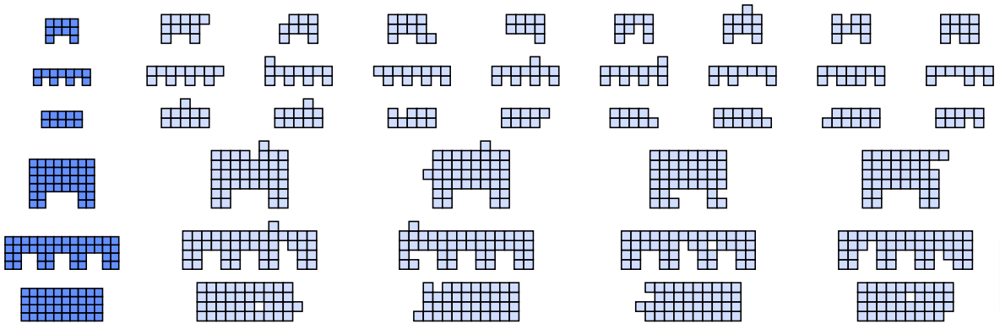]
]
]

---

### Results

**Research question**: can a brain control control a slightly different body (wrt the one it has been evolved for)?
**TL;DR**: no!

.vspace1[]

.cols[
.c50[
.center.w100p[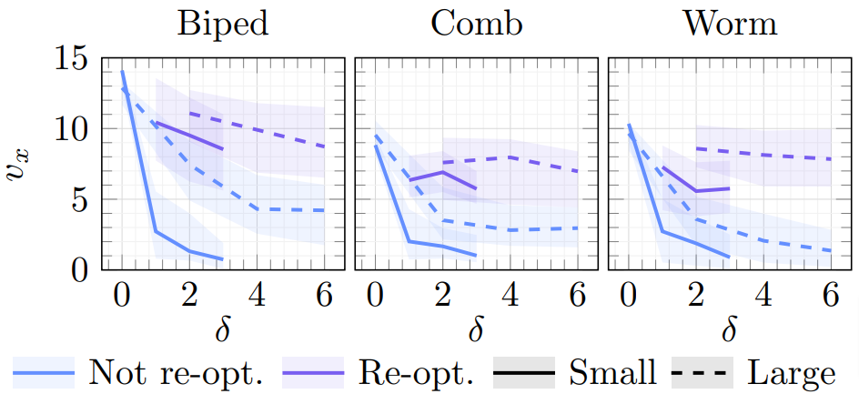]

- Big drop in performance, also with small variations ($\\delta$)
  - **Fragile coupling** of body and brain
- With a (short) re-optimization, the brain "adapts" to the new body
]
.c50[
<video autoplay muted loop>
    <source src="images/video-small.mp4" type="video/mp4"/>
</video>

Biped:
- top: **original** brain+body
- middle: original brain on **modified** body
- bottom: **re-optimized** brain on modified body
]
]

---

## Poor transferability: impact on evolution

**Research question**1: is it hard to look concurrently for a good body _and_ its good brain? If yes, how?

Actually, the answer was already known2: **body-brain evolution is hard!**

.vspace1[]

.footnote[
1. .ref[Mertan, Alican, and Nick Cheney. "Evolutionary Brain-Body Co-Optimization Consistently Fails to Select for Morphological Potential." Artificial Life Conference Proceedings 37. Vol. 2025. MIT Press, 2025]
2. .ref[Cheney, Nicholas, et al. "On the difficulty of co-optimizing morphology and control in evolved virtual creatures." Artificial life conference proceedings. MIT Press, 2016]
]

--

.cols[
.c70[
Systematic characterization of the **body-only** fitness landscape:
- $\\approx 1\\,300\\,000$ different bodies with (up to) $3 \\times 3$ voxels
- body quality estimate with performance of its $\\approx$best brain
  - $\\approx$best $=$ evolved with a reasonable budget
- comparison against full body+brain evolution

Robots:
- body: V-active ■, H-active ■, soft-passive ■, hard-passive ■ voxels
- brain: NN hardly linked to body largest structure
  - not translation robust
]
.c30[
.center.w100p[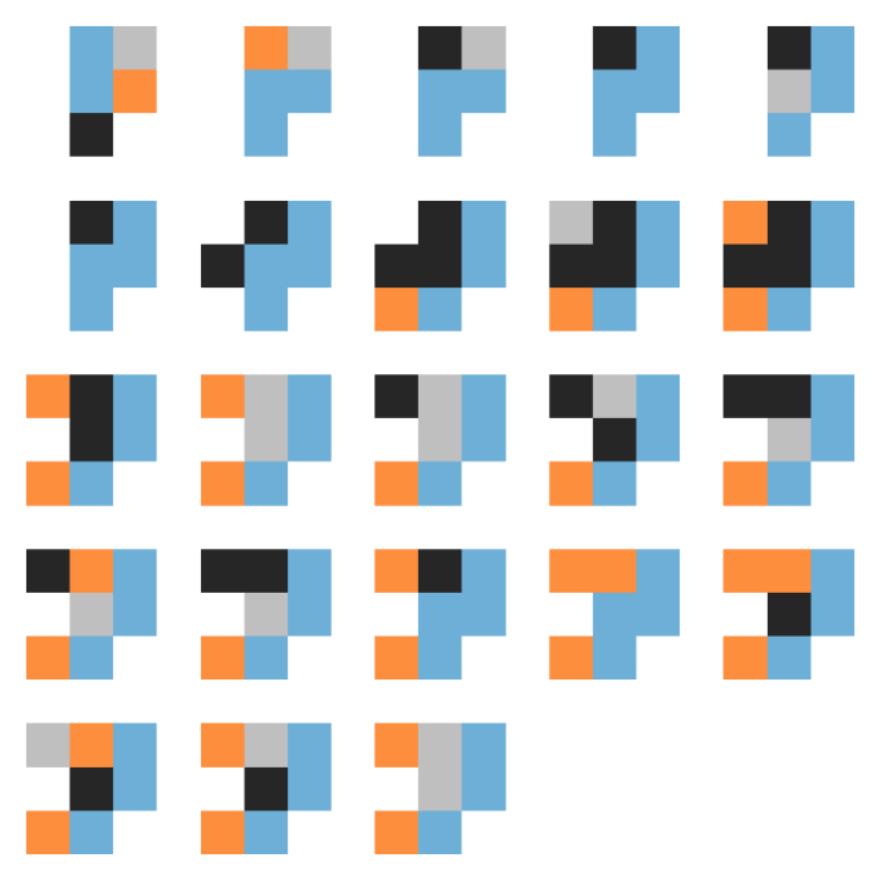]
]
]

---

### Results

**Research question**: is it hard to look concurrently for a good body and a good brain? If yes, how?

.cols[
.c50[
.center.w100p[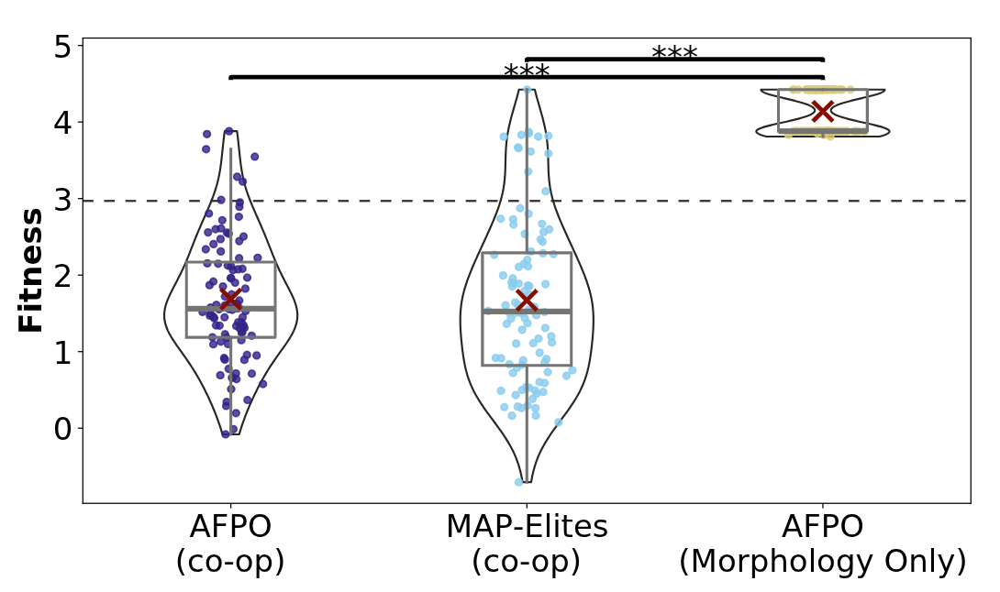]
]
.c50[
.center.w100p[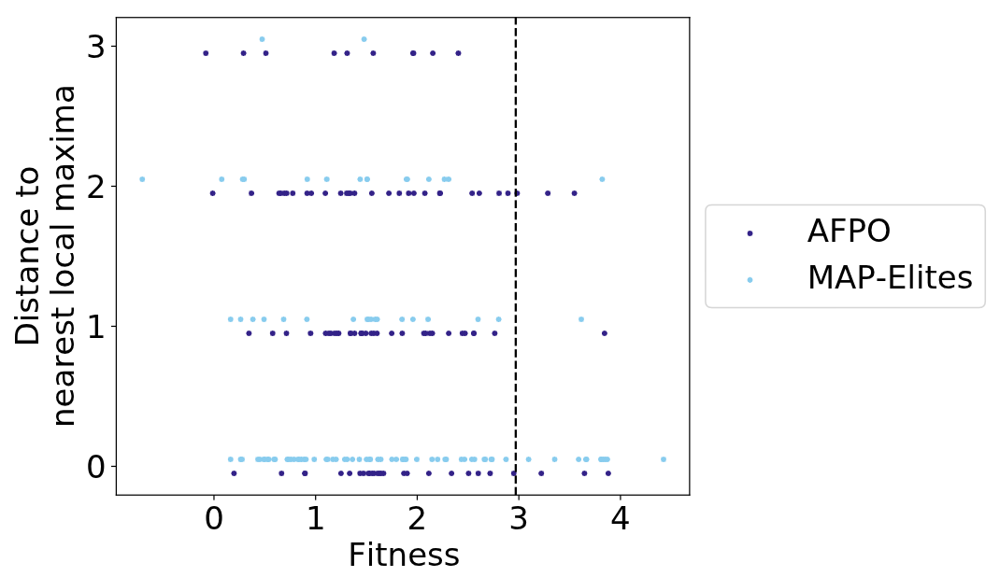]
]
]

> Strikingly, both algorithms fail to discover morphologies that have higher true fitness, despite scenarios where just one voxel alteration is sufficient

- _not surprising_, as that voxel alteration would require a matching brain alteration

.footnote[
AFPO: age-fitness Pareto optimization  
MAP-Elites with numbers of active/passive voxels as descriptors
]

---

## Fostering the search with quality-diversity

**Research question**1: as **diversity** plays a key role in nature, does it work also for body-brain evolution? Can it be enforced at multiple levels?

.cols[
.c60[
.center.w80p[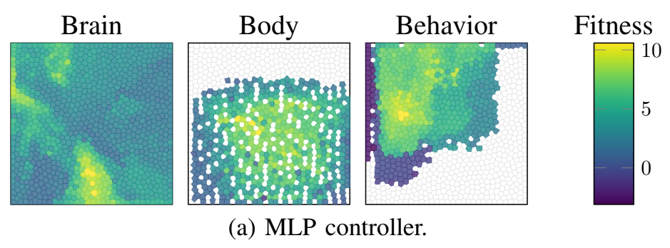]

- one solution $\\rightarrow$ a complete VSR (body+brain)
  - two kind of brains: NNs or graphs .note[interpretable!]
- kept if diverse in at least:
  - body .note[active voxels, elongation]
  - brain .note[NN activation patterns or graph structure]
  - behavior .note[gait]
]
.c40[
.center.w100p[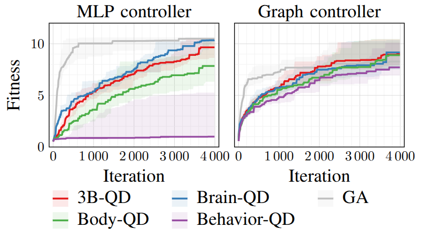]

Diversity comes with a cost! .note[not new]
- slower convergence

... but can favor adaptation to different tasks
]
]

.footnote[
1. .ref[Nadizar, Giorgia, Eric Medvet, and Dennis G. Wilson. "Enhancing adaptability in embodied agents: A multi-quality-diversity approach." IEEE Transactions on Evolutionary Computation (2025)]
]

---

## Social learning: learning from similar robots

Premise:
- split body+brain optimization in body _evolution_ and brain _learning_1,2
- but, instead of _individual_ learning, learn from other robots

**Research question**3: from whom to learn? Is morphological similarity relevant in social learning?
- the single best performing robot?
- a few good robots
- a few _morphologically similar_ robots? $\\rightarrow$ **embodiment**-based

.footnote[
1. .ref[Gupta, Agrim, et al. "Embodied intelligence via learning and evolution." Nature communications 12.1 (2021): 5721]
2. .ref[Pigozzi, Camerota Verdù, Medvet; How the Morphology Encoding Influences the Learning Ability in Body-Brain Co-Optimization; ACM Genetic and Evolutionary Computation Conference (GECCO); 2023]
3. .ref[De Bruin, Glette, Ellefsen, Nadizar, Medvet; Social Learning Strategies for Evolved Virtual Soft Robots; ACM Genetic and Evolutionary Computation Conference (GECCO); 2026]
]

--

.cols[
.c40[
**Robots:**

- body: $5 \\times 5$, V-active ■, H-active ■, soft-passive ■, hard-passive ■ voxels
- brain: a distributed, body-agnostic NN .note[$321$ params]
]
.c40[
**Learning** (for four tasks):
- **Bayesian optimization**
- social learning: some param samples transferred from teacher(s) to learner as starting point
]
]

---

### Results

.cols[
.c60[
**Research question**: from whom to learn? Is morphological similarity relevant in social learning?

.vspace1[]

- Learning from similar robots is .note[almost] as effective as learning from best ones  
  - morphological similarity matters
- Social learning $>$ individual learning $>$ no learning (body+brain evolution)

.center.w80p[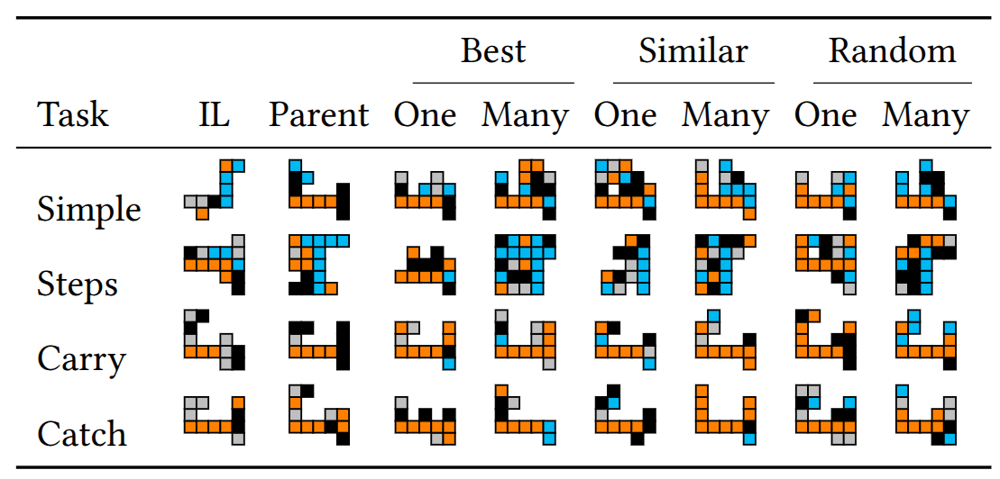]
]
.c40[
.center.w90p[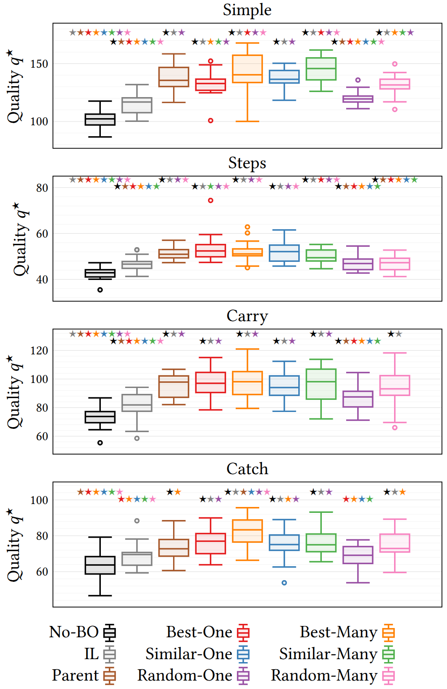]

]
]

---

## Plastic brains

**Research question**1: are plastic brains effective?

.cols[
.c50[
**Brain:**
- one NN per voxel, same params
  - with I/O exchange
- **ABCD Hebbian plasticity**  
$w\_{i,j}^{(k+1)}=w\_{i,j}^{(k)}+\\eta (\\c{1}{a\_{i,j}} x\_{i}^{(k)}x\_{j}^{(k)} + \\c{2}{b\_{i,j}} x\_{i}^{(k)} + \\c{3}{c\_{i,j}} x\_{j}^{(k)} + \\c{4}{d\_{i,j}})$
  - a dynamical system, with a state
  - $4 \times$ the params of a non-plastic MLP .note[but2...]
  - no reward signal needed

> fire together, wire together
]
.c50[
**Body:**
- indirect representation: $(x,y)$ in a $10 \\times 10$ grid $\\to [-1,1]$, voxel _presenceness_
- $\\approx$ CCPNs

.vspace1[]

.center.w100p[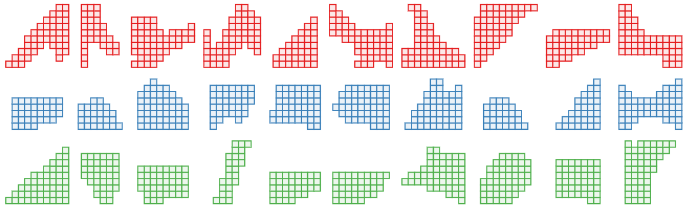]
]
]

.footnote[
1. .ref[Ferigo, Iacca, Medvet, Nadizar; Totipotent Neural Controllers for Modular Soft Robots: Achieving Specialization in Body-Brain Co-Evolution through Hebbian Learning; Neurocomputing; 2024] .note[ISAL Award for Outstanding Student Publication]
2. .ref[Ferigo, Andrea, Elia Cunegatti, and Giovanni Iacca. "Neuron-centric hebbian learning." Proceedings of the Genetic and Evolutionary Computation Conference. 2024]
]

---

### Results: plasticity works!

.center[
 **—** No plasticity
 **—** Fast plasticity
 **—** Slow plasticity
]
.cols[
.c50[
.center[
.note[Evolutionary time, with ES]
.w90p[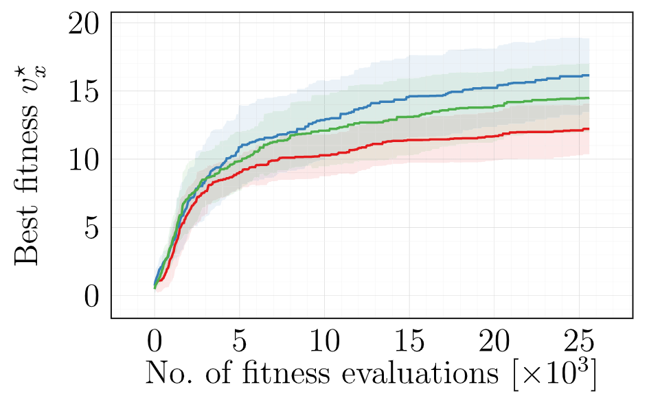]
]

Eventually, **plastic brains $\\rightarrow$ faster robots**!
- .note[maybe] plasticity gives greater opportunity for the brain to adapt to the body
- .note[likely] related with **Baldwin effect**1
]
.c50[
.center[
.note[Life time]
.w90p[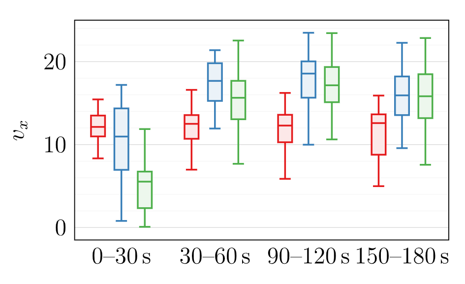]
]

Plasticity $=$ **good adaptation**:
- initially, robots with plastic brain are slower
- then, they become faster
  - sooner with greater learning rate
]
]

.footnote[
1. .ref[Le, Nam, Anthony Brabazon, and Michael O’Neill. "How the “baldwin effect” can guide evolution in dynamic environments." International Conference on Theory and Practice of Natural Computing. Cham: Springer International Publishing, 2018]
]

---

### Results: roles and specialization

.cols[
.col40[
Procedure:
1. take an evolved plastic robot
2. make it _live_ for 60s
3. clone it, and make it live again
  - w/ plast. on
  - w/ plast. off
  - w/ plast. off, shuffling NNs
]
.col60[
.w100p.center[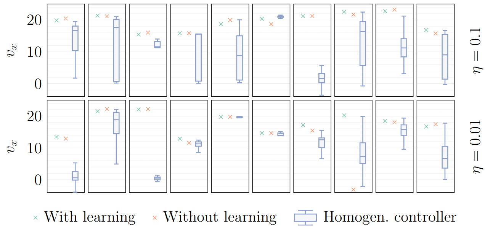]
]
]

- Brains have **really learned**: if you turn off plasticity, they work
- Brains do **specialize**: if you change their position, they don't work
- Starting from all being the same: .key[totipotency]!

---

## Beyond the single body+brain

.cols[
.c70[
Being modular, a VSR can be seen as a "swarm" of robots
- w.r.t. "classical" swarms, **tighter** interactions among robots
]
.c30.center[
.w75p[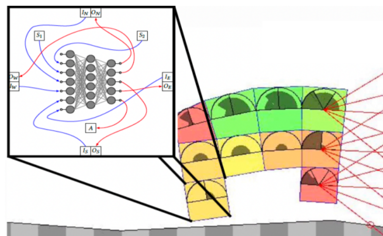]
]
]

.diagram.center[
otext(450,-15,'One agent')
rect(50,0,800,110)
otext(190,35,'Body (sensors) $B\\\\subtext{in}$')
rect(90,50,200,50)
otext(190,75,'$f\\\\suptext{state}\\\\sub{B\\\\subtext{in}},f\\\\suptext{out}\\\\sub{B\\\\subtext{in}},s\\\\sub{B\\\\subtext{in}}^{(0)}$')
otext(450,35,'Brain $C$')
rect(350,50,200,50)
otext(450,75,'$f\\\\suptext{state}\\\\sub{C},f\\\\suptext{out}\\\\sub{C},s\\\\sub{C}^{(0)}$')
otext(710,35,'Body (actuators) $B\\\\subtext{out}$')
rect(610,50,200,50)
otext(710,75,'$f\\\\suptext{state}\\\\sub{B\\\\subtext{out}},f\\\\suptext{out}\\\\sub{B\\\\subtext{out}},s\\\\sub{B\\\\subtext{out}}^{(0)}$')
otext(450,130,'Environment (including the other agents)')
rect(350,150,200,50)
otext(450,175,'$f\\\\suptext{state}\\\\sub{E},f\\\\suptext{out}\\\\sub{E},s\\\\sub{E}^{(0)}$')
link([350,175,0,175,0,75,50,75],'a')
link([-10,125,10,125],'t')
link([850,75,900,75,900,175,550,175],'a')
link([50,75,90,75],'a')
otext(320,60,'$o^{(k)}$')
link([290,75,350,75],'a')
otext(580,60,'$a^{(k)}$')
link([550,75,610,75],'a')
link([810,75,850,75],'a')
]

.cols[
.c50[
**Intelligence _location_** gains a dimension:
- before: body vs. brain
- now: single agent vs. collection of agents .note[in VSRs, agent $=$ voxel]
]
.c50[
Factors:
- voxels **communication**
- voxels **specialization**
- voxels **collaboration**
]
]

---

## Voxels (non) communication1

**Research question**: can voxels of a VSR work well without communicating?
**TL;DR**: yes, through attention!

.cols[
.c50[
.w100p[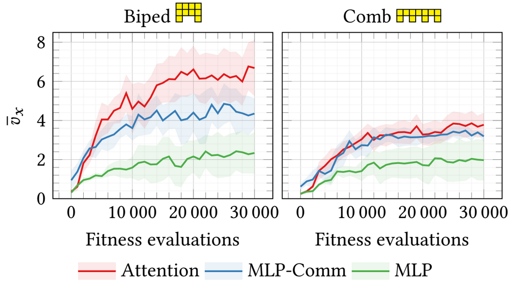]

- **MLP**: no communication
- **MLP-Comm**: some values exchanged
- **Attention**: no comm., but internal attention
]
.c50[
<video autoplay muted loop>
    <source src="images/attention-comb.mp4" type="video/mp4"/>
</video>
Voxels focus differently depending on their **role**!
- same ANN in every voxel (all identical!)
]
]

.footnote[
1. .ref[Pigozzi, Tang, Medvet, Ha; Evolving Modular Soft Robots without Explicit Inter-Module Communication using Local Self-Attention; ACM Genetic and Evolutionary Computation Conference (GECCO); 2022]
]

---

## Intelligence is collective (if needed)1

**Identical** agents: same body, **some brain**!
- not constrained to stay physically attached
- can attach/detach

.cols[
.c50[
.center[Goal: run **all together** (avg $v\_x$)]
.w75p[
<video autoplay muted loop>
    <source src="images/collective-locomotion-avg.mp4" type="video/mp4"/>
</video>
]
]
.c50[
.center[Goal: **one** run (max $v\_x$)]
.w75p[
<video autoplay muted loop>
    <source src="images/collective-locomotion-max.mp4" type="video/mp4"/>
</video>

- **specialization** emerges!
  - without plasticity
  - "between" agent and environment
]
]
]

.footnote[
1. .ref[Rusin, Francesco, and Eric Medvet. "How perception, actuation, and communication impact the emergence of collective intelligence in simulated modular robots." Artificial Life 30.4 (2024): 448-465]
]
---

## Future/open challenges

- Is evolution equally **fair in distributing intelligence** (i.e., exploiting capacity of complexity) on body and brain?
  - likely, no... it depends (also) on representation1
- Can other forms of **adaptation** fix this?
  - development2,3
- **Explainable** body intelligence
- **Hierarchical** embodied intelligence
  
.footnote[
1. .ref[Thomson, Sarah L., et al. "Understanding fitness landscapes in morpho-evolution via local optima networks." arXiv preprint arXiv:2402.07822 (2024)]
2. .ref[Nadizar, Medvet, Miras; On the Schedule for Morphological Development of Evolved Modular Soft Robots; 25th European Conference on Genetic Programming (EuroGP); 2022]
3. .ref[Davis, Q. Tyrell, et al. "Subtract to adapt: Autotomic robots." 2023 IEEE International Conference on Soft Robotics (RoboSoft). IEEE, 2023]
]

---

class: middle, center

## Evolutionary modular robotics

### A tool for investigating embodied intelligence

.cols[
.c30[
This slide deck:
.w75p.center[]

Me:  
[medvet.inginf.units.it](http://medvet.inginf.units.it/)
]
.c70[
**Contributions from ERALLab**:  
Michel El Saliby  
Giorgia Nadizar, Dr.  
Federico Pigozzi, Dr.  
Francesco Rusin  
Berfin Sakalliglu  
Jacopo Talamini, Dr.

.vspace1[]

**Contributions from guest stars**:  
Ege De Bruin + Kyrre Glette + Kai Olaf Ellefsen  
David Ha + Yujin Tang  
Stefano Nichele + Sidney Pontes-Filho  
Giovanni Iacca + Andrea Ferigo  
Dennis G. Wilson

]
]

