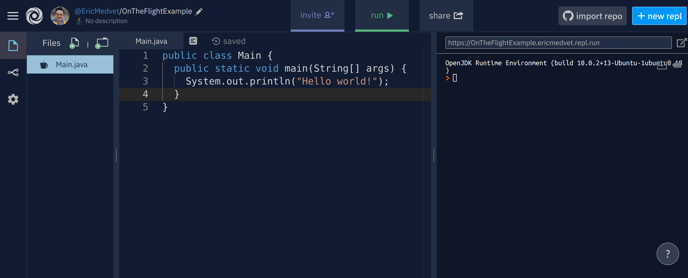

class: middle, center

## Write your first class
### (and some other key concept)

---

## Goal

Write an application that, given a word $w$ and a number $n$, gives $n$ anagrams of $w$.

---

### Natural language and specification

"Write an application that, given a word $w$ and a number $n$, gives $n$ anagrams of $w$."

Natural language is ambiguous: this description leaves a lot of choices (and hence **responsability**) to the designer/developer:
- "an application": for which platform? are there technological constraints? (tech)
- "given": how? command line? file? standard input? (tech)
- "a word $w$": what is a word? (domain)
- "a number $n$": which kind of number? natural or real? (domain)
- "anagrams": what is an anagram? (domain)
- "$n$ anagrams": what if there are no enough anagrams? which ones, if more than $n$? (domain)

**It's up to you to take these decisions!**

---

### More precise goal

In this particular case:
- a Java application, i.e., a class with a `main()`
- $w$ via standard input, $n$ via command line (customer)
- a word is a non-empty sequence of word characters (regex `[A-Za-z]+`)
- $n$ is natural
- anagram:
  - in general "a word or phrase formed by rearranging the letters of a different word or phrase" (from [Wikipedia](https://en.wikipedia.org/wiki/Anagram))
  - here (customer): [permutation of multisets](https://en.wikipedia.org/wiki/Permutation#Permutations_of_multisets) with repetitions
- show up to $n$, whichever you prefer

---

class: center, middle

## Basic building blocks
### for achieving the goal

---

## Execution flow control

Usual constructs available:
- `if` `then` `else`
- `while`
- `for`*
- `switch`*
- `break`
- `continue`
- `return`

I assume you know them!

.note[\*: with enhanced syntax that we will see later]

---

## Basic I/O

Where:
- input from standard input (aka stdin, typically, "the keyboard")
- output to standard output (aka stdout)

Of what:
- `String`
- primitive types

.note[We'll see later how to do I/O of other things to/from other places]

---

## Output to standard output

Use `System.out`, static field `out` of class `java.lang.System`: it's of class `java.io.PrintStream`
.javadoc.methods[
| Type | Field | Description |
| --- | --- | --- |
| void | println() | Terminates the current line by writing the line separator string. |
| void | println​(boolean x) | Prints a boolean and then terminate the line. |
| void | println​(char x) | Prints a character and then terminate the line. |
| void | println​(char[] x) | Prints an array of characters and then terminate the line. |
| void | println​(double x) | Prints a double and then terminate the line. |
| void | println​(float x) | Prints a float and then terminate the line. |
| void | println​(int x) | Prints an integer and then terminate the line. |
| void | println​(long x) | Prints a long and then terminate the line. |
| void | println​(Object x) | Prints an Object and then terminate the line. |
| void | println​(String x) | Prints a String and then terminate the line. |
]

The same for `print()`, that does not terminate the line.

.note[And a very practical `printf()`, that we'll discuss later]

---

## Input from stdin with `BufferedReader`

```java
BufferedReader reader = new BufferedReader(
  new InputStreamReader(System.in)
);
/* ... */
String line = reader.readLine();
```

- `readLine()` reads one line at once
  - Java takes care of using the proper line termination criterion (`\n` or `\r\n`) depending on the host OS .question[how does it know?]
- directly reads only strings
- requires adding `throws Exception` after the `()` in the signature of `main`
  - we ignore why, for now

---

## Input from stdin with `Scanner`

```java
Scanner scanner = new Scanner(System.in);
/* ... */
String s = scanner.next();
int n = scanner.nextInt();
double d = scanner.nextDouble();
```

- `next()`, `nextInt()`, ... do three things:
  1. reads one line from the `InputStream` it's built on
  2. splits the line in tokens (sep = `" "`)
  3. converts and returns the first token of proper type
- if the line "has" >1 tokens, they are consumed in subsequent calls of `next*()`

---

## `String` to primitive type

Here, useful if you use `BufferedReader` for input.

```java
String line = reader.readLine();
int n = Integer.parseInt(line);
```

Class [`Integer`](https://docs.oracle.com/en/java/javase/13/docs/api/java.base/java/lang/Integer.html)
.javadoc.methods[
| Modif. and type | Field | Description |
| --- | --- | --- |
| static int | parseInt​(String s) | Parses the string argument as a signed decimal integer. |
]

Similar for other primitive types:
- `Float.parseFloat(String)`
- `Double.parseDouble(String)`
- ...

---

## Arrays

Array: fixed-length **sequence** of objects of the **same type**
- each object is accessed with the operator `[]` applied to the reference to the array
- 0-based indexing

```java
String[] firstNames;
String[] lastNames = new String[3];
lastNames[1] = new String("Medvet");
```

- Creates a reference `firstNames` to `String[]`; does not create the array; does not create the elements
- Creates a reference `lastNames` to `String[]`; create an array of 3 elements; does not create the elements
- Creates a `String` and makes `lastNames[1]` (2nd in the array) reference it

---

### Diagram

```java
String[] firstNames;
String[] lastNames = new String[3];
lastNames[1] = new String("Medvet");
```

.center.diagram[
<svg width="550" height="300" role="img">
<circle cx="75" cy="40" r="10"/>
<text x="75" y="20">firstNames</text>
<circle cx="75" cy="180" r="10"/>
<text x="75" y="160">lastNames</text>
<rect x="150" y="160" width="150" height="60"/>
<text x="225" y="150">String[]</text>
<circle cx="200" cy="200" r="10"/>
<text x="200" y="180">0</text>
<circle cx="225" cy="200" r="10"/>
<text x="225" y="180">1</text>
<circle cx="250" cy="200" r="10"/>
<text x="250" y="180">2</text>
<rect x="350" y="160" width="150" height="40"/>
<text x="425" y="150">String</text>
<text x="425" y="180">"Medvet"</text>
<polyline points="75,180 150,180"/>
<polyline points="225,200 225,250 325,250 325,180 350,180"/>
</svg>
]

---

### Conventions

Name of arrays (i.e., identfiers of references to arrays):
- plural form of the corresponding reference
  - `Person[] persons`, `Person[] employees`, ...

Definition:
- `Person persons[]` is the same of `Person[] persons`, but the latter **is much better**:
  - it makes evident that the **type** is an array, rather than the identifier

---

## Array creation

```java
String[] dogNames = {"Simba", "Gass"};
//same of new String[]{"Simba", "Gass"}
```
is the same of
```java
String[] dogNames = new String[2];
dogNames[0] = "Simba"; //same of = new String("Simba");
dogNames[1] = "Gass";
```

---

## Array lenght

The type array has a field `length` of type `int` that contains the array size:
- never changes for the a given array
- cannot be written

```java
String[] dogNames = {"Simba", "Gass"};
System.out.println(`dogNames.length`); //prints 2
dogNames = new String[3];
System.out.println(`dogNames.length`); //prints 3
```

`dogNames.length = 5;` does not compile!

---

## Iterating over array elements

"Traditional" `for` syntax:
```java
String[] dogNames = {"Simba", "Gass"};
for (int i = 0; i<dogNames.length; i++) {
  System.out.println("Dog " + i + " name is " + dogNames[i]);
}
```

Enhanced `for` (or for-each) syntax:
```java
String[] dogNames = {"Simba", "Gass"};
for (`String dogName : dogNames`) {
  System.out.println("A dog name is " + dogName);
}
```
- the index is not available inside the loop
- can be applied to other types too (we'll see)

---

## Varargs

In a signature of a method, the **last input parameter**, if of type array, can be specified with the `...` syntax instead of `[]`:
```java
public static double max(double... values) { /* 1 ... */}
```

From the inside, exactly the same of `[]`:
```java
public static double max(double[] values) { /* 2 ... */}
```

From the outside, i.e., where the method is invoked, `...` enables invokation with variable number of parameters (of the same type):
```java
double max = max(4, 3.14, -1.1); //values ≅ double[3]; OK for 1
max = max(); //values ≅ double[0]; OK for 1
max = max(new double[2]{1, 2}); //Ok!; OK for 1 and 2
```

.note[Since Java 5.0. Mathematically speaking, varargs allows to define **variadic functions**.]

---

### About modifiers

```java
public static double max(double... values) {
  double max = values[0];
  for (int i = 1; i<values.length; i++) {
    max = (max > values[i]) ? max : values[i];
  }
  return max;
}
```
.note[`condition ? expr1 : expr2` is the ternary operator.]

- .question[Of which class might be a method?]
- .question[Why `static`?]
- .question[What happens with `max()`?]

---

### Why only last input parameter?

```java
// does NOT compile!
public static int intersectionSize(String... as, String... bs) {
  /* ... */
}

intersectionSize("hello", "world", "cruel", "world");
```
What is `as` and what is `bs`?
- undecidable!

Java designers could have allowed for some exceptional case that, under some conditions, are not misinterpretable:
- `method(ClassA..., ClassC)`
- `method(ClassA..., ClassB...)`

But they opted for **clarity at the expense of expressiveness**.
---

## Command line arguments

Available as content of `main` only arguments:
```java
public class ArgLister {
  public static void main(String[] args) {
    for (String arg : args) {
      System.out.println(arg);
    }
  }
}
```

```bash
eric@cpu:~$ java ArgLister Hello World
Hello
World
```
.note[Possible limitations and syntax variations depending on the host OS]

---

### Diagram

```java
public class ArgLister {
  public static void main(String[] args) {
    for (String arg : args) {
      System.out.println("Arg: " + arg);
    }
  }
}
```

`java` prepares `args` before invoking `main()`

At the beginning of `main()` after `java ArgLister Hello World`
.question[What inside the 1st and 2nd iteration of the `for` loop?]

.center.diagram[
<svg width="650" height="250" role="img">
<circle cx="75" cy="50" r="10"/>
<text x="75" y="30">args</text>
<rect x="150" y="30" width="150" height="60"/>
<text x="225" y="20">String[]</text>
<circle cx="200" cy="70" r="10"/>
<text x="200" y="50">0</text>
<circle cx="225" cy="70" r="10"/>
<text x="225" y="50">1</text>
<rect x="350" y="30" width="120" height="40"/>
<text x="410" y="20">String</text>
<text x="410" y="50">"Hello"</text>
<rect x="520" y="30" width="120" height="40"/>
<text x="580" y="20">String</text>
<text x="580" y="50">"World"</text>
<polyline points="75,50 150,50"/>
<polyline points="200,70 200,120 325,120 325,50 350,50"/>
<polyline points="225,70 225,100 495,100 495,50 520,50"/>
</svg>
]

---

## Operating with `String`s

Creation (`String` constructors):
- empty: `String s = new String();`
- specified: `String s = new String("hi!");`
  - the same of `String s = "hi!";`
- same of another: `String s = new String(otherString);`
- ...

---

## `String` methods

Many!

A few examples from the javadoc of [`String`](https://docs.oracle.com/en/java/javase/13/docs/api/java.base/java/lang/String.html)
.javadoc.methods[
| Modif. and type | Field | Description |
| --- | --- | --- |
| int | compareTo​(String anotherString) | Compares two strings **lexicographically**. |
| int | compareToIgnoreCase​(String str) | Compares two strings lexicographically, ignoring case differences. |
| boolean | endsWith​(String suffix) | Tests if this string ends with the specified **suffix**. |
| int | indexOf​(int ch) | Returns the index within this string of the first occurrence of the specified character. |
| int | indexOf​(int ch, int fromIndex) | Returns the index within this string of the first occurrence of the specified character, starting the search at the specified index. |
| int | indexOf​(String str) | Returns the index within this string of the first occurrence of the specified substring. |
| int | indexOf​(String str, int fromIndex) | Returns the index within this string of the first occurrence of the specified **substring**, starting at the specified index. |
| int | length() | Returns the length of this string. |
| boolean | matches​(String regex) | Tells whether or not this string matches the given regular expression. |
| String | replaceAll​(String regex, String replacement) | Replaces each substring of this string that matches the given **regular expression** with the given replacement. |
]

---

### `String.format()`

.javadoc.methods[
| Modif. and type | Field | Description |
| --- | --- | --- |
| static String | format​(String format, Object... args) | Returns a formatted string using the specified format string and arguments. |
]

See also [`Formatter`](https://docs.oracle.com/en/java/javase/13/docs/api/java.base/java/util/Formatter.html) class and `printf()` in [`PrintStream`](https://docs.oracle.com/en/java/javase/13/docs/api/java.base/java/io/PrintStream.html) class; [here](https://docs.oracle.com/en/java/javase/13/docs/api/java.base/java/util/Formatter.html#syntax) the syntax.

```java
String reference = String.format(
  "FPR=%4.2f\tFNR=%4.2f%n",
  fp / n,
  fn / p
);
//results in FPR=0.11 FNR=0.10
```

We'll se why `Object...`

---

## `String`s are immutable

1st sentence of the 2nd para of [`String`](https://docs.oracle.com/en/java/javase/13/docs/api/java.base/java/lang/String.html) docs: "Strings are **constant**; their values **cannot be changed** after they are created."

Apparently the docs are self-contradictory:
.javadoc.methods[
| Modif. and type | Field | Description |
| --- | --- | --- |
| String | concat​(String str) | Concatenates the specified string to the end of this string. |
| String | toUpperCase() | Converts all of the characters in this `String` to upper case using the rules of the default locale. |
]

Apparently!

---

### `String.concat()`

<iframe width="100%" height="500" src="https://docs.oracle.com/en/java/javase/13/docs/api/java.base/java/lang/String.html#concat(java.lang.String)"></iframe>


---

### Immutable `String`s: diagram

```java
String s1, s2;
s1 = "hamburger";
s2 = s1.substring(3, 7);
System.out.print("s1 = ");
System.out.println(s1);
s1 = s1.replace('a', 'b');
String[] names ={ "John", "Fitzgerald", "Kennedy"}
String firstInit, middleInit, lastInit;
firstInit = names[0].substring(0, 1);
middleInit = names[1].substring(0, 1);
lastInit = names[2].substring(0, 1);
firstInit.concat(middleInit).concat(lastInit);
```

.exercise[
Draw the diagram
- after the line starting with `String[]`
- after the last line
]

---

## Concatenation

Besides `concat()`, `+` operator (alternative syntax):
```java
String s1 = "today is ";
String s2 = s1.concat(" Tuesday").concat("!");
```

2nd line is the same of:
```java
String s2 = s1 + " Tuesday" + "!";
```

`+` is associative on the left:
- `"today is Tuesday"` is obtained before `"today is Tuesday!"`

---

## `String +` other type

If one of the operands of `+` is of type `String` then, at runtime:
- a `String` representation of the operand is obtained
- the concatenation of the two `String`s is done

```java
int age = 41;
String statement = "I'm " + age + " years old";
```
.question[What are the `String` and the non-`String` operands?]

For the case when the non-`String` operand is not a primitive type, we'll see the underlying mechanism in detail.

---

## Primitive types

A few differences with respect to classes:
- they are not created with `new`
- they do not have methods (no constructors) and fields
  - no dot notation

They can be operands of (binary) operators.

```java
int n = 512;
double d = 0d;
char a = 'a';
boolean flag = false;
flag = flag || true;
double k = 3 * d - Math.sqrt(4.11);
```

.question[`sqrt()` modifiers?]

---

## Initialization of primitive types

If not explicitly initialized:
- if field of an object, initialized to default value
  - 0 for numbers, `false` for `boolean`
- if local variable, code does not compile

---

## Initialization of arrays of primitive types
Consistently, for arrays:
- elements of primitive type arrays are initialized to default value

```java
int[] marks;
double[] ages = new double[3];
```

.center.diagram[
<svg width="660" height="300" role="img">
<circle cx="75" cy="40" r="10"/>
<text x="75" y="20">marks</text>
<circle cx="75" cy="120" r="10"/>
<text x="75" y="100">ages</text>
<rect x="150" y="100" width="150" height="60"/>
<text x="225" y="90">double[]</text>
<circle cx="200" cy="140" r="10"/>
<text x="200" y="120">0</text>
<circle cx="225" cy="140" r="10"/>
<text x="225" y="120">1</text>
<circle cx="250" cy="140" r="10"/>
<text x="250" y="120">2</text>
<rect x="350" y="100" width="80" height="40"/>
<text x="390" y="90">double</text>
<text x="390" y="120">0.0</text>
<rect x="450" y="100" width="80" height="40"/>
<text x="490" y="90">double</text>
<text x="490" y="120">0.0</text>
<rect x="550" y="100" width="80" height="40"/>
<text x="590" y="90">double</text>
<text x="590" y="120">0.0</text>
<polyline points="75,120 150,120"/>
<polyline points="200,140 200,180 340,180 340,120 350,120"/>
<polyline points="225,140 225,190 440,190 440,120 450,120"/>
<polyline points="250,140 250,200 540,200 540,120 550,120"/>
</svg>
]

---

## `=` on primitive types

Assign operator `=` copies the content, instead of referencing the same object.

.cols[
.c50[
```java
String s1 = "hello!";
String s2 = s1;
```
.center.diagram[
<svg width="251" height="150" role="img">
<circle cx="10" cy="40" r="10"/>
<text x="10" y="20">s1</text>
<circle cx="10" cy="120" r="10"/>
<text x="10" y="100">s2</text>
<rect x="100" y="20" width="150" height="40"/>
<text x="175" y="10">String</text>
<text x="175" y="40">"hello!"</text>
<polyline points="10,40 100,40"/>
<polyline points="10,120, 100,40"/>
</svg>
]
]
.c50[
```java
double d1 = 3.14;
double d2 = d1;
```

.center.diagram[
<svg width="251" height="150" role="img">
<circle cx="10" cy="40" r="10"/>
<text x="10" y="20">d1</text>
<circle cx="10" cy="120" r="10"/>
<text x="10" y="100">d2</text>
<rect x="100" y="20" width="100" height="40"/>
<text x="150" y="10">double</text>
<text x="150" y="40">3.14</text>
<rect x="100" y="100" width="100" height="40"/>
<text x="150" y="90">double</text>
<text x="150" y="120">3.14</text>
<polyline points="10,40 100,40"/>
<polyline points="10,120, 100,120"/>
</svg>
]
]
]

.note[Things are a bit more complex, we'll see...]

---

class: middle center

## Ready for first exercise!

---

## Onlide IDE [repl.it](repl.it)



- register
- enjoy compilation (`javac`) and execution (`java`)
  - note the run button

---

## Code neatly!

Your code is **your representation** of a problem and its solution.

When someone looks at your code, she/he is entering your mind:
- messy code .arrow[] messy representation .arrow[] messy mind .arrow[] messy you!
- **do you want to look messy?**
  - to your collaborator, your boss, your employee
  - to your teacher

---

## Code review

At least 4 sources of mess (increasingly harder to spot):
- code formatting
- naming
- implementation of algorithm
- algorithm

**Code review** .arrow[] the process of checking the code by looking at the **source code**:
- routinely performed within big tech companies
- there is a "IEEE Standard for Software Reviews and Audits" (IEEE 1028-2008)
- not cheap!

---

class: lab

## Anagrams! .note[~2h, 1st home assignement]

Write an application that, given a word $w$ and a number $n$, gives $n$ anagrams of $w$.
  - multiset of permutations of multiset (i.e., with repetitions)
  - with capitalized anagrams

Hints:
- take inspiration from the Internet
  - but please make at least the effort of finding the proper search query
- if you already master "advanced" Java features, try to ignore them, at least initially

If/when done:
  1. redo it on a full, desktop IDE
  2. profile your code
