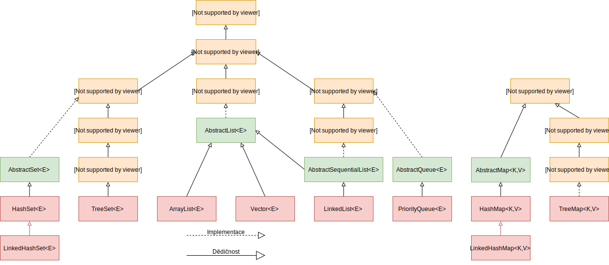

class:middle,center

## Key JDK APIs

### Collections, Executors, Streams<!--, Reflection, Serialization -->

---

class:middle,center

## Collections

---

## Motivation

Model the concept of **collection**: groups of homogeneous items
- and derived concepts (data structures)

Examples:
- a set of $X$
- a list of $Y$
- a queue of $Z$

---

## Java collection framework

In the JDK:

- a set of **interfaces** modeling key concepts
  - with operations
  - with "implicit" properties
- a set of **classes** implementing those interfaces

---

## What's inside?

Interfaces:
- modeled concept is captured by the name

Classes, differ mainly in:
- additional properties
- behavior with respect to multithreading
- performances
  - one class $X$ may have operation $m()$ faster than another class $X'$, both implementing the same interface

---

## Main interfaces

`interface Collection<E>`:
- "A collection represents a group of objects, known as its elements."
  - `E` stays for **element**

`interface Map<K,V>`:
- "An object that maps keys to values. A map cannot contain duplicate keys; each key can map to at most one value."
  - `K` stays for **key**, `V` stays for **element**
  - elsewhere called dictionary

`Collection` and `Map` are disjoint (with respect to inheritance) and `Map` is not precisely a collection.
Yet it is traditionally considered part of the Java collection framework.

---

## `interface Collection<E>`: key methods

.javadoc.methods[
| Mod. and Type | Method | Description |
| --- | --- | --- |
| boolean | add​(E e) | Ensures that this collection contains the specified element (optional operation). |
| boolean | contains​(Object o) | Returns `true` if this collection contains the specified element. |
| boolean | remove​(Object o) | Removes a single instance of the specified element from this collection, if it is present (optional operation). |
| int | size() | Returns the number of elements in this collection. |
]

- They all have the maximum generality that is specific enough to the **concept of collection**
  - you can do them on any collection
  - note the `add()` description: "ensures that [...] contains"

---

### Details

.javadoc.methods[
| Mod. and Type | Method | Description |
| --- | --- | --- |
| boolean | add​(E e) | Ensures that this collection contains the specified element (optional operation). |
| boolean | contains​(Object o) | Returns `true` if this collection contains the specified element. |
| boolean | remove​(Object o) | Removes a single instance of the specified element from this collection, if it is present (optional operation). |
| int | size() | Returns the number of elements in this collection. |
]

- `contains()` and `remove()` take `Object`, rather than `E`: historical reasons, but conceptually sound
  - "does this box of oranges contains an apple?"; obviously no, but the question is legit
- `add()` and `remove()` **mutator** methods, since they (potentially) modify the state, i.e., the group
  - modifying one element state is another thing
  - the `boolean` return value specifies if the collection actually mutated

---

## Bulk operations

.javadoc.methods[
| Mod. and Type | Method | Description |
| --- | --- | --- |
| boolean | addAll​(Collection<? extends E> c) | Adds all of the elements in the specified collection to this collection (optional operation). |
| boolean | containsAll​(Collection<?> c) | Returns `true` if this collection contains all of the elements in the specified collection. |
| boolean | removeAll​(Collection<?> c) | Removes all of this collection's elements that are also contained in the specified collection (optional operation). |
| boolean | retainAll​(Collection<?> c) | Retains only the elements in this collection that are contained in the specified collection (optional operation). |
]

"Derived" methods:
.javadoc.methods[
| Mod. and Type | Method | Description |
| --- | --- | --- |
| void | clear() | Removes all of the elements from this collection (optional operation). |
| boolean | isEmpty() | Returns true if this collection contains no elements. |
]

---

## `toArray()`

.javadoc.methods[
| Mod. and Type | Method | Description |
| --- | --- | --- |
| Object[] | toArray() | Returns an array containing all of the elements in this collection. |
| `default <T> T[]` | `toArray​(IntFunction<T[]> generator)` | Returns an array containing all of the elements in this collection, using the provided generator function to allocate the returned array. |
| `<T> T[]` | toArray​(T[] a) | Returns an array containing all of the elements in this collection; the runtime type of the returned array is that of the specified array. |
]

Why `Collection<T>.toArray()` returns an `Object[]` instead of a `T[]`?  
- Because `T[]` cannot be created.

The other two methods circumvent the limitation:
- `IntFunction<T[]>` is a function from `int` to `T[]`
- `T[]`

both provided by the caller.

---

## Iterating over a collection

4 ways:
- `toArray()` and then `for (int i = 0; ...)`: **ancient**
- `iterator()`: **very old**
- for-each: **current, proper way** (if you don't need the index)
- stream: fancy, we'll see

---

## `toArray()` and `for`

```java
Collection<Person> persons = /* ... */
Person[] personArray = persons.toArray(new Person[persons.size()]);
for (int i = 0; i < personArray.length; i++) {
  Person person = personArray[i];
  // do things
}
```

This way, we are actually iterating over a copy of the collection, rather than the collection itself.
- the collection might change during the iteration

Naming convention: plural form of contained type:
- `Person` $\rightarrow$ `persons` (or qualified: `nicePersons`)
  - `population` would be ok
- `Axis` $\rightarrow$ `axes`

---

## `iterator()`

In `interface Collection<E>`:
.javadoc.methods[
| Mod. and Type | Method | Description |
| --- | --- | --- |
| `Iterator<E>` | iterator() | Returns an iterator over the elements in this collection. |
]

In `interface Iterator<E>`:
.javadoc.methods[
| Mod. and Type | Method | Description |
| --- | --- | --- |
| boolean | hasNext() | Returns `true` if the iteration has more elements. |
| E | next() | Returns the next element in the iteration. |
]

Then:
```java
Collection<Person> persons = /* ... */
Iterator<Person> iterator = persons.iterator();
while (iterator.hasNext())
  Person person = iterator.next();
  // do things
}
```

---

### `interface Iterable<T>`

An interface representing iterable things:
.javadoc.methods[
| Mod. and Type | Method | Description |
| --- | --- | --- |
| `Iterator<T>` | iterator() | Returns an iterator over elements of type `T`. |
]

`interface Collection<E> extends Iterable<E>`

---

## for-each

```java
Collection<Person> persons = /* ... */
for (Person person : persons) {
  // do things
}
```

The for-each syntax applies to any `Iterable`, hence also to `Collection`.  
The compiler translates this to the `iterator()` way of iterating over elements.

---

## Iteration and order

**Never assume** that iterating over a collection will result in some specific **ordering**! Neither with **repeatability**!
- unless it is a property of the actual type of the collection

```java
Collection<String> strings = /* ... */
string.add("hi");
string.add("world");
for (String string : strings) {
  System.out.println(string);
}
```

- Might result in:
  - `hi`, `world`
  - or `world`, `hi`
- Might be different in two executions

---

## `interface Set<E>`

`interface Set<E> extends Collection<E>`

.javadoc[
A collection that contains no duplicate elements. More formally, sets contain no pair of elements `e1` and `e2` such that `e1.equals(e2)`, and at most one `null` element. As implied by its name, this interface models the mathematical `set` abstraction.
]

- Models the (mathematical) concept of **set**
  - **no duplicates**, **no ordering**
- "duplication" captured by `equals()`
- No extra methods with respect to `Collection<E>`

```java
Set<String> names = /* ... */
names.add("Eric");
names.add("Pippi");
names.add("Eric");
System.out.println(names.size()); // -> `2`
```

---

## No duplicates

"A collection that contains no duplicate elements"
- it's stated in the documentation of an interface but:
  - corresponding constraint should be enforced in the **implementation** of `add()` (and similar)
  - the compiler cannot check if an implementation actually correctly enforce the constraint

$\Rightarrow$ one might implement `Set<E>` violating this guarantee!
- JDK implementations are correct

---

## `Set` and `equals()`

```java
public class Person {
  private final String firstName;
  private final String lastName;
  public Person(String firstName, String lastName) {
    this.firstName = firstName;
    this.lastName = lastName;
  }
}
```
In a `Set`:
```java
Set<Person> persons = /* ... */
persons.add(new Person("Eric", "Medvet"));
persons.add(new Person("Eric", "Medvet"));
System.out.println(persons); // -> `2`
```

When coding types that might be used inside a `Set` (or a `Map`), **always override `equals()`**!

---

## Duplicates and state change

> **Great care** must be exercised if mutable objects are used as set elements. The behavior of a set is **not specified** if the value of an object is changed in a manner that affects equals comparisons while the object is an element in the set.


---

## `interface SortedSet<E>`

`interface SortedSet<E> extends Set<E>`

.javadoc[
A `Set` that further provides a *total ordering* on its elements. The elements are ordered using their natural ordering, or by a `Comparator` typically provided at sorted set creation time. The set's iterator will traverse the set in ascending element order. Several additional operations are provided to take advantage of the ordering.
]

- **No duplicates**, **ordering**
  - iterating over elements has a predictable outcome
  - natural ordering of `E` or provided `Comparator<E>`

.javadoc.methods[
| Mod. and Type | Method | Description |
| --- | --- | --- |
| E | first() | Returns the first (lowest) element currently in this set. |
| `SortedSet<E>` | headSet​(E toElement) | Returns a view of the portion of this set whose elements are strictly less than `toElement`. |
| E | last() | Returns the last (highest) element currently in this set. |
| `SortedSet<E>` | subSet​(E fromElement, E toElement) | Returns a view of the portion of this set whose elements range from `fromElement`, inclusive, to `toElement`, exclusive. |
| `SortedSet<E>` | tailSet​(E fromElement) | Returns a view of the portion of this set whose elements are greater than or equal to `fromElement`. |
]


---

## Example

```java
SortedSet<String> names = /* ... */
names.add("Eric");
names.add("Pippi");
names.add("Eric");
names.add("Alice");
for (String name : names) {
    System.out.println(name);
}
```

Gives:
```bash
Alice
Eric
Pippi
```
- because `String`s has natural ordering

---

## `interface List<E>`

`interface List<E> extends Collection<E>`
.javadoc[
An ordered collection (also known as a *sequence*). The user of this interface has precise control over where in the list each element is inserted. The user can access elements by their integer index (position in the list), and search for elements in the list.

Unlike sets, lists typically allow duplicate elements.
]

- Models the (mathematical) concept of **sequence**
  - **duplicates**, "**ordering**"
      - quoted because it's unrelated to natural ordering, but determined by order of additions and removals

Basically, can be used in place of an array `T[]` where the size might change at runtime.

.note[There is also a `java.awt.List` that often wins over this `java.util.List` while doing autocompletion...]

---

## `List<E>`: key methods

.javadoc.methods[
| Mod. and Type | Method | Description |
| --- | --- | --- |
| void | add​(int index, E element) | Inserts the specified element at the specified position in this list (optional operation). |
| boolean | addAll​(int index, Collection<? extends E> c) | Inserts all of the elements in the specified collection into this list at the specified position (optional operation). |
| E | get​(int index) | Returns the element at the specified position in this list. |
| int | indexOf​(Object o) | Returns the index of the first occurrence of the specified element in this list, or `-1` if this list does not contain the element. |
| E | remove​(int index) | Removes the element at the specified position in this list (optional operation). |
| E | set​(int index, E element) | Replaces the element at the specified position in this list with the specified element (optional operation). |
| default void | sort​(Comparator<? super E> c) | Sorts this list according to the order induced by the specified `Comparator`. |
| `List<E>` | subList​(int fromIndex, int toIndex) | Returns a view of the portion of this list between the specified `fromIndex`, inclusive, and `toIndex`, exclusive. |
]

Besides those in `Collection<E>`.
- `intexOf()` uses `equals()`

---

### Usage

```java
List<String> knownJavaThings = /* ... */
knownJavaThings.add("interfaces");
knownJavaThings.add("class");
knownJavaThings.add("generics");
knownJavaThings.add("GUI");
knownJavaThings.add("serialization");
knownJavaThings.set(1, "classes"); // 0-based
knownJavaThings.remove(3);
System.out.println(knownJavaThings.get(3));
```

.question[Outcome?]

---

## `interface Map<K,V>`

.javadoc[
An object that maps keys to values. A map cannot contain duplicate keys; each key can map to at most one value.

The `Map` interface provides three *collection* views, which allow a map's contents to be viewed as a set of keys, collection of values, or set of key-value mappings. The *order* of a map is defined as the order in which the iterators on the map's collection views return their elements. Some map implementations, like the `TreeMap` class, make specific guarantees as to their order; others, like the `HashMap` class, do not.
]

Models a function from `K` to `V` $\cup$ `null`
- not actually a collection
- provides **views** of keys and **values**
- does not extend `Iterable`!
  - cannot be iterated with for-each

---

## `Map<K,V>` key methods

.javadoc.methods[
| Mod. and Type | Method | Description |
| --- | --- | --- |
| V | get​(Object key) | Returns the value to which the specified key is mapped, or `null` if this map contains no mapping for the key. |
| V | put​(K key, V value) | Associates the specified value with the specified key in this map (optional operation). |
| V | remove​(Object key) | Removes the mapping for a key from this map if it is present (optional operation). |
| int | size() | Returns the number of key-value mappings in this map. |
]

Bulk operations:
.javadoc.methods[
| Mod. and Type | Method | Description |
| --- | --- | --- |
| void | clear() | Removes all of the mappings from this map (optional operation). |
| void | putAll​(Map<? extends K,​? extends V> m) | Copies all of the mappings from the specified map to this map (optional operation). |
]

Other (some):
.javadoc.methods[
| Mod. and Type | Method | Description |
| --- | --- | --- |
| boolean | containsKey​(Object key) | Returns `true` if this map contains a mapping for the specified key. |
| boolean | containsValue​(Object value) | Returns `true` if this map maps one or more keys to the specified value. |
]

---

## `Map<K,V>` views

.javadoc.methods[
| Mod. and Type | Method | Description |
| --- | --- | --- |
| `Set<K>` | keySet() | Returns a `Set` view of the keys contained in this map. |
| `Set<Map.Entry<K,​ V>>` | entrySet() | Returns a `Set` view of the mappings contained in this map. |
| `Collection<V>` | values() | Returns a `Collection` view of the values contained in this map. |
]

- view of keys `keySet()` is a `Set<K>`:
  - no duplicates, no ordering
- view of values `values()` is a `Collection<V>`
  - duplicates, no ordering (the least specific collection)

`interface Map.Entry<K,​V>`
.javadoc.methods[
| Mod. and Type | Method | Description |
| --- | --- | --- |
| K | getKey() | Returns the key corresponding to this entry. |
| V | getValue() | Returns the value corresponding to this entry. |
]
- view of entries `entrySet()` is a `Set<Map.Entry<K,​ V>>`
  - no duplicates, no ordering

---

## Iterating over a `Map`

Depending on the specific case:
.compact[
```java
Map<String, Integer> ages = /* ... */
ages.put("Eric", 41); //autoboxing
ages.put("Simba", 13);
```
]

Keys matter:
.compact[
```java
for (String key : ages.keySet()) { /* ... */ }
```
]

Values matter:
.compact[
```java
for (int value : ages.values()) { /* ... */ } //autounboxing
```
]

Both matter:
.compact[
```java
for (Map.Entry<String, Integer> entry : ages.entrySet()) {
  String name = entry.getKey();
  int age = entry.getValye();
  /* ... */
}
```
]

---

## `interface SortedMap<K,V>`

.javadoc[
A `Map` that further provides a *total ordering* on its keys. The map is ordered according to the natural ordering of its keys, or by a `Comparator` typically provided at sorted map creation time. This order is reflected when iterating over the sorted map's collection views (returned by the `entrySet`, `keySet` and `values` methods). Several additional operations are provided to take advantage of the ordering. (This interface is the map analogue of `SortedSet`.)
]

Additional operations (some):
.javadoc.methods[
| Mod. and Type | Method | Description |
| --- | --- | --- |
| K | firstKey() | Returns the first (lowest) key currently in this map. |
| K | lastKey() | Returns the last (highest) key currently in this map. |
| `SortedMap<K,​V>` | headMap​(K toKey) | Returns a view of the portion of this map whose keys are strictly less than `toKey`. |
| `SortedMap<K,​V>` | subMap​(K fromKey, K toKey) | Returns a view of the portion of this map whose keys range from `fromKey`, inclusive, to `toKey`, exclusive. |
| `SortedMap<K,​V>` | tailMap​(K fromKey) | Returns a view of the portion of this map whose keys are greater than or equal to `fromKey`. |
]

`keySet()` still returns a `Set<K>` and not a `SortedSet<K>`
- signature cannot be changed while overridding
- casting, or use `firstKey()`/`lastKey()` methods
- at runtime it is a `SortedSet` (in JDK implementations)!

---

## Other collections (some)

`interface Queue<E> extends Collection<E>`
.javadoc[
A collection designed for holding elements prior to processing. Besides basic `Collection` operations, queues provide additional insertion, extraction, and inspection operations. Each of these methods exists in two forms: one throws an exception if the operation fails, the other returns a special value (either `null` or `false`, depending on the operation).
]

`interface Deque<E> extends Queue<E>`
.javadoc[
A linear collection that supports element insertion and removal at both ends. The name *deque* is short for "double ended queue" and is usually pronounced "deck". Most Deque implementations place no fixed limits on the number of elements they may contain, but this interface supports capacity-restricted deques as well as those with no fixed size limit.
]

`interface BlockingQueue<E> extends Queue<E>`
.javadoc[
A `Queue` that additionally supports operations that wait for the queue to become non-empty when retrieving an element, and wait for space to become available in the queue when storing an element.
]

---

## Implementations (most common)

- `Set` $\rightarrow$ `HashSet`, `LinkedHashSet`, `EnumSet`
- `SortedSet` $\rightarrow$ `TreeSet`
- `List` $\rightarrow$ `ArrayList`, `LinkedList`
- `Map` $\rightarrow$ `HashMap`, `LinkedHashMap`, `EnumMap`
- `SortedMap` $\rightarrow$ `TreeMap`

Recall: implementations differ in
- additional properties
- behavior with respect to multithreading
- performances

---

## Implementations differences

Key information (more on the documentation):
- `LinkedHash*` give predictable iteration order (the "same" of insertion); `Hash*` do not
  - additional properties
  - particularly useful when looking for **reproducibility**!
      - should be coupled with proper seeding of `Random`s; still hard to achieve in multithreading scenarios
- `Enum*` are optimized for `enum`s
  - performances
- `ArrayList` fast in reading, slow in modifying; `LinkedList` slow in reading, fast in modifying
  - performance

---

## Key methods

All implementations properly override `toString()`, `equals()` (and `hashCode()`).

```java
List<String> names = new ArrayList<>();
names.add("Eric");
names.add("Simba");
System.out.println("Names = " + names);
```
Gives:
```bash
Names = [Eric, Simba]
```

---

## `Hash*`, `hashCode()`

`public int hashCode()` in `Object`:
.javadoc[
Returns a hash code value for the object. This method is supported for the benefit of hash tables such as those provided by `HashMap`.

The general contract of `hashCode` is:
- Whenever it is invoked on the same object more than once during an execution of a Java application, the `hashCode` method must consistently return the same integer, provided no information used in `equals` comparisons on the object is modified. This integer need not remain consistent from one execution of an application to another execution of the same application.
- If two objects are equal according to the `equals(Object)` method, then calling the `hashCode` method on each of the two objects must produce the same integer result.
- It is *not* required that if two objects are unequal according to the `equals(java.lang.Object)` method, then calling the `hashCode` method on each of the two objects must produce distinct integer results. However, the programmer should be aware that producing distinct integer results for unequal objects may improve the performance of hash tables.
]

**IDEs** know this general contract and can the code for overridding `hashCode()` for us!
- usually together and consistently with `equals()`

---

## Constructors

All implementations have the default constructor:
```java
List<String> names = new ArrayList<>();
SortedMap<Person, Double> marks = new TreeMap<>();
```

All have a constructor that creates a collection with the elements of another collection:
```java
List<String> names = new ArrayList<>();
/* ... */
Set<String> uniqueNames = new HashSet<>(names);
```
- it's **not a view** (neither a copy) of the other collection
- each element **is** the same

---

## Type of reference!

**Use always the most general type**!

Ok!
```java
List<String> names = new ArrayList<>();
```

Not ok!
```java
ArrayList<String> names = new ArrayList<>();
```
- unless you really need `names` to be of type `ArrayList<>`, that is rare

Recall the deep meaning of "interface" and (one of) its goal(s):
- abstraction: what is `names`?
- reduced complexity: what are the properties of `names` that really matter?

---

## Constructor-like `default` methods

Interfaces provide `default` constructor-like methods for doing contruct-and-fill!
Resulting collections are **unmodifiable**!

`Set`:
.javadoc.methods[
| Mod. and Type | Method | Description |
| --- | --- | --- |
| `static <E> Set<E>` | of() | Returns an unmodifiable set containing zero elements. |
| `static <E> Set<E>` | of​(E... elements) | Returns an unmodifiable set containing an arbitrary number of elements. |
]

`List`:
.javadoc.methods[
| Mod. and Type | Method | Description |
| --- | --- | --- |
| `static <E> List<E>` | of() | Returns an unmodifiable list containing zero elements. |
| `static <E> List<E>` | of​(E... elements) | Returns an unmodifiable list containing an arbitrary number of elements. |
]

Unmodifiable!
.compact[
```java
List<String> names = List.of("Eric", "Simba");
names.add("Pippi"); // -> java.lang.`UnsupportedOperationException`
```
]

---

## Multithreading

- **Most** implementations are not thread-safe! (all the ones mentioned above)
  - they usually throw a `ConcurrentModificationException`
- Some are thread-safe: e.g.,
  - `class ConcurrentHashMap<K,​V> implements Map<K,V>` (actually `implements ConcurrentMap<K,V>`)
  - `class ConcurrentSkipListSet<E> implements SortedSet<E>`
  - ...

---

## Thread-safe views

`Collections` class (with the leading `s`!!!) provides utility static methods for obtaining **thread-safe views** of existing collections:
- basically wrapping key methods in `synchronized` blocks
- `static * synchronized*()`: e.g.,
  - `static <T> SortedSet<T> synchronizedSortedSet​(SortedSet<T> s)`
  - `static <T> List<T> synchronizedList​(List<T> list)`
- thread-safety is guaranteed only when using the view!
- thread-safety is guaranteed on the view, not on each element!

---

## `Collections`

<iframe width="100%" height="450" src="https://docs.oracle.com/en/java/javase/13/docs/api/java.base/java/util/Collections.html"></iframe>

---

## Big picture



.note[From: [ICT.social](https://www.ict.social/java/collections-and-streams-in-java/java-collections-framework)]
---

## Example

Given a sentence, return the word occurrences.

Design phase:
- understand and properly state domain concepts:
  - sentence
  - word
  - word occurrences
- find or code corresponding types
  - sentence $\rightarrow$ `String`
  - word $\rightarrow$ `String`
  - word occurrences $\rightarrow$ `Map<String, Integer>`

---

### Solution

.compact[
```java
public static Map<String, Integer> wordOccurrences(String sentence) {
  String[] words = sentence.split("\\W+");
  Map<String, Integer> occurrences = new HashMap<>();
  for (String word : words) {
    occurrences.put(
        word,
        occurrences.getOrDefault(word, 0) + 1
    );
  }
  return occurrences;
}
```
```java
System.out.println(wordOccurrences("today the cat is on the table."));
```
```bash
{the=2, today=1, cat=1, is=1, table=1, on=1}
```
]

- `\W` is any non-word character
- `default V getOrDefault​(Object, V)` returns the second argument if the key (1st argument) is not present

---

### Sorted alphabetically

.compact[
```java
SortedMap<String, Integer> sortedOccurrences = new TreeMap<>(
    wordOccurrences("today the cat is on the table.")
);
System.out.println(sortedOccurrences);
```
```bash
{cat=1, is=1, on=1, table=1, the=2, today=1}
```
]

- further modification to the `Map` would not be reflected in the `SortedMap`

---

### Sorted by increasing occurrences

.compact[
```java
List<Map.Entry<String, Integer>> entries = new ArrayList<>(
  wordOccurrences("today the cat is on the table.").entrySet()
);
entries.sort(Comparator.comparing(Map.Entry::getValue));
System.out.println(entries);
```
```bash
[today=1, cat=1, is=1, table=1, on=1, the=2]
```
]

- `sort()` line is equivalent to `entries.sort((e1, e2) -> e1.getValue().compareTo(e2.getValue()))`
- note the `[]` instead of `{}`: come from `ArrayList.toString()` instead of `HashMap.toString()`

---

## Other collections

Word occurrences: actually, this is a **multiset** of words
- each element $w \in W$ may appear 0 or more times
- mathematically, often formalized as $f: W \to \mathbb{N}$
  - consistently, we modeled as `Map<String, Integer>`

Is there a **multiset** in the JDK?
- no, but there are other external libraries with this and other models
- Google Guava (with [collections](https://github.com/google/guava/wiki/CollectionUtilitiesExplained))
  - [`Multiset<E>`](https://guava.dev/releases/snapshot/api/docs/com/google/common/collect/Multiset.html)
- Apache Commons (with [collections](https://commons.apache.org/proper/commons-collections/userguide.html))
  - [`Bag<E>`](https://commons.apache.org/proper/commons-collections/javadocs/api-4.4/org/apache/commons/collections4/Bag.html)

---

class:middle,center

### Executors

---

## Motivation

Simplify the design and development of code that executes **tasks** in **asynchronous mode**:

Key concepts:
- task: a unit of processing with an input and an output
- executor: a component that executes tasks

The task is not asynchronous/synchronous: that's a property of the execution.

---

## `interface Callable<V>`

.javadoc[
A task that returns a result and may throw an exception. Implementors define a single method with no arguments called `call`.
]


.javadoc.methods[
| Mod. and Type | Method | Description |
| --- | --- | --- |
| V | call() | Computes a result, or throws an exception if unable to do so. |
]

Model a **task with a result**:
- `V` is the type of result (the task output)
  - the input is implicit in the class instantiating `Callable`
- `call() throws Exception`
- it is a `@FunctionalInterface`

---

## Usage
.compact[
```java
final long x = 100000;
Callable<Long> sumOfFactorialsTask = () -> {
  long sum = 0;
  for (int i = 0; i < x; i++) {
    sum = sum + factorial(i);
  }
  return sum;
};
try {
  long result = sumOfFactorialsTask.call();
  System.out.println("sum=" + result);
} catch (Exception e) {
  System.err.println(String.format("Cannot compute due to %s", e));
}
```
```java
public static long factorial(long n) {
  return (n <= 1) ? n : (n * factorial(n - 1));
}
```
]

- **Synchronous execution**!
  - the caller waits until the computation is done

.note[Numbers here are too large...]

---

## `interface Runnable`

.javadoc[
The `Runnable` interface should be implemented by any class whose instances are intended to be executed by a thread. The class must define a method of no arguments called `run`.
]

.javadoc.methods[
| Mod. and Type | Method | Description |
| --- | --- | --- |
| void | run() | When an object implementing interface `Runnable` is used to create a thread, starting the thread causes the object's `run` method to be called in that separately executing thread. |
]

Model a **task without a result**:
- `run()` does not throw any (checked) exception
- it is a `@FunctionalInterface`
- much older than `Callable` in the JDK
- `Thread implements Runnable`

---

### Usage

Intended usage:
```java
final long x = 100000;
new Thread(() -> {
  long sum = 0;
  for (int i = 0; i < x; i++) {
    sum = sum + factorial(i);
  }
}).start();
```

- `Thread​(Runnable target)` is one of `Thread` constructors
- **Asynchronous execution**!
  - the caller immediately return after `start()`
- No easy way of getting the result!
  - may be taken with active polling, synchronization, ...

---

## `Callable<V>` vs. `Runnable`

In `Callable<V>`:
.javadoc[
The `Callable` interface is similar to `Runnable`, in that both are designed for classes whose instances are potentially executed by another thread. A `Runnable`, however, does not return a result and cannot throw a checked exception.

The `Executors` class contains utility methods to convert from other common forms to `Callable` classes.
]

- `Executors` class, with the trailing `s`

---


## `interface ExecutorService`

.javadoc[
An `Executor` that provides methods to manage termination and methods that can produce a `Future` for tracking progress of one or more asynchronous tasks.

An `ExecutorService` can be shut down, which will cause it to reject new tasks. Two different methods are provided for shutting down an `ExecutorService`. The `shutdown()` method will allow previously submitted tasks to execute before terminating, while the `shutdownNow()` method prevents waiting tasks from starting and attempts to stop currently executing tasks. Upon termination, an executor has no tasks actively executing, no tasks awaiting execution, and no new tasks can be submitted. An unused `ExecutorService` should be shut down to allow reclamation of its resources.

Method `submit` extends base method `Executor.execute(Runnable)` by creating and returning a `Future` that can be used to cancel execution and/or wait for completion.
]

Models an **executor** with some additional properties:
- implementations realize actual asynchronous executions

Key methods:
.javadoc.methods[
| Mod. and Type | Method | Description |
| --- | --- | --- |
| `Future<?>` | submit​(Runnable task) | Submits a Runnable task for execution and returns a Future representing that task. |
| `<T> Future<T>` | `submit​(Callable<T> task)` | Submits a value-returning task for execution and returns a Future representing the pending results of the task. |
]

---

## `interface Future<V>`

.javadoc[
A `Future` represents the result of an asynchronous computation. Methods are provided to check if the computation is complete, to wait for its completion, and to retrieve the result of the computation. The result can only be retrieved using method `get` when the computation has completed, blocking if necessary until it is ready.
]

Key method:
.javadoc.methods[
| Mod. and Type | Method | Description |
| --- | --- | --- |
| V | get() | Waits if necessary for the computation to complete, and then retrieves its result. |
]

Models a **future result**:
- the future result exists instantaneously
- the actual result will exist in the future
- `get()` blocks until the actual result is ready

---

## Usage: `Executor`+`Callable`+`Future`

.compact[
```java
ExecutorService executorService = /* ... */
long n = 20;
Future<Long> future = executorService.submit(() -> factorial(n));
System.out.println("Computing");
try {
  long result = future.get();
  System.out.printf("%d!=%d%n", n, result);
} catch (InterruptedException | ExecutionException e) {
  System.err.println(String.format("Cannot compute due to %s", e));
}
executorService.shutdown();
```
]

- `factorial(n)` is done in asynchronously!
  - `submit()` returns immediately
- caller blocks on `long result = future.get();`

---

## Parallel execution of tasks

.compact[
```java
ExecutorService executorService = /* ... */
List<Callable<Long>> callables = new ArrayList<>();
for (int i = 0; i < 20; i++) {
  final long n = i;
  callables.add(() -> factorial(n));
}
try {
  List<Future<Long>> futures = executorService.invokeAll(callables);
  for (Future<Long> future : futures) {
    System.out.printf("Got %d%n", future.get());
  }
} catch (InterruptedException | ExecutionException e) {
  System.err.println(String.format("Cannot compute due to %s", e));
}
```
]

- All tasks are submitted together
- Results are collected sequentially, but could made be ready in different order
- Exceptions should be handled with greater care
  - `invokeAll()` throws `InterruptedException`
  - `get()` throws `ExecutionException`

---

## Creating an `ExecutorService`

Many different implementations for different needs exist.
They can be created with `static` methods of `Executors`:

.javadoc.methods[
| Mod. and Type | Method | Description |
| --- | --- | --- |
| static ExecutorService | newCachedThreadPool() | Creates a thread pool that creates new threads as needed, but will reuse previously constructed threads when they are available. |
| static ExecutorService | newFixedThreadPool​(int nThreads) | Creates a thread pool that reuses a fixed number of threads operating off a shared unbounded queue. |
| static ScheduledExecutorService | newScheduledThreadPool​(int corePoolSize) | Creates a thread pool that can schedule commands to run after a given delay, or to execute periodically. |
]

- `newFixedThreadPool​()`: at most $n$ threads run do computation at the same time $\Rightarrow$ at most $n$ tasks are executed **on this executor**
- `interface ScheduledExecutorService`: augments `ExecutorService` with methods for scheduled execution
  - `schedule​(Callable<V> callable, long delay, TimeUnit unit)`
  - `scheduleAtFixedRate​(Runnable command, long initialDelay, long period, TimeUnit unit)`

---

## Example

Protocol (upon connection):
- client sends one text line $l$
- if $l=l_\text{quit}$, server closes connection, otherwise replies with processed line $l'=p(l)$

Server:
- listens on port $n_\text{port}$
- handles many client at a time, **serves up to $n$ clients at the same time**
- never terminates
- $p:$ `String` $\to$ `String`, $l_\text{quit}$, port number, $n$ are parameters

---

## Solution

.compact[
```java
public class ExecutorLineProcessingServer {

  private final int port;
  private final String quitCommand;
  private final Function<String, String> commandProcessingFunction;
  private final ExecutorService executorService;

  public ExecutorLineProcessingServer(int port, String quitCommand, Function<String, String> commandProcessingFunction, int concurrentClients) {
    this.port = port;
    this.quitCommand = quitCommand;
    this.commandProcessingFunction = commandProcessingFunction;
*   executorService = Executors.newFixedThreadPool(concurrentClients);
  }

  public void start() throws IOException {
    /* ... */
  }

}
```
]

---

### All in one method

.compact[
```java
public void start() throws IOException {
  try (ServerSocket serverSocket = new ServerSocket(port)) {
    while (true) {
      try {
        final Socket socket = serverSocket.accept();
*       executorService.submit(() -> {
          try (socket) {
            BufferedReader br = new BufferedReader(new InputStreamReader(socket.getInputStream()));
            BufferedWriter bw = new BufferedWriter(new OutputStreamWriter(socket.getOutputStream()));
            while (true) {
              String command = br.readLine();
              if (command == null) {
                System.err.println("Client abruptly closed connection");
                break;
              }
              if (command.equals(quitCommand)) {
                break;
              }
              bw.write(commandProcessingFunction.apply(command) + System.lineSeparator());
              bw.flush();
            }
          } catch (IOException e) {
            System.err.printf("IO error: %s", e);
          }
*       });
      } catch (IOException e) {
        System.err.printf("Cannot accept connection due to %s", e);
      }
    }
  } finally {
*   executorService.shutdown();
  }
}
```
]
---

class:middle,center

### Streams

#### (very briefly)

---

## Motivation

Support **functional-style** operations on **streams** of elements.
- corresponding code is much more concise and, hopefully, clearer

Stream: "a continuous flow or succession of anything"
- not the group of elements, but the flow itself
- not a collection

Example:
- for each `String`: transform to uppercase, compute letter frequencies, sort by most uneven distribution
- map-reduce

---

## `interface Stream<T>`

(Since Java 8)

.javadoc[
A sequence of elements supporting sequential **and parallel** aggregate operations.
]

From package [`java.util.stream`](https://docs.oracle.com/en/java/javase/13/docs/api/java.base/java/util/stream/package-summary.html) docs:
.javadoc[
The key abstraction introduced in this package is *stream*. The classes `Stream`, `IntStream`, `LongStream`, and `DoubleStream` are streams over objects and the primitive `int`, `long` and `double` types. **Streams differ from collections in several ways**:

- No storage. A stream is not a data structure that stores elements; instead, it conveys elements from a source such as a data structure, an array, a generator function, or an I/O channel, through a pipeline of computational operations.
- Functional in nature. An operation on a stream produces a result, but does not modify its source. For example, filtering a `Stream` obtained from a collection produces a new `Stream` without the filtered elements, rather than removing elements from the source collection.
- Laziness-seeking. Many stream operations, such as filtering, mapping, or duplicate removal, can be implemented lazily, exposing opportunities for optimization. For example, "find the first `String` with three consecutive vowels" need not examine all the input strings. Stream operations are divided into intermediate (`Stream`-producing) operations and terminal (value- or side-effect-producing) operations. Intermediate operations are always lazy.
- Possibly unbounded. While collections have a finite size, streams need not. Short-circuiting operations such as `limit(n)` or `findFirst()` can allow computations on infinite streams to complete in finite time.
- Consumable. The elements of a stream are only visited once during the life of a stream. Like an `Iterator`, a new stream must be generated to revisit the same elements of the source.
]

---

## Stream operations

Three phases:
1. get from a source source (collection, array, ...)
2. apply a pipeline of **intermediate operations**
  - transform a stream into another stream
3. apply one **terminal operation**
  - stream to sink ("collection" or single value)

---

## Obtaining a `Stream<T>`

From a source:
- a `Collection<T>`:
  - `Stream<T> stream()`
  - `Stream<T> parallelStream()`
- an array:
  - `Stream<T> Arrays.stream(T[])`
- many other types:
  - `Stream<String> lines()` in `BufferedReader`
  - `Stream<String> splitAsStream​(CharSequence input)` in `Pattern`
  - ...

---

## Some intermediate operations

.javadoc.methods[
| Mod. and Type | Method | Description |
| --- | --- | --- |
| `Stream<T>` | distinct() | Returns a stream consisting of the distinct elements (according to `Object.equals(Object))` of this stream. |
| `Stream<T>` | `filter​(Predicate<? super T> predicate)` | Returns a stream consisting of the elements of this stream that match the given predicate. |
| `<R> Stream<R>` | `map​(Function<? super T,​? extends R> mapper)` | Returns a stream consisting of the results of applying the given function to the elements of this stream. |
| DoubleStream | `mapToDouble​(ToDoubleFunction<? super T> mapper)` | Returns a `DoubleStream` consisting of the results of applying the given function to the elements of this stream. |
| IntStream | `mapToInt​(ToIntFunction<? super T> mapper)` | Returns an `IntStream` consisting of the results of applying the given function to the elements of this stream. |
| LongStream | `mapToLong​(ToLongFunction<? super T> mapper)` | Returns a `LongStream` consisting of the results of applying the given function to the elements of this stream. |
| `Stream<T>` | `sorted​(Comparator<? super T> comparator)` |
Returns a stream consisting of the elements of this stream, sorted according to the provided `Comparator`.
]

- `interface Predicate<T>` is a `@FunctionalInterface` with a method `boolean test​(T)`
- `interface ToDoubleFunction<T>` is a `@FunctionalInterface` with a method `double applyAsDouble​(T)` (same for `int`, `long`)

.note[`Function<? super T,​? extends R>` can be applied to something more general than `T` (which includes `T`) and returns something more specific than `R` (which is certainly an `R`).]

---

## Some terminal operations

.javadoc.methods[
| Mod. and Type | Method | Description |
| --- | --- | --- |
| `<R,​A> R` | `collect​(Collector<? super T,​A,​R> collector)` | Performs a mutable reduction operation on the elements of this stream using a `Collector`. |
| T | `reduce​(T identity, BinaryOperator<T> accumulator)` | Performs a reduction on the elements of this stream, using the provided identity value and an associative accumulation function, and returns the reduced value. |
| Object[] | toArray() | Returns an array containing the elements of this stream. |
| `<A> A[]` | `toArray​(IntFunction<A[]> generator)` | Returns an array containing the elements of this stream, using the provided generator function to allocate the returned array, as well as any additional arrays that might be required for a partitioned execution or for resizing. |
| long | count() | Returns the count of elements in this stream. |
]

And others such as `average()`, `max()`, `min()`, ... in numeric streams.

- `interface BinaryOperator<T> extends BiFunction<T,​T,​T>` is a `@FunctionalInterface` with no further methods
- `interface BiFunction<T,​U,​R>` is a `@FunctionalInterface` with a method `R apply​(T, U)`


---

### Examples

Given a collection of person names (first+last), get the initials corresponding to names with more than 2 words in the names.

.compact[
```java
Collection<String> names = List.of(
    "Andrea De Lorenzo",
    "Eric Medvet",
    "Alberto Bartoli",
    "Felice Andrea Pellegrino"
);
names = names.stream()
    .map(s -> s.split(" "))
    .filter(ts -> ts.length>2)
    .map(ts -> Arrays.stream(ts)
        .map(s -> s.substring(0, 1))
        .collect(Collectors.joining()))
    .collect(Collectors.toList());
System.out.println(names);
```
]
Gives:
```bash
[ADL, FAP]
```

---

### Another example

Given a collection of strings, compute the average number of consonants.

.compact[
```java
System.out.println(strings.stream()
    .map(s -> s.toLowerCase().replaceAll("[aeiou]", ""))
    .mapToInt(String::length)
    .average()
    .orElse(0d)
);
```
]

<!--
- executors
- streams
- reflection
- serialization -->
