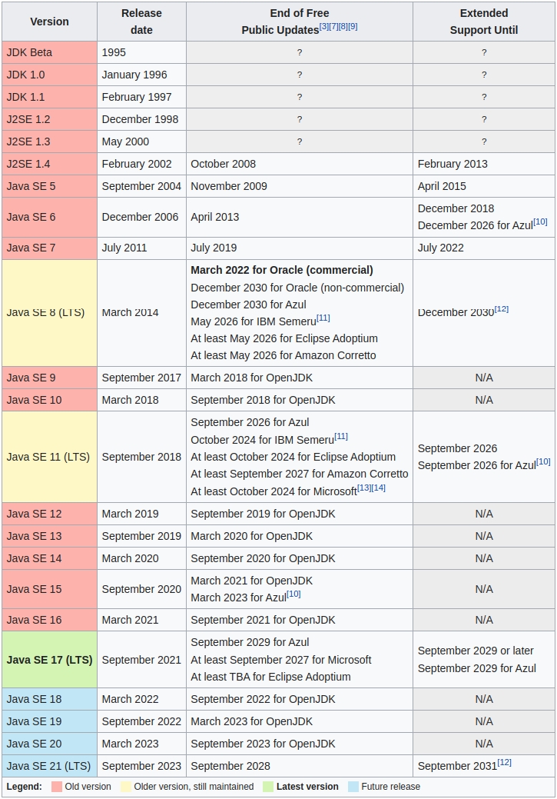
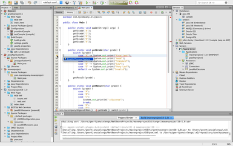
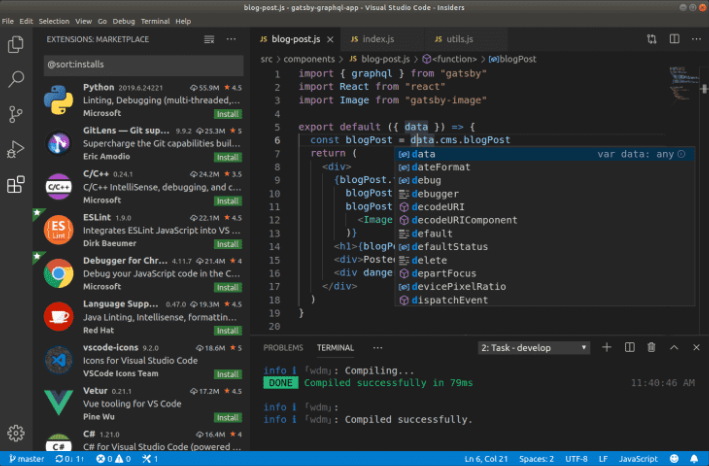
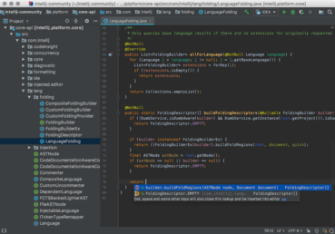
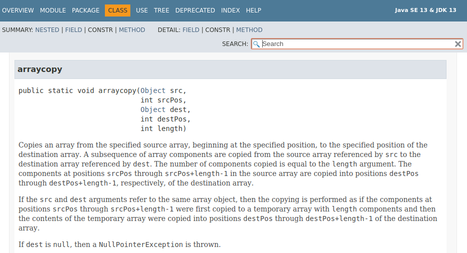
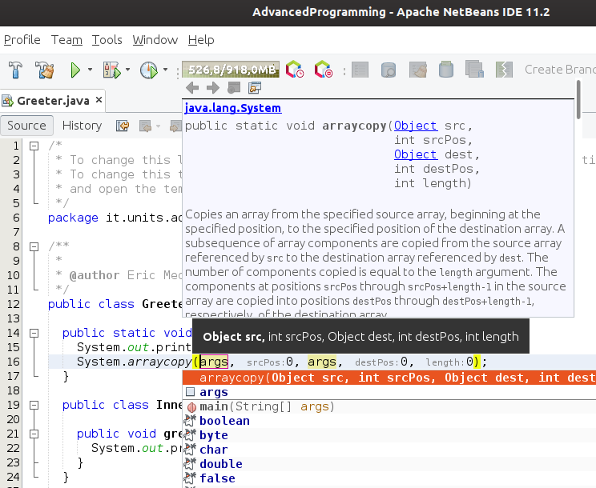

class: middle, center

# Advanced Programming
## 143IN, 316MI, 558EC

[Eric Medvet](http://medvet.inginf.units.it/)

A.Y. 2022/2023

---

## Lecturer

Eric Medvet
- Associate Professor of Computer Engineering at [Departmenet of Engineering and Architecture](https://dia.units.it/), [University of Trieste](https://www.units.it/)
- Online at: [medvet.inginf.units.it](http://medvet.inginf.units.it/)

Research interests:
- Evolutionary Computation
- Machine Learning applications
- Embodied intelligence

Labs:
- [Evolutionary Robotics and Artificial Life lab](https://erallab.inginf.units.it/)
- [Machine Learning lab](https://machinelearning.inginf.units.it/)

---

## Comp. Eng. (ING-INF/05) group

.cols.compact[
.c50[
.h5ex.vam[]
[Sylvio Barbon Jr.](https://www.barbon.com.br/)  
<i class="fa-solid fa-chalkboard-user col2"></i> Fondamenti di informatica  
<i class="fa-solid fa-chalkboard-user col2"></i> Progettazione del software e dei sistemi informativi  
<i class="fa-regular fa-lightbulb col2"></i> *meta learning, applied ML, process mining*

.h5ex.vam[]
[Alberto Bartoli](https://bartoli.inginf.units.it/)  
<i class="fa-solid fa-chalkboard-user col2"></i> Reti di calcolatori  
<i class="fa-solid fa-chalkboard-user col2"></i> Computer networks 2 and introduction to cybersecurity  
<i class="fa-regular fa-lightbulb col2"></i> *security, applied ML, evolutionary computation*

.h5ex.vam[]
[Andrea De Lorenzo](https://delorenzo.inginf.units.it/)  
<i class="fa-solid fa-chalkboard-user col2"></i> Basi di dati  
<i class="fa-solid fa-chalkboard-user col2"></i> Programmazione web  
<i class="fa-regular fa-lightbulb col2"></i> *security, applied AI&ML, information retrieval, GP*

]
.c50[
.h5ex.vam[]
[Eric Medvet](https://medvet.inginf.units.it/)  
<i class="fa-solid fa-chalkboard-user col2"></i> Programmazione avanzata  
<i class="fa-solid fa-chalkboard-user col2"></i> Introduction to machine learning and evolutionary robotics  
<i class="fa-regular fa-lightbulb col2"></i> *evolutionary computation, embodied AI, applied ML*

.h5ex.vam[]
[Laura Nenzi](https://lauranenzi.github.io/)  
<i class="fa-solid fa-chalkboard-user col2"></i> Cyber-physical systems  
<i class="fa-solid fa-chalkboard-user col2"></i> Introduction to Artificial Intelligence  
<i class="fa-regular fa-lightbulb col2"></i> *formal methods, runtime verification*

.h5ex.vam[]
[Martino Trevisan](https://trevisan.inginf.units.it/)  
<i class="fa-solid fa-chalkboard-user col2"></i> Reti di calcolatori  
<i class="fa-solid fa-chalkboard-user col2"></i> Sistemi operativi  
<i class="fa-solid fa-chalkboard-user col2"></i> Architetture dei sistemi digitali  
<i class="fa-regular fa-lightbulb col2"></i> *network measurements, data privacy, big data*
]
]

---

## Materials

Teacher slides:
- available [here](https://medvet.inginf.units.it/teaching/2223-advancedprogramming/)
- might be updated during the course

Intended usage:
- slides should contain every concept that has to be taught/learned
- **but**, slides are designed for consumption during a lecture, they might be suboptimal for self-consumption $\rightarrow$ **take notes!**

---

## Exam

Two options:

1. project + "short" oral exam
  - grade: weighted average with weights 50%, 50%
  - failed if at least one part is graded <6/10.
2. oral exam

---

### List of exercises

Just for reference:
1. [Anagrams](#exercise1)
2. [Equivalence](#exercise2)
3. [File array](#exercise3)
4. [Compressed file array](#exercise4)
5. [Word counter server](#exercise5)

---

### Project

Project:
- assigned at the end of the course
- student's output: software, tests, brief document
- to be submitted **within the exam date**
- grade:
  - 0/10: not submitted or missed deadline  
  - 5/10 to 10/10: submitted, depending on
    - quality of code
    - software structure
    - document (mainly clarity)
    - test coverage
    - degree of working

More details at project assignment.

---

### Oral exam

Oral exam:
- questions and short programming exercises

---

## Course content

In brief:
1. **Java** as object-oriented programming language
2. Tools and methods for programming
3. Distributed programming

.note[See the [syllabus](https://medvet.inginf.units.it/teaching/2223-advancedprogramming/)!]

---

## Exercises

There we'll be several exercises:
- approx. 20h on 72h
- sofware design and implementation exercises
- bring your own device
- in classroom
  - with the teacher actively investigating about your progresses

Practice is fundamental!

**Extra excercises** with the teaching assistant, [Giorgia Nadizar](https://giorgia-nadizar.github.io/)

.note[**Computational thinking is an outcome of the coding practice**. See Nardelli, Enrico. "[Do we really need computational thinking?](https://cacm.acm.org/magazines/2019/2/234348-do-we-really-need-computational-thinking/abstract)." Communications of the ACM 62.2 (2019): 32-35.]

---

## Teaching assistant

**Giorgia Nadizar**
- 2nd year PhD student enrolled in the Applied Data Science and Artificial Intelligence PhD program at the [Departmenet of Mathematics and Geosciences](https://dmg.units.it/), [University of Trieste](https://www.units.it/)
- former student of this course
- online at: [giorgia-nadizar.github.io](https://giorgia-nadizar.github.io/)

Role of the tutor:
- leading **extra excercise sessions**
- assisting students **during excercises**, together with the teacher
- first point-of-contact for course-related questions by students
  - the teacher is **always available**

---

## You?

- How many of you already know object-oriented programming?
- How many of you already know Java?
- What do you expect to learn from this course?

---

class: middle, center

# Java: what and why?

---

## Why Java?

Practical motivations:
- write once, run anywhere
- large community support, solid tools, many APIs
- free

Teaching-related motivations:
- favors **abstraction**
  - the object as the central abstraction
- realizes many **key concepts** of programming and languages

---

## Language, platform

Java is both:
- a programming language
- a software platform

We will focus on:
- (mainly) the programming language
- (secondarily) the Java 2 Platform, Standard Edition (J2SE)

---

## Java platform

Mailnly composed of:
- an execution engine
- a compiler
- a set of specifications
- a set of libraries, with Application Program Interfaces (**APIs**)

Platforms (also called **editions**) differ mainly in the libraries.
Most common editions:
- Java 2 Platform, Standard Edition (J2SE): for general-purpose, desktop applications
- Java 2 Platform, Enterprise Edition (J2EE): J2SE + APIs/specifications for multi-tier client-server enterprise applications

---

## Main tools

What is needed for developing in Java?
- Java Development Kit (**JDK**), absolutely necessary
- API documentation (briefly **javadoc**)
- Integrated Development Environment (**IDE**)
  - many options
  - when used proficiently, makes development more efficient and effective

---

## JDKs

One JDK per (vendor, platform, version, os+architecture).

A few options:
- [Oracle JDK](https://www.oracle.com/java/technologies/javase-downloads.html)
- [OpenJDK](https://openjdk.java.net/)

---

## JDK versions
.cols[
.c40[
We are currently at version **19**:
- last LTS¹ is **17**
- coming in days: **20**

History from [Wikipedia](https://en.wikipedia.org/wiki/Java_version_history)

.note[1: LTS: long-term support]
]
.c60[
.center.h40ex[]
]
]

---

## Java IDEs

Many excellent options.

Classic, desktop-based:
- [Jetbrains IntelliJ IDEA](https://www.jetbrains.com/idea/)
  - the one I know better
- [Microsoft Visual Studio Code](https://code.visualstudio.com/)
- [Apache NetBeans](https://netbeans.apache.org/)
- [Eclipse IDE](https://www.eclipse.org/ide/)

Cloud-based:
- Full: [GitHub Codespace](https://docs.github.com/en/codespaces/setting-up-your-project-for-codespaces/adding-a-dev-container-configuration/setting-up-your-java-project-for-codespaces), [Codenvy](https://codenvy.com/), [Eclipse Che + OpenShift](https://che.openshift.io/)
  - steeper learning curve
- Light: [CompileJava.net](https://www.compilejava.net/), [repl.it](https://repl.it/)

---

## IDE: your best friend

.cols[
.c60[
Pros:
- makes typing much faster
- greatly helps following conventions
- makes software lifecycle operations faster
- helps finding errors

Cons:
- steep learning curve
- may hide some programming/development concepts

**Pros >> Cons**
]
.c40[
.center[
.h10ex[]
.h10ex[]
.h10ex[]
.h10ex[]
]
]
]

---

class: middle, center

# Basic operations
## Compiling and executing

---

## `.java` vs. `.class` files

- The **source** code is in one or more `.java` files
- The **executable** code is in one or more `.class` files

**Compilation**: obtaining a `.class` from `.java`

```bash
javac Greeter.java
```

---

## Class-file

`.java` contains **exactly one** class definition (common case)

```java
public class Greeter {
  //...
}
```

Or it contains more than one class definitions, at most one non-inner has the `public` modifier (we will see):

.cols[
.c50[
```java
public class Greeter {
  //...
}
*class Helper {
  //...
}
```
]
.c50[
```java
public class Greeter {
  //...
* public class InnerHelper {
    //...
  }
}
```
]
]

Compilation results always in one `.class` for each class definition!

---

## Execution

An **application** is a `.class` compiled from a `.java` that has a "special function" `main`

```java
public class Greeter {
* public static void main(String[] args) {
    \\...
  }
}
```

An application can be executed:
```bash
java Greeter
```
.note[Or `java Greeter.class`, or in other ways]

---

## Class and the virtual machine

- A `.class` file contains executable code in a binary format (**bytecode**)
- The bytecode is **interpreted** by a program (`java`) that simulates a machine: the Java Virtual Machine (**JVM**)

JVM:
- like a real machine, but simulated: it has an instruction set and manages memory
- agnostic with respect to the physical machine
- does not know Java language, knows bytecode

---

## JVM language

An example of the JVM specification, the instruction `iadd`:

.big-quote[
#### Operand Stack
..., value1, value2 $\rightarrow$
..., result
#### Description
Both value1 and value2 must be of type int. The values are popped from the operand stack. The int result is value1 + value2. The result is pushed onto the operand stack.

The result is the 32 low-order bits of the true mathematical result in a sufficiently wide two's-complement format, represented as a value of type int. If overflow occurs, then the sign of the result may not be the same as the sign of the mathematical sum of the two values.
]

---

## Portability

A `.class` executable can be executed on any machine for which a program exists that simulates the JVM (i.e., a `java`).

"One" `.java` compiled to "one" `.class`, can be executed:
- on Linux x64, with the `java` program for Linux x64
- on Solaris SPARC x64, with the `java` program for Solaris SPARC x64
- Mac OS X, Windows, Android, ...

$\rightarrow$ **Write once, run anywhere**

---

## Who executes what

Note:
- the OS executes `java`
- `java` executes the bytecode
  - simulates the JVM which executes the bytecode
- the OS cannot execute the bytecode!

---

## Where is `java`?

`java` is part of the Java Runtime Environment (**JRE**), which includes also necessary libraries.
The JRE is part of the JDK.

The JDK contains (mainly):
- the compiler `javac`
- the JRE (including `java`)
- many compiled classes (`.class` files)
- other development tools

It does not contain:
- the classes source code
- the documentation

---

## Inside the JDK
```bash
eric@cpu:~$ ls /usr/lib/jvm/java-11-openjdk-amd64 -la
totale 48
*drwxr-xr-x  2 root root  4096 feb  6 12:08 bin
drwxr-xr-x  4 root root  4096 feb  6 12:08 conf
drwxr-xr-x  3 root root  4096 feb  6 12:08 include
drwxr-xr-x  6 root root  4096 feb  6 12:08 lib
...
```

```bash
eric@cpu:~$ ls /usr/lib/jvm/java-11-openjdk-amd64/bin/ -la
totale 632
-rwxr-xr-x 1 root root  14576 gen 15 16:14 jar
-rwxr-xr-x 1 root root  14576 gen 15 16:14 jarsigner
*-rwxr-xr-x 1 root root  14560 gen 15 16:14 java
*-rwxr-xr-x 1 root root  14608 gen 15 16:14 javac
-rwxr-xr-x 1 root root  14608 gen 15 16:14 javadoc
...
```

Usually the JDK can be **installed** on the OS; but it can be simply uncompressed somewhere.

---

## Documentation and source code

Do you need them?
- documentation: **yes**, in practice
- source code: no, but it can be useful for understanding

How to access the documentation?
- online: [https://docs.oracle.com/en/java/javase/17/docs/api/index.html](https://docs.oracle.com/en/java/javase/17/docs/api/index.html)
- through IDE, often deeply integrated with autocompletion and suggestions

How to access the source code?
- download it
- download it in the IDE, access through the IDE (**ctrl+click**)

---

## Consuming the documentation

.cols[
.c50.center[

]
.c50.center[

]
]

---

## Java: interpreted or compiled?

**Both!**
- `.java` to `.class` through **compilation**
- `.class` is then **interpreted** by `java` for being executed on OS

Actually, things are much more complex:
- on the fly optimization
- recompilation
- compilation to native code
- ...

---

## Intepretation and efficiency

Is intepretation efficient?
- unrelevant question

Relevant question: is my software fast enough?
- it depends: measure!

If not?
1. profile
2. find opportunities for improvement
3. improve

(that is: write good code!)

The problem is rarely in interpretation!

---

## Beyond speed of execution

When choosing a language/platform, speed of execution is just one factor.

Other factors:
- code maintainability
- documentation/support availability
- quality of development tools
- libraries availability
- ...
- previous knowledge
- ...

In general, consider **all costs** and assess options.
