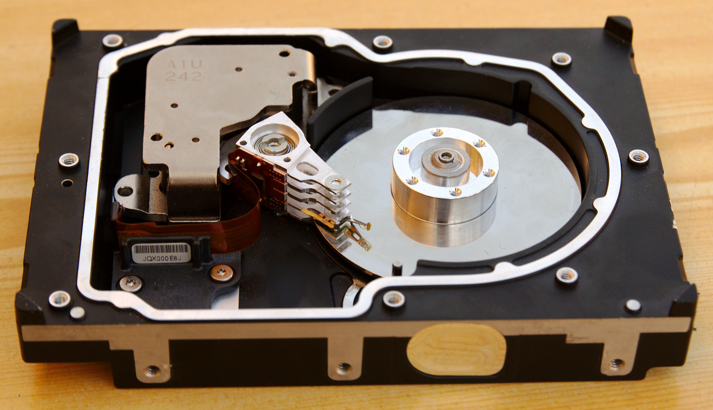
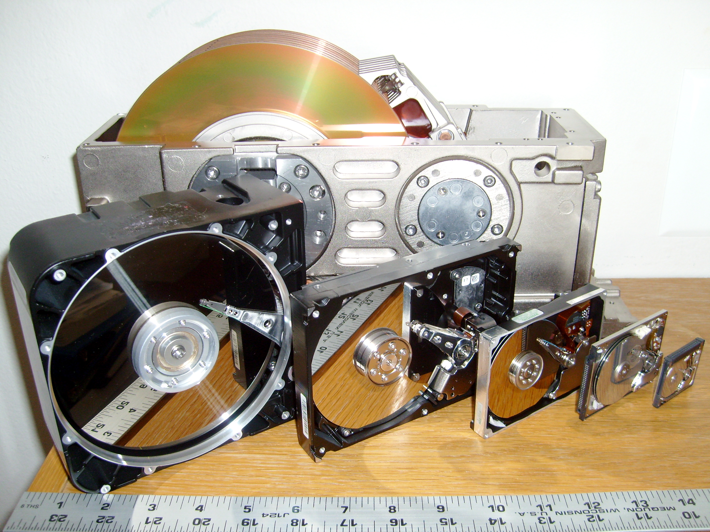
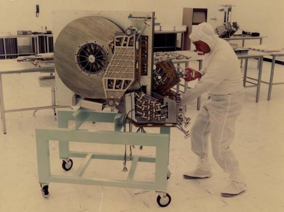

class: middle, center

# Memory technology

(very briefly)

---

## Recap

| Type | Access time [ns] | Cost [$/GB] |
| - | - | - |
| SRAM | 0.5–2.5 | 500–1000 |
| DRAM | 50–70 | 10–20 |
| Flash | 5000–50000 | 0.75–1.00 |
| Magnetic disk | 5000000–20000000 | 0.05–0.10 |

How do they work?

---

## Static Random Access Memory (SRAM)

Properties:
- fixed access (read/write) time
  - read and write times may be different

Technology:
- 6–8 transistors for each bit (for minimizing disturbance during reads): large footpring on silicon
- no need to refresh: access time is very close to cycle time
- low power consumption in standby
- "currently" SRAM are no longer separate chips, but are integrated onto processors

---

## Dynamic Random Access Memory (DRAM)

Properties:
- faster access to batches of data (rows are buffered)

Technology:
- 1 transistor + 1 capacitor per bit: lower footprint than SRAM
- stored data has to be refreshed (read and write)
  - no access while refreshing
  - bits are organized in rows, rows are freshed at once, rows are buffered

---

### "Modern" DRAM

- *syncrhonous DRAM* (SDRAM): a clock facilitates burst transfer
- *Double Data Rate (DDR) SDRAM*: transfer on both rising and falling edge
  - DDR4-3200 means 1600 MHz clock
  - organized in banks: reads/writes done concurrently on several banks
- often physically packed in *dual inline memory modules* (DIMMs)
  - a DIMM usually contains 4-16 DRAM chips
  - a typical DIMM can transfer 25600 MB/s (PC25600)

---

### DRAM over time

| Year | Chip size [bit] | Cost [$/GB] | Access time new¹ [ns] | Access time existing² [ns]
| - | - | - | - | - |
| 1980 | 64 K | 1500000 | 250 | 150 |
| 1983 | 256 K | 500000 | 185 | 100 |
| 1985 | 1 M | 200000 | 135 | 40 |
| 1989 | 4 M | 50000 | 110 | 40 |
| 1992 | 16 M | 15000 | 90 | 30 |
| 1996 | 64 M | 10000 | 60 | 12 |
| 1998 | 128 M | 4000 | 60 | 10 |
| 2000 | 256 M | 1000 | 55 | 7 |
| 2004 | 512 M | 250 | 50 | 5 |
| 2007 | 1 G | 50 | 45 | 1.25 |
| 2010 | 2 G | 30 | 40 | 1 |
| 2012 | 4 G | 10 | 35 | 0.8 |

1: row accessed for the first time  
2: row recently accessed

---

## Flash memory

Technology:
- based on *electrically erasable programmable read-only memory* (EEPROM)
- writes can wear hardware behind bits
  - a controller takes care of distributing usage evenly

*Solid state drives* (SSDs) use flash memory

---

## Disk memory

Technology:
- with parts in movements (differently than SRAM, DRAM, flash)

*Hard disk drives* (HDDs) are storage devices based on disk memory

.center.w75p[

]

---

### Terminology

Mechanical parts:
- platters
- heads

Logical parts:
- track (1000s of sectors): concentric cyrcle on the platter
- sector (512–4096 bytes): portion of the track
- cylinder: set of vertically aligned sectors

Read/write phases:
- seek: head moves toward track ($\approx$ 3–13 ms)
- rotational latency or delay ($\approx$ 6 ms @ 5400 RPM)
- actual data read/write
  - overall transfer rate: 100–200 MB/s (2012, w/o cache)

---

### HDD "history"

.cols[
.c50[
.center[]
Different sizes over time
]
.c50[
.center[]
HDD in 1979!
]
]
