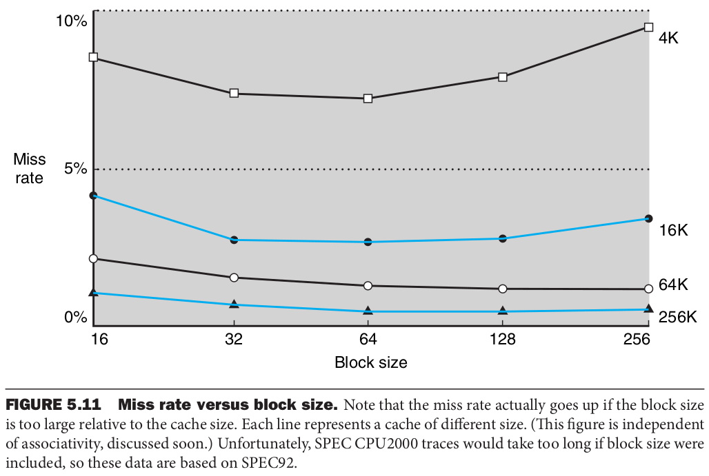
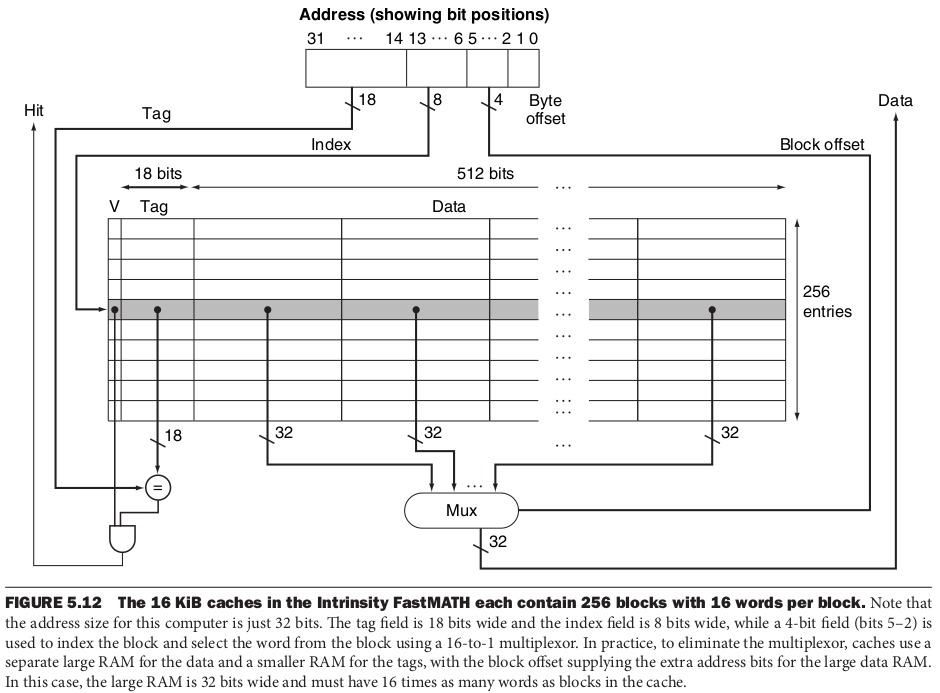

class: middle, center

# Caches

---

## What's a cache?

**Cache**: *a hiding place* to put something for *future use*

First usage of the term in computers denoted specifically the small memory between the processor and the main memory

Nowadays, cache denotes any storage that takes advantage of locality
- e.g., browser cache

---

## Using a cache

(Consider just reads for now)

Whenever the processor want to read a memory location $x$:
- check if $x$ is in the cache .note[$x$ is the address of the data]
- if yes, read it from there, otherwise, read it from main memory and store it in the cache

How to?
1. know if $x$ is in the cache?
2. if yes, know where it is in the cache? .note[$x$ is the address of the location in the main memory, not in the cache; if it was, the size of the cache would be the same of the main memory ➝ useless!]

---

## Premise

Memory content vs. memory addresses

.cols[
.c40[
.mem[
000 .content[13]  
001 .content[45]  
010 .content[e4]  
011 .content[14]  
100 .content[0f]  
101 .content[76]  
110 .content[1a]  
111 .content[ff]
]
]
.c60[
8 byte memory:
- addresses goes from .mem[0002] = 0 to .mem[1112] = 7, i.e., 3-bit addresses
- at each address, there is a byte
  - .mem.content[1316] = .mem.content[000100112]
- $[x]$ is the data at $x$
  - .mem[[011]] = .mem.content[1416] = .mem.content[000101002]
]
]

In general, there are $n$-bit addresses (e.g., $n=64$)

---

## Direct mapped cache

The cache consists of $s_c=2^{n_c}$ triplet $\langle$**validity bit**, **tag**, **block**$\rangle$
- a **block** contains $s_b=2^{n_b}$ bytes (e.g., $s_b=8, 64, \dots$)
  - the $k$-th block will host portions of the main memory of $s_b$ bytes starting at addresses $x$ s.t. $x \mathbin{\%} s_c = k$
  - $\Rightarrow$ many different $x$ map to the same block
- a **tag** indicates which one of the many different $x$ is actually in the block
  - there can be $2^{n_m-n_c-n_b}$ values, with main memory size $s_m=2^{n_m}$
- a **validity bit** indicates if the block is to be considered valid
  - initially set to .mem[0]

---

### Example

.cols[
.c70[
Cache  
($s_c=4$, $n_c=2$, $s_b=1$, $n_b=0$)
.mem.vdense[
00 .content[1 01 00010000]  
01 .content[1 10 10000010]  
10 .content[0 11 10000010]  
11 .content[0 11 10010101]  
]
Tag size:  
$n_m-n_c-n_b=4-2-0=2$ bits

Triplet size:  
$1+n_m-n_c-n_b+8 s_b=1+2+8=11$ bits

Cache size:  
$s_c (1+n_m-n_c-n_b+8 s_b) = 4 \cdot 11 = 44$ bits
]
.c30[
Main memory  
($n_m=4$, $s_m=$ 16 bytes = 128 bit)
.mem.vdense[
0000 .content[00000001]  
0001 .content[00000010]  
0010 .content[00000100]  
0011 .content[00001000]  
0100 .content[00010000]  
0101 .content[00100000]  
0110 .content[01000000]  
0111 .content[10000000]  
1000 .content[10000001]  
1001 .content[10000010]  
1010 .content[10000100]  
1011 .content[10001000]  
1100 .content[10010000]  
1101 .content[10100000]  
1110 .content[11000000]  
1111 .content[11000001]
]
]
]

---

## Looking in the cache

(Assume $s_b=1$)

Given a cache with $s_c=2^{n_c}$ blocks, looking for $x$ means looking at the $k$-th block with $x \mathbin{\%} s_c = k$

With binary numbers $x \mathbin{\%} s_c = x \mathbin{\%} 2^{n_c}$ is "the less significant $n_c$ bits of $x$"

Example with $n_m=8$, $n_c=3$:
- $x=$ .mem[01001.l[111]2] = 79 $\Rightarrow$ $k= 79 \mathbin{\%} 2^{3} = 79 \mathbin{\%} 8 = 7 =$ .mem[1112]
- $x=$ .mem[00101.l[011]2] = 43 $\Rightarrow$ $k= 43 \mathbin{\%} 2^{3} = 43 \mathbin{\%} 8 = 3 =$ .mem[0112]
- ...

---

### One to many

.cols[
.c60[
Cache  
($s_c=4$, $n_c=2$, $s_b=1$)
.mem.vdense[
.cp1-1[00] .content[1 01 00010000]  
.cp1-2[01] .content[1 10 10000010]  
.cp1-3[10] .content[0 11 10000010]  
.cp1-4[11] .content[0 11 10010101]  
]
]
.c40[
Main memory  
($n_m=4$, $s_b=$ 16 bytes = 128 bit)
.mem.vdense[
.cp1-1[0000] .content[00000001]  
.cp1-2[0001] .content[00000010]  
.cp1-3[0010] .content[00000100]  
.cp1-4[0011] .content[00001000]  
.cp1-1[0100] .content[00010000]  
.cp1-2[0101] .content[00100000]  
.cp1-3[0110] .content[01000000]  
.cp1-4[0111] .content[10000000]  
.cp1-1[1000] .content[10000001]  
.cp1-2[1001] .content[10000010]  
.cp1-3[1010] .content[10000100]  
.cp1-4[1011] .content[10001000]  
.cp1-1[1100] .content[10010000]  
.cp1-2[1101] .content[10100000]  
.cp1-3[1110] .content[11000000]  
.cp1-4[1111] .content[11000001]
]
]
]

---

class: lab
name: excercise1-cachesize

## Cache size

1. For a main memory of 4 GB and a cache with 1024 block of 4 words each
  - compute the tag size in bits
  - compute the ratio between effective data stored in the cache and overall cache size
<!--- solution: n_m=32, n_c=10, n_b=4; tag_size=32-10-4=18; rho=16*8/(16*8+19)=87.1% -->
2. Repeat for a main memory of 4 GB and a cache with 1024 block of 16 words each
<!--- solution: n_m=32, n_c=10, n_b=6; tag_size=32-10-6=15; rho=16*8/(16*8+16)=88.9% -->

.note[1 word is 4 bytes]

---

## Algorithm for reading $x$

Given $x$ of $n_m$ bits (**assume $s_b=1$**):
1. take $y=x_{[n_m-n_c,n_m[}$ as the $n_c$ less significant bits of $x$
2. read triplet $t=[y]$ from cache at address $y$
  - $t\_\text{val} = t\_{[0,1[}$ is the first bit of $t$
  - $t\_\text{tag}=t\_{[1,1+(n_m-n_c)[}$ are bits of $t$ from 2-nd to $2+(n_m-n_c)$-th
  - $t\_\text{block}=t\_{[1+(n_m-n_c),1+(n_m-n_c)+8[}$ is the block (of 1 byte)
3. if $t_\text{val} \ne$ .mem[1], go to 6
4. if $t_\text{tag} \ne$ the $n_m-n_c$ most significant bits of $x$, go to 6
5. return $t_\text{block}$ (**hit**)
6. read $x$ from main memory (**miss**)
7. put .mem.content[1] $x\_{[0,n\_m-n\_c[}$ $[x]$ at $y=x\_{[n\_m-n\_c,n\_m[}$ in the cache
8. return $[x]$

---

### Example (**hit** for $x=$ .mem[1001])

.cols[
.c60[
Cache ($n_c=2$, $n_b=0$)
.mem.vdense[
00 .content[1 01 00010000]  
01 .content[1 10 10000010]  
10 .content[0 11 10000010]  
11 .content[0 11 10010101]  
]
]
.c40[
Main memory ($n_m=4$)
.mem.vdense[
0000 .content[00000001]  
0001 .content[00000010]  
...  
1110 .content[11000000]  
1111 .content[11000001]
]
]
]

1. $y=x\_{[4-2,4[}=$ .mem[01]
2. $t=[y]=$ .mem[[10]] = .mem.content[1 10 10000010]
  - $t\_\text{val}=t\_{[0,1[}=$ .mem.content[1]
  - $t\_\text{tag}=t\_{[1,1+4-2[}=$ .mem.content[10]
  - $t\_\text{block}=t\_{[1+4-2,1+4-2+8[}=$ .mem.content[10000010]
3. $t\_\text{val}=$ .mem.content[1] $=$ .mem[0]
4. $t\_\text{tag}=$ .mem.content[10] $=x\_{[0,4-2[}=$ .mem[10]
5. return $t\_\text{block}=$ .mem.content[10000010]

---

### Example (**miss** for $x=$ .mem[0000])

.cols[
.c60[
Cache ($n_c=2$, $n_b=0$)
.mem.vdense[
00 .content[1 01 00010000]  
01 .content[1 10 10000010]  
10 .content[0 11 10000010]  
11 .content[0 11 10010101]  
]
]
.c40[
Main memory ($n_m=4$)
.mem.vdense[
0000 .content[00000001]  
0001 .content[00000010]  
...  
1110 .content[11000000]  
1111 .content[11000001]
]
]
]

1. $y=x\_{[4-2,4[}=$ .mem[00]
2. $t=[y]=$ .mem[[00]] = .mem.content[1 01 00010000]
3. $t\_\text{val}=$ .mem.content[1] $=$ .mem[0]
4. $t\_\text{tag}=$ .mem.content[01] $\ne x\_{[0,4-2[}=$ .mem[00]
6. read .mem[0000] from main memory
7. put .mem.content[1] .mem.content[00] .mem.content[00000001] at $y=$ .mem[00]
8. return $[x]=$ .mem.content[00000001]

---

## Miss rate and miss penalty

Given a sequence of $n$ addresses $x_1, x_2, \dots, x_n$
- the **miss rate** is the ratio between accesses resulting in a miss and $n$
  - the **hit rate** is $1-$ miss rate
- the **miss penalty** is the time taken to read a block from main memory and put it in the cache (steps 6 and 7)
  - during this time, the processor waits

---

## Example of .cp2-1[misses] and .cp2-5[hits]

$x=$ .mem[101], .mem[000], .mem[111], .mem[001], .mem[010] (left), .mem[000], .mem[101], .mem[110], .mem[111], .mem[110] (right)

.cols[
.c30[
.mem.vdenser[
00 .content[0 0 00000000]  
.cp2-1[01] .content[1 1 00100000]  
10 .content[0 0 00000000]  
11 .content[0 0 00000000]
]
.mem.vdenser[
.cp2-1[00] .content[1 0 00000001]  
01 .content[1 1 00100000]  
10 .content[0 0 00000000]  
11 .content[0 0 00000000]
]
.mem.vdenser[
00 .content[1 0 00000001]  
01 .content[1 1 00100000]  
10 .content[0 0 00000000]  
.cp2-1[11] .content[1 1 10000000]
]
.mem.vdenser[
00 .content[1 0 00000001]  
.cp2-1[01] .content[1 0 00000010]  
10 .content[0 0 00000000]  
11 .content[1 1 10000000]
]
.mem.vdenser[
00 .content[1 0 00000001]  
01 .content[1 0 00000010]  
.cp2-1[10] .content[1 1 00000100]  
11 .content[1 1 10000000]
]
]
.c30[
.mem.vdenser[
.cp2-5[00] .content[1 0 00000001]  
01 .content[1 0 00000010]  
10 .content[1 1 00000100]  
11 .content[1 1 10000000]
]
.mem.vdenser[
00 .content[1 0 00000001]  
.cp2-1[01] .content[1 1 00100000]  
10 .content[1 1 00000100]  
11 .content[1 1 10000000]
]
.mem.vdenser[
00 .content[1 0 00000001]  
01 .content[1 1 00100000]  
.cp2-5[10] .content[1 1 00000100]  
11 .content[1 1 10000000]
]
.mem.vdenser[
00 .content[1 0 00000001]  
01 .content[1 1 00100000]  
10 .content[1 1 00000100]  
.cp2-5[11] .content[1 1 10000000]
]
.mem.vdenser[
00 .content[1 0 00000001]  
01 .content[1 1 00100000]  
.cp2-5[10] .content[1 1 00000100]  
11 .content[1 1 10000000]
]
]
.c30[
Initial cache
.mem.vdenser[
00 .content[0 0 00000000]  
01 .content[0 0 00000000]  
10 .content[0 0 00000000]  
11 .content[0 0 00000000]
]
Main memory
.mem.vdenser[
000 .content[00000001]  
001 .content[00000010]  
010 .content[00000100]  
011 .content[00001000]  
100 .content[00010000]  
101 .content[00100000]  
110 .content[01000000]  
111 .content[10000000]
]
hit rate $= 40\%$
]
]

.question[Is there temporal or spatial locality in this sequence of $x$? Are they both exploited?]

---

## Exploting spatial locality

*Spatial locality*: if a data location $x$ is accessed at $t$, data locations *close* to $x$ (some $x+ \delta x$) will be likely accessed again soon

We need to have not only $x$ but also $x+ \delta x$ in cache  
$\Rightarrow$ use larger blocks! (i.e., $s_b>1$)
- miss penalty **increases too**: upon miss, larger data transfer from main memory

---

## Direct mapping with $s_b>1$

Assume $n_m=6$, $n_c=2$, $n_b=2$ (block size is $s_b=4$ bytes)

- block at $y=$ .mem[00] host
  - bytes from $x=$ .mem[00.l[00]00] to .mem[00.l[00]11]
  - bytes from $x=$ .mem[01.l[00]00] to .mem[01.l[00]11]
  - bytes from $x=$ .mem[10.l[00]00] to .mem[10.l[00]11]
  - bytes from $x=$ .mem[11.l[00]00] to .mem[11.l[00]11]
- block at $y=$ .mem[01] host
  - bytes from $x=$ .mem[00.l[01]00] to .mem[00.l[01]11]
  - bytes from $x=$ .mem[01.l[01]00] to .mem[01.l[01]11]
  - ...
- ...

$y$ is the bits in $x$ from $n_m-n_c-n_b$ to $n_m-n_b$

---

## Algorithm for reading $x$ ($n_b \ge 0$)

1. $y=x_{[n_m-n_c-n_b,n_m-n_b[}$
2. $t=[y]$
  - $t\_\text{val} = t\_{[0,1[}$
  - $t\_\text{tag}=t\_{[1,1+(n_m-n_c-n_b)[}$
  - $t\_\text{block}=t\_{[1+(n_m-n_c-n_b),1+(n_m-n_c-n_b)+8 \cdot 2^{n_b}[}$
3. if $t_\text{val} \ne$ .mem[1], go to 6
4. if $t\_\text{tag} \ne x\_{[0,n\_m-n\_c-n\_b[}$, go to 6
5. return $t\_{\text{block} [8 \cdot 2^z,8 \cdot 2^z+8[}$ with $z=x\_{[n\_m-n\_b, n\_m[}$ (**hit**)
6. read $x\_0, \dots, x\_{s\_b-1}$ from main memory (**miss**)
  - $x\_0 = x\_{[0,n\_m-n\_b[}$ .mem[0]....mem[0] ($n\_b$ .mem[0]s)
  - $x\_k = x\_{[0,n\_m-n\_b[}$ $k$.mem[2] ($k$ as binary with $n\_b$ bits)
  - $x\_{s\_b-1} = x\_{[0,n\_m-n\_b[}$ .mem[1]....mem[1] ($n\_b$ .mem[1]s)
7. put .mem.content[1] $x\_{[0,n\_m-n\_c-n\_b[}$ $[x\_0] \dots [x\_{s\_b-1}]$ at $y$
8. return $[x]$

---

### Example (**hit** for $x=$ .mem[00001])

.cols[
.c60[
Cache ($n_c=2$, $n_b=1$)
.mem.vdense[
00 .content[1 00 00000001 00000010]  
01 .content[1 10 00100000 00110000]  
10 .content[0 00 00000000 00000000]  
11 .content[0 00 00000000 00000000]  
]
]
.c40[
Main memory ($n_m=6$)
.mem.vdense[
00000 .content[00000001]  
00001 .content[00000010]  
...  
11110 .content[11100000]  
11111 .content[11100001]
]
]
]

1. $y=x\_{[5-2-1,5-1[}=$ .mem[00]
2. $t=[y]=$ .mem[[10]] = .mem.content[1 00 00000001 00000010]
  - $t\_\text{val}=t\_{[0,1[}=$ .mem.content[1]
  - $t\_\text{tag}=t\_{[1,1+4-2[}=$ .mem.content[00]
  - $t\_\text{block}=t\_{[1+4-2,1+4-2+8^2[}=$ .mem.content[00000001 00000010]
3. $t\_\text{val}=$ .mem.content[1] $=$ .mem[0]
4. $t\_\text{tag}=$ .mem.content[10] $=x\_{[0,4-2[}=$ .mem[10]
5. return $t\_{\text{block} [8 \cdot 2^z,8 \cdot 2^z+8[}=$ .mem.content[00000010] with $z=x\_{[5-1, 5[}=$ .mem[1]

---

class: lab
name: excercise2-accessess

## Misses and hits with $n_b=4$

For a main memory of 256 byte, where $x=[x]$, a cache with 4 blocks of 1 word each, and the reads 10, 11, 13, 20, 21, 22, 10, 20, 21 (decimal addresses $x$)
- show the cache content after the 3rd request
- compute the hit rate

**Hint**: use decimal notation for block contents

---

## Miss rate/penalty and block size

The larger the block size
- the lower the miss rate (for **better exploitment of spatial locality**)
- the longer the miss penalty
- the lower the number of blocks (for the same cache size)

Depends on the specific sequence of memory accesses

---

### In practice

.center[]

.note[from Patterson, David A., and John L. Hennessy. Morgan kaufmann, 2016]

---

## Miss penalty

The larger the block size
- the longer the miss penalty

Possible optimizations for reducing the penalty:
- **early restart**: restart when $[x]$ is read, not when the entire block is read from main memory
- **requested word first**: first read $[x]$, then *early restart*, then read the entire block

---

## Miss penalty: numbers

Assume:
- $n^b=4$
- 1 cycle per instruction (CPI)
- 1 cycle for reading one byte from cache
- 100 cycles for reading 4 bytes from main memory

Cycles for read:
- Hit: 1 cycle
- Miss: $4 \cdot 100 + 1=401$ cycles
- Miss with early restart: from $1 \cdot 100 + 1=101$ to $4 \cdot 100 + 1=401$ cycles, average $251$ cycles
- Miss with requested word first: $1 \cdot 100 + 1=101$ cycles

.note[These are gross estimates, not real numbers]

---

### Impact on CPI

- Hit: 1 cycle
- Miss: $4 \cdot 100 + 1=401$ cycles
- Miss with early restart: from $1 \cdot 100 + 1=101$ to $4 \cdot 100 + 1=401$ cycles, average $251$ cycles
- Miss with requested word first: $1 \cdot 100 + 1=101$ cycles

Actual CPI based on miss rate:

| | 1% | 5% | 10% | 50% |
|-|-|-|-|-|
|Miss|5|21|41|201|
|Miss with early restart|4|14|26|126|
|Miss with requested word first|2|6|11|51|

---

## Writes

If a write acts only on the cache, the content of the main memory at a given $x$ and of the cache at the corresponding $y$ may differ: they are **inconsistent**.

How to avoid inconsistencies?
1. write-through
2. write-back

---

## Write-through

At *each* write:
- write at $y$ in the cache **and**
- write at $x$ in the main memory

Pros:
- "simple" strategy, both conceptually and for the implementation

Cons:
- basically cache does not give any advantage for writes

---

### Impact on CPI

Assume:
- $n^b=1$
- 1 cycle per instruction (CPI)
- 1 cycle for reading one byte from cache
- 100 cycles for reading/writing 1 byte from main memory

Actual CPI based on miss rate (y-axis) and read-to-write ratio (x-axis):

| | 20 | 10 | 5 | 1 |
|-|-|-|-|-|
|1%|7|11|18|51|
|5%|10|15|22|53|
|10%|15|19|26|55|
|50%|53|55|59|75|

---

## Write-back

At each write:
- write at $y$ in the cache

At each miss at $y$ (read *and*¹ write): .note[1: can be optimized]
- first, write $y$ block back on proper $x$
- then, load from $x$ to $y$

Pros:
- more complex, harder to implement
  - more logic components, larger footprint, greater cost!

Cons:
- lower impact on actual CPI because of fewer accessess on main memory

---

class: lab
name: excercise3-cpi

## Actual CPI

Consider a processor with a CPI of 2 and a miss penalty of 100 cycles for both read and write; consider a program with a 3-to-1 read-to-write ratio resulting in an overall 4% miss rate:

1. what's the change in actual CPI by halving the miss rate?
2. what's the change in actual CPI by halving the miss penalty?

---

## A real cache
.cols[
.c80[
.center.w90p[]
]
.c20[
ailo
]
]

.note[from Patterson, David A., and John L. Hennessy. Morgan kaufmann, 2016]
