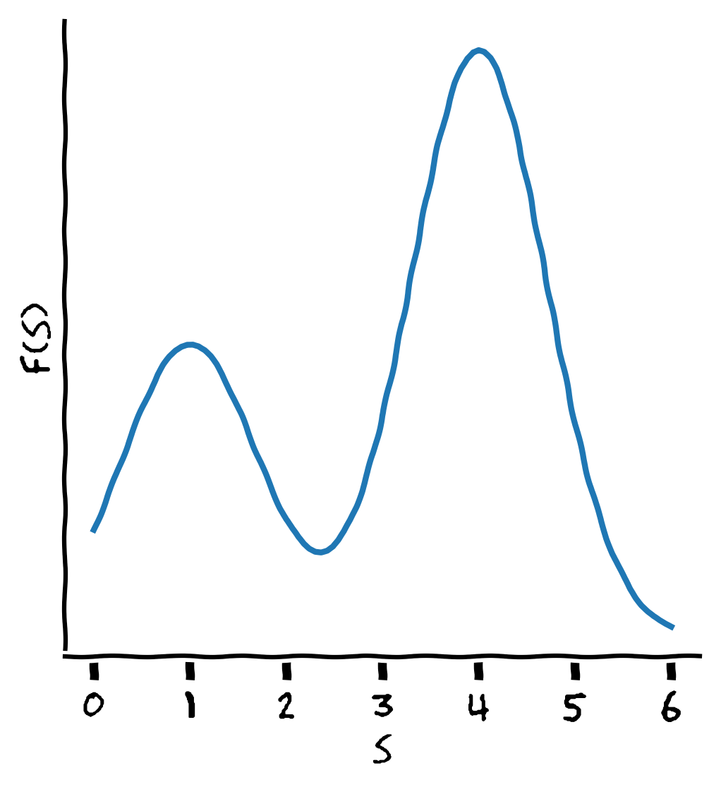
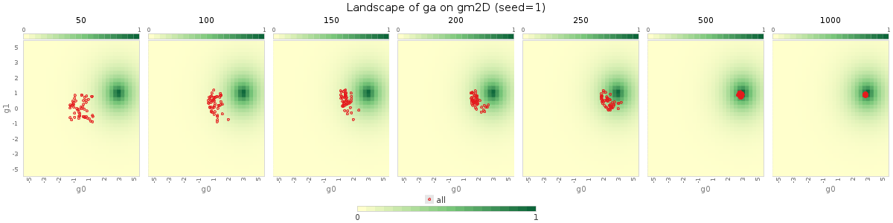
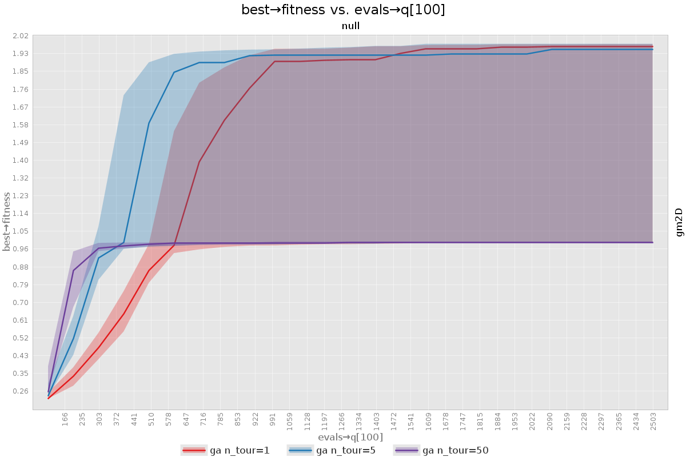
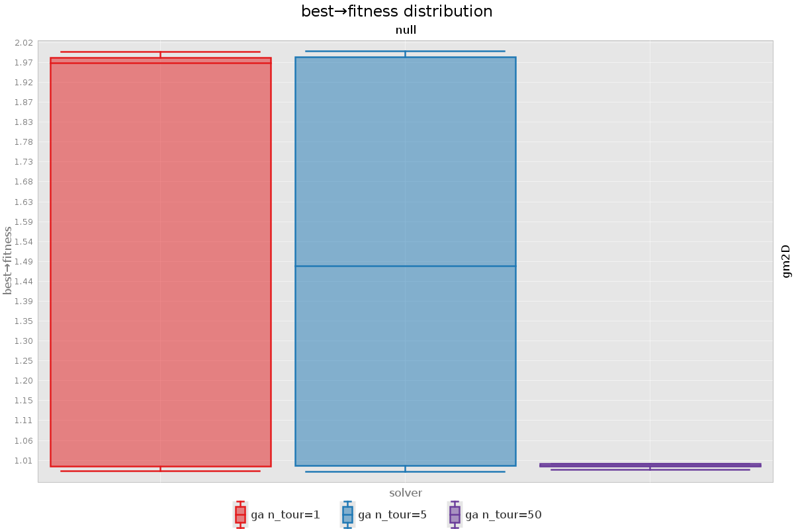
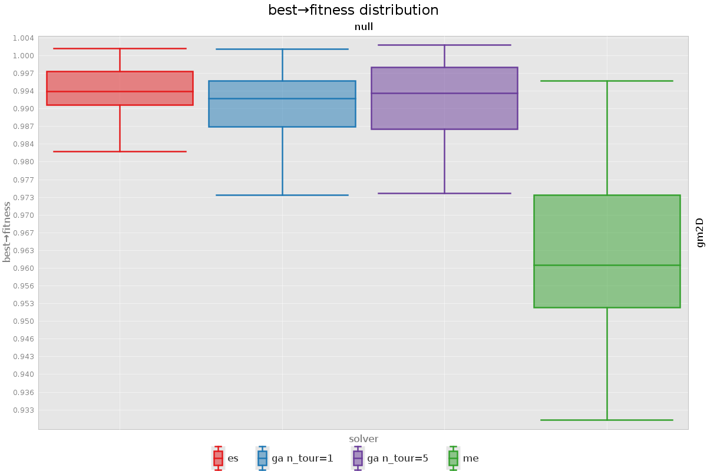
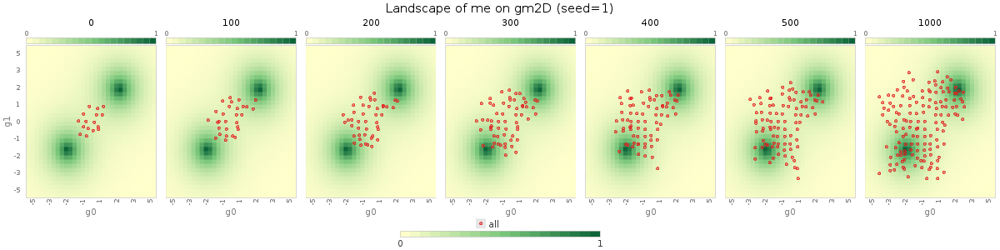
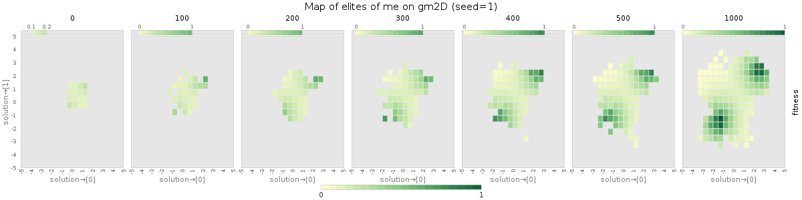

## What is evolutionary robotics?

.important[
.key[Evolutionary robotics] is the science of applying **evolutionary computation** for the _optimization_ of the body, the brain, or both of **robots**.
]

<!-- look for a better definition of evolutionary robotics -->

In this course:
- evolutionary computation
- examples of research on evolutionary robotics 

---

class: middle, center

# Evolutionary computation

---

## The problem

Given:
- a set $S$
- a **partial order** $\\prec$ over $S$
  - $s\_1 \\prec s\_2$ reads "$s\_1$ is better than $s\_2$"
  - formally $\\prec: S \\times S \\to \\{\\text{first}, \\text{second}, \\text{same}, \\text{not-comparable}\\}$
  
The pair $(S,\\prec)$ is an .key[global optimization problem]. .note[$\\prec$ alone is the problem, $S$ is implicit, since $\\prec$ implicitly defines $S$]
- $S$: .key[solution space] or .key[search space], *where to search for a solution?*
- $\\prec$: *what to search for?*

.vspace1[]

The goal is to find the set $S^\\star$ of **optimal solutions**:
$$S^\\star = \\{s \\in S: \\forall s' \\in S, s' \\not\\prec s\\}$$
- **global**, because we look for $S^\\star$ elements in the entire $S$
- not simply a $s^\\star=\\argmax_\{s \in S\}$, because $\\prec$ is just a partial order!

---

## Very broad

$S$ can be **any** set!
- discrete or continuous
- finite or infinite
- naturally ordered or not
- with or without a natural metric defined on it
- ...

.example[Examples]:
.cols[
.c30[
**Regression models** on $\\mathbb{R}^p$
- $S = \\mathcal{F}\_{\\mathbb{R}^p \\to \\mathbb{R}}$
- $s\_1 \\prec s\_2$ iff $s\_1$ better fits (e.g., with MSE) a given dataset $D=\\bag{(\\vect{x}^{(i)}, y^{(i)})}\_{i}$
.note[here, $\\prec$ is indeed a total order]
]
.c30[
**Sorting** of arrays
- $S = \\{\\text{sorting programs}\\}$
.note[in a given programming language, with the proper interface]
- $s\_1 \\prec s\_2$ iff  $s\_1$ "sorts better" than $s\_2$ some arrays $A \\subset \\mathbb{R}^*=\\bigcup_{i=1}^{i=\\infty} \\mathbb{R}^i$
]
.c30[
**Robot control policies**
- $S = \\{\\text{controllers}$ $\\text{for robot } R\\}$
- $s\_1 \\prec s\_2$ iff $R$ with $s\_1$ performs better than $R$ with $s\_2$ on task $T$
]
]

For all cases, many other problem instances with same $S$ and different $\\prec$!

---

## One single approach?

Is there a **single approach** for solving $(S, \\prec)$ that works **for any $S$ and any $\\prec$**?

.note[For a few "kinds" of $S$ (and $\\prec$) there are many effective/efficient ways for solving $(S, \\prec)$ problems, e.g., $S=\\mathbb{R}^p$]

--

.vspace1[]

One source of *inspiration*: **natural evolution**!

- $S = \\{\\text{natural things}\\}$ .note[things one can build with physical matter]
- $s\_1 \\prec s\_2$ iff $s\_1$ is more **able to be alive** than $s\_2$

**Natural evolution** is long (and ongoing) process, after which we have a pretty good set $S^\\star$ of things that are able to be alive!

---

## Evolutionary computation

.important[
.key[Evolutionary computation] (EC) is the science of designing, developing, and using algorithms inspired by natural evolution for solving optimization problems.
]

.vspace1[]

.key[Evolutionary algorithms] (EAs) differ in:
- **effectiveness**: how well they solve optimization problems
- **efficiency**: how many/much resources they take to solve problems
- **applicability**: how many constraints they impose on $S$ and $\\prec$, how many other components they require the users to set

.vspace1[]

.cols[
.c50[
Close relatives:
- global optimization (GO)
- bio-inspired optimization (BIO)
- population-based optimization (PO)
]
.c50[
... and relationships:
- GO $\\supset$ BIO $\\supseteq$ PO $\\supset$ EC
.note[but boundaries are not sharp!]
]
]

---

## Brief history and origin

.cols[
.c40[
A long history:
- **1930s**: first ideas
- **1960s**: first actual development of ideas on computers
- **1980s**: exploration
- **1990s**: exploitation .note[a sort of self joke...]
- **2000s**: **mature** expansion
]
.c60[
EC comes from (mostly) three communities:
- biologists: simulate/understand real evolution
- computer scientists/engineers: solve optimization problems
- artificial life researchers: evolve artificial life

Consequence:
- duplicated efforts
- **different terminologies**
]
]

.cols[
.c20[
.h20ex.center[]
]
.c80[
.ref[Kenneth A.. De Jong. Evolutionary computation: a unified approach. MIT Press, 2006.]
]
]

---

## EC research venues

Main conferences:
- [EvoStar](https://species-society.org/evostar-2024/), since 1998, Core **B**
  - in 2025 **held in Trieste**!
- [The Genetic and Evolutionary Computation Conference](https://gecco-2024.sigevo.org/HomePage) (GECCO), since 1999, Core **A** 
- [Parallel Problem Solving from Nature](https://ppsn2024.fh-ooe.at/) (PPSN), since 1989, Core **A**
- [IEEE Congress on Evolutionary Computation](https://2024.ieeewcci.org/) (CEC), since 1994, now part of IEEE World Congress on Computational Intelligence, Core **B**
- [Foundations of Genetic Algorithm](https://hpi.de/foga2023/) (FOGA), since 1990, held evry two years, Core **A**

Main journals:
- [Genetic Programming and Evolvable Machines](https://link.springer.com/journal/10710), Springer, SJR **Q2**
- [IEEE Transactions on Evolutionary Computation](https://ieeexplore.ieee.org/xpl/RecentIssue.jsp?punumber=4235), IEEE, SJR **Q1**
- [ACM Transactions on Evolutionary Learning and Optimization](https://dl.acm.org/journal/telo), ACM
- [MIT Evolutionary Computation](https://www.mitpressjournals.org/loi/evco), MIT Press, SJR **Q1**
- [Swarm and Evolutionary Computation](https://www.journals.elsevier.com/swarm-and-evolutionary-computation), Elsevier, SJR **Q1**

.note[[Core](http://portal.core.edu.au/conf-ranks/) and [SJR](https://www.scimagojr.com/) are two ranking tools for conferences and journals]

---

## Evolution: general scheme

What happens in reality:
- a **population of individuals** compete for limited resources
- individuals **die and are born** (the population is dynamic)
- fittest individuals **reproduce** and survive **more**
- offspring **inherit some characters** from parents (they are similar, but not identical)

.vspace1[]

Can we run this scheme on a computer?

---

## A first EA

.cols[
.c50.compact[
Ingredients (i.e., parameters):
1. a probability distribution .col2[$B$] over $S$ .note[$B$ for builder]
  - $B \\in \\mathcal{P}\_S$, i.e., $B: S \to [0,1]$, with $\\sum\_{s \\in S} B(s) = 1$
  - $s \\setsample B$ denotes sampling from $B$, briefly $\\sim B$
2. a stochastic (unary) operator .col2[$o\\subtext{mut}$] on $S$ (**mutation**)
  - $o\\subtext{mut}: S \\to \\mathcal{P}\_S$, $s' \\setsample o\\subtext{mut}(s)$
3. a stochastic binary operator .col2[$o\\subtext{xover}$] on $S$ (**crossover**)
  - $o\\subtext{xover}: S \\times S \\to \\mathcal{P}\_S$, $s' \\setsample o\\subtext{mut}(s\_1,s\_2)$
4. a population size $\\c{2}{n\\subtext{pop}} \\in \\mathbb{N}$
5. a number of iterations $\\c{2}{n\\subtext{gen}} \\in \\mathbb{N}$
6. a reproduction **selection criterion** .col2[$c\\subtext{repr}$]
  - given a bag $A$ and a partial order $\\prec$ on $A$, $c\\subtext{repr}(A,\\prec) \\in \\mathcal{P}\_A$
7. a $\\neg$survival **selection criterion** .col2[$c\\subtext{die}$]

1, 2, 3 depend on $S$; 6, 7 may depend on $S$; 4, 5 are $S$ agnostic
]
.c50[
.pseudo-code.compact[
function $\\text{solve}(\\c{1}{\\prec}; \\c{2}{B, o\\subtext{mut}, o\\subtext{xover}, n\\subtext{pop}, n\\subtext{gen}, c\\subtext{repr}, c\\subtext{die}})$ {  
.i[]$S\\subtext{pop} \\seteq \\bag{}$ .comment[// $S'$ is a bag of .key[candidate solutions]]   
.i[]while $|S\\subtext{pop}| < n\\subtext{pop}$ { .comment[// population initialization]  
.i[].i[]$S\\subtext{pop} \\seteq S\\subtext{pop} \\oplus \\bag{\\sim B}$  
.i[]}  
.i[]$n \\seteq 0$  
.i[]while $n < n\\subtext{gen}$ { .comment[// iterations (aka .key[generations])]  
.i[].i[]$n \\seteq n+1$  
.i[].i[]$S\\subtext{offspring} \\seteq \\bag{}$ .comment[// bag of "children" (aka .key[offspring])]  
.i[].i[]while $|S\\subtext{offspring}| < n\\subtext{pop}$ { .comment[// reproduction]  
.i[].i[].i[]$s\_1 \\setsample c\\subtext{repr}(S\\subtext{pop},\\prec)$ .comment[// first .key[parent]]  
.i[].i[].i[]$s\_2 \\setsample c\\subtext{repr}(S\\subtext{pop}, \\prec)$ .comment[// second .key[parent]]  
.i[].i[].i[]$s' \\setsample o\\subtext{mut}(\\sim o\\subtext{xover}(s\_1, s\_2))$ .comment[// .key[variation]]  
.i[].i[].i[]$S\\subtext{offspring} \\seteq S\\subtext{offspring} \\oplus \\bag{s'}$  
.i[].i[]}  
.i[].i[]$S\\subtext{pop} \\seteq S\\subtext{pop} \\oplus S\\subtext{offspring}$  
.i[].i[]while $|S\\subtext{pop}| > n\\subtext{pop}$ { .comment[// trim]  
.i[].i[].i[]$S\\subtext{pop} \\seteq S\\subtext{pop} \\ominus \\bag{\\sim c\\subtext{die}(S\\subtext{pop},\\prec)}$  
.i[].i[]}  
.i[]}  
.i[]return .col3[$S\\subtext{pop}$]  
}
]
.compact[
.col1[Input: $\\prec$] .note[and, implicitly, $S$] .hspace5[] .col3[Output: $S\\subtext{pop}$]  
.col2[Params: $B, o\\subtext{mut}, o\\subtext{xover}, n\\subtext{pop}, n\\subtext{gen}, c\\subtext{repr}, c\\subtext{die}$]
]
]
]

---

### Link with general scheme

.cols[
.c50[
- a population of individuals .col1[compete for limited resources]
  - resource: the right to stay in the population
- individuals die and are born (the population is dynamic)
  - in a synchronized way, .col2[time flows **through generations**]
  - "life" is istantaneous
- fittest individuals .col3[reproduce] and .col1[survive more]
  - actually depends on $c\\subtext{repr}$ and $c\\subtext{die}$
- offspring .col4[inherit some characters from parents] (they are similar, but not identical)
  - actually depends on $o\\subtext{mut}$ and $o\\subtext{xover}$
  
**Effectiveness**? Efficiency? **Applicability**?
- depend on the parameters

]
.c50[
.pseudo-code.compact[
function $\\text{solve}(\\prec; B, o\\subtext{mut}, o\\subtext{xover}, n\\subtext{pop}, n\\subtext{gen}, c\\subtext{repr}, c\\subtext{die})$ {  
.i[]$S\\subtext{pop} \\seteq \\bag{}$  
.i[]while $|S\\subtext{pop}| < n\\subtext{pop}$ {  
.i[].i[]$S\\subtext{pop} \\seteq S\\subtext{pop} \\oplus \\bag{\\sim B}$  
.i[]}  
.i[]$n \\seteq 0$  
.i[]while $n < n\\subtext{gen}$ {  
.i[].i[].col2[$n \\seteq n+1$]  
.i[].i[]$S\\subtext{offspring} \\seteq \\bag{}$  
.i[].i[]while $|S\\subtext{offspring}| < n\\subtext{pop}$ {  
.i[].i[].i[].col3[$s\_1 \\setsample c\\subtext{repr}(S\\subtext{pop},\\prec)$]  
.i[].i[].i[].col3[$s\_2 \\setsample c\\subtext{repr}(S\\subtext{pop}, \\prec)$]  
.i[].i[].i[]$\\c{3}{s' \\setsample} \\c{4}{o\\subtext{mut}(\\sim o\\subtext{xover}(s\_1, s\_2))}$  
.i[].i[].i[]$S\\subtext{offspring} \\seteq S\\subtext{offspring} \\c{3}{\\oplus \\bag{s'}}$  
.i[].i[]}  
.i[].i[]$S\\subtext{pop} \\seteq S\\subtext{pop} \\oplus S\\subtext{offspring}$  
.i[].i[]while $|S\\subtext{pop}| > n\\subtext{pop}$ {  
.i[].i[].i[]$S\\subtext{pop} \\seteq S\\subtext{pop} \\c{1}{\\ominus \\bag{\\sim c\\subtext{die}(S\\subtext{pop},\\prec)}}$  
.i[].i[]}  
.i[]}  
.i[]return $S\\subtext{pop}$  
}
]
]
]

---

## Selection (role of)

Given a bag $S'=\\bag{s\_1,s\_2,\\dots}=\\bag{s\_i}\_i \\subseteq S$ and a partial order $\\prec$ over $S$:

.cols[
.c50[
**Uniform selection**
.pseudo-code.compact[
function $\\text{uniform}(S',\\prec)$ {  
.i[]return $\\sim U(S')$ .comment[// uniform sampling]  
}
]
]
.c50[
**"Best" selection** .note[quotes because of partial order]
.pseudo-code.compact[
function $\\text{best}(S',\\prec)$ {  
.i[]$S'' \\seteq \\{s \\in S' : \\forall s' \\in S', s' \\not\\prec s\\}$ .comment[// non-dominated items]  
.i[]return $\\sim U(S'')$  
}
]
]
]

.center[**Effectiveness**: is it "fittest individuals reproduce and survive more"?]

.cols.compact[
.c50[
- .bad[] no (**too weak**) preference for fitter individuals
  - $\\prec$ is not actually used!
]
.c50[
- .soandso[] strong preference for fittest individuals
  - maybe **too strong**: what if $|S''|=1$?
]
]

.center[**Applicability**: what constraints on $S$ and $\\prec$? what params?]
.cols.compact[
.c50[
- .good[] no constraints  
- .good[] no params
]
.c50[
- .good[] no constraints  
- .good[] no params
]
]

.center[**Efficiency**: how many resources?]
.cols.compact[
.c50[
- .good[] no computation
]
.c50[
- .soandso[] some computation .note[$\\mathcal{O}(n^2)$ uses of $\\prec$, with $n=|S'|$]
]
]

---

### Tournament selection

.cols[
.c50[
.pseudo-code.compact[
function $\\text{tour}(S',\\prec;n\\subtext{tour})$ {  
.i[].col1[$S'' \\seteq \\bag{}$]  
.i[].col1[while $|S''| < n\\subtext{tour}$ {]  
.i[].i[].col1[$S'' \\seteq S'' \\oplus \\bag{\\sim U(S')}$]  
.i[].col1[}]  
.i[].col2[$S''' \\seteq \\\\{s \\in S'' : \\forall s' \\in S'', s' \\not\\prec s\\\\}$]  
.i[].col2[return $\\sim U(S''')$]  
}
]
]
.c50[
1. .col1[select $n\\subtext{tour}$ items from $S'$ randomly]
2. .col2[take one "best" item from the $n\\subtext{tour}$ items] 
]
]

**Effectiveness**: depends on $n\\subtext{tour}$!
- $n\\subtext{tour}=1$ is like uniform selection $\\Rightarrow$ too weak
- $n\\subtext{tour}=|S'|$ .note[may be larger, indeed] is like best selection $\\Rightarrow$ too strong
- something in between, hopefully good 👍 .note[moooore on this later...]
  - reasonable values in practice $n\\subtext{tour} = 0.05 |S'| = 0.05 n\\subtext{pop}$

**Efficiency**: depends on $n\\subtext{tour}$
- the lower, the more efficient 👍

**Applicability**: 👍
- no constraints on $S,\\prec$
- just one parameter, with a good "default value"

---

## Problems with fitness

In the vast majority of cases, you don't compare directly the solutions, but instead you:
- have a way to **measure the quality** of any solution
- **compare the quality measure**

A .note[global optimization] problem is hence given by:
- a set $S$
- a .key[fitness function] (or quality function) $f: S \\to \\mathbb{R}$ .note[like the loss function]
- an order in $\\mathbb{R}$
  - usually a total order, namely either $<$ (**minimization** problem) or $>$ (**maximization** problem)

.vspace1[]

.example[Example]: **regression models** on $D=\\bag{(\\vect{x}^{(i)}, y^{(i)})}\_{i}$, with $\\vect{x}^{(i)} \\in \\mathbb{R}^p$
- $S = \\mathcal{F}\_{\\mathbb{R}^p \\to \\mathbb{R}}$
- $f(s)=\\text{MSE}(s;D)=\\frac{1}{|D|} \\sum\_i (s(\\vect{x}^{(i)})-y^{(i)})^2$ 
- $<$

In natural language: "find the function with the lowest MSE on $D$"

---

### Fitness proportional selection

.cols[
.c50[
.pseudo-code.compact[
function $\\text{fitProp}(S',f;\\gamma)$ {  
.i[]$W \\seteq \\bag{}$  
.i[]while $s \\in S'$ {  
.i[].i[]$W \\seteq W \\oplus \\bag{(s,f(s)^{\\c{2}{\\gamma}})}$  
.i[]}  
.i[]return $\\c{1}{\\text{roulette}}(W)$  
}
]
**Assume** maximization and $f(\\cdot) \ge 0$!

**Effectiveness**:
- .good[] tunable preference .note[negative $\\gamma$ for minimization]
  - .col2[$\\gamma=0$] like uniform $\\Rightarrow$ no preference
  - .col2[$\\gamma \\rightarrow +\\infty$] like best $\\Rightarrow$ max preference
  - .col2[$\\gamma=1$] "reasonable" preference
- .bad[] preference **depends on scale of $f$** and $\\gamma$!

**Applicability**:  
- .soandso[] need to consider scale of $f$ to set $\\gamma$

**Efficiency**:  
- .good[] (after $|S'|$ fitness computation)

]
.c50[
.pseudo-code.compact[
.col1[function $\\text{roulette}(\\bag{(a^{(i)},x^{(i)})}\_{i})$] {    
.i[]$x \\setsample U([0,\\sum\_i x^{(i)}])$  
.i[]for $(a^{(i)},x^{(i)}) \\in \\bag{(a^{(i)},x^{(i)})}\\sub{i}$ {  
.i[].i[]if $x \\le x^{(i)}$ {  
.i[].i[].i[]return $a^{(i)}$  
.i[].i[]}  
.i[]}  
}
]
**Assume** maximization and $x^{(i)}\ge 0$!

The probability of an $a^{(i)}$ item to be selected is proportional to its $x^{(i)}$.

.example[Example]: in $\\bag{(a,1),(b,10),(a,4)}$
- $b$ has a probability of $\\frac{2}{3}$
- $a$ has a probability of $\\frac{1}{3}=\\frac{1}{15}+\\frac{4}{15}$
]
]

---

### Ranking proportional selection

.cols[
.c50[
.pseudo-code.compact[
function $\\text{rankProp}(S',f;\\gamma)$ {  
.i[]$W \\seteq \\bag{}$  
.i[]while $s \\in S'$ {  
.i[].i[]$W \\seteq W \\oplus \\bag{(s,(|S'|+1-\\c{1}{\\text{rank}(s,S',f)})^\\gamma)}$  
.i[]}  
.i[]return $\\text{roulette}(W)$  
}
]
]
.c50[
Like fitness proportional, but proportional to the rank instead of to the fitness
- .col1[$\\text{rank}(s,S',f)$] returns the rank of $s \\in S'$ when $S'$ elements are sorted according to their $f(s)$
- can be easily tailored for maximization
]
]

**Effectiveness**:
- .good[] tunable preference
- .good[] no dependency on scale of $f$!
  - but still dependency on $|S'|$

**Applicability**:
- .good[] $\\gamma$ more freely settable

**Efficiency**:
- .good[] like $\\text{fitProp}$ with some sorting

---

## Effects of preference

.cols[
.c70[
Very simple problem:
- $S=\\mathbb{R}$
- $f: \\mathbb{R} \\to \\mathbb{R}$, $f(x)=e^{-(x-1)^2}+2 e^{-(x-4)^2}$
  - $S^\\star = \\{4\\}$
  - a .key[local optimum] .note[here, maximum] in $1$
- $>$ (i.e., maximization)

Let $S'=[0.5,1,1.5,2,3]$
- what if best/best as $c\\subtext{repr}$/$c\\subtext{die}$?
- what if uniform/uniform as $c\\subtext{repr}$/$c\\subtext{die}$?

]
.c30[
.w100p.center[]
]
]

.vspace1[]

--

- Too strong preference $\\Rightarrow$ higher risk of **convergence to local optima**
- Too weak preference $\\Rightarrow$ higher risk of **converging too slowly**

.note[preference for good individuals = selective pressure = evolutionary pressure]

.question[Question]: role of $B$, $o\\subtext{mut}$, $o\\subtext{xover}$?

---

## Exploration/exploitation trade-off

.cols[
.c70[
Let $S'=[0.5,1,1.5,2,3]$:

Point of view of $S'$:
*"Hey $1$, you're doing great! Let's follow our leader $1$!"*
- .key[exploitation] of current knowledge about what are better solutions

Alternative point of view of $S'$:
*"What's outside? What's beyond $0.5$ and $3$? Let's find out!"*
- .key[exploration] of the search space regions not yet visited

In selection criteria:
- $n\\subtext{tour}$ in tournament selection: ▼ exploration, ▲ exploitation
- $|\\gamma|$ in fitness/ranking prop. selection: ▼ exploration, ▲ exploitation

Impacted by any other EA parameters!

In general, hard to balance: .key[exploration/exploitation trade-off]
- as in many forms of optimization
- e.g., learning rate in deep learning

]
.c30[
.w100p.center[]
]
]

---

## Multi-objective problems

A .key[multi-objective] .note[global optimization] problem is given by:
- a set $S$
- a multi-objective fitness function $f: S \\to \\mathbb{R}^k$
- $k$ orders in $\\mathbb{R}$ .note[usually they are all the same]

Common terminology: $k \\in [2, \\approx 4]$ multi-objective, $k \\ge \\approx 5$ many-objetive.

.vspace1[]

.example[Example]:
- $S=\\{\\text{wing geometry for an airplane}\\}$ .note[$S$ may be $\\mathbb{R}^p$ and each $s$ a tuple of design parameters]
- $f: S \\to \\mathbb{R}^2$, $f(s)= (f\_1(s), f\_2(s))$, each $f\_i$ is an .key[objective]
  - $f\_1(s)$ measures the fuel consumption in simulated flight
  - $f\_2(s)$ measures the maximum speed in simulated flight
- $(<,>)$

---

### Selection in multi-objective problems

**No natural order** on $\\mathbb{R}^k$!
- not total: fitness/ranking proportional selection cannot be applied $\\Rightarrow$ **applicability** 👎
- not partial: tournament selection cannot be applied $\\Rightarrow$ **applicability** 👎

.vspace1[]

Allowing for **total order** (given $f(s)= (f\_1(s), \\dots, f\_k(s))$, with each $f\_j: S \\to \\mathbb{R}$):

.key[Linearization] .note[assume $(<,\\dots,<)$]
- $\\hat{f}(s)=\\sum_j \\alpha\_j f\_j(s)$, then $<$
- need to associate weights $\\alpha\_j$ to objectives $\\Rightarrow$ **applicability** 🫳
  - taking into account objective scales (e.g., fuel consumption vs. speed?)
  
.key[Lexicographic order] .note[assume $(<,\\dots,<)$]
- $s_1 < s\_2$ if $f\\sub{j\_1}(s\_1)< f\\sub{j\_1}(s\_2)$ or $f\\sub{j\_1}(s\_1)=f\\sub{j\_1}(s\_2) \\land f\\sub{j\_2}(s\_1)< f\\sub{j\_2}(s\_2)$ or ...
  - compare $j\_1$-th objective, if tie, then $j\_2$-th, if tie, then $j\_3$-th...
- need to establish a ranking of objectives $\\Rightarrow$ **applicability** 🫳 .note[but easier than linearization]
- not working well with very continuous objectives

In both cases: multi-objective to single-objective

---

## Pareto dominance

Allowing for **partial order** (given $\\vect{x}\_1,\\vect{x}\_2 \\in \\mathbb{R}^k$): .note[assume $(<,\\dots,<)$]

.key[Pareto dominance]:
$$\\prec(\\vect{x}\_1,\\vect{x}\_2) =
\\begin{cases}
\\text{first} & \\text{if } \\forall j: x\_{1,j} \\le x\_{2,j} \\land \\exists j': x\_{1,j'} < x\_{2,j'} \\\\
\\text{second} & \\text{if } \\forall j: x\_{1,j} \\ge x\_{2,j} \\land \\exists j': x\_{1,j'} > x\_{2,j'} \\\\
\\text{same} & \\text{if } \\forall j: x\_{1,j} = x\_{2,j} \\\\
\\text{not-comparable} & \\text{otherwise}
\\end{cases}
$$

That is:
- $s\_1$ is better than $s\_2$ if it is **strictly better** in one objective and **not worse** in all the others

---

## Role of the population size $n\\subtext{pop}$

.cols[
.c50.compact[
**Effectiveness**:
- $n\\subtext{pop}=1$ .note[see later, random walk]
  - not really population-based optimization
  - poor exploration only through one solution
  - one child compared against the only parent, keep if better $\\Rightarrow$ **exploitation**
- large $ n\\subtext{pop}$
  - generate many new solutions before comparing them
  - many solutions kept in $S$ $\\Rightarrow$ **exploration**

**Applicability**:  
- no dependency on $S,\\prec$ $\\Rightarrow$ no impact

**Efficiency**?

]
.c50[
.pseudo-code.compact[
function $\\text{solve}(\\prec; B, o\\subtext{mut}, o\\subtext{xover}, \\c{1}{n\\subtext{pop}}, n\\subtext{gen}, c\\subtext{repr}, c\\subtext{die})$ {  
.i[]$S\\subtext{pop} \\seteq \\bag{}$  
.i[]while $|S\\subtext{pop}| < \\c{1}{n\\subtext{pop}}$ {  
.i[].i[]$S\\subtext{pop} \\seteq S\\subtext{pop} \\oplus \\bag{\\sim B}$  
.i[]}  
.i[]$n \\seteq 0$  
.i[]while $n < n\\subtext{gen}$ {  
.i[].i[]$n \\seteq n+1$  
.i[].i[]$S\\subtext{offspring} \\seteq \\bag{}$  
.i[].i[]while $|S\\subtext{offspring}| < \\c{1}{n\\subtext{pop}}$ {  
.i[].i[].i[]$s\_1 \\setsample c\\subtext{repr}(S\\subtext{pop},\\prec)$  
.i[].i[].i[]$s\_2 \\setsample c\\subtext{repr}(S\\subtext{pop}, \\prec)$  
.i[].i[].i[]$s' \\setsample o\\subtext{mut}(\\sim o\\subtext{xover}(s\_1, s\_2))$  
.i[].i[].i[]$S\\subtext{offspring} \\seteq S\\subtext{offspring} \\oplus \\bag{s'}$  
.i[].i[]}  
.i[].i[]$S\\subtext{pop} \\seteq S\\subtext{pop} \\oplus S\\subtext{offspring}$  
.i[].i[]while $|S\\subtext{pop}| > \\c{1}{n\\subtext{pop}}$ {  
.i[].i[].i[]$S\\subtext{pop} \\seteq S\\subtext{pop} \\ominus \\bag{\\sim c\\subtext{die}(S\\subtext{pop},\\prec)}$  
.i[].i[]}  
.i[]}  
.i[]return $S\\subtext{pop}$  
}
]
]
]

---

### Decoupling $n\\subtext{pop}$ and $n\\subtext{gen}$

.cols[
.c50[  
Assume fitness-based problem with $f$, assume "worst" selection as $c\\subtext{die}$:
- .col1[$n\\subtext{pop}$ applications of $f$] (i.e., **fitness evaluations**) at each generation .note[often the heaviest operation] .note[more in general, $n\\subtext{pop}$ comparisons with $\\prec$]
- stop iterations after .col2[$n\\subtext{evals}$] fitness evaluations

Then:
- $n\\subtext{pop}$ has not impact on efficiency
- $n\\subtext{evals}$ impacts on **effectiveness/efficiency trade-off**
  - the larger, the more effective
  - the lower, the more efficient
- (bonus!) allows for fair comparison between EAs with different values of $n\\subtext{pop}$ .note[more in general, different EAs with the same $n\\subtext{evals}$]
]
.c50[
.pseudo-code.compact[
function $\\text{solve}(\\prec; B, o\\subtext{mut}, o\\subtext{xover}, n\\subtext{pop}, \\c{2}{n\\subtext{evals}}, c\\subtext{repr}, c\\subtext{die})$ {  
.i[]$S\\subtext{pop} \\seteq \\bag{}$  
.i[]while $|S\\subtext{pop}| < n\\subtext{pop}$ {  
.i[].i[]$S\\subtext{pop} \\seteq S\\subtext{pop} \\oplus \\bag{\\sim B}$  
.i[]}  
.i[]$n \\seteq 0$  
.i[]while $n < \\c{2}{n\\subtext{evals}}$ {  
.i[].i[]$n \\seteq n+\\c{1}{n\\subtext{pop}}$  
.i[].i[]$S\\subtext{offspring} \\seteq \\bag{}$  
.i[].i[]while $|S\\subtext{offspring}| < n\\subtext{pop}$ {  
.i[].i[].i[]$s\_1 \\setsample c\\subtext{repr}(S\\subtext{pop},\\prec)$  
.i[].i[].i[]$s\_2 \\setsample c\\subtext{repr}(S\\subtext{pop}, \\prec)$  
.i[].i[].i[]$s' \\setsample o\\subtext{mut}(\\sim o\\subtext{xover}(s\_1, s\_2))$  
.i[].i[].i[]$S\\subtext{offspring} \\seteq S\\subtext{offspring} \\oplus \\bag{s'}$  
.i[].i[]}  
.i[].i[]$S\\subtext{pop} \\seteq S\\subtext{pop} \\oplus S\\subtext{offspring}$  
.i[].i[]while $|S\\subtext{pop}| > n\\subtext{pop}$ {  
.i[].i[].i[]$S\\subtext{pop} \\seteq S\\subtext{pop} \\ominus \\bag{\\sim c\\subtext{die}(S\\subtext{pop},\\prec)}$  
.i[].i[]}  
.i[]}  
.i[]return $S\\subtext{pop}$  
}
]
]
]

---

## $S$-dependent parameters

.cols[
.c60.compact[
.cols[
.c50[
For initialization:
- $\\c{1}{B} \\in \\mathcal{P}_S$
]
.c50[
For variation:
- $\\c{2}{o\\subtext{mut}}: S \\to \\mathcal{P}_S$
- $\\c{2}{o\\subtext{xover}}: S \\times S \\to \\mathcal{P}_S$
]
]

What does it mean "depend on $S$"?
- "regression problem on $\\mathbb{R}^{p\_1}$" $\\Rightarrow$ $B$, $o\\subtext{mut}$, $o\\subtext{xover}$ for regression models in $\\mathbb{R}^{p\_1}$
- "regression problem on $\\mathbb{R}^{p\_2}$" $\\Rightarrow$ another $B$, $o\\subtext{mut}$, $o\\subtext{xover}$
- "sorting program in Java" $\\Rightarrow$ $B$, $o\\subtext{mut}$, $o\\subtext{xover}$ for sorting programs in Java
- "sorting program in Python" $\\Rightarrow$ another $B$, $o\\subtext{mut}$, $o\\subtext{xover}$
- "robots with 6 wheels on task $T$ $\\Rightarrow$ $B$, $o\\subtext{mut}$, $o\\subtext{xover}$ for 6-wheels robot
- "robots with 8 wheels on task $T$ $\\Rightarrow$  another $B$, $o\\subtext{mut}$, $o\\subtext{xover}$
- ...

.vspace1[]

Reinvent the wheel every time! 👎👎👎
- **does not scale well** (in human terms)
]
.c40[
.pseudo-code.compact[
function $\\text{solve}(\\prec; \\c{1}{B}, \\c{2}{o\\subtext{mut}}, \\c{2}{o\\subtext{xover}}, n\\subtext{pop}, n\\subtext{evals}, c\\subtext{repr}, c\\subtext{die})$ {  
.i[]$S\\subtext{pop} \\seteq \\bag{}$  
.i[]while $|S\\subtext{pop}| < n\\subtext{pop}$ {  
.i[].i[]$S\\subtext{pop} \\seteq S\\subtext{pop} \\oplus \\bag{\\sim \\c{1}{B}}$  
.i[]}  
.i[]$n \\seteq 0$  
.i[]while $n < n\\subtext{evals}$ {  
.i[].i[]$n \\seteq n+n\\subtext{pop}$  
.i[].i[]$S\\subtext{offspring} \\seteq \\bag{}$  
.i[].i[]while $|S\\subtext{offspring}| < n\\subtext{pop}$ {  
.i[].i[].i[]$s\_1 \\setsample c\\subtext{repr}(S\\subtext{pop},\\prec)$  
.i[].i[].i[]$s\_2 \\setsample c\\subtext{repr}(S\\subtext{pop}, \\prec)$  
.i[].i[].i[]$s' \\setsample \\c{2}{o\\subtext{mut}}(\\sim \\c{2}{o\\subtext{xover}}(s\_1, s\_2))$  
.i[].i[].i[]$S\\subtext{offspring} \\seteq S\\subtext{offspring} \\oplus \\bag{s'}$  
.i[].i[]}  
.i[].i[]$S\\subtext{pop} \\seteq S\\subtext{pop} \\oplus S\\subtext{offspring}$  
.i[].i[]while $|S\\subtext{pop}| > n\\subtext{pop}$ {  
.i[].i[].i[]$S\\subtext{pop} \\seteq S\\subtext{pop} \\ominus \\bag{\\sim c\\subtext{die}(S\\subtext{pop},\\prec)}$  
.i[].i[]}  
.i[]}  
.i[]return $S\\subtext{pop}$  
}
]
]
]

---

### Wish list for $B$, $o\\subtext{mut}$, $o\\subtext{xover}$

**Variation**, i.e., $o\\subtext{mut}$, $o\\subtext{xover}$:

With respect to the natural counterpart:
- "offspring inherit some characters from parents (they are similar, but not identical" (aka **variational inheritance principle**)

With respect to the **exploration/exploitation trade-off**:
- if $o\\subtext{mut}(s)$ is too similar to $s$ $\\rightarrow$ exploitation
  - "$s$ is doing great, let's just build an almost perfect copy of it"
- if $o\\subtext{mut}(s)$ is too dissimilar to $s$ $\\rightarrow$ exploration
  - "don't care about $s$, let's drastically change it"
  
.vspace1[]

**Initialization**, i.e., $B$:

The population at the first iteration, generated from $B$, acts like a starting point of the search
- ideally, $B$ should sample *uniformly* $S$

In general, meeting these requirements makes it **harder to design** of $B$, $o\\subtext{mut}$, $o\\subtext{xover}$ for a given $S$

---

## Genotype and phenotype

Consider:
- a .key[genotype space] $G$
- a .key[phenotype space] $P$
- a **genotype-phenotype mapping function** (aka encoding) $\\phi: G \\to P$

and set $S = G \\times P$. .note[a solution is a pair genotype, phenotype]

.vspace1[]

Slightly different point of view, consider: .note[formally more confortable]
- a .key[genotype space] $G$
- a **genotype-solution mapping function** $\\phi: G \\to S$ .note[a phenotype is a solution]

Important!
- you do not need to tailor $B$, $o\\subtext{mut}$, $o\\subtext{xover}$ to every $S$!
  - they operate on $G$, not on $S$
- you *just* tailor $\\phi$ and choose some predifined $G$ and the corresponding $B$, $o\\subtext{mut}$, $o\\subtext{xover}$

$\\phi$ defines the .key[solution representation]

---

## EA with the representation

.cols[
.c40[
The EA evolves a population of individuals, rather than just solutions
- $I\\subtext{pop} \\subseteq G \\times S$
- individuals are selected by $c\\subtext{repr}$ and $c\\subtext{die}$ using their second element, i.e., the solution:
  - .col2[$\\text{second}\\ \\circ \\prec$] means first take the second element of the pair, then apply the partial order $\\prec$
- .col3[only solutions are returned]

.vspace1[]

**Important**: no one of the params depends on $S$!
- "solve this problem ($\\prec$) using this representation ($\\phi$)"
- clearly wide applicability 👍👍👍
  
]
.c60[
.pseudo-code.compact[
function $\\text{solve}(\\c{1}{\\phi}, \\prec; B, o\\subtext{mut}, o\\subtext{xover}, n\\subtext{pop}, n\\subtext{evals}, c\\subtext{repr}, c\\subtext{die})$ {  
.i[]$I\\subtext{pop} \\seteq \\bag{}$  
.i[]while $|I\\subtext{pop}| < n\\subtext{pop}$ {  
.i[].i[]$g \\setsample B$  
.i[].i[]$I\\subtext{pop} \\seteq I\\subtext{pop} \\oplus \\bag{(g,\\c{1}{\\phi}(g))}$  
.i[]}  
.i[]$n \\seteq 0$  
.i[]while $n < n\\subtext{evals}$ {  
.i[].i[]$n \\seteq n+n\\subtext{pop}$  
.i[].i[]$I\\subtext{offspring} \\seteq \\bag{}$  
.i[].i[]while $|I\\subtext{offspring}| < n\\subtext{pop}$ {  
.i[].i[].i[]$g\_1 \\seteq\\text{first}(\\sim c\\subtext{repr}(I\\subtext{pop},\\c{2}{\\text{second}\\ \\circ \\prec}))$  
.i[].i[].i[]$g\_2 \\seteq\\text{first}(\\sim c\\subtext{repr}(I\\subtext{pop},\\c{2}{\\text{second}\\ \\circ \\prec}))$  
.i[].i[].i[]$g' \\setsample o\\subtext{mut}(\\sim o\\subtext{xover}(g\_1, g\_2))$  
.i[].i[].i[]$I\\subtext{offspring} \\seteq I\\subtext{offspring} \\oplus \\bag{(g',\\c{1}{\\phi}(g))}$  
.i[].i[]}  
.i[].i[]$I\\subtext{pop} \\seteq I\\subtext{pop} \\oplus I\\subtext{offspring}$  
.i[].i[]while $|I\\subtext{pop}| > n\\subtext{pop}$ {  
.i[].i[].i[]$I\\subtext{pop} \\seteq I\\subtext{pop} \\ominus \\bag{\\sim c\\subtext{die}(S\\subtext{pop}, \\c{2}{\\text{second}\\ \\circ \\prec})}$  
.i[].i[]}  
.i[]}  
.i[]return .col3[$\\text{second}(I\\subtext{pop})$]  
}
]
]
]

---

## "Popular" genotype spaces

- numerical space: $G = \\mathbb{R}^p$ .hspace2[] $\\to$ .key[continuous optimization]
- strings of symbols: .hspace2[] $\\to$ **discrete optimization**
  - fixed-length: $G = A^p$, with $A$ small and discrete
  - variable-length: $G = A^*$, with $A$ small and discrete .note[less common]
  - particular case (**bit strings**): $G=\\{\\texttt{0},\\texttt{1}\\}^p$ or $G=\\{\\texttt{0},\\texttt{1}\\}^*$
- trees: $G = T\_{N,L}$ where $N$ are non-terminal node labels, $L$ are terminal node labels
  - for symbolic regression for $\\mathbb{R}^p$: $G = T\_{O,V\\cup C}$ with
      - operators¹ $O=\\{+,-,\\times,\\div \\}$
      - variable $V=\\{x\_1,\\dots,x\_p\\}$
      - constants $C=\\{0.1,1,5\\}$

Since $G$ is the genotype space, $o\\subtext{mut}$ and $o\\subtext{xover}$ are called .key[genetic operators].

.footnote[
1. possibly with 1-arity operators, possibly with protected operators
]

---

## Numerical space ($G=\\mathbb{R}^p$)

**Initialization** $B$: .hspace2[] $\\vect{g} \\sim U([g\\subtext{min},g\\subtext{max}]^p)$, i.e., $(g\_1, \\dots, g\_p)$ with each $g\_i \\sim U([g\\subtext{min},g\\subtext{max}])$
- covers uniformly $[g\\subtext{min},g\\subtext{max}]^p \\subset \\mathbb{R}^p$

.key[Gaussian mutation]: .hspace2[] $\\vect{g'} \\sim o\\subtext{mut}(\\vect{g})=\\vect{g}+\\sim N(\\vect{0},\\sigma\\subtext{mut}\\vect{I})$, i.e., each $g'\_i=g\_i+ \\sim N(0,\\sigma\\subtext{mut})$
- $\\sigma\\subtext{mut}$ impacts on variational inheritance, hence on exploration/exploitation trade-off

.key[Segment geometric crossover]: .hspace2[] $\\vect{g}' \\sim o\\subtext{xover}(\\vect{g}\_1, \\vect{g}\_2)=\\vect{g}\_1+ \\sim U([0,1]) (\\vect{g}\_2-\\vect{g}\_1)$
- no parameters
- cannot escape from the hypercube enclosing the population
  - **extended** version: $\\vect{g} =\\vect{g}\_1+ \\sim U([-\\alpha,1+\\alpha]) (\\vect{g}\_2-\\vect{g}\_1)$, where $\\alpha$ impacts var. inheritance
  
.key[Hypercube geometric crossover]: .hspace2[] $\\vect{g}' =\\vect{g}\_1+ \\sim U([0,1]^p) \\odot (\\vect{g}\_2-\\vect{g}\_1)$
- no parameters
- cannot escape from the hypercube enclosing the population
  - **extended** version

Many others...

---

## Strings of symbols ($G=A^p$)

**Initialization** $B$: .hspace2[] $\\vect{g} \\sim U(A^p)$

**Symbol change mutation**: .hspace2[] $\\vect{g'} \\sim o\\subtext{mut}(\\vect{g})=(g'\_1,\\dots,g'\_p)$, with
.cols[
.c60.compact[
$$g'\_i=\\begin{cases}
\\sim U(A \\setminus \\{g\_i\\}) & \\text{if } \\sim U([0,1]) \\le p\\subtext{mut} \\\\
g\_i & \\text{otherwise}
\\end{cases}$$

- $p\\subtext{mut}$ impacts on var. inheritance, common value $p\\subtext{mut}=\\frac{1}{p}$
- with $A=\\{\\texttt{0},\\texttt{1}\\}$, called .key[bit-flip mutation]
- easily extendable to the variable-length case
]
.c40[
.example[Example]: with bit strings
.compact[
$$\\begin{aligned}
\\vect{g}&=\\texttt{01101011010010101101} \\\\
\\vect{g}'&=\\texttt{0110\\c{2}{0}01101001\\c{2}{1}101101}
\\end{aligned}$$
]
]
]

---

### Crossovers

.key[One-point crossover]: .hspace2[] $\\vect{g'} \\sim o\\subtext{xover}(\\vect{g}\_1,\\vect{g}\_2)=(g'\_1,\\dots,g'\_p)$, with
.cols[
.c60.compact[
$$g'\_i=\\begin{cases}
g\_{1,i} & \\text{if } i \\le i\\subtext{cut} \\\\
g\_{2,i} & \\text{otherwise}
\\end{cases}$$
and $i\\subtext{cut} \\sim U(\\{1,\\dots,p\\})$
- no parameters
- also in two-point and $n$-point crossover
]
.c40[
.example[Example]: with bit strings
.compact[
$$\\begin{aligned}
\\vect{g}\_1&=\\c{1}{\\texttt{01101011010010101101}} \\\\
\\vect{g}\_2&=\\c{2}{\\texttt{11001100110111011011}} \\\\
\\vect{g}'&=\\texttt{\\c{1}{01101011}\\c{2}{110111011011}}
\\end{aligned}$$
]
]
]

.key[Uniform crossover]: .hspace2[] $\\vect{g'} \\sim o\\subtext{xover}(\\vect{g}\_1,\\vect{g}\_2)=(g'\_1,\\dots,g'\_p)$, with
.cols[
.c60.compact[
$$g'\_i=\\begin{cases}
g\_{1,i} & \\text{if } \\sim U([0,1]) \\le 0.5 \\\\
g\_{2,i} & \\text{otherwise}
\\end{cases}$$
- no parameters
]
.c40[
.example[Example]: with bit strings
.compact[
$$\\begin{aligned}
\\vect{g}\_1&=\\c{1}{\\texttt{01101011010010101101}} \\\\
\\vect{g}\_2&=\\c{2}{\\texttt{11001100110111011011}} \\\\
\\vect{g}'&=\\texttt{\\c{1}{0}\\c{1}{1}\\c{2}{0}\\c{1}{0}\\c{2}{1}\\c{1}{0}\\c{2}{0}\\c{2}{0}\\c{1}{0}\\c{2}{1}\\c{2}{0}\\c{1}{0}\\c{2}{1}\\c{1}{0}\\c{1}{1}\\c{1}{0}\\c{2}{1}\\c{2}{0}\\c{2}{1}\\c{1}{1}}
\\end{aligned}$$
]
]
]

Every crossover can be applied also to $G=\\mathbb{R}^P$

---

## Trees ($G=T\_{O,L}$)

**Initialization** $B$: .hspace2[] random growth with final depth in $[d\\subtext{min},d\\subtext{max}]$
- with non-terminal nodes labeled with $\\sim U(O)$ and terminal nodes with $\\sim U(L)$ 
- .key[Ramped half-and-half] variant, for building $n$ trees:
  1. for each $d \\in \\{d\\subtext{min},\\dots,d\\subtext{max}\\}$, build $\\frac{n}{2(d\\subtext{max}-d\\subtext{min}+1)}$ **full** $d$-deep trees randomly
  2. for each $d \\in \\{d\\subtext{min},\\dots,d\\subtext{max}\\}$, build $\\frac{n}{2(d\\subtext{max}-d\\subtext{min}+1)}$ **max** $d$-deep trees randomly

.key[Subtree mutation]: .hspace2[] *replace* a random subtree with a new random tree
- ensuring resulting depth in $[d\\subtext{min},d\\subtext{max}]$

.key[Subtree crossover]: .hspace2[] *replace* a random subtree in $g\_1$ with a random subtree of $g\_2$
- ensuring resulting depth in $[d\\subtext{min},d\\subtext{max}]$
- does not introduce novel labels, $\\approx$ like the geometric crossover for $\\mathbb{R}^p$

---

## Trees for symbolic regression

.cols[
.c60[
$G = T\_{O,V\\cup C}$
- $O=\\{+,-,\\times,\\div \\}$
- $V=\\{x\_1,\\dots,x\_p\\}$
- $C=\\{0.1,1,5\\}$ .note[might be $C=\\mathbb{R}$, **ephemeral constants**]

With $\\phi: T\_{O,V\\cup C} \\to \\mathcal{F}\_{\\mathbb{R}^p\\to \\mathbb{R}}$:
- $\\phi(t) =$ visit $t$
- $\\phi(T\_{O,V\\cup C})$ is *much smaller* than $\\mathcal{F}\_{\\mathbb{R}^p\\to \\mathbb{R}}$

**Symbolic** regression because you see the model:
- good for interpretability 👍
  - in principle...
- white box vs. black box .note[more nicely, transparent box vs. opaque box]
]
.c40[
.example[Example]:
.diagram.center.tree[
rect(80,0,40,40)
otext(100,20,'$\\\\times$')
link([100,40,50,80])
rect(30,80,40,40)
otext(50,100,'$+$')
link([100,40,150,80])
rect(130,80,40,40)
otext(150,100,'$-$')
link([50,120,20,160])
rect(0,160,40,40)
otext(20,180,'$x\\\\sub{2}$')
link([50,120,80,160])
rect(60,160,40,40)
otext(80,180,'$0.1$')
link([150,120,140,160])
rect(120,160,40,40)
otext(140,180,'$5$')
link([150,120,200,160])
rect(180,160,40,40)
otext(200,180,'$\\\\div$')
link([200,200,170,240])
rect(150,240,40,40)
otext(170,260,'$1$')
link([200,200,230,240])
rect(210,240,40,40)
otext(230,260,'$x\\\\sub{3}$')
]

Assume $p=3$:
- $\\phi(t)=f$
- $f(\\vect{x})=(x\_2+0.1)(5-\\frac{1}{x\_3})$

.note[$x\_1$ not used!]

]
]

---

## Composed representations

---

### List of trees

---

## Graphs (a subset of)

- limit of the trees
- cartesian genetic programming

---

## Grammar-based representation

---

### Grammatical evolution

---

### Context-free frammar genetic programming 

---

### Weighted Hierarchical Grammatical Evolution

---

## Properties of the representation

You want to solve a problem $S,\\prec$, you choose the genotype space $G$ (and hence $B$, $o\\subtext{mut}$, $o\\subtext{xover}$) and all the other parameters.

You *just* need to design $\\phi: G \\to S$, i.e., the representation.

What should you care about? What are the **properties of the representation**?

---

### Invalidity

In some cases, it's hard to design that maps every $g$ to an $s$.
You hence introduce a special case that represents a failed mapping, or **invalid solution**:
- $\\phi: G \\to S \\cup \\{\\bot\\}$, where $\\bot$ is the invalid solution
- in the EA, you assume $\\forall s, s \\prec \\bot$ .note[every solution is better than an invalid solution]

**Invalidity** of $\\phi$:  
The degree to which it tends to map to the invalid solution:
$$\\text{invalidity}(\\phi) = \\frac{|\\{g \\in G: \\phi(g)=\\bot\\}|}{|G|}$$

- in $[0,1]$, should be low
- may be measured on a finite sample $G'$ of $G$

---

### Expressiveness

**Expressiveness** of $\\phi$:  
The degree to which it can express $S$ through $G$, i.e., the coverage of $S$ through $\\phi(G)$:
$$\\text{expressiveness}(\\phi) = \\frac{|\\phi(G)|}{|S|}$$
- in $[0,1]$, should be high
- often .note[always] not practically measurable, because $|S|$ is infinite
- what matters is that *interesting* regions of $S$ are covered by $\\phi(G)$, namely, those containing $S^\\star$

---

### Degeneracy

**Degeneracy** of $\\phi$:  
The degree to which it tends to map different genotypes to the same solution:
$$\\text{degeneracy}(\\phi) = 1-\\frac{|\\phi(G)|}{|G|}$$
- in $[0,1]$, should be low, but...
  - provided that $S^\\star \\subset |\\phi(G)|$, the smaller $\\phi(G)$, the better
- particularly relevant for discrete genotype spaces
- may be measured on a finite sample $G'$ of $G$

---

### Non-uniformity of degeneracy
**Non-uniformity** of degeneracy of $\\phi$:  
The degree to which elements of $S$ are .col1[equally represented] by $\\phi$:
$$\\text{non-uniformity}(\\phi)=\\frac{\\c{1}{\\text{sd}(|\\{G\_i\\}\\sub{i}|)}}{\\text{mean}(|\\{G\_i\\}\\sub{i}|)}$$
where $\\{G\_i\\}\\sub{i}$ is a partition of $G$ based on $\\phi$:
$$\\forall i,j, |\\phi(G\_i)|=|\\phi(G\_j)|=1 \\land \\phi(G\_i) \\cap \\phi(G\_j) = \\emptyset$$
- in $[0,+\\infty]$, should be low, but...
  - good if $G^\\star=\\phi^{-1}(S^\\star)$ is particularly larger than every $G\_i$
- particularly relevant for discrete genotype spaces
- may be measured on a finite sample $G'$ of $G$

---

### Locality

Depends on the genetic operators, besides on $\\phi$.

**Locality** of $\\phi,o\\subtext{mut}$:  
The degree to which .col1[close genotypes] are mapped to .col2[close phenotypes]:
$$\\text{locality}(\\phi,o\\subtext{mut})=\\text{corr}(\\{\\c{1}{d\_G(g,g')}, \\c{2}{d\_S(\\phi(g),\\phi(g'))}\\}\\sub{g \\in G})$$
where $g' \\setsample o\\subtext{mut}(g)$.
- in $[-1,1]$, should be high
- uses a distance .col1[$d\_G$ on $G$] and a distance .col2[$d\_S$ on $S$] .note[just for measuring it, not needed for optimization]
- similarly for crossover

.vspace1[]

May be extended to $\\phi \\circ f$:
- the degree to which close genotypes result in solutions with similar fitness
- but you normally can't act on $f$

---

## Generational model (variants)

.cols[
.c60.compact[
Up to now (.key[generational model] **with overlapping**): .note[aka $\\mu+\\lambda$]
1. generate $n\\subtext{pop}$ children from $n\\subtext{pop}$ parents
2. merge parent and children
3. reduce the population back to $n\\subtext{pop}$ using $c\\subtext{die}$

Variant **without overlapping**: .note[aka $\\mu, \\lambda$]
1. generate $n\\subtext{pop}$ children from $n\\subtext{pop}$ parents
2. keep only the new children
- more exploration than exploitation
- does not need to set $c\\subtext{die}$

Other variant (with **elitism**):
1. keep $n\\subtext{elite}$ "best" individuals, the **elite**
2. generate $n\\subtext{elite}-n\\subtext{pop}$ children from $n\\subtext{pop}$ parents
- $n\\subtext{elite}$ impacts on exploration/exploitation trade-off
  - usual values are $1$, $5$, $\\dots$
  
**Steady state**:
1. build an offspring of one single individual
2. keep it if not the worst in the population (worst as $c\\subtext{die}$)
 
]
.c40.compact[
.pseudo-code.compact[
function $\\text{solve}(\\phi, \\prec; \\dots)$ {  
.i[]$I\\subtext{pop} \\seteq \\bag{}$  
.i[]while $|I\\subtext{pop}| < n\\subtext{pop}$ {  
.i[].i[]$g \\setsample B$  
.i[].i[]$I\\subtext{pop} \\seteq I\\subtext{pop} \\oplus \\bag{(g,\\phi(g))}$  
.i[]}  
.i[]$n \\seteq 0$  
.i[]while $n < n\\subtext{evals}$ {  
.i[].i[]$n \\seteq n+n\\subtext{pop}$  
.i[].i[]$I\\subtext{offspring} \\seteq \\bag{}$  
.i[].i[]while $|I\\subtext{offspring}| < n\\subtext{pop}$ {  
.i[].i[].i[]$g\_1 \\seteq\\text{first}(\\sim c\\subtext{repr}(I\\subtext{pop},\\text{second}\\ \\circ \\prec))$  
.i[].i[].i[]$g\_2 \\seteq\\text{first}(\\sim c\\subtext{repr}(I\\subtext{pop},\\text{second}\\ \\circ \\prec))$  
.i[].i[].i[]$g' \\setsample o\\subtext{mut}(\\sim o\\subtext{xover}(g\_1, g\_2))$  
.i[].i[].i[]$I\\subtext{offspring} \\seteq I\\subtext{offspring} \\oplus \\bag{(g',\\phi(g))}$  
.i[].i[]}  
.i[].i[].col1[$I\\subtext{pop} \\seteq I\\subtext{pop} \\oplus I\\subtext{offspring}$]  
.i[].i[].col1[while $|I\\subtext{pop}| > n\\subtext{pop}$ {]  
.i[].i[].i[].col1[$I\\subtext{pop} \\seteq I\\subtext{pop} \\ominus \\bag{\\sim c\\subtext{die}(S\\subtext{pop}, \\text{second}\\ \\circ \\prec)}$]  
.i[].i[].col1[}]  
.i[]}  
.i[]return $\\text{second}(I\\subtext{pop})$  
}
]
]
]

---

## Reproduction (variants)

.cols[
.c60.compact[
Up to now:
1. every child generated applying both $o\\subtext{xover}$ and $o\\subtext{mut}$
- particular useful for discrete representation, when with $o\\subtext{xover}$ there may be a drop in diversity

Variant:
1. generate $r\\subtext{xover} n\\subtext{pop}$ children only with $o\\subtext{xover}$
2. generate $(1-r\\subtext{xover}) n\\subtext{pop}$ children only with $o\\subtext{mut}$
- usual value: $r\\subtext{xover}=0.8$
- may be useful for regulating exploration/exploitation if $o\\subtext{xover}$ is more towards exploration and $o\\subtext{mut}$ towards exploitation

Variant:
1. for each child, if $\\sim U([0,1]) \\le p\\subtext{xover}$ use $o\\subtext{xover}$, else use $o\\subtext{mut}$
- usual value: $p\\subtext{xover}=0.8$

Variant (**mutation only**):
1. use only $o\\subtext{mut}$
- useful if no meaningful crossover is available for the chosen $G$
 
]
.c40.compact[
.pseudo-code.compact[
function $\\text{solve}(\\phi, \\prec; \\dots)$ {  
.i[]$I\\subtext{pop} \\seteq \\bag{}$  
.i[]while $|I\\subtext{pop}| < n\\subtext{pop}$ {  
.i[].i[]$g \\setsample B$  
.i[].i[]$I\\subtext{pop} \\seteq I\\subtext{pop} \\oplus \\bag{(g,\\phi(g))}$  
.i[]}  
.i[]$n \\seteq 0$  
.i[]while $n < n\\subtext{evals}$ {  
.i[].i[]$n \\seteq n+n\\subtext{pop}$  
.i[].i[]$I\\subtext{offspring} \\seteq \\bag{}$  
.i[].i[].col1[while $|I\\subtext{offspring}| < n\\subtext{pop}$ {]  
.i[].i[].i[].col1[$g\_1 \\seteq\\text{first}(\\sim c\\subtext{repr}(I\\subtext{pop},\\text{second}\\ \\circ \\prec))$]  
.i[].i[].i[].col1[$g\_2 \\seteq\\text{first}(\\sim c\\subtext{repr}(I\\subtext{pop},\\text{second}\\ \\circ \\prec))$]  
.i[].i[].i[].col1[$g' \\setsample o\\subtext{mut}(\\sim o\\subtext{xover}(g\_1, g\_2))$]  
.i[].i[].i[].col1[$I\\subtext{offspring} \\seteq I\\subtext{offspring} \\oplus \\bag{(g',\\phi(g))}$]  
.i[].i[].col1[}]  
.i[].i[]$I\\subtext{pop} \\seteq I\\subtext{pop} \\oplus I\\subtext{offspring}$  
.i[].i[]while $|I\\subtext{pop}| > n\\subtext{pop}$ {  
.i[].i[].i[]$I\\subtext{pop} \\seteq I\\subtext{pop} \\ominus \\bag{\\sim c\\subtext{die}(S\\subtext{pop}, \\text{second}\\ \\circ \\prec)}$  
.i[].i[]}  
.i[]}  
.i[]return $\\text{second}(I\\subtext{pop})$  
}
]
]
]

---

class: middle, center

## Some EAs

---

## Popular EAs

A subjective selection:
- Genetic algorithm (GA)
- Random search
- Random walk
- Genetic programming
- Non-dominated sorting genetic algorithm-II (NSGA-II)
- Evolutionary strategies (ES)
- Multidimensional Archive of Phenotypic Elites (MAP-Elites)
<!-- for longer course: add GE -->

---

## Genetic algorithm (GA)

.cols[
.c50.compact[
**Applicability**:
- .good[] no constraints on $S$ (hence on $\\phi$, $G$, $B$, $o\\subtext{mut}$, $o\\subtext{xover}$)
- .good[] no constraints on $\\prec$
- .bad[] many parameters to choose

**Default values**:
- $n\\subtext{pop} \\approx 100$
- $c\\subtext{repr}$ is often tournament selection, with $n\\subtext{tour} \\approx 0.05 n\\subtext{pop}$
- $c\\subtext{die}$ is often worst selection

**Remarks**:
- .bad[] may suffer lack of diversity, hence premature convergence to local optima
  - in particular with discrete $G$, in particular with separated application of crossover and mutation
- .good[] parallelizable: up to $n\\subtext{pop}$ concurrent fitness computation
- if total order on $S$, worst as $c\\subtext{die}$, overlapping/elitism $\\Rightarrow$ monotonicity

]
.c50.compact[
.pseudo-code.compact[
function $\\text{solve}(\\phi, \\prec; B, o\\subtext{mut}, o\\subtext{xover}, n\\subtext{pop}, n\\subtext{evals}, c\\subtext{repr}, c\\subtext{die})$ {  
.i[]$I\\subtext{pop} \\seteq \\bag{}$  
.i[]while $|I\\subtext{pop}| < n\\subtext{pop}$ {  
.i[].i[]$g \\setsample B$  
.i[].i[]$I\\subtext{pop} \\seteq I\\subtext{pop} \\oplus \\bag{(g,\\phi(g))}$  
.i[]}  
.i[]$n \\seteq 0$  
.i[]while $n < n\\subtext{evals}$ {  
.i[].i[]$n \\seteq n+n\\subtext{pop}$  
.i[].i[]$I\\subtext{offspring} \\seteq \\bag{}$  
.i[].i[]while $|I\\subtext{offspring}| < n\\subtext{pop}$ {  
.i[].i[].i[]$g\_1 \\seteq\\text{first}(\\sim c\\subtext{repr}(I\\subtext{pop},\\text{second}\\ \\circ \\prec))$  
.i[].i[].i[]$g\_2 \\seteq\\text{first}(\\sim c\\subtext{repr}(I\\subtext{pop},\\text{second}\\ \\circ \\prec))$  
.i[].i[].i[]$g' \\setsample o\\subtext{mut}(\\sim o\\subtext{xover}(g\_1, g\_2))$  
.i[].i[].i[]$I\\subtext{offspring} \\seteq I\\subtext{offspring} \\oplus \\bag{(g',\\phi(g))}$  
.i[].i[]}  
.i[].i[]$I\\subtext{pop} \\seteq I\\subtext{pop} \\oplus I\\subtext{offspring}$  
.i[].i[]while $|I\\subtext{pop}| > n\\subtext{pop}$ {  
.i[].i[].i[]$I\\subtext{pop} \\seteq I\\subtext{pop} \\ominus \\bag{\\sim c\\subtext{die}(S\\subtext{pop}, \\text{second}\\ \\circ \\prec)}$  
.i[].i[]}  
.i[]}  
.i[]return $\\text{second}(I\\subtext{pop})$  
}
]
]
]

---

## Random search

.cols[
.c50[
**Applicability**:
- .good[] same as GA
- .good[] only one param to be set: $B$

**Remarks**:
- .bad[] it's the bare minimum for optimization
  - often used as a baseline to destroy another EA
  - does not rely on the variational inheritance principle
      - indeed, no variation, nor inheritance
- .bad[] not parallelizable
- if total order on $S$ $\\Rightarrow$ monotonicity

]
.c50.compact[
.pseudo-code.compact[
function $\\text{solve}(\\phi, \\prec; B)$ {  
.i[]$n \\seteq 0$  
.i[]$g \\setsample B$  
.i[]$i \\seteq (g,\\phi(g))$  
.i[]while $n < n\\subtext{evals}$ {  
.i[].i[]$n \\seteq n+1$  
.i[].i[]$g' \\setsample B$  
.i[].i[]$i' \\seteq (g',\\phi(g'))$  
.i[].i[]if $\\text{second}(i') \\prec \\text{second}(g)$ {  
.i[].i[].i[]$i \\seteq i'$  
.i[].i[]}  
.i[]}  
.i[]return $\\text{second}(i)$  
}
]
]
]

---

## Random walk

.cols[
.c50[
**Applicability**:
- .good[] same as GA
- .good[] only two params to be set: $B$, $o\\subtext{mut}$
  - or, more relaxed, one starting genotype $g\\subtext{init}$

**Remarks**:
- just a bit more than random search
  - relies on the variational inheritance principle
- if total order on $S$ $\\Rightarrow$ monotonicity
]
.c50.compact[
.pseudo-code.compact[
function $\\text{solve}(\\phi, \\prec; B, o\\subtext{mut})$ {  
.i[]$n \\seteq 0$  
.i[]$g \\setsample B$  
.i[]$i \\seteq (g,\\phi(g))$  
.i[]while $n < n\\subtext{evals}$ {  
.i[].i[]$n \\seteq n+1$  
.i[].i[]$g' \\setsample o\\subtext{mut}(g)$  
.i[].i[]$i' \\seteq (g',\\phi(g'))$  
.i[].i[]if $\\text{second}(i') \\prec \\text{second}(g)$ {  
.i[].i[].i[]$i \\seteq i'$  
.i[].i[]}  
.i[]}  
.i[]return $\\text{second}(i)$  
}
]
]
]

---

## Genetic programming (GP)

Historically, a GA used to evolve computer programs (i.e., **program synthesys**).

**Tree-based GP**
- a GA with tournament as $c\\subtext{repr}$, worst as $c\\subtext{die}$, often 80%/20% crossover/mutation
- ramped half-and-hald as $B$, $G= T\_{O,V \\cup C}$
- for symbolic regression:
  - operators $O=\\{+,-,\\times,\\div \\}$
  - variable $V=\\{x\_1,\\dots,x\_p\\}$
  - constants $C=\\{0.1,1,5\\}$ .note[or something similar]
  
**Linear GP (LGP)**
- a program $s$ is a sequence of tuples $((i\_j,r\\sub{\\text{in1},j},r\\sub{\\text{in2},j},r\\sub{\\text{out},j}))\_j$ (sort of machine language)
  - $i\_j \\in I$ is the instruction
  - $r\\sub{\\text{in1},j},r\\sub{\\text{in2},j},r\\sub{\\text{out},j} \\in \\{1,\\dots,n\\subtext{reg}\\}$ are the indices of input and output registers
- $G=(I \\times \\{1,\\dots,n\\subtext{reg}\\}^3)^\\ell$ $\\to$ discrete, $B$, $o\\subtext{mut}$ for string of symbols

**Graph-based GP**
- $s$ is a graph with some constraints

---

## Non-dominated sorting GA-II (NSGA-II)

.cols[
.c60.compact[
A GA with:
- .col1[tournament selection with $n\\subtext{tour}=2$ as $c\\subtext{repr}$]
- .col2[worst selection as $c\\subtext{die}$]
- $\\text{sort}$ works on sequences of $(\\cdot,\\cdot,\\vect{x})$, with $\\vect{x} \\in \\mathbb{R}^k$ with lexicographic order on
  1. Pareto frontier (with $<$)
  2. crowding distance in $\\mathbb{R}^k$ (with $>$) 

**Applicability**:
- .good[] no constraints on $S$ (hence on $\\phi$, $G$, $B$, $o\\subtext{mut}$, $o\\subtext{xover}$)
- fitness-based, with .col3[$f: S \\to \\mathbb{R}^k$] .note[$k>1$]
  - objective scales should be consistent

**Remarks**:
- designed for multi-objective problems

]
.c40.compact[
.pseudo-code.compact[
function $\\text{solve}(\\phi, \\c{3}{f}; B, o\\subtext{mut}, o\\subtext{xover}, n\\subtext{pop}, n\\subtext{evals})$ {  
.i[]$I\\subtext{pop} \\seteq ()$ .comment[// $I\\subtext{pop}$ is a sequence, not a bag]  
.i[]while $|I\\subtext{pop}| < n\\subtext{pop}$ {  
.i[].i[]$g \\setsample B$  
.i[].i[]$I\\subtext{pop} \\seteq I\\subtext{pop} \\oplus \\bag{(g,\\phi(g), \\c{3}{f(\\phi(g))}}$  
.i[]}  
.i[]$I\\subtext{pop} \\seteq \\text{sort}(I\\subtext{pop})$  
.i[]$n \\seteq 0$  
.i[]while $n < n\\subtext{evals}$ {  
.i[].i[]$n \\seteq n+n\\subtext{pop}$  
.i[].i[]$I\\subtext{offspring} \\seteq \\bag{}$  
.i[].i[]while $|I\\subtext{offspring}| < n\\subtext{pop}$ {  
.i[].i[].i[]$g\_1 \\seteq\\text{first}(\\c{1}{\\text{min}(U(I'\\subtext{pop}), U(I'\\subtext{pop}))})$  
.i[].i[].i[]$g\_2 \\seteq\\text{first}(\\c{1}{\\text{min}(U(I'\\subtext{pop}), U(I'\\subtext{pop}))})$  
.i[].i[].i[]$g' \\setsample o\\subtext{mut}(\\sim o\\subtext{xover}(g\_1, g\_2))$  
.i[].i[].i[]$I\\subtext{offspring} \\seteq I\\subtext{offspring} \\oplus \\bag{(g',\\phi(g'), \\c{3}{f(\\phi(g'))})}$  
.i[].i[]}  
.i[].i[]$I\\subtext{pop} \\seteq I\\subtext{pop} \\oplus I\\subtext{offspring}$  
.i[].i[]$I\\subtext{pop} \\seteq \\text{sort}(I\\subtext{pop})$  
.i[].i[].col2[$I\\subtext{pop} \\seteq \\text{subseq}(I\\subtext{pop}, 1, n\\subtext{pop})$]  
.i[]}  
.i[]return $\\text{second}(I\\subtext{pop})$  
}
]
]
]

---

## Evolutionary strategy (ES)

.cols[
.c60.compact[
**Applicability**:
- $G=\\mathbb{R}^p$
- $f: S \\to \\mathbb{R}$
  - total order only, no multi-objective

**Default values**:
- $B$ is usually $U([g\\subtext{min}, g\\subtext{max}]^p)$
- $r\\subtext{pop} \\approx 0.25$
- $n\\subtext{pop} \\approx 30$
- $\\sigma\\subtext{mut} \\approx 0.2$ (but depends on $\\phi$!)
- often with elitism with $n\\subtext{elite}=1$
  - to ensure monotonicity

**Remarks**:
- not suitable for multimodal problem (those with $|S^\\star|>1$)
- may fall in local minima or fail to converge based on $\\sigma\\subtext{mut}$
- many better variants (e.g., CMA-ES, OpenAI-ES)
- **link with gradient-descent**

]
.c40.compact[
Rather different than GA:
1. .col1[take the mean of the best part of the population]
2. rebuilt the new population by .col2[perturbing the mean with $\\sigma\\subtext{mut}$]

.pseudo-code.compact[
function $\\text{solve}(\\phi, f; B, r\\subtext{pop}, \\sigma\\subtext{mut}, n\\subtext{pop}, n\\subtext{evals})$ {  
.i[]$I\\subtext{pop} \\seteq ()$  
.i[]while $|I\\subtext{pop}| < n\\subtext{pop}$ {  
.i[].i[]$\\vect{g} \\setsample B$  
.i[].i[]$I\\subtext{pop} \\seteq I\\subtext{pop} \\oplus \\bag{(\\vect{g},\\phi(\\vect{g}), f(\\phi(\\vect{g}))}$  
.i[]}  
.i[]$n \\seteq 0$  
.i[]while $n < n\\subtext{evals}$ {  
.i[].i[]$n \\seteq n+n\\subtext{pop}$  
.i[].i[]$I\\subtext{pop} \\seteq \\text{sort}(I\\subtext{pop})$  
.i[].i[].col1[$\\vect{\\mu} \\seteq \\frac{1}{|I\\subtext{pop}|} \\sum\\sub{\\vect{g} \\in \\text{first}(\\text{subseq}(I\\subtext{pop}, 1, \\lfloor r\\subtext{pop} n\\subtext{pop}\\rfloor))} \\vect{g}$]  
.i[].i[]$I\\subtext{pop} \\seteq ()$  
.i[].i[]while $|I\\subtext{pop}| < n\\subtext{pop}$ {  
.i[].i[].i[].col2[$\\vect{g}' \\seteq \\vect{\\mu} + \\sim N(\\vect{0}, \\sigma\\subtext{mut} \\vect{I})$]  
.i[].i[].i[]$I\\subtext{pop} \\seteq I\\subtext{pop} \\oplus \\bag{(\\vect{g}',\\phi(\\vect{g}'), f(\\phi(\\vect{g}')))}$  
.i[].i[]}  
.i[]}  
.i[]return $\\text{second}(I\\subtext{pop})$ .comment[// or $\\bag{\\phi(\\vect{\\mu})}$]  
}
]
]
]

<!-- for longer course: add slide with connection with gradient descent, visually -->

---

## Multidim. Archive of Phenot. Elites (MAP-Elites)

.cols[
.c50.compact[
**Applicability**:
- .good[] any $G$, any $S$, just partial order for $\\prec$
- .good[] just mutation
- .bad[] requires a **descriptors** function for the solutions $d: S \\to \\mathbb{R}^k$ .note[usually, $k=2$]
  - and their domains $\\vect{d}\\subtext{min},\\vect{d}\\subtext{max} \\in \\mathbb{R}^k$

**Default values**:
- $n\\subtext{bins}\\approx 20$, $n\\subtext{pop} \\approx 100$
  - $|\\vect{A}|=400$ with $k=2$

**Remarks**:
- the main member of the .key[quality-diversity] (QD) family of EAs
  - many improved variants
- mutation only .note[in the original variant]
- descriptors should:
  - be of interest of the user (the goal is to obtain a diversity of solutions, not just the best one!)
  - be correlated with the quality, but not just the quality
- widespread in evolutionary robotics (policy search)
  - the descriptors capture the behavior of the agent

]
.c50.compact[
.pseudo-code.compact[
function $\\text{solve}(\\phi, \\prec; d, \\vect{d}\\subtext{min},\\vect{d}\\subtext{max}, n\\subtext{bins}, B, o\\subtext{mut}, n\\subtext{pop}, n\\subtext{evals})$ {  
.i[]$\\vect{A} \\seteq ()$ .comment[// a matrix $\\in (G \\times S \\cup \\varnothing)^{n\\subtext{bins}^k}$, the **archive**]  
.i[]for $n\\subtext{pop}$ times {  
.i[].i[]$g \\setsample B$  
.i[].i[]$\\vect{d} \\seteq \\text{coords}(d(\\phi(g)),\\vect{d}\\subtext{min},\\vect{d}\\subtext{max}, n\\subtext{bins})$ .comment[// $\\vect{x} \\in \\\\{1,\\dots,n\\subtext{bins}\\\\}^k$]  
.i[].i[]$a\_{\\vect{d}} \\seteq \\text{secondIfBetter}(a\_{\\vect{d}}, (g, \\phi(g)), \\prec)$ .note[// the **elite**]  
.i[]}    
.i[]$n \\seteq 0$  
.i[]while $n < n\\subtext{evals}$ {  
.i[].i[]$n \\seteq n+n\\subtext{pop}$  
.i[].i[]$I\\subtext{pop} \\seteq []$  
.i[].i[]while $|I\\subtext{pop}| < n\\subtext{pop}$ {  
.i[].i[].i[]$g' \\setsample o\\subtext{mut}(\\text{first}(\\sim U(\\vect{A}|\_{a \\ne \\varnothing}))$  
.i[].i[].i[]$I\\subtext{pop} \\seteq I\\subtext{pop} \\oplus \\bag{(g', \\phi(g'))}$  
.i[].i[]}  
.i[].i[]for $(g,s) \\in I\\subtext{pop}$ {  
.i[].i[].i[]$\\vect{d} \\seteq \\text{coords}(d(s),\\vect{d}\\subtext{min},\\vect{d}\\subtext{max}, n\\subtext{bins})$  
.i[].i[].i[]$a\_{\\vect{d}} \\seteq \\text{secondIfBetter}(a\_{\\vect{d}}, (g, s), \\prec)$ .note[// the **elite**]  
.i[].i[]}  
.i[]}  
.i[]return $\\text{second}(\\vect{A}|\_{a \\ne \\varnothing})$ .comment[// may be $\\ne n\\subtext{pop}$]  
}
]

- $\\text{coords}(\\vect{x},\\vect{x}\\subtext{min},\\vect{x}\\subtext{max}, n\\subtext{bins})$ maps $\\vect{x}$ to its coordinates in a uniform grid of $n\\subtext{bins}^k$ cells delimited by $\\vect{x}\\subtext{min},\\vect{x}\\subtext{max}$
]
]

<!-- for longer course: add grammatical evolution -->

---

class: middle, center

## Evolution at work

---

## GA on simple unimodal problem

.cols[
.c70.compact[
**Problem**:
- $S=\\mathbb{R}^2$
- $f(\\vect{s})=e^{-\\lVert\\vect{s}-\\vect{s}^\\star\\rVert^2}$ 
  - one single optimum at $\\vect{s}^\\star=(3,1)$ (a .key[unimodal] problem)

**EA and representation**:
- GA with $n\\subtext{pop}=50$, $n\\subtext{tour}=3$, $p\\subtext{xover}=0.8$
- $\\phi = $ identity, $B=U([-1,1])^2$, gaussian mutation with $\\sigma\\subtext{mut}=0.35$, segment crossover followed by gaussian mutation
]
.c30[
<video autoplay muted loop><source src="exps/eat01-landscape-gm2D-ga-1.mp4" type="video/mp4"/></video>
]
]

.w90p.center[]

---

### GA on deceptive problem
.cols[
.c70.compact[
**Problem**:
- $S=\\mathbb{R}^2$
- $f(\\vect{s})=2e^{-\\lVert\\vect{s}-\\vect{s}\_1^\\star\\rVert^2}+e^{-\\lVert\\vect{s}-\\vect{s}\_2\\rVert^2}$ 
  - one global optimum at $\\vect{s}\_1^\\star=(3,2)$
  - one local optimum at $\\vect{s}\_2=(-2,-2)$ (**closer to $(0,0)$!**)

**EA and representation**:
- as before
]
.c30[
<video autoplay muted loop><source src="exps/eat02-landscape-gm2D-ga n_tour=5-1.mp4" type="video/mp4"/></video>
]
]

.w90p.center[]

---

### With different selective pressures ($n\\subtext{tour}$)

.cols[
.c30.center[
$n\\subtext{tour}=1$

<video autoplay muted loop><source src="exps/eat02-landscape-gm2D-ga n_tour=1-1.mp4" type="video/mp4"/></video>
]
.c30.center[
$n\\subtext{tour}=5$

<video autoplay muted loop><source src="exps/eat02-landscape-gm2D-ga n_tour=5-1.mp4" type="video/mp4"/></video>
]
.c30.center[
$n\\subtext{tour}=50$

<video autoplay muted loop><source src="exps/eat02-landscape-gm2D-ga n_tour=50-1.mp4" type="video/mp4"/></video>
]
]

---

## Comparing EAs

.cols[
.c60[
EA are **stochastic**!
- you should **never** say than EA1 is better than EA2 just by looking at the outcome of one run!

Hence:
1. do **many runs** ($n\\subtext{run}$)
  - reviewers like $n\\subtext{run} \ge 30$
2. properly present results
  - median of (final) best fitness, or median $\\pm$ st. dev., or median with interquartile range
  - boxplots
  - statistical significance test

**In this case** (with $n\\subtext{run} = 30$):
- GA with $n\\subtext{tour}=50$ never converges to global optimum
  - $f(\\vect{s}\_1^\\star)\\approx 2$, $f(\\vect{s}\_2)\\approx 1$ 
- GA with $n\\subtext{tour}=1,5$ sometimes converges to global optimum
]
.c40[
.w95p.center[]
.w95p.center[]
]
]

---

## GA vs. ES on a bimodal problem

.cols[
.c40.compact[
**Problem**:
- $S=\\mathbb{R}^2$
- $f(\\vect{s})=e^{-\\lVert\\vect{s}-\\vect{s}\_1^\\star\\rVert^2}+e^{-\\lVert\\vect{s}-\\vect{s}\_2^\\star\\rVert^2}$ 
  - $\\vect{S}^\\star=\\{(2,2), (-2,-2)\\}$

**EA and representation**:
- GA with $n\\subtext{pop}=100$, $n\\subtext{tour}\\in \\{1, 2\\}$
- ES with $n\\subtext{pop}=30$, $\\sigma\\subtext{mut}=0.35$, $n\\subtext{elite}=1$
]
.c20.center[
GA $n\\subtext{tour}=1$

<video autoplay muted loop><source src="exps/eat03-landscape-gm2D-ga n_tour=1-1.mp4" type="video/mp4"/></video>

]
.c20.center[
GA $n\\subtext{tour}=5$

<video autoplay muted loop><source src="exps/eat03-landscape-gm2D-ga n_tour=5-1.mp4" type="video/mp4"/></video>
]
.c20.center[
ES

<video autoplay muted loop><source src="exps/eat03-landscape-gm2D-es-1.mp4" type="video/mp4"/></video>
]
]

.cols[
.c50[
.w75p.center[]
]
.c50[
.w75p.center[]
]
]

---

### And MAP-Elites

.compact[
$d =$ identity (i.e., $d(\\vect{s}) = \\vect{s} =(s\_1,s\_2)$), $\\vect{d}\\subtext{min}=(-5,-5)$, $\\vect{d}\\subtext{max}=(5,5)$, $n\\subtext{bins}=20$ 
]

.cols[
.c80[
.w100p.center[]
]
.c20[
<video autoplay muted loop><source src="exps/eat03-landscape-gm2D-me-1.mp4" type="video/mp4"/></video>
]
]
.cols[
.c80[
.w100p.center[]
]
.c20[
<video autoplay muted loop><source src="exps/eat03-me-archive-gm2D-me-1.mp4" type="video/mp4"/></video>
]
]

- **diversity** in the descriptor space is ensured!
- usually at the expenses of speed of convergence

<!-- for longer course: add slide with nsga-ii (and ga, and map-elites) runs -->
