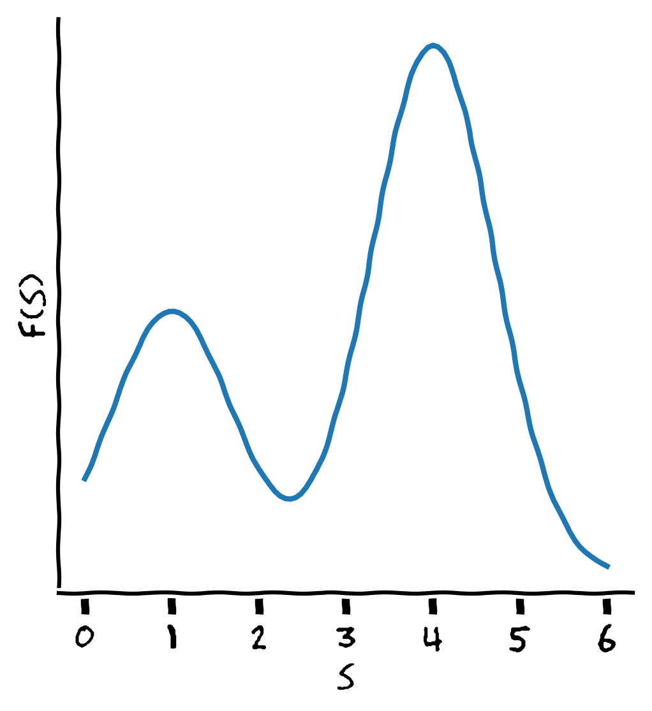

## What is evolutionary robotics?

.important[
.key[Evolutionary robotics] is the science of applying **evolutionary computation** for the _optimization_ of the body, the brain, or both of **robots**.
]

<!-- look for a better definition of evolutionary robotics -->

In this course:
- evolutionary computation
- examples of research on evolutionary robotics 

---

class: middle, center
name: ml-definitions

# Evolutionary computation

---

## The problem

Given:
- a set $S$
- a **partial order** $\\prec$ over $S$
  - $s\_1 \\prec s\_2$ reads "$s\_1$ is better than $s\_2$"
  - formally $\\prec: S \\times S \\to \\{\\text{first}, \\text{second}, \\text{same}, \\text{not-comparable}\\}$
  
The pair $(S,\\prec)$ is an .key[global optimization problem]. .note[$\\prec$ alone is the problem, $S$ is implicit, since $\\prec$ implitly defines $S$]
- $S$: .key[solution space] or .key[search space], *where to search for a solution?*
- $\\prec$: *what to search for?*

.vspace1[]

The goal is to find the set $S^\\star$ of **optimal solutions**:
$$S^\\star = \\{s \\in S: \\forall s' \\in S, s' \\not\\prec s\\}$$
- **global**, because we look for $S^\\star$ elements in the entire $S$
- not simply a $s^\\star=\\argmax_\{s \in S\}$, because $\\prec$ is just a partial order!

---

## Very broad

$S$ can be **any** set!
- discrete or continuous
- finite or infinite
- naturally ordered or not
- with or without a natural metric defined on it
- ...

.vspace1[]

Examples:
.cols[
.c30[
**Regression models** on $\\mathbb{R}^p$
- $S = \\mathcal{F}\_{\\mathbb{R}^p \\to \\mathbb{R}}$
- $s\_1 \\prec s\_2$ iff $s\_1$ better fits (e.g., with MSE) a given dataset $D=\\bag{(\\vect{x}^{(i)}, y^{(i)})}\_{i}$
.note[here, $\\prec$ is indeed a total order]
]
.c30[
**Sorting** of arrays
- $S = \\{\\text{sorting programs}\\}$
.note[in a given programming language, with the proper interface]
- $s\_1 \\prec s\_2$ iff  $s\_1$ "sorts better" than $s\_2$ some arrays $A \\subset \\mathbb{R}^*$
]
.c30[
**Robot control policies**
- $S = \\{\\text{controllers}$ $\\text{for robot } R\\}$
- $s\_1 \\prec s\_2$ iff $R$ with $s\_1$ performs better than $R$ with $s\_2$ on task $T$
]
]

For all cases, many other problem instances with same $S$ and different $\\prec$!

---

## One single approach?

Is there a **single approach** for solving $(S, \\prec)$ that works **for any $S$ and any $\\prec$**?

.note[For a few "kinds" of $S$ (and $\\prec$) there are many effective/efficient ways for solving $(S, \\prec)$ problems, e.g., $S=\\mathbb{R}^p$]

--

.vspace1[]

One source of *inspiration*: **natural evolution**!

- $S = \\{\\text{natural things}\\}$ .note[things one can build with physical matter]
- $s\_1 \\prec s\_2$ iff $s\_1$ is more **able to be alive** than $s\_2$

**Natural evolution** is long (and ongoing) process, after which we have a pretty good set $S^\\star$ of things that are able to be alive!

---

## Evolutionary computation

.important[
.key[Evolutionary computation] (EC) is the science of designing, developing, and using algorithms inspired by natural evolution for solving optimization problems.
]

.vspace1[]

.key[Evolutionary algorithms] (EAs) differ in:
- **effectiveness**: how well they solve optimization problems
- **efficiency**: how many resources they take to solve problems
- **applicability**: how many constraints they impose on $S$ and $\\prec$, how other components they require to users

.vspace1[]

.cols[
.c50[
Close relatives:
- global optimization (GO)
- bio-inspired optimization (BIO)
- population-based optimization (PO)
]
.c50[
... and relationships:
- GO $\\supset$ BIO $\\supseteq$ PO $\\supset$ EC
.note[but boundaries are not sharp!]
]
]

---

## Brief history and origin

.cols[
.c40[
A long history:
- **1930s**: first ideas
- **1960s**: first actual development of ideas on computers
- **1980s**: exploration
- **1990s**: exploitation .note[a sort of self joke...]
- **2000s**: **mature** expansion
]
.c60[
EC comes from (mostly) three communities:
- biologists: simulate/understand real evolution
- computer scientists/engineers: solve optimization problems
- artificial life researchers: evolve artificial life

Consequence:
- duplicated efforts
- **different terminologies**
]
]

.cols[
.c20[
.h20ex.center[]
]
.c80[
.ref[Kenneth A.. De Jong. Evolutionary computation: a unified approach. MIT Press, 2006.]
]
]

---

## EC research venues

Main conferences:
- [EvoStar](https://species-society.org/evostar-2024/), since 1998, Core **B**
  - in 2025 **held in Trieste**!
- [The Genetic and Evolutionary Computation Conference](https://gecco-2024.sigevo.org/HomePage) (GECCO), since 1999, Core **A** 
- [Parallel Problem Solving from Nature](https://ppsn2024.fh-ooe.at/) (PPSN), since 1989, Core **A**
- [IEEE Congress on Evolutionary Computation](https://2024.ieeewcci.org/) (CEC), since 1994, now part of IEEE World Congress on Computational Intelligence, Core **B**
- [Foundations of Genetic Algorithm](https://hpi.de/foga2023/) (FOGA), since 1990, held evry two years, Core **A**

Main journals:
- [Genetic Programming and Evolvable Machines](https://link.springer.com/journal/10710), Springer, SJR **Q2**
- [IEEE Transactions on Evolutionary Computation](https://ieeexplore.ieee.org/xpl/RecentIssue.jsp?punumber=4235), IEEE, SJR **Q1**
- [ACM Transactions on Evolutionary Learning and Optimization](https://dl.acm.org/journal/telo), ACM
- [MIT Evolutionary Computation](https://www.mitpressjournals.org/loi/evco), MIT Press, SJR **Q1**
- [Swarm and Evolutionary Computation](https://www.journals.elsevier.com/swarm-and-evolutionary-computation), Elsevier, SJR **Q1**

.note[[Core](http://portal.core.edu.au/conf-ranks/) and [SJR](https://www.scimagojr.com/) are two ranking tools for conferences and journals]

---

## Evolution: general scheme

What happens in reality:
- a **population of individuals** compete for limited resources
- individuals **die and are born** (the population is dynamic)
- fittest individuals **reproduce** and survive **more**
- offspring **inherit some characters** from parents (they are similar, but not identical)

.vspace1[]

Can we run this scheme on a computer?

---

## A first EA

.cols[
.c50.compact[
Ingredients (i.e., parameters):
1. a probability distribution .col2[$B$] over $S$ .note[$B$ for builder]
  - $B \\in \\mathcal{P}\_S$, i.e., $B: S \to [0,1]$, with $\\sum\_{s \\in S} B(s) = 1$
  - $s \\setsample B$ denotes sampling from $B$, briefly $\\sim B$
2. a stochastic (unary) operator .col2[$o\\subtext{mut}$] on $S$ (**mutation**)
  - $o\\subtext{mut}: S \\to \\mathcal{P}\_S$, $s' \\setsample o\\subtext{mut}(s)$
3. a stochastic binary operator .col2[$o\\subtext{xover}$] on $S$ (**crossover** $\to$ xover)
  - $o\\subtext{xover}: S \\times S \\to \\mathcal{P}\_S$, $s' \\setsample o\\subtext{mut}(s\_1,s\_2)$
4. a population size $\\c{2}{n\\subtext{pop}} \\in \\mathbb{N}$
5. a number of iterations $\\c{2}{n\\subtext{gen}} \\in \\mathbb{N}$
6. a reproduction **selection criterion** .col2[$c\\subtext{repr}$]
  - given a bag $A$ and a partial order $\\prec$ on $A$, $c\\subtext{repr}(A,\\prec) \\in \\mathcal{P}\_A$
7. a $\\neg$survival **selection criterion** .col2[$c\\subtext{die}$]

1, 2, 3 depend on $S$; 6, 7 may depend on $S$; 4, 5 are $S$ agnostic
]
.c50[
.pseudo-code.compact[
function $\\text{solve}(\\c{1}{\\prec}; \\c{2}{B, o\\subtext{mut}, o\\subtext{xover}, n\\subtext{pop}, n\\subtext{gen}, c\\subtext{repr}, c\\subtext{die}})$ {  
.i[]$S\\subtext{pop} \\seteq \\bag{}$ .comment[// $S'$ is a bag, not a set]   
.i[]while $|S\\subtext{pop}| < n\\subtext{pop}$ { .comment[// population initialization]  
.i[].i[]$S\\subtext{pop} \\seteq S\\subtext{pop} \\oplus \\bag{\\sim B}$  
.i[]}  
.i[]$n \\seteq 0$  
.i[]while $n < n\\subtext{gen}$ { .comment[// iterations (aka .key[generations])]  
.i[].i[]$n \\seteq n+1$  
.i[].i[]$S\\subtext{offspring} \\seteq \\bag{}$ .comment[// bag]  
.i[].i[]while $|S\\subtext{offspring}| < n\\subtext{pop}$ { .comment[// reproduction]  
.i[].i[].i[]$s\_1 \\setsample c\\subtext{repr}(S\\subtext{pop},\\prec)$  
.i[].i[].i[]$s\_2 \\setsample c\\subtext{repr}(S\\subtext{pop}, \\prec)$  
.i[].i[].i[]$S\\subtext{pop} \\seteq S\\subtext{pop} \\oplus \\bag{\\sim o\\subtext{mut}(\\sim o\\subtext{xover}(s\_1, s\_2))}$  
.i[].i[]}  
.i[].i[]$S\\subtext{pop} \\seteq S\\subtext{pop} \\oplus S\\subtext{offspring}$  
.i[].i[]while $|S\\subtext{pop}| > n\\subtext{pop}$ { .comment[// trim]  
.i[].i[].i[]$S\\subtext{pop} \\seteq S\\subtext{pop} \\ominus \\bag{\\sim c\\subtext{die}(S\\subtext{pop},\\prec)}$  
.i[].i[]}  
.i[]}  
.i[]return .col3[$S\\subtext{pop}$];  
}
]
.compact[
.col1[Input: $\\prec$] .note[and, implicitly, $S$] .hspace5[] .col3[Output: $S\\subtext{pop}$]  
.col2[Params: $B, o\\subtext{mut}, o\\subtext{xover}, n\\subtext{pop}, n\\subtext{gen}, c\\subtext{repr}, c\\subtext{die}$]
]
]
]

---

### Link with general scheme

.cols[
.c50[
- a population of individuals .col1[compete for limited resources]
  - resource: the right to stay in the population
- individuals die and are born (the population is dynamic)
  - in a synchronized way, .col2[time flows **through generations**]
  - "life" is istantaneous
- fittest individuals .col3[reproduce] and .col1[survive more]
  - actually depends on $c\\subtext{repr}$ and $c\\subtext{die}$
- offspring .col4[inherit some characters from parents] (they are similar, but not identical)
  - actually depends on $o\\subtext{mut}$ and $o\\subtext{xover}$
  
**Effectiveness**? Efficiency? **Applicability**?
- depend on the parameters

]
.c50[
.pseudo-code.compact[
function $\\text{solve}(\\prec; B, o\\subtext{mut}, o\\subtext{xover}, n\\subtext{pop}, n\\subtext{gen}, c\\subtext{repr}, c\\subtext{die})$ {  
.i[]$S\\subtext{pop} \\seteq \\bag{}$  
.i[]while $|S\\subtext{pop}| < n\\subtext{pop}$ {  
.i[].i[]$S\\subtext{pop} \\seteq S\\subtext{pop} \\oplus \\bag{\\sim B}$  
.i[]}  
.i[]$n \\seteq 0$  
.i[]while $n < n\\subtext{gen}$ {  
.i[].i[].col2[$n \\seteq n+1$]  
.i[].i[]$S\\subtext{offspring} \\seteq \\bag{}$  
.i[].i[]while $|S\\subtext{offspring}| < n\\subtext{pop}$ {  
.i[].i[].i[].col3[$s\_1 \\setsample c\\subtext{repr}(S\\subtext{pop},\\prec)$]  
.i[].i[].i[].col3[$s\_2 \\setsample c\\subtext{repr}(S\\subtext{pop}, \\prec)$]  
.i[].i[].i[]$S\\subtext{pop} \\seteq S\\subtext{pop} \\oplus \\bag{\\c{4}{\\sim o\\subtext{mut}(\\sim o\\subtext{xover}(s\_1, s\_2))}}$  
.i[].i[]}  
.i[].i[]$S\\subtext{pop} \\seteq S\\subtext{pop} \\oplus S\\subtext{offspring}$  
.i[].i[]while $|S\\subtext{pop}| > n\\subtext{pop}$ {  
.i[].i[].i[]$S\\subtext{pop} \\seteq S\\subtext{pop} \\c{1}{\\ominus \\bag{\\sim c\\subtext{die}(S\\subtext{pop},\\prec)}}$  
.i[].i[]}  
.i[]}  
.i[]return $S\\subtext{pop}$;  
}
]
]
]

---

## Selection (role of)

Given a bag $S'=\\bag{s\_1,s\_2,\\dots}=\\bag{s\_i}\_i \\subseteq S$ and a partial order $\\prec$ over $S$:

.cols[
.c50[
**Uniform selection**
.pseudo-code.compact[
function $\\text{uniform}(S',\\prec)$ {  
.i[]return $\\sim U(S')$ .comment[// uniform sampling]  
}
]
]
.c50[
**"Best" selection** .note[quotes because of partial order]
.pseudo-code.compact[
function $\\text{best}(S',\\prec)$ {  
.i[]$S'' \\seteq \\{s \\in S' : \\forall s' \\in S', s' \\not\\prec s\\}$ .comment[// non-dominated items]  
.i[]return $\\sim U(S'')$  
}
]
]
]

.center[**Effectiveness**: is it "fittest individuals reproduce and survive more"?]

.cols[
.c50[
👎 no (**too weak**) preference for fitter individuals
- $\\prec$ is not actually used!
]
.c50[
🫳 strong preference for fittest individuals
- maybe **too strong**: what if $|S''|=1$?
]
]

.center[**Applicability**: what constraints on $S$ and $\\prec$? what params?]
.cols[
.c50[
👍 no constraints  
👍 no params
]
.c50[
👍 no constraints  
👍 no params
]
]

.center[**Efficiency**: how many resources?]
.cols[
.c50[
👍 no computation
]
.c50[
🫳 some computation .note[$\\mathcal{O}(n^2)$ uses of $\\prec$, with $n=|S'|$]
]
]

---

### Tournament selection

.cols[
.c50[
.pseudo-code.compact[
function $\\text{tour}(S',\\prec;n\\subtext{tour})$ {  
.i[].col1[$S'' \\seteq \\bag{}$]  
.i[].col1[while $|S''| < n\\subtext{tour}$ {]  
.i[].i[].col1[$S'' \\seteq S'' \\oplus \\bag{\\sim U(S')}$]  
.i[].col1[}]  
.i[].col2[$S''' \\seteq \\{s \\in S'' : \\forall s' \\in S'', s' \\not\\prec s\\}$]  
.i[].col2[return $\\sim U(S''')$]  
}
]
]
.c50[
1. .col1[select $n\\subtext{tour}$ items from $S'$ randomly]
2. .col2[take one "best" item from the $n\\subtext{tour}$ items] 
]
]

**Effectiveness**: depends on $n\\subtext{tour}$!
- $n\\subtext{tour}=1$ is like uniform selection $\\Rightarrow$ too weak
- $n\\subtext{tour}=|S'|$ .note[may be larger, indeed] is like best selection $\\Rightarrow$ too strong
- something in between, hopefully good 👍 .note[moooore on this later...]
  - reasonable values in practice $n\\subtext{tour} = 0.05 |S'| = 0.05 n\\subtext{pop}$

**Efficiency**: depends on $n\\subtext{tour}$
- the lower, the more efficient 👍

**Applicability**: 👍
- no constraints on $S,\\prec$
- just one parameter, with a good "default value"

---

## Problems with fitness

In the vast majority of cases, you don't compare directly the solutions, but instead you:
- have a way to **measure the quality** of any solution
- **compare the quality measure**

A .note[global optimization] problem is hence given by:
- a set $S$
- a .key[fitness function] (or quality function) $f: S \\to \\mathbb{R}$ .note[like the loss function]
- an order in $\\mathbb{R}$
  - usually a total order, namely either $<$ (**minimization** problem) or $>$ (**maximization** problem)

.vspace1[]

**Example**: **regression models** on $D=\\bag{(\\vect{x}^{(i)}, y^{(i)})}\_{i}$, with $\\vect{x}^{(i)} \\in \\mathbb{R}^p$
- $S = \\mathcal{F}\_{\\mathbb{R}^p \\to \\mathbb{R}}$
- $f(s)=\\text{MSE}(s;D)=\\frac{1}{|D|} \\sum\_i (s(\\vect{x}^{(i)})-y^{(i)})^2$ 
- $<$

In natural language: "find the function with the lowest MSE on $D$"

---

### Fitness proportional selection

.cols[
.c50[
.pseudo-code.compact[
function $\\text{fitProp}(S',f;\\gamma)$ {  
.i[]$W \\seteq \\bag{}$  
.i[]while $s \\in S'$ {  
.i[].i[]$W \\seteq W \\oplus \\bag{(s,f(s)^\\gamma)}$  
.i[]}  
.i[]return $\\c{1}{\\text{roulette}}(W)$  
}
]
**Assume** maximization!  .note[negative $\\gamma$ for minimization!]

**Effectiveness**:  
👍 tunable preference
  - $\\gamma=0$ like uniform $\\Rightarrow$ no preference
  - $\\gamma \\rightarrow +\\infty$ like best $\\Rightarrow$ max preference
  - $\\gamma=1$ "reasonable" preference

👎 actual preference **depends on scale of $f$** and $\\gamma$!

**Applicability**:  
🫳 need to consider scale of $f$ to set $\\gamma$

**Efficiency**:  
👍 (after $|S'|$ fitness computation)

]
.c50[
.pseudo-code.compact[
.col1[function $\\text{roulette}(\\bag{(a^{(i)},x^{(i)})}\_{i})$] {    
.i[]$x \\setsample U([0,\\sum\_i x^{(i)}])$  
.i[]for $(a^{(i)},x^{(i)}) \\in \\bag{(a^{(i)},x^{(i)})}\\sub{i}$ {  
.i[].i[]if $x \\le x^{(i)}$ {  
.i[].i[].i[]return $a^{(i)}$  
.i[].i[]}  
.i[]}  
}
]
**Assume** maximization!

The probability of an $a^{(i)}$ item to be selected is proportional to its $x^{(i)}$.

**Example**: in $\\bag{(a,1),(b,10),(a,4)}$
- $b$ has a probability of $\\frac{2}{3}$
- $a$ has a probability of $\\frac{1}{3}=\\frac{1}{15}+\\frac{4}{15}$
]
]

---

### Ranking proportional selection

.cols[
.c50[
.pseudo-code.compact[
function $\\text{rankProp}(S',f;\\gamma)$ {  
.i[]$W \\seteq \\bag{}$  
.i[]while $s \\in S'$ {  
.i[].i[]$W \\seteq W \\oplus \\bag{(s,(|S'|+1-\\c{1}{\\text{rank}(s,S',f)})^\\gamma)}$  
.i[]}  
.i[]return $\\text{roulette}(W)$  
}
]
]
.c50[
Like fitness proportional, but proportional to the rank instead of to the fitness
- .col1[$\\text{rank}(s,S',f)$] returns the rank of $s \\in S'$ when $S'$ elements are sorted according to their $f(s)$
- can be easily tailored for maximization
]
]

**Effectiveness**:  
👍 tunable preference  
👍 no dependency on scale of $f$!
- but still dependency on $|S'|$

**Applicability**:  
👍 $\\gamma$ more freely settable

**Efficiency**:  
👍

---

## Effects of preference

.cols[
.c70[
Very simple problem:
- $S=\\mathbb{R}$
- $f: \\mathbb{R} \\to \\mathbb{R}$, $f(x)=e^{-(x-1)^2}+2 e^{-(x-4)^2}$
  - $S^\\star = \\{4\\}$
  - a .key[local optimum] .note[here, maximum] in $1$
- $>$ (i.e., maximization)

Let $S'=[0.5,1,1.5,2,3,3.5]$
- what if best/best as $c\\subtext{repr}$/$c\\subtext{die}$?
- what if uniform/uniform as $c\\subtext{repr}$/$c\\subtext{die}$?

]
.c30[
.w100p.center[]
]
]

.vspace1[]

--

- Too strong preference $\\Rightarrow$ higher risk of **convergence to local optima**
- Too weak preference $\\Rightarrow$ higher risk of **converging too slowly**

.note[preference for good individuals = selective pressure = evolutionary pressure]

.question[Question]: role of $B$, $o\\subtext{mut}$, $o\\subtext{xover}$?

<!--
exploration/exploitation
multi-objective
to single objective: linearization, lexicographic

role of n_pop
role of n_gen

how to choose B, o_mut, o_xover
representation

bitstring
intstring (and mention to combinatorial optimization)
numerical optimization
tree-based gp for regression
lgp
(mention to graphgp and grammar-based gp)

properties of the representation

altenative generational model
overlapping yes/no
elitism

quality diversity: map-elites
simple es (mention ot cma-es)
differential evolution

comparison and stochasticity
-->
