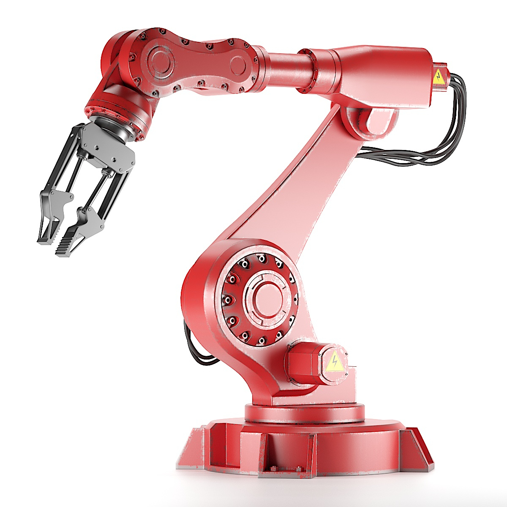

class: middle, center

# EC in/for robotics

---

## What is evolutionary robotics?

.important[
.key[Evolutionary robotics] is the science of applying **evolutionary computation** for the _optimization_ of the body, the brain, or both of **robots**.
]

--

More on evolutionary robotics:

.cols.compact[
.c30[
.h15ex.center[]

.ref[Nolfi, Stefano, and Dario Floreano. Evolutionary robotics: The biology, intelligence, and technology of self-organizing machines. MIT press, 2000.]

- the "Italian school"
]
.c30[
.h15ex.center[]

.ref[Nolfi, Stefano. Behavioral and cognitive robotics: an adaptive perspective. Stefano Nolfi, 2021.]
]
.c30[
.h15ex.center[]

.ref[Banzhaf, Wolfgang, Penousal Machado, and Mengjie Zhang. "Handbook of Evolutionary Machine Learning." (2023).]

- with chapter .ref[Medvet, Eric, et al. "Evolutionary Machine Learning in Robotics." Handbook of Evolutionary Machine Learning. Singapore: Springer Nature Singapore, 2023. 657-694.]
]
]

---

## Dynamical system

.cols[
.c60[
A .note[time invariant¹] .key[dynamical system] in **discrete time** is defined by:
- a **state update function**² $f\\suptext{state}: S \\times I \\to S$
- an **output function**² $f\\suptext{out}: S \\times I \\to O$
- an initial state $s^{(0)} \\in S$

where
- $S$ is the .key[state space]
- $I$ is the **input space**
- $O$ is the **output space**
]
.c40[
.diagram.center[
link([0,25,100,25],'a')
rect(100,0,200,50)
link([300,25,400,25],'a')
otext(50,10,'$i^{(k)}$')
otext(350,10,'$o^{(k)}$')
otext(200,25,'$f\\\\suptext{state},f\\\\suptext{out},s^{(0)}$')
]

The system evolves (i.e., changes) over time as:  
$s^{(k)} \\seteq f\\suptext{state}(s^{(k-1)}, i^{(k)})$  
$o^{(k)} \\seteq f\\suptext{out}(s^{(k-1)}, i^{(k)})$

.vspace1[]
Set of dynamical systems on $I, O, S$:  
$\\mathcal{D}\\sub{I,O,S}=\\mathcal{F}\\sub{S \\times I \\to S} \\times \\mathcal{F}\\sub{S \\times I \\to O} \\times S$
]
]

Particular case: **stateless** dynamical .note[i.e., static] system
- $S = \\emptyset$, i.e., no memory
- no $f\\suptext{state}$, $f\\suptext{out}: I \\to O$, i.e., just a function $\\Rightarrow$ $\\mathcal{D}\\sub{I,O,\\emptyset}=\\mathcal{F}\\sub{I \\to O}$

.footnote[
1. more generally, given $t = k \\delta t$, $f\\suptext{state}: \\mathbb{R}^+ \\times S \\times I \\to S$, $f\\suptext{out}: \\mathbb{R}^+ \\times S \\times I \\to O$
2. potentially stochastic functions, $f\\suptext{state}: S \\times I \\to \\mathcal{P}\_S$, $f\\suptext{out}: S \\times I \\to \\mathcal{P}\_O$
]

---

## Agent (and environment)

.cols[
.c40[
.key[Agent]: an entity capable of performing actions which may result in changing its **state** or the .key[environment] state.
]
.c60[
.diagram.center[
link([100,175,0,175,0,25,100,25],'a')
otext(200,-15,'Agent')
rect(100,0,200,50)
link([300,25,400,25,400,175,300,175],'a')
otext(50,10,'$o^{(k)}$')
otext(350,10,'$a^{(k)}$')
otext(200,25,'$f\\\\suptext{state}\\\\sub{A},f\\\\suptext{out}\\\\sub{A},s\\\\sub{A}^{(0)}$')
otext(200,135,'Environment')
rect(100,150,200,50)
otext(200,175,'$f\\\\suptext{state}\\\\sub{E},f\\\\suptext{out}\\\\sub{E},s\\\\sub{E}^{(0)}$')
link([-10,100,10,100],'t')
otext(75,100,'$k \\\\to k+1$', 'compact')
]
]
]

Both agent and environment are **dynamical systems**, but terminology reflects the agent point of view:
- agent
  - an input is an observation (of the environment): $I\_A=O$, the .key[observation space] 
  - an output is an action (on the environment): $O\_A=A$, the .key[action space] .note[former $O$]
- environment
  - an input is the agent's action: $I\_E=A$
  - an output is what the agent will observe at $k+1$: $O\_E=O$
  
Also with more than one agent $\\to$ **multi-agent systems** (MASs):
- $f\\suptext{state}\\sub{E}: S \\times A\_1 \\times A\_2 \\times \\dots \\to S$ (and same for $f\\suptext{out}\\sub{E}$) 

---

## Robot

.key[Robot]¹: an agent with a **body**².

.diagram.center[
otext(450,-15,'Agent')
rect(50,0,800,110)
otext(190,35,'Body (sensors) $B\\\\subtext{in}$')
rect(90,50,200,50)
otext(190,75,'$f\\\\suptext{state}\\\\sub{B\\\\subtext{in}},f\\\\suptext{out}\\\\sub{B\\\\subtext{in}},s\\\\sub{B\\\\subtext{in}}^{(0)}$')
otext(450,35,'Brain $C$')
rect(350,50,200,50)
otext(450,75,'$f\\\\suptext{state}\\\\sub{C},f\\\\suptext{out}\\\\sub{C},s\\\\sub{C}^{(0)}$')
otext(710,35,'Body (actuators) $B\\\\subtext{in}$')
rect(610,50,200,50)
otext(710,75,'$f\\\\suptext{state}\\\\sub{B\\\\subtext{out}},f\\\\suptext{out}\\\\sub{B\\\\subtext{out}},s\\\\sub{B\\\\subtext{out}}^{(0)}$')
otext(450,130,'Environment')
rect(350,150,200,50)
otext(450,175,'$f\\\\suptext{state}\\\\sub{E},f\\\\suptext{out}\\\\sub{E},s\\\\sub{E}^{(0)}$')
link([350,175,0,175,0,75,50,75],'a')
link([-10,125,10,125],'t')
link([850,75,900,75,900,175,550,175],'a')
link([50,75,90,75],'a')
otext(320,60,'$o^{(k)}$')
link([290,75,350,75],'a')
otext(580,60,'$a^{(k)}$')
link([550,75,610,75],'a')
link([810,75,850,75],'a')
]

- the **brain** (or .key[controller], $C$) observes the environment through .key[sensors], part $B\\subtext{in}$ of the body
- the **brain** acts on the environment through .key[actuators], part $B\\subtext{out}$ of the body
- the body (both $B\\subtext{in}$ and $B\\subtext{out}$) is a dynamical system
- from the point of view of the brain, the environment _includes_ the body

.footnote[
1. for what concerns this course
2. simulated or not
]

---

### Examples

.diagram.center[
otext(450,-15,'Agent')
rect(50,0,800,110)
otext(190,35,'Body (sensors) $B\\\\subtext{in}$')
rect(90,50,200,50)
otext(190,75,'$f\\\\suptext{state}\\\\sub{B\\\\subtext{in}},f\\\\suptext{out}\\\\sub{B\\\\subtext{in}},s\\\\sub{B\\\\subtext{in}}^{(0)}$')
otext(450,35,'Brain $C$')
rect(350,50,200,50)
otext(450,75,'$f\\\\suptext{state}\\\\sub{C},f\\\\suptext{out}\\\\sub{C},s\\\\sub{C}^{(0)}$')
otext(710,35,'Body (actuators) $B\\\\subtext{in}$')
rect(610,50,200,50)
otext(710,75,'$f\\\\suptext{state}\\\\sub{B\\\\subtext{out}},f\\\\suptext{out}\\\\sub{B\\\\subtext{out}},s\\\\sub{B\\\\subtext{out}}^{(0)}$')
otext(450,130,'Environment')
rect(350,150,200,50)
otext(450,175,'$f\\\\suptext{state}\\\\sub{E},f\\\\suptext{out}\\\\sub{E},s\\\\sub{E}^{(0)}$')
link([350,175,0,175,0,75,50,75],'a')
link([-10,125,10,125],'t')
link([850,75,900,75,900,175,550,175],'a')
link([50,75,90,75],'a')
otext(320,60,'$o^{(k)}$')
link([290,75,350,75],'a')
otext(580,60,'$a^{(k)}$')
link([550,75,610,75],'a')
link([810,75,850,75],'a')
]

.cols[
.c15[
.w100p.center[]
]
.c35[
Actuators have an inner, low-level controller, usually a proportional integrative derivative (PID) controller
- $B\\subtext{in}$ has a state!
]
.c15[
.w100p.center[]
]
.c35[
Sensors may perform a moving average of the perceived distances
- $B\\subtext{out}$ has a state!
]
]

---

### In practice

.diagram.center[
otext(450,-15,'Agent')
rect(50,0,800,110)
otext(190,35,'Body (sensors) $B\\\\subtext{in}$')
rect(90,50,200,50)
otext(190,75,'$f\\\\suptext{state}\\\\sub{B\\\\subtext{in}},f\\\\suptext{out}\\\\sub{B\\\\subtext{in}},s\\\\sub{B\\\\subtext{in}}^{(0)}$')
otext(450,35,'Brain $C$')
rect(350,50,200,50)
otext(450,75,'$f\\\\suptext{state}\\\\sub{C},f\\\\suptext{out}\\\\sub{C},s\\\\sub{C}^{(0)}$')
otext(710,35,'Body (actuators) $B\\\\subtext{in}$')
rect(610,50,200,50)
otext(710,75,'$f\\\\suptext{state}\\\\sub{B\\\\subtext{out}},f\\\\suptext{out}\\\\sub{B\\\\subtext{out}},s\\\\sub{B\\\\subtext{out}}^{(0)}$')
otext(450,130,'Environment')
rect(350,150,200,50)
otext(450,175,'$f\\\\suptext{state}\\\\sub{E},f\\\\suptext{out}\\\\sub{E},s\\\\sub{E}^{(0)}$')
link([350,175,0,175,0,75,50,75],'a')
link([-10,125,10,125],'t')
link([850,75,900,75,900,175,550,175],'a')
link([50,75,90,75],'a')
otext(320,60,'$o^{(k)}$')
link([290,75,350,75],'a')
otext(580,60,'$a^{(k)}$')
link([550,75,610,75],'a')
link([810,75,850,75],'a')
]

Very often:
- numeric observations ($O = \\mathbb{R}^p$) and actions ($A=\\mathbb{R}^q$) $\\to$ .key[continuous control]
- stateless controller ($C$ is only $f\\suptext{out}\\sub{C}$)
- $C$ is stateless and numeric ($C \\in \\mathcal{D}\\sub{\\mathbb{R}^p,\\mathbb{R}^q,\\emptyset} =\\mathcal{F}\\sub{\\mathbb{R}^p \\to \\mathbb{R}^q}$)

.vspace1[]

.question[Question] (actually 4 questions): what about the input/output spaces of $B\\subtext{in}$ and $B\\subtext{out}$?

---

## Brain vs. body vs. body+brain evolution

.diagram.center[
otext(450,-15,'Agent')
rect(50,0,800,110)
otext(190,35,'Body (sensors) $B\\\\subtext{in}$')
rect(90,50,200,50)
otext(190,75,'$f\\\\suptext{state}\\\\sub{B\\\\subtext{in}},f\\\\suptext{out}\\\\sub{B\\\\subtext{in}},s\\\\sub{B\\\\subtext{in}}^{(0)}$')
otext(450,35,'Brain $C$')
rect(350,50,200,50)
otext(450,75,'$f\\\\suptext{state}\\\\sub{C},f\\\\suptext{out}\\\\sub{C},s\\\\sub{C}^{(0)}$')
otext(710,35,'Body (actuators) $B\\\\subtext{in}$')
rect(610,50,200,50)
otext(710,75,'$f\\\\suptext{state}\\\\sub{B\\\\subtext{out}},f\\\\suptext{out}\\\\sub{B\\\\subtext{out}},s\\\\sub{B\\\\subtext{out}}^{(0)}$')
otext(450,130,'Environment')
rect(350,150,200,50)
otext(450,175,'$f\\\\suptext{state}\\\\sub{E},f\\\\suptext{out}\\\\sub{E},s\\\\sub{E}^{(0)}$')
link([350,175,0,175,0,75,50,75],'a')
link([-10,125,10,125],'t')
link([850,75,900,75,900,175,550,175],'a')
link([50,75,90,75],'a')
otext(320,60,'$o^{(k)}$')
link([290,75,350,75],'a')
otext(580,60,'$a^{(k)}$')
link([550,75,610,75],'a')
link([810,75,850,75],'a')
]

.cols.compact[
.c30[
**Brain only** .note[largely most commont]

1. fix the body ($B\\subtext{in}, B\\subtext{out}$)
  - $f\\suptext{out}\\sub{B\\subtext{in}}: \\cdot \\to \\c{1}{O}$
  - $f^\\cdot\\sub{B\\subtext{out}}: \\cdot \\times \\c{2}{A} \\to \\cdot$
2. choose a genotype space .col3[$G$] and a compatible EA
3. design $\\phi: \\c{3}{G} \\to \\mathcal{D}\\sub{\\c{1}{O},\\c{2}{A},\\cdot}$

**Easy!**
- often easier: $\\phi: \\c{3}{G} \\to \\mathcal{F}\\sub{\\c{1}{\\mathbb{R}^p} \\to \\c{2}{\\mathbb{R}^q}}$
]
.c30[
**Body only**
1. fix the brain $C$, hence .col1[$O$] and .col2[$A$]
2. choose a genotype space .col3[$G$] and a compatible EA
3. design $\\phi: \\c{3}{G} \\to \\mathcal{D}\\sub{\\cdot,\\c{1}{O},\\cdot} \\times \\mathcal{D}\\sub{\\c{2}{A},\\cdot,\\cdot}$
]
.c40[
**Body+brain only**
1. choose a genotype space .col3[$G$] and a compatible EA
2. design $\\phi: \\c{3}{G} \\to \\mathcal{D}\\sub{\\cdot,\\c{1}{O},\\cdot} \\times \\mathcal{D}\\sub{\\c{1}{O}, \\c{2}{A},\\cdot} \\times \\mathcal{D}\\sub{\\c{2}{A},\\cdot,\\cdot}$
  - possibly with "free" $O$ and $A$
  
Or co-evolve:
1. fix .col1[$O$] and .col2[$A$]
2. choose and design:
- EA1 w/ $\\phi\_1: \\c{3}{G\_1} \\to \\mathcal{D}\\sub{\\cdot,\\c{1}{O},\\cdot} \\times \\mathcal{D}\\sub{\\c{2}{A},\\cdot,\\cdot}$
- EA2 w/ $\\phi\_2: \\c{3}{G\_2} \\to \\mathcal{D}\\sub{\\c{1}{O},\\c{2}{A},\\cdot}$
]
]
