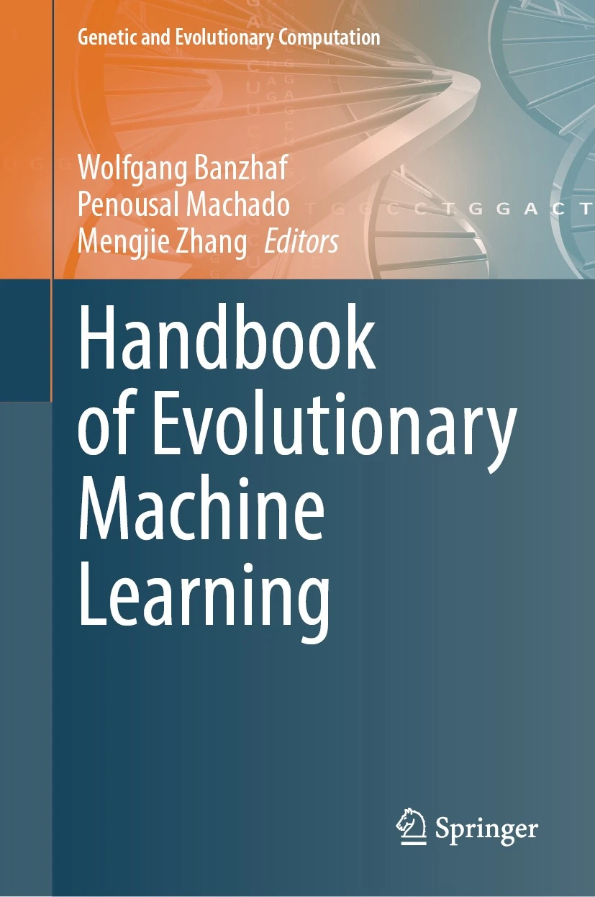
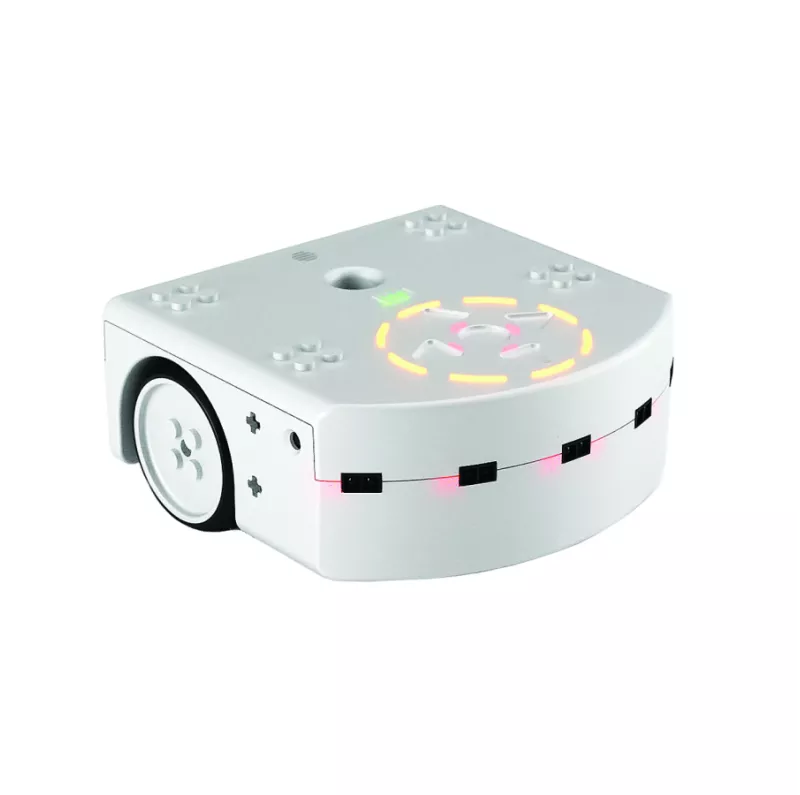
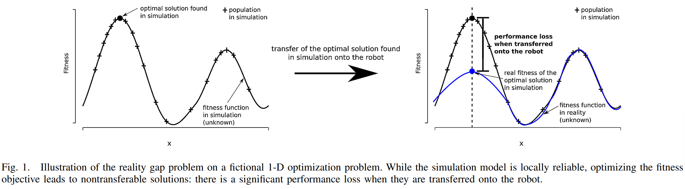
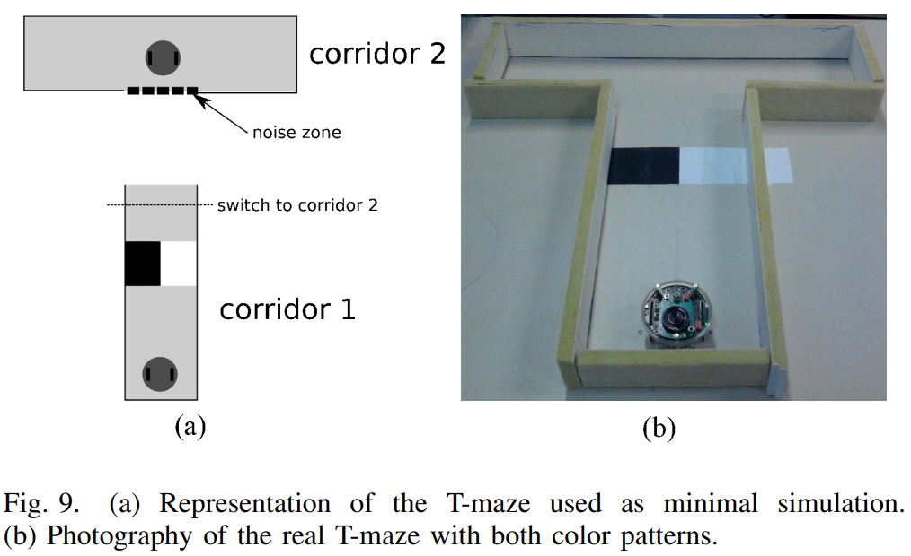
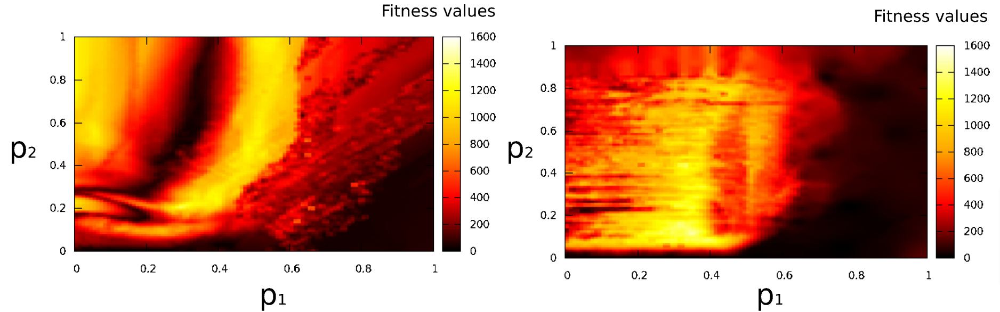

class: middle, center

# EC in/for robotics

---

## What is evolutionary robotics?

.important[
.key[Evolutionary robotics] is the science of applying **evolutionary computation** for the _optimization_ of the body, the brain, or both of **robots**.
]

--

More on evolutionary robotics:

.cols.compact[
.c30[
.h15ex.center[]

.ref[Nolfi, Stefano, and Dario Floreano. Evolutionary robotics: The biology, intelligence, and technology of self-organizing machines. MIT press, 2000.]

- the "Italian school"
]
.c30[
.h15ex.center[]

.ref[Nolfi, Stefano. Behavioral and cognitive robotics: an adaptive perspective. Stefano Nolfi, 2021.]
]
.c30[
.h15ex.center[]

.ref[Banzhaf, Wolfgang, Penousal Machado, and Mengjie Zhang. "Handbook of Evolutionary Machine Learning." (2023).]

- with chapter .ref[Medvet, Eric, et al. "Evolutionary Machine Learning in Robotics." Handbook of Evolutionary Machine Learning. Singapore: Springer Nature Singapore, 2023. 657-694.]
]
]

---

## Dynamical system

.cols[
.c60[
A .note[time invariant¹] .key[dynamical system] $D$ in **discrete time** ($k \\in \\mathbb{N}$) is defined by:
- a **state update function**² $f\\suptext{state}: S \\times I \\to S$
- an **output function**² $f\\suptext{out}: S \\times I \\to O$
- an initial state $s^{(0)} \\in S$

where
- $S$ is the .key[state space]
- $I$ is the **input space**
- $O$ is the **output space**
]
.c40[
.diagram.center[
link([0,25,100,25],'a')
rect(100,0,200,50)
link([300,25,400,25],'a')
otext(50,10,'$i^{(k)}$')
otext(350,10,'$o^{(k)}$')
otext(200,25,'$f\\\\suptext{state},f\\\\suptext{out},s^{(0)}$')
]

The system evolves (i.e., changes) over time as:  
$s^{(k)} \\seteq f\\suptext{state}(s^{(k-1)}, i^{(k)})$  
$o^{(k)} \\seteq f\\suptext{out}(s^{(k-1)}, i^{(k)})$

.vspace1[]

Set of dynamical systems on $I, O, S$:  
$\\mathcal{D}\\sub{I,O,S}=\\mathcal{F}\\sub{S \\times I \\to S} \\times \\mathcal{F}\\sub{S \\times I \\to O} \\times S$
]
]

.compact[
Particular case: **stateless** dynamical .note[i.e., static] system
- $S = \\emptyset$, i.e., no memory
- no $f\\suptext{state}$, $f\\suptext{out}: I \\to O$, i.e., just a function $\\Rightarrow$ $\\mathcal{D}\\sub{I,O,\\emptyset}=\\mathcal{F}\\sub{I \\to O}$
]

.footnote[
1. more generally, given $t = k \\delta t$, $f\\suptext{state}: \\mathbb{R}^+ \\times S \\times I \\to S$, $f\\suptext{out}: \\mathbb{R}^+ \\times S \\times I \\to O$
2. potentially stochastic functions, $f\\suptext{state}: S \\times I \\to \\mathcal{P}\_S$, $f\\suptext{out}: S \\times I \\to \\mathcal{P}\_O$
]

---

## Agent (and environment)

.cols[
.c40[
.key[Agent]: an entity capable of performing actions which may result in changing its **state** or the .key[environment] state.
]
.c60[
.diagram.center[
link([100,175,0,175,0,25,100,25],'a')
otext(200,-15,'Agent')
rect(100,0,200,50)
link([300,25,400,25,400,175,300,175],'a')
otext(50,10,'$o^{(k)}$')
otext(350,10,'$a^{(k)}$')
otext(200,25,'$f\\\\suptext{state}\\\\sub{A},f\\\\suptext{out}\\\\sub{A},s\\\\sub{A}^{(0)}$')
otext(200,135,'Environment')
rect(100,150,200,50)
otext(200,175,'$f\\\\suptext{state}\\\\sub{E},f\\\\suptext{out}\\\\sub{E},s\\\\sub{E}^{(0)}$')
link([-10,100,10,100],'t')
otext(75,100,'$k \\\\to k+1$', 'compact')
]
]
]

.compact[
Both agent and environment are **dynamical systems**, but terminology reflects the agent point of view:
- agent $A \\in \\mathcal{D}\\sub{O,A,S\_A}$
  - an input is an observation (of the environment): $I\_A=O$, the .key[observation space] 
  - an output is an action (on the environment): $O\_A=A$, the .key[action space] .note[former $O$]
- environment $E \\in \\mathcal{D}\\sub{A,O,S\_E}$
  - an input is the agent's action: $I\_E=A$
  - an output is what the agent will observe at $k+1$: $O\_E=O$
  
Also with more than one agent $\\to$ **multi-agent systems** (MASs):
- $f\\suptext{state}\\sub{E}: S \\times A\_1 \\times A\_2 \\times \\dots \\to S$ (and same for $f\\suptext{out}\\sub{E}$)
]

---

## Robot

.key[Robot]¹: an agent with a **body**².

.diagram.center[
otext(450,-15,'Agent')
rect(50,0,800,110)
otext(190,35,'Body (sensors) $B\\\\subtext{in}$')
rect(90,50,200,50)
otext(190,75,'$f\\\\suptext{state}\\\\sub{B\\\\subtext{in}},f\\\\suptext{out}\\\\sub{B\\\\subtext{in}},s\\\\sub{B\\\\subtext{in}}^{(0)}$')
otext(450,35,'Brain $C$')
rect(350,50,200,50)
otext(450,75,'$f\\\\suptext{state}\\\\sub{C},f\\\\suptext{out}\\\\sub{C},s\\\\sub{C}^{(0)}$')
otext(710,35,'Body (actuators) $B\\\\subtext{out}$')
rect(610,50,200,50)
otext(710,75,'$f\\\\suptext{state}\\\\sub{B\\\\subtext{out}},f\\\\suptext{out}\\\\sub{B\\\\subtext{out}},s\\\\sub{B\\\\subtext{out}}^{(0)}$')
otext(450,130,'Environment')
rect(350,150,200,50)
otext(450,175,'$f\\\\suptext{state}\\\\sub{E},f\\\\suptext{out}\\\\sub{E},s\\\\sub{E}^{(0)}$')
link([350,175,0,175,0,75,50,75],'a')
link([-10,125,10,125],'t')
link([850,75,900,75,900,175,550,175],'a')
link([50,75,90,75],'a')
otext(320,60,'$o^{(k)}$')
link([290,75,350,75],'a')
otext(580,60,'$a^{(k)}$')
link([550,75,610,75],'a')
link([810,75,850,75],'a')
]

- the **brain** (or .key[controller], $C$) observes the environment through .key[sensors], part $B\\subtext{in}$ of the body
- the **brain** acts on the environment through .key[actuators], part $B\\subtext{out}$ of the body
- the body (both $B\\subtext{in}$ and $B\\subtext{out}$) is a dynamical system
- from the point of view of the brain, the environment _includes_ the body

.note[More generally, a _link_ may exist betwee $B\\subtext{in}$ and $B\\subtext{out}$, hence having $O \\times H$ as output space for $B\\subtext{in}$ and $A \\times H$ as input space for $B\\subtext{out}$, with $H$ being the set of info traveling on that link]

.footnote[
1. for what concerns this course
2. simulated or not
]

---

### Examples

.diagram.center[
otext(450,-15,'Agent')
rect(50,0,800,110)
otext(190,35,'Body (sensors) $B\\\\subtext{in}$')
rect(90,50,200,50)
otext(190,75,'$f\\\\suptext{state}\\\\sub{B\\\\subtext{in}},f\\\\suptext{out}\\\\sub{B\\\\subtext{in}},s\\\\sub{B\\\\subtext{in}}^{(0)}$')
otext(450,35,'Brain $C$')
rect(350,50,200,50)
otext(450,75,'$f\\\\suptext{state}\\\\sub{C},f\\\\suptext{out}\\\\sub{C},s\\\\sub{C}^{(0)}$')
otext(710,35,'Body (actuators) $B\\\\subtext{out}$')
rect(610,50,200,50)
otext(710,75,'$f\\\\suptext{state}\\\\sub{B\\\\subtext{out}},f\\\\suptext{out}\\\\sub{B\\\\subtext{out}},s\\\\sub{B\\\\subtext{out}}^{(0)}$')
otext(450,130,'Environment')
rect(350,150,200,50)
otext(450,175,'$f\\\\suptext{state}\\\\sub{E},f\\\\suptext{out}\\\\sub{E},s\\\\sub{E}^{(0)}$')
link([350,175,0,175,0,75,50,75],'a')
link([-10,125,10,125],'t')
link([850,75,900,75,900,175,550,175],'a')
link([50,75,90,75],'a')
otext(320,60,'$o^{(k)}$')
link([290,75,350,75],'a')
otext(580,60,'$a^{(k)}$')
link([550,75,610,75],'a')
link([810,75,850,75],'a')
]

.cols[
.c15[
.w100p.center[]
]
.c35[
Actuators have an inner, low-level controller, usually a proportional integrative derivative (PID) controller
- $B\\subtext{in}$ has a state!
]
.c15[
.w100p.center[]
]
.c35[
Sensors may perform a moving average of the perceived distances
- $B\\subtext{out}$ has a state!
]
]

---

### In practice

.diagram.center[
otext(450,-15,'Agent')
rect(50,0,800,110)
otext(190,35,'Body (sensors) $B\\\\subtext{in}$')
rect(90,50,200,50)
otext(190,75,'$f\\\\suptext{state}\\\\sub{B\\\\subtext{in}},f\\\\suptext{out}\\\\sub{B\\\\subtext{in}},s\\\\sub{B\\\\subtext{in}}^{(0)}$')
otext(450,35,'Brain $C$')
rect(350,50,200,50)
otext(450,75,'$f\\\\suptext{state}\\\\sub{C},f\\\\suptext{out}\\\\sub{C},s\\\\sub{C}^{(0)}$')
otext(710,35,'Body (actuators) $B\\\\subtext{out}$')
rect(610,50,200,50)
otext(710,75,'$f\\\\suptext{state}\\\\sub{B\\\\subtext{out}},f\\\\suptext{out}\\\\sub{B\\\\subtext{out}},s\\\\sub{B\\\\subtext{out}}^{(0)}$')
otext(450,130,'Environment')
rect(350,150,200,50)
otext(450,175,'$f\\\\suptext{state}\\\\sub{E},f\\\\suptext{out}\\\\sub{E},s\\\\sub{E}^{(0)}$')
link([350,175,0,175,0,75,50,75],'a')
link([-10,125,10,125],'t')
link([850,75,900,75,900,175,550,175],'a')
link([50,75,90,75],'a')
otext(320,60,'$o^{(k)}$')
link([290,75,350,75],'a')
otext(580,60,'$a^{(k)}$')
link([550,75,610,75],'a')
link([810,75,850,75],'a')
]

Very often:
- numeric observations ($O = \\mathbb{R}^p$) and actions ($A=\\mathbb{R}^q$) $\\to$ .key[continuous control]
- stateless controller ($C$ is only $f\\suptext{out}\\sub{C}$)
- $C$ is stateless and numeric ($C \\in \\mathcal{D}\\sub{\\mathbb{R}^p,\\mathbb{R}^q,\\emptyset} =\\mathcal{F}\\sub{\\mathbb{R}^p \\to \\mathbb{R}^q}$)

.vspace1[]

.question[Question] (actually 4 questions): what about the input/output spaces of $B\\subtext{in}$ and $B\\subtext{out}$?

---

## Brain vs. body vs. body+brain evolution

.diagram.center[
otext(450,-15,'Agent')
rect(50,0,800,110)
otext(190,35,'Body (sensors) $B\\\\subtext{in}$')
rect(90,50,200,50)
otext(190,75,'$f\\\\suptext{state}\\\\sub{B\\\\subtext{in}},f\\\\suptext{out}\\\\sub{B\\\\subtext{in}},s\\\\sub{B\\\\subtext{in}}^{(0)}$')
otext(450,35,'Brain $C$')
rect(350,50,200,50)
otext(450,75,'$f\\\\suptext{state}\\\\sub{C},f\\\\suptext{out}\\\\sub{C},s\\\\sub{C}^{(0)}$')
otext(710,35,'Body (actuators) $B\\\\subtext{out}$')
rect(610,50,200,50)
otext(710,75,'$f\\\\suptext{state}\\\\sub{B\\\\subtext{out}},f\\\\suptext{out}\\\\sub{B\\\\subtext{out}},s\\\\sub{B\\\\subtext{out}}^{(0)}$')
otext(450,130,'Environment')
rect(350,150,200,50)
otext(450,175,'$f\\\\suptext{state}\\\\sub{E},f\\\\suptext{out}\\\\sub{E},s\\\\sub{E}^{(0)}$')
link([350,175,0,175,0,75,50,75],'a')
link([-10,125,10,125],'t')
link([850,75,900,75,900,175,550,175],'a')
link([50,75,90,75],'a')
otext(320,60,'$o^{(k)}$')
link([290,75,350,75],'a')
otext(580,60,'$a^{(k)}$')
link([550,75,610,75],'a')
link([810,75,850,75],'a')
]

.cols.compact[
.c30[
**Brain only** .note[largely most commont]

1. fix the body ($B\\subtext{in}, B\\subtext{out}$)
  - $f\\suptext{out}\\sub{B\\subtext{in}}: \\cdot \\to \\c{1}{O}$
  - $f^\\cdot\\sub{B\\subtext{out}}: \\cdot \\times \\c{2}{A} \\to \\cdot$
2. choose a genotype space .col3[$G$] and a compatible EA
3. design $\\phi: \\c{3}{G} \\to \\mathcal{D}\\sub{\\c{1}{O},\\c{2}{A},\\cdot}$

**Easy!**
- often easier: $\\phi: \\c{3}{G} \\to \\mathcal{F}\\sub{\\c{1}{\\mathbb{R}^p} \\to \\c{2}{\\mathbb{R}^q}}$
]
.c30[
**Body only**
1. fix the brain $C$, hence .col1[$O$] and .col2[$A$]
2. choose a genotype space .col3[$G$] and a compatible EA
3. design $\\phi: \\c{3}{G} \\to \\mathcal{D}\\sub{\\cdot,\\c{1}{O},\\cdot} \\times \\mathcal{D}\\sub{\\c{2}{A},\\cdot,\\cdot}$
]
.c40[
**Body+brain only**
1. choose a genotype space .col3[$G$] and a compatible EA
2. design $\\phi: \\c{3}{G} \\to \\mathcal{D}\\sub{\\cdot,\\c{1}{O},\\cdot} \\times \\mathcal{D}\\sub{\\c{1}{O}, \\c{2}{A},\\cdot} \\times \\mathcal{D}\\sub{\\c{2}{A},\\cdot,\\cdot}$
  - possibly with "free" $O$ and $A$
  
Or co-evolve:
1. fix .col1[$O$] and .col2[$A$]
2. choose and design:
- EA1 w/ $\\phi\_1: \\c{3}{G\_1} \\to \\mathcal{D}\\sub{\\cdot,\\c{1}{O},\\cdot} \\times \\mathcal{D}\\sub{\\c{2}{A},\\cdot,\\cdot}$
- EA2 w/ $\\phi\_2: \\c{3}{G\_2} \\to \\mathcal{D}\\sub{\\c{1}{O},\\c{2}{A},\\cdot}$
]
]

---

## And the fitness?

Ok, we know what is $S$ in evolutionary robotics.

What about $\\prec$?

Usually, evolutionary robotics problems are problems with fitness:
- $f: S \\to \\mathbb{R}$ (single-objective), where $f(s)$ measures the effectiveness of $s$ (degree of achievement) on a given .key[task]
  - often in simulation
  - sometimes in reality
  - sometimes on more than one task
- $f: S \\to \\mathbb{R}^k$ (multi-objective, often $k=2$), where $f(s)=(f\_1(s), f\_2(s))$ and $f\_1(s)$ measures the effectiveness of $s$ on a given task and $f\_2(s)$ the efficiency of $s$ (on the same task)

---

## ER by examples

- How to fight the **reality gap** in ER
- How to **design a fitness function**
- **Interpretable controllers** for continuos control
- **Morphological development** in simulated modular soft robots
- Representations for **body-brain evolution** of simulated modular soft robots
- **Imitation** "learning" with evolved controllers

---

class: middle, center

## How to fight the reality gap in ER

.ref[Koos, Sylvain, Jean-Baptiste Mouret, and Stéphane Doncieux. "The transferability approach: Crossing the reality gap in evolutionary robotics." IEEE Transactions on Evolutionary Computation 17.1 (2012): 122-145.]

---

### Research question

How to practically tackle the .key[reality gap] issue?

**Brief answer**: with a multi-objective approach, where the secondary objective is the **transferability** of the controller.

--

.vspace1[]

.w100p.center[]

---

### Sketch of the solution

.w90p.center[]

---

### Experiments: case study 1

.cols[
.c60.compact[
**Search space, fitness**:
- $O=\\mathbb{R}^7$ .note[5 IR sensors, 2 color sensors]
- $A=\\mathbb{R}^2$ .note[2 motors]
- $S\_C=\\emptyset$ and $f\\suptext{out}\\sub{C} =$ RNN with predefined topology (with enforced simmetry)
- $f\_1$ is distance ($d\_x+d\_y$) $+$ bonus

**Representation, EA**:
- $G \\simeq \\mathbb{R}^{35}$, but each number encoded with 4 bits
- $o\\subtext{mut} =$ bit flip; $o\\subtext{xover} =$ uniform
- NSGA-II

**Other**:
- transferability descriptors: trajectory distance
- diversity measure: genotype distance
- ML features: min distance to left/right, traveled distance
]
.c40[
.w100p.center[]

.vspace1[]

.w100p.center[]
]
]

---

### Experiments: case study 2

.cols[
.c60.compact[
**Search space, fitness**:
- $O=\\emptyset$ $\\to$ **open-loop controller**!
- $A=\\mathbb{R}^8$ .note[8 degrees of freedom (8-DOF)]
- $S\_C=\\emptyset$ and $f\\suptext{out}\\sub{C} =$ a set of sinusoidal functions parametrized with 2 parameters
- $f\_1$ is distance

**Representation, EA**:
- $G = [0,1]^2$
- $o\\subtext{mut} =$ bit flip; $o\\subtext{xover} =$ uniform
- NSGA-II

.w100p.center[]

]
.c40.compact[
**Other**:
- transferability descriptors: trajectory distance
- ML features: traveled distance, mean center height, final angle
- diversity measure: behavioral diversity in ML features space
- simulated with [PyBullet](https://pybullet.org/wordpress/)

.w100p.center[]
]
]

---

class: middle, center

## How to design a fitness function

.ref[Divband Soorati, Mohammad, and Heiko Hamann. "The effect of fitness function design on performance in evolutionary robotics: The influence of a priori knowledge." Proceedings of the 2015 Annual Conference on Genetic and Evolutionary Computation. 2015.]

---

### Research question and sketch of solution

If/how to use the **a priori knowledge** about the problem and desired solution when **designing the fitness**?
- very well captured in the title!

.vspace1[]

--

Sketch of solution:
1. define a priori knowledge
2. consider $>1$ ER problems (for **generality** of the findings) where the fitness can include more or less a priori knowledge
3. experiment

**Brief answer**: .note[not so brief...]
> Fitness functions that include a high degree of a priori knowledge (here TFF and BFF) influence the performance positively.
> They help to simplify the evolution of a successful controller and hence simplify the chosen task.
> However, we also know that incorporating a high degree of a priori knowledge foils the dominant idea of evolutionary computation as a black-box optimizer.

---

## Robot and tasks

.cols[
.c30[
**Robot**:
- simulated differential drive robot with 8 proximity sensors
  - 6 on the front
  - 2 on the back
  - simulated with [Stage](https://github.com/rtv/Stage)
]
.c70[
**Tasks**:
- **Obstacle avoidance (OA)**
  - easy
  - roam without colliding with walls
- **Goal homing (GH)**
  - medium
  - reach a target without colliding with walls
- **Periodic goal homing (GH)**
  - hard
  - reach and get away from a target without colliding with walls
]
]
.w75p.center[]

---

### A priori knowledge

Just two levels (and two combined cases:

---

class: middle, center

## Interpretable controllers for continuos control

.ref[Nadizar, Medvet, Wilson; Naturally Interpretable Control Policies via Graph-based Genetic Programming; 27th European Conference on Genetic Programming (EuroGP); 2024]

---

class: middle, center

## Morphological development in simulated modular soft robots

.ref[Kriegman, Sam, Nick Cheney, and Josh Bongard. "How morphological development can guide evolution." Scientific reports 8.1 (2018): 13934.]

.ref[Nadizar, Giorgia, Eric Medvet, and Karine Miras. "On the schedule for morphological development of evolved modular soft robots." European Conference on Genetic Programming (Part of EvoStar). Cham: Springer International Publishing, 2022.]

---

class: middle, center

## Representations for body-brain evolution of simulated modular soft robots

.ref[Ferigo, Andrea, et al. "On the entanglement between evolvability and fitness: An experimental study on voxel-based soft robots." ALIFE 2022: The 2022 Conference on Artificial Life. MIT press, 2022.]

---

class: middle, center

## Imitation "learning" with evolved controllers

.ref[Medvet, Nadizar; GP for Continuous Control: Teacher or Learner? The Case of Simulated Modular Soft Robots; XX Genetic Programming Theory & Practice (GPTP); 2023]

