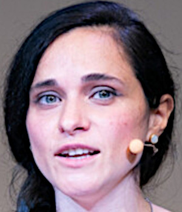

class: middle, center

# Introduction to Machine Learning and Evolutionary Computation
## 332MI, 470SM

[Eric Medvet](http://medvet.inginf.units.it/)

A.Y. 2022/2023

---

## Lecturer

Eric Medvet
- associate Professor of Computer Engineering at [Departmenet of Engineering and Architecture](https://dia.units.it/), [University of Trieste](https://www.units.it/)
- online at: [medvet.inginf.units.it](http://medvet.inginf.units.it/)

Research interests:
- evolutionary computation
- machine learning applications
- embodied intelligence

Labs:
- [Evolutionary Robotics and Artificial Life lab](https://erallab.inginf.units.it/)
- [Machine Learning lab](https://machinelearning.inginf.units.it/)

---

## Computer Engineering group

.cols.compact[
.c50[
.h5ex.vam[]
[Sylvio Barbon Jr.](https://www.barbon.com.br/)  
<i class="fa-solid fa-chalkboard-user col3"></i> Fondamenti di informatica  
<i class="fa-solid fa-chalkboard-user col3"></i> Progettazione del software e dei sistemi informativi  
<i class="fa-regular fa-lightbulb col3"></i> meta learning, applied ML, process mining

.h5ex.vam[]
[Alberto Bartoli](https://bartoli.inginf.units.it/)  
<i class="fa-solid fa-chalkboard-user col3"></i> Reti di calcolatori  
<i class="fa-solid fa-chalkboard-user col3"></i> Computer networks 2 and introduction to cybersecurity  
<i class="fa-regular fa-lightbulb col3"></i> security, applied ML, evolutionary computation

.h5ex.vam[]
[Andrea De Lorenzo](https://delorenzo.inginf.units.it/)  
<i class="fa-solid fa-chalkboard-user col3"></i> Basi di dati  
<i class="fa-solid fa-chalkboard-user col3"></i> Programmazione web  
<i class="fa-regular fa-lightbulb col3"></i> security, applied AI&ML, information retrieval, GP

]
.c50[
.h5ex.vam[]
[Eric Medvet](https://medvet.inginf.units.it/)  
<i class="fa-solid fa-chalkboard-user col3"></i> Programmazione avanzata  
<i class="fa-solid fa-chalkboard-user col3"></i> Introduction to machine learning and evolutionary robotics  
<i class="fa-regular fa-lightbulb col3"></i> evolutionary computation, embodied AI, applied ML

.h5ex.vam[]
[Laura Nenzi](https://lauranenzi.github.io/)  
<i class="fa-solid fa-chalkboard-user col3"></i> Cyber-physical systems  
<i class="fa-solid fa-chalkboard-user col3"></i> Introduction to Artificial Intelligence  
<i class="fa-regular fa-lightbulb col3"></i> formal methods, runtime verification

.h5ex.vam[]
[Martino Trevisan](https://trevisan.inginf.units.it/)  
<i class="fa-solid fa-chalkboard-user col3"></i> Reti di calcolatori  
<i class="fa-solid fa-chalkboard-user col3"></i> Sistemi operativi  
<i class="fa-solid fa-chalkboard-user col3"></i> Architetture dei sistemi digitali  
<i class="fa-regular fa-lightbulb col3"></i> network measurements, data privacy, big data
]
]

---

## Structure of the course

1st part (6 CFUs, 48 hours): .note[for all: [IN20](https://corsi.units.it/IN20/descrizione-corso), [IN19](https://corsi.units.it/IN20/descrizione-corso), [SM35](https://dssc.units.it/), [SM34](https://corsi.units.it/SM34/descrizione-corso), and [SM64](https://corsi.units.it/SM64/descrizione-corso)]
- what is machine learning?
- evaluating a ML system
- supervised learning techniques
- clustering
- application to text

2nd part (3 CFUs, 24 hours): .note[just for [IN20](https://corsi.units.it/IN20/descrizione-corso) and [IN19](https://corsi.units.it/IN20/descrizione-corso)]
- what is evolutionary computation?
- significan applications in robotics

Focus on **methodology**:
- how to **design**, build, and **evaluate** a ML (or EC) system?

---

## Materials

Teacher slides:
- available on the course [web page](https://medvet.inginf.units.it/teaching/2223-intro-ml-er/#course-material)
- might be updated during the course

Notebooks for the lab activity:
- available on the course [web page](https://medvet.inginf.units.it/teaching/2223-intro-ml-er/#course-material)
- please, to fully enjoy lab activities, **do not look** at notebooks **in advance**

Textbooks:
- 1st part: .ref[James, Gareth, et al.; An introduction to statistical learning. Vol. 112. New York: springer, 2013] .note[available in UniTs library]
- 2nd part: .ref[De Jong, Kenneth A. Evolutionary Computation: A Unified Approach. MIT Press, 2006.]
- overlap with course material is **not complete**!

---

## How to attend lectures

**New slides for this course edition!**
- same content of previous years, slightly different order
- hopefully better
  - main concept definitions are more explicit

Still, depending on your *learning style and habits*, you might want to **take notes** to *augment the slide content*.

---

## Visual syntax

.cols[
.c50[
This is an **important concept**.

This is a very important .key[key concept], like a definition.

Sometimes there is something that is marginally important, it is an aside.
.note[like this]

There will be scientific papers or books to be referred to, like this book: .ref[James, Gareth, et al.; An introduction to statistical learning. Vol. 112. New York: springer, 2013]

External resourses (e.g., videos, [software tools](https://en.wikipedia.org/wiki/Comparison_of_deep_learning_software), ...) will be linked directly.

.note[Palette is *color-blind safe*: .col1[⬤].col2[⬤].col3[⬤].col4[⬤].col5[⬤]]
]
.c50[
**Pseudo-code** for describing algorithms in an abstract way:
.pseudo-code[
function factorial($n$) {  
.i[]$p \\gets 1$  
.i[]while ($n>2$) {  
.i[].i[]$p \\gets n p$  
.i[].i[]$n \\gets n -1$  
.i[]}  
.i[]return $p$;  
}
]

Code in a concrete programming language:
```java
public static String sayHello(String name) {
  return "Hello %s".formatted(name);
}
```
]
]

---

## Lab activities and how to attend

Focus on **methodology**:
- how to **design**, build, and **evaluate** a ML (or EC) system?

Practice (in designing, building, evaluating) **is fundamental!**

You'll practice doing **lab activities**:
- $\\approx$ **15 hours** in the 1st part
- in classroom
  - the teacher is there and always available
  - the teacher actively monitors your progresses
  - ... but **you can** do the activities also **at home**
- "solution" shown at the end
  - solution = **one** way of doing design, build, evaluate
- **agnostic w.r.t. concrete tools** used
  - teacher is more familiar with **R**
  - **tutor** is more familiar with **Python**
- suitable to be done in small group (2–4 students)

---

## Lecture times

Where:
- .col1[Room 2 (Aula Meccanica Applicata), building C5, Piazzale Europa Campus]
- .col2[Room TA (Aula Fisica Tecnica), building C5, Piazzale Europa Campus]

When:
- **Monday**, 12.00–14.00, .col1[room 2, C5] $\\rightarrow$ **12.00–13.30**
- **Tuesday**, 9.00–11.00, .col2[room TA, C5] $\\rightarrow$ **9.00–10.30**
- **Wednesday**, 12.00–14.00, .col2[room TA, C5] $\\rightarrow$ **12.00–13.30**
- **Friday**, 12.00–14.00, .col2[room TA, C5] $\\rightarrow$ **11.00–12.30**

---

## Tutor

Federico Pigozzi
- 2nd year PhD student enroled in the Industrial and information engineering PhD program at the [Departmenet of Engineering and Architecture](https://dia.units.it/), [University of Trieste](https://www.units.it/)
- former student of this course
- online at: [pigozzif.github.io](https://pigozzif.github.io/)

Role of the tutor:
- assisting students **during lab activities**, together with the teacher
- first point-of-contact for course-related questions by students
  - the teacher is **always available**

---

## Exam

The exam consists of two parts:
- a **written test** .note[might be an oral exam if Covid returns]
- a **project**

The written test consists of few ($\\approx$ 6) questions, some with medium-length answer, some with short answer, to be done in 1h.

The project consists in the design, development, and assessment of a ML system dealing with one "problem" chosen among a few options ([examples](https://medvet.inginf.units.it/teaching/2223-intro-ml-er/project/)).
- **the student delivers a description, not the software**
- the description is evaluated for **clarity**, technical soundness, (amount of) results
- may be done in group

The grade is the **average** of written test and project grades:
- both must be $\\ge 18$
- parts can be repeated
---

## You?
