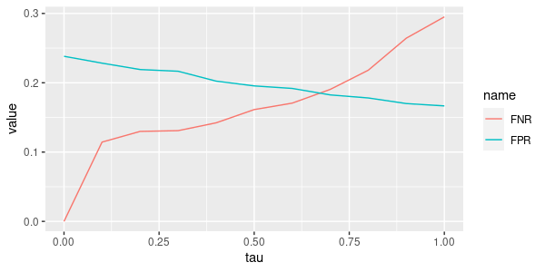
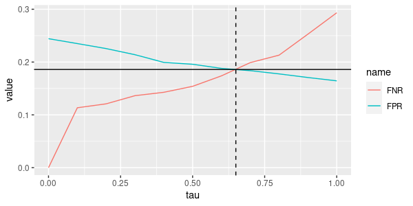
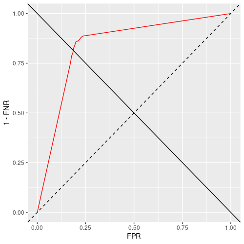
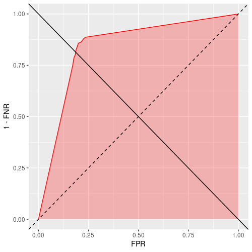
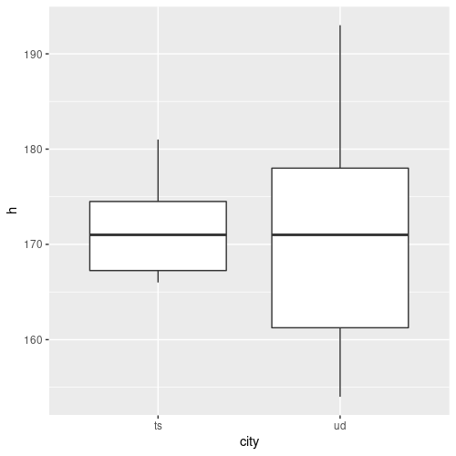
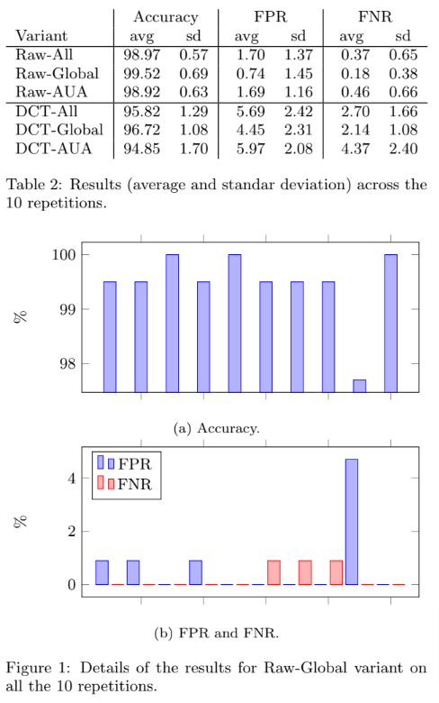
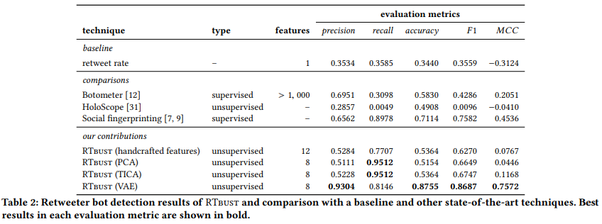
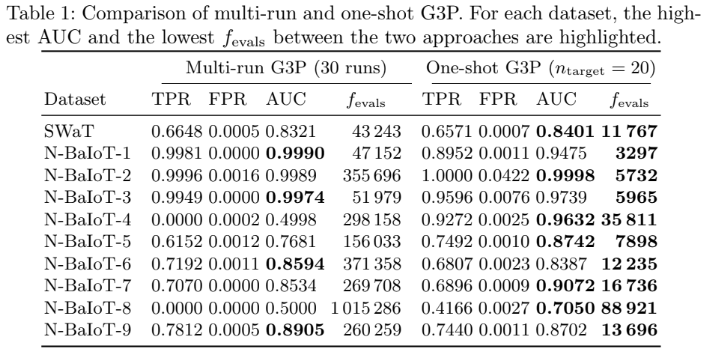
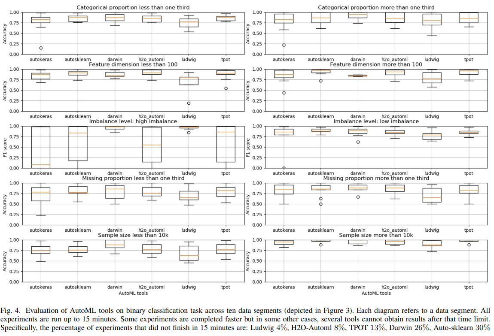

class: middle, center

# Assessing supervised ML

---

## What to assess?

**Subject** of the assessment:
- an ML system (all components)
- a supervised learning technique ($f\\subtext{learn}$ and $f\\subtext{predict}$)
- a model ($m$ used in an $f'\\subtext{predict}$)

---

## Axes of assessment

Assume something is assessed with respect to a given **goal**:
- .key[Effectiveness]: to which degree is the goal achieved?
  - goal poorly achieved $\\rightarrow$ low effectiveness 😢
  - goal completely achieved $\\rightarrow$ high effectiveness 😁
- .key[Efficiency]: how much resourses are consumed for achieving the goal? .note[to some degree]
  - large amount of resources $\\rightarrow$ low efficiency 	😢
  - small amount of resources $\\rightarrow$ high efficiency 😁
- .key[Interpretability] (or .key[explainability]): to which degree the way the goal is achieved (or not achieved) is explainable?
  - poorly explainable $\\rightarrow$ low interpretability 	😢
  - fully explainable $\\rightarrow$ high interpretability 😁

---

## Purposes of assessment

Given an axis $a$ of assessment:
- absolute assessment: does something meet the expectation in terms of $a$?
  - is a model effective *enough*?
  - is a learning technique explainable *enough*?
  - is an ML system efficient *enough*?
- **comparison**: is one thing better than one other thing in terms of $a$?
  - is model $m_1$ more effective than model $m_2$? .note[maybe obtained with same technique and different parameters]
  - is this learning technique more efficient than that learning technique?

"enough" represents some expectation, some minimum degree of $a$ to be reached.

--

If the outcome of assessment is a **quantity** (i.e., a number) .note[with a monotonic semantics]:
- comparison corresponds to check for $>$ or $<$
- absolute assessment corresponds to:
  - establishing a threshold and
  - check for $>$ or $<$

We want assessment to produce a number!

---

## Effectiveness and subject

A **ML system** can be seen as a composite learning technique.
It has two running modes: one in which it tunes itself, one in which it makes decisions.
ML system goals are:
- tuning properly (i.e., such that, after tuning it makes good decisions)
- making good decisions

A **supervised learning technique** is a pair $f\\subtext{learn},f\\subtext{predict}$.
Its goals are:
- learning a good $f\\subtext{predict}$, for $f\\subtext{learn}$, i.e., an $f\\subtext{predict}$ that makes good decisions
- making good decisions

A **model** has one goal:
- making good decisions (when used in an $f'\\subtext{predict}$)

--

Eventually, **effectiveness is about making good decisions**!
- Ideally, we want to **measure** effectiveness with numbers.

---

## Model vs. real system

How to measure if an $f'\\subtext{predict}$ is making good decisions?

Recall: $f\\subtext{predict}$, possibly through $f'\\subtext{predict}$ and a model $m$, models the **dependency** of $y$ on $x$.

**Key underlying assumption**: $y$ depends on $x$.
That is, there **exists** some **real system** $s: X \\to Y$ that, given an $x$ produces a $y$ based on $x$, that is, $s \\in \\mathcal{F}\_{X \\to Y}$:
- given a flat $x$, an **economical system** determines the price $y$ of $x$ on the real estate market
- given two basketball teams about to play a match $x$, a **sport event** determines the outcome $y$ of $x$

Or, there exists in reality some system $s^{-1}: Y \\to X$ that, given an $y$ produces an $x$ based on $y$:
- given a seed of an Iris flower of a given species $y$, the **nature** eventually develops $y$ in an Iris flower $x$

.cols[
.c50.center[
Model $m$ (or $f\\subtext{predict}$)
.diagram[
link([0,25,75,25],'a')
rect(75,0,150,50)
link([225,25,300,25],'a')
otext(150,25,"$f'\\\\subtext{predict}(\\\\cdot, m)$")
otext(37.5,10,'$x$')
otext(262.5,10,'$y$')
]
]
.c50.center[
Real system $s$
.diagram[
link([0,25,75,25],'a')
rect(75,0,150,50)
link([225,25,300,25],'a')
otext(150,25,"$s$")
otext(37.5,10,'$x$')
otext(262.5,10,'$y$')
]
]
]

.note[
A templated $f'\\subtext{predict}: X \\times M \\to Y$ with a fixed model $m$ is an $f\\subtext{predict}: X \\to Y$.
]

---

## Comparing $m$ and $s$

.cols[
.c50.center[
Model $m$ (or $f\\subtext{predict}$)
.diagram[
link([0,25,75,25],'a')
rect(75,0,150,50)
link([225,25,300,25],'a')
otext(150,25,"$f'\\\\subtext{predict}(\\\\cdot, m)$")
otext(37.5,10,'$x$')
otext(262.5,10,'$y$')
]
]
.c50.center[
Real system $s$
.diagram[
link([0,25,75,25],'a')
rect(75,0,150,50)
link([225,25,300,25],'a')
otext(150,25,"$s$")
otext(37.5,10,'$x$')
otext(262.5,10,'$y$')
]
]
]

How to see if the model $m$ is modeling the system $s$ well?

.cols[
.c50[
**Direct comparison**:
1. "open" $s$ and look inside
2. "open" $m$ and look inside
3. compare internals of $s$ and $m$

Issues:
- in practice, $s$ can rarely/hardly be opened
- $m$ might be hard to open
]
.c50[
**Comparison of behaviors**:
1. collect some examples of the **behavior of $s$**
2. feed $m$ with examples
3. compare responses of $s$ and $m$

Ideally, we want the comparison (step 3) outcome to be a number.
]
]

---

## Comparing behaviors

.cols[
.c60[
$$f\\subtext{comp-behavior}: \\mathcal{F}\_{X \\to Y} \\times \\mathcal{F}\_{X \\to Y} \\to \\mathbb{R}$$
]
.c40[
.diagram.center[
link([0,25,175,25],'a')
rect(175,0,150,50)
link([325,25,425,25],'a')
otext(250,25,"$f\\\\subtext{comp-behavior}$")
otext(87.5,10,"$f\\\\subtext{predict},s$")
otext(375,10,'$v\\\\subtext{effect}$')
]
]
]

Or, to highlight the presence of a model in a templated $f\\subtext{predict}$:

.cols[
.c60[
$$f\\subtext{comp-behavior}: \\mathcal{F}\_{X \\times M \\to Y} \\times M \\times \\mathcal{F}\_{X \\to Y} \\to \\mathbb{R}$$
]
.c40[
.diagram.center[
link([0,25,175,25],'a')
rect(175,0,150,50)
link([325,25,425,25],'a')
otext(250,25,"$f\\\\subtext{comp-behavior}$")
otext(87.5,10,"$f'\\\\subtext{predict},m,s$")
otext(375,10,'$v\\\\subtext{effect}$')
]
]
]

In both cases:

.cols[
.c60.compact[
.pseudo-code[
function $\\text{comp-behavior}(f\\subtext{predict}, s)$ {  
.i[].col1[$\\\\{x^{(i)}\\\\}\_i \\gets \\text{collect}()$]  
.i[].col1[$\\\\{y^{(i)}\\\\}\_i \\gets \\text{foreach}(\\\\{x^{(i)}\\\\}\_i, s)$]  
.i[].col2[$\\\\{\\hat{y}^{(i)}\\\\}\_i \\gets \\text{foreach}(\\\\{x^{(i)}\\\\}\_i, f\\subtext{predict})$]  
.i[].col3[$v\\subtext{effect} \\gets \\text{comp-resps}(\\\\{(y^{(i)},\\hat{y}^{(i)})\\\\}\_i)$]  
.i[]return $v\\subtext{effect}$;  
}
]
]
.c40[
1. .col1[collect some examples of the behavior of $s$]
2. .col2[feed $m$ with examples]
3. .col3[compare responses of $s$ and $m$]
]
]

.footnote[
More correctly $\\seq{(y^{(i)},\\hat{y}^{(i)})}{i} \\gets \\text{foreach}(\\seq{x^{(i)}}{i}, \\text{both}(\\cdot, s, f\\subtext{predict}))$ with $f\\subtext{both}: X \\times \\mathcal{F}^2\_{X \\to Y}$ and $f\\subtext{both}(x, f\_1, f\_2) = (f\_1(x),f\_2(x))$.
]

---

## Remarks on $f\\subtext{comp-behavior}$

.cols[
.c60.compact[
.pseudo-code[
function $\\text{comp-behavior}(f\\subtext{predict}, s)$ {  
.i[].col1[$\\\\{x^{(i)}\\\\}\_i \\gets \\text{collect}()$]  
.i[].col1[$\\\\{y^{(i)}\\\\}\_i \\gets \\text{foreach}(\\\\{x^{(i)}\\\\}\_i, s)$]  
.i[].col2[$\\\\{\\hat{y}^{(i)}\\\\}\_i \\gets \\text{foreach}(\\\\{x^{(i)}\\\\}\_i, f\\subtext{predict})$]  
.i[].col3[$v\\subtext{effect} \\gets \\text{comp-resps}(\\\\{(y^{(i)},\\hat{y}^{(i)})\\\\}\_i)$]  
.i[]return $v\\subtext{effect}$;  
}
]
]
.c40[
.diagram.center[
link([0,25,175,25],'a')
rect(175,0,150,50)
link([325,25,425,25],'a')
otext(250,25,"$f\\\\subtext{comp-behavior}$")
otext(87.5,10,"$f\\\\subtext{predict},s$")
otext(375,10,'$v\\\\subtext{effect}$')
]

1. .col1[collect examples of $s$ behavior]
2. .col2[feed $m$ with examples]
3. .col3[compare responses of $s$ and $m$]
]
]

- it's a partially abstract function: .col1[$f\\subtext{collect}$] and .col3[$f\\subtext{comp-resps}$] are **abstract** (i.e., not given here)
- we may reason about effectiveness and efficiency of $f\\subtext{comp-behavior}$, but both depend on **concrete** .col1[$f\\subtext{collect}$] and .col3[$f\\subtext{comp-resps}$]
  - **effectiveness**: to which degree $f\\subtext{comp-behavior}$ measures if $m$ behaves like $s$?
  - **efficiency**: how much resources are consumed to apply $f\\subtext{comp-behavior}$?

--

We'll see many concrete options for .col3[$f\\subtext{comp-resps}$]

.col1[$f\\subtext{collect}$] is instead hard to define, but it's more important than .col3[$f\\subtext{comp-resps}$]
- **working with good data is important**!

---

## The importance of $f\\subtext{collect}$ in assessment

- .col1[How many] observations to collect? (data **size**) .note[$n$ in $\\\\{(x^{(i)})\\\\}\_{i=1}^{i=n} \\gets \\text{collect}()$]
- .col2[Which] observations to collect? (data **coverage**)

Goal: the behavior $\\{(x^{(i)},y^{(i)})\\}\_{i=1}^{i=n}$ has to be **representative** of the real system $s$
- the .col1[larger $n$], the more representative
- the .col2[better the coverage of $X$], the more representative

Concerning .col1[size $n$]:
- small $n$, poor effectiveness 👎, great efficiency 👍
- large $n$, great effectiveness 👍, poor efficiency 👎

Concerning .col2[coverage of $X$]
- poor coverage, poor effectiveness 👎
- good coverage, good effectiveness 👍

**Focus on coverage, rather than size**, because it has no drawbacks!

---

## Comparing responses with $f\\subtext{comp-resps}$

.cols[
.c60[
Formally:
.cols[
.c40[$$f\\subtext{comp-resps}: \\mathcal{P}^\*(Y^2) \\to \\mathbb{R}$$]
.c60[
.diagram.center[
link([0,25,150,25],'a')
rect(150,0,125,50)
link([275,25,350,25],'a')
otext(212.5,25,"$f\\\\subtext{comp-resps}$")
otext(75,10,"$\\\\{(y^{(i)},\\\\hat{y}^{(i)})\\\\}\_i$")
otext(312.5,10,'$v\\\\subtext{effect}$')
]
]
]
]
.compact.c40[
.pseudo-code[
function $\\text{comp-behavior}(f\\subtext{predict}, s)$ {  
.i[]$\\{x^{(i)}\\}\_i \\gets \\text{collect}()$  
.i[]$\\{y^{(i)}\\}\_i \\gets \\text{foreach}(\\{x^{(i)}\\}\_i, s)$  
.i[]$\\{\\hat{y}^{(i)}\\}\_i \\gets \\text{foreach}(\\{x^{(i)}\\}\_i, f\\subtext{predict})$  
.i[].col3[$v\\subtext{effect} \\gets \\text{comp-resps}(\\\\{(y^{(i)},\\\\hat{y}^{(i)})\\\\}\_i)$]  
.i[]return $v\\subtext{effect}$;  
}
]
]
]

where $\\{(y^{(i)},\\hat{y}^{(i)})\\}\_i \\in \\mathcal{P}^\*(Y^2)$ is a multiset of pairs of $y$.

Depends only on $Y$, not on $X$!

--

We'll see **a few options** for the main cases:

.cols[
.c60[
- classification
  - all (i.e., agnostic with respect to $|Y|$): **error**, **accuracy**
  - binary: **FPR** and **FNR** (and variants), **EER**, **AUC**
  - multiclass: **weighted accuracy**
- regression: **MAE**, **MSE**, **MRE**, $R^2$
]
.c40[
<span style="font-size: 600%; line-height: 140px; vertical-align: bottom;">}</span>
<span style="line-height: 120px; vertical-align: bottom;">.key[performance indexes]</span>
]
]

---

class: middle, center

## Assessing models

### Classification

---

## Classification error

Recall: in classification $Y$ is a finite set with no ordering

.key[Classification error]: .note[more verbosely: classification error **rate**]
$$f\\subtext{err}(\\{(y^{(i)},\\hat{y}^{(i)})\\}\_{i=1}^{i=n})=\\frac{1}{n}\\sum\_{i=1}^{i=n}\\mathbf{1}(y^{(i)}\\ne \\hat{y}^{(i)})$$
where $\\mathbf{1}: \\{\\text{false},\\text{true}\\} \\to \\{0,1\\}$ is the indicator function:
$$\\mathbf{1}(b) =
\\begin{cases}
1 &\\text{if } b = \\text{true}\\\\
0 &\\text{otherwise}
\\end{cases}$$

- $f\\subtext{err}$ is a concrete instance of $f\\subtext{comp-resps}$
- the codomain of $f\\subtext{err}$ is $[0,1]$: .note[$[0,1] \\subseteq{\\mathbb{R}}$, so it can be a concrete instance]
  - $0$ means no errors, it's good 👍
  - $1$ means all errors, it's bad 👎
- in general, numbers in $[0,1]$ can be expressed as percentages in $[0,100]$: $x$ is the same as $100 x\%$

---

## Classification accuracy

.key[Classification accuracy]:
$$f\\subtext{acc}(\\{(y^{(i)},\\hat{y}^{(i)})\\}\_{i=1}^{i=n})=\\frac{1}{n}\\sum\_{i=1}^{i=n}\\mathbf{1}(y^{(i)} \\c{3}{=} \\hat{y}^{(i)})$$

Clearly, $f\\subtext{acc}(\\{(y^{(i)},\\hat{y}^{(i)})\\}\_{i=1}^{i=n})=1-f\\subtext{err}(\\{(y^{(i)},\\hat{y}^{(i)})\\}\_{i=1}^{i=n})$.

The codomain of $f\\subtext{acc}$ is also $[0,1]$:
  - $1$ means no errors, it's good 👍
  - $0$ means all errors, it's bad 👎

For accuracy, the greater, the better.  
For error, the lower, the better.

.footnote[
In principle, the only requirement concerning $Y$ for both $f\\subtext{acc}$ and $f\\subtext{acc}$ is that there is an *equivalence relation* in $Y$, i.e., that $=$ is defined over $Y$.
However, in practice $Y$ is a finite set without ordering.
]

---

## Bounds for accuracy (and error)

In principle, accuracy is in $[0,1]$.

Recall that in the $f\\subtext{acc}$ is part of an $f\\subtext{comp-behavior}$ that should measure how well a model $m$ models a real system $s$.  
What are the **ideal extreme cases** in practice:
- $m$ is $s$, so it **perfectly models** $s$
- $m$ is **random**, does not model any dependency of $y$ on $x$

From another point of view, what would be the accuracy of a:
- model that perfectly models the system?
- random model?

---

## The random classifier (lower bound)

The .key[random classifier]¹ is an $X \\to Y$ doing:

$$f\\subtext{rnd}(x) = y_i \\text{ with } i \\sim U(\\{1,\\dots,|Y|\\})$$

where $i \\sim U(A)$ means choosing an item of $A$ with uniform probability.

Here $A=\\{1,\\dots,|Y|\\}$, hence $f(x)$ gives a random $y$, without using $x$, i.e., **no dependency**.

Considering **all possibles multisets of responses** $\\mathcal{P}^\*(Y)$, the **accuracy of the random classifier** is, on average, $\\frac{1}{|Y|}$.

.footnote[
1. .key[classifier] is a *shorthand* for:
  - a model for doing classifcation, i.e., an $f'\\subtext{predict}$ with categorical $Y$
  - a supervised learning technique for classification, i.e., a pair $f'\\subtext{learn}, f'\\subtext{predict}$ with categorical $Y$
]

---

## Dummy classifier (better lower bound)

.cols[
.c70[
Given **one specific multiset of responses** $\\{y^{(i)}\\}\_i$, the .key[dummy classifier] is the one that always predicts the **most frequent** class in $\\{y^{(i)}\\}\_i$:
$$f\_{\\text{dummy},\\{y^{(i)}\\}\_i}(x) = \\argmax\_{y \\in Y} \\frac{1}{n} \\sum\_{i=1}^{i=n} \\mathbf{1}(y=y^{(i)})=\\argmax\_{y \\in Y} \\freq{y, \\{y^{(i)}\\}\_i}$$
On the $\\{y^{(i)}\\}\_i$ on which it is built, the accuracy of the dummy classifier is $\\max\_{y \\in Y} \\freq{y, \\{y^{(i)}\\}\_i}$.

Recall: we use $f\\subtext{acc}$ on one specific $\\{y^{(i)}\\}\_i$.

Like the random classifier, the dummy classifier does not use $x$.
]
.c30[
.h30ex.center[]
.note[
.dict-def[*dummy \[duhm-ee\]*: a representation of a human figure, as for displaying clothes in store windows]

Looks like a human, but does nothing!
]
]
]


---

## Random/dummy classifier: examples

.cols[
.c50[
Case: **coin tossing**, $Y=\\{\\c{1}{\\text{heads}},\\c{2}{\\text{tails}}\\}$

**Random** on average (with $f\\subtext{rnd}$):
.nicetable[
| $\\seq{y^{(i)}}{i}$ | $\\seq{\\hat{y}^{(i)}}{i}$ | $f\\subtext{acc}()$ |
| --- | --- | --- |
|.col1[⬤].col2[⬤].col2[⬤].col1[⬤].col1[⬤].col2[⬤]|.col2[⬤].col2[⬤].col2[⬤].col1[⬤].col2[⬤].col1[⬤]|$50\%$|
|.col2[⬤].col2[⬤].col1[⬤].col2[⬤]|.col2[⬤].col1[⬤].col2[⬤].col1[⬤]|$25\%$|
| ... | ... | ... |
|.col1[⬤]|.col1[⬤]|$100\%$|
|.col2[⬤]|.col1[⬤]|$0\%$|
|.col1[⬤]|.col2[⬤]|$0\%$|
]
Average accuracy = $50\%$

**Dummy** on $\\seq{y^{(i)}}{i}=\\htmlClass{col2 st}{\\text{⬤⬤}}\\htmlClass{col1 st}{\\text{⬤}}\\htmlClass{col2 st}{\\text{⬤}}$  
(with $f\_{\\text{dummy},\\htmlClass{col2 st}{\\text{⬤⬤}}\\htmlClass{col1 st}{\\text{⬤}}\\htmlClass{col2 st}{\\text{⬤}}}$):

$$f\\subtext{acc}(\\htmlClass{col2 st}{\\text{⬤⬤}}\\htmlClass{col1 st}{\\text{⬤}}\\htmlClass{col2 st}{\\text{⬤}},\\htmlClass{col2 st}{\\text{⬤⬤⬤⬤}}) = 75\%$$
]
.c50[
Case: **Iris**, $Y=\\{\\c{1}{\\text{setosa}},\\c{2}{\\text{versicolor}},\\c{3}{\\text{virginica}}\\}$

**Random** on average (with $f\\subtext{rnd}$):
.nicetable[
| $\\seq{y^{(i)}}{i}$ | $\\seq{\\hat{y}^{(i)}}{i}$ | $f\\subtext{acc}()$ |
| --- | --- | --- |
|.col1[⬤].col3[⬤].col2[⬤].col1[⬤].col3[⬤].col2[⬤]|.col2[⬤].col2[⬤].col3[⬤].col1[⬤].col2[⬤].col1[⬤]|$\\approx 17\%$|
|.col2[⬤].col2[⬤].col1[⬤].col3[⬤]|.col2[⬤].col1[⬤].col2[⬤].col3[⬤]|$50\%$|
| ... | ... | ... |
|.col3[⬤]|.col3[⬤]|$100\%$|
|.col2[⬤]|.col1[⬤]|$0\%$|
|.col1[⬤]|.col3[⬤]|$0\%$|
]
Average accuracy $\\approx 33\%$

**Dummy** on $\\seq{y^{(i)}}{i}=\\htmlClass{col3 st}{\\text{⬤⬤}}\\htmlClass{col1 st}{\\text{⬤}}\\htmlClass{col2 st}{\\text{⬤}}$  
(with $f\_{\\text{dummy},\\htmlClass{col3 st}{\\text{⬤⬤}}\\htmlClass{col1 st}{\\text{⬤}}\\htmlClass{col2 st}{\\text{⬤}}}$):

$$f\\subtext{acc}(\\htmlClass{col3 st}{\\text{⬤⬤}}\\htmlClass{col1 st}{\\text{⬤}}\\htmlClass{col2 st}{\\text{⬤}},\\htmlClass{col3 st}{\\text{⬤⬤⬤⬤}}) = 50\%$$
]
]

---

## The perfect classifier (upper bound)

A classifier that works exactly as $s$:

$$f\\subtext{perfect}(x) = s(x)$$

If $s$ is **deterministic**, the accuracy of $f\\subtext{perfect}(x)$ is 100% on every $\\seq{x^{(i)}}{i}$, by definition.

Are real systems deterministic in practice?
- system that makes a mail spam or not-spam
- Iris species (where nature is an $s^{-1}$...)
- a bank employee who decides whether or not to grant a loan
- the real estate market forming the price of a flat ($Y=\\mathbb{R}^+$)

---

## The Bayes classifier (better upper bound)

A non deterministic system (i.e., a **stochastic** or random system) is one that given the same $x$ may output different $y$.

The .key[Bayes classifier] is an **ideal** model of a real system that is not deterministic:

$$f\\subtext{Bayes}(x) = \\argmax_{y \\in Y} \\prob{s(x)=y \\mid x}$$

where $\\prob{s(x)=y \\mid x}$ is the probability that $s$ gives $y$ for $x$.

Key facts:
- on a given $\\seq{x^{(i)}}{i}$ the accuracy of the Bayes classifier is $\\le 100\%$ (it may be **lower than 100%**)
- on $\\mathcal{P}^\*(X)$, i.e., on all possible multisets of observations $x$, the Bayes classifier is the **optimal** classifier, i.e., no other classifier can score a better accuracy .note[it can be proven, not here!]

--

In practice:
- the Bayes classifier is an ideal classifier: "building" it requires knowing how $s$ works, which is **undoable in practice**
- intuitively, **the more random the system, the lower the accuracy** of the Bayes classifier

---

## The Bayes classifier: example

The real system $s$ is the professor deciding if a **student** will **pass or fail** the exam of *Introduction to ML*.
The professor just looks at the student course to decide .note[❗ fake!] and is a bit **stochastic**.

.center[$X =\\{\\text{IN19},\\text{IN20},\\text{SM34},\\text{SM35},\\text{SM64}\\}$  
$Y = \\{\\text{fail},\\text{pass}\\}$]

The probability according to which the professor "reasons" is **completeley known**:
.cols[
.c30.center[
.compact.nicetable[
| | $\\text{fail}$ | $\\text{pass}$ |
| --- | --- | --- |
| $\\text{IN19}$ | $20\%$ | $80\%$ |
| $\\text{IN20}$ | $15\%$ | $85\%$ |
| $\\text{SM34}$ | $60\%$ | $40\%$ |
| $\\text{SM35}$ | $80\%$ | $20\%$ |
| $\\text{SM64}$ | $20\%$ | $80\%$ |
]
.note[❗ these are fake numbers!]
]
.c40[
.compact[
$$\\prob{s(x)=y \\mid x}=\\begin{cases}
20\% &\\text{if } x=\\text{IN19} \\land y=\\text{fail} \\\\
80\% &\\text{if } x=\\text{IN19} \\land y=\\text{pass} \\\\
15\% &\\text{if } x=\\text{IN20} \\land y=\\text{fail} \\\\
\\dots \\\\
80\% &\\text{if } x=\\text{SM64} \\land y=\\text{pass}
\\end{cases}$$
.center.note[the table is a compact form for this probability]
]
]
.c30[
.compact[
$$f\\subtext{Bayes}(x) = \\begin{cases}
  \\text{pass} &\\text{if } x=\\text{IN19} \\\\
  \\text{pass} &\\text{if } x=\\text{IN20} \\\\
  \\text{fail} &\\text{if } x=\\text{SM34} \\\\
  \\text{fail} &\\text{if } x=\\text{SM35} \\\\
  \\text{pass} &\\text{if } x=\\text{SM64}
\\end{cases}$$
.center.note[built using the definition $f\\subtext{Bayes}(x) = \\argmax_{y \\in Y} \\prob{s(x)=y \\mid x}$]
]
]
]

.compact[
.question[Questions]
- what's the accuracy of $f\\subtext{Bayes}$? What's the model for the Bayes classifier? What's $M$?  
- what's the accurcay of $f\\subtext{dummy}$? And of $f\\subtext{rnd}$?
]

---

## Classification accuracy bounds

.center[
.nicetable[
| | Lower | Upper|
| --- | --- | --- |
| By definition | $0$ | $1$ |
| Bounds, all data | $\\frac{1}{\\lvert Y\\rvert}$ | $1$ |
| Better bounds, with one $\\seq{x^{(i)}}{i}$ | $\\max\_{y \\in Y} \\freq{y, \\{s(x^{(i)})\\}\_i}$ | $\\le 1$ |
]
]

If $\\seq{x^{(i)}}{i}$ is collected properly, it is **representative of the behavior** of the real system (together with the corresponding $\\seq{s(x^{(i)})}{i}$), hence the third case is the most relevant one:

.center[$f\\subtext{acc}(\\cdot) \\in [\\max\_{y \\in Y} \\freq{y, \\\\{s(x^{(i)})\\\\}\_i}, 1 - \\epsilon]$ .note[$\\epsilon > 0$ is actually unknown]]

In practice, use the **random classifier as a baseline** and
- do not cry 😭 for a missed $100\%$
- do not be too happy 🥳 just because you score $> 0\%$

---

## *All* data

All data means all the **theoretically** possible datasets, i.e., for just $y$, $\\mathcal{P}^*(Y)$.
- on average in $\\mathcal{P}^*(Y)$, the frequency of each $y\_i \\in Y$ is $\\frac{1}{|Y|}$

**In practice** not all possible datasets are equally probable.
- often, the frequencies $f\_i$ of $y\_i$ are known (at least an approximation of them).
- in these cases, the (approximate) lower bound for the random classifier is:
$$\\max\_i f\_i$$

**Example**: for spam, $x$ is an email, i.e., a string of text, $y$ is $\\text{spam}$ or $\\neg\\text{spam}$:
- are we interested in measuring the accuracy of a spam filter on all possible strings (theory)?
- or are we more interested in knowing its accuracy for actual emails (practice)?

---

## Building the dummy classifier

Consider the random classifier as a supervised learning technique:
- in **learning phase**: compute frequencies/probability of classes .note[concrete]
- in **prediction phase**: choose the most frequent class .note[concrete]

Hence, formally:
- a .col2[model $m \\in M$ is]:
  - the class **frequencies** $\\c{2}{\\vect{f} = (f\_1,\\dots,f\_{|Y|})}$, with $M=F\_Y=\\{\\vect{f} \\in [0,1]^{|Y|}: \\lVert \\vect{f} \\rVert\_1=1\\}$ .note[
  $\\lVert \\vect{x} \\rVert\_1$ is the **1-norm** of a vector $\\vect{x}=(x\_1,\\dots,x\_p)$ with $\\lVert \\vect{x} \\rVert\_1$ $=\\sum\_i x\_i$
  ]
  - a **discrete probability distribution** .col2[$p$] over $Y$, with $M=P\_Y=\\{p: Y \\to [0,1] \\text{ s.t. } 1=\\sum\_{y' \\in Y} p(y')=\\prob{y'=y}\\}$ .note[$\\text{s.t.}$ stays for "such that"]
  - the $y$ part .col2[$\\seq{y^{(i)}}{i}$] of a **dataset** $\\seq{x^{(i)},y^{(i)}}{i}$, with $M=\\mathcal{P}^*(Y)$
  - just the most frequent **class** .col2[$y^\\star$], with $M=Y$
- $f'\\subtext{learn}: \\mathcal{P}^*(X \\times Y) \\to M$ .note[asbtract]
- $f'\\subtext{predict}: X \\times M \\to Y$ .note[asbtract]

---

## Building the dummy classifier (options 1 and 2)

.cols[
.c60[
.diagram.center[
link([0,25,150,25],'a')
rect(150,0,100,50)
link([250,25,350,25],'a')
otext(200,25,"$f'\\\\subtext{learn}$")
otext(75,10,'$\\\\seq{(x^{(i)},y^{(i)})}{i}$')
otext(300,10,'$\\\\c{2}{m}$')
]
]
.c40[
.diagram.center[
link([0,25,100,25],'a')
rect(100,0,100,50)
link([200,25,310,25],'a')
otext(150,25,"$f'\\\\subtext{predict}$")
otext(50,10,'$x, \\\\c{2}{m}$')
otext(250,10,'$y$')
]
]
]

Option 1: the model .col2[$m$] is a **discrete probability distribution**: .note[here $f'\\subtext{learn}$ a function that returns a function]
.cols[
.c50.center.compact[
$f'\\subtext{learn}(\\seq{(x^{(i)},y^{(i)})}{i}) = \\c{2}{p}: p(y)= \\freq{y, \\seq{y^{(i)})}{i}}$
]
.c50.center.compact[
$f'\\subtext{predict}(x,\\c{2}{p})=\\argmax\_{y \\in Y} \\c{2}{p}(y)$
]
]

--

Option 2: the model .col2[$m$] is a **vector of frequencies**:
.note[assume $Y=\\\\{y\_1, y\_2, \\dots\\\\}$]
.cols[
.c50.center.compact[
$f'\\subtext{learn}(\\seq{(x^{(i)},y^{(i)})}{i}) = \\c{2}{\\vect{f}} = \\left(\\freq{y\_j, \\seq{y^{(i)})}{i}}\\right)\_j$
]
.c50.center.compact[
$f'\\subtext{predict}(x,\\c{2}{\\vect{f}})=y\_i$ with $i = \\argmax\_i f\_i$]
]

---

## Building the dummy classifier (options 3 and 4)

Option 3: the model .col2[$m$] is simply the learning **dataset**: .note[just the $y$ part of it]
.cols[
.c50.center.compact[
$f'\\subtext{learn}(\\seq{(x^{(i)},y^{(i)})}{i}) = \\c{2}{\\seq{y^{(i)}}{i}}$
]
.c50.center.compact[
$f'\\subtext{predict}(x,\\seq{y^{(i)}}{i})=\\argmax\_{y \\in Y} \\freq{y,\\c{2}{\\seq{y^{(i)}}{i}}}$
]
]

--

Option 4: the model .col2[$m$] is the most frquent **class** $y^\\star$:
.cols[
.c70.center.compact[
$f'\\subtext{learn}(\\seq{(x^{(i)},y^{(i)})}{i}) = \\c{2}{y^\\star}=\\argmax\_{y \\in Y} \\freq{y,\\seq{y^{(i)}}{i}}$
]
.c30.center.compact[
$f'\\subtext{predict}(x,y^\\star)=\\c{2}{y^\\star}$
]
]

--

For all options, works with:
- any $X$ ($x$ never appears in $f'\\subtext{learn}$ and $f'\\subtext{predict}$ bodies)
- finite $Y$ (categorical $y$)

Are they different? How?

--

They differ in efficiency, are equal in effectiveness:
- **effectiveness** as supervised learning techniques, **same by definition**
- **efficiency**, always low, but: .note[just an implementation matter]
  - more or less memory for storing the model $m$
  - computational effort more in the learning or prediction phase

---

class: middle, center

## Assessing models

### Binary classification

---

## Binary classification

Binary classification is a **very common** scenario.
- assessment is particularly important
- there are many indexes

Examples:
- spam detection
- decide whether there is a dog in a picture
- clinical test (more properly: diagnostic test)

---

## Example: diagnostic test

Suppose there is a (ML-based) diagnostic test for a given disease $d$. .note[just to give a name to it without calling bad luck...]

You are being said the accuracy of the test is $99.8\%$.

.center[**Is this a good test or not?**]

--

In "formal" terms, the test is an $f\\subtext{predict}: X \\to Y$ with:
- $X=\\{$🧑‍🦰$,$👱‍$,$🙍$,$‍👱$,$🙎‍$,\\dots\\}$ the set of persons¹
- $Y=\\{\\text{has the disease } d, \\text{does not have the disease } d\\}$

Since $|Y|=2$ this is a binary classification problem.

.footnote[
1: or, from another point of view, $X =\\{$🧑‍🦰$,$👱‍$,$🙍$,$‍👱$,$🙎‍$,\\dots\\} \\times T$, with $T$ being the *time*, because you test a person at a given time $t$, and the outcome might be different from the test outcome for the same person at a later $t'$.
]

---

## The rare disease

Suppose $d$ is a **rare**¹ disease which affects $\\approx 2$ people every $1000$ and let the accuracy be again $99.8\%$.

.center[**Is this a good test or not?**]

.footnote[
1. [definition](https://en.wikipedia.org/wiki/Rare_disease#Definition) of rare for a disease varies from country to country, based on the prevalence with thresholds ranging from 1 on 1538 (Brazil) to 1 in 100000 (Peru).
]

--

Consider a trivial test that **always** says "you don't have the disease $d$", its accuracy would be $99.8\%$:
- on $1000$ persons, the trivial test would make correct decisions on $998$ cases
- is our test good if it works like the trivial test?

--
.cols[
.c50.vcentered[
The trivial test is actually the **dummy classifier** built knowing that the prevalence is $0.2\%$.
]
.c50.center[
.h20ex[]
]
]

---

## The fallacy of the accuracy

$99.8\%$ was soooo nice, but the test was actually just saying always one $y$.

The **accuracy** alone was not able to capture such a gross error.

- Can we spot this trivially wrong behavior?
- From another point of view, can we check how badly the classifier behaves **for each class** $y$?

Yes, also because we are in **binary classification** and there are only $2=|Y|$ possible values for $y$ (i.e., 2 classes).

There are performance indexes designed right with this aim.

---

## Positives and negatives

First, let's give a *standard* name to the two possible $y$ values:
- **positive** (one case, denoted with $\\text{pos}$)
- **negative** (the other case $\\text{neg}$)

How to associate positive/negative with actual $Y$ elements?
- e.g., $\\text{spam}, \\neg\\text{spam}$
- e.g., $\\text{has the disease } d, \\text{does not have the disease } d$

Common practice:
- associate positive with the **rarest case**
- otherwise, if no rarest case exists or is known, **clearly state what's your positive**

---

## FPR and FNR

**Goal**: measuring the error on each of the two classes in binary classification.

The .key[False Positive Rate (FPR)] is the rate of **.col1[negatives]** that are **.col2[wrongly]¹ classified as positives**:
$$f\\subtext{FPR}(\\{(y^{(i)},\\hat{y}^{(i)})\\}\_i)=\\frac{\\sum\_i\\mathbf{1}(\\c{1}{y^{(i)}=\\text{neg}} \\land \\c{2}{y^{(i)} \\ne \\hat{y}^{(i)}})}{\\sum\_i\\mathbf{1}(\\c{1}{y^{(i)}=\\text{neg}})}$$

The .key[False Negative Rate (FNR)] is the rate of **.col3[positives]** that are **.col2[wrongly] classified as negatives**:
$$f\\subtext{FNR}(\\{(y^{(i)},\\hat{y}^{(i)})\\}\_i)=\\frac{\\sum\_i\\mathbf{1}(\\c{3}{y^{(i)}=\\text{pos}} \\land \\c{2}{y^{(i)} \\ne \\hat{y}^{(i)}})}{\\sum\_i\\mathbf{1}(\\c{3}{y^{(i)}=\\text{pos}})}$$

For both:
- the codomain is $[0,1]$
- **the lower, the better** (like the error)
- each one is formally an $f\\subtext{comp-resps}$ considering just a part  $\\seq{(y^{(i)},\\hat{y}^{(i)})}{i}$

.note[
1. wrongly $\\rightarrow$ *falsely* $\\rightarrow$ false
]
---

## More comfortable notation

.cols[
.c50[
$$\\text{FPR}=\\frac{\\text{FP}}{\\text{N}}$$
]
.c50[
$$\\text{FNR}=\\frac{\\text{FN}}{\\text{P}}$$
]
]

Assuming that:
- there is a $\\seq{(y^{(i)},\\hat{y}^{(i)}}{i}$, even if it's not written
- $\\text{FP}$ is the number of false positives; $\\text{FN}$ is the number of false negatives
  - you need both $y^{(i)}$ and $\\hat{y}^{(i)}$ for counting them
  - *.col1[negative]/.col3[positive]* is for $\\hat{y}^{(i)}$; *.col2[false]* is for $y^{(i)}$, but considering $\\hat{y}^{(i)}$
- $\\text{P}$ is the number of positives and $\\text{N}$ is the number of negatives
  - you need only $y^{(i)}$ for counting them

---

## FPR, FNR for the trivial test

Suppose $d$ is a **rare**¹ disease which affects $\\approx 2$ persons every $1000$ and consider a trivial test that **always** says "you don't have the disease $d$"
- on $1000$ persons, the trivial test would make correct decisions on $998$ cases 😁
$$\\text{Acc} = 99.8\%$$
- on the $998$ negative persons, the trivial test does not make any wrong prediction 😁
$$\\text{FPR}=\\frac{\\text{FP}}{\\text{N}} = \\frac{0}{998} = 0 \%$$
- on the $2$ positive persons, the trivial test makes wrong predictions only 🙁
$$\\text{FNR}=\\frac{\\text{FN}}{\\text{P}} = \\frac{2}{2} = 100 \%$$

.footnote[
$\\text{Acc}$ is the more comfortable notation for the accuracy; $\\text{Err}$ for the error.
]

---

## Accuracy or FPR, FNR?

When to use accuracy? When to use FPR and FNR?

.center[*tl;dr*¹: **use FPR and FNR in binary classification!**]

--

In decreasing order of informativeness .note[effectiveness of assessment of effectiveness], decreasing order of verbosity:
- give accuracy, FPR, FNR, frequencies of classes² in $Y$, possibly other indexes .note[we'll see later]
- give accuracy, FPR, FNR, frequencies of classes
- FPR, FNR, frequencies of classes
- FPR, FNR
- accuracy, frequencies of classes
- .striked[accuracy]

**Accuracy alone in binary classification is evil!** 👿

Just FPR, or just FNR is evil too, but also weird.

.footnote[
1. too long; didn't read
2. you need to show them just once, if using the "natural" distribution
]

---

## The many relatives of FPR, FNR: TPR, TNR

Binary classification and its assessment are so practically relevant that there exist many other "synonyms" of FPR and FNR.

.key[True Positive Rate (TPR)], positives correctly classified as positives:
$$\\text{TPR}=\\frac{\\text{TP}}{\\text{P}}=1-\\text{FNR}$$

.key[True Negative Rate (TNR)], negatives correctly classified as negatives:
$$\\text{TNR}=\\frac{\\text{TN}}{\\text{N}}=1-\\text{FPR}$$

For both, **the greater, the better** (like accuracy); codomain is $[0,1]$.

Relation with accuracy and error:
.cols[
.c40[
$$\\text{Err}
=\\frac{\\text{FP}+\\text{FN}}{\\text{N}+\\text{P}}
=\\frac{\\text{P} \; \\text{FNR}+\\text{N} \; \\text{FPR}}{\\text{P}+\\text{N}}$$
]
.c60[
$$\\text{Acc}
=1-\\text{Err}
=\\frac{\\text{TP}+\\text{TN}}{\\text{N}+\\text{P}}
=\\frac{\\text{P} \; \\text{TPR}+\\text{N} \; \\text{TNR}}{\\text{P}+\\text{N}}$$
]
]

---

## On balanced data

In classification (binary and multiclass), a dataset is .key[balanced], with respect to the response variable $y$, if the frequency of each value of $y$ is *roughly* the same.

For a balanced dataset in binary classification, $\\text{P}=\\text{N}$, hence:
- the error rate is the **average** of FPR and FNR
$$\\text{Err}
=\\frac{\\text{FP}+\\text{FN}}{\\text{N}+\\text{P}}=\\frac{\\text{P} \; \\text{FNR}+\\text{N} \; \\text{FPR}}{\\text{P}+\\text{N}}
=\\frac{\\text{N} (\\text{FNR} + \\text{FPR})}{\\text{N}+\\text{N}}
=\\frac{1}{2} (\\text{FNR} + \\text{FPR})$$
- the accuracy is the **average** of TPR and TNR
$$\\text{Acc}
=\\frac{\\text{TP}+\\text{TN}}{\\text{N}+\\text{P}}
=\\frac{\\text{P} \; \\text{TPR}+\\text{N} \; \\text{TNR}}{\\text{P}+\\text{N}}
=\\frac{\\text{N} (\\text{TPR}+\\text{TNR})}{\\text{N}+\\text{N}}
=\\frac{1}{2} (\\text{TNR} + \\text{TPR})$$

The **more unbalanced** a dataset, the farther the error (accuracy) from the average of FPR and FNR (TPR and TNR), the **more misleading** 👿 giving error (accuracy) only!

---

## Precision and recall

.cols[
.c60[
.key[Precision]: .note[may be $\\frac{0}{0}$, i.e., `NaN`, if the classifier never says positive]
$$\\text{Prec}=\\frac{\\text{TP}}{\\text{TP}+\\text{FP}}$$
]
.c40[
.key[Recall]:
$$\\text{Rec}=\\frac{\\text{TP}}{\\text{P}}=\\text{TPR}$$
]
]

They come from the **information retrieval** scenario:
- imagine a set of documents $D$ (e.g., the web)
- imagine a query $q$ with an **ideal** subset $D^\\star \\subseteq D$ as response (**relevant** documents)
- the search engine retrieves a subset $D' \\subseteq D$ of documents (**retrieved** documents)
- retrieving a document as binary classification: is $d \\in D$ relevant or not? .note[relevant = positive]

.cols[
.c60[
**Precision**: how many retrieved documents are actually relevant?
.center[$\\text{Prec}=\\frac{|D' \\cap D^\\star|}{|D'|}=\\frac{\\c{1}{|D' \\cap D^\\star|}}{\\c{1}{|D' \\cap D^\\star|}+\\c{2}{|D' \\setminus D^\\star|}}=\\frac{\\c{1}{\\text{TP}}}{\\c{1}{\\text{TP}}+\\c{2}{\\text{FP}}}$]
]
.c40[
**Recall**: how many of the relevant documents are actually retrieved?
.center[$\\text{Rec}=\\frac{\\c{1}{|D' \\cap D^\\star|}}{\\c{3}{|D^\\star|}}=\\frac{\\c{1}{\\text{TP}}}{\\c{3}{\\text{P}}}$]
]
]

**The greater, the better** (like accuracy); precision $\\in [0,1] \\cup $ `NaN`, recall $\\in [0,1]$.

---

## Sensitivity and specificity (and more)

.key[Sensitivity]:
$$\\text{Sensitivity}=\\frac{\\text{TP}}{\\text{P}}=\\text{TPR}$$

.key[Specificity]:
$$\\text{Specificity}=\\frac{\\text{TN}}{\\text{N}}=\\text{TNR}$$

**The greater, the better** (like accuracy); both in $[0,1]$.

--

Other similar indexes:
- **Type I error** for FPR
- **Type II error** for FNR

For both, the lower, the better (like error).

---

## Which terminology?

Rule of the thumb¹ (in binary classification)
- *precision and recall*, if in an **information retrieval** scenario
  - refer to the act of retrieving
- *sensitivity and specificity*, if working with a **diagnostic** test
  - refer to the quality of the text
- *FPR and FNR*, **otherwise**
  - refer to the name of the class

No good reasons .note[imho] for using Type I and Type II error:
- what do they refer to?
- is there a Type III? 🤔 (No!)

.footnote[
1. .dict-def[*rule of the thumb \[ˌruːl əv ˈθʌm\]*: a broadly accurate guide or principle, based on practice rather than theory]
]

---

## Comparison with FPR and FNR

Suppose you have two models and you compute them on the same data:
- model $m_1$ .note[with its $f'\\subtext{predict}$] scores $\\text{FPR}=6\%$ and $\\text{FNR}=4\%$
- model $m_2$ .note[with its $f'\\subtext{predict}$] scores $\\text{FPR}=10\%$ and $\\text{FNR}=1\%$

Which one is the best?

--

In general, it depends on:
- the **cost of the error**, possibly different between FPs and FNs
- the number of positives or negatives

---

## Cost of the error

Assumptions:
- once $f\\subtext{predict}$ outputs a $y$, some **action is taken**
  - otherwise, taking a decision $y$ is pointless
- if the action is wrong, there is some **cost** to be paid with respect to the correct action (the other one, in binary classification) .note[assume the correct decision has $0$ cost]
  - otherwise, making attempting to take the correct decision is pointless

Given $\\text{P}+\\text{N}$ observations, the overall cost $c$ is:
$$c = c\\subtext{FP} \; \\text{FPR} \; \\text{N} + c\\subtext{FN} \; \\text{FNR} \; \\text{P}$$
with $c\\subtext{FP}$ and $c\\subtext{FN}$ the cost of FPs and FNs.

If you know $c\\subtext{FP}$, $c\\subtext{FN}$, $\\text{N}$, and $\\text{P}$: (the costs $c\\subtext{FP}$, $c\\subtext{FN}$ should come **from domain knowledge**)
- you can **compute** $c$ (and **compare** the cost for two models)
- find a good trade-off for $\\text{FPR}$ and $\\text{FNR}$ .note[more later]

---

## Balancing FPR and FNR

Given a **model** (not a learning technique), can we "tune" it to **prefer avoiding FPs rathern than FNs** (or viceversa)?
- e.g., can we make a diagnostic more sensitive to positives (i.e., prefer avoiding FNs) during a pandemic wave?

Yes! It turns out that for **many learning techniques** (for classification), the $f'\\subtext{predict}$ internally computes a **discrete probability distribution** over $Y$ before actually returning one $y$.

---

## Model with probability

Formally:
.cols[
.c30[
$$f''\\subtext{predict}: X \\times M \\to P\_{Y}$$
$$f''\\subtext{predict}(x, m) = p$$
]
.c70[
$$f'\\subtext{predict}: X \\times M \\to Y$$
$$f'\\subtext{predict}(x, m)= \\argmax\\sub{y \\in Y} (f''\\subtext{predict}(x, m))(y) = \\argmax\\sub{y \\in Y} p(y)$$
]
]
where $P\_Y$ is the set of discrete probability distributions over $Y$.

**Example**: for spam detection, given an $m$ and an email $x$, $f'\\subtext{predict}(x, m)$ might return:
$$p(y)=
\\begin{cases}
80\% &\\text{if } y=\\text{spam} \\\\
20\% &\\text{if } y=\\neg\\text{spam}
\\end{cases}$$
For another email, it might return a 30%/70%, instead of an 80%/20%.

---

## Learning technique with probability

A .key[supervised learning technique with probability] (for classification) is defined by:
- an $f'\\subtext{learn}: \\mathcal{P}^*(X \\times Y) \\to M$, for learning a model from a dataset
- an $f''\\subtext{predict}: X \\times M \\to P\_{Y}$, for giving a probability distribution from an observation and a model

For all the techniques of this kind, $f'\\subtext{predict}: X \\times M \\to Y$ and $f\\subtext{predict}$ are always **the same**: .note[concrete]
- $f'\\subtext{predict}(x, m)= \\argmax\\sub{y \\in Y} (f''\\subtext{predict}(x, m))(y)$
- $f\\subtext{predict}(x) = f'\\subtext{predict}(x, m)$

.diagram.center[
link([0,50,125,50],'a')
link([75,35,125,35],'a')
rect(50,0,425,100)
rect(125,25,100,50)
link([225,50,275,50],'a')
rect(275,25,150,50)
link([425,50,550,50],'a')
otext(25,35,'$x$')
otext(100,20,'$m$')
otext(175,50,"$f''\\\\subtext{predict}$")
otext(250,35,'$p$')
otext(350,50,"$\\\\argmax\\\\sub{y \\\\in Y}$")
otext(512.5,35,'$y$')
]

"internally computes" $\\rightarrow$ $p$ is indeed available internally, but can be obtained from outside
- in practice, software tools allow to use both $f'\\subtext{predict}$ and $f''\\subtext{predict}$

---

## Probability and binary classification

In **binary classification**, with $Y=\\{\\text{pos},\\text{neg}\\}$, $p \\in P\_Y$ has always this form:
$$p(y)=
\\begin{cases}
p\\subtext{pos} &\\text{if } y=\\text{pos} \\\\
1-p\\subtext{pos} &\\text{if } y=\\text{neg}
\\end{cases}$$
with $p\\subtext{pos} \\in [0,1]$.

Hence, prediction can be seen as:
.cols[
.c50.compact[
$$f'''\\subtext{predict}: X \\times M \\to [0,1]$$
$$f'''\\subtext{predict}(x,m)=p\\subtext{pos}$$
]
.c50.compact[
$$f'\\subtext{predict}: X \\times M \\to Y$$
$$f'\\subtext{predict}(x,m)=
\\begin{cases}
\\text{pos} &\\text{if } p\\subtext{pos} \\ge 0.5 \\\\
\\text{neg} &\\text{otherwise}
\\end{cases}$$
]
]

.diagram.center[
link([0,50,125,50],'a')
link([75,35,125,35],'a')
rect(50,0,425,100)
rect(125,25,100,50)
link([225,50,300,50],'a')
rect(300,25,125,50)
link([425,50,550,50],'a')
otext(25,35,'$x$')
otext(100,20,'$m$')
otext(175,50,"$f'''\\\\subtext{predict}$")
otext(262.5,35,'$p\\\\subtext{pos}$')
otext(362.5,50,"$\\\\ge 0.5$")
otext(512.5,35,'$y$')
]

---

## Probability and confidence

$$p(y)=
\\begin{cases}
p\\subtext{pos} &\\text{if } y=\\text{pos} \\\\
1-p\\subtext{pos} &\\text{if } y=\\text{neg}
\\end{cases}$$

The closer $p\\subtext{pos}$ to $0.5$, the lower the .key[confidence] of the model in its decision:
- $p\\subtext{pos}=0.51$ means "I think it's a positive, but I'm not sure"
- $p\\subtext{pos}=0.49$ means "I think it's a negative, but I'm not sure"
- $p\\subtext{pos}=0.98$ means "I'm rather sure it's a positive!"

We may measure the confidence in the binary decision as:
$$\\text{conf}(x,m)=\\frac{\\abs{p\\subtext{pos}-0.5}}{0.5}=\\frac{\\abs{f'''\\subtext{predict}(x,m)-0.5}}{0.5}$$

$\\text{conf} \\in [0,1]$: **the greater, the more confident**.


---

## Changing the threshold

If we replace the fixed $0.5$ **threshold** with a param $\\tau$ we obtain a new function:
.cols[
.c40[
$$f^\\tau\\subtext{predict}: X \\times [0,1] \\to Y$$
$$f^\\tau\\subtext{predict}(x,\\tau)=
\\begin{cases}
\\text{pos} &\\text{if } f'''\\subtext{predict}(x,m) \\ge \\tau \\\\
\\text{neg} &\\text{otherwise}
\\end{cases}$$
]
.c60[
.diagram.center[
link([0,50,125,50],'a')
link([0,82.5,262.5,82.5,262.5,65,300,65],'a')
link([75,35,125,35],'a')
rect(50,0,425,100)
rect(125,25,100,50)
link([225,50,300,50],'a')
rect(300,25,125,50)
link([425,50,550,50],'a')
otext(25,35,'$x$')
otext(25,67.5,'$\\\\tau$')
otext(100,20,'$m$')
otext(175,50,"$f'''\\\\subtext{predict}$")
otext(262.5,35,'$p\\\\subtext{pos}$')
otext(362.5,50,"$\\\\ge \\\\tau$")
otext(512.5,35,'$y$')
]
]
]

Note that:
- for using $f^\\tau\\subtext{predict}$ on an $x$, you need a **concrete value** for $\\tau$
  - $f\\subtext{predict}(x)=f^\\tau\\subtext{predict}(x, 0.5)$, i.e., $0.5$ is the default value for $\\tau$ in $f\\subtext{predict}$
- like for $f\\subtext{predict}$, the model is *inside* $f^\\tau\\subtext{predict}$
- you can obtain **several predictions for the same observation** $x$ by varying $\\tau$

**Example**: if we want our diagnostic test to be more sensible to positives, we lower $\\tau$ **without changing the model**!

---

## Threshold $\\tau$ vs. FPR, FNR

Given the **same** $m$ and the **same** $\\seq{(x^{(i)},y^{(i)})}{i}$:
- the greater $\\tau$, the less frequent $y=\\text{pos}$, the lower $\\text{FPR}$, the greater $\\text{FNR}$
- the lower $\\tau$, the more frequent $y=\\text{pos}$, the greater $\\text{FPR}$, the lower $\\text{FNR}$

**Example**:
.cols[
.c50[
.center.w100p[]
<!--
x=seq(0,1,by=0.1)
d=as.data.frame(cbind(tau=x,FPR=0.5/(2+1*(x+abs(rnorm(11,sd=0.05)))),FNR=0.5/(1.75+3*(1-x-abs(rnorm(11,sd=0.05))))))
d$FNR[1]=0
d %>% pivot_longer(c(FPR,FNR)) %>% ggplot(aes(x=tau,y=value,color=name)) + geom_line()
-->
]
.c50[
- for the default threshold $\\tau=0.5$, $\\text{FPR}\\approx 20\%$, $\\text{FNR}\\approx 15\%$
- if you want to be more sensitive to positives, set, e.g., $\\tau=0.25$, so there will be a lower $\\text{FNR} \\approx 13\\%$
- if you know the cost of an FN is $\\approx$ double the cost of an FP **and** the data is balanced, then you should set $\\tau\\approx 0.12$
]
]
.note[why $\\text{FNR}=0\%$ for $\\tau=0$ but $\\text{FPR}>0\%$ for $\\tau=1$?]

---

## Equal Error Rate

For a model $m$ and a dataset $\\seq{(x^{(i)},y^{(i)})}{i}$, the .key[Equal Error Rate (EER)] is **the value of FPR** (and FNR) for the $\\tau=\\tau\\subtext{EER}$ value for which $\\text{FPR}=\\text{FNR}$.

For EER: **the lower, the better** (like error); codomain is $[0,1]$ .note[in practice $[0,0.5]$]

.cols[
.c50[
.center.w100p[]
<!--
d %>% pivot_longer(c(FPR,FNR)) %>% ggplot(aes(x=tau,y=value,color=name)) + geom_line() + geom_hline(yintercept = 0.186)+geom_vline(xintercept=0.65,linetype="dashed")
-->
]
.c50[
- for $\\tau=0.65$ (vertical dashed line), $\\text{FPR}=\\text{FNR}$
- $\\text{EER}\\approx 19\%$ (horizontal solid line)
]
]

---

## The ROC curve

For a model $m$ and a dataset $\\seq{(x^{(i)},y^{(i)})}{i}$ and a sequence $(\\tau\_i)\_i$, the .key[Receiver operating chracteristic¹ (ROC)] curve is the plot of $\\text{TPR}$ ($= 1-\\text{FNR}$) vs. $\\text{FPR}$ for the **different values** of $\\tau \\in (\\tau\_i)\_i$.

.cols[
.c30[
.center.w100p[]
<!--
d$FPR[1]=1
d$FNR[11]=1
d$FPR[11]=0
d %>% ggplot(aes(x=FPR,y=1-FNR)) + geom_line(color="red") + xlim(c(0,1))+ylim(c(0,1)) + geom_abline(intercept=0, slope=1, linetype="dashed") + geom_abline(intercept=1, slope=-1, linetype="solid")
-->
]
.c70[
- red line: ROC curve
  - each point stays at $(\\text{FPR},\\text{TPR})$ for a given $\\tau$
- solid black line: points for which $\\text{FPR}=\\text{FNR}$
  - the $x$-coord of the intersection with the red line is $\\text{EER}$
  - point at top-left ($\\text{FPR}=\\text{FNR}=0$) is the **perfect classifier**
- the intersection of dashed and solid black lines is at $\\text{FPR}=\\text{FNR}=0.5$
  - it is the **random classifier**
- points on the dashed line are random classifiers with $\\tau \\ne 0.5$
  - the ROC for a healthy classifier should **never stay on the right of the dashed line**!
]
]


.footnote[
1. The name comes from its usage as a graphical tool for assessing radar stations during WW2.
]

---

## Area Under the Curve (AUC)

For a model $m$ and a dataset $\\seq{(x^{(i)},y^{(i)})}{i}$ and a sequence $(\\tau\_i)\_i$, the .key[Area Under the Curve (AUC)] is the area under the ROC curve.

For AUC: **the greater, the better** (like accuracy); codomain is $[0,1]$ .note[in practice $[0.5,1]$]

.cols[
.c30[
.center.w100p[]
<!--
d %>% ggplot(aes(x=FPR,y=1-FNR)) + geom_line(color="red") + geom_area(fill="red",alpha=0.25) + xlim(c(0,1))+ylim(c(0,1)) + geom_abline(intercept=0, slope=1, linetype="dashed") + geom_abline(intercept=1, slope=-1, linetype="solid")
-->
]
.c70[
- for the **random classifier**, $\\text{AUC}=0.5$
- for the **ideal classifier**, $\\text{AUC}=1$
]
]

---

## How to choose $\\tau$ values?

For computing both $\\text{EER}$ and $\\text{AUC}$, you need to compute $\\text{FPR}$ and $\\text{FNR}$ for many values of $\\tau$.

.cols[
.c40[
Ingredients:
- $f^\\tau\\subtext{predict}$
  - i.e., $f'''\\subtext{predict}$ and a model $m$
- a dataset $\\seq{(x^{(i)},y^{(i)})}{i}$
- a sequence $(\\tau\_i)\_i$ of **threshold values**

]
.c60[
.diagram.center[
link([0,50,125,50],'a')
link([0,82.5,262.5,82.5,262.5,65,300,65],'a')
link([75,35,125,35],'a')
rect(50,0,425,100)
rect(125,25,100,50)
link([225,50,300,50],'a')
rect(300,25,125,50)
link([425,50,550,50],'a')
otext(25,35,'$x$')
otext(25,67.5,'$\\\\tau$')
otext(100,20,'$m$')
otext(175,50,"$f'''\\\\subtext{predict}$")
otext(262.5,35,'$p\\\\subtext{pos}$')
otext(362.5,50,"$\\\\ge \\\\tau$")
otext(512.5,35,'$y$')
]
]
]

How to choose $(\\tau\_i)\_i$? .note[recall: $\\tau \\in [0,1]$; by convention, you always take also $\\tau=0$ and $\\tau=1$]
- **evenly spaced** in $[0,1]$ at $n+1$ points: $(\\tau\_i)\_i=(\\frac{i}{n})\_{i=0}^{i=n}$
- **evenly spaced** in $[\\tau\\subtext{min},\\tau\\subtext{max}]$: $(\\tau\_i)\_i=(\\tau\\subtext{min}+\\frac{i}{n}(\\tau\\subtext{max}-\\tau\\subtext{min}))\_{i=0}^{i=n}$
  - with $\\tau\\subtext{min}=\\min_i f'''\\subtext{predict}(x^{(i)},m)$ and $\\tau\\subtext{max}=\\max_i f'''\\subtext{predict}(x^{(i)},m)$
- taking **midpoints** of $(p\\subtext{pos}^{(i)})\_i$ .note[i.e., sorted $\\seq{p\\subtext{pos}^{(i)}}{i}$]
  - with $p\\subtext{pos}^{(i)}=f'''\\subtext{predict}(x^{(i)},m)$

---

## Example: $\\tau$ and its values

.cols[
.c20[
$$Y=\\{\\c{1}{\\text{pos}},\\c{2}{\\text{neg}}\\}$$
.compact.nicetable[
| $y^{(i)}$ | $p\\subtext{pos}^{(i)}$ | $\\hat{y}^{(i)}$ | out¹ |
| --- | --- | --- | --- |
| .col1[⬤] | 0.49 | .col2[⬤] | FN |
| .col2[⬤] | 0.29 | .col2[⬤] | TN |
| .col1[⬤] | 0.63 | .col1[⬤] | TP |
| .col1[⬤] | 0.51 | .col1[⬤] | TP |
| .col1[⬤] | 0.52 | .col1[⬤] | TP |
| .col2[⬤] | 0.47 | .col2[⬤] | TN |
| .col1[⬤] | 0.94 | .col1[⬤] | TP |
| .col1[⬤] | 0.75 | .col1[⬤] | TP |
| .col2[⬤] | 0.53 | .col1[⬤] | FP |
| .col2[⬤] | 0.45 | .col2[⬤] | TN |
]
.note[
1. with $\\tau=0.5$
]
]
.c80.center[

.cols[
.c50[
.diagram.neutral[
link([-10,10,420,10],'colinv')
]
]
.c10.center[.col3[$\\tau$]]
.c20.center[$\\text{FPR}$]
.c20.center[$\\text{FNR}$]
]

.vsep[]

.cols[
.c50[
.diagram.neutral[
link([-10,10,420,10],'a coln')
link([0,0,0,20],'coln')
link([400,0,400,20],'coln')
otext(0,-10,'0')
otext(400,-10,'1')
link([116,5,116,15],'coln')
otext(116,25,'⬤','col2 smaller')
link([180,5,180,15],'coln')
otext(180,25,'⬤','col2 smaller')
link([188,5,188,15],'coln')
otext(188,25,'⬤','col2 smaller')
link([196,5,196,15],'coln')
otext(196,25,'⬤','col1 smaller')
link([204,5,204,15],'coln')
otext(204,25,'⬤','col1 smaller')
link([208,5,208,15],'coln')
otext(208,25,'⬤','col1 smaller')
link([212,5,212,15],'coln')
otext(212,25,'⬤','col2 smaller')
link([252,5,252,15],'coln')
otext(252,25,'⬤','col1 smaller')
link([300,5,300,15],'coln')
otext(300,25,'⬤','col1 smaller')
link([376,5,376,15],'coln')
otext(376,25,'⬤','col1 smaller')
otext(116,-10,'⬤','col2 smaller')
otext(180,-10,'⬤','col2 smaller')
otext(188,-10,'⬤','col2 smaller')
otext(196,-10,'⬤','col2 smaller')
link([200,0,200,20],'col3')
otext(204,-10,'⬤','col1 smaller')
otext(208,-10,'⬤','col1 smaller')
otext(212,-10,'⬤','col1 smaller')
otext(252,-10,'⬤','col1 smaller')
otext(300,-10,'⬤','col1 smaller')
otext(376,-10,'⬤','col1 smaller')
]
]
.c10.center.compact[$0.5$]
.c20.center.compact[$\\frac{1}{4}=25\\%$]
.c20.center.compact[$\\frac{1}{6}\\approx 17\\%$]
]

.vsep[]

.cols[
.c50[
.diagram.neutral[
link([-10,10,420,10],'a coln')
link([0,0,0,20],'coln')
link([400,0,400,20],'coln')
otext(0,-10,'0')
otext(400,-10,'1')
link([116,5,116,15],'coln')
otext(116,25,'⬤','col2 smaller')
link([180,5,180,15],'coln')
otext(180,25,'⬤','col2 smaller')
link([188,5,188,15],'coln')
otext(188,25,'⬤','col2 smaller')
link([196,5,196,15],'coln')
otext(196,25,'⬤','col1 smaller')
link([204,5,204,15],'coln')
otext(204,25,'⬤','col1 smaller')
link([208,5,208,15],'coln')
otext(208,25,'⬤','col1 smaller')
link([212,5,212,15],'coln')
otext(212,25,'⬤','col2 smaller')
link([252,5,252,15],'coln')
otext(252,25,'⬤','col1 smaller')
link([300,5,300,15],'coln')
otext(300,25,'⬤','col1 smaller')
link([376,5,376,15],'coln')
otext(376,25,'⬤','col1 smaller')
otext(116,-10,'⬤','col2 smaller')
link([160,0,160,20],'col3')
otext(180,-10,'⬤','col1 smaller')
otext(188,-10,'⬤','col1 smaller')
otext(196,-10,'⬤','col1 smaller')
otext(204,-10,'⬤','col1 smaller')
otext(208,-10,'⬤','col1 smaller')
otext(212,-10,'⬤','col1 smaller')
otext(252,-10,'⬤','col1 smaller')
otext(300,-10,'⬤','col1 smaller')
otext(376,-10,'⬤','col1 smaller')
]
]
.c10.center.compact[$0.4$]
.c20.center.compact[$\\frac{3}{4}=75\\%$]
.c20.center.compact[$\\frac{0}{6}=0\\%$]
]

.vsep[]

.cols[
.c50[
.diagram.neutral[
link([-10,10,420,10],'a coln')
link([0,0,0,20],'coln')
link([400,0,400,20],'coln')
otext(0,-10,'0')
otext(400,-10,'1')
link([116,5,116,15],'coln')
otext(116,25,'⬤','col2 smaller')
link([180,5,180,15],'coln')
otext(180,25,'⬤','col2 smaller')
link([188,5,188,15],'coln')
otext(188,25,'⬤','col2 smaller')
link([196,5,196,15],'coln')
otext(196,25,'⬤','col1 smaller')
link([204,5,204,15],'coln')
otext(204,25,'⬤','col1 smaller')
link([208,5,208,15],'coln')
otext(208,25,'⬤','col1 smaller')
link([212,5,212,15],'coln')
otext(212,25,'⬤','col2 smaller')
link([252,5,252,15],'coln')
otext(252,25,'⬤','col1 smaller')
link([300,5,300,15],'coln')
otext(300,25,'⬤','col1 smaller')
link([376,5,376,15],'coln')
otext(376,25,'⬤','col1 smaller')
otext(116,-10,'⬤','col2 smaller')
otext(180,-10,'⬤','col2 smaller')
otext(188,-10,'⬤','col2 smaller')
otext(196,-10,'⬤','col2 smaller')
otext(204,-10,'⬤','col2 smaller')
otext(208,-10,'⬤','col2 smaller')
otext(212,-10,'⬤','col2 smaller')
link([240,0,240,20],'col3')
otext(252,-10,'⬤','col1 smaller')
otext(300,-10,'⬤','col1 smaller')
otext(376,-10,'⬤','col1 smaller')
]
]
.c10.center.compact[$0.6$]
.c20.center.compact[$\\frac{0}{4}=0\\%$]
.c20.center.compact[$\\frac{3}{6}=50\\%$]
]

.vsep[]
.vsep[]

$(\\tau\_i)\_i$ evenly spaced in $[0,1]$ .note[9+2 values] $\\rightarrow$ **raw** .note[7 on 11 different values]
.diagram.neutral.center[
link([-10,10,420,10],'a coln')
link([0,0,0,20],'coln')
link([400,0,400,20],'coln')
otext(0,-10,'0')
otext(400,-10,'1')
link([116,5,116,15],'coln')
otext(116,25,'⬤','col2 smaller')
link([180,5,180,15],'coln')
otext(180,25,'⬤','col2 smaller')
link([188,5,188,15],'coln')
otext(188,25,'⬤','col2 smaller')
link([196,5,196,15],'coln')
otext(196,25,'⬤','col1 smaller')
link([204,5,204,15],'coln')
otext(204,25,'⬤','col1 smaller')
link([208,5,208,15],'coln')
otext(208,25,'⬤','col1 smaller')
link([212,5,212,15],'coln')
otext(212,25,'⬤','col2 smaller')
link([252,5,252,15],'coln')
otext(252,25,'⬤','col1 smaller')
link([300,5,300,15],'coln')
otext(300,25,'⬤','col1 smaller')
link([376,5,376,15],'coln')
otext(376,25,'⬤','col1 smaller')
link([40,0,40,20],'col3')
link([80,0,80,20],'col3')
link([120,0,120,20],'col3')
link([160,0,160,20],'col3')
link([200,0,200,20],'col3')
link([240,0,240,20],'col3')
link([280,0,280,20],'col3')
link([320,0,320,20],'col3')
link([360,0,360,20],'col3')
]

.vsep[]

$(\\tau\_i)\_i$ evenly spaced in $[0.29,0.84]$ .note[9+2 values] $\\rightarrow$ **better** .note[but still 7 on 11 different values]
.diagram.neutral.center[
link([-10,10,420,10],'a coln')
link([0,0,0,20],'coln')
link([400,0,400,20],'coln')
otext(0,-10,'0')
otext(400,-10,'1')
link([116,5,116,15],'coln')
otext(116,25,'⬤','col2 smaller')
link([180,5,180,15],'coln')
otext(180,25,'⬤','col2 smaller')
link([188,5,188,15],'coln')
otext(188,25,'⬤','col2 smaller')
link([196,5,196,15],'coln')
otext(196,25,'⬤','col1 smaller')
link([204,5,204,15],'coln')
otext(204,25,'⬤','col1 smaller')
link([208,5,208,15],'coln')
otext(208,25,'⬤','col1 smaller')
link([212,5,212,15],'coln')
otext(212,25,'⬤','col2 smaller')
link([252,5,252,15],'coln')
otext(252,25,'⬤','col1 smaller')
link([300,5,300,15],'coln')
otext(300,25,'⬤','col1 smaller')
link([376,5,376,15],'coln')
otext(376,25,'⬤','col1 smaller')
link([116+(376-116)/10\*1,0,116+(376-116)/10\*1,20],'col3')
link([116+(376-116)/10\*2,0,116+(376-116)/10\*2,20],'col3')
link([116+(376-116)/10\*3,0,116+(376-116)/10\*3,20],'col3')
link([116+(376-116)/10\*4,0,116+(376-116)/10\*4,20],'col3')
link([116+(376-116)/10\*5,0,116+(376-116)/10\*5,20],'col3')
link([116+(376-116)/10\*6,0,116+(376-116)/10\*6,20],'col3')
link([116+(376-116)/10\*7,0,116+(376-116)/10\*7,20],'col3')
link([116+(376-116)/10\*8,0,116+(376-116)/10\*8,20],'col3')
link([116+(376-116)/10\*9,0,116+(376-116)/10\*9,20],'col3')
]

.vsep[]

$(\\tau\_i)\_i$ at midpoints .note[9+2 values] $\\rightarrow$ **optimal** .note[11 on 11 different values]
.diagram.neutral.center[
link([-10,10,420,10],'a coln')
link([0,0,0,20],'coln')
link([400,0,400,20],'coln')
otext(0,-10,'0')
otext(400,-10,'1')
link([116,5,116,15],'coln')
otext(116,25,'⬤','col2 smaller')
link([180,5,180,15],'coln')
otext(180,25,'⬤','col2 smaller')
link([188,5,188,15],'coln')
otext(188,25,'⬤','col2 smaller')
link([196,5,196,15],'coln')
otext(196,25,'⬤','col1 smaller')
link([204,5,204,15],'coln')
otext(204,25,'⬤','col1 smaller')
link([208,5,208,15],'coln')
otext(208,25,'⬤','col1 smaller')
link([212,5,212,15],'coln')
otext(212,25,'⬤','col2 smaller')
link([252,5,252,15],'coln')
otext(252,25,'⬤','col1 smaller')
link([300,5,300,15],'coln')
otext(300,25,'⬤','col1 smaller')
link([376,5,376,15],'coln')
otext(376,25,'⬤','col1 smaller')
link([(116+180)/2,0,(116+180)/2,20],'col3')
link([(180+188)/2,0,(180+188)/2,20],'col3')
link([(188+196)/2,0,(188+196)/2,20],'col3')
link([(196+204)/2,0,(196+204)/2,20],'col3')
link([(204+208)/2,0,(204+208)/2,20],'col3')
link([(208+212)/2,0,(208+212)/2,20],'col3')
link([(212+252)/2,0,(212+252)/2,20],'col3')
link([(252+300)/2,0,(252+300)/2,20],'col3')
link([(300+376)/2,0,(300+376)/2,20],'col3')
]

]
]

---

## Cost of errors, index, and $\\tau$

If you **know the cost** of error ($c\\subtext{FP}$ and $c\\subtext{FN}$) and the class frequencies:
- choose a proper $\\tau$ and measure $\\text{FPR}$, $\\text{FNR}$, $c$

If you **don't know the cost** of error and you **know** the classifier will work at a fixed $\\tau$:
- measure $\\text{FPR}$, $\\text{FNR}$ for $\\tau=0.5$
- measure  $\\text{EER}$

If you **don't know the cost** of error and **don't know** at which $\\tau$ the classifier will work:
- measure $\\text{FPR}$, $\\text{FNR}$ for $\\tau=0.5$
- measure  $\\text{AUC}$

--

If you can afford, i.e., you have time/space:
- measure "everything"

---

## Confusion matrix

Given a multiset $\\seq{(y^{(i)},\\hat{y}^{(i)})}{i}$ of pairs, the .key[confusion matrix] has:
- one row for each possible value $y$ of $Y$, associated with $y^{(i)}$ (**true** labels)
- one column for each possible value $\\hat{y}$ of $Y$, associated with $\\hat{y}^{(i)}$ (**predicted** labels)
- the number of pairs for which $\\hat{y}^{(i)}=\\hat{y}$ and $y^{(i)}=y$ in the cell

.cols[
.c20[
$$Y=\\{\\c{1}{\\text{pos}},\\c{2}{\\text{neg}}\\}$$
.compact.nicetable[
| $y^{(i)}$ | $p\\subtext{pos}^{(i)}$ | $\\hat{y}^{(i)}$ | out |
| --- | --- | --- | --- |
| .col1[⬤] | 0.49 | .col2[⬤] | FN |
| .col2[⬤] | 0.29 | .col2[⬤] | TN |
| .col1[⬤] | 0.63 | .col1[⬤] | TP |
| .col1[⬤] | 0.51 | .col1[⬤] | TP |
| .col1[⬤] | 0.52 | .col1[⬤] | TP |
| .col2[⬤] | 0.47 | .col2[⬤] | TN |
| .col1[⬤] | 0.94 | .col1[⬤] | TP |
| .col1[⬤] | 0.75 | .col1[⬤] | TP |
| .col2[⬤] | 0.53 | .col1[⬤] | FP |
| .col2[⬤] | 0.45 | .col2[⬤] | TN |
]
]
.c30[
For this case:
.confmatrix.center[
| .cm[$y$].cm[$\\hat{y}$] | .col1[⬤] | .col2[⬤] |
| --- | --- | --- |
| .col1[⬤] | 5 | 1 |
| .col2[⬤] | 1 | 3 |
]

For binary classification:
.confmatrix.center.compact[
| .cm[$y$].cm[$\\hat{y}$] | $\\text{pos}$ | $\\text{neg}$ |
| --- | --- | --- | --- |
| $\\text{pos}$ | $\\text{TP}$ | $\\text{FN}$ |
| $\\text{neg}$ | $\\text{FP}$ | $\\text{TN}$ |
]

]
.c50[
In general it holds, being $\\vect{c}$ the confusion matrix:
- the **accuracy** is the ratio between the sum of the diagonal and the sum of the matrix: $\\text{Acc} = \\frac{\\lVert \\text{diag}(\\vect{c}) \\rVert\_1}{\\lVert \\vect{c} \\rVert\_1}$
- **TPR** is the ratio of $c\_{\\text{pos},\\text{pos}}$ on the sum of the first row, i.e., the row for which $y=\\text{pos}$
- **TNR** is the ratio of $c\_{\\text{neg},\\text{neg}}$ on the sum of the second row, i.e., the row for which $y=\\text{neg}$
]
]

---

class: middle, center

### Multiclass classification and regression

---

## Weighted accuracy for multiclass classification

Besides accuracy and error, for unbalanced datasets, the .key[weighted accuracy] (or balanced accuracy) is:
$$\\text{wAcc}=f\\subtext{wAcc}(\\seq{(y^{(i)},\\hat{y}^{(i)})}{i})=\\frac{1}{|Y|} \\sum\_{y \\in Y} \\left( \\frac{\\sum\_i \\mathbf{1}(y^{(i)}=y \\land y^{(i)}=\\hat{y}^{(i)})}{\\sum\_i \\mathbf{1}(y^{(i)}=y)} \\right)=\\frac{1}{|Y|} \\sum\_{y \\in Y} \\text{Acc}\_y$$
i.e., the (unweighted) average of the accuracy **for each class**.

.cols[
.c30[
.confmatrix.center[
| .cm[$y$].cm[$\\hat{y}$] | .col1[⬤] | .col2[⬤] | .col3[⬤] | .col4[⬤] |
| --- | --- | --- |
| .col1[⬤] | 15 | 1 | 2 | 2 |
| .col2[⬤] | 1 | 10 | 4 | 1 |
| .col3[⬤] | 5 | 3 | 28 | 1 |
| .col4[⬤] | 1 | 0 | 0 | 9 |
]
]
.c70[
$\\text{Acc} = \\frac{15+10+28+9}{20+16+38+10} = \\frac{62}{84} = 73.8\%$

$\\text{Acc}\\subtext{\\c{1}{⬤}} = \\frac{15}{20} = 75\%$  
$\\text{Acc}\\subtext{\\c{2}{⬤}} = \\frac{10}{16} = 62.5\%$  
$\\text{Acc}\\subtext{\\c{3}{⬤}} = \\frac{28}{37} = 75.7\%$  
$\\text{Acc}\\subtext{\\c{4}{⬤}} = \\frac{9}{10} = 90\%$

$\\text{wAcc} = \\frac{1}{4} \\left( \\frac{15}{20}+\\frac{10}{16}+\\frac{28}{37}+\\frac{9}{10} \\right) = 75.8\%$
]
]

$\\text{wAcc}$ overlooks class imbalance, $\\text{Acc}$ does not; $\\text{wAcc} \\in [0,1]$; **the greater, the better**
- $\\text{wAcc}$ is like $\\frac{1}{2} (\\text{FPR}+\\text{FNR})$

---

## Errors in regression

Differently from classification, a prediction in regression may be more or less wrong:
- classification: either $y^{(i)}=\\hat{y}^{(i)}$ (**correct**) or $y^{(i)}\\ne\\hat{y}^{(i)}$ (**wrong**)
- regression:
  - $y^{(i)}=\\hat{y}^{(i)}$ (**perfect**);
  - $y^{(i)}+1=\\hat{y}^{(i)}$ is **wrong**
  - $y^{(i)}+100=\\hat{y}^{(i)}$ is **much more wrong**
  - ...

The error in regression measures **how far** is the prediction $\\hat{y}^{(i)}$ from the true value $y^{(i)}$:
- recall, we are in the context of behavior comparison, i.e., $f\\subtext{comp-resps}$

---

## MAE, MSE, RMSE, MAPE

.nicetable.center[
| Name | $f\\subtext{comp-resps}(\\seq{(y^{(i)},\\hat{y}^{(i)})}{i})$ |
| --- | --- |
| .key[Mean Absolute Error (MAE)] | $\\text{MAE} = \\frac{1}{n} \\sum\_i \\abs{y^{(i)}-\\hat{y}^{(i)}}$ |
| .key[Mean Squared Error (MSE)] | $\\text{MSE} = \\frac{1}{n} \\sum\_i (y^{(i)}-\\hat{y}^{(i)})^2$ |
| .key[Root Mean Squared Error (RMSE)] | $\\text{RMSE} = \\sqrt{\\frac{1}{n} \\sum\_i (y^{(i)}-\\hat{y}^{(i)})^2}=\\sqrt{\\text{MSE}}$ |
| .key[Mean Absolute Percentage Error (MAPE)] | $\\text{MAPE} = \\frac{1}{n} \\sum\_i \\abs{\\frac{y^{(i)}-\\hat{y}^{(i)}}{y^{(i)}}}$ |
]

Remarks:
- for all:
  - **the lower, the better**
  - domain is $[0, +\\infin[$ .note[MAPE might be $\\infin$]
- MAE and RMSE **retain the unit of measure**: e.g., $y$ is in meters, MAE is in meters
- MAPE is **scale-independent** and dimensionless
- MSE and RMSE are **more influenced** by observations with **large errors**
- MAPE "does not work" if the true $y$ is $0$

---

class: middle, center

## Assessing learning techniques

---

## Purpose of assessment

Premise:
- an **effective** learning technique is a pair $f'\\subtext{learn},f'\\subtext{predict}$ that learns a good model $m$
  - $f'\\subtext{learn}$ needs a dataset for producing $m$
- an **effective** model $m$ is one that has the same behavior of the real system $s$
  - we measure this with $f\\subtext{comp-behavior}$, that internally uses a dataset

Goal:
- we want a measure (a number!) the effectiveness of $f'\\subtext{learn},f'\\subtext{predict}$

Sketch of solution:
1. **learn** an $m$ with $f'\\subtext{learn}$
2. **measure the effectiveness** $\\text{Eff}$ of $m$ with $f\\subtext{comp-behavior}$ (and one or more suitable $f\\subtext{comp-resps}$)
3. say that the effectiveness of the learning technique is  $\\text{Eff}$

.note[$\\text{Eff}$ might be accuracy, TPR and TNR, MAE, error, ...]

---

## What data?

Sketch of solution:
1. **learn** an $m$ with $f'\\subtext{learn}$
2. **measure the effectiveness** $\\text{Eff}$ of $m$ with $f\\subtext{comp-behavior}$ (and one or more suitable $f\\subtext{comp-resps}$)
3. say that the effectiveness of the learning technique is  $\\text{Eff}$

Both steps 1 and 2 need a dataset:
- can we use the same $D$?

--

In principle yes, in practice no:
- many learning techniques attempt to learn a model $m$ that, by definition, **perfectly models the learning set**
- you want to see if it the learned model **generalizes** beyond examples

---

## Effectiveness of a learning technique

.cols[
.c50[
$$f\\subtext{learn-effect}: \\mathcal{L}\_{X \\to Y} \\times \\mathcal{P}^*(X \\times Y) \\to \\mathbb{R}$$
where $\\mathcal{L}\_{X \\to Y}$ is the set of learning techniques:
-  $\\mathcal{L}\_{X \\to Y}= \\mathcal{F}\_{\\mathcal{P}^*(X \\times Y) \\to \\mathcal{F}\_{X \\to Y}}$
- or $\\mathcal{L}\_{X \\to Y} = \\mathcal{F}\_{\\mathcal{P}^*(X \\times Y) \\to M} \\times \\mathcal{F}\_{X \\times M \\to Y}$
]
.c50.center[
.diagram[
link([0,25,200,25],'a')
rect(200,0,150,50)
link([350,25,460,25],'a')
otext(100,10,"$f\\\\subtext{learn}, D$")
otext(275,25,"$f\\\\subtext{learn-effect}$")
otext(400,10,"$v\\\\subtext{effect}$")
]
or
.diagram[
link([0,25,200,25],'a')
rect(200,0,150,50)
link([350,25,460,25],'a')
otext(100,10,"$f'\\\\subtext{learn}, f'\\\\subtext{predict}, D$")
otext(275,25,"$f\\\\subtext{learn-effect}$")
otext(400,10,"$v\\\\subtext{effect}$")
]
]
]

Given **a learning technique and a dataset**, returns a number representing the effectiveness of the learning technique on that dataset.

--

For consistency, let's reshape model assessment case:
.cols[
.c60[
.compact.pseudo-code[
function $\\text{predict-effect}(f'\\subtext{predict}, m, D)$ {  
.i[]$\\seq{(y^{(i)},\\hat{y}^{(i)})}{i} \\gets \\text{foreach}($  
.i[].i[]$D,$  
.i[].i[]$\\text{both}(\\cdot,\\text{second},f'\\subtext{predict}(\\text{first}(\\cdot),m))$  
.i[]$)$  
.i[]$v\\subtext{effect} \\gets f\\subtext{comp-resps}(\\seq{(y^{(i)},\\hat{y}^{(i)})}{i})$  
.i[]return $v\\subtext{effect}$;  
}
]
]
.c40[
.diagram.center[
link([0,25,200,25],'a')
rect(200,0,150,50)
link([350,25,460,25],'a')
otext(100,10,"$f'\\\\subtext{predict}, m, D$")
otext(275,25,"$f\\\\subtext{predict-effect}$")
otext(400,10,"$v\\\\subtext{effect}$")
]
.note[
We are just leaving the data collection out of $\\text{predict-effect}()$.

$\\text{first}()$ and $\\text{first}()$ take the first or second element of a pair.
]
]
]

---

## Same dataset

.cols[
.c50[
.compact.pseudo-code[
function $\\text{learn-effect-same}(f'\\subtext{learn},f'\\subtext{predict}, D)$ {  
.i[]$m \\gets f'\\subtext{learn}(D)$  
.i[]$v\\subtext{effect} \\gets \\text{predict-effect}(f'\\subtext{predict},m,D)$  
.i[]return $v\\subtext{effect}$;  
}
]
]
.c50[
.diagram.center[
link([0,25,200,25],'a')
rect(200,0,150,50)
link([350,25,460,25],'a')
otext(100,10,"$f'\\\\subtext{learn}, f'\\\\subtext{predict}, D$")
otext(275,25,"$f\\\\subtext{learn-effect}$")
otext(400,10,"$v\\\\subtext{effect}$")
]
]
]

The entire $D$ is used for learning the model and assessing it.

.cols[
.c60[
**Effectiveness** of assessment:
- **generalization is not assessed**
  - for techniques that, by design, learn a model that perfectly models the learning data, $\\text{learn-effect-same}$ gives perfect effectiveness, regardless of $m$, regardless of $D$
- what if $D$ is lucky/unlucky? **no robustness** w.r.t. $D$

.center[**Poor!** 👎]
]
.c40[
**Efficiency** of assessment:
- learning is executed just once

.center[**Good!** 👍]
]
]

---

## Static train/test division

.cols[
.c50[
.compact.pseudo-code[
function $\\text{learn-effect-static}(f'\\subtext{learn},f'\\subtext{predict}, D,r)$ {  
.i[]$D\\subtext{learn} \\gets \\text{subbag}(D, r)$  
.i[]$D\\subtext{test} \\gets D \\setminus D\\subtext{learn}$  
.i[]$m \\gets f'\\subtext{learn}(D\\subtext{learn})$  
.i[]$v\\subtext{effect} \\gets \\text{predict-effect}(f'\\subtext{predict},m,D\\subtext{test})$  
.i[]return $v\\subtext{effect}$;  
}
]
]
.c50[
.diagram.center[
link([0,75,200,75],'a')
rect(200,50,150,50)
link([350,75,460,75],'a')
link([275,0,275,50],'a')
otext(100,60,"$f'\\\\subtext{learn}, f'\\\\subtext{predict}, D$")
otext(275,75,"$f\\\\subtext{learn-effect}$")
otext(400,60,"$v\\\\subtext{effect}$")
otext(290,25,"$r$")
]

.note[$r \\in [0,1]$ is a parameter]
]
]

$D$ is split in $D\\subtext{learn}$ for learning and a $D\\subtext{test}$ for assessment: .note["split"="partitioned", but $D\\subtext{learn} \\cap D\\subtext{test}$ might be $\\ne \\emptyset$]
- $D\\subtext{test}$ is called the .key[test set]
- $D\\subtext{learn}$ and $D\\subtext{test}$ do not overlap and $\\frac{|D\\subtext{learn}|}{|D|}=r$; common values: $r=80\%$, $r=70\%$, ...

.cols[
.c60[
**Effectiveness** of assessment:
- **generalization is assessed**
- what if $D$ is lucky/unlucky? **no robustness** w.r.t. $D$ division in $D\\subtext{learn}$ and $D\\subtext{test}$

.center[**Fair!** $\\approx$👍]
]
.c40[
**Efficiency** of assessment:
- learning is executed just once

.center[**Good!** 👍]
]
]

---

## Role of $D\\subtext{test}$

$D\\subtext{test}$, with respect to the model $m$, is **unseen** data, because it has not been used for learning.

Assesing $m$ on unseen data answers the questions:
- to which degree the model generalizes **beyond examples**?
- does the model work well on **new data**?
- how well will the ML system work **in the future**? .note[on data that does not exist today]

--

In practice $D\\subtext{test}$ and $D\\subtext{learn}$ are obtained from a $D$ that is collected *all at once*:
- $D\\subtext{test}$ might represent future data only roughly

---

## Assessment vs. reality

What if the model/ML system does not work well on **actual unseen/new/future** data? That is, what if the **prediction are wrong** in practice?

.cols[
.c50[
**Assessment** 👍 - **Reality** 👎

$D$ was **not representative** w.r.t. the real system:
- low coverage
- old, i.e., the system has changed

.note[or some bug in the implementation...]
]
.c50[
**Assessment** 👎 - **Reality** 👎

$D$ is **not informative** w.r.t. the real system:
- $y$ in $D$ does not depend on $x$ in $D$
  - wrong features
  - too much noise in the features

.note[or some bug in the implementation...]
]
]

--

.cols[
.c50[
**Assessment** 👍 - **Reality** 👍

Nice! We did everything well!

.note[or some bug in the implementation...]
]
.c50[
**Assessment** 👎 - **Reality** 👍

Sooooo lucky! 🍀🍀🍀

.note[or some bug in the implementation...]
]
]

.note[you *never* know if there is some bug in the implementation...]

---

## Repeated random train/test division

.cols[
.c50[
.compact.pseudo-code[
function $\\text{learn-effect-repeated}(f'\\subtext{learn},f'\\subtext{predict}, D,r,k)$ {  
.i[]for ($j \\in 1,\\dots,k$) {  
.i[].i[]$D\\subtext{learn} \\gets \\text{subbag}(D, r)$  
.i[].i[]$D\\subtext{test} \\gets D \\setminus D\\subtext{learn}$  
.i[].i[]$m \\gets f'\\subtext{learn}(D\\subtext{learn})$  
.i[].i[]$v\_j \\gets \\text{predict-effect}(f'\\subtext{predict},m,D\\subtext{test})$  
.i[]}  
.i[]return $\\frac{1}{k}\\sum\_j v\_j$;  
}
]
]
.c50[
.diagram.center[
link([0,75,200,75],'a')
rect(200,50,150,50)
link([350,75,460,75],'a')
link([275,0,275,50],'a')
otext(100,60,"$f'\\\\subtext{learn}, f'\\\\subtext{predict}, D$")
otext(275,75,"$f\\\\subtext{learn-effect}$")
otext(400,60,"$v\\\\subtext{effect}$")
otext(310,25,"$r,k$")
]

.note[$r \\in [0,1]$ and $k \\in \\mathbb{N}^+$ is a parameter]

]
]

$D$ is split in $D\\subtext{learn}$ and $D\\subtext{test}$ for $k$ times and measures **are averaged**: .note[$\\text{subbag}()$ has to be not deterministic]
- common values: $k=10$, $k=5$, ...

.cols[
.c60[
**Effectiveness** of assessment:
- **generalization is assessed**
- measures are repeated with different $D\\subtext{learn}$ and $D\\subtext{test}$: **robustness** w.r.t. data

.center[**Good!** 👍]
]
.c40[
**Efficiency** of assessment:
- learning is executed $k$ times: might be heavy

.center[$\\propto k$ 🫳]
]
]

---

## Cross-fold validation (CV)

.cols[
.c50[
.compact.pseudo-code[
function $\\text{learn-effect-cv}(f'\\subtext{learn},f'\\subtext{predict}, D, k)$ {  
.i[]for ($j \\in 1,\\dots,k$) {  
.i[].i[]$D\\subtext{test} \\gets \\text{fold}(D, j)$  
.i[].i[]$D\\subtext{learn} \\gets D \\setminus D\\subtext{test}$  
.i[].i[]$m \\gets f'\\subtext{learn}(D\\subtext{learn})$  
.i[].i[]$v\_j \\gets \\text{predict-effect}(f'\\subtext{predict},m,D\\subtext{test})$  
.i[]}  
.i[]return $\\frac{1}{k}\\sum\_j v\_j$;  
}
]
]
.c50[
.diagram.center[
link([0,75,200,75],'a')
rect(200,50,150,50)
link([350,75,460,75],'a')
link([275,0,275,50],'a')
otext(100,60,"$f'\\\\subtext{learn}, f'\\\\subtext{predict}, D$")
otext(275,75,"$f\\\\subtext{learn-effect}$")
otext(400,60,"$v\\\\subtext{effect}$")
otext(300,25,"$k$")
]

.note[$r \\in [0,1]$ and $k \\in \\mathbb{N}^+$ is a parameter]

]
]

.key[Cross-fold validation] is like $\\text{learn-effect-repeated}$, but the $k$ $D\\subtext{test}$ are mutually disjoint (**folds**).

.cols[
.c60[
**Effectiveness** of assessment:
- **generalization is assessed**
- measures are repeated with different $D\\subtext{learn}$ and $D\\subtext{test}$: **robustness** w.r.t. data

.center[**Good!** 👍]
]
.c40[
**Efficiency** of assessment:
- learning is executed $k$ times: might be heavy

.center[**Bad** 👎]
]
]

---

## Leave-one-out CV (LOOCV)

.cols[
.c50[
Simply a CV where the number of folds $k$ is $|D|$:
- each $D\\subtext{test}$ consists of just one observation
]
.c50[
.diagram.center[
link([0,25,200,25],'a')
rect(200,00,150,50)
link([350,25,460,25],'a')
otext(100,10,"$f'\\\\subtext{learn}, f'\\\\subtext{predict}, D$")
otext(275,25,"$f\\\\subtext{learn-effect}$")
otext(400,10,"$v\\\\subtext{effect}$")
]
]
]
.cols[
.c60[
**Effectiveness** of assessment:
- **generalization is assessed**
- measures are repeated with different $D\\subtext{learn}$ and $D\\subtext{test}$: **robustness** w.r.t. data

.center[**Good!** 👍]
]
.c40[
**Efficiency** of assessment:
- learning is executed $k=|D|$ times: might be heavy

.center[$\\propto k$ 🫳]
]
]

---

## Visual summary

.cols[
.c50[
**Same**

.sb12[] .sb12[] .sb12[] .sb12[] .sb12[] .sb12[] .sb12[] .sb12[] .sb12[] .sb12[]
$\\rightarrow \\text{Eff}$

.note[1 learning; $|D|$ predictions]

**Static random** ($r=0.8$)

.sb1[] .sb1[] .sb1[] .sb1[] .sb1[] .sb1[] .sb1[] .sb1[] .sb2[] .sb2[]
$\\rightarrow \\text{Eff}$

.note[1 learning; $|D|(1-r)$ predictions]

**Repeated random** ($r=0.8$, $k=4$)

<span style="display: inline-block">
.sb1[] .sb1[] .sb2[] .sb1[] .sb1[] .sb1[] .sb2[] .sb1[] .sb1[] .sb1[] $\\rightarrow \\text{Eff}\_1$  
.sb1[] .sb1[] .sb1[] .sb1[] .sb2[] .sb1[] .sb1[] .sb1[] .sb2[] .sb1[] $\\rightarrow \\text{Eff}\_2$  
.sb1[] .sb2[] .sb2[] .sb1[] .sb1[] .sb1[] .sb1[] .sb1[] .sb1[] .sb1[] $\\rightarrow \\text{Eff}\_3$  
.sb2[] .sb2[] .sb1[] .sb1[] .sb1[] .sb1[] .sb1[] .sb1[] .sb1[] .sb1[] $\\rightarrow \\text{Eff}\_4$
</span>
<span style="font-size: 550%; line-height: 100px; vertical-align: top;">}</span>
<span style="line-height: 120px; vertical-align: top;">$\\rightarrow \\text{Eff}$</span>

.note[$k$ learnings; $k|D|(1-r)$ predictions]

]
.c50[
**CV** ($k=5$)

<span style="display: inline-block">
.sb1[] .sb1[] .sb1[] .sb1[] .sb1[] .sb1[] .sb1[] .sb1[] .sb2[] .sb2[] $\\rightarrow \\text{Eff}\_1$  
.sb1[] .sb1[] .sb1[] .sb1[] .sb1[] .sb1[] .sb2[] .sb2[] .sb1[] .sb1[] $\\rightarrow \\text{Eff}\_2$  
.sb1[] .sb1[] .sb1[] .sb1[] .sb2[] .sb2[] .sb1[] .sb1[] .sb1[] .sb1[] $\\rightarrow \\text{Eff}\_3$  
.sb1[] .sb1[] .sb2[] .sb2[] .sb1[] .sb1[] .sb1[] .sb1[] .sb1[] .sb1[] $\\rightarrow \\text{Eff}\_4$  
.sb2[] .sb2[] .sb1[] .sb1[] .sb1[] .sb1[] .sb1[] .sb1[] .sb1[] .sb1[] $\\rightarrow \\text{Eff}\_5$
</span>
<span style="font-size: 650%; line-height: 130px; vertical-align: top;">}</span>
<span style="line-height: 155px; vertical-align: top;">$\\rightarrow \\text{Eff}$</span>

.note[$k$ learnings; $(k-1)|D|$ predictions]

**LOOCV**

<span style="display: inline-block">
.sb1[] .sb1[] .sb1[] .sb1[] .sb1[] .sb1[] .sb1[] .sb1[] .sb1[] .sb2[] $\\rightarrow \\text{Eff}\_1$  
.sb1[] .sb1[] .sb1[] .sb1[] .sb1[] .sb1[] .sb1[] .sb1[] .sb2[] .sb1[] $\\rightarrow \\text{Eff}\_2$  
...  
.sb2[] .sb1[] .sb1[] .sb1[] .sb1[] .sb1[] .sb1[] .sb1[] .sb1[] .sb1[] $\\rightarrow \\text{Eff}\_{|D|}$
</span>
<span style="font-size: 550%; line-height: 100px; vertical-align: top;">}</span>
<span style="line-height: 120px; vertical-align: top;">$\\rightarrow \\text{Eff}$</span>

.note[$|D|$ learnings; $|D|(|D|-1)$ predictions]
]
]

---

## More than the average

.cols[
.c50[
Repeated random, CV, and LOOCV internally compute the model effectiveness for **several models** learned on (slightly) **different datasets**:

$$\\text{Eff}\_1, \\text{Eff}\_2, \\dots, \\text{Eff}\_k \\rightarrow \\text{Eff}=\\c{2}{\\frac{1}{k} \\sum\_j \\text{Eff}\_j}$$
]
.c50[
.compact.pseudo-code[
function $\\text{learn-effect-cv}(f'\\subtext{learn},f'\\subtext{predict}, D, k)$ {  
.i[].col2[for ($j \\in 1,\\dots,k$)] {  
.i[].i[]$D\\subtext{test} \\gets \\text{fold}(D, j)$  
.i[].i[]$D\\subtext{learn} \\gets D \\setminus D\\subtext{test}$  
.i[].i[]$m \\gets f'\\subtext{learn}(D\\subtext{learn})$  
.i[].i[]$v\_j \\gets \\text{predict-effect}(f'\\subtext{predict},m,D\\subtext{test})$  
.i[]}  
.i[]return .col2[$\\frac{1}{k}\\sum\_j v\_j$];  
}
]
]
]

We can compute both the mean **and the standard deviation** from $(\\text{Eff}\_i)\_i$:
.cols[
.c50[
$$\\text{Eff}\_\\mu=\\frac{1}{k} \\sum\_j \\text{Eff}\_j$$
]
.c50[
$$\\text{Eff}\_\\sigma=\\sqrt{\\frac{1}{k} \\sum\_j \\left(\\text{Eff}\_j-\\text{Eff}\_\\mu\\right)^2}$$
]
]

- **Mean** $\\text{Eff}\_\\mu$: what's the learning technique effectiveness on average?
- **Standard deviation** $\\text{Eff}\_\\sigma$: how **consistent** is the learning technique w.r.t. different datasets?

---

## Comparison using many measures

Suppose you have assessed two learning techniques with 10-CV and AUC (with midpoints $\\tau$):
- for LT1: $\\text{AUC}\_\\mu=0.83$ and $\\text{AUC}\_\\sigma=0.04$
- for LT2: $\\text{AUC}\_\\mu=0.75$ and $\\text{AUC}\_\\sigma=0.03$

What's the best learning technique?

--

Now, suppose that you insted find:
- for LT1: $\\text{AUC}\_\\mu=0.81$ and $\\text{AUC}\_\\sigma=0.12$
- for LT2: $\\text{AUC}\_\\mu=0.78$ and $\\text{AUC}\_\\sigma=0.02$

What's the best learning technique?

--

- LT1 is better, on average, but less consistent
- on actual, unseen data, LT1 might give a worse model than LT2

Can we really **state that LT1 is better than LT2**?

---

## Comparison and statistics

**Broader example**:  
suppose you meet $10$ guys from Udine and $10$ from Trieste and ask them how tall they are:

.nicetable.center[
| City | Measures | $\\mu$ | $\\sigma$ |
| --- | --- | --- | --- |
| Udine | $154, 193, 170, 175, 172, 183, 160, 162, 161, 179$ | $170.9$ | $12.02$ |
| Trieste | $167, 166, 180, 175, 168, 167, 173, 181, 169, 173$ | $171.9$ | $5.44$ |
]

Questions:
1. are **these** $10$ guys from Trieste taller than **these** $10$ guys from Udine?
2. are guys from Trieste taller than guys from Udine?

--

Possible ways of answering:
- laziest: **yes** and **yes** .note[$\\mu\\subtext{Ts} > \\mu\\subtext{Ud}$ and you assume these 10+10 are representative]
- lazy: **yes** and **I don't know** .note[$\\mu\\subtext{Ts} > \\mu\\subtext{Ud}$ but you don't assume representativeness]
- smart: **yes** and let's look at **boxplot** .note[assume "these" means "these on average"]
- stats-geek: **yes** and let's do a **statistical significance test** .note[assume "these" means "these on average"]

---

## Comparing with boxplot

.cols[
.c50[
.w100p.center[]
]
.c50[
Questions:
1. are **these** $10$ guys from Trieste taller than **these** $10$ guys from Udine?
2. are guys from Trieste taller than guys from Udine?

Answers **with the boxplot**:
1. **yes**, but just a bit
2. prefer not to say
  - as an aside: people from Udine is much less consistent in height
]
]

---

## Statistical significance test

**Disclaimer**: here, just a brief overview; go to statisticians for more details/theory

--

*For us*, a .key[statistical significance test] is a procedure that, given two **samples** $\\seq{x\_{a,i}}{i}$ and $\\seq{x\_{b,i}}{i}$  (i.e., collections of observations) of **two random variables** $X_a$ and $X_b$ and a **set of hypotheses** $H_0$ (the .key[null hypothess]), returns a number $p \\in [0,1]$, called the .key[$p$-value].

.diagram.center[
link([0,25,250,25],'a')
rect(250,0,100,50)
link([350,25,460,25],'a')
otext(125,10,"$\\\\seq{x\\\_{a,i}}{i}, \\\\seq{x\\\_{b,i}}{i}, H\\_0$")
otext(300,25,"$f\\\\subtext{stat-test}$")
otext(400,10,"$p$")
]

The $p$-value represents the probability that, by collecting other two samples from the same random variables **and assuming that $H\_0$ still holds**, the new two samples are **more unlikely** than $\\seq{x\_{a,i}}{i}, \\seq{x\_{b,i}}{i}$.

---

## Example

.cols[
.c60[
$H\_0$: (**you assume all are true**)
- $X\_a$ is normally distributed
- $X\_b$ is normally distributed
- $\\mu\_a=E[X_a] = \\mu\_b=E[X_b]$ (**our question**, indeed)
]
.c40[
Samples:
- $X\_a$ sample: $\\{1,1,2,2,3,3\\}$
- $X\_b$ sample: $\\{0,0,1,0,1,1\\}$
]
]

--

$p=0.90$ means:
- if you resample $X\_a$, $X\_b$, very **likely** you will find samples that are **more unlikely**, given $H\_0$
- so, these samples are indeed **likely**, given $H\_0$
- so, I can assume $H\_0$ is true

--

$p=0.01$ means:
- if you resample $X\_a$, $X\_b$, very **unlikely** you will find samples that are **more unlikely**, given $H\_0$
- so, these samples are indeed **unlikely**, given $H\_0$
- so, I can think that $H\_0$ is likely false .note[I've been "very lucky" with these samples, if $H\_0$ is true; or no luck if it's false]
  - **not necessarily** the $\\mu\_a > \\mu\_a$, maybe the normality part

---

## In practice

.diagram.center[
link([0,25,250,25],'a')
rect(250,0,100,50)
link([350,25,460,25],'a')
otext(125,10,"$\\\\seq{x\\\_{a,i}}{i}, \\\\seq{x\\\_{b,i}}{i}, H\\_0$")
otext(300,25,"$f\\\\subtext{stat-test}$")
otext(400,10,"$p$")
]

There exist several concrete statistical significance tests, e.g.:
- Wilcoxon (in many versions)
- Friedman (in many versions)

Usually, you aim at "argumenting" $\\mu\_a > \\mu\_a$ (**one-tailed**) or $\\mu\_a \\ne \\mu\_a$ (**inequality**):
1. you **choose** one test based on the other parts of $H\_0$
2. you compute the $p$-value
3. you hope it is low
  - and compare it against a prededefined threshold $\\alpha$, usually $0.05$
  - with $\\ne$, if $p<\\alpha$, you say that there is a **statistically significant difference** (between the mean values)

---

## Trieste vs. Udine

```bash
> wilcox.test(h_ts, h_ud)

	Wilcoxon rank sum test with continuity correction

data:  h_ts and h_ud
W = 54.5, p-value = 0.7621
alternative hypothesis: true location shift is not equal to 0
```

$H\_0 \\ni$ `true location shift is equal to 0`

$p=0.7621 > 0.05$: we cannot reject the null hypothesis  
$\\Rightarrow$ people from Trieste is **not taller** than people from Udine .note[or, at least, we cannt state this]

.footnote[
More on statistical significance tests:
- .ref[Joaquín Derrac et al. "A practical tutorial on the use of nonparametric statistical tests as a methodology for comparing evolutionary and swarm intelligence algorithms". In: Swarm and Evolutionary Computation 1.1 (2011)]
- .ref[Colas, Cédric, Olivier Sigaud, and Pierre-Yves Oudeyer. "How many random seeds? statistical power analysis in deep reinforcement learning experiments." arXiv preprint arXiv:1806.08295 (2018).]
- .ref[Greenland, Sander, et al. "Statistical tests, P values, confidence intervals, and power: a guide to misinterpretations." European journal of epidemiology 31.4 (2016): 337-350.]
]

---

class: middle, center

## Examples from research papers

---

## Android malware detection¹ (1)

.cols[
.c40[
.h40ex.center[]
]
.c60[
- binary classification
- a few learning techniques
- 10-CV
- just **effectiveness**
  - $\\mu$, $\\sigma$ for accuracy, FPR, FNR

Similar:  
.compact.ref[Canfora, Gerardo, et al. "Detecting android malware using sequences of system calls." Proceedings of the 3rd International Workshop on Software Development Lifecycle for Mobile. 2015.]
- one dataset, three variants of effectiveness
  - unseen run of known app
  - unseen app of known family
  - unseen app of unseen family
]
]

.footnote[
1. .ref[Canfora, Gerardo, et al. "Acquiring and analyzing app metrics for effective mobile malware detection." Proceedings of the 2016 ACM on International Workshop on Security And Privacy Analytics. 2016.]
]

---

## Twitter botnet detection¹

.w75p.center[]

.cols[
.c40[
- binary classification
- a few learning techniques
- a baseline
- just **effectiveness**
]
.c60[
- F1 is the F- or F1-score
  - geometric mean of precision and recall
- MCC is the Matthews correlation coefficient
  - $\\text{MCC}=\\frac{\\text{TP} \; \\text{TN} - \\text{FP} \; \\text{FN}}{\\sqrt{(\\text{TP} + \\text{FP})(\\text{TP} + \\text{FN})(\\text{TN} + \\text{FP})(\\text{TN} + \\text{FN})}}$
]
]

.footnote[
1. .ref[Mazza, Michele, et al. "Rtbust: Exploiting temporal patterns for botnet detection on twitter." Proceedings of the 10th ACM conference on web science. 2019.]
]

---

## Anomaly detection in cyber-physical systems¹

.w50p.center[]

.cols[
.c40[
- **anomaly detection**
  - binary classification with only negative examples in learning
- many datasets
- two methods
]
.c60[
- $f\\subtext{evals}$ is a measure of **efficiency** of learning
- TPR, FPR, AUC for **effectiveness**
]
]

.footnote[
1. .ref[Indri, Patrick, et al. "One-Shot Learning of Ensembles of Temporal Logic Formulas for Anomaly Detection in Cyber-Physical Systems." European Conference on Genetic Programming (Part of EvoStar). Springer, Cham, 2022.]
]

---

## AutoML approaches comparison¹

.cols[
.c70[
.h40ex.center[]
]
.c30[
- 6 approaches
- 10 scenarios
- box plots
  - accuracy
  - F1 for unbalanced case
]
]

.footnote[
1. .ref[Truong, Anh, et al. "Towards automated machine learning: Evaluation and comparison of AutoML approaches and tools." 2019 IEEE 31st international conference on tools with artificial intelligence (ICTAI). IEEE, 2019.]
]


---

class: middle, center

# Assessing supervised ML

## Brief recap

---

## Assessing a model

.cols[
.c40[
**Question**: is the model modeling the real system?

Answer: **compare responses** on the same data and compute one or more **performance indexes**!
]
.c30.center[
Model $m$ (or $f\\subtext{predict}$)
.diagram[
link([0,25,75,25],'a')
rect(75,0,150,50)
link([225,25,300,25],'a')
otext(150,25,"$f'\\\\subtext{predict}(\\\\cdot, m)$")
otext(37.5,10,'$x$')
otext(262.5,10,'$y$')
]
]
.c30.center[
Real system $s$
.diagram[
link([0,25,75,25],'a')
rect(75,0,150,50)
link([225,25,300,25],'a')
otext(150,25,"$s$")
otext(37.5,10,'$x$')
otext(262.5,10,'$y$')
]
]
]

.cols[
.c30[
**Binary classification**
.compact[
- FPR and FNR .sem[.g[▼].r[▲]]
  - TNR and TPR .sem[.g[▲].r[▼]]
  - precision and recall .sem[.g[▲].r[▼]]
  - sensitivity and spec. .sem[.g[▲].r[▼]]
- EER .sem[.g[▼].r[▲]] .note[greater cost, lower efficiency]
- AUC .sem[.g[▲].r[▼]] .note[greater cost, lower efficiency]

]
]
.c30[
**Classification (w/ binary)**
.compact[
- accuracy .sem[.g[▲].r[▼]]
- error .sem[.g[▼].r[▲]]
- weighted accuracy .sem[.g[▲].r[▼]]
]
]
.c30[
**Regression**
.compact[
- MAE .sem[.g[▼].r[▲]]
- MSE .sem[.g[▼].r[▲]]
- RMSE .sem[.g[▼].r[▲]]
- MAPE .sem[.g[▼].r[▲]]
]
]
]

**Bounds for classification effectiveness**:
- random classifier (lower bound)
- dummy classifier (better lower bound, **baseline**)
- Bayes classifier (**ideal** upper bound)

---

## Assessing a learning techniques

**Effectiveness of the single technique**

**Sketch**: learn a model on $D\\subtext{learn}$, assess the model on $D\\subtext{test}$; which **learning/test division**?

.cols[
.c20[
**Same**

.sb12[] .sb12[] .sb12[] .sb12[] .sb12[] .sb12[]
]
.c20[
**Static rnd**

.sb1[] .sb1[] .sb1[] .sb1[] .sb2[] .sb2[]
]
.c20[
**Repeated rnd**

.sb1[] .sb2[] .sb1[] .sb1[] .sb2[] .sb1[]  
.sb1[] .sb1[] .sb1[] .sb2[] .sb2[] .sb1[]  
.sb2[] .sb2[] .sb1[] .sb1[] .sb2[] .sb2[]
]
.c20[
**CV**

.sb1[] .sb1[] .sb1[] .sb1[] .sb2[] .sb2[]  
.sb1[] .sb1[] .sb2[] .sb2[] .sb1[] .sb1[]  
.sb2[] .sb2[] .sb1[] .sb1[] .sb1[] .sb1[]
]
.c20[
**LOOCV**

.sb1[] .sb1[] .sb1[] .sb1[] .sb1[] .sb2[]  
.sb1[] .sb1[] .sb1[] .sb1[] .sb2[] .sb1[]  
...  
.sb2[] .sb1[] .sb1[] .sb1[] .sb1[] .sb1[]  
]
]

**Comparison between techniques**

- just compare one measure: $\\text{Eff}\_1$ vs. $\\text{Eff}\_2$
- compare $\\mu$ of several measures: $\\text{Eff}\_{\\mu,1}$ vs. $\\text{Eff}\_{\\mu,2}$
- compare $\\mu$ and $\\sigma$ of several measures: $\\text{Eff}\_{\\mu,1},\\text{Eff}\_{\\sigma,1}$ vs. $\\text{Eff}\_{\\mu,2}, \\text{Eff}\_{\\sigma,2}$
- compare using **boxplots**
- compare using a **statistical significance test**

---

## Effectiveness and efficiency of assessment

.cols[
.c50.center[
**Indexes**¹

.diagram.neutral[
link([0,350,350,350],'a coln')
link([0,350,0,0],'a coln')
otext(-30,0,'large')
otext(350,365,'large')
otext(-20,365,'low')
otext(-80,175,'Effectiveness','rotated-ccw')
otext(175,365,'Efficiency')
otext(280,320,'$\\\\text{Acc}$/$\\\\text{Err}$', 'small')
otext(240,280,'$\\\\text{FPR}$+²$\\\\text{FNR}$', 'small')
otext(70,70,'$\\\\text{EER}$', 'small')
otext(40,40,'$\\\\text{AUC}$', 'small')
]
]
.c50[
**Learning/test division**

.diagram.neutral[
link([0,350,350,350],'a coln')
link([0,350,0,0],'a coln')
otext(-30,0,'large')
otext(350,365,'large')
otext(-20,365,'low')
otext(-80,175,'Effectiveness','rotated-ccw')
otext(175,365,'Efficiency')
otext(240,320,'Same','small')
otext(280,280,'Static rnd','small')
otext(140,55,'CV/Repeated rnd','small')
otext(40,40,'LOOCV','small')
]

]
]

.footnote[
1. Mainly for binary classification
2. \+ here means "use both"
]
