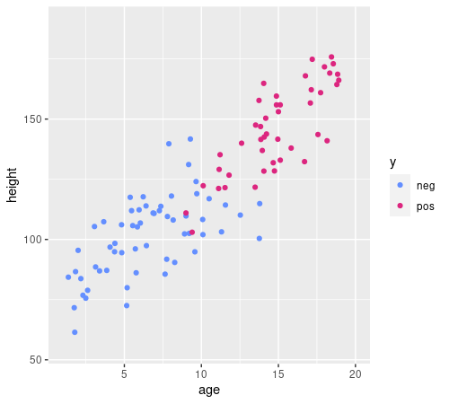
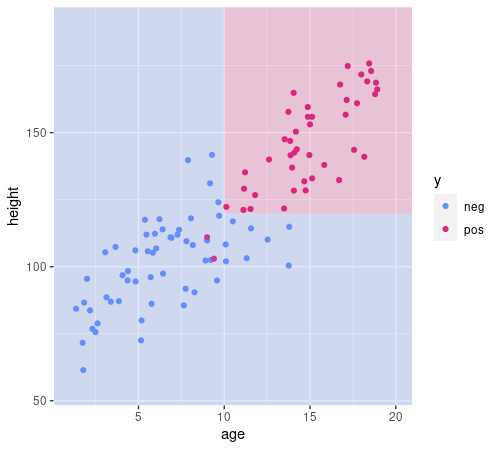
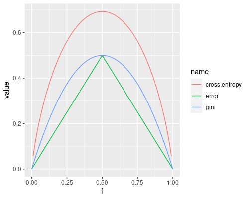
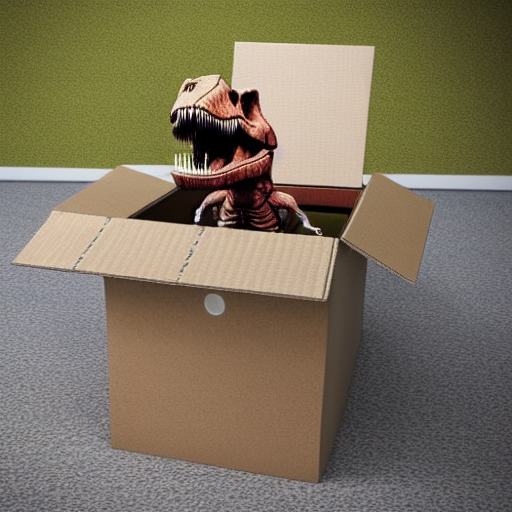

impurityclass: middle, center

# Tree-based learning techniques

---

## The carousel attendant

Once upon a time¹... there is an amusement park with a carousel and an **attendant** deciding who can ride and who cannot ride.
The park owner wants to replace the attendant with a **robotic gate**.

The owner call us as machine learning experts.

.w50p.center[]

.footnote[
1. For almost all the learning techniques, we'll (i) see a toy, but "realistic" problem, we'll (ii) try to learn a model by hands (i.e., **human learning**), and (iii) we'll try to translate the manual procedure into an automatic one (i.e., **machine learning**).
]

---

## Approaching the problem

.cols[
.c50[
1. Should we use ML? $\\rightarrow$ **yes**
2. Supervised vs. unsupervised $\\rightarrow$ **supervised**
3. Define the problem problem statement:
  - define $X$ and $Y$
  - feature engineering
  - define a way for assessing solutions
4. Design the ML system
5. Implement the ML system
6. Assess the ML system
]
.c50[
$X$ and $Y$
- $x$ is a person approaching the carousel
- $y$ is .col2[$\\text{can ride}$] or .col1[$\\text{cannot ride}$] (**binary class**)

Features (**chosen with domain expert**):
- person height (in cm)
- person age (in years)

Hence:
- $X = X\\subtext{height} \\times X\\subtext{age} = \\mathbb{R}^+ \\times \\mathbb{R}^+$
- $\\vect{x}=(x\\subtext{height}, x\\subtext{age})$ ($p=2$ **numeric independent variables**)
]
]

We (the ML expert and the domain expert) decide to **collect some data** $D=\\seq{(x^{(i)},y^{(i)}}{i}$ by observing the real system:
- it'll come handy for both learning and assessment

---

## Exploring the data

.cols[
.c50[
.w100p.center[]
<!--
d %>% ggplot(aes(age,height,color=y))+geom_point()+xlim(c(1,20))+ylim(c(55,190))+scale_color_manual(values=c("#648FFF", "#DC267F", "#FE6100", "#785EF0", "#FFB000"))
-->
]
.c50[
The data exploration suggests that using ML is not a *terrible* idea.

Assume we are computer scientists and we *like* `if-then-else` (nested) structures:
can we **manually** build an `if-then-else` structure that allows to make a decision.

**Requirements** (to keep it feasible manually):
- each `if` condition should:
  - involve **just one independent** variable
  - consist of a **threshold comparison**
- the decision has to be .col2[●] or .col1[●]

**Strategy**:
- tell apart points of different colors

]
]

---

## Building the `if-then-else`

.cols[
.c50[
.w100p.center[]
<!--
d %>% ggplot(aes(age,height,color=y))+geom_point()+xlim(c(1,20))+ylim(c(55,190))+scale_color_manual(values=c("#648FFF", "#DC267F", "#FE6100", "#785EF0", "#FFB000"))+annotate("rect",xmin=10,xmax=+Inf,ymin=-Inf,ymax=Inf,fill="#DC267F",alpha=0.2)+annotate("rect",xmin=-Inf,xmax=10,ymin=-Inf,ymax=Inf,fill="#648FFF",alpha=0.2)
-->
]
.c50[
.pseudo-code[
function $\\text{predict}(\\vect{x})$ {  
.i[]if $x\\subtext{age}\\le 10$ then {  
.i[].i[]return .col1[●]  
.i[]} else {  
.i[].i[]return .col2[●]  
.i[]}  
}
]

- requirements are met
- background color at position $\\vect{x}=(x\\subtext{age},x\\subtext{height})$ is the color the code above will assign to that $\\vect{x}$, i.e., $f\\subtext{predict}(\\vect{x})$
- most of the examples fall in the correct colored region
  - maybe the `else` branch is too rough

**Let's improve it!**
]
]

---

## Building the `if-then-else`

.cols[
.c50[
.w100p.center[]
<!--
d %>% ggplot(aes(age,height,color=y))+geom_point()+xlim(c(1,20))+ylim(c(55,190))+scale_color_manual(values=c("#648FFF", "#DC267F", "#FE6100", "#785EF0", "#FFB000"))+annotate("rect",xmin=10,xmax=+Inf,ymin=-Inf,ymax=120,fill="#648FFF",alpha=0.2)+annotate("rect",xmin=10,xmax=+Inf,ymin=120,ymax=Inf,fill="#DC267F",alpha=0.2)+annotate("rect",xmin=-Inf,xmax=10,ymin=-Inf,ymax=Inf,fill="#648FFF",alpha=0.2)
-->
]
.c50[
.pseudo-code[
function $\\text{predict}(\\vect{x})$ {  
.i[]if $x\\subtext{age}\\le 10$ then {  
.i[].i[]return .col1[●]  
.i[]} else {  
.i[].i[]if $x\\subtext{height}\\le 120$ then {  
.i[].i[].i[]return .col1[●]  
.i[].i[]} else {  
.i[].i[].i[]return .col2[●]  
.i[].i[]}  
.i[]}  
}
]

- requirements are met
- almost all the examples fall in the correct colored region

**Nice job!**
]
]

---

## The decision tree

.cols[
.c50[
This `if-then-else` nested structure can be represented as a **tree**:
.diagram.center.tree[
rect(100,0,140,40)
otext(170,20,'$x\\\\subtext{age}$ vs. $10$', 'small')
link([170,40,70,80])
otext(70,60,'$\\\\le$','small')
rect(45,80,50,40)
otext(70,100,'●','col1')
rect(200,80,140,40)
otext(270,60,'$>$','small')
link([170,40,270,80])
otext(270,100,'$x\\\\subtext{height}$ vs. $120$', 'small')
link([270,120,170,160])
otext(170,140,'$\\\\le$','small')
rect(145,160,50,40)
otext(170,180,'●','col1')
link([270,120,370,160])
otext(370,140,'$>$','small')
rect(345,160,50,40)
otext(370,180,'●','col2')
]
]
.c50[
.pseudo-code[
function $\\text{predict}(\\vect{x})$ {  
.i[]if $x\\subtext{age}\\le 10$ then {  
.i[].i[]return .col1[●]  
.i[]} else {  
.i[].i[]if $x\\subtext{height}\\le 120$ then {  
.i[].i[].i[]return .col1[●]  
.i[].i[]} else {  
.i[].i[].i[]return .col2[●]  
.i[].i[]}  
.i[]}  
}
]
]
]

We call this a .key[decision tree], since we use it inside an $f\\subtext{predict}$ for making a decision:
- it's a binary tree, since **nodes** have exactly 0 or 2 children
- non-terminal nodes (or **branch nodes**) hold a pair (independent variable, threshold)
- terminal nodes (or **leaf nodes**) hold one value $y \\in Y$

---

## De-hard-coding $f\\subtext{predict}$

.cols[
.c50[
**Now**: our human learned $f\\subtext{predict}$
.diagram.center[
link([0,25,75,25],'a')
rect(75,0,150,50)
link([225,25,300,25],'a')
otext(150,25,"$f\\\\subtext{predict}$")
otext(37.5,10,'$x$')
otext(262.5,10,'$y$')
]

.pseudo-code.compact[
function $\\text{predict}(\\vect{x})$ {  
.i[]if $x\\subtext{age}\\le 10$ then {  
.i[].i[]return .col1[●]  
.i[]} else {  
.i[].i[]if $x\\subtext{height}\\le 120$ then {  
.i[].i[].i[]return .col1[●]  
.i[].i[]} else {  
.i[].i[].i[]return .col2[●]  
.i[].i[]}  
.i[]}  
}
]
]
.c50[
**Goal**: a $f'\\subtext{predict}$ working on any tree
.diagram.center[
link([0,25,75,25],'a')
rect(75,0,150,50)
link([225,25,300,25],'a')
otext(150,25,"$f'\\\\subtext{predict}$")
otext(37.5,10,'$\\\\vect{x},m$')
otext(262.5,10,'$y$')
]

.pseudo-code.compact[
function $\\text{predict}(\\vect{x}, m)$ {  
.i[]...  
}
]
]
]

We *human learned* (i.e., manually designed) a function where the **decision tree** is **hard-coded** in the $\\text{predict}()$ function in the form of an `if-then-else` structure:
- can we *pull out* the decision tree out of it and make $\\text{predict}()$ a templated function?

---

## Formalizing the decision tree

.cols[
.c50[
**Scenario**: classification with multivariate numerical features:
- $X = X\_1 \\times \\dots \\times X\_p$, with each $X\_i\\subseteq\\mathbb{R}$
  - we write $\\vect{x} = (x\_1,\\dots,x\_p)=(x\_i)\_i$
- $Y$, finite without ordering

The **model** $t \\in T\_{p,Y}$ is a decision tree defined over $X\_1 \\times \\dots \\times X\_p,Y$, i.e.:
- each $t$ is a binary tree
- each **non-terminal** node is .note[labeled with] a **pair $(j,\\tau)$**, with $j \\in \\{1,\\dots,p\\}$ and $\\tau \\in \\mathbb{R}$
  - $j$ is the index of the independent variable
  - $\\tau$ is a threshold for comparison
- each **terminal** node is .note[labeled with] a $y \\in Y$
]
.c50[
.diagram.center.tree[
rect(100,0,140,40)
otext(170,20,'$x\\\\subtext{age}$ vs. $10$', 'small')
link([170,40,70,80])
otext(70,60,'$\\\\le$','small')
rect(45,80,50,40)
otext(70,100,'●','col1')
rect(200,80,140,40)
otext(270,60,'$>$','small')
link([170,40,270,80])
otext(270,100,'$x\\\\subtext{height}$ vs. $120$', 'small')
link([270,120,170,160])
otext(170,140,'$\\\\le$','small')
rect(145,160,50,40)
otext(170,180,'●','col1')
link([270,120,370,160])
otext(370,140,'$>$','small')
rect(345,160,50,40)
otext(370,180,'●','col2')
]
]
]

---

## Compact representation of (binary) trees

.cols[
.c50[
We represent a tree $t \\in T\_L$ as:
.center[$t = \\tree{\\htmlClass{col3}{l}}{\\htmlClass{col4}{t'}}{\\htmlClass{col4}{t''}}$]
where $t', t'' \\in T\_L \\cup \\{\\varnothing\\}$ are the left and right .col4[**children**] trees and $l \\in L$ is the .col3[**label**].

If the tree is a **terminal node**¹, it has no children (i.e., $t'=t''=\\varnothing$) and we write:
.center[$t = \\tree{l}{\\varnothing}{\\varnothing}=\\treel{l}$]

**For decision trees**:
- $L= (\\{1,\\dots,p\\} \\times \\mathbb{R}) \\cup Y$, that is, a label can be a pair $(j,\\tau)$ or a $y$
- if $l \\in Y$, then $t'=t''=\\varnothing$

We shorten $T\_{(\\{1,\\dots,p\\} \\times \\mathbb{R}) \\cup Y}$ as $T\_{p,Y}$.

]
.c40[
.diagram.center.tree[
rect(100,0,140,40)
otext(170,20,'$x\\\\subtext{age}$ vs. $10$', 'small')
link([170,40,70,80])
otext(70,60,'$\\\\le$','small')
rect(45,80,50,40)
otext(70,100,'●','col1')
rect(200,80,140,40)
otext(270,60,'$>$','small')
link([170,40,270,80])
otext(270,100,'$x\\\\subtext{height}$ vs. $120$', 'small')
link([270,120,170,160])
otext(170,140,'$\\\\le$','small')
rect(145,160,50,40)
otext(170,180,'●','col1')
link([270,120,370,160])
otext(370,140,'$>$','small')
rect(345,160,50,40)
otext(370,180,'●','col2')
]

With:
- $X=X\\subtext{age} \\times X\\subtext{height} = X\_1 \\times X\_2$
- $Y=\\set{\\htmlClass{col1}{●},\\htmlClass{col2}{●}}$

This tree is:
.center[$t = \\tree{(1,10)}{\\treel{\\htmlClass{col1}{●}}}{\\tree{(2,120)}{\\treel{\\htmlClass{col1}{●}}}{\\treel{\\htmlClass{col2}{●}}}}$]

.note[Would you be able to write a parser for this?]
]
]

.footnote[
1. Actually, node = tree, i.e., a node is a tree and a tree is a node!
]

---

## Templated $f'\\subtext{predict}$

.cols[
.c50[
.pseudo-code.compact[
function $\\text{predict}(\\vect{x}, t)$ {  
.i[]if $\\neg\\text{has-children}(t)$ then {  
.i[].i[]$y \\gets \\text{label-of}(t)$  
.i[].i[]return $y$  
.i[]} else { .comment[//hence $r$ is a branch node]  
.i[].i[]$(j, \\tau) \\gets \\text{label-of}(t)$  
.i[].i[]if $x\_j \\le \\tau$ then {  
.i[].i[].i[]return $\\text{predict}(\\vect{x}, \\text{left-child-of}(t))$ .comment[//recursion]  
.i[].i[]} else {  
.i[].i[].i[]return $\\text{predict}(\\vect{x}, \\text{right-child-of}(t))$ .comment[//recursion]  
.i[].i[]}  
.i[]}  
}
]
]
.c50[
- $\\text{has-children}(t)$ is true iff $t$ is not terminal
- $\\text{label-of}(t)$ returns the label of $t$
  - a $y \\in Y$ for terminal nodes
  - a $(j,\\tau) \\in \\{1,\\dots,p\\} \\times \\mathbb{R}$ for non-terminal nodes
- $\\text{left-child-of}(t)$ and $\\text{right-child-of}(t)$ return the left or right child of $t$
  - that are other trees, in general
]
]

.cols[
.c50[
It's a **recursive** function that:
- works with any $t \\in T\_{p,Y}$ and any $\\vect{x} \\in \\mathbb{R}^p$
- always returns a $y \\in Y$
]
.c50[
.diagram.center[
link([0,25,75,25],'a')
rect(75,0,150,50)
link([225,25,300,25],'a')
otext(150,25,"$f'\\\\subtext{predict}$")
otext(37.5,10,'$\\\\vect{x},t$')
otext(262.5,10,'$y$')
]
]
]

---

## $f'\\subtext{predict}$ application example

.cols[
.c60[
**1st call**: .compact[$\\vect{x}=(14,155), t = \\tree{(1,10)}{\\treel{\\htmlClass{col1}{●}}}{\\tree{(2,120)}{\\treel{\\htmlClass{col1}{●}}}{\\treel{\\htmlClass{col2}{●}}}}$]

.compact[
$\\neg\\text{has-children}(t)=\\text{false}$  
$(j,\\tau)=(1,10)$  
$x\_1 \\le 10 = \\text{false}$  
$\\text{right-child-of}(r)= \\tree{(2,120)}{\\treel{\\htmlClass{col1}{●}}}{\\treel{\\htmlClass{col2}{●}}}$
]

.i[]**2nd call**: .compact[$\\vect{x}=(14,155), t = \\tree{(2,120)}{\\treel{\\htmlClass{col1}{●}}}{\\treel{\\htmlClass{col2}{●}}}$]

.i[]$\\neg\\text{has-children}(t)=\\text{false}$  
.i[]$(j,\\tau)=(2,120)$  
.i[]$x\_2 \\le 120 = \\text{false}$  
.i[]$\\text{right-child-of}(r)= [\\htmlClass{col2}{●}]$

.i[].i[]**3rd call**: .compact[$\\vect{x}=(14,155), t = \\treel{\\htmlClass{col2}{●}}$]

.i[].i[]$\\neg\\text{has-children}(t)=\\text{true}$  
.i[].i[]$y=\\htmlClass{col2}{●}$ .note[return return return]
]
.c40[
.pseudo-code.compact[
function $\\text{predict}(\\vect{x}, t)$ {  
.i[]if $\\neg\\text{has-children}(t)$ then {  
.i[].i[]$y \\gets \\text{label-of}(t)$  
.i[].i[]return $y$  
.i[]} else {  
.i[].i[]$(j, \\tau) \\gets \\text{label-of}(t)$  
.i[].i[]if $x\_j \\le \\tau$ then {  
.i[].i[].i[]return $\\text{predict}(\\vect{x}, \\text{left-child-of}(t))$  
.i[].i[]} else {  
.i[].i[].i[]return $\\text{predict}(\\vect{x}, \\text{right-child-of}(t))$  
.i[].i[]}  
.i[]}  
}
}
]
]
]
---

## Towards tree learning

We have our $f'\\subtext{predict}: \\mathbb{R}^p \\times T\_{p,Y} \\to Y$; for having a learning technique we miss only the learning function, i.e., $f'\\subtext{learn}: \\mathcal{P}^*(\\mathbb{R}^p, Y) \\to T\_{p,Y}$:
.diagram.center[
link([0,25,150,25],'a')
rect(150,0,150,50)
link([300,25,400,25],'a')
otext(225,25,"$f'\\\\subtext{learn}$")
otext(75,10,'$\\\\seq{(\\\\vect{x}^{(i)},y^{(i)})}{i}$')
otext(350,10,'$t$')
]

What we did manually (i.e., how we *human learned*):
1. **until** we are satisfied
2. put a vertical/horizontal line that **well separates** the data
3. **repeat** from step 1 once for each on the two resulting regions

Let's rewrite it as (pseudo-)code!

---

## Recursive binary splitting

.cols[
.c60[
.pseudo-code.compact[
function $\\text{learn}(\\seq{(\\vect{x}^{(i)},y^{(i)})}{i})$ {  
.i[]if .col1[$\\text{should-stop}(\\seq{y^{(i)}}{i})$] then {  
.i[].i[]$y^\\star \\gets \\argmax\_{y \\in Y} \\sum\_i \\mathbf{1}(y^{(i)}=y)$ .comment[//$y^\\star$ is the most frequent class]  
.i[].i[]return $\\text{node-from}(y^\\star,\\varnothing,\\varnothing)$  
.i[]} else { .comment[//hence $r$ is a branch node]  
.i[].i[].col2[$(j, \\tau) \\gets \\text{find-best-branch}(\\seq{(\\vect{x}^{(i)},y^{(i)})}{i})$]  
.i[].i[]$t \\gets \\text{node-from}($  
.i[].i[].i[]$(j,\\tau),$  
.i[].i[].i[]$\\htmlClass{col3}{\\text{learn}(\\seq{(\\vect{x}^{(i)},y^{(i)})}{i}\\big\\rvert\_{x\_j \\le \\tau})},$ .comment[//recursion]  
.i[].i[].i[]$\\htmlClass{col3}{\\text{learn}(\\seq{(\\vect{x}^{(i)},y^{(i)})}{i}\\big\\rvert\_{x\_j > \\tau})}$ .comment[//recursion]  
.i[].i[])  
.i[].i[]return $t$  
.i[]}  
}
]
]
.c40[
.diagram.center[
link([0,25,150,25],'a')
rect(150,0,150,50)
link([300,25,400,25],'a')
otext(225,25,"$f'\\\\subtext{learn}$")
otext(75,10,'$\\\\seq{(\\\\vect{x}^{(i)},y^{(i)})}{i}$')
otext(350,10,'$t$')
]

1. .col1[until we are satisfied]
2. .col2[put a vertical/horizontal line that well separates the data]
3. .col3[repeat step 1 once for each on the two resulting regions]

.note[
$\\seq{(\\vect{x}^{(i)},y^{(i)})}{i}\\big\\rvert\_{x\_j \\le \\tau}$ is the sub-multiset of $\\seq{(\\vect{x}^{(i)},y^{(i)})}{i}$ composed of pairs for which $x\_j \\le \\tau$
]
]
]

This $f'\\subtext{learn}$ is called .key[recursive binary splitting]:
- it's **recursive**
- when recurses, **splits** the data in two parts (**binary**)
  - it's a top-down approach: starts from the big problem and makes it smaller (**dividi-et-impera**)
- when stopping recursion, put a node with the **most frequent class**

---

## Finding the best branch

**Intuitively**:
- consider all variables (i.e., all $j$) and *all*¹ threshold values
- choose the pair (variable, threshold) that best separate the data
  - i.e., that results in the lowest rate of **misclassified** examples

.cols[
.c60[
**In detail** (and formally):
.pseudo-code.compact[
function $\\text{find-best-branch}(\\seq{(\\vect{x}^{(i)},y^{(i)})}{i})$ {  
.i[]$(j^\\star, \\tau^\\star) \\gets \\argmin\_{j,\\tau} \\left(\\text{error}(\\htmlClass{col1}{\\seq{y^{(i)}}{i}\\big\\rvert\_{x\_j \\le \\tau}})+\\text{error}(\\htmlClass{col1}{\\seq{y^{(i)}}{i}\\big\\rvert\_{x\_j > \\tau}})\\right)$  
.i[]return $(j^\\star, \\tau^\\star)$  
}
]
and
.pseudo-code.compact[
function $\\text{error}(\\seq{y^{(i)}}{i})$ { .comment[//the error of the dummy classifier on $\\seq{y^{(i)}}{i}$]  
.i[].col2[$y^\\star \\gets \\argmax\_y \\sum\_i \\mathbf{1}(y^{(i)}=y)$] .comment[//$y^\\star$ is the most freq class]  
.i[]return .col2[$\\frac{1}{n} \\sum\_i \\mathbf{1}(y^{(i)} \\ne y^\\star)$] .comment[//$n=|\\seq{y^{(i)}}{i}|$]  
}
]
]
.c40[
**Interpretation**: if we .col1[split the data at this point] (i.e., a $(j, \\tau)$ pair) and use one .col2[dummy classifier] on each of the two sides, what would be the resulting error?

This approach is **greedy**, since it tries to obtain the maximum result (finding the branch), with the minimum effort (using just two dummy classifiers later on):
- in practice, it makes this learning technique **computationally light**!
]
]

.footnote[
1. you just need to consider, for each $j$-th feature, the **midpoints** of $(x\_j^{(i)})\_i$: at most $n$ of them
]

---

## Deciding when to stop (recursion)

**Intuitively**:
- if all the examples belong to the .col1[same class], stop
  - splitting would be pointless!
- or, if the number examples is .col2[very small], stop .note[$\\approx$ what we did while *human learning*]
  - no need to bother

.cols[
.c50[
**In detail** (and formally):
.pseudo-code.compact[
function $\\text{should-stop}(\\seq{y^{(i)}}{i}, n\\subtext{min})$ {  
.i[]if .col1[$\\text{error}(\\seq{y^{(i)}}{i})=0$] then {  
.i[].i[] return $\\text{true}$;  
.i[]}  
.i[]if .col2[$n \\le n\\subtext{min}$] then { .comment[//$n=|\\seq{y^{(i)}}{i}|$]  
.i[].i[] return $\\text{true}$;  
.i[]}  
.i[]return $\\text{false}$  
}
]
]
.c50[
- only $\\seq{y^{(i)}}{i}$ is needed to decide whether to stop, $\\seq{x^{(i)}}{i}$ is not used!
- $n\\subtext{min}$ is a **parameter** of $f\\subtext{should-stop}$
  - it represents the "very small" criterion
  - it propagates to $f'\\subtext{learn}$, which uses $f\\subtext{should-stop}$
  - (also denoted as $k\\subtext{min}$)
- since $\\text{error()}$ is the classification error done by the dummy classifier, it is $=0$ iff the most frequent class $y^\\star$ is the only class in $\\seq{y^{(i)}}{i}$
]
]

---

## $f'\\subtext{learn}$ application example

.cols[
.c60.compact[

.cols.pcompact[
.c40[
**1st call:**  
$(j,\\tau) = (1,7)$
]
.c60[
.diagram.neutral.center[
link([-10,5,310,5],'a coln')
link([0,0,0,10],'coln')
otext(0,-10,'0')
otext(300,-10,'10')
link([30,0,30,10],'coln')
link([60,0,60,10],'coln')
link([90,0,90,10],'coln')
link([120,0,120,10],'coln')
link([150,0,150,10],'coln')
link([180,0,180,10],'coln')
link([210,0,210,10],'col3')
link([240,0,240,10],'coln')
link([270,0,270,10],'coln')
link([300,0,300,10],'coln')
otext(15,-5,'●','col1')
otext(45,-5,'●','col1')
otext(75,-5,'●','col2')
otext(105,-5,'●','col2')
otext(135,-5,'●','col1')
otext(165,-5,'●','col1')
otext(195,-5,'●','col2')
otext(225,-5,'●','col3')
otext(255,-5,'●','col3')
otext(285,-5,'●','col3')
otext(30,20,'$\\\\htmlClass{col1}{\\\\frac{0}{1}} \\\\htmlClass{col1}{\\\\frac{6}{9}}$','smaller')
otext(60,20,'$\\\\htmlClass{col1}{\\\\frac{0}{2}} \\\\htmlClass{col2}{\\\\frac{5}{8}}$','smaller')
otext(90,20,'$\\\\htmlClass{col1}{\\\\frac{1}{3}} \\\\htmlClass{col3}{\\\\frac{4}{7}}$','smaller')
otext(120,20,'$\\\\htmlClass{col1}{\\\\frac{2}{4}} \\\\htmlClass{col3}{\\\\frac{3}{6}}$','smaller')
otext(150,20,'$\\\\htmlClass{col1}{\\\\frac{2}{5}} \\\\htmlClass{col3}{\\\\frac{2}{5}}$','smaller')
otext(180,20,'$\\\\htmlClass{col1}{\\\\frac{2}{6}} \\\\htmlClass{col3}{\\\\frac{1}{4}}$','smaller')
otext(210,20,'$\\\\htmlClass{col1}{\\\\frac{3}{7}} \\\\htmlClass{col3}{\\\\frac{0}{3}}$','smaller')
otext(240,20,'$\\\\htmlClass{col1}{\\\\frac{4}{8}} \\\\htmlClass{col3}{\\\\frac{0}{2}}$','smaller')
otext(270,20,'$\\\\htmlClass{col1}{\\\\frac{5}{9}} \\\\htmlClass{col3}{\\\\frac{0}{1}}$','smaller')
]
]
]

.cols.pcompact[
.c40[
.i[]**1st-l call:**  
.i[]$(j,\\tau) = (1,2)$
]
.c60[
.diagram.neutral.center[
link([-10,5,310,5],'a coln')
link([0,0,0,10],'coln')
otext(0,-10,'0')
otext(300,-10,'10')
link([30,0,30,10],'coln')
link([60,0,60,10],'col3')
link([90,0,90,10],'coln')
link([120,0,120,10],'coln')
link([150,0,150,10],'coln')
link([180,0,180,10],'coln')
link([210,0,210,10],'coln')
link([240,0,240,10],'coln')
link([270,0,270,10],'coln')
link([300,0,300,10],'coln')
otext(15,-5,'●','col1')
otext(45,-5,'●','col1')
otext(75,-5,'●','col2')
otext(105,-5,'●','col2')
otext(135,-5,'●','col1')
otext(165,-5,'●','col1')
otext(195,-5,'●','col2')
otext(30,20,'$\\\\htmlClass{col1}{\\\\frac{0}{1}} \\\\htmlClass{col1}{\\\\frac{3}{6}}$','smaller')
otext(60,20,'$\\\\htmlClass{col1}{\\\\frac{0}{2}} \\\\htmlClass{col2}{\\\\frac{2}{5}}$','smaller')
otext(90,20,'$\\\\htmlClass{col1}{\\\\frac{1}{3}} \\\\htmlClass{col1}{\\\\frac{2}{4}}$','smaller')
otext(120,20,'$\\\\htmlClass{col1}{\\\\frac{2}{4}} \\\\htmlClass{col1}{\\\\frac{1}{3}}$','smaller')
otext(150,20,'$\\\\htmlClass{col1}{\\\\frac{2}{5}} \\\\htmlClass{col1}{\\\\frac{1}{2}}$','smaller')
otext(180,20,'$\\\\htmlClass{col1}{\\\\frac{2}{6}} \\\\htmlClass{col1}{\\\\frac{0}{1}}$','smaller')
]
]
]

.cols.pcompact[
.c40[
.i[].i[]**1st-l-l call:**  
.i[].i[]return $\\treel{\\htmlClass{col1}{●}}$
]
.c60[
.diagram.neutral.center[
link([-10,5,310,5],'a coln')
link([0,0,0,10],'coln')
otext(0,-10,'0')
otext(300,-10,'10')
link([30,0,30,10],'coln')
link([60,0,60,10],'coln')
link([90,0,90,10],'coln')
link([120,0,120,10],'coln')
link([150,0,150,10],'coln')
link([180,0,180,10],'coln')
link([210,0,210,10],'coln')
link([240,0,240,10],'coln')
link([270,0,270,10],'coln')
link([300,0,300,10],'coln')
otext(15,-5,'●','col1')
otext(45,-5,'●','col1')
]
]
]

.cols.pcompact[
.c40[
.i[].i[]**1st-l-r call:**  
.i[].i[]$(j,\\tau) = (1,4)$
]
.c60[
.diagram.neutral.center[
link([-10,5,310,5],'a coln')
link([0,0,0,10],'coln')
otext(0,-10,'0')
otext(300,-10,'10')
link([30,0,30,10],'coln')
link([60,0,60,10],'coln')
link([90,0,90,10],'coln')
link([120,0,120,10],'col3')
link([150,0,150,10],'coln')
link([180,0,180,10],'coln')
link([210,0,210,10],'coln')
link([240,0,240,10],'coln')
link([270,0,270,10],'coln')
link([300,0,300,10],'coln')
otext(75,-5,'●','col2')
otext(105,-5,'●','col2')
otext(135,-5,'●','col1')
otext(165,-5,'●','col1')
otext(195,-5,'●','col2')
otext(90,20,'$\\\\htmlClass{col2}{\\\\frac{0}{1}} \\\\htmlClass{col2}{\\\\frac{2}{4}}$','smaller')
otext(120,20,'$\\\\htmlClass{col2}{\\\\frac{0}{2}} \\\\htmlClass{col1}{\\\\frac{1}{3}}$','smaller')
otext(150,20,'$\\\\htmlClass{col2}{\\\\frac{1}{3}} \\\\htmlClass{col1}{\\\\frac{1}{2}}$','smaller')
otext(180,20,'$\\\\htmlClass{col2}{\\\\frac{2}{4}} \\\\htmlClass{col2}{\\\\frac{0}{1}}$','smaller')
]
]
]

.cols.pcompact[
.c40[
.i[].i[].i[]**1st-l-r-l call:**  
.i[].i[].i[]return $\\treel{\\htmlClass{col2}{●}}$
]
.c60[
.diagram.neutral.center[
link([-10,5,310,5],'a coln')
link([0,0,0,10],'coln')
otext(0,-10,'0')
otext(300,-10,'10')
link([30,0,30,10],'coln')
link([60,0,60,10],'coln')
link([90,0,90,10],'coln')
link([120,0,120,10],'coln')
link([150,0,150,10],'coln')
link([180,0,180,10],'coln')
link([210,0,210,10],'coln')
link([240,0,240,10],'coln')
link([270,0,270,10],'coln')
link([300,0,300,10],'coln')
otext(75,-5,'●','col2')
otext(105,-5,'●','col2')
]
]
]

.cols.pcompact[
.c40[
.i[].i[].i[]**1st-l-r-r call:**  
.i[].i[].i[]return $\\treel{\\htmlClass{col1}{●}}$
]
.c60[
.diagram.neutral.center[
link([-10,5,310,5],'a coln')
link([0,0,0,10],'coln')
otext(0,-10,'0')
otext(300,-10,'10')
link([30,0,30,10],'coln')
link([60,0,60,10],'coln')
link([90,0,90,10],'coln')
link([120,0,120,10],'coln')
link([150,0,150,10],'coln')
link([180,0,180,10],'coln')
link([210,0,210,10],'coln')
link([240,0,240,10],'coln')
link([270,0,270,10],'coln')
link([300,0,300,10],'coln')
otext(135,-5,'●','col1')
otext(165,-5,'●','col1')
otext(195,-5,'●','col2')
]
]
]

.i[].i[]return $\\tree{(1,4)}{\\treel{\\htmlClass{col2}{●}}}{\\treel{\\htmlClass{col1}{●}}}$  
.i[]return $\\tree{(1,2)}{\\treel{\\htmlClass{col1}{●}}}{\\tree{(1,4)}{\\treel{\\htmlClass{col2}{●}}}{\\treel{\\htmlClass{col1}{●}}}}$

.cols.pcompact[
.c40[
.i[]**1st-r call:**  
.i[]return $\\treel{\\htmlClass{col3}{●}}$
]
.c60[
.diagram.neutral.center[
link([-10,5,310,5],'a coln')
link([0,0,0,10],'coln')
otext(0,-10,'0')
otext(300,-10,'10')
link([30,0,30,10],'coln')
link([60,0,60,10],'coln')
link([90,0,90,10],'coln')
link([120,0,120,10],'coln')
link([150,0,150,10],'coln')
link([180,0,180,10],'coln')
link([210,0,210,10],'coln')
link([240,0,240,10],'coln')
link([270,0,270,10],'coln')
link([300,0,300,10],'coln')
otext(225,-5,'●','col3')
otext(255,-5,'●','col3')
otext(285,-5,'●','col3')
]
]
]

return $\\tree{(1,7)}{\\tree{(1,2)}{\\treel{\\htmlClass{col1}{●}}}{\\tree{(1,4)}{\\treel{\\htmlClass{col2}{●}}}{\\treel{\\htmlClass{col1}{●}}}}}{\\treel{\\htmlClass{col3}{●}}}$

]
.c40.compact[
Assume:
- $X=\\mathbb{R}^1=\\mathbb{R}$, $Y=\\{\\htmlClass{col1}{●},\\htmlClass{col2}{●},\\htmlClass{col3}{●}\\}$
- $n\\subtext{min}=3$

.pseudo-code.compact[
function $\\text{learn}(\\seq{(\\vect{x}^{(i)},y^{(i)})}{i}, n\\subtext{min})$ {  
.i[]if $\\text{should-stop}(\\seq{y^{(i)}}{i}, n\\subtext{min})$ then {  
.i[].i[]$y^\\star \\gets \\argmax\_{y \\in Y} \\sum\_i \\mathbf{1}(y^{(i)}=y)$  
.i[].i[]return $\\text{node-from}(y^\\star,\\varnothing,\\varnothing)$  
.i[]} else {  
.i[].i[]$(j, \\tau) \\gets \\text{find-best-branch}(\\seq{(\\vect{x}^{(i)},y^{(i)})}{i})$  
.i[].i[]$t \\gets \\text{node-from}($  
.i[].i[].i[]$(j,\\tau),$  
.i[].i[].i[]$\\text{learn}(\\seq{(\\vect{x}^{(i)},y^{(i)})}{i}\\big\\rvert\_{x\_j \\le \\tau}, n\\subtext{min}),$  
.i[].i[].i[]$\\text{learn}(\\seq{(\\vect{x}^{(i)},y^{(i)})}{i}\\big\\rvert\_{x\_j > \\tau}, n\\subtext{min})$  
.i[].i[])  
.i[].i[]return $t$  
.i[]}  
}
]
]
]

.note[
What's the accuracy of this $t$ on the learning set?
]

---

## Alternatives for $\\text{find-best-branch}()$

.pseudo-code.compact[
function $\\text{find-best-branch}(\\seq{(\\vect{x}^{(i)},y^{(i)})}{i})$ {  
.i[]$(j^\\star, \\tau^\\star) \\gets \\argmin\_{j,\\tau} \\left(\\htmlClass{col1}{\\text{error}(\\seq{y^{(i)}}{i}\\big\\rvert\_{x\_j \\le \\tau}})+\\htmlClass{col1}{\\text{error}(\\seq{y^{(i)}}{i}\\big\\rvert\_{x\_j > \\tau}})\\right)$  
.i[]return $(j^\\star, \\tau^\\star)$  
}
]

$\\text{error}(\\seq{y^{(i)}}{i})$ is the error the dummy classifier would do on $\\seq{y^{(i)}}{i}$:
.center[$\\htmlClass{col1}{\\text{error}(\\seq{y^{(i)}}{i})}=1 - \\max\_y \\freq{y, \\seq{y^{(i)}}{i}}$]

Instead of $\\text{error}()$, two other variants can be used:
- **Gini index**: $\\htmlClass{col1}{\\text{gini}(\\seq{y^{(i)}}{i})}=\\sum\_y \\freq{y, \\seq{y^{(i)}}{i}} \\left(1-\\freq{y, \\seq{y^{(i)}}{i}}\\right)$
- **Cross entropy**: $\\htmlClass{col1}{\\text{cross-entropy}(\\seq{y^{(i)}}{i})}=-\\sum\_y \\freq{y, \\seq{y^{(i)}}{i}} \\log \\freq{y, \\seq{y^{(i)}}{i}}$

--

For all:
.cols[
.c70[
- **the lower, the better**
- they measure the .key[node impurity], i.e., the *amount* $e$ of cases different from the most frequent one among the examples *arrived* at a certain node
]
.c30[
.diagram.center[
link([0,25,75,25],'a')
rect(75,0,150,50)
link([225,25,325,25],'a')
otext(150,25,"$f\\\\subtext{impurity}$")
otext(37.5,10,'$\\\\seq{y^{(i)}}{i}$')
otext(275,10,'$e \\\\in \\\\mathbb{R}^+$')
]
]
]

---

## Node impurity

.pseudo-code.compact[
function $\\text{find-best-branch}(\\seq{(\\vect{x}^{(i)},y^{(i)})}{i}, \\htmlClass{col1}{f\\subtext{impurity}})$ {  
.i[]$(j^\\star, \\tau^\\star) \\gets \\argmin\_{j,\\tau} \\left(\\htmlClass{col1}{f\\subtext{impurity}(\\seq{y^{(i)}}{i}\\big\\rvert\_{x\_j \\le \\tau}})+\\htmlClass{col1}{f\\subtext{impurity}(\\seq{y^{(i)}}{i}\\big\\rvert\_{x\_j > \\tau}})\\right)$  
.i[]return $(j^\\star, \\tau^\\star)$  
}
]

The way to measure the node impurity might be a .col1[parameter] of $\\text{find-best-branch}()$, but it has been found that **Gini is better** for learning trees than error.

.cols[
.c40[
.h30ex.center[]
<!--
f=seq(0,1,length.out=100)
error = 1-pmax(f,1-f)
gini = 2*f*(1-f)
cross.entropy = -f*log(f)-(1-f)*log(1-f)
as.data.frame(cbind(f,error,gini,cross.entropy)) %>% pivot_longer(!f,values_to="impurity") %>% ggplot(aes(x=f,y=impurity,color=name))+geom_line()
-->
]
.c60[
Here, for binary classification:
- on the $x$-axis: the frequency $f=\\freq{\\text{pos}, \\seq{y^{(i)}}{i}}$ of the positive class
  - $f=0.5$ (.col1[●].col1[●].col1[●].col2[●].col2[●].col2[●]) is the worst case
  - $f=0$ (.col1[●].col1[●].col1[●].col1[●].col1[●].col1[●]) and $f=1$ (.col2[●].col2[●].col2[●].col2[●].col2[●].col2[●]) are the best cases
- on the $y$-axis: the three impurity indexes

Gini and cross-entropy are **smoother** than the error.
]
]

---

## Alternatives for $\\text{should-stop}()$

.cols[
.c50[
*Original* version: (**data size**)
- no errors or
- too few examples

.center[.col1[$\\text{error}(\\seq{y^{(i)}}{i})=0$] or .col1[$n \\le n\\subtext{min}$]]

Alternative 1 (**tree depth**):
- no errors or
- node depth deeper than $\\tau_m$

.note[requires propagating recursively the depth of the node being currently built]

Alternative 1 (**node impurity**):
- impurity lower than a $\\tau\_\\epsilon$

]
.c50[
.pseudo-code.compact[
function $\\text{should-stop}(\\seq{y^{(i)}}{i}, n\\subtext{min})$ {  
.i[]if .col1[$\\text{error}(\\seq{y^{(i)}}{i})=0$] then {  
.i[].i[] return $\\text{true}$;  
.i[]}  
.i[]if .col1[$n \\le n\\subtext{min}$] then { .comment[//$n=|\\seq{y^{(i)}}{i}|$]  
.i[].i[] return $\\text{true}$;  
.i[]}  
.i[]return $\\text{false}$  
}
]

Impact of the parameter:
- the lower $n\\subtext{min}$, the **larger** the tree
- the greater $\\tau\_m$, the **larger** the tree
- the lower $\\tau\_\\epsilon$, the **larger** the tree

(for the same dataset, in general)
]
]

---

## Tree learning with probability

.cols[
.c40[
Learning technique with probability:
- $f'\\subtext{learn}: \\mathcal{P}^*(X,Y) \\to M$
- $f''\\subtext{predict}: X \\times M \\to P\_Y$
]
.c60[
.diagram.center[
link([0,50,125,50],'a')
link([75,35,125,35],'a')
rect(50,0,425,100)
rect(125,25,100,50)
link([225,50,275,50],'a')
rect(275,25,150,50)
link([425,50,550,50],'a')
otext(25,35,'$x$')
otext(100,20,'$m$')
otext(175,50,"$f''\\\\subtext{predict}$")
otext(250,35,'$p$')
otext(350,50,"$\\\\argmax\\\\sub{y \\\\in Y}$")
otext(512.5,35,'$y$')
]
]
]

For tree learning:
- $f'\\subtext{learn}: \\htmlClass{col1}{\\mathcal{P}^*(X\_1 \\times \\dots \\times X\_p,Y)} \\to \\htmlClass{col2}{T\_{(\\{1,\\dots,p\\}\\times\\mathbb{R}) \\cup P\_Y}}$
  - given a .col1[multivariate dataset], returns a .col2[tree] in $T\_{(\\{1,\\dots,p\\}\\times\\mathbb{R}) \\cup P\_Y}$
- $f''\\subtext{predict}: \\htmlClass{col1}{X\_1 \\times \\dots \\times X\_p} \\times \\htmlClass{col2}{T\_{(\\{1,\\dots,p\\}\\times\\mathbb{R}) \\cup P\_Y}} \\to \\htmlClass{col3}{P\_Y}$
  - given a .col1[multivariate observation] and a .col2[tree], returns a .col3[discrete probability distribution] $p \\in P\_Y$

Set of trees $T\_{\\htmlClass{col1}{(\\{1,\\dots,p\\}\\times\\mathbb{R})} \\cup \\htmlClass{col2}{P\_Y}}$:
- $L=\\htmlClass{col1}{(\\{1,\\dots,p\\}\\times\\mathbb{R})} \\cup \\htmlClass{col2}{P\_Y}$ is the set of node labels
- $\\htmlClass{col1}{(\\{1,\\dots,p\\}\\times\\mathbb{R})}$ are branch node labels
- $\\htmlClass{col2}{P\_Y}$ are terminal node labels
  - i.e., terminal nodes **return discrete probabiliy distributions**

---

## $f'\\subtext{learn}$ with probability

.cols[
.c50[
.pseudo-code.compact[
function $\\text{learn}(\\seq{(\\vect{x}^{(i)},y^{(i)})}{i}, n\\subtext{min})$ {  
.i[]if $\\text{should-stop}(\\seq{y^{(i)}}{i}, n\\subtext{min})$ then {  
.i[].i[].col1[$p \\gets y \\mapsto \\freq{y, \\seq{y^{(i)}}{i}}$]  
.i[].i[].col1[return $p$]  
.i[]} else {  
.i[].i[]$(j, \\tau) \\gets \\text{find-best-branch}(\\seq{(\\vect{x}^{(i)},y^{(i)})}{i})$  
.i[].i[]$t \\gets \\text{node-from}($  
.i[].i[].i[]$(j,\\tau),$  
.i[].i[].i[]$\\text{learn}(\\seq{(\\vect{x}^{(i)},y^{(i)})}{i}\\big\\rvert\_{x\_j \\le \\tau}, n\\subtext{min}),$  
.i[].i[].i[]$\\text{learn}(\\seq{(\\vect{x}^{(i)},y^{(i)})}{i}\\big\\rvert\_{x\_j > \\tau}, n\\subtext{min})$  
.i[].i[])  
.i[].i[]return $t$  
.i[]}  
}
]
]
.c50[
- $y \\mapsto \\freq{y, \\seq{y^{(i)}}{i}}$ is a way to specify the concrete function that, given a $y \\in Y$ returns its frequency $\\freq{y, \\seq{y^{(i)}}{i}} \\in [0,1]$
- "$p \\gets \\dots$" means "the variable¹ $p$ takes the value $\\dots$" or "the variable $p$ becomes $\\dots$"
- hence, .col1[$p \\gets y \\mapsto \\freq{y, \\seq{y^{(i)}}{i}}$] means ".col1[$p$ becomes the function that maps each $y$ its frequency $\\freq{y, \\seq{y^{(i)}}{i}}$ in  $\\seq{y^{(i)}}{i}$]"

.note[
1. here, in as a computer programming term
]
]
]

.cols[
.c50[
**Before** (without probability):
.pseudo-code.compact[
$y^\\star \\gets \\argmax\_{y \\in Y} \\sum\_i \\mathbf{1}(y^{(i)}=y)$  
return $\\text{node-from}(y^\\star,\\varnothing,\\varnothing)$
]
with $\\seq{y^{(i)}}{i}$ being .col1[●].col3[●].col1[●].col1[●].col2[●]  
returns $\\treel{\\htmlClass{col1}{●}}$
]
.c50[
**Before** (with probability):
.pseudo-code.compact[
$p \\gets y \\mapsto \\freq{y, \\seq{y^{(i)}}{i}}$  
return $p$
]
with $\\seq{y^{(i)}}{i}$ being .col1[●].col3[●].col1[●].col1[●].col2[●]  
returns $\\treel{(\\htmlClass{col1}{● \\smaller{\\frac{3}{5}}}, \\htmlClass{col2}{● \\smaller{\\frac{1}{5}}}, \\htmlClass{col3}{● \\smaller{\\frac{1}{5}}})}$
]
]

---

## $f'\\subtext{predict}$ with probability

.cols[
.c50[
$f'\\subtext{predict}: X \\times M \\to Y$

.pseudo-code.compact[
function $\\text{predict}(\\vect{x}, t)$ {  
.i[]if $\\neg\\text{has-children}(t)$ then {  
.i[].i[].col1[$p \\gets \\text{label-of}(t)$]  
.i[].i[].col1[$y^\\star \\gets \\argmax\_{y \\in Y} p(y)$]  
.i[].i[].col1[return $y^\\star$]  
.i[]} else {  
.i[].i[]$(j, \\tau) \\gets \\text{label-of}(t)$  
.i[].i[]if $x\_j \\le \\tau$ then {  
.i[].i[].i[]return $\\text{predict}(\\vect{x}, \\text{left-child-of}(t))$  
.i[].i[]} else {  
.i[].i[].i[]return $\\text{predict}(\\vect{x}, \\text{right-child-of}(t))$  
.i[].i[]}  
.i[]}  
}
]
]
.c50[
$f''\\subtext{predict}: X \\times M \\to P\_Y$

.pseudo-code.compact[
function $\\text{predict-with-prob}(\\vect{x}, t)$ {  
.i[]if $\\neg\\text{has-children}(t)$ then {  
.i[].i[].col1[$p \\gets \\text{label-of}(t)$]  
.i[].i[].col1[return $p$]  
.i[]} else {  
.i[].i[]$(j, \\tau) \\gets \\text{label-of}(t)$  
.i[].i[]if $x\_j \\le \\tau$ then {  
.i[].i[].i[]return $\\text{predict}(\\vect{x}, \\text{left-child-of}(t))$  
.i[].i[]} else {  
.i[].i[].i[]return $\\text{predict}(\\vect{x}, \\text{right-child-of}(t))$  
.i[].i[]}  
.i[]}  
}
]
]
]

Usually, ML software libraries/tools provide way to access both $\\hat{y}$ and $p$, that are produced out of a single execution.

---

## $f'\\subtext{learn}$ with probability application example

.cols[
.c60.compact[

.cols.pcompact[
.c40[
**1st call:**  
$(j,\\tau) = (1,7)$
]
.c60[
.diagram.neutral.center[
link([-10,5,310,5],'a coln')
link([0,0,0,10],'coln')
otext(0,-10,'0')
otext(300,-10,'10')
link([30,0,30,10],'coln')
link([60,0,60,10],'coln')
link([90,0,90,10],'coln')
link([120,0,120,10],'coln')
link([150,0,150,10],'coln')
link([180,0,180,10],'coln')
link([210,0,210,10],'col3')
link([240,0,240,10],'coln')
link([270,0,270,10],'coln')
link([300,0,300,10],'coln')
otext(15,-5,'●','col1')
otext(45,-5,'●','col1')
otext(75,-5,'●','col2')
otext(105,-5,'●','col2')
otext(135,-5,'●','col1')
otext(165,-5,'●','col1')
otext(195,-5,'●','col2')
otext(225,-5,'●','col3')
otext(255,-5,'●','col3')
otext(285,-5,'●','col3')
otext(30,20,'$\\\\htmlClass{col1}{\\\\frac{0}{1}} \\\\htmlClass{col1}{\\\\frac{6}{9}}$','smaller')
otext(60,20,'$\\\\htmlClass{col1}{\\\\frac{0}{2}} \\\\htmlClass{col2}{\\\\frac{5}{8}}$','smaller')
otext(90,20,'$\\\\htmlClass{col1}{\\\\frac{1}{3}} \\\\htmlClass{col3}{\\\\frac{4}{7}}$','smaller')
otext(120,20,'$\\\\htmlClass{col1}{\\\\frac{2}{4}} \\\\htmlClass{col3}{\\\\frac{3}{6}}$','smaller')
otext(150,20,'$\\\\htmlClass{col1}{\\\\frac{2}{5}} \\\\htmlClass{col3}{\\\\frac{2}{5}}$','smaller')
otext(180,20,'$\\\\htmlClass{col1}{\\\\frac{2}{6}} \\\\htmlClass{col3}{\\\\frac{1}{4}}$','smaller')
otext(210,20,'$\\\\htmlClass{col1}{\\\\frac{3}{7}} \\\\htmlClass{col3}{\\\\frac{0}{3}}$','smaller')
otext(240,20,'$\\\\htmlClass{col1}{\\\\frac{4}{8}} \\\\htmlClass{col3}{\\\\frac{0}{2}}$','smaller')
otext(270,20,'$\\\\htmlClass{col1}{\\\\frac{5}{9}} \\\\htmlClass{col3}{\\\\frac{0}{1}}$','smaller')
]
]
]

.cols.pcompact[
.c40[
.i[]**1st-l call:**  
.i[]$(j,\\tau) = (1,2)$
]
.c60[
.diagram.neutral.center[
link([-10,5,310,5],'a coln')
link([0,0,0,10],'coln')
otext(0,-10,'0')
otext(300,-10,'10')
link([30,0,30,10],'coln')
link([60,0,60,10],'col3')
link([90,0,90,10],'coln')
link([120,0,120,10],'coln')
link([150,0,150,10],'coln')
link([180,0,180,10],'coln')
link([210,0,210,10],'coln')
link([240,0,240,10],'coln')
link([270,0,270,10],'coln')
link([300,0,300,10],'coln')
otext(15,-5,'●','col1')
otext(45,-5,'●','col1')
otext(75,-5,'●','col2')
otext(105,-5,'●','col2')
otext(135,-5,'●','col1')
otext(165,-5,'●','col1')
otext(195,-5,'●','col2')
otext(30,20,'$\\\\htmlClass{col1}{\\\\frac{0}{1}} \\\\htmlClass{col1}{\\\\frac{3}{6}}$','smaller')
otext(60,20,'$\\\\htmlClass{col1}{\\\\frac{0}{2}} \\\\htmlClass{col2}{\\\\frac{2}{5}}$','smaller')
otext(90,20,'$\\\\htmlClass{col1}{\\\\frac{1}{3}} \\\\htmlClass{col1}{\\\\frac{2}{4}}$','smaller')
otext(120,20,'$\\\\htmlClass{col1}{\\\\frac{2}{4}} \\\\htmlClass{col1}{\\\\frac{1}{3}}$','smaller')
otext(150,20,'$\\\\htmlClass{col1}{\\\\frac{2}{5}} \\\\htmlClass{col1}{\\\\frac{1}{2}}$','smaller')
otext(180,20,'$\\\\htmlClass{col1}{\\\\frac{2}{6}} \\\\htmlClass{col1}{\\\\frac{0}{1}}$','smaller')
]
]
]

.cols.pcompact[
.c40[
.i[].i[]**1st-l-l call:**  
.i[].i[]return $\\treel{(\\htmlClass{col1}{● \\smaller{1}})}$
]
.c60[
.diagram.neutral.center[
link([-10,5,310,5],'a coln')
link([0,0,0,10],'coln')
otext(0,-10,'0')
otext(300,-10,'10')
link([30,0,30,10],'coln')
link([60,0,60,10],'coln')
link([90,0,90,10],'coln')
link([120,0,120,10],'coln')
link([150,0,150,10],'coln')
link([180,0,180,10],'coln')
link([210,0,210,10],'coln')
link([240,0,240,10],'coln')
link([270,0,270,10],'coln')
link([300,0,300,10],'coln')
otext(15,-5,'●','col1')
otext(45,-5,'●','col1')
]
]
]

.cols.pcompact[
.c40[
.i[].i[]**1st-l-r call:**  
.i[].i[]$(j,\\tau) = (1,4)$
]
.c60[
.diagram.neutral.center[
link([-10,5,310,5],'a coln')
link([0,0,0,10],'coln')
otext(0,-10,'0')
otext(300,-10,'10')
link([30,0,30,10],'coln')
link([60,0,60,10],'coln')
link([90,0,90,10],'coln')
link([120,0,120,10],'col3')
link([150,0,150,10],'coln')
link([180,0,180,10],'coln')
link([210,0,210,10],'coln')
link([240,0,240,10],'coln')
link([270,0,270,10],'coln')
link([300,0,300,10],'coln')
otext(75,-5,'●','col2')
otext(105,-5,'●','col2')
otext(135,-5,'●','col1')
otext(165,-5,'●','col1')
otext(195,-5,'●','col2')
otext(90,20,'$\\\\htmlClass{col2}{\\\\frac{0}{1}} \\\\htmlClass{col2}{\\\\frac{2}{4}}$','smaller')
otext(120,20,'$\\\\htmlClass{col2}{\\\\frac{0}{2}} \\\\htmlClass{col1}{\\\\frac{1}{3}}$','smaller')
otext(150,20,'$\\\\htmlClass{col2}{\\\\frac{1}{3}} \\\\htmlClass{col1}{\\\\frac{1}{2}}$','smaller')
otext(180,20,'$\\\\htmlClass{col2}{\\\\frac{2}{4}} \\\\htmlClass{col2}{\\\\frac{0}{1}}$','smaller')
]
]
]

.cols.pcompact[
.c40[
.i[].i[].i[]**1st-l-r-l call:**  
.i[].i[].i[]return $\\treel{(\\htmlClass{col2}{● \\smaller{1}})}$
]
.c60[
.diagram.neutral.center[
link([-10,5,310,5],'a coln')
link([0,0,0,10],'coln')
otext(0,-10,'0')
otext(300,-10,'10')
link([30,0,30,10],'coln')
link([60,0,60,10],'coln')
link([90,0,90,10],'coln')
link([120,0,120,10],'coln')
link([150,0,150,10],'coln')
link([180,0,180,10],'coln')
link([210,0,210,10],'coln')
link([240,0,240,10],'coln')
link([270,0,270,10],'coln')
link([300,0,300,10],'coln')
otext(75,-5,'●','col2')
otext(105,-5,'●','col2')
]
]
]

.cols.pcompact[
.c40[
.i[].i[].i[]**1st-l-r-r call:**  
.i[].i[].i[]ret. $\\treel{(\\htmlClass{col1}{● \\smaller{\\frac{2}{3}}}, \\htmlClass{col2}{● \\smaller{\\frac{1}{3}}})}$
]
.c60[
.diagram.neutral.center[
link([-10,5,310,5],'a coln')
link([0,0,0,10],'coln')
otext(0,-10,'0')
otext(300,-10,'10')
link([30,0,30,10],'coln')
link([60,0,60,10],'coln')
link([90,0,90,10],'coln')
link([120,0,120,10],'coln')
link([150,0,150,10],'coln')
link([180,0,180,10],'coln')
link([210,0,210,10],'coln')
link([240,0,240,10],'coln')
link([270,0,270,10],'coln')
link([300,0,300,10],'coln')
otext(135,-5,'●','col1')
otext(165,-5,'●','col1')
otext(195,-5,'●','col2')
]
]
]

.i[].i[]return $\\tree{(1,4)}{\\treel{\\htmlClass{col2}{●  \\smaller{1}}}}{\\treel{(\\htmlClass{col1}{● \\smaller{\\frac{2}{3}}}, \\htmlClass{col2}{● \\smaller{\\frac{1}{3}}})}}$  
.i[]return $\\tree{(1,2)}{\\treel{\\htmlClass{col1}{● \\smaller{1}}}}{\\tree{(1,4)}{\\treel{\\htmlClass{col2}{●  \\smaller{1}}}}{\\treel{(\\htmlClass{col1}{● \\smaller{\\frac{2}{3}}}, \\htmlClass{col2}{● \\smaller{\\frac{1}{3}}})}}}$

.cols.pcompact[
.c40[
.i[]**1st-r call:**  
.i[]return $\\treel{\\htmlClass{col3}{● \\smaller{1}}}$
]
.c60[
.diagram.neutral.center[
link([-10,5,310,5],'a coln')
link([0,0,0,10],'coln')
otext(0,-10,'0')
otext(300,-10,'10')
link([30,0,30,10],'coln')
link([60,0,60,10],'coln')
link([90,0,90,10],'coln')
link([120,0,120,10],'coln')
link([150,0,150,10],'coln')
link([180,0,180,10],'coln')
link([210,0,210,10],'coln')
link([240,0,240,10],'coln')
link([270,0,270,10],'coln')
link([300,0,300,10],'coln')
otext(225,-5,'●','col3')
otext(255,-5,'●','col3')
otext(285,-5,'●','col3')
]
]
]

return $\\tree{(1,7)}{\\tree{(1,2)}{\\treel{\\htmlClass{col1}{● \\smaller{1}}}}{\\tree{(1,4)}{\\treel{\\htmlClass{col2}{●  \\smaller{1}}}}{\\treel{(\\htmlClass{col1}{● \\smaller{\\frac{2}{3}}}, \\htmlClass{col2}{● \\smaller{\\frac{1}{3}}})}}}}{\\treel{\\htmlClass{col3}{● \\smaller{1}}}}$

]
.c40.compact[
Assume:
- $X=\\mathbb{R}^1=\\mathbb{R}$, $Y=\\{\\htmlClass{col1}{●},\\htmlClass{col2}{●},\\htmlClass{col3}{●}\\}$
- $n\\subtext{min}=3$

.pseudo-code.compact[
function $\\text{learn}(\\seq{(\\vect{x}^{(i)},y^{(i)})}{i}, n\\subtext{min})$ {  
.i[]if $\\text{should-stop}(\\seq{y^{(i)}}{i}, n\\subtext{min})$ then {  
.i[].i[].col1[$p \\gets y \\mapsto \\freq{y, \\seq{y^{(i)}}{i}}$]  
.i[].i[].col1[return $p$]  
.i[]} else {  
.i[].i[]$(j, \\tau) \\gets \\text{find-best-branch}(\\seq{(\\vect{x}^{(i)},y^{(i)})}{i})$  
.i[].i[]$t \\gets \\text{node-from}($  
.i[].i[].i[]$(j,\\tau),$  
.i[].i[].i[]$\\text{learn}(\\seq{(\\vect{x}^{(i)},y^{(i)})}{i}\\big\\rvert\_{x\_j \\le \\tau}, n\\subtext{min}),$  
.i[].i[].i[]$\\text{learn}(\\seq{(\\vect{x}^{(i)},y^{(i)})}{i}\\big\\rvert\_{x\_j > \\tau}, n\\subtext{min})$  
.i[].i[])  
.i[].i[]return $t$  
.i[]}  
}
]
]
]

---

## Let's use the learning technique

If we apply our $f'\\subtext{learn}$ to the carousel dataset with $n\\subtext{min}=1$ we obtain:
.cols[
.c50[
.w100p.center[]
]
.c50[
<!--
1) root 103 25.2038800 0.42718450  
   2) height< 120.086 57  1.9298250 0.03508772  
     4) age< 8.954265 43  0.0000000 0.00000000 *
     5) age>=8.954265 14  1.7142860 0.14285710  
      10) age>=9.001593 13  0.9230769 0.07692308  
        20) age>=9.489772 10  0.0000000 0.00000000 *
        21) age< 9.489772 3  0.6666667 0.33333330  
          42) age< 9.306067 2  0.0000000 0.00000000 *
          43) age>=9.306067 1  0.0000000 1.00000000 *
      11) age< 9.001593 1  0.0000000 1.00000000 *
   3) height>=120.086 46  3.6521740 0.91304350  
     6) age< 9.886902 4  0.0000000 0.00000000 *
     7) age>=9.886902 42  0.0000000 1.00000000 *
-->
.diagram.center.tree[
rect(100,0,140,30)
otext(170,15,'$x\\\\subtext{height}$ vs. $120$', 'small')
link([170,30,70,60])
otext(70,45,'$\\\\le$','small')
rect(0,60,140,30)
otext(70,75,'$x\\\\subtext{age}$ vs. $8.954$', 'small')
link([170,30,270,60])
otext(270,45,'$>$','small')
rect(200,60,140,30)
otext(270,75,'$x\\\\subtext{age}$ vs. $9.887$', 'small')
link([70,90,15,120])
otext(15,105,'$\\\\le$','small')
rect(0,120,30,30)
otext(15,135,'●$\\\\smaller{1}$','col1')
link([70,90,130,120])
otext(130,105,'$>$','small')
rect(60,120,140,30)
otext(130,135,'$x\\\\subtext{age}$ vs. $9.002$', 'small')
link([270,90,225,120])
otext(225,105,'$\\\\le$','small')
rect(220,120,30,30)
otext(235,135,'●$\\\\smaller{1}$','col1')
link([270,90,305,120])
otext(305,105,'$>$','small')
rect(290,120,30,30)
otext(305,135,'●$\\\\smaller{1}$','col2')
link([130,150,70,180])
otext(70,165,'$\\\\le$','small')
rect(0,180,140,30)
otext(70,195,'$x\\\\subtext{age}$ vs. $9.49$', 'small')
link([130,150,185,180])
otext(185,165,'$>$','small')
rect(170,180,30,30)
otext(185,195,'●$\\\\smaller{1}$','col2')
link([70,210,15,240])
otext(15,225,'$\\\\le$','small')
rect(0,240,30,30)
otext(15,255,'●$\\\\smaller{1}$','col1')
link([70,210,130,240])
otext(130,225,'$>$','small')
rect(60,240,140,30)
otext(130,255,'$x\\\\subtext{age}$ vs. $9.306$', 'small')
link([130,270,95,300])
otext(95,285,'$\\\\le$','small')
rect(80,300,30,30)
otext(95,315,'●$\\\\smaller{1}$','col1')
link([130,270,165,300])
otext(165,285,'$>$','small')
rect(150,300,30,30)
otext(165,315,'●$\\\\smaller{1}$','col2')
]

**Is this tree ok for you?**

.note[hint: recall the *other* way of assessing a model, w/o the behavior]
]
]

---

## Tree size

If we compare the tree (i.e., the **model**) against the attendand reasoning (i.e., the **real system**), **this tree appears too large**!

We can do this, because:
- trees are inherently **inspectionable**
- we **know** (actually, we have a rough idea about) how the real system works

.cols[
.c50[
.w100p.center[]
]
.c50[
.diagram.center.tree[
rect(100,0,140,30)
otext(170,15,'$x\\\\subtext{height}$ vs. $120$', 'small')
link([170,30,70,60])
otext(70,45,'$\\\\le$','small')
rect(0,60,140,30)
otext(70,75,'$x\\\\subtext{age}$ vs. $8.954$', 'small')
link([170,30,270,60])
otext(270,45,'$>$','small')
rect(200,60,140,30)
otext(270,75,'$x\\\\subtext{age}$ vs. $9.887$', 'small')
link([70,90,15,120])
otext(15,105,'$\\\\le$','small')
rect(0,120,30,30)
otext(15,135,'●$\\\\smaller{1}$','col1')
link([70,90,130,120])
otext(130,105,'$>$','small')
rect(60,120,140,30)
otext(130,135,'$x\\\\subtext{age}$ vs. $9.002$', 'small')
link([270,90,225,120])
otext(225,105,'$\\\\le$','small')
rect(220,120,30,30)
otext(235,135,'●$\\\\smaller{1}$','col1')
link([270,90,305,120])
otext(305,105,'$>$','small')
rect(290,120,30,30)
otext(305,135,'●$\\\\smaller{1}$','col2')
link([130,150,70,180])
otext(70,165,'$\\\\le$','small')
rect(0,180,140,30)
otext(70,195,'$x\\\\subtext{age}$ vs. $9.49$', 'small')
link([130,150,185,180])
otext(185,165,'$>$','small')
rect(170,180,30,30)
otext(185,195,'●$\\\\smaller{1}$','col2')
link([70,210,15,240])
otext(15,225,'$\\\\le$','small')
rect(0,240,30,30)
otext(15,255,'●$\\\\smaller{1}$','col1')
link([70,210,130,240])
otext(130,225,'$>$','small')
rect(60,240,140,30)
otext(130,255,'$x\\\\subtext{age}$ vs. $9.306$', 'small')
link([130,270,95,300])
otext(95,285,'$\\\\le$','small')
rect(80,300,30,30)
otext(95,315,'●$\\\\smaller{1}$','col1')
link([130,270,165,300])
otext(165,285,'$>$','small')
rect(150,300,30,30)
otext(165,315,'●$\\\\smaller{1}$','col2')
]
]
]

---

## Model complexity

The tree was large because:
- $n\\subtext{min}$ was $1$, i.e., $f'\\subtext{learn}$ had no bounds while learning the tree
- **and**, the dataset made $f'\\subtext{learn}$ exploit the low value of $n\\subtext{min}$
  - i.e., the dataset required a large tree to be modeled completely

--

In general, *almost every* kind of model can have different degrees of .key[model complexity].
- for trees, captured by the size the tree

Moreover, *almost every* learning technique has at least one parameter affecting the maximum complexity of the learnable models, often called **flexibility**:
.cols[
.c60[
- a sort of **availability of complexity**
- for trees learned with recursive binary splitting, $n\\subtext{min}$

Usually, to obtain a complex model, you should have:
- a learning technique with great flexibility
- a dataset requiring flexibility
]
.c40[
.diagram.center[
link([0,75,150,75],'a')
rect(150,50,100,50)
link([250,75,350,75],'a')
otext(200,75,"$f'\\\\subtext{learn}$")
otext(75,60,'$\\\\seq{(x^{(i)},y^{(i)})}{i}$')
otext(300,60,'$m$')
link([200,20,200,50],'a')
otext(200,5,'flexibility')
]
]
]

---

## This tree complexity: motivation

Why is our tree *too* complex?

.cols[
.c50[
.cols[
.c80.vcentered[
**Because of these two points**! .col2[●●] $\\rightarrow$
]
.c20[

]
]

What are they?
- maybe the attendant was distracted
- maybe they were two "Portoghesi"
- maybe they were the attendant's kids
  - i.e., the real system is stochastic and we observed a case were the least probable case happened
- maybe the owner wrongly wrote down two observations

More in general: there's some **noise in the data**!
]
.c50[
.w100p.center[]
]
]

---

## Fitting the noise?

.diagram.center[
link([0,75,100,75],'a')
rect(100,50,100,50)
link([200,75,300,75],'a')
circle(325,75,25)
link([350,75,450,75],'a')
otext(150,75,"$s$")
otext(75,60,'$x$')
otext(250,60,'$y$')
otext(325,75,"$+$")
otext(400,60,'$y\\\\prime$')
link([325,20,325,50],'a')
otext(325,5,'noise')
]

In practice, we *often* don't have a noise-free dataset $\\seq{(x^{i},y^{(i)})}{i}$, but have instead a dataset $\\seq{(x^{i},y'^{(i)})}{i}$ with some noise, i.e., **we have the $y'$ instead of the $y$**:
- errors in data collection
- $s$ being stochastic and having produced unlikely behaviors

However, our goal is to **model $s$, not $s+ $ noise**!

---

## Overfitting

When we have a **noisy dataset** (potentially *always*) **and we allow for large complexity**, by setting a flexibility parameter to a **high flexibility**, the learning technique fits the noisy data $\\seq{(x^{i},y'^{(i)})}{i}$ instead of fitting the real system $s$, that is, .key[overfitting] occurs.

--

.cols[
.c40[
.w100p.center[]
.note[Image from "Il piccolo principe"]
]
.c60.vcentered[
**Overfits** = "fits too much", hence making apparent also those **artifacts** that are **not part** of the object being wrapped
- the model: the snake skin
- the real system: the snake body
- the (exhaggerated) artifact: the elephant...
]
]

---

## Underfitting

When instead we do not allow for enough complexity to model a complex real system, by setting a flexibility parameter to **low flexibility**, the learning technique learns **does not fits neither the data, nor the system**, that is, .key[underfitting] occurs.

--

.cols[
.c40[
.w100p.center[]
]
.c60.vcentered[
**Underfits** = "doesn't fit enough", hence **proper characteristic** of the object being wrapped are **not captured**
- the model: the cardboard box
- the real system: the T-rex
- the uncaptured characteristics: everything of the T-rex...
]
]

---

## Overfitting/underfitting with trees

In $f'\\subtext{learn}$, $n\\subtext{min}$ represents the flexibility:
- the greater $n\\subtext{min}$, the lower the flexibility

Extreme values:
- $n\\subtext{min}=1$ $\\rightarrow$ **maximum flexibility**
  - the tree will always be as large as it has to be to perfectly¹ model the dataset
- $n\\subtext{min}=+\\infty$ $\\rightarrow$ minimum, i.e., **no flexibility**
  - the tree will be the smallest possible

.footnote[
1. Always perfectly? Give a counterexample.
]

---

## Carousel tree with $n\\subtext{min}=+\\infty$

.cols[
.c50[
.w100p.center[]
]
.c50[
.pseudo-code.compact[
function $\\text{learn}(\\seq{(\\vect{x}^{(i)},y^{(i)})}{i}, n\\subtext{min})$ {  
.i[]if .col1[$\\text{should-stop}(\\seq{y^{(i)}}{i}, n\\subtext{min})$] then {  
.i[].i[]$p \\gets y \\mapsto \\freq{y, \\seq{y^{(i)}}{i}}$  
.i[].i[]return $p$  
.i[]} else {  
.i[].i[]...  
.i[]}  
}
]

.vspace[]

.pseudo-code.compact[
function $\\text{should-stop}(\\seq{y^{(i)}}{i}, n\\subtext{min})$ {  
.i[]...  
.i[]if .col1[$n \\le n\\subtext{min}$] then {  
.i[].i[] return $\\text{true}$;  
.i[]}  
.i[]return $\\text{false}$  
}
]

The learned tree is a **dummy classifier** (with probability):
.cols[
.c50[
.diagram.center.tree[
rect(0,0,100,40)
otext(50,20,'$\\\\htmlClass{col1}{\\\\text{●}\\\\smaller{\\\\frac{59}{103}}}, \\\\htmlClass{col2}{\\\\text{●}\\\\smaller{\\\\frac{44}{103}}}$')
]
]
.c50.center[
$t=\\treel{\\htmlClass{col1}{\\text{●}\\smaller{\\frac{59}{103}}}, \\htmlClass{col2}{\\text{●}\\smaller{\\frac{44}{103}}}}$
]
]

]
]
.compact[$t$ does not attempt to model the dependency between $x$ and $y$, because it's complexity budget is completely exhausted by the single leaf node]

---

## Bias and variance

As an alternative name for **underfitting**, we say that a learning technique exhibits .key[high bias]:
- because it tends to generate models that incorporate a **bias towards some $y$ values**, regardless of the $x$, i.e., models that fail in capturing the $x$-$y$ dependency
  - as extreme case, the dummy classifier completely disregards the $x$

--

As an alternative name for **overfitting**, we say that a learning technique exhibits .key[high variance]:
- because, if we repeat the learning with **different datasets coming from the same real system**, they give **different models**; this is bad, because they should be the same, since they model the same system

---

## Spotting underfitting/overfitting

In principle:
1. observe the model
2. observe the system
3. compare their complexity:
  - if the model is **too simple** with respect to the system, that's **underfitting**
  - if the model is **too complex** with respect to the system, that's **oveerfitting**

--

In practice, this is *often* (i.e., almost always) **unfeasible**:
- you don't know the system complexity
- you cannot observe the system internals (or the system itself)
- sometimes, you cannot observe the model internals

---

## Spotting underfitting/overfitting with data

.cols[
.c50.compact[
With **too low flexibility** (here with error):
- the model cannot capture system characteristic that are also in the learning data
  - $\\Rightarrow$ both errors are high
- increasing the flexibility decreases both errors

With **too large flexibility**:
- the model captures also data artifacts (i.e., noise)
  - $\\Rightarrow$ **learning error is low** because noise is modeled and used to assess the model itself
  - $\\Rightarrow$ **test error is large** because the model describes characteristic that are not proper of the real system and hence not visible in data different from the learning data
- increasing the flexibility decreases the lerning error and increases the test error

Here, overfitting *starts* with flexibility $\\ge 0.62$
]
.c50[
.w75p.center[]
<!--
x=seq(0,1,by=0.01)
as.data.frame(cbind(flexibility=x,learning=((x-1)*(x-1)+0.1)/3)) %>% mutate(test=learning+0.025+flexibility^2/5) %>% pivot_longer(!flexibility,values_to="error") %>% ggplot(aes(x=flexibility,y=error,color=name))+geom_line()
-->
.compact[
Practical procedure:
1. consider **several values of the flexibility** parameter
2. for each model
  1. learn a model
  2. measure¹ its effectiveness² on the **learning** data
  3. measure¹ its effectiveness² on the **test** data
]
]
]

.footnote[
1. with 80/20 static split, CV, ...
2. with error, accuracy, AUC, ...
]

<!--

how to set the proper value of the flexibility parameter?

auto-tuning
assessment of auto-tuning (nested cv)

variant with categorical x
variant with regression

overfitting with tree regression

limitation of straight lines, accuracy, oblique trees

summary

-->
