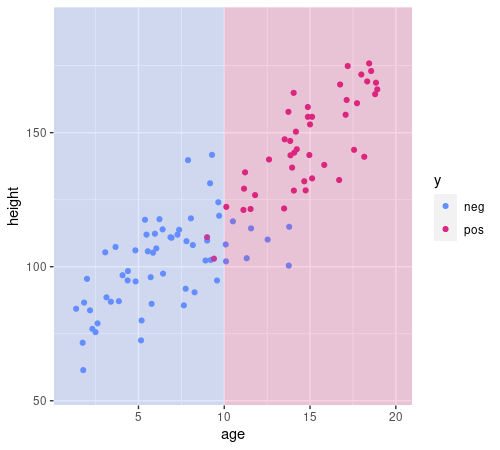

class: middle, center

# Tree-based learning techniques

---

## The carousel attendant

Once upon a time¹... there is an amusement park with a carousel and an **attendant** deciding who can ride and who cannot ride.
The park owner wants to replace the attendant with a **robotic gate**.

The owner call us as machine learning experts.

.w50p.center[]

.footnote[
1. For almost all the learning techniques, we'll (i) see a toy, but "realistic" problem, we'll (ii) try to learn a model by hands (i.e., **human learning**), and (iii) we'll try to translate the manual procedure into an automatic one (i.e., **machine learning**).
]

---

## Approaching the problem

.cols[
.c50[
1. Should we use ML? $\\rightarrow$ **yes**
2. Supervised vs. unsupervised $\\rightarrow$ **supervised**
3. Define the problem problem statement:
  - define $X$ and $Y$
  - feature engineering
  - define a way for assessing solutions
4. Design the ML system
5. Implement the ML system
6. Assess the ML system
]
.c50[
$X$ and $Y$
- $x$ is a person approaching the carousel
- $y$ is .col2[$\\text{can ride}$] or .col1[$\\text{cannot ride}$] (**binary class**)

Features (**chosen with domain expert**):
- person height (in cm)
- person age (in years)

Hence:
- $X = X\\subtext{height} \\times X\\subtext{age} = \\mathbb{R}^+ \\times \\mathbb{R}^+$
- $\\vect{x}=(x\\subtext{height}, x\\subtext{age})$ ($p=2$ **numeric independent variables**)
]
]

We (the ML expert and the domain expert) decide to **collect some data** $D=\\seq{(x^{(i)},y^{(i)}}{i}$ by observing the real system:
- it'll come handy for both learning and assessment

---

## Exploring the data

.cols[
.c50[
.w100p.center[]
<!--
d %>% ggplot(aes(age,height,color=y))+geom_point()+xlim(c(1,20))+ylim(c(55,190))+scale_color_manual(values=c("#648FFF", "#DC267F", "#FE6100", "#785EF0", "#FFB000"))
-->
]
.c50[
The data exploration suggests that using ML is not a *terrible* idea.

Assume we are computer scientists and we *like* `if-then-else` (nested) structures:
can we **manually** build an `if-then-else` structure that allows to make a decision.

**Requirements** (to keep if feasible manually):
- each `if` condition should:
  - involve **just one independent** variable
  - consist of a threshold comparison
- the decision has to be .col2[●] or .col1[●]

**Strategy**:
- tell apart points of different colors

]
]

---

## Building the `if-then-else`

.cols[
.c50[
.w100p.center[]
<!--
d %>% ggplot(aes(age,height,color=y))+geom_point()+xlim(c(1,20))+ylim(c(55,190))+scale_color_manual(values=c("#648FFF", "#DC267F", "#FE6100", "#785EF0", "#FFB000"))+annotate("rect",xmin=10,xmax=+Inf,ymin=-Inf,ymax=Inf,fill="#DC267F",alpha=0.2)+annotate("rect",xmin=-Inf,xmax=10,ymin=-Inf,ymax=Inf,fill="#648FFF",alpha=0.2)
-->
]
.c50[
.pseudo-code[
function $\\text{predict}(\\vect{x})$ {  
.i[]if $x\\subtext{age}\\le 10$ then {  
.i[].i[]return .col1[●]  
.i[]} else {  
.i[].i[]return .col2[●]  
.i[]}  
}
]

- requirements are met
- background color at position $\\vect{x}=(x\\subtext{age},x\\subtext{height})$ is the color the code above will assign to that $\\vect{x}$, i.e., $f\\subtext{predict}(\\vect{x})$
- most of the examples fall in the correct colored region
  - maybe the `else` branch is too rough

**Let's improve it!**
]
]

---

## Building the `if-then-else`

.cols[
.c50[
.w100p.center[]
<!--
d %>% ggplot(aes(age,height,color=y))+geom_point()+xlim(c(1,20))+ylim(c(55,190))+scale_color_manual(values=c("#648FFF", "#DC267F", "#FE6100", "#785EF0", "#FFB000"))+annotate("rect",xmin=10,xmax=+Inf,ymin=-Inf,ymax=120,fill="#648FFF",alpha=0.2)+annotate("rect",xmin=10,xmax=+Inf,ymin=120,ymax=Inf,fill="#DC267F",alpha=0.2)+annotate("rect",xmin=-Inf,xmax=10,ymin=-Inf,ymax=Inf,fill="#648FFF",alpha=0.2)
-->
]
.c50[
.pseudo-code[
function $\\text{predict}(\\vect{x})$ {  
.i[]if $x\\subtext{age}\\le 10$) then {  
.i[].i[]return .col1[●]  
.i[]} else {  
.i[].i[]if $x\\subtext{height}\\le 120$ then {  
.i[].i[].i[]return .col1[●]  
.i[].i[]} else {  
.i[].i[].i[]return .col2[●]  
.i[].i[]}  
.i[]}  
}
]

- requirements are met
- almost all the examples fall in the correct colored region

**Nice job!**
]
]

---

## The decision tree

.cols[
.c50[
This `if-then-else` nested structure can be represented as a **tree**:
.diagram.center.tree[
rect(100,0,140,40)
otext(170,20,'$x\\\\subtext{age}$ vs. $10$', 'small')
link([170,40,70,80])
otext(70,60,'$\\\\le$','small')
rect(45,80,50,40)
otext(70,100,'●','col1')
rect(200,80,140,40)
otext(270,60,'$>$','small')
link([170,40,270,80])
otext(270,100,'$x\\\\subtext{height}$ vs. $120$', 'small')
link([270,120,170,160])
otext(170,140,'$\\\\le$','small')
rect(145,160,50,40)
otext(170,180,'●','col1')
link([270,120,370,160])
otext(370,140,'$>$','small')
rect(345,160,50,40)
otext(370,180,'●','col2')
]
]
.c50[
.pseudo-code[
function $\\text{predict}(\\vect{x})$ {  
.i[]if $x\\subtext{age}\\le 10$ then {  
.i[].i[]return .col1[●]  
.i[]} else {  
.i[].i[]if $x\\subtext{height}\\le 120$ then {  
.i[].i[].i[]return .col1[●]  
.i[].i[]} else {  
.i[].i[].i[]return .col2[●]  
.i[].i[]}  
.i[]}  
}
]
]
]

We call this a .key[decision tree], since we use it inside an $f\\subtext{predict}$ for making a decision:
- it's a binary tree, since **nodes** have exactly 0 or 2 children
- non-terminal nodes (or **branch nodes**) hold a pair (independent variable, threshold¹)
- terminal nodes (or **leaf nodes**) hold one value $y \\in Y$

---

## De-hard-coding $f\\subtext{predict}$

.cols[
.c50[
**Now**: our human learned $f\\subtext{predict}$
.diagram.center[
link([0,25,75,25],'a')
rect(75,0,150,50)
link([225,25,300,25],'a')
otext(150,25,"$f\\\\subtext{predict}$")
otext(37.5,10,'$x$')
otext(262.5,10,'$y$')
]

.pseudo-code.compact[
function $\\text{predict}(\\vect{x})$ {  
.i[]if $x\\subtext{age}\\le 10$ then {  
.i[].i[]return .col1[●]  
.i[]} else {  
.i[].i[]if $x\\subtext{height}\\le 120$ then {  
.i[].i[].i[]return .col1[●]  
.i[].i[]} else {  
.i[].i[].i[]return .col2[●]  
.i[].i[]}  
.i[]}  
}
]
]
.c50[
**Goal**: a $f'\\subtext{predict}$ working on any tree
.diagram.center[
link([0,25,75,25],'a')
rect(75,0,150,50)
link([225,25,300,25],'a')
otext(150,25,"$f'\\\\subtext{predict}$")
otext(37.5,10,'$\\\\vect{x},m$')
otext(262.5,10,'$y$')
]

.pseudo-code.compact[
function $\\text{predict}(\\vect{x}, m)$ {  
.i[]...  
}
]
]
]

We *human learned* (i.e., manually designed) a function where the **decision tree** is **hard-coded** in the $\\text{predict}()$ function in the form of an `if-then-else` structure:
- can we *pull out* the decision tree out of it and make $\\text{predict}()$ a templated function?

---

## Formalizing

.cols[
.c50[
**Scenario**: classification with multivariate numerical features:
- $X = X\_1 \\times \\dots \\times X\_p$, with each $X\_i\\subseteq\\mathbb{R}$
  - we write $\\vect{x} = (x\_1,\\dots,x\_p)=(x\_i)\_i$
- $Y$, finite without ordering

The **model** $t \\in T\_{X,Y}$ is a decision tree defined over $X,Y$, i.e.:
- each $t$ is a binary tree
- each **non-terminal** node is .note[labeled with] a **pair $(j,\\tau)$**, with $j \\in \\{1,\\dots,p\\}$ and $\\tau \\in \\mathbb{R}$
  - $j$ is the index of the independent variable
  - $\\tau$ is a threshold for comparison
- each **terminal** node is .note[labeled with] a $y \\in Y$
]
.c50[
.diagram.center.tree[
rect(100,0,140,40)
otext(170,20,'$x\\\\subtext{age}$ vs. $10$', 'small')
link([170,40,70,80])
otext(70,60,'$\\\\le$','small')
rect(45,80,50,40)
otext(70,100,'●','col1')
rect(200,80,140,40)
otext(270,60,'$>$','small')
link([170,40,270,80])
otext(270,100,'$x\\\\subtext{height}$ vs. $120$', 'small')
link([270,120,170,160])
otext(170,140,'$\\\\le$','small')
rect(145,160,50,40)
otext(170,180,'●','col1')
link([270,120,370,160])
otext(370,140,'$>$','small')
rect(345,160,50,40)
otext(370,180,'●','col2')
]

**Compact representation**

Assuming:
- $X=X\\subtext{age} \\times X\\subtext{height} = X\_1 \\times X\_2$
- $Y=\\set{\\htmlClass{col1}{●},\\htmlClass{col2}{●}}$

.center[$t = [(1,10);[\\htmlClass{col1}{●}];[(2,120);[\\htmlClass{col1}{●}];[\\htmlClass{col2}{●}]]]$]
]
]

---

## Templated $f'\\subtext{predict}$

.cols[
.c50[
.pseudo-code.compact[
function $\\text{predict}(\\vect{x}, t)$ {  
.i[]$r \\gets \\text{root}(t)$  
.i[]if $\\text{isTerminal}(r)$ then {  
.i[].i[]$y \\gets \\text{label}(r)$  
.i[].i[]return $y$  
.i[]} else { .comment[//hence $r$ is a branch node]  
.i[].i[]$(j, \\tau) \\gets \\text{label}(r)$  
.i[].i[]if $x\_j \\le \\tau$ then {  
.i[].i[].i[]return $\\text{predict}(\\vect{x}, \\text{leftChildOf}(r))$ .comment[//recursion]  
.i[].i[]} else {  
.i[].i[].i[]return $\\text{predict}(\\vect{x}, \\text{rightChildOf}(r))$ .comment[//recursion]  
.i[].i[]}  
.i[]}  
}
]
]
.c50[
- $\\text{root}(t)$ returns the **root node** of $t$
- $\\text{label}(n)$ returns the label, i.e., the content of $n$
  - a $y \\in Y$ for terminal nodes
  - a $(j,\\tau) \\in \\{1,\\dots,p\\} \\times \\mathbb{R}$ for non-terminal nodes
- $\\text{leftChildOf}(n)$ and $\\text{rightChildOf}(n)$ returns the left or right **subtree** of a node $n$
]
]

.cols[
.c50[
It's a **recursive** function that:
- works with any $t \\in T\_{X,Y}$ and any $\\vect{x} \\in \\mathbb{R}^p$
- always returns a $y \\in Y$
]
.c50[
.diagram.center[
link([0,25,75,25],'a')
rect(75,0,150,50)
link([225,25,300,25],'a')
otext(150,25,"$f'\\\\subtext{predict}$")
otext(37.5,10,'$\\\\vect{x},t$')
otext(262.5,10,'$y$')
]
]
]

---

## $f'\\subtext{predict}$ example

.cols[
.c60[
**1st call**: .compact[$\\vect{x}=(14,155), t = [(1,10);[\\htmlClass{col1}{●}];[(2,120);[\\htmlClass{col1}{●}];[\\htmlClass{col2}{●}]]]$]

.compact[
$\\text{isTerminal}(r)=\\text{false}$  
$(j,\\tau)=(1,10)$  
$x\_1 \\le 10 = \\text{false}$  
$\\text{rightChildOf}(r)= [(2,120);[\\htmlClass{col1}{●}];[\\htmlClass{col2}{●}]]$
]

**2nd call**: .compact[$\\vect{x}=(14,155), t = [(2,120);[\\htmlClass{col1}{●}];[\\htmlClass{col2}{●}]]$]

$\\text{isTerminal}(r)=\\text{false}$  
$(j,\\tau)=(2,120)$  
$x\_2 \\le 120 = \\text{false}$  
$\\text{rightChildOf}(r)= [\\htmlClass{col2}{●}]$

**3rd call**: .compact[$\\vect{x}=(14,155), t = [\\htmlClass{col2}{●}]$]

$\\text{isTerminal}(r)=\\text{true}$  
$y=\\htmlClass{col2}{●}$
]
.c40[
.pseudo-code.compact[
function $\\text{predict}(\\vect{x}, t)$ {  
.i[]$r \\gets \\text{root}(t)$  
.i[]if $\\text{isTerminal}(r)$ then {  
.i[].i[]$y \\gets \\text{label}(r)$  
.i[].i[]return $y$  
.i[]} else {  
.i[].i[]$(j, \\tau) \\gets \\text{label}(r)$  
.i[].i[]if $x\_j \\le \\tau$ then {  
.i[].i[].i[]return $\\text{predict}(\\vect{x}, \\text{leftChildOf}(r))$  
.i[].i[]} else {  
.i[].i[].i[]return $\\text{predict}(\\vect{x}, \\text{rightChildOf}(r))$  
.i[].i[]}  
.i[]}  
}
]
]
]
---

## Towards tree learning

We have our $f'\\subtext{predict}: \\mathbb{R}^p \\times T\_{X,Y} \\to Y$; for having a learning technique we miss only the learning function, i.e., $f'\\subtext{learn}: \\mathcal{P}^*(\\mathbb{R}^p, Y) \\to T\_{X,Y}$:
.diagram.center[
link([0,25,150,25],'a')
rect(150,0,150,50)
link([300,25,400,25],'a')
otext(225,25,"$f'\\\\subtext{learn}$")
otext(75,10,'$\\\\seq{(\\\\vect{x}^{(i)},y^{(i)})}{i}$')
otext(350,10,'$t$')
]

What we did manually (i.e., how we *human learned*):
1. until we are satisfied
  - put a vertical/horizontal line that well separates the data
  - **repeat** step 1 once for each on the two resulting regions

Let's rewrite it as (pseudo-)code!

---

## Recursive binary splitting

.cols[
.c60[
.pseudo-code.compact[
function $\\text{learn}(\\seq{(\\vect{x}^{(i)},y^{(i)})}{i})$ {  
.i[]$r \\gets \\text{root}(t)$  
.i[]if .col1[$\\text{shouldStop}(y^{(i)})$] then {  
.i[].i[]$y^\\star \\gets \\argmax\_{y \\in Y} \\sum\_i \\mathbf{1}(y^{(i)}=y)$ .comment[//$y^\\star$ is the most frequent class]  
.i[].i[]return $\\text{nodeFrom}(y)$  
.i[]} else { .comment[//hence $r$ is a branch node]  
.i[].i[].col2[$(j, \\tau) \\gets \\text{findBestBranch}(\\seq{(\\vect{x}^{(i)},y^{(i)})}{i})$]  
.i[].i[]$n \\gets \\text{nodeFrom}(j, \\tau)$  
.i[].i[]$\\htmlClass{col3}{\\text{appendRightChild}(n, \\text{learn}(\\seq{(\\vect{x}^{(i)},y^{(i)})}{i}\\big\\rvert\_{x\_j \\le \\tau}))}$ .comment[//recursion]  
.i[].i[]$\\htmlClass{col3}{\\text{appendRightChild}(n, \\text{learn}(\\seq{(\\vect{x}^{(i)},y^{(i)})}{i}\\big\\rvert\_{x\_j > \\tau}))}$ .comment[//recursion]  
.i[].i[]return $n$  
.i[].i[]}  
.i[]}  
}
]
]
.c40[
.diagram.center[
link([0,25,150,25],'a')
rect(150,0,150,50)
link([300,25,400,25],'a')
otext(225,25,"$f'\\\\subtext{learn}$")
otext(75,10,'$\\\\seq{(\\\\vect{x}^{(i)},y^{(i)})}{i}$')
otext(350,10,'$t$')
]

1. .col1[until we are satisfied]
  - .col2[put a vertical/horizontal line that well separates the data]
  - .col3[repeat step 1 once for each on the two resulting regions]

.note[
$\\seq{(\\vect{x}^{(i)},y^{(i)})}{i}\\big\\rvert\_{x\_j \\le \\tau}$ is the sub-multiset of $\\seq{(\\vect{x}^{(i)},y^{(i)})}{i}$ composed of pairs for which $x\_j \\le \\tau$
]
]
]

This $f'\\subtext{learn}$ is called .key[recursive binary splitting]:
- it's **recursive**
- when recurses, **splits** the data in two parts (**binary**)
  - it's a top-down approach: starts from the big problem and makes it smaller (**dividi-et-impera**)

---

## Finding the best branch

**Intuitively**:
- consider all variables (i.e., all $j$) and *all*¹ threshold values
- choose the pair variable, threshold that best separate the data
  - i.e., that results in the lowest number of **misclassified** examples

.cols[
.c60[
**In detail** (and formally):
.pseudo-code.compact[
function $\\text{findBestBranch}(\\seq{(\\vect{x}^{(i)},y^{(i)})}{i})$ {  
.i[]$(j^\\star, \\tau^\\star) \\gets \\argmin\_{j,\\tau} \\left(\\text{error}(\\htmlClass{col1}{\\seq{y^{(i)}}{i}\\big\\rvert\_{x\_j \\le \\tau}})+\\text{error}(\\htmlClass{col1}{\\seq{y^{(i)}}{i}\\big\\rvert\_{x\_j > \\tau}})\\right)$  
.i[]return $(j^\\star, \\tau^\\star)$  
}
]
and
.pseudo-code.compact[
function $\\text{error}(\\seq{y^{(i)}}{i})$ {  
.i[].col2[$y^\\star \\gets \\argmax\_y \\sum\_i \\mathbf{1}(y^{(i)}=y)$] .comment[//$y^\\star$ is the most freq class]  
.i[]return .col2[$\\frac{1}{n} \\sum\_i \\mathbf{1}(y^{(i)} \\ne y^\\star)$] .comment[classification error rate]  
}
]
]
.c40[
**Interpretation**: if we .col1[split the data at this point] (i.e., a $(j, \\tau)$ pair) and use one .col2[dummy classifier] on each of the two sides, what would be the resulting error?

This approach is **greedy**, since it tries to obtain the maximum result (finding the branch), with the minimum effort (using just two dummy classifiers later on):
- in practice, it makes this learning technique computationally light!
]
]

.footnote[
1. you just need to consider, for each $j$-th feature, the **midpoints** of $(x\_j^{(i)})\_i$: at most $n$ of them
]

---

## Deciding when to stop (recursion)

---

<!--
example of application with p=1
alternative best branch (with gini and x-entropy)
alternative should stop (with k_min)
example of overfitting
variance & bias, overfitting and underfitting
method to spot it

auto-tuning
assessment of auto-tuning (nested cv)

variant with categorical x
variant with regression

overfitting with tree regression

limitation of straight lines, accuracy, oblique trees

summary

-->
