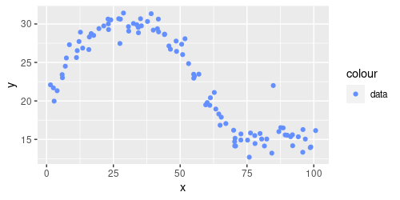
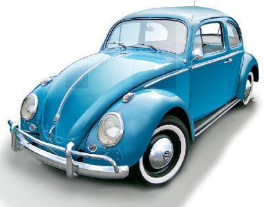

class: middle, center

# Tree bagging and Random Forest

---

## The (bad) flexibility of trees

.cols[
.c50[
Consider this dataset obtained from a system:

.w100p.center[]

.question[Question:] how would you "draw the system" behind this data?
]
.c50[
If we learn a regression tree with **low flexibility**:
- the model will not capture the system behavior
- it will **underfit** the data and the system

If we learn a regression tree with **high flexibility**:
- the model will likely better capture the system behavior, but...
- it will also model some noise
- it will **overfit** the data

It might be that there is no flexibility value for which we have no underfitting nor overfitting.
]
]

--

What's that point at $(\\approx 80, \\approx 22)$?
- **noise**, or, from another point of view, a **detail** of the data, rather than of the system, that we don't want to model

What if we collect **another dataset** out of the same system?

---

## Human-learning and cars

- **Model**: a description in natural language
- **Learning technique**: human giving a description
- **Flexibility**: amount of characters available for the model
- **Problem instance**: learning a model of (the concept) of *car* from (one) example

--

.cols[
.c20[
.h10ex.center[]
]
.c30[
**Model** with low complexity:

"a moving object"
]
.c50[
**Model** with high complexity:

"a blue-colored moving object with 4 wheels, 2 doors, chromed fenders, a windshield, curved rear enclosing engine"
]
]

--

.cols[
.c20[
.h10ex.center[]
]
.c30[
"a moving object"
]
.c50[
"a red-colored moving object with 4 wheels, 2 doors, side air intakes, a windshield, a small horse figure"
]
]

--

.cols[
.c20[
.h10ex.center[]
]
.c30[
"a moving object"
]
.c50[
"a small red-colored moving object with 4 wheels, 2 doors, a white stripe on the front, a windshield, chromed fenders, sunroof"
]
]

---

## Modeled details

.center.nicetable[
|Low complexity|High complexity|
|---|---|
|"a moving object"|"a blue-colored moving object with 4 wheels, 2 doors, chromed fenders, curved rear enclosing engine"|
|"a moving object"|"a red-colored moving object with 4 wheels, 2 doors, side air intakes, and a small horse figure"|
|"a moving object"|"a small red-colored moving object with 4 wheels, 2 doors, a white stripe on the front, chromed fenders, sunroof"|
]

**Low complexity**: never gives enough details about the system

**High complexity**: *always* gives a fair amount of details about the system, but also about noise

.vspace1[ ]

--

What if we **combine** different models with high complexity?
- "a [...] moving object with 4 wheels, 2 doors, [...], a windshield, [...]"
- much more details about the system, no details about the noise
- i.e., no underfitting 😁, no overfitting 😁

--

When "learners" are common people, this idea is related with the **wisdom of the crowds theorem**, stating that "*a collective opinion may be better than a single expert's opinion*".

---

## Wisdom of the crowds

.center["*a collective opinion may be better than a single expert's opinion*"]

Yes, but only if:
- we have many opinions
- the opinions are independent
- we have a way to aggregate them

.vspace1[]

--

Can we realize a **wisdom of the tree**? (where opinion $\\leftrightarrow$ tree)

- we have many opinions
  - **ok, just learn many trees**
- the opinions are independent
  - **...** 🤔
- we have a way to aggregate them
  - **aggregate predictions** of the trees:
      - classification: majority
      - regression: average

---

## Independency of trees

A tree is the result of the execution of $f'\\subtext{learn}$ on a learning set $D\\subtext{learn} = \\seq{(x^{(i)},y^{(i)})}{i}$.

$f'\\subtext{learn}$ is deterministic, thus:
- if we apply $f'\\subtext{learn}$ twice on the same learning set, we obtain two equal models
- if we apply $f'\\subtext{learn}$ $m$ times on the same dataset, we obtain $m$ equal models
- **no independency**

.vspace1[]

In order to obtain different trees, we need to apply $f'\\subtext{learn}$ on different learning sets!

But we have just one learning set... 🤔

.footnote[
.question[Question]: what's the learning set for human-learners?
]

---

## Different learning sets

**Goal**: obtaining $m$ different datasets $D\_{\\text{learn},1}, \\dots, D\_{\\text{learn},m}$ from a dataset $D\\subtext{learn}$
- *decently* **different** from each other
- all being *decently* **representative** of the underlying system (not too worse than $D\\subtext{learn}$)

--

.cols[
.c40[
**Option 1**: (CV-like)

1. shuffle $D\\subtext{learn}$
2. split $D\\subtext{learn}$ in $m$ folds
3. assign each $D\_{\\text{learn},j}$ to the $j$-th fold

]
.c60[
**Requirements** check:
- 👍 the folds are in general different from each other
- 👎 if $m$ is large, each $D\_{\\text{learn},j}$ is small, with size $\\frac{1}{m} |D\\subtext{learn}|$, and is likely poorly representative of the system
]
]

--

.cols[
.c40[
**Option 2**: rand. sampling w/ repetitions
1. for each $j \\in \\{1, \\dots, m\\}$
  1. start with an empty $D\_{\\text{learn},j}$
  2. repeat $n=|D\\subtext{learn}|$ times
      1. pick a random el. of $D\\subtext{learn}$
      2. add it to $D\_{\\text{learn},j}$
]
.c60[
**Requirements** check:
- 👍 the folds are in general different from each other
- 👍 regardless of $m$, each $D\_{\\text{learn},j}$ as large as $D\\subtext{learn}$
  - you can freely choose $m$, even $m \\ge n$!
]
]

---

## Sampling with repetition

.cols[
.c50[
**On $D\\subtext{learn}$**:

1. for each $j \\in \\{1, \\dots, m\\}$
  1. .col1[start with an empty $D\_{\\text{learn},j}$]
  2. .col1[repeat $n=|D\\subtext{learn}|$ times]
      1. pick a random el. of $D\\subtext{learn}$
      2. add it to $D\_{\\text{learn},j}$
]
.c50[
**In general**:

.pseudo-code[
function $\\text{sample-rep}(\\{x\\sub{1},\\dots,x\\sub{n}\\})$ {  
.i[]$X' \\gets \\emptyset$  
.i[]while $|X'| \\le n$ {  
.i[].i[]$j \\gets \\text{uniform}(\\{1,\\dots,n\\})$  
.i[].i[]$X' \\gets X' \\cup \\{x\\sub{j}\\}$  
.i[]}  
.i[]return $X'$  
}
]

.vspace025[]

.diagram.center[
link([0,25,150,25],'a')
rect(150,0,150,50)
link([300,25,450,25],'a')
otext(225,25,"$f\\\\subtext{sample-rep}$")
otext(75,10,'$\\\\{x\\\\sub{1},\\\\dots,x\\\\sub{n}\\\\}$')
otext(375,10,'$\\\\{x\\\\sub{j\\\\sub{1}},\\\\dots,x\\\\sub{j\\\\sub{n}}\\\\}$')
]

]
]

**Remarks**:
- $f\\subtext{sample-rep}$ is **not deterministic**!
  - if you execute twice it on the same input, you get different outputs
- when you use sampling with repetition to estimate the distribution of a metric, rather than computing the metric itself on the entire collection, you are doing **bootstrapping**

---

## Examples and probability

**Not deterministic**, thus:
- one invocation: $f\\subtext{sample-rep}(\\{\\htmlClass{col1}{●},\\htmlClass{col2}{●},\\htmlClass{col3}{●},\\htmlClass{col4}{●},\\htmlClass{col5}{●}\\}) \\rightarrow \\{\\htmlClass{col2}{●},\\htmlClass{col4}{●},\\htmlClass{col3}{●},\\htmlClass{col1}{●},\\htmlClass{col1}{●}\\}$
- one invocation: $f\\subtext{sample-rep}(\\{\\htmlClass{col1}{●},\\htmlClass{col2}{●},\\htmlClass{col3}{●},\\htmlClass{col4}{●},\\htmlClass{col5}{●}\\}) \\rightarrow \\{\\htmlClass{col3}{●},\\htmlClass{col4}{●},\\htmlClass{col3}{●},\\htmlClass{col5}{●},\\htmlClass{col5}{●}\\}$
- one invocation: $f\\subtext{sample-rep}(\\{\\htmlClass{col1}{●},\\htmlClass{col2}{●},\\htmlClass{col3}{●},\\htmlClass{col4}{●},\\htmlClass{col5}{●}\\}) \\rightarrow \\{\\htmlClass{col2}{●},\\htmlClass{col4}{●},\\htmlClass{col3}{●},\\htmlClass{col4}{●},\\htmlClass{col1}{●}\\}$
- ...

.note[recall: input and output are multisets]

--

Given an input with $n$ elements .note[and assuming uniqueness] an element has:
- a probability of $\\left(1-\\frac{1}{n}\\right)^n$ to not occur in the output
- a probability of $\\frac{1}{n}\\left(1-\\frac{1}{n}\\right)^{n-1}$ to occur in the output exactly once
- a probability of $\\left(\\frac{1}{n}\\right)^2\\left(1-\\frac{1}{n}\\right)^{n-2}$ to occur in the output exactly twice
- ...

---

## Towards wisdom of the trees

Can we realize a **wisdom of the tree**? (where opinion $\\leftrightarrow$ tree)

- we have many opinions
  - 👍 **ok, just learn many trees**
- the opinions are independent
  - 👍 **each tree is learned on a dataset obtained with sampling with repetition**
- we have a way to aggregate them
  - 👍 **aggregate predictions** of the trees:
      - classification: majority
      - regression: average

.vspace1[]

--

Ok, we can define a **new learning technique** that realizes this idea!

.cols[
.c50[
.diagram.center[
link([0,25,150,25],'a')
rect(150,0,150,50)
link([300,25,400,25],'a')
otext(225,25,"$f'\\\\subtext{learn}$")
otext(75,10,'$\\\\seq{(x^{(i)},y^{(i)})}{i}$')
otext(350,10,'$m$')
]
]
.c50[
.diagram.center[
link([0,25,150,25],'a')
rect(150,0,150,50)
link([300,25,400,25],'a')
otext(225,25,"$f'\\\\subtext{predict}$")
otext(75,10,'$x,m$')
otext(350,10,'$y$')
]
]
]

This technique is called on .key[tree bagging].

---

## Tree bagging: learning

.cols[
.c50[
.diagram.center[
link([0,75,150,75],'a')
rect(150,50,150,50)
link([300,75,400,75],'a')
link([225,0,225,50],'a')
otext(225,75,"$f'\\\\subtext{learn}$")
otext(75,60,'$\\\\seq{(x^{(i)},y^{(i)})}{i}$')
otext(350,60,'$\\\\seq{t\\_j}{j}$')
otext(260,25,'$n\\\\subtext{tree}$')
]

.pseudo-code.compact[
function $\\text{learn}(\\seq{(x^{(i)},y^{(i)})}{i}, \\htmlClass{col1}{n\\subtext{tree}})$ {  
.i[]$T' \\gets \\emptyset$  
.i[]while $|T'| \\le \\htmlClass{col1}{n\\subtext{tree}}$ {  
.i[].i[]$\\seq{(x^{(j\_i)},y^{(j\_i)})}{j\_i} \\gets \\text{sample-rep}(\\seq{(x^{(i)},y^{(i)})}{i})$  
.i[].i[]$t \\gets \\htmlClass{col2}{\\text{learn}\\subtext{single}}(\\seq{(x^{(j\_i)},y^{(j\_i)})}{j\_i}, \\htmlClass{col3}{1})$  
.i[].i[]$T' \\gets T' \\cup \\{t\\}$  
.i[]}  
.i[]return $T'$  
}
]

]
.c50[
- the model is a **bag of trees**
  - it can contain duplicates
- .col1[$n\\subtext{tree}$] is the number of trees in the bag
  - a parameter of the learning technique
- .col2[$\\text{learn}\\subtext{single}()$] is the $f'\\subtext{learn}$ for learning a **single** tree (recursive binary splitting)
  - tree bagging is based on recursive binary splitting
- .col2[$\\text{learn}\\subtext{single}()$] is invoked with .col3[$n\\subtext{min}=1$], **because we want each tree in the bag to give many details¹!**
]
]

Recall: since one part of this $f'\\subtext{learn}$ is **not deterministic** (namely, $\\text{sample-rep}()$), the entire $f'\\subtext{learn}$ is not deterministic!
- not to be confused with a system not being deterministic
- not to be confused with an $f''\\subtext{predict}$ that returns a probability

.footnote[
1. this can be obtained also with a reasonably small $n\\subtext{min}$, or with a reasonably large maximum tree depth
]

---

## Tree bagging: prediction

.diagram.center[
link([0,25,150,25],'a')
rect(150,0,150,50)
link([300,25,400,25],'a')
otext(225,25,"$f'\\\\subtext{predict}$")
otext(75,10,'$x,\\\\seq{t\\_j}{j}$')
otext(350,10,'$y$')
]

.cols[
.c50[
**Classification** (decision trees)
.pseudo-code.compact[
function $\\text{predict}(x, \\seq{t\_j}{j})$ {  
.i[]return $\\argmax\_{y \\in Y} \\sum\_j \\mathbf{1}(y=\\htmlClass{col1}{\\text{predict}\\subtext{single}}(x,t\_j))$  
}
]

.compact[
- .col1[$\\text{predict}\\subtext{single}()$] is the $f'\\subtext{predict}$ for the single tree
- $\\argmax$ is a **majority voting**:
  1. for each $y$ in $Y$, count the number $\\sum\_j \\mathbf{1}(y=\\text{predict}\\subtext{single}(x,t\_j))$ of trees in the bag predicting that $y$ (i.e., the **votes** for that $y$)
  2. select the $y$ with the largest count (i.e., the **majority** of votes)
- easily modifiable to an $f''\\subtext{predict}$ (**with probability**):
  - return $p = y \\mapsto \\frac{1}{|\\seq{t\_j}{j}|}\\sum\_j \\mathbf{1}(y=\\text{predict}\\subtext{single}(x,t\_j))$
]
]
.c50[
**Regression** (regression trees)
.pseudo-code.compact[
function $\\text{predict}(x, \\seq{t\_j}{j})$ {  
.i[]return $\\frac{1}{|\\seq{t\_j}{j}|} \\sum\_j \\htmlClass{col1}{\\text{predict}\\subtext{single}}(x,t\_j)$  
}
]

.compact[
- simply returns the **mean** of the predictions of the tree in the bag
]
]
]

---

## Impact of the parameter $n\\subtext{tree}$

- Is $n\\subtext{tree}$ a **flexibility parameter**?
- Does $n\\subtext{tree}$ hence impact on learned model complexity, i.e., on tendency to overfitting?

--

Apparently **yes**:
- because the larger $n\\subtext{tree}$, the larger the bag, the more complex the model
  - each tree has the "maximum" complexity, having being learned with $n\\subtext{min}=1$

Apparently **no**:
- because the larger $n\\subtext{tree}$, the larger the number of trees whose prediction is averaged (regression) or subjected to majority voting (classification), i.e., the stronger the smoothing of details

So what? 🤔

---

## Bagging vs. single tree learning

"Experimentally", it turns out that:
- with a reasonably large $n\\subtext{tree}$, **bagging is better than single tree learning**
  - "reasoanly large" = tens or few hundreds
  - "better" = produces more effective models
- if you further increase $n\\subtext{tree}$, there's no overfitting

Note that bagging with $n\\subtext{tree}=1$ is¹ single tree learning.

.footnote[
1. .question[Question]: are they exactly the same?
]

.vspace1[]

--

.question[Question]: can we hence set an arbitrarly large $n\\subtext{tree}$?

--

No! Efficiency linearly dicreases with $n\\subtext{tree}$:
- invoking $\\text{predict}\\subtext{single}()$ $n\\subtext{tree}$ times takes, on average, $n\\subtext{tree}$ the resources for invoking $\\text{predict}\\subtext{single}()$ one time, but...
- ... the invocations may be done in parallel (to some degree)
  - **time** resource is consumed less
  - **energy** resource is not affected

---

## Tree bagging applicability

Since it is based on the learning technique for single trees, bagging has the same applicability:
- $Y$: both **regression and classification** (binary and multiclass)
- $X$: multivariate $X$ with both **numerical and categorical** variables
- models give probability

.vspace1[]

--

Note that the idea behind tree bagging can be applied to any base learning technique:
- the base technique is called **weak learner**
- the resulting model is an **ensemble**, hence bagging is a form of **ensemble learning**

---

class: middle, center

## Random Forest

---

## Increasing independency
