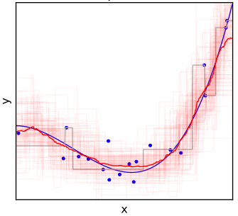
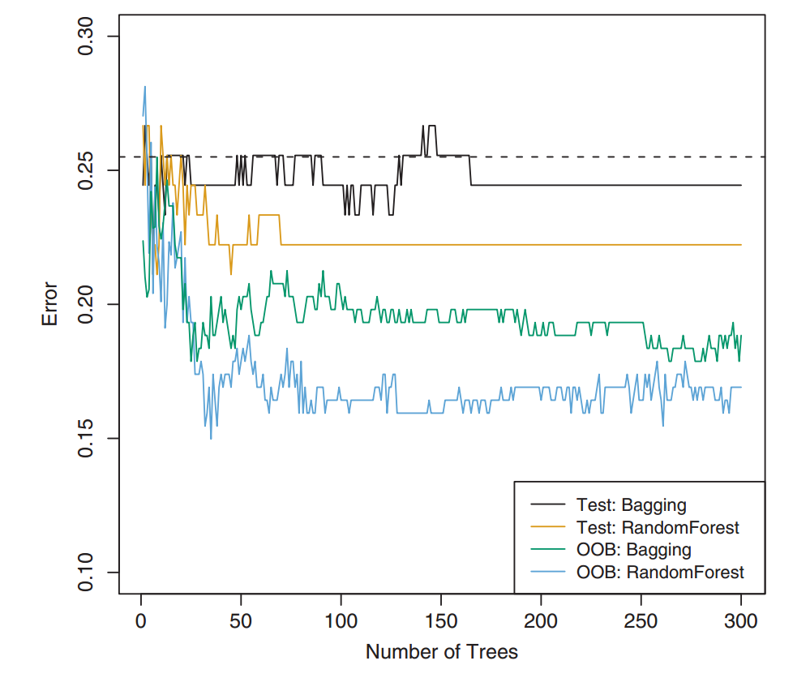
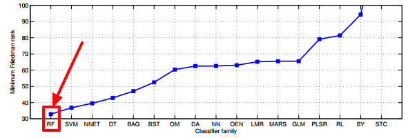
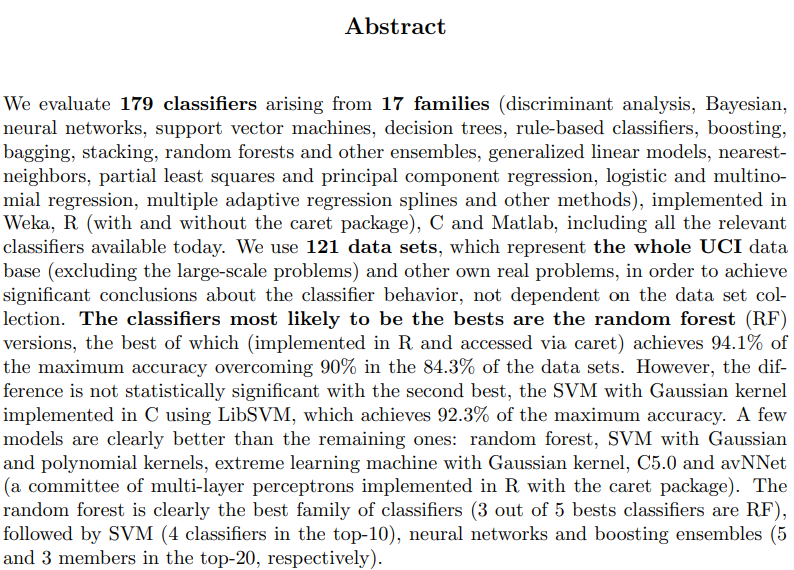

class: middle, center

# Tree bagging and Random Forest

---

## The (bad) flexibility of trees

.cols[
.c50[
Consider this dataset obtained from a system:

.w100p.center[]

.question[Question:] how would you "draw the system" behind this data?
]
.c50[
If we learn a regression tree with **low flexibility**:
- the model will not capture the system behavior
- it will **underfit** the data and the system

If we learn a regression tree with **high flexibility**:
- the model will likely better capture the system behavior, but...
- it will also model some noise
- it will **overfit** the data

It might be that there is no flexibility value for which we have no underfitting nor overfitting.
]
]

--

What's that point at $(\\approx 80, \\approx 22)$?
- **noise**, or, from another point of view, a **detail** of the data, rather than of the system, that we don't want to model

What if we collect **another dataset** out of the same system?

---

## Human-learning and cars

- **Model**: a description in natural language
- **Learning technique**: human giving a description
- **Flexibility**: amount of characters available for the model
- **Problem instance**: learning a model of (the concept) of *car* from (one) example

--

.cols[
.c20[
.h10ex.center[]
]
.c30[
**Model** with low complexity:

"a moving object"
]
.c50[
**Model** with high complexity:

"a blue-colored moving object with 4 wheels, 2 doors, chromed fenders, a windshield, curved rear enclosing engine"
]
]

--

.cols[
.c20[
.h10ex.center[]
]
.c30[
"a moving object"
]
.c50[
"a red-colored moving object with 4 wheels, 2 doors, side air intakes, a windshield, a small horse figure"
]
]

--

.cols[
.c20[
.h10ex.center[]
]
.c30[
"a moving object"
]
.c50[
"a small red-colored moving object with 4 wheels, 2 doors, a white stripe on the front, a windshield, chromed fenders, sunroof"
]
]

---

## Modeled details

.center.nicetable[
|Low complexity|High complexity|
|---|---|
|"a moving object"|"a blue-colored moving object with 4 wheels, 2 doors, chromed fenders, curved rear enclosing engine"|
|"a moving object"|"a red-colored moving object with 4 wheels, 2 doors, side air intakes, and a small horse figure"|
|"a moving object"|"a small red-colored moving object with 4 wheels, 2 doors, a white stripe on the front, chromed fenders, sunroof"|
]

**Low complexity**: never gives enough details about the system

**High complexity**: *always* gives a fair amount of details about the system, but also about noise

.vspace1[ ]

--

What if we **combine** different models with high complexity?
- "a [...] moving object with 4 wheels, 2 doors, [...], a windshield, [...]"
- much more details about the system, no details about the noise
- i.e., no underfitting 😁, no overfitting 😁

--

When "learners" are common people, this idea is related with the **wisdom of the crowds theorem**, stating that "*a collective opinion may be better than a single expert's opinion*".

---

## Wisdom of the crowds

.center["*a collective opinion may be better than a single expert's opinion*"]

Yes, but only if:
- we have many opinions
- the opinions are independent
- we have a way to aggregate them

.vspace1[]

--

Can we realize a **wisdom of the trees**? (where (opinion, person) $\\leftrightarrow$ (prediction,tree))

- we have many opinions
  - **ok, just learn many trees**
- the opinions are independent
  - **...** 🤔
- we have a way to aggregate them
  - **aggregate predictions** of the trees:
      - classification: majority
      - regression: average

---

## Independency of trees

A tree is the result of the execution of $f'\\subtext{learn}$ on a learning set $D\\subtext{learn} = \\seq{(x^{(i)},y^{(i)})}{i}$.

$f'\\subtext{learn}$ is deterministic, thus:
- if we apply $f'\\subtext{learn}$ twice on the same learning set, we obtain two equal models
- if we apply $f'\\subtext{learn}$ $m$ times on the same dataset, we obtain $m$ equal models
- **no independency**

.vspace1[]

In order to obtain different trees, we need to apply $f'\\subtext{learn}$ on different learning sets!

But we have just one learning set... 🤔

.footnote[
.question[Question]: what's the learning set for human-learners?
]

---

## Different learning sets

**Goal**: obtaining $m$ different datasets $D\_{\\text{learn},1}, \\dots, D\_{\\text{learn},m}$ from a dataset $D\\subtext{learn}$
- *decently* **different** from each other
- all being *decently* **representative** of the underlying system (not too worse than $D\\subtext{learn}$)

--

.cols[
.c40[
**Option 1**: (CV-like)

1. shuffle $D\\subtext{learn}$
2. split $D\\subtext{learn}$ in $m$ folds
3. assign each $D\_{\\text{learn},j}$ to the $j$-th fold

]
.c60[
**Requirements** check:
- 👍 the folds are in general different from each other
- 👎 if $m$ is large, each $D\_{\\text{learn},j}$ is small, with size $\\frac{1}{m} |D\\subtext{learn}|$, and is likely poorly representative of the system
]
]

--

.cols[
.c40[
**Option 2**: rand. sampling w/ repetitions
1. for each $j \\in \\{1, \\dots, m\\}$
  1. start with an empty $D\_{\\text{learn},j}$
  2. repeat $n=|D\\subtext{learn}|$ times
      1. pick a random el. of $D\\subtext{learn}$
      2. add it to $D\_{\\text{learn},j}$
]
.c60[
**Requirements** check:
- 👍 the folds are in general different from each other
- 👍 regardless of $m$, each $D\_{\\text{learn},j}$ as large as $D\\subtext{learn}$
  - you can freely choose $m$, even $m \\ge n$!
]
]

---

## Sampling with repetition

.cols[
.c50[
**On $D\\subtext{learn}$**:

1. for each $j \\in \\{1, \\dots, m\\}$
  1. .col1[start with an empty $D\_{\\text{learn},j}$]
  2. .col1[repeat $n=|D\\subtext{learn}|$ times]
      1. pick a random el. of $D\\subtext{learn}$
      2. add it to $D\_{\\text{learn},j}$
]
.c50[
**In general**:

.pseudo-code[
function $\\text{sample-rep}(\\{x\\sub{1},\\dots,x\\sub{n}\\})$ {  
.i[]$X' \\gets \\emptyset$  
.i[]while $|X'| \\le n$ {  
.i[].i[]$j \\gets \\text{uniform}(\\{1,\\dots,n\\})$  
.i[].i[]$X' \\gets X' \\cup \\{x\\sub{j}\\}$  
.i[]}  
.i[]return $X'$  
}
]

.vspace025[]

.diagram.center[
link([0,25,150,25],'a')
rect(150,0,150,50)
link([300,25,450,25],'a')
otext(225,25,"$f\\\\subtext{sample-rep}$")
otext(75,10,'$\\\\{x\\\\sub{1},\\\\dots,x\\\\sub{n}\\\\}$')
otext(375,10,'$\\\\{x\\\\sub{j\\\\sub{1}},\\\\dots,x\\\\sub{j\\\\sub{n}}\\\\}$')
]

]
]

**Remarks**:
- $f\\subtext{sample-rep}$ is **not deterministic**!
  - if you execute twice it on the same input, you get different outputs
- when you use sampling with repetition to estimate the distribution of a metric, rather than computing the metric itself on the entire collection, you are doing **bootstrapping**

---

## Examples and probability

**Not deterministic**, thus:
- one invocation: $f\\subtext{sample-rep}(\\{\\c{1}{●},\\c{2}{●},\\c{3}{●},\\c{4}{●},\\c{5}{●}\\}) \\rightarrow \\{\\c{2}{●},\\c{4}{●},\\c{3}{●},\\c{1}{●},\\c{1}{●}\\}$
- one invocation: $f\\subtext{sample-rep}(\\{\\c{1}{●},\\c{2}{●},\\c{3}{●},\\c{4}{●},\\c{5}{●}\\}) \\rightarrow \\{\\c{3}{●},\\c{4}{●},\\c{3}{●},\\c{5}{●},\\c{5}{●}\\}$
- one invocation: $f\\subtext{sample-rep}(\\{\\c{1}{●},\\c{2}{●},\\c{3}{●},\\c{4}{●},\\c{5}{●}\\}) \\rightarrow \\{\\c{2}{●},\\c{4}{●},\\c{3}{●},\\c{4}{●},\\c{1}{●}\\}$
- ...

.note[recall: input and output are multisets]

--

Given an input with $n$ elements .note[and assuming uniqueness] an element has:
- a probability of $\\left(1-\\frac{1}{n}\\right)^n$ to not occur in the output
- a probability of $\\frac{1}{n}\\left(1-\\frac{1}{n}\\right)^{n-1}$ to occur in the output exactly once
- a probability of $\\left(\\frac{1}{n}\\right)^2\\left(1-\\frac{1}{n}\\right)^{n-2}$ to occur in the output exactly twice
- ...

---

## Towards wisdom of the trees

Can we realize a **wisdom of the trees**? (where (opinion, person) $\\leftrightarrow$ (prediction,tree))

- we have many opinions
  - 👍 **ok, just learn many trees**
- the opinions are independent
  - 👍 **each tree is learned on a dataset obtained with sampling with repetition**
- we have a way to aggregate them
  - 👍 **aggregate predictions** of the trees:
      - classification: majority
      - regression: average

.vspace1[]

--

Ok, we can define a **new learning technique** that realizes this idea!

.cols[
.c50[
.diagram.center[
link([0,25,150,25],'a')
rect(150,0,150,50)
link([300,25,400,25],'a')
otext(225,25,"$f'\\\\subtext{learn}$")
otext(75,10,'$\\\\seq{(x^{(i)},y^{(i)})}{i}$')
otext(350,10,'$m$')
]
]
.c50[
.diagram.center[
link([0,25,150,25],'a')
rect(150,0,150,50)
link([300,25,400,25],'a')
otext(225,25,"$f'\\\\subtext{predict}$")
otext(75,10,'$x,m$')
otext(350,10,'$y$')
]
]
]

This technique is called on .key[tree bagging].

---

## Tree bagging: learning

.cols[
.c50[
.diagram.center[
link([0,75,150,75],'a')
rect(150,50,150,50)
link([300,75,400,75],'a')
link([225,0,225,50],'a')
otext(225,75,"$f'\\\\subtext{learn}$")
otext(75,60,'$\\\\seq{(x^{(i)},y^{(i)})}{i}$')
otext(350,60,'$\\\\seq{t\\_j}{j}$')
otext(260,25,'$n\\\\subtext{tree}$')
]

.pseudo-code.compact[
function $\\text{learn}(\\seq{(x^{(i)},y^{(i)})}{i}, \\c{1}{n\\subtext{tree}})$ {  
.i[]$T' \\gets \\emptyset$  
.i[]while $|T'| \\le \\c{1}{n\\subtext{tree}}$ {  
.i[].i[]$\\seq{(x^{(j\_i)},y^{(j\_i)})}{j\_i} \\gets \\text{sample-rep}(\\seq{(x^{(i)},y^{(i)})}{i})$  
.i[].i[]$t \\gets \\c{2}{\\text{learn}\\subtext{single}}(\\seq{(x^{(j\_i)},y^{(j\_i)})}{j\_i}, \\c{3}{1})$  
.i[].i[]$T' \\gets T' \\cup \\{t\\}$  
.i[]}  
.i[]return $T'$  
}
]

]
.c50[
- the model is a **bag of trees**
  - it can contain duplicates
- .col1[$n\\subtext{tree}$] is the number of trees in the bag
  - a parameter of the learning technique
- .col2[$\\text{learn}\\subtext{single}()$] is the $f'\\subtext{learn}$ for learning a **single** tree (recursive binary splitting)
  - tree bagging is based on recursive binary splitting
- .col2[$\\text{learn}\\subtext{single}()$] is invoked with .col3[$n\\subtext{min}=1$], **because we want each tree in the bag to give many details¹!**
]
]

Recall: since one part of this $f'\\subtext{learn}$ is **not deterministic** (namely, $\\text{sample-rep}()$), the entire $f'\\subtext{learn}$ is not deterministic!
- not to be confused with a system not being deterministic
- not to be confused with an $f''\\subtext{predict}$ that returns a probability

.footnote[
1. this can be obtained also with a reasonably small $n\\subtext{min}$, or with a reasonably large maximum tree depth
]

---

## Tree bagging: prediction

.diagram.center[
link([0,25,150,25],'a')
rect(150,0,150,50)
link([300,25,400,25],'a')
otext(225,25,"$f'\\\\subtext{predict}$")
otext(75,10,'$x,\\\\seq{t\\_j}{j}$')
otext(350,10,'$y$')
]

.cols[
.c50[
**Classification** (decision trees)
.pseudo-code.compact[
function $\\text{predict}(x, \\seq{t\_j}{j})$ {  
.i[]return $\\argmax\_{y \\in Y} \\sum\_j \\mathbf{1}(y=\\c{1}{\\text{predict}\\subtext{single}}(x,t\_j))$  
}
]

.compact[
- .col1[$\\text{predict}\\subtext{single}()$] is the $f'\\subtext{predict}$ for the single tree
- $\\argmax$ is a **majority voting**:
  1. for each $y$ in $Y$, count the number $\\sum\_j \\mathbf{1}(y=\\text{predict}\\subtext{single}(x,t\_j))$ of trees in the bag predicting that $y$ (i.e., the **votes** for that $y$)
  2. select the $y$ with the largest count (i.e., the **majority** of votes)
- easily modifiable to an $f''\\subtext{predict}$ (**with probability**):
  - return $p = y \\mapsto \\frac{1}{|\\seq{t\_j}{j}|}\\sum\_j \\mathbf{1}(y=\\text{predict}\\subtext{single}(x,t\_j))$
]
]
.c50[
**Regression** (regression trees)
.pseudo-code.compact[
function $\\text{predict}(x, \\seq{t\_j}{j})$ {  
.i[]return $\\frac{1}{|\\seq{t\_j}{j}|} \\sum\_j \\c{1}{\\text{predict}\\subtext{single}}(x,t\_j)$  
}
]

.compact[
- simply returns the **mean** of the predictions of the tree in the bag
- **bonus**: instead of getting just the mean, by getting also the standard deviation $\\sigma$ of the tree predictions we can have a measure of **uncertainty** of the tree: the larger $\\sigma$, the more uncertain the prediction, the lower the confidence
  - uncertainty/confidence is a basic form of **local explainability**, i.e., understanding the decisions of the model
  - uncertainty/confidence can be exploited in the active learning framework
]
]
]

---

## Impact of the parameter $n\\subtext{tree}$

- Is $n\\subtext{tree}$ a **flexibility parameter**?
- Does $n\\subtext{tree}$ hence impact on learned model complexity, i.e., on tendency to overfitting?

--

Apparently **yes**:
- because the larger $n\\subtext{tree}$, the larger the bag, the more complex the model
  - each tree has the "maximum" complexity, having being learned with $n\\subtext{min}=1$

Apparently **no**:
- because the larger $n\\subtext{tree}$, the larger the number of trees whose prediction is averaged (regression) or subjected to majority voting (classification), i.e., the stronger the smoothing of details

So what? 🤔

---

## $n\\subtext{tree}$: bagging vs. single tree learning

"Experimentally", it turns out that:
- with a reasonably large $n\\subtext{tree}$, **bagging is better than single tree learning**
  - "reasonably large" = tens or few hundreds
  - "better" = produces more effective models
- if you further increase $n\\subtext{tree}$, there's **no overfitting**

Note that bagging with $n\\subtext{tree}=1$ is¹ single tree learning.

.footnote[
1. .question[Question]: are they exactly the same?
]

.vspace1[]

--

.question[Question]: can we hence set an arbitrarly large $n\\subtext{tree}$?

--

No! Efficiency linearly dicreases with $n\\subtext{tree}$:
- invoking $\\text{predict}\\subtext{single}()$ $n\\subtext{tree}$ times takes, on average, $n\\subtext{tree}$ the resources for invoking $\\text{predict}\\subtext{single}()$ one time, but...
- ... the invocations may be done in parallel (to some degree)
  - **time** resource is consumed less
  - **energy** resource is not affected

---

## Tree bagging applicability

Since it is based on the learning technique for single trees, bagging has the same applicability:
- $Y$: both **regression and classification** (binary and multiclass)
- $X$: multivariate $X$ with both **numerical and categorical** variables
- models give probability

.vspace1[]

--

Note that the idea behind tree bagging can be applied to any base learning technique:
- the base technique is called **weak learner**
- the resulting model is an **ensemble**, hence bagging is a form of **ensemble learning**

---

class: middle, center

## Random Forest

---

## Increasing independency

**Wisdom of the trees**:

- many trees
- .col1[trees are independent]
- tree predictions are aggregated

Trees .col1[independency] is obtained by learning them on (slightly) .col1[different datasets].

If there are variables (.key[strong predictors]) which are very useful for separating the observations, still all trees may share a very similar structure, due to the way they are built.

**Can we further increase trees independency?**

--

Yes!

**Idea**: when learning each tree, **remove some randomly chosen independent variables** from the observations

Tree bagging improved with variables removal is a **learning technique** called .key[Random Forest]:
- **random** because there are two sources of randomness, hence of .col1[independency]
- **forest** because it gives a bag of trees

---

## Random Forest: learning

.cols[
.c50[
.diagram.center[
link([0,75,150,75],'a')
rect(150,50,150,50)
link([300,75,400,75],'a')
link([225,0,225,50],'a')
otext(225,75,"$f'\\\\subtext{learn}$")
otext(75,60,'$\\\\seq{(x^{(i)},y^{(i)})}{i}$')
otext(350,60,'$\\\\seq{t\\_j}{j}$')
otext(290,25,'$n\\\\subtext{tree},n\\\\subtext{vars}$')
]

.pseudo-code.compact[
function $\\text{learn}(\\seq{(x^{(i)},y^{(i)})}{i},n\\subtext{tree}, \\c{1}{n\\subtext{vars}})$ {  
.i[]$T' \\gets \\emptyset$  
.i[]while $|T'| \\le n\\subtext{tree}$ {  
.i[].i[]$\\seq{(x^{(j\_i)},y^{(j\_i)})}{j\_i} \\gets \\text{sample-rep}(\\seq{(x^{(i)},y^{(i)})}{i})$  
.i[].i[]$\\seq{(\\c{4}{x^{\\prime(j\_i)}},y^{(j\_i)})}{j\_i} \\gets \\c{3}{\\text{retain-vars}}(\\seq{(x^{(i)},y^{(i)})}{i}, \\c{1}{n\\subtext{vars}})$  
.i[].i[]$t \\gets \\c{2}{\\text{learn}\\subtext{single}}(\\seq{(\\c{4}{x^{\\prime(j\_i)}},y^{(j\_i)})}{j\_i}, 1)$  
.i[].i[]$T' \\gets T' \\cup \\{t\\}$  
.i[]}  
.i[]return $T'$  
}
]

]
.c50[
- the model is a **bag of $n\\subtext{vars}$ trees**, as in bagging
- $\\c{1}{n\\subtext{vars}} \\le p$ is the number of variables to be retained
  - a parameter of the learning technique
- .col2[$\\text{learn}\\subtext{single}()$] gets, at each iteration, a dataset $D' \\in \\mathcal{P}^*(\\c{4}{X'} \\times Y)$
  - $X=X\_1 \\times \\dots \\times X\_p$ has all the $p$ vars
  - $\\c{4}{X'}=X\_{j\_1} \\times \\dots \\times X\_{j\_{n\\subtext{vars}}}$ has only $n\\subtext{vars}$ variables, with each $j\_k \\in \\{1, \\dots, p\\}$ and $j\_{k'} \\ne j\_{k''}, \\forall k',k''$
  - .col3[$\\text{retain-vars}()$] builds .col4[$X'$] from $X$
]
]

Two parts of this $f'\\subtext{learn}$ are **not deterministic** (namely, $\\text{sample-rep}()$ and $\\text{retain-vars}()$), hence the entire $f'\\subtext{learn}$ is not deterministic!

---

## Random Forest: prediction

.diagram.center[
link([0,25,150,25],'a')
rect(150,0,150,50)
link([300,25,400,25],'a')
otext(225,25,"$f'\\\\subtext{predict}$")
otext(75,10,'$x,\\\\seq{t\\_j}{j}$')
otext(350,10,'$y$')
]

.cols[
.c50[
**Classification** (decision trees)
.pseudo-code.compact[
function $\\text{predict}(x, \\seq{t\_j}{j})$ {  
.i[]return $\\argmax\_{y \\in Y} \\sum\_j \\mathbf{1}(y=\\text{predict}\\subtext{single}(x,t\_j))$  
}
]

]
.c50[
**Regression** (regression trees)
.pseudo-code.compact[
function $\\text{predict}(x, \\seq{t\_j}{j})$ {  
.i[]return $\\frac{1}{|\\seq{t\_j}{j}|} \\sum\_j \\text{predict}\\subtext{single}(x,t\_j)$  
}
]

]
]

Exactly the same as for tree bagging

.vspace1[]

.question[Question]: some of the trees in the bag do not have all variables of $x$: is this a problem?

--

No, the tree is still able to process an $x$, but will not consider (i.e., **not use in branch nodes**) some of its variable values;
- the opposite (variable in the tree, but valued not in $x$) would be a problem .note[we'll see]

---

## Impact of the parameter $n\\subtext{vars}$

- Is $n\\subtext{vars}$ a **flexibility parameter**?
- Does $n\\subtext{vars}$ hence impact on learned model complexity, i.e., on tendency to overfitting?

No, "experimentally", it turns out that:
- $n\\subtext{vars}$ does **not impact on tendency to overfitting**
- reasonably **good default values** exist:
  - $n\\subtext{vars} = \\left\\lceil\\sqrt{p}\\right\\rceil$ for classification
  - $n\\subtext{vars} = \\left\\lceil\\frac{1}{3} p\\right\\rceil$ for regression

.note[
$\\left\\lceil x\\right\\rceil$ is $\\text{ceil}(x)$, i.e., rounding to closest larger integer; $\\left\\lfloor x\\right\\rfloor$ is $\\text{floor}(x)$, i.e., rounding to closest smaller integer
]

---

## Random Forest parameters

Both $n\\subtext{tree}$ and $n\\subtext{vars}$ do not impact on tendency to overfitting.

In practice, **we can use the default values** for both:
- $n\\subtext{tree} = 500$
- $n\\subtext{vars} = \\left\\lceil\\sqrt{p}\\right\\rceil$ or $n\\subtext{vars} = \\left\\lceil\\frac{1}{3} p\\right\\rceil$

$\\Rightarrow$ Random Forest is (almost) a (hyper)**parameter-free** learning technique!

.vspace1[]

--

However, "we can use the default values"
- does not mean that default values are the best parameter values for any possibly dataset/system .note[more on this later]
- it means we'd better spend our efforts on designing other components of the ML system:
  - engineering better features
  - getting better data
  - building a better UI
  - ...

---

## Visualizing Random Forest for regression

.cols[
.c40[
.w100p.center[]

.note[image from Fabio Daolio]
]
.c60.compact[
**How is this image built?**
1. set the real system as a $f: x \\to y$
  - plot **—** $f(x)$ for $x \\in [x\\subtext{min},x\\subtext{max}]$
2. take a random set of points $\\seq{x^{(i)}}{i}$ in $[x\\subtext{min},x\\subtext{max}]$
3. compute the corresponding $y$ and perturb them with a noise: $y^{(i)}=f(x^{(i)})+\\epsilon$ with $\\epsilon \\sim N(0,1)$
4. set the dataset as $D=\\seq{(x^{(i)},y^{(i)})}{i}$
  - plot ● each $(x^{(i),y^{(i)}})$ in $D$
5. learn one single tree $t$ on $D$
  - plot **—** $f'\\subtext{predict}(x,t)$ for $x \\in [x\\subtext{min},x\\subtext{max}]$
6. learn¹ a bag $\\seq{t\_j}{j}$ on $D$
  - plot **—** $f'\\subtext{predict}(x,\\seq{t\_j}{j})$ for $x \\in [x\\subtext{min},x\\subtext{max}]$
  - $\\forall t\_j \\in \\seq{t\_j}{j}$, plot **—** $f'\\subtext{predict}(x,t\_j)$ for $x \\in [x\\subtext{min},x\\subtext{max}]$

.vspace1[]

**Finding**: the bag **—** nicely models the real system **—**
- .question[question]: why not at the extremes of the $x$ domain?
- .question[question]: can you reproduce this for classification and $p=2$?
]
]

.footnote[
1. .question[Question]: bagging or Random Forest?
]
---

## Out-of-bag trees

.cols[
.c50[
.pseudo-code.compact[
function $\\text{learn}(\\seq{(x^{(i)},y^{(i)})}{i},n\\subtext{tree}, n\\subtext{vars})$ {  
.i[]$T' \\gets \\emptyset$  
.i[]while $|T'| \\le n\\subtext{tree}$ {  
.i[].i[]$\\seq{(x^{(j\_i)},y^{(j\_i)})}{j\_i} \\gets \\text{sample-rep}(\\seq{(x^{(i)},y^{(i)})}{i})$  
.i[].i[]$\\seq{(x^{\\prime(j\_i)},y^{(j\_i)})}{j\_i} \\gets \\text{retain-vars}(\\seq{(x^{(i)},y^{(i)})}{i}, n\\subtext{vars})$  
.i[].i[]$t \\gets \\c{2}{\\text{learn}\\subtext{single}(\\seq{(x^{\\prime(j\_i)},y^{(j\_i)})}{j\_i}, 1)}$  
.i[].i[]$T' \\gets T' \\cup \\{t\\}$  
.i[]}  
.i[]return $T'$  
}
]
]
.c50.compact[
Toy example with $D=\\{\\c{1}{●},\\c{2}{●},\\c{3}{●},\\c{4}{●},\\c{5}{●}\\}$

- $t\_1 = \\text{learn}\\subtext{single}(\\{\\c{2}{●},\\c{4}{●},\\c{3}{●},\\c{1}{●},\\c{1}{●}\\}, 1)$, .col5[●] not used
- $t\_2 = \\text{learn}\\subtext{single}(\\{\\c{4}{●},\\c{4}{●},\\c{1}{●},\\c{2}{●},\\c{5}{●}\\}, 1)$, .col3[●] not used
- $t\_3 = \\text{learn}\\subtext{single}(\\{\\c{5}{●},\\c{3}{●},\\c{1}{●},\\c{3}{●},\\c{4}{●}\\}, 1)$, all used
- ...
- $t\_j = \\text{learn}\\subtext{single}(\\{\\c{3}{●},\\c{1}{●},\\c{5}{●},\\c{4}{●},\\c{5}{●}\\}, 1)$, .col2[●] not used
- ...

]
]

For every tree, there are zero or more observations that have **not been used for learning** it.

From another point of view, for every $i$-th observation $(x^{(i)},y^{(i)})$, there are some trees which have been learned without that observation:
- with $n\\subtext{tree}$ trees in the bag, on average, $\\frac{1}{3} n\\subtext{tree}$ trees have been learned **without the observation** .note[it can be computed *playing a bit* with prbability]; they are called **out-of-bag** trees
- each observation is an **unseen** observation for its out-of-bag trees

$\\Rightarrow$ use unseen observations for measuring an **estimate** of the error (or accuracy, or another index) on the testing set (the .key[OOB error])

---

## OOB error

.cols[
.c50[
Computing the **OOB error** during the learning:
1. for each observation $(x^{(i)},y^{(i)})$
  1. find the out-of-bag trees
  2. obtain their prediction $\\hat{y}^{(i)}$ on the observation
2. compute the error on the predictions (with an $f\\subtext{comp-resps}$)

**Remarks**:
- it is an **estimate** of the test error, but does not need a test dataset
  - still an estimate, not the *real* test error
- it is¹ computed at learning time
]
.c50[
.w100p.center[]
.note[image from .ref[James, Gareth, et al.; An introduction to statistical learning. Vol. 112. New York: springer, 2013]]
]
]

.footnote[
1. Many libraries compute it only upon user's request.
]

---

## Interpretability of the trees

.cols[
.c50[
Is this model interpretable ($n\\subtext{tree}=1$)?

.h25ex.center[]
]
.c50[
Is this model interpretable ($n\\subtext{tree}=100$)?

.h25ex.center[]
]
]

Interpreting of the model (i.e., **global explainability**) is feasible **if the model can be visualized**:
- a single tree can be visualized (if it's small); $100$ trees can not!

.footnote[
There exist other flavors of interpretability:
- simulatability: the degree to which the working of the model can be reproduced by a human
- composatability: the degree to which the human can split the model in components and interpret them and their role
]

---

## The role of the variables

.cols[
.c40[
.diagram.center.tree[
rect(100,0,140,40)
otext(170,20,'$x\\\\subtext{age}$ vs. $10$', 'small')
link([170,40,70,80])
otext(70,60,'$\\\\le$','small')
rect(45,80,50,40)
otext(70,100,'●','col1')
rect(200,80,140,40)
otext(270,60,'$>$','small')
link([170,40,270,80])
otext(270,100,'$x\\\\subtext{height}$ vs. $120$', 'small')
link([270,120,170,160])
otext(170,140,'$\\\\le$','small')
rect(145,160,50,40)
otext(170,180,'●','col1')
link([270,120,370,160])
otext(370,140,'$>$','small')
rect(345,160,50,40)
otext(370,180,'●','col2')
]

]
.c60[
By looking at this tree, we can understand:
- exactly **what** variables are used
- exactly **when** they are used in the decision process
  - here, $x\\subtext{age}$ is used before $x\\subtext{height}$  
- exactly **how**, i.e., what they are compared against
]
]

In principle, this can be done also for a bag of trees, but it would not scale well... .note[in human terms]

Can we have a much **coarser view on variables role** that scales well to large $n\\subtext{tree}$?

--

Yes!

**Idea** (first option: .key[mean RSS/Gini decrease]): when learning
1. for each tree, for each branch-node
  1. measure the RSS/Gini *before* the branch-node
  2. measure the RSS/Gini *after* the branch-node
  3. assign (by increment) the **decrease** to the branch-node variable
2. build a **ranking of variables** based on the sum of decreases

---

## Variable importance by RSS/Gini decrease

.cols[
.c50.compact[
.pseudo-code.compact[
function $\\text{learn}(\\seq{(x^{(i)},y^{(i)})}{i},n\\subtext{tree}, n\\subtext{vars})$ {  
.i[].col1[$\\vect{v} \\gets \\vect{0}$]  
.i[]$T' \\gets \\emptyset$  
.i[]while $|T'| \\le n\\subtext{tree}$ {  
.i[].i[]$\\seq{(x^{(j\_i)},y^{(j\_i)})}{j\_i} \\gets \\text{sample-rep}(\\seq{(x^{(i)},y^{(i)})}{i})$  
.i[].i[]$\\seq{(x^{\\prime(j\_i)},y^{(j\_i)})}{j\_i} \\gets \\text{retain-vars}(\\seq{(x^{(i)},y^{(i)})}{i}, n\\subtext{vars})$  
.i[].i[]$t \\gets \\c{2}{\\text{learn}\\subtext{single}}(\\seq{(x^{\\prime(j\_i)},y^{(j\_i)})}{j\_i}, 1, \\c{1}{\\vect{v}})$  
.i[].i[]$T' \\gets T' \\cup \\{t\\}$  
.i[]}  
.i[]return $(T', \\c{1}{\\vect{v}})$  
}
]

.vspace025[]

.pseudo-code.compact[
function $\\c{2}{\\text{learn}\\subtext{single}}(\\seq{(\\vect{x}^{(i)},y^{(i)})}{i}, n\\subtext{min},\\c{1}{\\vect{v}})$ {  
.i[]if $\\text{should-stop}(\\seq{y^{(i)}}{i}, n\\subtext{min})$ then { ... } else {  
.i[].i[].col3[$e\\subtext{before} \\gets \\text{gini}(\\seq{y^{(i)}}{i})$]  
.i[].i[]$(j, \\tau) \\gets \\text{find-best-branch}(\\seq{(\\vect{x}^{(i)},y^{(i)})}{i})$  
.i[].i[].col3[$e\\subtext{after} \\gets \\text{gini}(\\seq{y^{(i)}}{i}\\big\\rvert\\sub{x^{(i)}\\sub{j} \\le \\tau})+\\text{gini}(\\seq{y^{(i)}}{i}\\big\\rvert\\sub{x^{(i)}\\sub{j} > \\tau})$]  
.i[].i[].col1[$v\\sub{j} \\gets v\\sub{j} + e\\subtext{before}-e\\subtext{after}$]  
.i[].i[]$t \\gets \\text{node-from}((j,\\tau),$  
.i[].i[].i[]$\\text{learn}(\\seq{(\\vect{x}^{(i)},y^{(i)})}{i}\\big\\rvert\_{x^{(i)}\_j \\le \\tau}, n\\subtext{min}, \\c{1}{\\vect{v}}),$  
.i[].i[].i[]$\\text{learn}(\\seq{(\\vect{x}^{(i)},y^{(i)})}{i}\\big\\rvert\_{x^{(i)}\_j > \\tau}, n\\subtext{min}, \\c{1}{\\vect{v}})$  
.i[].i[])  
.i[].i[]return $t$  
.i[]}  
}
]

]
.c50.compact[
1. for each tree, for each branch-node
  1. .col3[measure the RSS/Gini before the branch-node]
  2. .col3[measure the RSS/Gini after the branch-node]
  3. .col1[assign (by increment) the decrease to the branch-node variable]
2. build a ranking of variables based on the sum of decreases

- .col1[$\\vect{v}$] stores the Gini decrease for each variable
  - initially set to $\\vect{0} \\in \\mathbb{R}^p$
  - propagated to each call to .col2[$\\text{learn}\\subtext{single}()$]
- the .col3[**error before**] is Gini computed on the **local dataset** (the one at the node) before dividing the data
- the .col3[**error after**] is Gini computed on the **local dataset** (the one at the node) after dividing the data

**Example**: .note[$\\text{gini}(\\seq{y^{(i)}}{i})=\\sum\_y \\freq{y, \\seq{y^{(i)}}{i}} \\left(1-\\freq{y, \\seq{y^{(i)}}{i}}\\right)$]
.nicetable[
|$\\seq{y^{(i)}}{i}$|Gini|Gini$\\rvert\_{ \\le \\tau}$|Gini$\\rvert\_{ > \\tau}$|Decrease|
|---|---|---|---|---|
|.col1[●].col1[●].col1[●].col1[●]/.col2[●].col2[●].col2[●].col2[●]|0.5|0|0|0.5|
|.col1[●].col1[●].col1[●].col1[●].col1[●].col1[●]/.col2[●].col2[●]|0.375|0|0|0.375|
|.col1[●].col1[●].col1[●].col1[●].col1[●]/.col2[●].col1[●].col2[●]|0.375|0|0.333|0.042|
|.col1[●].col2[●].col1[●].col1[●]/.col2[●].col2[●].col1[●].col2[●]|0.5|0.25|0.25|0|
]

.note[
.question[Question]: is this $x\_j$ categorical or numerical?
]

]
]

---

## OOB-shuffling importance

It has been showed experimentally that RSS/Gini decrease is **not effective as variable importance**:
.cols[
.c70[
- if there are categorical variables with many values
- because if tends to give more importance to numerical variables
- in general, because it works on learning data
]
.c30[
}
$\\rightarrow$ **many branches**
]
]

--

**Idea** (second option: aka .key[mean accuracy decrease]): just after learning
1. for each $j$-th variable and each tree $t$ in the bag
  1. take the observations $D\_t$ not used for $t$
  2. measure the accuracy of $t$ on $D\_t$
  3. shuffle the $j$-th variable in the observations, obtaining $D'\_t$
  4. measure the accuracy of $t$ on $D'\_t$
  5. assign (by increment) the decrease in accuracy to the $j$-th variable
2. build a ranking of variable based on the sum of decreases

**Rationale**: if the decrease is low, it means that **shuffling the variable has no effect**, so the variable is not really important!

---

## Feature ablation for variable importance

There is also a further, **more general** variant, that works for **any learning technique** $f'\\subtext{learn}, f'\\subtext{predict}$:

**Idea** (third option: .key[feature ablation]):
1. measure the effectiveness of $f'\\subtext{learn}, f'\\subtext{predict}$ on the dataset $D$
2. for each $j$-th variable $x\_j$
  1. build a $D'$ by removing $x\_j$ from $x$
  2. measure the effectiveness of $f'\\subtext{learn}, f'\\subtext{predict}$ on the dataset $D'$
  3. compute the $j$-th variable importance as the decrease of effectiveness in $D'$ w.r.t. $D$

.vspace1[]

This method is (a form of) **feature ablation**, since you remove variables/features an see what happens:
- .dict-def[*ablation \[a-bley-shuhn\]*: gradually remove material from or erode (a surface or object) by melting, evaporation, frictional action, etc., or erode (material) in this way.]

---

## Variable importance as basic interpretability

In summary, for variable instance, we have three options:

.nicetable.center[
| Option | Effectiveness | Efficiency | Applicability |
| --- | --- | --- | --- |
| Mean RSS/Gini decrease | 🤏1 | 👍2 | 🤏 only trees |
| Mean accuracy decrease | 👍 | 👍3 | 🤏 bagging |
| Feature ablation | 👍4 | 🤏 | 👍 universal |
]

.note[
1. not robust to many branches; on learning data
2. during learning, for free
3. during learning, almost free
4. still not perfect: what about **redundant variables**?
]

.vspace1[]

Regardless of the method you use for computing the variable importance, a ranking of the variables according to their **importance for having a good model** is a basic form of interpretability, as it answers to the question:
- what does the model consider as important for doing predictions?

that should mean:
- what parts of the system are important according to the model of the system? (**global explainability**)

---

## Random Forest: summary

**Applicability**: same as trees 👍👍👍
- 👍 $Y$: both **regression and classification** (binary and multiclass)
- 👍 $X$: multivariate $X$ with both **numerical and categorical** variables
- 👍 models give probability¹
- 👍 **practically parameter-free**

**Efficiency** 👍
- 👍 in practice, pretty fast in learning and prediction phase ($n\\subtext{tree} \\times$ slower than tree)

**Explainability/interpretability** 👍👍
- 👍 the models give variable importance (basic **global explainability**)
- 👍 the learning technique is itself comprehensible
  - you should be able to implement by yourself

.vspace1[]

Unless.col1[¹] you really need to look at the tree, Random Forest is always better than the single tree:
- much much better in effectiveness
- not really worse in efficiency
- worse in interpretability (but who cares? .col1[see 1])

---

## Random Forest effectiveness

Some researchers did a large scale comparison of many supervised machine learning techniques:
- .ref[Fernández-Delgado, Manuel, et al. "Do we need hundreds of classifiers to solve real world classification problems?." The journal of machine learning research 15.1 (2014): 3133-3181.]

.cols[
.c70[
.w100p.center[]
]
.c30[
.w100p.center[]
]
]

> We evaluate **179 classifiers** arising from **17 families** [...]  
> We use **121 data set** [...]  
> **The classifiers most likely to be the bests are the random forest** [...]

According to **practice**, we just need Random Forest.
But...

---

## No free lunch theorem

Earlier, some researchers formulated the .key[No Free Lunch theorem]¹:
- .ref[Wolpert, David H. "The lack of a priori distinctions between learning algorithms." Neural computation 8.7 (1996): 1341-1390.]

> Any two optimization algorithms¹ are equivalent when their
performance is averaged across all possible problems²

.note[
1. the 1996 Wolpert's paper is about learning algorithms; a later paper by Wolpert's (1997) extends the theorem to optimization algorithms and gives the name to the theorem
2. not an actual fragment of the paper, but a recap of the same authors in a later paper
]

According to **theory**, all learning techniques are the same.
- if we considere **all** (theoretically all!) problems...
- my advice: **start with Random Forest**, then see where to spend your time

---

## Why "No Free Lunch"?

.cols[
.c60[
There are many **restaurants**, each with all **food items** on the list: food **price** is in general different among restaurants.

Where should you go to eat?

If you just want to eat **something**, there is no restaurants where **everything costs less**.

]
.c40[
- 🤤 eater $\\leftrightarrow$ ML designer
- 🏩 restaurant $\\leftrightarrow$ ML technique
- 🥗 food $\\leftrightarrow$ ML problem
- 💵 price $\\leftrightarrow$ effectiveness
]
]

.vspace1[]

But **if you know what you want to eat**, there's at least one restaurant where that thing has the lowest price.
- .question[Question]: what does this mean in practice?
