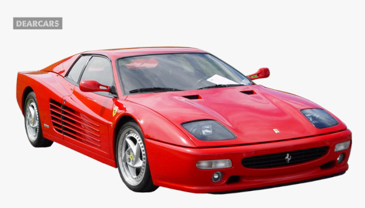
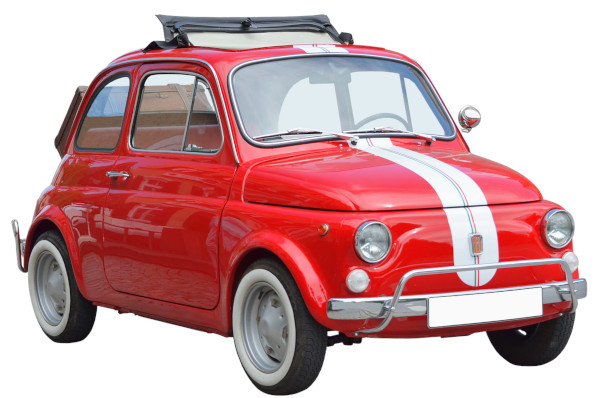

class: middle, center

# Tree bagging and Random Forest

---

## The (bad) flexibility of trees

.cols[
.c50[
Consider this dataset obtained from a system:

.w100p.center[]

.question[Question:] how would you "draw the system" behind this data?
]
.c50[
If we learn a regression tree with **low flexibility**:
- the model will not capture the system behavior
- it will **underfit** the data and the system

If we learn a regression tree with **high flexibility**:
- the model will likely better capture the system behavior, but...
- it will also model some noise
- it will **overfit** the data

It might be that there is no flexibility value for which we have no underfitting nor overfitting.
]
]

--

What's that point (at $(\\approx 80, \\approx 22)$)?
- **noise**, or, from another point of vie, a **detail** of the data, rather than of the system, that we don't want to model

What if we collect dataset out of the same system?

---

## Human-learning and cars

- **Task**: learning a model of (the concept) of *car* from (one) example
- **Model**: a description in natural language
- **Flexibility**: amount of characters available for the model

--

.cols[
.c20[
.h10ex.center[]
]
.c30[
**Model** with low complexity:

"a moving object"
]
.c50[
**Model** with high complexity:

"a blue-colored moving object with 4 wheels, 2 doors, chromed fenders, a windshield, curved rear enclosing engine"
]
]

--

.cols[
.c20[
.h10ex.center[]
]
.c30[
"a moving object"
]
.c50[
"a red-colored moving object with 4 wheels, 2 doors, side air intakes, a windshield, a small horse figure"
]
]

--

.cols[
.c20[
.h10ex.center[]
]
.c30[
"a moving object"
]
.c50[
"a small red-colored moving object with 4 wheels, 2 doors, a white stripe on the front, a windshield, chromed fenders, sunroof"
]
]

---

## Modeled details

.center.nicetable[
|Low complexity|High complexity|
|---|---|
|"a moving object"|"a blue-colored moving object with 4 wheels, 2 doors, chromed fenders, curved rear enclosing engine"|
|"a moving object"|"a red-colored moving object with 4 wheels, 2 doors, side air intakes, and a small horse figure"|
|"a moving object"|"a small red-colored moving object with 4 wheels, 2 doors, a white stripe on the front, chromed fenders, sunroof"|
]

**Low flexibility**: never gives enough details about the system

**High flexibility**: *always* gives a fair amount of details about the system, but also about noise

.vspace1[ ]

--

What if we **combine** different models with high complexity?
- "a [...] moving object with 4 wheels, 2 doors, [...], a windshield, [...]"
- much more detail about the system, no details about the noise
- i.e., no underfitting 😁, no overfitting 😁

--

When "learners" are common people, this idea is related with the **wisdom of the crowds theorem**, stating that *a collective opinion may be better than a single expert's opinion*.

---

## Wisdom of the crowds

.center[*a collective opinion may be better than a single expert's opinion*]

Yes, but only if:
- we have many opinions
- the opinions are independent
- we have a way to aggregate them

.vspace1[]

--

Can we realize a **wisdom of the tree**? (where opinion $\\leftrightarrow$ tree)

- we have many opinions
  - **ok, just learn many models**
- the opinions are independent
  - **...** 🤔
- we have a way to aggregate them
  - **aggregate predictions**:
      - classification: majority
      - regression: average

---

## Independency of trees

A tree is the result of the execution of $f'\\subtext{learn}$ on a learning set $D\\subtext{learn} = \\seq{(x^{(i)},y^{(i)})}{i}$.

$f'\\subtext{learn}$ is deterministic:
- if we apply $f'\\subtext{learn}$ twice on the same learning set, we obtain two equal models
- if we apply $f'\\subtext{learn}$ $m$ times on the same dataset, we obtain $m$ equal models
- **no independency**

.vspace1[]

In order to obtain different trees, we need to apply $f'\\subtext{learn}$ on different learning sets!

But we have just one learning set... 🤔

.footnote[
.question[Question]: what's the learning set for human-learners?
]

---

## Different learning sets

**Goal**: obtaining $m$ different datasets $D\_{\\text{learn},1}, \\dots, D\_{\\text{learn},m}$ from a dataset $D\\subtext{learn}$
- *decently* **different** from each other
- all being *decently* **representative** of the underlying system (not too worse than $D\\subtext{learn}$)

--

.cols[
.c40[
**Option 1**: (CV-like)

1. shuffle $D\\subtext{learn}$
2. split $D\\subtext{learn}$ in $m$ folds
3. assign each $D\_{\\text{learn},j}$ to the $j$-th fold

]
.c60[
**Requirements** check:
- 👍 the folds are in general different from each other
- 👎 if $m$ is large, each $D\_{\\text{learn},j}$ is small, with size $\\frac{1}{m} |D\\subtext{learn}|$, and is likely poorly representative of the system
]
]

--

.cols[
.c40[
**Option 2**: rand. sampling w/ repetitions
1. for each $j \\in \\{1, \\dots, m\\}$
  1. start with an empty $D\_{\\text{learn},j}$
  2. repeat $n=|D\\subtext{learn}|$ times
      1. pick a random el. of $D\\subtext{learn}$
      2. add it to $D\_{\\text{learn},j}$
]
.c60[
**Requirements** check:
- 👍 the folds are in general different from each other
- 👍 regardless of $m$, each $D\_{\\text{learn},j}$ as large as $D\\subtext{learn}$
  - you can freely choose $m$, even $m \\ge n$!
]
]

---

<!--
- give alg for random sampling with repetition
  - highlight randomness -> say no more deterministic
- say this is called bootstrapping when used for estimating some statistics and it's a form of resampling
- (maybe) discuss probability of being different
- (maybe) show example

- give algorithm for tree bagging
- discass impact of n_tree: on one hand, more details potentially captured; on the other hand, more likely they are smoothed away by averaging
- say default is good

-->
