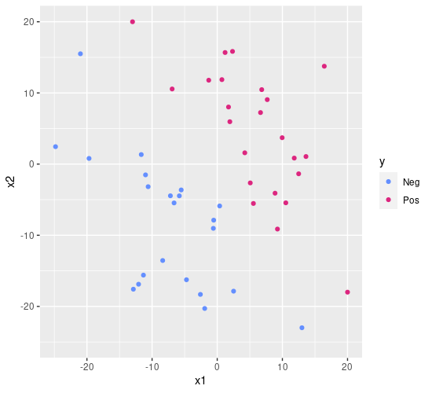

class: middle, center

# Support Vector Machines

---

## Building on the weakness of the tree

.cols[
.c50[
.w100p.center[]
<!--
> d = read.table("svm-linear.txt", header = T)
> d %>% ggplot(aes(x1,x2,color=y))+geom_point()+xlim(c(-25,20))+ylim(c(-25,20))+scale_color_manual(values=c("#648FFF", "#DC267F", "#FE6100", "#785EF0", "#FFB000"))
-->
]
.c50[
Dataset:
 - $Y=\\{\\c{1}{●},\\c{2}{●}\\}$
 - $X=\\mathbb{R}^2$

A single tree, here, would struggle in establishing a good decision boundary: many corners, many branch nodes.

By looking at the data, we see that a **simple line** would likely be a good **decision boundary**
- recall: the decision boundary in classification is where the model change the $y$ when $x$ crosses it

.vspace1[]

**Can we draw that simple line?**
]
]

---

## Line as decision boundary

.cols[
.c50[
.w100p.center[]
<!--
> d %>% ggplot(aes(x1,x2,color=y))+geom_point()+xlim(c(-25,20))+ylim(c(-25,20))+scale_color_manual(values=c("#648FFF", "#DC267F", "#FE6100", "#785EF0", "#FFB000")) + geom_abline(intercept=-2, slope=-1.1)
-->
]
.c50[
Yes, we can!
Here it is!

Despite its apparent simplicity, this "draw the line" operation implies:
- we think that a line **—** can be used to tell apart .col1[●] and .col2[●] points
  - the line **—** is **a model**
  - we know how to **use a model**
- we executed some **procedure for finding the line** out of the data

Implicitly, we already *defined* $M$, $f'\\subtext{learn}: \\mathcal{P}^*(\\mathbb{R} \\times Y) \\to M$, and $f'\\subtext{predict}: \\mathbb{R}^2 \\times M \\to Y$
- i.e., we defined a new **learning technique** 🤗

.note[
We followed the same approach for trees: now we are more experienced and we can go faster in formalizing it.
]
]
]

---

## Line as a model

Formally, a line-shaped decision boundary in $X=\\mathbb{R}^2$ can be defined as
$$x\_2=m x\_1 +q$$
where $m$ is the slope and $q$ is the intercept.

Alternatively, as: .note[there are *many* triplets $(\\beta\_0, \\beta\_1, \\beta\_2)$ defining the same line]
$$\\beta\_0+\\beta\_1 x\_1+\\beta\_2 x\_2=0$$

More in general, in $X=\\mathbb{R}^p$, we can define a .key[separating hyperplane] as:
$$\\beta\_0+\\beta\_1 x\_1+\\dots+\\beta\_p x\_p=0$$
or, in vectorial form, as: .note[$\\vect{\\beta}, \\vect{x} \\in \\mathbb{R}^p$]
$$\\beta\_0+\\vect{\\beta}^\\intercal\\vect{x}=0$$
- separating, because it can be used to separate the space in **two** parts
- hyperplane, because we are in $\\mathbb{R}^p$ .note[$p=1$: threshold; $p=2$: line; $p=3$: plane; $p>3$: hyperplane]

---

## Using a separating hyperplane

.cols[
.c50[
.w100p.center[]
]
.c50.compact[
**Intuitively**:
- if the point $\\vect{x}$ is **above** the line, then $y=\\c{2}{●}$
- else, if the point $\\vect{x}$ is **below** the line, then $y=\\c{1}{●}$
- else, if the point $\\vect{x}$ is **on** line, then 🤔

**Formally**:
- $\\vect{x}$ is .col3[**on**] the line iff $\\beta\_0+\\beta\_1 x\_1+\\beta\_2 x\_2 \\c{3}{=} 0$
- $\\vect{x}$ is .col3[**above**] the line iff $\\beta\_0+\\beta\_1 x\_1+\\beta\_2 x\_2 \\c{3}{>} 0$
- $\\vect{x}$ is .col3[**below**] the line iff $\\beta\_0+\\beta\_1 x\_1+\\beta\_2 x\_2 \\c{3}{<} 0$

.vspace1[]

**Example**:
This particular line is: $2+1.1 x\_1 + x\_2 = 0$

For $\\vect{x}=(10,10)$:
- $2+1.1 x\_1 + x\_2 = 2+11+10=23 \\c{3}{>} 0$
- hence $y=\\c{2}{●}$ (above)

For $\\vect{x}=(-10,-10)$:
- $2+1.1 x\_1 + x\_2 = 2-11-10=-19 \\c{3}{<} 0$
- hence $y=\\c{1}{●}$ (above)
]
]

<!--
show f_predict
discuss = case
discuss magnitude of diff
discuss as confidence/probability
-->
