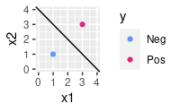
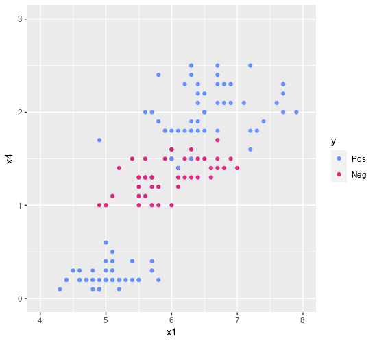
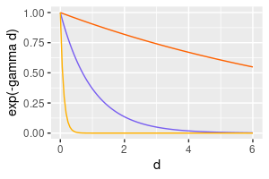
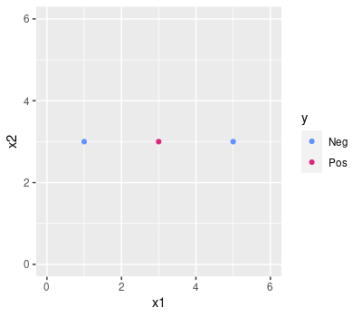
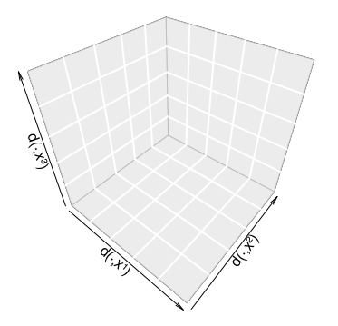
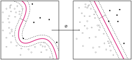

class: middle, center
name: svm

# Support Vector Machines

---

## Building on the weakness of the tree

.cols[
.c50[
.w100p.center[]
<!--
d = read.table("svm-linear.txt", header = T)
d %>% ggplot(aes(x1,x2,color=y))+geom_point()+xlim(c(-25,20))+ylim(c(-25,20))+scale_color_manual(values=c("#648FFF", "#DC267F", "#FE6100", "#785EF0", "#FFB000"))
-->
]
.c50[
Dataset:
 - $Y=\\{\\c{1}{●},\\c{2}{●}\\}$
 - $X=\\mathbb{R}^2$

A single tree, here, would struggle in establishing a good decision boundary: many corners, many branch nodes.

By looking at the data, we see that a **simple line** would likely be a good **decision boundary**
- recall: the decision boundary in classification is where the model change the $y$ when $x$ crosses it

.vspace1[]

**Can we draw that simple line?**
]
]

---

## Line as decision boundary

.cols[
.c50[
.w100p.center[]
<!--
d %>% ggplot(aes(x1,x2,color=y))+geom_point()+xlim(c(-25,20))+ylim(c(-25,20))+scale_color_manual(values=c("#648FFF", "#DC267F", "#FE6100", "#785EF0", "#FFB000")) + geom_abline(intercept=-2, slope=-1.1)
-->
]
.c50[
Yes, we can!
Here it is!

Despite its apparent simplicity, this "draw the line" operation implies:
- we think that a line **—** can be used to tell apart .col1[●] and .col2[●] points
  - the line **—** is **a model**
  - we know how to **use a model**
- we executed some **procedure for finding the line** out of the data

Implicitly, we already *defined* $M$, $f'\\subtext{learn}: \\mathcal{P}^*(\\mathbb{R} \\times Y) \\to M$, and $f'\\subtext{predict}: \\mathbb{R}^2 \\times M \\to Y$
- i.e., we defined a new **learning technique** 🤗

.note[
We followed the same approach for trees: now we are more experienced and we can go faster in formalizing it.
]
]
]

---

## Line as a model

Formally, a **line**-shaped decision boundary in $X=\\mathbb{R}^2$ can be defined as
$$x\_2=m x\_1 +q$$
where $m$ is the slope and $q$ is the intercept.

Alternatively, as: .note[there are *many* triplets $(\\beta\_0, \\beta\_1, \\beta\_2)$ defining the same line]
$$\\beta\_0+\\beta\_1 x\_1+\\beta\_2 x\_2=0$$

More in general, in $X=\\mathbb{R}^p$, we can define a .key[separating hyperplane] as:
$$\\beta\_0+\\beta\_1 x\_1+\\dots+\\beta\_p x\_p=0$$
or, in vectorial form, as: .note[$\\vect{\\beta}, \\vect{x} \\in \\mathbb{R}^p$]
$$\\beta\_0+\\vect{\\beta}^\\intercal\\vect{x}=0$$
- separating, because it can be used to separate the space in **two** parts
- hyperplane, because we are in $\\mathbb{R}^p$ .note[$p=1$: threshold; $p=2$: line; $p=3$: plane; $p>3$: hyperplane]

---

## Using a separating hyperplane

.cols[
.c50[
.w100p.center[]
]
.c50.compact[
**Intuitively**:
- if the point $\\vect{x}$ is **above** the line, then $y=\\c{2}{●}$
- else, if the point $\\vect{x}$ is **below** the line, then $y=\\c{1}{●}$
- else, if the point $\\vect{x}$ is **on** line, then 🤔

**Formally**:
- $\\vect{x}$ is .col3[**on**] the line iff $\\beta\_0+\\beta\_1 x\_1+\\beta\_2 x\_2 \\c{3}{=} 0$
- $\\vect{x}$ is .col3[**above**] the line iff $\\beta\_0+\\beta\_1 x\_1+\\beta\_2 x\_2 \\c{3}{>} 0$
- $\\vect{x}$ is .col3[**below**] the line iff $\\beta\_0+\\beta\_1 x\_1+\\beta\_2 x\_2 \\c{3}{<} 0$

.vspace1[]

**Example**:
This particular line is: $2+1.1 x\_1 + x\_2 = 0$

For $\\vect{x}=(10,10)$:
- $2+1.1 x\_1 + x\_2 = 2+11+10=23 \\c{3}{>} 0$
- hence $y=\\c{2}{●}$ (above)

For $\\vect{x}=(-10,-10)$:
- $2+1.1 x\_1 + x\_2 = 2-11-10=-19 \\c{3}{<} 0$
- hence $y=\\c{1}{●}$ (above)
]
]

---

## $f'\\subtext{predict}$ with a separating hyperplane

.cols[
.c50[
.diagram.center[
link([0,25,150,25],'a')
rect(150,0,150,50)
link([300,25,400,25],'a')
otext(225,25,"$f'\\\\subtext{predict}$")
otext(75,10,'$\\\\vect{x},(\\\\beta\\_0,\\\\vect{\\\\beta})$')
otext(350,10,'$y$')
]

.pseudo-code.compact[
function $\\text{predict}(\\vect{x}, \\c{1}{(\\beta\_0, \\vect{\\beta})})$ {  
.i[]if $\\beta\_0+\\vect{\\beta}^\\intercal\\vect{x} \\c{2}{\\ge} 0$ then {  
.i[].i[]return $\\text{Pos}$  
.i[]} else {  
.i[].i[]return $\\text{Neg}$  
.i[]}  
}
]

**Assumptions**:
- $Y = \\{\\text{Pos},\\text{Neg}\\}$
  - **binary classification only!**¹
- $X = \\mathbb{R}^p$
  - **numerical independent variables only!**²

]
.c50[
- .col1[$\\vect{x}, (\\beta\_0, \\vect{\\beta})$] is the model
- $y = \\text{Pos}$ for both the .col2[$>$] and .col2[$=$] cases
  - $y = \\text{Neg}$ for .col2[$<$], i.e., otherwise
- computationally **very fast**: just $p$ multiplications and sums
]
]

.footnote[
1. we'll see later how to *port* this to the case of $|Y| > 2$
2. we'll see later how to *port* this to the case of categorical variable
]

---

## Separating hyperplane with probability

.cols[
.c60[
Intuitively, for .col3[$\\beta\_0+\\vect{\\beta}^\\intercal\\vect{x}$]
- the greater (**positive and large**), the *more satisfied* the $\\ge 0$ condition, hence the **more positive**
- the smaller (**negative and large**), the *more satisfied* the $< 0$ condition, hence the **more negative**
]
.c40[
.pseudo-code.compact[
function $\\text{predict}(\\vect{x}, (\\beta\_0, \\vect{\\beta}))$ {  
.i[]if $\\c{3}{\\beta\_0+\\vect{\\beta}^\\intercal\\vect{x}} \\ge 0$ then {  
.i[].i[]return $\\text{Pos}$  
.i[]} else {  
.i[].i[]return $\\text{Neg}$  
.i[]}  
}
]

]
]

**Can we use this like a probability?** Can we have an $f''\\subtext{predict}$ for the hyperplane?
- recall the single tree: $f''\\subtext{predict}(x,t)=(\\c{1}{● \\smaller{\\frac{3}{5}}}, \\c{2}{● \\smaller{\\frac{2}{5}}})$ .note[.question[question]: can we infer something about $n=|D\\subtext{learn}|$ form this?]
- recall the bag (assume $n\\subtext{tree}=100$): $f''\\subtext{predict}(x,\\seq{t\_j}{j})=(\\c{1}{● \\smaller{\\frac{38}{100}}}, \\c{2}{● \\smaller{\\frac{62}{100}}})$

--

**No!**
Because .col3[$\\beta\_0+\\vect{\\beta}^\\intercal\\vect{x}$] is not bounded in $[0,1]$
- we can still use it as a measure of confidence: the smaller $|\\beta\_0+\\vect{\\beta}^\\intercal\\vect{x}|$, **the lower the confidence** in the decision; in the extreme case $|\\beta\_0+\\vect{\\beta}^\\intercal\\vect{x}|=0$ means **no confidence**, i.e., both $y=\\text{Pos}$ and $y=\\text{Neg}$ are ok

.note[
You may map the domain of $\\beta\_0+\\vect{\\beta}^\\intercal\\vect{x}$, i.e., $[-\\infty,+\\infty]$ to $[0,1]$ with, e.g., $\\tanh$: if $x \\in [-\\infty,+\\infty]$, then $\\frac{1}{2}+\\frac{1}{2}\\tanh(x) \\in [0,1]$.  
But this is not a common practice, because it still would not be a *real* probability.
]

---

## Learning the separating hyperplane

.cols[
.c50[
.w100p.center[]
]
.c50[
**How to choose the separating line?**

.vspace1[]

**First attempt:**

Choose *the* one that:
- perfectly separates the .col1[●] and .col2[●] points
]
]

---

## Learning the separating hyperplane

.cols[
.c50[
.w100p.center[]
<!--
d %>% ggplot(aes(x1,x2,color=y))+geom_point()+xlim(c(-25,20))+ylim(c(-25,20))+scale_color_manual(values=c("#648FFF", "#DC267F", "#FE6100", "#785EF0", "#FFB000")) + geom_abline(intercept=-2, slope=-1.1) + geom_abline(intercept=-4, slope=-1.4) + geom_abline(intercept=-1, slope=-1)
-->
]
.c50[
**How to choose the separating line?**

.vspace1[]

**First attempt:**

Choose *the* one that:
- perfectly separates the .col1[●] and .col2[●] points

🫣 this condition holds in general, for infinite lines...

.vspace1[]

**Second attempt:**

Choose the one that:
- perfectly separates the .col1[●] and .col2[●] points **and**
- is the farthest from the closest points

]
]

---

## Learning the separating hyperplane

.cols[
.c50[
.w100p.center[]
<!--
)) + geom_abline(intercept=-1.89, slope=-1.2898) + geom_abline(intercept=-5.4, slope=-1.2898, linetype="dashed") + geom_abline(intercept=1.63, slope=-1.2898, linetype="dashed")+geom_point()
-->
]
.c50[
**How to choose the separating line?**

.vspace1[]

**First attempt:**

Choose *the* one that:
- perfectly separates the .col1[●] and .col2[●] points

🫣 this condition holds in general, for infinite lines...

.vspace1[]

**Second attempt:**

Choose the one that:
- perfectly separates the .col1[●] and .col2[●] points **and**
- is the farthest from the closest points

]
]

---

## The maximal margin classifier

.cols[
.c50[
.w100p.center[]
]
.c50[
The hyperplane that
- perfectly separates the $\\text{Pos}$ and $\\text{Neg}$ points **and**
- is the farthest from the closest points

is called the .key[maximal margin classifier] (MMC).

.vspace1[]

Maximal margin classifier:
- **classifier**, because it can be used for classifying point,
  - since it is a separating hyperplane that divides thes space in two portions
- **maximal margin**: because it is the one leaving the largest distance (**margin**) from the closest points
]
]

---

## Support vectors

.cols[
.c50[
.w100p.center[]
]
.c50[
**Names**:
- the band from **- -** to **- -** (through **—**) is the **margin**
- the points lying on the edge of the margin are called .key[support vectors]
  - they **support** the band in its position, like nails 📍 with a wooden ruler 📏
  - they are points in $\\mathbb{R}^p$, hence **vectors**
  - here, two .col2[●].col2[●] and one .col1[●]

.vspace1[]

If you move (not too much) any of the points which are not support vectors, the separating hyperplane stays the same!
]
]

---

## Learning the maximal margin classifier

**Intuitively**:
.cols[
.c60[
Choose the one that:
- .col3[perfectly separates] the $\\text{Pos}$ and $\\text{Neg}$ points and
- .col4[is the farthest] from the closest points
]
.c40[
Looks like an **optimization** problem:
- "perfectly separates" $\\rightarrow$ .col3[constraint]
- "is the farthest" $\\rightarrow$ .col4[objective]
]
]

--

**Formally**:
.cols[
.c60.compact[
$$
\\begin{align\*}
\\max\_{\\beta\_0, \\dots, \\beta\_p} & \\; \\c{4}{m} \\\\
\\text{subject to} & \\; \\c{3}{\\sum\_{j=1}^{j=p} \\beta\_j^2 = \\vect{\\beta}^\\intercal\\vect{\\beta}= 1} \\\\
& \\; \\c{3}{y^{(i)}\\left(\\beta\_0+\\vect{\\beta}^\\intercal\\vect{x}^{(i)}\\right) \\ge m} & \\c{3}{\\forall i \\in \\{1, \\dots, n\\}}
\\end{align\*}
$$
that means:
- find the largest $m$, such that
- every point $\\vect{x}^{(i)}$ .col3[is at a distance] $\\ge m$ from the hyperplane
- and .col3[is on the proper side]
]
.c40.compact[
**Assume by convention** that $\\text{Pos} \\leftrightarrow +1$ and $\\text{Neg} \\leftrightarrow -1$, so $y^{(i)}(\\dots) \\ge m$ is like $\\dots \\ge m$ for positives **and** $\\dots \\le -m$ for negatives

- $\\beta\_0, \\dots, \\beta\_p$, that is the **model** $(\\beta\_0, \\vect{\\beta})$, is what we are looking for
- *mathematically*, if $\\sum\_{j=1}^{j=p} \\beta\_j^2 = 1$, then $\\beta\_0+\\vect{\\beta}^\\intercal\\vect{x}$ is the Euclidean distance of $\\vect{x}$ from the hyperplane (with sign)
- $y^{(i)}\\left(\\beta\_0+\\vect{\\beta}^\\intercal\\vect{x}^{(i)}\\right) \\ge m$ is $=$ for support vectors and $>$ for the other points
]
]

---

## $f'\\subtext{learn}$ for the maximal margin classifier

.cols[
.c50[
.diagram.center[
link([0,25,150,25],'a')
rect(150,0,100,50)
link([250,25,350,25],'a')
otext(200,25,"$f'\\\\subtext{learn}$")
otext(75,5,'$\\\\seq{(x^{(i)},y^{(i)})}{i}$')
otext(300,10,'$(\\\\beta\\_0,\\\\vect{\\\\beta})$')
]

.pseudo-code.compact[
function $\\text{learn}(\\seq{(\\vect{x}^{(i)},y^{(i)})}{i})$ {  
.i[]$(\\beta\_0,\\vect{\\beta}) \\gets \\c{1}{\\text{solve}(}$  
.i[].i[].col4[$\\max\_{\\beta\_0,\\dots,\\beta\_p} m,$]  
.i[].i[].col3[$\\vect{\\beta}^\\intercal\\vect{\\beta}= 1 \\land y^{(i)}(\\beta\_0+\\vect{\\beta}^\\intercal\\vect{x}^{(i)}) \\ge m, \\forall i$]  
.i[].col1[$)$]  
.i[]return $(\\beta\_0,\\vect{\\beta})$  
}
]

]
.c50[
- .col1[$\\text{solve}()$] is *just* a solver for numerical optimization problems which takes the .col4[objective] and the .col3[constraints]
]
]

In practice, this is an *easy* optimization problem and solving it is **fast**! .note[for a computer]

---

## Maximal marginal classifier learning

.cols[
.c50[

This learning technique is called .key[maximal margin classifier] learning.

**Efficiency**: 👍
- 👍👍👍 very fast, both in learning and prediction

**Applicability**: 🫳
- 🫳 just binary classification .note[more on this later]
- 🫳 just numerical variables .note[more on this later]
- 👍 parameter-free!

**Effectiveness**: 🤔
- overfitting? well, no flexibility, so... 🤔
  - what's complexity here? the *size* of the model is always $p+1$

]
.c50[
.pseudo-code.compact[
function $\\text{learn}(\\seq{(\\vect{x}^{(i)},y^{(i)})}{i})$ {  
.i[]$(\\beta\_0,\\vect{\\beta}) \\gets \\text{solve}($  
.i[].i[]$\\max\_{\\beta\_0,\\dots,\\beta\_p} m,$  
.i[].i[]$\\vect{\\beta}^\\intercal\\vect{\\beta}= 1 \\land y^{(i)}(\\beta\_0+\\vect{\\beta}^\\intercal\\vect{x}^{(i)}) \\ge m, \\forall i$  
.i[]$)$  
.i[]return $(\\beta\_0,\\vect{\\beta})$  
}
]

.vspace1[]

.pseudo-code.compact[
function $\\text{predict}(\\vect{x}, (\\beta\_0, \\vect{\\beta}))$ {  
.i[]if $\\beta\_0+\\vect{\\beta}^\\intercal\\vect{x} \\ge 0$ then {  
.i[].i[]return $\\text{Pos}$  
.i[]} else {  
.i[].i[]return $\\text{Neg}$  
.i[]}  
}
]

]
]

---

## Maximal margin classifier: issue 1

.cols[
.c50[
.w100p.center[]
]
.c50[
**Support vectors**:
- they support the band in its position, **like nails 📍 with a wooden ruler 📏**
- here, two .col2[●].col2[●] and one .col1[●]

If you move (not too much) any of the points which are not support vectors, the separating hyperplane stays the same!

.vspace1[]

**But**, if you move a support vector, then the separating hyperplane moves!
- i.e., for small changes of (some) observations (**apply some noise** to some $\\vect{x}^{(i)}$), the model changes: looks like **variance**
]
]

---

## Maximal margin classifier: issue 2

.cols[
.c50[
.w100p.center[]
]
.c50[
**Even worse**, if you **apply some noise**¹ to some label $y^{(i)}$, it might be that a separatying hyperplane **does not exist** at all! 😱
- in practice, the $\\text{solve}()$ function just halts and say "there's no solution for this optimization problem".

$\\Rightarrow$ **Applicability**: 👎👎👎

.vspace1[]

**How did the tree cope with $y$ noise?**
- simply by **tolerating**² some wrong classifications also on the learning data

**Can we make MMC tolerant too?**

]
]

.footnote[
1. noise to the $y$: recall the carousel attendat's kids...
2. if $n\\subtext{tree}$ was large enough
]

---

## Introducing tolerance (1st formulation)

.cols[
.c60.compact[
$$
\\begin{align\*}
\\max\_{\\beta\_0, \\dots, \\beta\_p,\\c{1}{\\epsilon^{(1)},\\dots,\\epsilon^{(n)}}} & \\; m \\\\
\\text{subject to} & \\; \\vect{\\beta}^\\intercal\\vect{\\beta}= 1 \\\\
& \; y^{(i)}\\left(\\beta\_0+\\vect{\\beta}^\\intercal\\vect{x}^{(i)}\\right) \\ge m\\c{1}{(1-\\epsilon^{(i)})} & \\forall i \\in \\{1, \\dots, n\\} \\\\
& \; \\c{1}{\\epsilon^{(i)}} \\ge 0 & \\forall i \\in \\{1, \\dots, n\\} \\\\
& \; \\sum\_{i=1}^{i=n} \\c{1}{\\epsilon^{(i)}} = \\c{2}{c}
\\end{align\*}
$$
]
.c40.compact[
- .col1[$\\epsilon^{(1)},\\dots,\\epsilon^{(n)}$] are positive **slack** variables:
  - one for each observation
  - they act as tolerance w.r.t. the margin
      - $\\epsilon^{(i)}=0$ means $\\vect{x}^{(i)}$ has to be **out of the margin, on correct side**
      - $\\epsilon^{(i)} \\in [0,1]$ means $\\vect{x}^{(i)}$ can be **inside the margin, on correct side**
      - $\\epsilon^{(i)} > 1$ means $\\vect{x}^{(i)}$ can be on **wrong side**
- $\\c{2}{c} \\in \\mathbb{R}^+$ (for cost), is a budget of .col2[**tolerance**], which is a **parameter** of the learning technique
]
]

This learning technique is called .key[soft margin classifier] (SMC, or support vector classifier), because, due to tolerance, the margin can be *pushed*.

It has one parameter, $c$:
- $c=0$ corresponds to maximal margin classifier (no tolerance)

---

## Role of the parameter $c$ (in 1st formulation)

.compact[
$$
\\begin{align\*}
\\max\_{\\beta\_0, \\dots, \\beta\_p,\\c{1}{\\epsilon^{(1)},\\dots,\\epsilon^{(n)}}} & \\; m \\\\
\\text{subject to} & \\; \\vect{\\beta}^\\intercal\\vect{\\beta}= 1 \\\\
& \; y^{(i)}\\left(\\beta\_0+\\vect{\\beta}^\\intercal\\vect{x}^{(i)}\\right) \\ge m\\c{1}{(1-\\epsilon^{(i)})} & \\forall i \\in \\{1, \\dots, n\\} \\\\
& \; \\c{1}{\\epsilon^{(i)}} \\ge 0 & \\forall i \\in \\{1, \\dots, n\\} \\\\
& \; \\sum\_{i=1}^{i=n} \\c{1}{\\epsilon^{(i)}} = \\c{2}{c}
\\end{align\*}
$$
]

.col2[$c=+\\infty$] $\\rightarrow$ .col2[infinite tolerance] $\\rightarrow$ **you can put the line wherever you want**
- from another point of view, you can move *a lot* the points and the line stay the same
- hence the model is the same irrespective of learning data $\\Rightarrow$ **high bias**

.col2[$c=0$] $\\rightarrow$ .col2[no tolerance] $\\rightarrow$ **any noise will change the model**
- hence **high variance**
- **even worse**: if $c$ is too small, this is an $\\approx$ MMC
  - for a given dataset, there is a $c\\subtext{learnable}$ sucht that if $c<c\\subtext{learnable}$ no model is learnable 😱

---

## Variable scale

The threshold $c\\subtext{learnable}$ for **learnability** depends:
- on $n$, for the summation $\\sum\_{i=1}^{i=n}$
- on $p$, because of $\\beta\_0+\\vect{\\beta}^\\intercal\\vect{x}^{(i)}$ .note[the larger $p$, the *longer* the summation, as $\\vect{\\beta}^\\intercal\\vect{x}^{(i)}=\\sum\_{j=1}^{j=p} \\beta\_j x\_j$]
- on the actual **scales of the variables**

--

Actually, the **margin** $m$ of the MMC itself depends on the scales of variables!
.cols[
.c50.center[
**Original dataset**
]
.c50[
**Scaled dataset**: each $x\_j$ is $\\times \\frac{1}{2}$
]
]
.cols[
.c30[
.w85p.center[]
<!--
d1 = as.data.frame(cbind(x1=c(1,3),x2=c(1,3)))
d1$y = as.factor(c("Neg","Pos"))
d1 %>% ggplot(aes(x1,x2,color=y))+geom_point()+xlim(c(0,4))+ylim(c(0,4))+scale_color_manual(values=c("#648FFF", "#DC267F", "#FE6100", "#785EF0", "#FFB000")) + geom_abline(intercept=4, slope=-1)
-->
]
.c20.compact[
$D = \\{$  
.i[]$(1,1,\\c{1}{●}),$  
.i[]$(3,3,\\c{2}{●})$  
$\\}$

]
.c30[
.w85p.center[]
<!--
d2 = d1; d2$x1 = d2$x1/2; d2$x2 = d2$x2/2
d2 %>% ggplot(aes(x1,x2,color=y))+geom_point()+xlim(c(0,4))+ylim(c(0,4))+scale_color_manual(values=c("#648FFF", "#DC267F", "#FE6100", "#785EF0", "#FFB000")) + geom_abline(intercept=2, slope=-1)
-->
]
.c30.compact[
$D = \\{$  
.i[]$(0.5,0.5,\\c{1}{●}),$  
.i[]$(1.5,1.5,\\c{2}{●})$  
$\\}$
]
]
.cols[
.c50.center[
$m=\\sqrt{1^2+1^2}=\\sqrt{2}$
]
.c50.center[
$m=\\sqrt{\\frac{1}{2^2}+\\frac{1}{2^2}}=\\frac{1}{\\sqrt{2}}$
]
]

---

## Variable scale and hyperplane

Moreover, the **coefficients** $\\beta\_j$ depend on the scales of the variables too!

Intuitively: if
- $x\_j \\in [1.4, 2.1]$ (might be the height in meters)
- and $x\_{j'} \\in [20000, 50000]$ (might be the annual income in €)

then $\\beta\_j$ will be much different than $\\beta\_{j'}$, making the computation of $\\beta\_0+\\vect{\\beta}^\\intercal\\vect{x}^{(i)}$ (and hence the model) rather sensible to noise.

--

.vspace1[]

Hence, when using MMC (or SMC, or SVM), **you¹ should rescale the variables**.
Options:
- **min-max** scaling: $x^{\\prime(i)}\_j = \\frac{x^{(i)}\_j - \\min\_{i'} x^{(i')}\_j}{\\max\_{i'} x^{(i')}\_j - \\min\_{i'} x^{(i')}\_j}$ .note[where $\\min\_{i'} x^{(i')}\_j$ is the min of $x\_j$ in $D$]
- **standardization**: $x^{\\prime(i)}\_j = \\frac{1}{\\sigma\_j} \\left(x^{(i)}\_j - \\mu\_j\\right)$ .note[where $\\mu\_j$ and $\\sigma\_j$ are the mean and standard deviation of $x\_j$ in $D$]

Standardization is, in general, preferred as it is more robust to outliers.

.footnote[
1. In practice, most of the ML sw/libraries do it internally.
]

---

## Scaling as part of the model

Since you have to do the scaling both **in learning and prediction**, the coefficients needed for scaling (i.e., $\\min, \\max$ or $\\mu, \\sigma$) do .col2[**belong to the model**]!

.vspace1[]

**Learning with scaling**: (here, standardization)

.diagram.center[
link([0,25,180,25],'a')
otext(90,10,'$\\\\seq{(\\\\vect{x}^{(i)},y^{(i)})}{i}$')
rect(180,0,120,50)
otext(240,25,"scaling")
link([300,25,480,25],'a')
otext(390,10,'$\\\\seq{(\\\\vect{x}^{\\\\prime(i)},y^{(i)})}{i}$')
rect(480,0,120,50)
otext(540,25,"$f'\\\\subtext{learn}$")
link([600,25,650,25],'a')
otext(625,10,"$m$")
circle(675,25,25)
otext(675,25,"join")
link([700,25,850,25],'a')
otext(775,10,"$(m,\\\\vect{\\\\mu},\\\\vect{\\\\sigma})$", "col2")
link([300,35,350,35,350,75,675,75,675,50],'a')
otext(400,60,"$(\\\\vect{\\\\mu},\\\\vect{\\\\sigma})$")
]

$(m,\\vect{\\mu},\\vect{\\sigma})$ **is the model** with scaling, with $\\vect{\\mu},\\vect{\\sigma} \\in \\mathbb{R}^p$. .note[Here, *join* builds a tuple]

.vspace1[]

**Prediction with scaling**:

.diagram.center[
link([0,25,180,25],'a')
otext(90,10,'$\\\\vect{x},\\\\c{2}{(m,\\\\vect{\\\\mu},\\\\vect{\\\\sigma})}$')
circle(205,25,25)
otext(205,25,"split")
link([230,25,350,25],'a')
otext(290,10,'$\\\\vect{x},\\\\vect{\\\\mu},\\\\vect{\\\\sigma}$')
rect(350,0,120,50)
otext(410,25,"scale")
link([470,25,520,25],'a')
otext(495,10,"$\\\\vect{x}'$")
circle(545,25,25)
otext(545,25,"join")
link([570,25,670,25],'a')
otext(620,10,"$\\\\vect{x}',m$")
rect(670,0,120,50)
otext(730,25,"$f'\\\\subtext{predict}$")
link([790,25,840,25],'a')
otext(815,10,"$y$")
link([205,50,205,75,545,75,545,50],'a')
otext(290,60,"$m$")
]

.note[
If you use the entire dataset (e.g., in CV, or in train/test static division) for computing $\\vect{\\mu},\\vect{\\sigma}$, then **you are cheating**!  
.question[Question]: can you write down the pseudocode of "scale"? And scaling? Are they the same?
]
---

## Introducing tolerance (2nd formulation)

.cols[
.c60.compact[
$$
\\begin{align\*}
\\max\_{\\beta\_0, \\dots, \\beta\_p,\\c{1}{\\epsilon^{(1)},\\dots,\\epsilon^{(n)}}} & \\; m - \\c{2}{c} \\c{1}{\\sum\_{i=1}^{i=n} \\epsilon^{(i)}} \\\\
\\text{subject to} & \\; \\vect{\\beta}^\\intercal\\vect{\\beta}= 1 \\\\
& \; y^{(i)}\\left(\\beta\_0+\\vect{\\beta}^\\intercal\\vect{x}^{(i)}\\right) \\ge m\\c{1}{(1-\\epsilon^{(i)})} & \\forall i \\in \\{1, \\dots, n\\} \\\\
& \; \\c{1}{\\epsilon^{(i)}} \\ge 0 & \\forall i \\in \\{1, \\dots, n\\}
\\end{align\*}
$$
]
.c40.compact[
- .col1[$\\epsilon^{(1)},\\dots,\\epsilon^{(n)}$] are again positive **slack** variables
- their sum is unbounded, but is negatively **accounted in the objective**: basically, this is a *sort-of* biobjective optimization:
  - maximize $m$
  - minimize $\\sum\_{i=1}^{i=n} \\epsilon^{(i)}$
- $\\c{2}{c} \\in \\mathbb{R}^+$, is a .col2[**weighting**] parameter saying what's the weight of the two objectives, which is a **parameter** of the learning technique
]
]

This is also the learning technique called **soft margin classifier**.

Most of the ML sw/libraries are based on this formulation.

.note[The 1st one is often shown in books, e.g., in .ref[James, Gareth, et al.; An introduction to statistical learning. Vol. 112. New York: springer, 2013]]

---

## Role of the parameter $c$ (in 2nd formulation)

.compact[
$$
\\begin{align\*}
\\max\_{\\beta\_0, \\dots, \\beta\_p,\\c{1}{\\epsilon^{(i)},\\dots,\\epsilon^{(i)}}} & \\; m - \\c{2}{c} \\c{1}{\\sum\_{i=1}^{i=n} \\epsilon^{(i)}} \\\\
\\text{subject to} & \\; \\vect{\\beta}^\\intercal\\vect{\\beta}= 1 \\\\
& \; y^{(i)}\\left(\\beta\_0+\\vect{\\beta}^\\intercal\\vect{x}^{(i)}\\right) \\ge m\\c{1}{(1-\\epsilon^{(i)})} & \\forall i \\in \\{1, \\dots, n\\} \\\\
& \; \\c{1}{\\epsilon^{(i)}} \\ge 0 & \\forall i \\in \\{1, \\dots, n\\}
\\end{align\*}
$$
]

.col2[$c = 0$] $\\rightarrow$ .col2[no weight] to $\\sum\_{i=1}^{i=n} \\epsilon^{(i)}$ $\\rightarrow$ **points that are inside the margin cost zero**
- you can put the line wherever you want
- hence, the model is the same irrespective of learning data $\\Rightarrow$ **high bias**

.col2[$c = +\\infty$] $\\rightarrow$ .col2[infinite weight] to $\\sum\_{i=1}^{i=n}$ $\\rightarrow$ **points that are inside the margin cost a lot**
- max effort to put all points outside the margin
- from another point of view, the margin is very sensitive to point positions $\\Rightarrow$ **high variance**
- but still, with *huge cost*, a model can be learned!

---

## SMC: sims and diffs of the two formulations

**Similarities**:
- there is one learning **parameter** (called $c$)
- $c$ is a flexibility parameter

**Differences**:
- $c$ extreme values:
  - $c=+\\infty$ (1st) and $c=0$ (2nd) for **high bias**
  - $c=0$ (1st) and $c=+\\infty$ (2nd) for **high variance**
- *learnability*:
  - with the 2nd, you can **always learn a model** from of any dataset $D$
  - with the 1st, given a $D$, there is a $c\\subtext{learnable} \\le 0$ such that if you set $c < c\\subtext{learnable}$ you cannot learn a model from $D$
      - $c\\subtext{learnable}=0$ if the data is **linearly separable**

**In practice**:
- most of the ML sw/libraries are based on the 2nd formulation
- you should find (e.g., with CV) a proper value for $c$

---

## Always learn...

.cols[
.c50[
.w100p.center[]
<!--
d = read.table("binary-iris.txt", header = T)
d$Species = as.factor(d$Species)
levels(d$Species) = c("Pos","Neg")
names(d)=c("i","x1","x2","x3","x4","y")
d %>% ggplot(aes(x1,x4,color=y))+geom_point()+xlim(c(4,8))+ylim(c(0,3))+scale_color_manual(values=c("#648FFF", "#DC267F", "#FE6100", "#785EF0", "#FFB000"))
-->
]
.c50[
Yes, with the 2nd formulation, we can learn a SMC, but it will be a poor model:
- simply, the decision boundary here is not a straight line
- a line is **naturally unable to model the system**

More in general, not every binary classification problem can be solved with an hyperplane.

.vspace1[]

**Can we learn non linear decision boundaries?**

]
]

---

## Beyond the hyperplane: disclaimer

Yes, we can!

.vspace1[]

But...

.center[❗ **Disclaimer** ❗]

.vspace1[]

There will be some *harder* mathematics.
We are going to make it **simple**.

For simplifying it, we'll risky walk on the edge of correcteness...

---

## An alternative formulation for $f'\\subtext{predict}$

.cols[
.c50.compact[
First, let's give a name to the core computation of $f'\\subtext{predict}$:
$$f(\\vect{x}) = \\beta\_0 + \\vect{\\beta}^\\intercal \\vect{x}=\\beta\_0 + \\sum\_{j=1}^{j=p} \\beta\_j x\_j$$
with $f: \\mathbb{R}^p \\to \\mathbb{R}$.
]
.c50.compact[
It turns out that this same $f$ can be written also as:
$$f(\\vect{x})=\\beta\_0 + \\sum\_{i=1}^{i=n} \\alpha^{(i)} \\left\\langle \\vect{x}, \\vect{x}^{(i)} \\right\\rangle$$
where $\\left\\langle \\vect{x}, \\vect{x}' \\right\\rangle = \\vect{x}^\\intercal \\vect{x}' = \\sum\_{j=1}^{j=p} x\_j x'\_j$ is the inner product.

.note[$\\langle \\cdot,\\cdot \\rangle: \\mathbb{R}^p \\times \\mathbb{R}^p \\to \\mathbb{R}$ can also be defined on other sets than $\\mathbb{R}^p$, so it's not just $\\vect{x}^\\intercal \\vect{x}'$...]
]
]

**Remarks**:
- there are $p+1$ $\\beta$ coeffs and $n$ $\\alpha$ coeffs
  - in general, they are different in value
- for the left formulation, during optimization you give the $\\vect{x}^{(i)}$ to $\\text{solve}()$ and obtain the $\\beta$ coeffs
  - once you fix $\\seq{(\\vect{x}^{(i)},y^{(i)})}{i}$, you completely define $f(\\vect{x})$
- same for the right formulation
  - once you fix $\\seq{(\\vect{x}^{(i)},y^{(i)})}{i}$ and the $\\alpha$ coeffs, you completely define $f(\\vect{x})$
  - the $\\alpha$ coeffs are just needed to make the two functions the same

---

## The support vectors and the $\\alpha$ coeffs

.cols[
.c50[
.w100p.center[]
]
.c50[
Given that:
.center[
$\\beta\_0 + \\vect{\\beta}^\\intercal \\vect{x} = f(\\vect{x}) = \\beta\_0 + \\sum\_{i=1}^{i=n} \\alpha^{(i)} \\vect{x}^\\intercal \\vect{x}^{(i)}$
]

If you move¹ any point which **is not a support vector**, by definition $f(\\vect{x})$ must stay the same:
- so the $\\beta$ coeffs must stay the same
- so the $\\alpha$ coeffs must stay the same

Hence, it follows that $\\alpha^{(i)}=0$ for every $\\vect{x}^{(i)}$ which is **not a support vector**!

More in general each $\\alpha^{(i)}$ says what's the **contribution** of the corresponding $\\vect{x}^{(i)}$ **when classifying** $\\vect{x}$: $0$ means no contribution.

.note[
From the point of view of the optimization, $\\text{solve}()$ for the second formulation gives $(\\beta\_0, \\vect{\\alpha})$, with $\\vect{\\alpha} \\in \\mathbb{R}^n$: this also says which are the support vectors.
Similarly, the model is $(\\beta\_0, \\vect{\\alpha})$ instead of $(\\beta\_0, \\vect{\\beta})$.
]
]
]

.footnote[
1. Without making it a support vector.
]

---

## The kernel

.note[
Ok, but what about going beyond the hyperplane?
We are almost there...
]

The second formulation may be generalized:
$$f(\\vect{x}) = \\beta\_0 + \\sum\_{i=1}^{i=n} \\alpha^{(i)} \\c{2}{k\\left(\\vect{x}, \\vect{x}^{(i)}\\right)}$$
where .col2[$k: \\mathbb{R}^p \\times \\mathbb{R}^p \\to \\mathbb{R}$] is a **kernel function**.

The idea behind the kernel function is to:
1. transform the original space $X=\\mathbb{R}^p$ in another space $X=\\mathbb{R}^q$, with possibly $q \\gg p$, with a $\\phi: X \\to X'$, and then
2. to compute the inner product in the destination space, i.e., $k(\\vect{x}, \\vect{x}^{(i)})= \\phi(\\vect{x})^\\intercal \\phi(\\vect{x}^{(i)})$

*hoping* that an **hyperplane can separate the points** in $X'$ better than in $X$.

.note[
This thing is called the **kernel trick**.
Understanding the math behind it is beyond the scope of this course.
Understanding the way the optimization works with a kernel is beyond the scope of this course.
]

When you use a kernel, this technique is called .key[Support Vector Machines] (SVM) learning.

---

## Common kernels

.cols[
.c50[
**Linear kernel**:

.hspace2[] $k(\\vect{x}, \\vect{x}') = \\vect{x}^\\intercal \\vect{x}'$
- the most efficient (computationally cheapest)

**Polynomial kernel**:

.hspace2[] $k(\\vect{x}, \\vect{x}') = (1+\\vect{x}^\\intercal \\vect{x}')^d$
- $d$, the degree of the kernel, is a parameter

**Gaussian kernel**:

.hspace2[] $k(\\vect{x}, \\vect{x}') = e^{-\\gamma \\lVert \\vect{x} - \\vect{x}' \\rVert^2}$
- $\\lVert \\vect{x} - \\vect{x}' \\rVert^2$ is the squared Euclidean distance of $\\vect{x}$ to $\\vect{x}'$
- $\\gamma$ is a parameter
- also called radial basis function (RBF), or just radial, kernel
- the most widely used
]
.c50[
$$f(\\vect{x}) = \\beta\_0 + \\sum\_{i=1}^{i=n} \\alpha^{(i)} k\\left(\\vect{x}, \\vect{x}^{(i)}\\right)$$

Regardless of the kernel being used, each $\\alpha^{(i)}$ says what's the contribution of the corresponding $\\vect{x}^{(i)}$ when evaluating $f(\\vect{x})$ inside $f'\\subtext{predict}$.
]
]

---

## Inside the Gaussian kernel (humbly, toy)

.cols[
.c70.compact[
$k(\\vect{x}, \\vect{x}') = e^{-\\gamma \\lVert \\vect{x} - \\vect{x}' \\rVert^2}$ and $f(\\vect{x}) = \\beta\_0 + \\sum\_{i=1}^{i=n} \\alpha^{(i)} k\\left(\\vect{x}, \\vect{x}^{(i)}\\right)$
- $e^{-\\gamma \\lVert \\vect{x} - \\vect{x}' \\rVert^2} \\in [0,1]$; $\\lVert \\vect{x} - \\vect{x}' \\rVert^2$ is the squared distance of $\\vect{x}$ to $\\vect{x}'$
- the larger $\\gamma$, the faster $e^{-\\gamma \\lVert \\vect{x} - \\vect{x}' \\rVert^2}$ goes to $0$ with distance

Let's consider a point $\\vect{x}$ moving from $(0,3.5)$ to $(6,3.5)$:
- think about its correct color, while moving
- put it on the 3D plane, consider its 3 $\\alpha$, draw decision boundary
]
.c30.compact[
.w85p.center[]
.col3[**—**]$\\gamma=0.1$ .col4[**—**]$\\gamma=1$ .col5[**—**]$\\gamma=10$
<!--
ggplot()+geom_function(fun=function(x){exp(-0.1*x)},color="#FE6100")+geom_function(fun=function(x){exp(-1*x)},color="#785EF0")+geom_function(fun=function(x){exp(-10*x)},color="#FFB000",show.legend=T)+xlim(c(0,6))+xlab("d")+ylab("exp(-gamma d)")
-->
]
]

.cols[
.c50[
.w75p.center[]
<!--
d1 = as.data.frame(cbind(x1=c(1,3,5),x2=c(3,3,3)))
d1$y = as.factor(c("Neg","Pos","Neg"))
d1 %>% ggplot(aes(x1,x2,color=y))+geom_point()+xlim(c(0,6))+ylim(c(0,6))+scale_color_manual(values=c("#648FFF", "#DC267F", "#FE6100", "#785EF0", "#FFB000"))
-->
]
.c50[
.h30ex.center[]
<!--
scatter3D(c(1,0,0),c(0,1,0),c(0,0,1),bty="g",col=c("#00000000","#00000000","#00000000"),xlab="d(·,x¹)",ylab="d(·,x²)",zlab="d(·,x³)",colkey=F)
-->
]
]

---

## Intuitive interpretation Gaussian kernel

Intuitively, and very broadly speaking, the Gaussian kernel maps an $\\vect{x}$ to the space where coordinates are the distances to *relevant* observations of the learning data.

In practice, the decision boundary can **smoothly follow** any path:
- with some risk of overfitting

.w75p.center[]
.note[Image from [Wikipedia](https://en.wikipedia.org/wiki/Support_vector_machine)]
---

## SVM: summary

**Efficiency** 👍👍👍
- 👍 very fast

**Explainability/interpretability** 🫳
- 👎 few numbers, but hardly interpretable, **no global explainability**
  - knowing which point are the support vectors is better than nothing...
- 😶 the learning technique is pure optimization
- 👍 confidence may be used as basic form of **local explainability**

**Effectiveness** 👍👍
- 👍 in general good with the Gaussian kernel
  - but complex interactions between $c$ and $\\gamma$ require to choose parameter values carefully

**Applicability** 🫳
- 🫳 $Y$: **only binary classifications**
- 🫳 $X$: **only numerical variables**
- 👍 models give a confidence
- 🫳 with two parameters ($c$ and $\\gamma$)

---

class: middle, center
name: improving-applicability

## Improving applicability

---

## $X$, $Y$ and applicability

Let $X=X\_1 \\times \\dots \\times X\_p$:

.nicetable[
| $X\_j$ | $Y$ | RF | SVM |
|---|---|---|---|
|Numerical|Binary classification|✅|✅|
|Categorical|Binary classification|✅|❌|
|Numerical + Categorical|Binary classification|✅|❌|
|Numerical|Multiclass classification|✅|❌|
|Categorical|Multiclass classification|✅|❌|
|Numerical + Categorical|Multiclass classification|✅|❌|
|Numerical|Regression|✅|❌|
|Categorical|Regression|✅|❌|
|Numerical + Categorical|Regression|✅|❌|
]

.vspace1[]

Let's start by fixing SVM!

---

## From categorical to numerical variables

Let $x\_j$ be categorical:
- $x\_j \\in X\\sub{j} = \\{x\\sub{j,\\c{1}{1}},\\dots,x\\sub{j,\\c{1}{k}}\\}$ (i.e., .col1[$k$] different values)

.cols[
.c50[
Then, we can replace it with .col1[$k$] numerical variables:
- $x\_{h\_1} \\in X\_{h\_1} = \\{0,1\\}$
- ...
- $x\_{h\_k} \\in X\_{h\_k} = \\{0,1\\}$

such that:
$\\forall i, k: x^{(i)}\_{h\_k}=\\mathbf{1}(x^{(i)}\_j=x\\sub{j,k})$

This way of **encoding** .col1[one categorical] variable with $k$ possible values to .col1[$k$ **binary numerical variables**] is called .key[one-hot encoding].

Each one of the resulting binary variables is a .key[dummy variable].

.note[
A similar encoding can be applied when $X\_j=\\mathcal{P}(A)$.
]
]
.c50.compact[
**Example**: (extended carousel)

Original features: age, height, .col2[city] .note[$p=3$]

- $X = \\mathbb{R}^+ \\times \\mathbb{R}^+ \\times \\c{2}{\\{\\text{Ts},\\text{Ud},\\text{Ve},\\text{Pn},\\text{Go}\\}}$

Transformed features: .note[$p=7$]
- $X' = \\mathbb{R}^+ \\times \\mathbb{R}^+ \\times \\c{2}{\\{0,1\\}^5}$

with:
- $x^{(i)}\\subtext{Ts} = \\mathbf{1}(x^{(i)}\\subtext{city}=\\text{Ts})$
- $x^{(i)}\\subtext{Ud} = \\mathbf{1}(x^{(i)}\\subtext{city}=\\text{Ud})$
- ...

hence, e.g.:
- $(11,153,\\c{2}{\\text{Ts}}) \\mapsto (11,153,\\c{2}{1,0,0,0,0})$
- $(79,151,\\c{2}{\\text{Ud}}) \\mapsto (79,151,\\c{2}{0,1,0,0,0})$

]
]

---

## From binary to multiclass: .key[one-vs-one]

.compact[
Let $\\c{1}{f'\\subtext{learn}},\\c{1}{f'\\subtext{predict}}$ be a learning technique applicable to $X,Y\\subtext{binary}$ where $\\c{3}{Y\\subtext{binary}=\\{\\text{Pos},\\text{Neg}\\}}$ that produces models in $M$, i.e., $\\c{1}{f'\\subtext{learn}}: \\mathcal{P}^*(X \\times \\c{3}{Y\\subtext{binary}}) \\to M$ and $\\c{1}{f'\\subtext{predict}}: X \\times M \\to \\c{3}{Y\\subtext{binary}}$.

Let $\\c{2}{Y=\\{y\_1,\\dots,y\_k\\}}$ a finite set with $k>2$ values.

Consider a new learning technique $f'\\subtext{learn,ovo},f'\\subtext{predict,ovo}$, based on $\\c{1}{f'\\subtext{learn}},\\c{1}{f'\\subtext{predict}}$, that:
]

.cols[
.c50.compact[
**In learning**: $f'\\subtext{learn,ovo}: \\mathcal{P}^*(X \\times \\c{2}{Y}) \\to M^{\\frac{k(k-1)}{2}}$

Given a $D \\in \\mathcal{P}^*(X \\times \\c{2}{Y})$:
1. set $\\mathcal{M}=\\emptyset$
2. for each **pair of classes**, i.e., pair $(h\_1,h\_2) \\in \\{1,\\dots,k\\}$ such that $h\\sub{1} &lt; h\\sub{2}$ .note[$\\frac{k(k-1)}{2}=\\binom{k}{2}$ times]
  1. builds $D'$ by taking only the observations in which $\\c{2}{y^{(i)}}=y\_{h\_1}$ or $\\c{2}{y^{(i)}}=y\_{h\_2}$
  2. set each $\\c{3}{y'^{(i)}}=\\text{Pos}$ if $\\c{2}{y^{(i)}}=y\_{h\_1}$, or $\\c{3}{y'^{(i)}}=\\text{Neg}$ otherwise
  3. learns a model $m\_{h\_1,h\_2}$ with .col1[$f'\\subtext{learn}$], puts it in $\\mathcal{M}$
3. returns $\\mathcal{M}$

.note[each $m\_{h\_1,h\_2}$ is a binary classification model learned on $|D'| < |D|$ obs.]
]
.c50[
**In prediction**: $f'\\subtext{predict,ovo}: X \\times M^{\\frac{k(k-1)}{2}} \\to \\c{2}{Y}$

Given an $x \\in X$ and a model $\\mathcal{M} \\in M^{\\frac{k(k-1)}{2}}$:
1. sets $\\vect{v}=\\vect{0} \\in \\mathbb{N}^k$
2. for each $m\_{h\_1,h\_2} \\in \\mathcal{M}$ .note[$\\frac{k(k-1)}{2}=\\binom{k}{2}$ times]
  1. applies .col1[$f'\\subtext{predict}$] on $x$ with $m\_{h\_1,h\_2}$ and increments $v\_{h\_1}$ if the outcome is $\\c{3}{y}=\\text{Pos}$, or $v\_{h\_2}$ otherwise
3. returns .col2[$y\\sub{h^\\star}$] with $h^\\star=\\argmax\_{h} v\_h$

.note[$\\vect{v}$ counts the times a class has been predicted]

.note[can be extended for giving a probability]
]
]

---

## From binary to multiclass: .key[one-vs-all]

.compact[
Let $\\c{1}{f'\\subtext{learn}},\\c{1}{f'''\\subtext{predict}}$ be a learning technique **with confidence**/probability, i.e., $\\c{1}{f'\\subtext{learn}}: \\mathcal{P}^*(X \\times \\c{3}{Y\\subtext{binary}}) \\to M$ and $\\c{1}{f'''\\subtext{predict}}: X \\times M \\to \\mathbb{R}$, with $\\c{1}{f'''\\subtext{predict}}(x,m)$ being the confidence that $x$ is $\\text{Pos}$. .note[probability would be $\\to [0,1]$]

Let $\\c{2}{Y=\\{y\_1,\\dots,y\_k\\}}$ a finite set with $k>2$ values.

Consider a new learning technique $f'\\subtext{learn,ova},f'\\subtext{predict,ova}$, based on $\\c{1}{f'\\subtext{learn}},\\c{1}{f'''\\subtext{predict}}$, that:
]

.cols[
.c50.compact[
**In learning**: $f'\\subtext{learn,ova}: \\mathcal{P}^*(X \\times \\c{2}{Y}) \\to M^k$

Given a $D \\in \\mathcal{P}^*(X \\times \\c{2}{Y})$:
1. set $\\mathcal{M}=\\emptyset$
2. for each **class**, i.e., $h \\in \\{1,\\dots,k\\}$ .note[$k$ times]
  1. builds $D'$ by setting each $\\c{3}{y'^{(i)}}=\\text{Pos}$ if $\\c{2}{y^{(i)}}=y\_h$, or $\\c{3}{y'^{(i)}}=\\text{Neg}$ otherwise
  3. learns a model $m\_h$ with .col1[$f'\\subtext{learn}$], puts it in $\\mathcal{M}$
3. returns $\\mathcal{M}$

.note[each $m\_h$ is a binary classification model learned on $|D'|=|D|$ obs.]
]
.c50[
**In prediction**: $f'\\subtext{predict,ova}: X \\times M^k \\to \\c{2}{Y}$

Given an $x \\in X$ and a model $\\mathcal{M} \\in M^k$:
1. sets $\\vect{v}=\\vect{0} \\in \\mathbb{R}^k$
2. for each $m\_h \\in \\mathcal{M}$ .note[$k$ times]
  1. applies .col1[$f'''\\subtext{predict}$] on $x$ with $m\_h$ and sets $v\_h$ to the outcome $\\c{1}{f'''\\subtext{predict}}(x,m\_h)$
3. returns .col2[$y\\sub{h^\\star}$] with $h^\\star=\\argmax\_{h} v\_h$

.note[$\\vect{v}$ holds the confidences for each class]

.note[can be extended for giving a probability]
]
]

---

## $X$, $Y$ and applicability: $\\approx$ fixed!

Let $X=X\_1 \\times \\dots \\times X\_p$:

.nicetable[
| $X\_j$ | $Y$ | RF | SVM | SVM+ |
|---|---|---|---|
|Numerical|Binary classification|✅|✅|✅|
|Categorical|Binary classification|✅|❌|✅|
|Numerical + Categorical|Binary classification|✅|❌|✅|
|Numerical|Multiclass classification|✅|❌|✅|
|Categorical|Multiclass classification|✅|❌|✅|
|Numerical + Categorical|Multiclass classification|✅|❌|✅|
|Numerical|Regression|✅|❌|❌³|
|Categorical|Regression|✅|❌|❌³|
|Numerical + Categorical|Regression|✅|❌|❌³|
]

.vspace1[]

**SVM+**¹²: SVM + one-vs-one/one-vs-all + dummy variables

.footnote[
1. Not a real name...
2. In practice, most ML sw/libraries do everything transparently, and let you use SVM+ instead of SVM.
3. For regression, [SVR](https://en.wikipedia.org/wiki/Support_vector_machine#Regression) or other variants.
]

---

## Missing values

In many practical, business cases, some variables for some observations might miss a value.
Formally, $x\_j \\in X\_j \\cup \\{\\c{1}{\\varnothing}\\}$. .note[$\\emptyset$ is the empty set]

.compact[
**Examples**: (extended carousel)

- $X = \\mathbb{R}^+ \\times \\mathbb{R}^+ \\times \\{\\text{Ts},\\text{Ud},\\text{Ve},\\text{Pn},\\text{Go}\\}$
- $x=(15, \\c{1}{\\varnothing}, \\text{Ts})$ .note[$\\vect{x}'=(15, \\c{1}{\\varnothing}, 1,0,0,0,0)$]
- $x=(12, 155, \\c{1}{\\varnothing)}$ .note[$\\vect{x}'=(12, 155, \\c{1}{0,0,0,0,0})$, actually not a problem!]

**Trees and SVM cannot work!**
- a tree **cannot** test $x\\subtext{height} \\le \\tau$
- the SMC/SVM **cannot** compute $\\vect{x}^\\intercal\\vect{x}^{(i)}$

**Solutions**:
- **drop** the variable(s) with missing values (ok if many missing values) .note[otherwise, not ok]
- **fill** with most common value or mean value
  - $\\varnothing \\gets \\argmax\_{x\_{j,k} \\in X\_j} \\sum\_i \\mathbf{1}(x^{(i)}\_j = x\_{j,k})$ for categorical variables
  - $\\varnothing \\gets \\frac{1}{\\sum\_i \\mathbf{1}(x^{(i)}\_j \\ne \\varnothing)} \\sum\_{i: x^{(i)}\_j \\ne \\varnothing} x^{(i)}\_j$ for numerical variables
- **replace** with a new class, only for categorical variable
- ...
]
