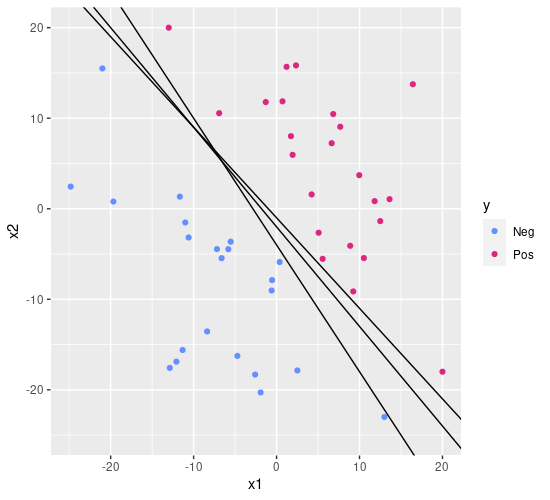

class: middle, center

# Support Vector Machines

---

## Building on the weakness of the tree

.cols[
.c50[
.w100p.center[]
<!--
d = read.table("svm-linear.txt", header = T)
d %>% ggplot(aes(x1,x2,color=y))+geom_point()+xlim(c(-25,20))+ylim(c(-25,20))+scale_color_manual(values=c("#648FFF", "#DC267F", "#FE6100", "#785EF0", "#FFB000"))
-->
]
.c50[
Dataset:
 - $Y=\\{\\c{1}{●},\\c{2}{●}\\}$
 - $X=\\mathbb{R}^2$

A single tree, here, would struggle in establishing a good decision boundary: many corners, many branch nodes.

By looking at the data, we see that a **simple line** would likely be a good **decision boundary**
- recall: the decision boundary in classification is where the model change the $y$ when $x$ crosses it

.vspace1[]

**Can we draw that simple line?**
]
]

---

## Line as decision boundary

.cols[
.c50[
.w100p.center[]
<!--
d %>% ggplot(aes(x1,x2,color=y))+geom_point()+xlim(c(-25,20))+ylim(c(-25,20))+scale_color_manual(values=c("#648FFF", "#DC267F", "#FE6100", "#785EF0", "#FFB000")) + geom_abline(intercept=-2, slope=-1.1)
-->
]
.c50[
Yes, we can!
Here it is!

Despite its apparent simplicity, this "draw the line" operation implies:
- we think that a line **—** can be used to tell apart .col1[●] and .col2[●] points
  - the line **—** is **a model**
  - we know how to **use a model**
- we executed some **procedure for finding the line** out of the data

Implicitly, we already *defined* $M$, $f'\\subtext{learn}: \\mathcal{P}^*(\\mathbb{R} \\times Y) \\to M$, and $f'\\subtext{predict}: \\mathbb{R}^2 \\times M \\to Y$
- i.e., we defined a new **learning technique** 🤗

.note[
We followed the same approach for trees: now we are more experienced and we can go faster in formalizing it.
]
]
]

---

## Line as a model

Formally, a **line**-shaped decision boundary in $X=\\mathbb{R}^2$ can be defined as
$$x\_2=m x\_1 +q$$
where $m$ is the slope and $q$ is the intercept.

Alternatively, as: .note[there are *many* triplets $(\\beta\_0, \\beta\_1, \\beta\_2)$ defining the same line]
$$\\beta\_0+\\beta\_1 x\_1+\\beta\_2 x\_2=0$$

More in general, in $X=\\mathbb{R}^p$, we can define a .key[separating hyperplane] as:
$$\\beta\_0+\\beta\_1 x\_1+\\dots+\\beta\_p x\_p=0$$
or, in vectorial form, as: .note[$\\vect{\\beta}, \\vect{x} \\in \\mathbb{R}^p$]
$$\\beta\_0+\\vect{\\beta}^\\intercal\\vect{x}=0$$
- separating, because it can be used to separate the space in **two** parts
- hyperplane, because we are in $\\mathbb{R}^p$ .note[$p=1$: threshold; $p=2$: line; $p=3$: plane; $p>3$: hyperplane]

---

## Using a separating hyperplane

.cols[
.c50[
.w100p.center[]
]
.c50.compact[
**Intuitively**:
- if the point $\\vect{x}$ is **above** the line, then $y=\\c{2}{●}$
- else, if the point $\\vect{x}$ is **below** the line, then $y=\\c{1}{●}$
- else, if the point $\\vect{x}$ is **on** line, then 🤔

**Formally**:
- $\\vect{x}$ is .col3[**on**] the line iff $\\beta\_0+\\beta\_1 x\_1+\\beta\_2 x\_2 \\c{3}{=} 0$
- $\\vect{x}$ is .col3[**above**] the line iff $\\beta\_0+\\beta\_1 x\_1+\\beta\_2 x\_2 \\c{3}{>} 0$
- $\\vect{x}$ is .col3[**below**] the line iff $\\beta\_0+\\beta\_1 x\_1+\\beta\_2 x\_2 \\c{3}{<} 0$

.vspace1[]

**Example**:
This particular line is: $2+1.1 x\_1 + x\_2 = 0$

For $\\vect{x}=(10,10)$:
- $2+1.1 x\_1 + x\_2 = 2+11+10=23 \\c{3}{>} 0$
- hence $y=\\c{2}{●}$ (above)

For $\\vect{x}=(-10,-10)$:
- $2+1.1 x\_1 + x\_2 = 2-11-10=-19 \\c{3}{<} 0$
- hence $y=\\c{1}{●}$ (above)
]
]

---

## $f'\\subtext{predict}$ with a separating hyperplane

.cols[
.c50[
.diagram.center[
link([0,25,150,25],'a')
rect(150,0,150,50)
link([300,25,400,25],'a')
otext(225,25,"$f'\\\\subtext{predict}$")
otext(75,10,'$\\\\vect{x},(\\\\beta\\_0,\\\\vect{\\\\beta})$')
otext(350,10,'$y$')
]

.pseudo-code.compact[
function $\\text{predict}(\\vect{x}, \\c{1}{(\\beta\_0, \\vect{\\beta})})$ {  
.i[]if $\\beta\_0+\\vect{\\beta}^\\intercal\\vect{x} \\c{2}{\\ge} 0$ then {  
.i[].i[]return $\\text{Pos}$  
.i[]} else {  
.i[].i[]return $\\text{Neg}$  
.i[]}  
}
]

**Assumptions**:
- $Y = \\{\\text{Pos},\\text{Neg}\\}$
  - **binary classification only!**¹
- $X = \\mathbb{R}^p$
  - **numerical independent variables only!**²

]
.c50[
- .col1[$\\vect{x}, (\\beta\_0, \\vect{\\beta})$] is the model
- $y = \\text{Pos}$ for both the .col2[$>$] and .col2[$=$] cases
  - $y = \\text{Neg}$ for .col2[$<$], i.e., otherwise
- computationally **very fast**: just $p$ multiplications and sums
]
]

.footnote[
1. we'll see later how to *port* this to the case of $|Y| > 2$
2. we'll see later how to *port* this to the case of categorical variable
]

---

## Separating hyperplane with probability

.cols[
.c60[
Intuitively, for .col3[$\\beta\_0+\\vect{\\beta}^\\intercal\\vect{x}$]
- the greater (**positive and large**), the *more satisfied* the $\\ge 0$ condition, hence the **more positive**
- the smaller (**negative and large**), the *more satisfied* the $< 0$ condition, hence the **more negative**
]
.c40[
.pseudo-code.compact[
function $\\text{predict}(\\vect{x}, (\\beta\_0, \\vect{\\beta}))$ {  
.i[]if $\\c{3}{\\beta\_0+\\vect{\\beta}^\\intercal\\vect{x}} \\ge 0$ then {  
.i[].i[]return $\\text{Pos}$  
.i[]} else {  
.i[].i[]return $\\text{Neg}$  
.i[]}  
}
]

]
]

**Can we use this like a probability?** Can we have an $f''\\subtext{predict}$ for the hyperplane?
- recall the single tree: $f''\\subtext{predict}(x,t)=\\treel{(\\c{1}{● \\smaller{\\frac{3}{5}}}, \\c{2}{● \\smaller{\\frac{2}{5}}})}$ .note[.question[question]: can we infer something about $n=|D\\subtext{learn}|$ form this?]
- recall the bag (assume $n\\subtext{tree}=100$): $f''\\subtext{predict}(x,\\seq{t\_j}{j})=\\treel{(\\c{1}{● \\smaller{\\frac{38}{100}}}, \\c{2}{● \\smaller{\\frac{62}{100}}})}$

--

**No!**
Because .col3[$\\beta\_0+\\vect{\\beta}^\\intercal\\vect{x}$] is not bound in $[0,1]$
- we can still use it as a measure of confidence: the smaller $|\\beta\_0+\\vect{\\beta}^\\intercal\\vect{x}|$, **the lower the confidence** in the decision; in the extreme case $|\\beta\_0+\\vect{\\beta}^\\intercal\\vect{x}|=0$ means **no confidence**, i.e., both $y=\\text{Pos}$ and $y=\\text{Neg}$ are ok

.note[
You may map the domain of $\\beta\_0+\\vect{\\beta}^\\intercal\\vect{x}$, i.e., $[-\\infty,+\\infty]$ to $[0,1]$ with, e.g., $\\tanh$: if $x \\in [-\\infty,+\\infty]$, then $\\frac{1}{2}+\\frac{1}{2}\\tanh(x) \\in [0,1]$.  
But this is not a common practice, because it still would be a *real* probability.
]

---

## Learning the separating hyperplane

.cols[
.c50[
.w100p.center[]
]
.c50[
**How to choose the separating line?**

.vspace1[]

**First attempt:**

Choose *the* one that:
- perfectly separates the .col1[●] and .col2[●] points
]
]

---

## Learning the separating hyperplane

.cols[
.c50[
.w100p.center[]
<!--
d %>% ggplot(aes(x1,x2,color=y))+geom_point()+xlim(c(-25,20))+ylim(c(-25,20))+scale_color_manual(values=c("#648FFF", "#DC267F", "#FE6100", "#785EF0", "#FFB000")) + geom_abline(intercept=-2, slope=-1.1) + geom_abline(intercept=-4, slope=-1.4) + geom_abline(intercept=-1, slope=-1)
-->
]
.c50[
**How to choose the separating line?**

.vspace1[]

**First attempt:**

Choose *the* one that:
- perfectly separates the .col1[●] and .col2[●] points

🫣 this condition holds in general, for infinite lines...

.vspace1[]

**Second attempt:**

Choose the one that:
- perfectly separates the .col1[●] and .col2[●] points **and**
- is the farthest from the closest points

]
]

---

## Learning the separating hyperplane

.cols[
.c50[
.w100p.center[]
<!--
)) + geom_abline(intercept=-1.89, slope=-1.2898) + geom_abline(intercept=-5.4, slope=-1.2898, linetype="dashed") + geom_abline(intercept=1.63, slope=-1.2898, linetype="dashed")+geom_point()
-->
]
.c50[
**How to choose the separating line?**

.vspace1[]

**First attempt:**

Choose *the* one that:
- perfectly separates the .col1[●] and .col2[●] points

🫣 this condition holds in general, for infinite lines...

.vspace1[]

**Second attempt:**

Choose the one that:
- perfectly separates the .col1[●] and .col2[●] points **and**
- is the farthest from the closest points

]
]

---

## The maximal margin classifier

.cols[
.c50[
.w100p.center[]
]
.c50[
The hyperplane that
- perfectly separates the $\\text{Pos}$ and $\\text{Neg}$ points **and**
- is the farthest from the closest points

is called the .key[maximal margin classifier].

.vspace1[]

Maximal margin classifier:
- **classifier**, because it can be used for classifying point,
  - since it is a separating hyperplane that divides thes space in two portions
- **maximal margin**: because it is the one leaving the largest distance (**margin**) from the closest points
]
]

---

## Support vectors

.cols[
.c50[
.w100p.center[]
]
.c50[
**Names**:
- the band from **- -** to **- -** (through **—**) is the **margin**
- the points lying on the edge of the margin are called .key[support vectors]
  - they **support** the band in its position, like nails 📍 with a wooden ruler 📏
  - they are points in $\\mathbb{R}^p$, hence **vectors**
  - here, two .col2[●].col2[●] and one .col1[●]

.vspace1[]

If you move (not too much) any of the points which are not support vectors, the separating hyperplane stays the same!
]
]

---

## Learning the maximal margin classifier

**Intuitively**:
.cols[
.c60[
Choose the one that:
- .col3[perfectly separates] the $\\text{Pos}$ and $\\text{Neg}$ points and
- .col4[is the farthest] from the closest points
]
.c40[
Looks like an **optimization** problem:
- "perfectly separates" $\\rightarrow$ .col3[constraint]
- "is the farthest" $\\rightarrow$ .col4[objective]
]
]

--

**Formally**:
.cols[
.c60.compact[
$$
\\begin{align\*}
\\max\_{\\beta\_0, \\dots, \\beta\_p} & \\; \\c{4}{m} \\\\
\\text{subject to} & \\; \\c{3}{\\sum\_{j=1}^{j=p} \\beta\_j^2 = \\vect{\\beta}^\\intercal\\vect{\\beta}= 1} \\\\
& \\; \\c{3}{y^{(i)}\\left(\\beta\_0+\\vect{\\beta}^\\intercal\\vect{x}^{(i)}\\right) \\ge m} & \\c{3}{\\forall i \\in \\{1, \\dots, n\\}}
\\end{align\*}
$$
that means:
- find the largest $m$, such that
- every point $\\vect{x}^{(i)}$ .col3[is at a distance] $\\ge m$ from the hyperplane
- and .col3[is on the proper side]
]
.c40.compact[
**Assume by convention** that $\\text{Pos} \\leftrightarrow +1$ and $\\text{Neg} \\leftrightarrow -1$, so $y^{(i)}(\\dots) \\ge m$ is like $\\dots \\ge m$ for positives **and** $\\dots \\le -m$ for negatives

- $\\beta\_0, \\dots, \\beta\_p$, that is the **model** $(\\beta\_0, \\vect{\\beta})$, is what we are looking for
- *mathematically*, if $\\sum\_{j=1}^{j=p} \\beta\_j^2 = 1$, then $\\beta\_0+\\vect{\\beta}^\\intercal\\vect{x}$ is the Euclidean distance of $\\vect{x}$ from the hyperplane (with sign)
- $y^{(i)}\\left(\\beta\_0+\\vect{\\beta}^\\intercal\\vect{x}^{(i)}\\right) \\ge m$ is $=$ for support vectors and $>$ for the other points
]
]

---

## $f'\\subtext{learn}$ for the maximal margin classifier

.cols[
.c50[
.diagram.center[
link([0,25,150,25],'a')
rect(150,0,100,50)
link([250,25,350,25],'a')
otext(200,25,"$f'\\\\subtext{learn}$")
otext(75,5,'$\\\\seq{(x^{(i)},y^{(i)})}{i}$')
otext(300,10,'$(\\\\beta\\_0,\\\\vect{\\\\beta})$')
]

.pseudo-code.compact[
function $\\text{learn}(\\seq{(\\vect{x}^{(i)},y^{(i)})}{i})$ {  
.i[]$(\\beta\_0,\\vect{\\beta}) \\gets \\c{1}{\\text{solve}(}$  
.i[].i[].col4[$\\max\_{\\beta\_0,\\dots,\\beta\_p} m,$]  
.i[].i[].col3[$\\vect{\\beta}^\\intercal\\vect{\\beta}= 1 \\land y^{(i)}(\\beta\_0+\\vect{\\beta}^\\intercal\\vect{x}^{(i)}) \\ge m, \\forall i$]  
.i[].col1[$)$]  
.i[]return $(\\beta\_0,\\vect{\\beta})$  
}
]

]
.c50[
- .col1[$\\text{solve}()$] is *just* a solver for numerical optimization problems which takes the .col4[objective] and the .col3[constraints]
]
]

In practice, this is an *easy* optimization problem and solvin it is **fast**! .note[for a computer]

---

## Maximal marginal classifier learning

.cols[
.c50[

This learning technique is called .key[maximal margin classifier] learning.

**Efficiency**: 👍
- 👍👍👍 very fast, both in learning and prediction

**Applicability**: 🫳
- 🫳 just binary classification .note[more on this later]
- 🫳 just numerical variables .note[more on this later]
- 👍 parameter-free!

**Efficiency**: 🤔
- overfitting? well, no flexibility, so... 🤔
  - what's complexity here? the *size* of the model is always $p+1$

]
.c50[
.pseudo-code.compact[
function $\\text{learn}(\\seq{(\\vect{x}^{(i)},y^{(i)})}{i})$ {  
.i[]$(\\beta\_0,\\vect{\\beta}) \\gets \\text{solve}($  
.i[].i[]$\\max\_{\\beta\_0,\\dots,\\beta\_p} m,$  
.i[].i[]$\\vect{\\beta}^\\intercal\\vect{\\beta}= 1 \\land y^{(i)}(\\beta\_0+\\vect{\\beta}^\\intercal\\vect{x}^{(i)}) \\ge m, \\forall i$  
.i[]$)$  
.i[]return $(\\beta\_0,\\vect{\\beta})$  
}
]

.vspace1[]

.pseudo-code.compact[
function $\\text{predict}(\\vect{x}, (\\beta\_0, \\vect{\\beta}))$ {  
.i[]if $\\beta\_0+\\vect{\\beta}^\\intercal\\vect{x} \\ge 0$ then {  
.i[].i[]return $\\text{Pos}$  
.i[]} else {  
.i[].i[]return $\\text{Neg}$  
.i[]}  
}
]

]
]

---

## Maximal margin classifier: issue 1

.cols[
.c50[
.w100p.center[]
]
.c50[
**support vectors**:
- they support the band in its position, **like nails 📍 with a wooden ruler 📏**
- here, two .col2[●].col2[●] and one .col1[●]

If you move (not too much) any of the points which are not support vectors, the separating hyperplane stays the same!

.vspace1[]

**But**, if you move a support vector, then the separating hyperplane moves!
- i.e., for small changes of (some) observations (**apply some noise** to some $\\vect{x}^{(i)}$), the model changes: looks like **variance**
]
]

---

## Maximal margin classifier: issue 2

.cols[
.c50[
.w100p.center[]
]
.c50[
**Even worse**, if you **apply some noise**¹ to some label $y^{(i)}$, it might be that a separatying hyperplane **does not exist** at all! 😱
- in practice, the $\\text{solve}()$ function just halts and say "there's no solution for this optimization problem".

$\\Rightarrow$ **Applicability**: 👎👎👎

.vspace1[]

**How did the tree cope with $y$ noise?**
- simply by **tolerating**² some wrong classifications also on the learning data

**Can we make MMC tolerant too?**

]
]

.footnote[
1. noise to the $y$: recall the carousel attendat's kids...
2. if $n\\subtext{tree}$ was large enough
]

---

## Introducing tolerance (1st formulation)

.cols[
.c60.compact[
$$
\\begin{align\*}
\\max\_{\\beta\_0, \\dots, \\beta\_p,\\c{1}{\\epsilon^{(i)},\\dots,\\epsilon^{(i)}}} & \\; m \\\\
\\text{subject to} & \\; \\vect{\\beta}^\\intercal\\vect{\\beta}= 1 \\\\
& \; y^{(i)}\\left(\\beta\_0+\\vect{\\beta}^\\intercal\\vect{x}^{(i)}\\right) \\ge m\\c{1}{(1-\\epsilon^{(i)})} & \\forall i \\in \\{1, \\dots, n\\} \\\\
& \; \\c{1}{\\epsilon^{(i)}} \\ge 0 & \\forall i \\in \\{1, \\dots, n\\} \\\\
& \; \\sum\_{i=1}^{i=n} \\c{1}{\\epsilon^{(i)}} = \\c{2}{c}
\\end{align\*}
$$
]
.c40.compact[
- .col1[$\\epsilon^{(i)},\\dots,\\epsilon^{(i)}$] are positive **slack** variables:
  - one for each observation
  - they act as tolerance w.r.t. the margin
      - $\\epsilon^{(i)}=0$ means $\\vect{x}^{(i)}$ has to be **out of the margin, on correct side**
      - $\\epsilon^{(i)} \\in [0,1]$ means $\\vect{x}^{(i)}$ can be **inside the margin, on correct side**
      - $\\epsilon^{(i)} > 1$ means $\\vect{x}^{(i)}$ can be on **wrong side**
- .col2[$c$ (for **cost**)], is a budget of tolerance, which is a **parameter** of the learning technique
]
]

This learning technique is called .key[soft margin classifier], because, due to tolerance, the margin can be *pushed*.
It has one parameter, $c$:
- $c=0$ corresponds to maximal margin classifier
- $c=+\\infty$ corresponds to infinite tolerance:
  - you can put the line wherever you want, and that's ok

---

<!--
role of the parameter c
alternative formulation
non separable points
-->
