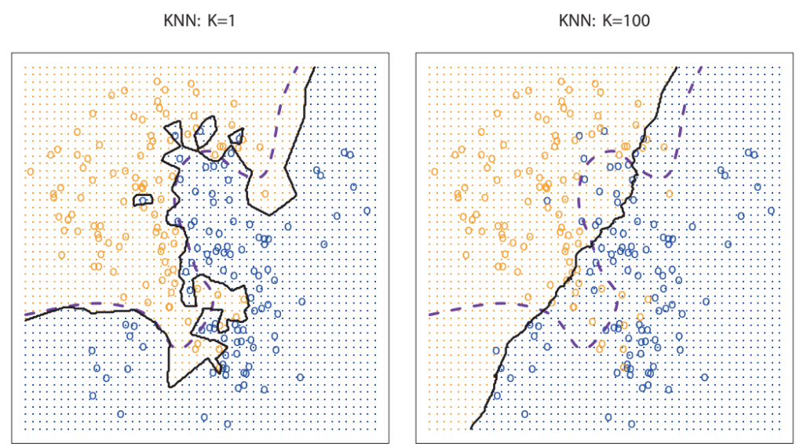
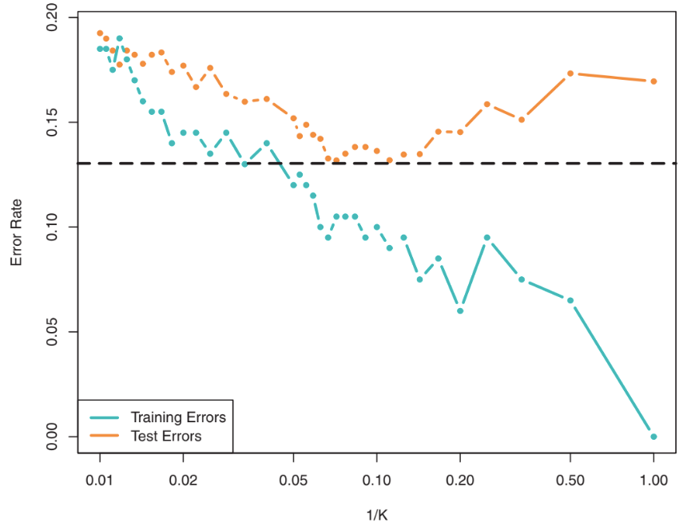

class: middle, center

# Naive-Bayes

---

## Guess the gender¹

You are in the **line** 🚶🚶‍♂️🚶‍♀️🚶🚶🚶‍♀️🚶‍♂️🚶🚶‍♀️ at the **cinema** 🏪.

The **ticket** 🎟 of the person before you in the line falls on the ground.

The person has **long hair**.

.vspace1[]

Do you say "excuse me, **sir**"	🧔‍♀️ or "excuse me, **madam**" 👩?

.vspace1[]

.footnote[
1. For clarity, let's assume there are two possible genders.
]

--
.vspace1[]

**More formally**:
- $X=X\\subtext{hair}$ .note[might be $X\\subtext{hair}=\\set{\\text{long},\\neg\\text{long}}$, or a bigger set; not relevant here]
- $Y=\\{\\text{man},\\text{woman}\\}$
- you are $f\\subtext{predict}$
- your life is $f\\subtext{learn}$
- $f\\subtext{predict}(\\text{long}) = ?$

---

## Reason with probability

According to your life, you have collected some knowledge, that you can express as probabilities:
- the probability a random person is a man is the same of being a woman
  - $\\prob{\\text{a person is a man}}=\\prob{p=\\text{man}}=0.5=\\prob{p=\\text{woman}}$
- the probability that a man has long hair is low
  - $\\prob{h=\\text{long} \\mid p=\\text{man}}=0.04$
- the probability that a woman has long hair is higher
  - $\\prob{h=\\text{long} \\mid p=\\text{woman}}=0.5$

where $\\prob{A \\mid B}$ is the **conditional probability**, i.e., the probability that, given that the event $B$ occurred, the event $A$ occurs

---

## Guessing the gender with probability

Do you say "excuse me, **sir**"	🧔‍♀️ or "excuse me, **madam**" 👩?

So, we want to know $\\prob{h=\\text{man} \\mid p=\\text{long}}$ and $\\prob{h=\\text{woman} \\mid p=\\text{long}}$, or maybe just if:
- $\\prob{h=\\text{man} \\mid p=\\text{long}} \\stackrel{?}{>} \\prob{h=\\text{woman} \\mid p=\\text{long}}$

But we know $\\prob{h=\\text{long} \\mid p=\\text{man}}$, not $\\prob{h=\\text{man} \\mid p=\\text{long}}$...

--

.vspace1[]

In general, $\\prob{A \\mid B} \\ne \\prob{A \\mid B}$.
- $\\prob{\\text{win lottery} \\mid \\text{play lottery}} \\ne \\prob{\\text{play lottery} \\mid \\text{win lottery}}$

---

## The Bayes rule

$$\\prob{B} \\prob{B \\mid A}=\\prob{A, B} = \\prob{A} \\prob{A \\mid B}$$

where $\\prob{A,B}$ is the probability that both $A$ and $B$ occur.

--

$$\\prob{B \\mid A}=\\frac{\\prob{A} \\prob{A \\mid B}}{\\prob{B}}$$

--

.cols.compact[
.c30[
**What we know**:
- $\\prob{\\text{man}}=0.5$
- $\\prob{\\text{woman}}=0.5$
- $\\prob{\\text{long} \\mid \\text{man}}=0.04$
- $\\prob{\\text{long} \\mid \\text{woman}}=0.5$
]
.c70[
**What we compute**:
- $\\prob{\\text{man} \\mid \\text{long}} = \\frac{\\prob{\\text{man}} \\prob{\\text{long} \\mid \\text{man}}}{\\prob{\\text{long}}}=\\frac{0.5 \\cdot 0.04}{\\prob{\\text{long}}}=\\frac{0.02}{\\prob{\\text{long}}}$
- $\\prob{\\text{woman} \\mid \\text{long}} = \\frac{\\prob{\\text{woman}} \\prob{\\text{long} \\mid \\text{woman}}}{\\prob{\\text{long}}}=\\frac{0.5 \\cdot 0.5}{\\prob{\\text{long}}}=\\frac{0.25}{\\prob{\\text{long}}}$
- $\\frac{0.02}{\\prob{\\text{long}}} < \\frac{0.25}{\\prob{\\text{long}}} \\Rightarrow$ 👩 $\\Rightarrow$ "excuse me, madam"

We **do not really need to know** $\\prob{\\text{long}}$!

.note[but it could be computed, in some cases]
]
]

---

## Guess the gender II

You are in the line 🚶🚶‍♂️🚶‍♀️🚶🚶🚶‍♀️🚶‍♂️🚶🚶‍♀️ at the .col1[**stadium**] 🏟.

The ticket 🎟 of the person before you in the line falls on the ground.

The person has long hair.

.cols.compact[
.c30[
**What we know**:
- $\\prob{\\text{man at 🏟}}=\\c{1}{0.98}$
- $\\prob{\\text{woman at 🏟}}=\\c{1}{0.02}$
- $\\prob{\\text{long} \\mid \\text{man}}=0.04$
- $\\prob{\\text{long} \\mid \\text{woman}}=0.5$
]
.c70[
**What we compute**:
- $\\prob{\\text{man} \\mid \\text{long}} = \\frac{\\prob{\\text{man}} \\prob{\\text{long} \\mid \\text{man}}}{\\prob{\\text{long}}}=\\frac{\\c{1}{0.98} \\cdot 0.04}{\\prob{\\text{long}}}=\\frac{\\c{1}{0.0392}}{\\prob{\\text{long}}}$
- $\\prob{\\text{woman} \\mid \\text{long}} = \\frac{\\prob{\\text{woman}} \\prob{\\text{long} \\mid \\text{woman}}}{\\prob{\\text{long}}}=\\frac{\\c{1}{0.02} \\cdot 0.5}{\\prob{\\text{long}}}=\\frac{\\c{1}{0.01}}{\\prob{\\text{long}}}$
- $\\frac{\\c{1}{0.0392}}{\\prob{\\text{long}}} > \\frac{\\c{1}{0.01}}{\\prob{\\text{long}}} \\Rightarrow$ 🧔 $\\Rightarrow$ "excuse me, sir"
]
]

Different *natural* probability of a person at the stadium being a man!

---

## Prior, posterior, evidence

$$\\c{2}{\\prob{\\text{event} \\mid \\text{evidence}}}=\\c{1}{\\prob{\\text{event}}}\\c{3}{\\frac{\\prob{\\text{evidence} \\mid \\text{event}}}{\\prob{\\text{evidence}}}}$$

- .col1[**prior**]: the *natural* probability of the **event**
  - what we know in advance
- .col2[**posterior**]: the probability of the event, given some **evidence**
  - what we want to know
- a .col3[correction] we apply to the **prior** knowing the evidence

---

## Bayes for supervised ML

.cols.compact[
.c50[
Assume classification with categorical indep. vars:
- $X = X\_1 \\times \\dots \\times X\_p$
  - with $X\_j=\\{x\_{j,1}, \\dots, x\_{j,h\_j}\\}$
- $Y = \\{y\_1, \\dots, y\_k\\}$

]
.c50[
.center[$\\c{2}{\\prob{\\text{event} \\mid \\text{evidence}}}=\\c{1}{\\prob{\\text{event}}}\\c{3}{\\frac{\\prob{\\text{evidence} \\mid \\text{event}}}{\\prob{\\text{evidence}}}}$]

- .col1[**event**]: $y$ is one specific class, $y=y\_m$
- **evidence**: $x$ is one specific observation, $x=(x\_{1,l\_1},\\dots,x\_{p,l\_p})$
]
]

Hence:
$$\\c{2}{\\prob{y=y\_m \\mid x=(x\_{1,l\_1},\\dots,x\_{p,l\_p})}}=\\c{1}{\\prob{y=y\_m}}\\c{3}{\\frac{\\prob{x=(x\_{1,l\_1},\\dots,x\_{p,l\_p}) \\mid y=y\_m}}{\\prob{x=(x\_{1,l\_1},\\dots,x\_{p,l\_p})}}}$$
or, more briefly:
$$\\c{2}{p\\left(y\_m \\mid x\_{1,l\_1},\\dots,x\_{p,l\_p}\\right)}=\\c{1}{p(y\_m)}\\c{3}{\\frac{p\\left(x\_{1,l\_1},\\dots,x\_{p,l\_p} \\mid y\_m\\right)}{p\\left(x\_{1,l\_1},\\dots,x\_{p,l\_p}\\right)}}$$

---

## Required knowledge

$$\\c{2}{p\\left(y\_m \\mid x\_{1,l\_1},\\dots,x\_{p,l\_p}\\right)}=\\c{1}{p(y\_m)}\\c{3}{\\frac{p\\left(x\_{1,l\_1},\\dots,x\_{p,l\_p} \\mid y\_m\\right)}{p\\left(x\_{1,l\_1},\\dots,x\_{p,l\_p}\\right)}}$$

**What do we need for predicting $y$ from a $x$?**
1. compute $\\c{2}{p\\left(y\_m \\mid x\_{1,l\_1},\\dots,x\_{p,l\_p}\\right)}$ for each $y\_m$
  - hence, **each** $\\c{1}{p(y\_m)}$ and **each** $\\c{3}{p\\left(x\_{1,l\_1},\\dots,x\_{p,l\_p} \\mid y\_m\\right)}$
  - no need to compute $\\c{3}{p\\left(x\_{1,l\_1},\\dots,x\_{p,l\_p}\\right)}$ for the comparison
2. take the $y$ with the largest value

**Where to find them?**

💡: in the learning data $D$!
- each $\\c{1}{p(y\_m)}$: just count the observations in $D$ with $y=y\_m$
- each $\\c{3}{p\\left(x\_{1,l\_1},\\dots,x\_{p,l\_p} \\mid y\_m\\right)}$: *just* count the obs. in $D$ with $y=y\_m$ and $x=\\left(x\_{1,l\_1},\\dots,x\_{p,l\_p}\\right)$
  - what if the count is $0$? 🤔 **not that unlikely...**
  - how many combinations should I store? $k \\prod\_{j=1}^{j=p} h\_j$

---

## Independent independent¹ variables

Let's do the **naive** hypothesis that the independent **variables are independent**¹ from each other:
$$\\c{2}{p\\left(y\_m \\mid x\_{1,l\_1},\\dots,x\_{p,l\_p}\\right)}=\\c{1}{p(y\_m)}\\c{3}{\\frac{p\\left(x\_{1,l\_1},\\dots,x\_{p,l\_p} \\mid y\_m\\right)}{p\\left(x\_{1,l\_1},\\dots,x\_{p,l\_p}\\right)}}=\\c{1}{p(y\_m)}\\c{3}{\\frac{p\\left(x\_{1,l\_1} \\mid y\_m, \\dots, x\_{p,l\_p} \\mid y\_m\\right)}{p\\left(x\_{1,l\_1},\\dots,x\_{p,l\_p}\\right)}}$$
becomes: .note[$p\\left(x\\sub{1,l\\sub{1}},\\dots,x\\sub{p,l\\sub{p}} \\mid y\\sub{m}\\right) = p\\left(x\\sub{1,l\\sub{1}} \\mid y\\sub{m}, \\dots, x\\sub{p,l\\sub{p}} \\mid y\\sub{m}\\right)$ is **always** true, also without independency]

$$\\c{2}{p\\left(y\_m \\mid x\_{1,l\_1},\\dots,x\_{p,l\_p}\\right)}=\\frac{\\c{1}{p(y\_m)}}{\\c{3}{p\\left(x\_{1,l\_1},\\dots,x\_{p,l\_p}\\right)}} \\c{3}{p\\left(x\_{1,l\_1} \\mid y\_m\\right)} \\dots \\c{3}{p\\left(x\_{p,l\_p} \\mid y\_m\\right)}$$

**Where to find them?**

💡: in the learning data $D$!
- each $\\c{1}{p(y\_m)}$: just count the observations in $D$ with $y=y\_m$
- each $\\c{3}{p\\left(x\_{1,l\_j} \\mid y\_m\\right)}$: *just* count the obs. in $D$ with $y=y\_m$ and $x\_j=x\_{j,l\_j}$
  - what if the count is $0$? **unlikely**, but possible
  - how many combinations should I store? $ \\sum\_{j=1}^{j=p}k h\_j$

.footnote[
1. The first "independent" refers to $x\_j$ and $y$; the second "independent" refers to $x\_j$ and $x\_{j'}$.
]

---

## Naive Bayes

The technique based on the independency hypothesis is called .key[Naive Bayes]:
- based on the **Bayes rule**
- with a **naive independency** hipothesys

.cols.compact[
.c50[
**Learning**:
.diagram.center[
link([0,25,150,25],'a')
rect(150,0,100,50)
link([250,25,350,25],'a')
otext(200,25,"$f'\\\\subtext{learn}$")
otext(75,5,'$\\\\seq{(x^{(i)},y^{(i)})}{i}$')
otext(300,10,'$\\\\vect{p}$')
]

.pseudo-code.compact[
function $\\text{learn}(\\seq{(x^{(i)},y^{(i)})}{i=1}^{i=n})$ {  
.i[]$\\vect{p} \\gets \\emptyset$  
.i[]for $m \\in  \\{1, \\dots, |Y|\\}$ { .comment[//$|Y|=k$]  
.i[].i[]$\\c{1}{p\_m} \\gets \\frac{1}{n} \\sum\_i \\mathbf{1}(y^{(i)}=y\_m)$  
.i[].i[]for $j \\in  \\{1, \\dots, p\\}$ {  
.i[].i[].i[]for $l \\in  \\{1, \\dots, |X\_j|\\}$ { .comment[//$|X\\sub{j}|=h\\sub{j}$]  
.i[].i[].i[]$\\c{3}{p\_{m,j,l}} \\gets \\frac{\\sum\_i \\mathbf{1}(y^{(i)}=y\_m \\land x\_j^{(i)}=x\_{j,l})}{\\sum\_i \\mathbf{1}(y^{(i)}=y\_m)}$  
.i[].i[].i[]}  
.i[].i[]}  
.i[]}  
.i[]return $\\vect{p}$  
}
]

The **model** $\\vect{p}$ is some data structure holding $k+\\sum\\sub{j=1}^{j=p}k h\\sub{j}$ numbers, i.e., $\\vect{p} \\in [0,1]^{k+\\sum\\sub{j=1}^{j=p}k h\\sub{j}}$.

]
.c50[
**Prediction**:
.diagram.center[
link([0,25,150,25],'a')
rect(150,0,100,50)
link([250,25,350,25],'a')
otext(200,25,"$f'\\\\subtext{predict}$")
otext(75,5,'$x,\\\\vect{p}$')
otext(300,10,'$y$')
]

.pseudo-code.compact[
function $\\text{predict}(x,\\vect{p})$ { .comment[//$x=(x\\sub{l\\sub{1}},\\dots,x\\sub{l\\sub{p}})$]  
.i[]$m^\\star \\gets \\argmax\_{m \\in \\{1,\\dots,|Y|\\}} \\c{1}{p\_m} \\prod\_{j=1}^{j=p} \\c{3}{p\_{m,j,l\_j}}$  
.i[]return $y\_m$  
}
]

Or, with probability:
.pseudo-code.compact[
function $\\text{predict-with-prob}(x,\\vect{p})$ {  
.i[]return $y\_m \\mapsto \\frac{\\c{1}{p\_m} \\prod\_{j=1}^{j=p} \\c{3}{p\_{m,j,l\_j}}}{\\sum\_{m'=1}^{m'=|Y|} \\c{1}{p\_{m'}} \\prod\_{j=1}^{j=p} \\c{3}{p\_{m',j,l\_j}}}$  
}
]

]
]

---

## Naive Bayes: summary

**Efficiency** 👍👍👍
- 👍 very very fast
  - in particular with **very large datasets**, in both $n$ and $p$

**Explainability/interpretability** 👍👍
- 👍 the model is a bunch of probabilities!
- 👍 the technique is very simple

**Effectiveness** 🫳
- 🫳 not so good
  - the more false the independency hypothesis with the system, the less effective

**Applicability** 🫳
- 🫳 $Y$: **classification**  
- 🫳 $X$: **only categorical variables** .note[but can be extended to the numerical case]
- 👍 models give probability
- 👍 **no hyperparameters**
- 👍 works natively with **missing values**
  - just remove the missing $j$ from $\\prod\_{j=1}^{j=p} \\c{3}{p\_{m',j,l\_j}}$

---

class: middle, center

# k-Nearest Neighbors (kNN)

---

## Guess the province

.cols[
.c50[
.w100p.center[]
]
.c50[
Given a **point on the map**, guess its **province**.
- e.g., province of the most northern pig 🐖?
- e.g., province of the most eastern fish 🐟?

.vspace1[]

**More formally**:
- $X= \\mathbb{R}^2$, i.e., the coordinates on the map
- $Y=\\{\\text{Ts},\\text{Ud},\\text{Pn},\\text{Go}\\}$
- you are $f\\subtext{predict}$
- $f\\subtext{learn}$ is looking at the map¹
  - in particular, the position of the 4 chief towns

.footnote[
1. Let's pretend we do not know the real boundaries of the (former) provinces...
]
]
]

---

## The closest chief town

Tentative explanation of your reasoning, given a point $x$ on the map:
1. look at the closest chief town
2. say that the province of $x$ is the one of the closes chief town

--

.vspace1[]

**More in general**:
In prediction, but given a learning set $D$:
1. find the $k$ closest observations in $D$ (the **nearest neighbors**)
2. say that $y$ is the most frequent (if classification) or the mean (if regression) of the $k$ closest observations

This is the .key[k-Nearest Neighbors] learning technique!

---

## k-Nearest Neighbors

.cols.compact[
.c50[
**Learning**:
.diagram.center[
link([0,75,150,75],'a')
rect(150,50,100,50)
link([250,75,450,75],'a')
link([200,0,200,50],'a')
otext(200,75,"$f'\\\\subtext{learn}$")
otext(75,55,'$\\\\seq{(x^{(i)},y^{(i)})}{i}$')
otext(350,55,'$(\\\\seq{(x^{(i)},y^{(i)})}{i},\\\\c{2}{k},\\\\c{3}{d})$')
otext(230,25,"$\\\\c{2}{k},\\\\c{3}{d}$")
]

.pseudo-code.compact[
function $\\text{learn}(\\seq{(x^{(i)},y^{(i)})}{i}, \\c{2}{k},\\c{3}{d})$ {  
.i[]return $(\\seq{(x^{(i)},y^{(i)})}{i},\\c{2}{k},\\c{3}{d})$  
}
]

$f'\\subtext{learn}$ **does nothing**!

The model is the dataset $D$
- and¹ the .col2[number of neighbors $k$]
- and¹ the .col3[distance]² $\\c{3}{d}: X \\times X \\to \\mathbb{R}$

.col2[$k$] and .col3[$d$] are **parameters**!

.footnote[
1. They are used by $f'\\subtext{predict}$, not here, but we put them into the model just to not make the signature of $f'\\subtext{predict}$ dirty; ML sw/libraries do the same.
2. A (dis)similarity measure is enough.
]

]
.c50[
**Prediction**:
.diagram.center[
link([0,25,250,25],'a')
rect(250,0,100,50)
link([350,25,400,25],'a')
otext(300,25,"$f'\\\\subtext{predict}$")
otext(125,5,'$x,(\\\\seq{(x^{(i)},y^{(i)})}{i},\\\\c{2}{k},\\\\c{3}{d})$')
otext(375,10,'$y$')
]

.pseudo-code.compact[
function $\\text{predict}(x,(\\seq{(x^{(i)},y^{(i)})}{i},\\c{2}{k},\\c{3}{d}))$ {  

.i[]$\\vect{s} \\gets \\vect{0}$ .comment[//$\\vect{0} \\in \\mathbb{R}^n$]  
.i[]for $i \\in \\{1,\\dots,n\\}$ {  
.i[].i[]$s\_i \\gets \\c{3}{d}(x,x^{(i)})$  
.i[]}  
.i[]$I \\gets \\emptyset$ .comment[//the neighborhood]  
.i[]while $|I|\\le \\c{2}{k}$ {  
.i[].i[]$I \\gets I \\cup \\{\\argmin\_{i \\in \\{1,\\dots,n\\} \\setminus I} s\_i\\}$  
.i[]}  
.i[]return $\\argmax\_{y \\in Y} \\sum\_{i \\in I} \\mathbf{1}(y^{(i)}=y)$ .comment[//most frequent]  
}
]

Alternatives:
- for regression, return $\\frac{1}{\\c{2}{k}}\\sum\_{i \\in I} y^{(i)}$
- with probability, return $y \\mapsto \\frac{1}{\\c{2}{k}}\\sum\_{i \\in I} \\mathbf{1}(y^{(i)}=y)$
]
]

---

## The distance

By using a **proper distance** $d: X \\times X \\to \\mathbb{R}$, kNN can be used on any $X$! (**applicability** 👍👍👍)

.compact[
**Common cases**: .note[there is a large literature on distances]

- for vectorial spaces, i.e., $X=\\mathbb{R}$
  - **$\\ell$-norms**: with $\\ell$ being a parameter, $d(\\vect{x},\\vect{x}')=\\lVert \\vect{x},\\vect{x}' \\rVert\_\\ell=\\sqrt[\\ell]{\\sum\_j |x\_j-x'\_j|^\\ell}$
      - **Euclidean** with $\\ell=2$
      - **Manhattan** with $\\ell=1$
  - **cosine distance**: $d(\\vect{x},\\vect{x}')=\\frac{\\vect{x}^\\intercal\\vect{x}'}{\\lVert \\vect{x} \\rVert\_1 \\lVert \\vect{x}' \\rVert\_1}$
    - disregards the individual scales of the points
  - many others
- for variable-length sequences of symbols in an alphabet $A$, i.e., $X=A^l$
  - **Hamming** distance: $d(x,x')=\\sum_{k=1}^{k=l} \\mathbf{1}(x\_k \\ne x'\_k)$
  - **edit** distance (many variants)
- for fixed-length sequences of symbols in an alphabet $A$, i.e., $X=A^l$
  - **Hamming** distance
- for sets, i.e., $X=\\mathcal{P}(A)$
  - **Jaccard** distance: $d(x,x')=1-\\frac{|x \\cap x'|}{|x \\cup x'|}$
- and combinations of these ones!
]

Choose one that helps to **capture the dependency** of $y$ on $x$!

---

## Role of the $k$ parameter

.cols[
.c60[
.w100p.center[]

]
.c40[
.w100p.center[]

.note[images from .ref[James, Gareth, et al.; An introduction to statistical learning. Vol. 112. New York: springer, 2013]]
]
]

.compact[
Yes, it is a **flexibility** parameter: .note[link with the Bayes classifier!]
- the **larger** the $k$ the more **global** the estimate of $p(y \\mid x)$; the **smaller**, the more **local**
- if $k=n$ then $p(y \\mid x)$ **does not actually use** $x$, the neighborhood is the entire $D$ $\\rightarrow$ **high bias**
- if $k=1$ then $p(y \\mid x)$ **depends on just one point**, little noise can change the output $\\rightarrow$ **high variance**
]

---

## kNN: summary

**Efficiency** 🫳
- 🫳 struggles with large $n$ **in prediction**
- 👍 no actual learning phase

**Explainability/interpretability** 👍
- 👍 the neighborhood is itself a **local explanation** of the decision

**Effectiveness** 🫳
- 🫳 not particularly good, in practice
  - depends on $k$

**Applicability** 👍
- 👍 $Y$: **regression and both classifications**  
- 👍 $X$: everything, if you have a proper distance $d$
  - but tricky with mixed numerical/categorical cases
- 👍 models give probability
- 🫳 two parameters ($d$ and $k$), one impatting on bias-variance trade-off
