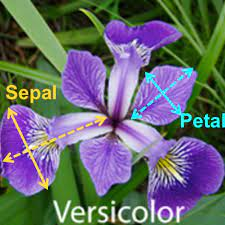
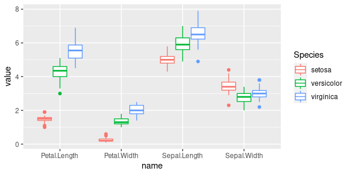
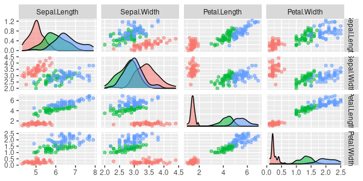
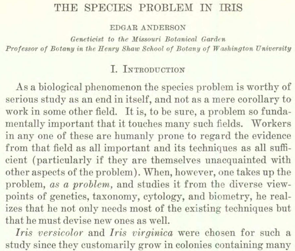
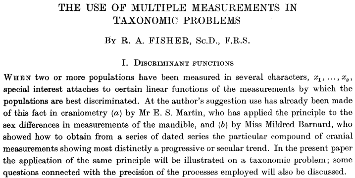

class: middle, center
name: ml-definitions

# Basic concepts

---

## What is Machine Learning?

.important[
.key[Machine Learning] is the science of getting computers to learn without being explicitly programmed.
]

--

A few considerations:
- defining a **field of science** is hard: science evolves, its boundaries change
- ML "comes" from **many communities**' (statistics, computer science, ...) efforts: this (the use of *computers*) is just one point of view
- it captures just some "parts" of ML: we'll see

--

Let's analyze it in details:
- *is the science*: what's science?
- *getting computer*: who is doing that?
- *to learn*: to learn what? **this appears to be the key point!**
- *without being explicitly programmed*: who is not doing that?

---

## An example: spam detection

.center[]

---

## Spam detection: under the hood

What the user sees:
- unwanted **emails** (*spam*) are in a separated place (the *spam folder*)
- sometimes some spam email is not put in the spam folder
- sometimes some not-spam email is put in the spam folder

--

What the web-based email **system** (a computer) does:
- whenever an email arrives, **decides** if it is spam or not
- if spam, move it to the spam folder; otherwise, leave it in the main place

In brief: **a computer is making a decision about an email**

---

## Making a decision

Let's be formal:
.cols[
.c20.vcentered[
$$y=f(x)$$
]
.c80[
- $x$: the entity about which the decision has to be made (the *email*)
- $y$: the decision (*spam or not-spam*)
- $f(\\cdot)$: applying some procedure that, given an $x$ results in a decision $y$
]
]

--

$y=f(x)$ is a **formal notation** capturing the idea that $y$ is obtained from $x$ by applying $f$ on it.  
But it is lacky about the nature of $x$ and $y$.
.cols[
.c20.vcentered[
$$f: X \\to Y$$
]
.c80[
- $X$: the set of all $x$, the **domain** of $f$ (**all** the possible *emails*)
- $Y$: the set of all $y$, the **codomain** of $f$ ($Y=\\{\\text{spam}, \\text{not-spam}\\}$)
]
]

None of the two notations says **how** $f$ works internally.

---

## $x$ and $y$ names

- $x$ is an .key[observation]
  - something that can be **observed**, right because a decision has to be made about it
- $y$ is the .key[response] (for a given $x$)
  - if you feed the decision system with an $x$, the system **responds** with a $y$

--

Alternative names:
- $x$ is an/the .key[input], $y$ is an/the .key[output]
  - $f$ as information processing system
- $x$ is a .key[data point]
  - assuming it carries some data about the underlying entity
- $x$ is an .key[instance]
  - .dict-def[*instance \[ˈɪnst(ə)ns\]*: an example or single occurrence of something]

Names are used interchangeably; some communities tend to prefer some names.

---

## *to learn* what?

.important[
.key[Machine Learning] is the science of getting computers **to learn** without being explicitly programmed.
]

- *is the science*: what's science?
- *getting computer*: who is doing that?
- *to learn*: **to learn what?**
  - how to make a decision $y$ about an observation $x$. That is: **$f: X \\to Y$**
- *without being explicitly programmed*: who is not doing that?

--

New version:  
.important[
.key[Machine Learning] is the science of getting computers **to learn $f: X \\to Y$** without being explicitly programmed.
]

.note[we want the computer to learn $f$ **and use it**, not just learn it]

---

## Prediction

$f$ is often denoted as $f\\subtext{predict}$ since, given an $x$, **predicts** a $y$
- when used in practice, i.e., in the **prediction phase**, $f\\subtext{predict}$ guesses about an unknown, real $\\hat{y}$


---

## $f$ for a computer

Computers execute instructions grouped in programs and expressed according to some language.  
$f$ is the mathematical, abstract notation for **a computer program** that, when executed on an input $x \\in X$ , outputs a $y \\in Y$.

.cols[
.c40[
Mathematical notation:

$$X = \\mathbb{R}^2$$
$$Y = \\mathbb{R}$$
$$f: \\mathbb{R}^2 \\to \\mathbb{R}$$
$$f(\\vect{x}) = f((x\_1,x\_2)) = \\left\\lvert\\frac{x\_1-x\_2}{x\_1}\\right\\rvert$$

.note[$\\vect{x}$ is a notation for *vectors*, or, more broadly, for sequences of homogeneous elements, in place of $\\vec{x}$]
]
.c60[
Computer language:

```java
public double f(double[] xs) {
  return Math.abs((xs[0] - xs[1]) / xs[0]);
}
```

Most .note[not all, typed ones] languages make connection clear:  
`double[]` is $X$, i.e., $\\mathbb{R}^2$ .note[actually $\\mathbb{R}^p$, with $p \ge 1$]  
`double` is $Y$, i.e., $\\mathbb{R}$  
`xs` is $\\vect{x}$  
`f` is $f$: types correspond!  
no explicit counterpart for $y$
]
]

---

## Further point of view

**Abstract** definition ($\\approx$ the .key[signature]):
- just domain and codomain, not how the function works

.cols[
.c30[
$$f: \\mathbb{R}^2 \\to \\mathbb{R}$$
]
.c30[
```java
double f(double[] xs)
```
]
.c40[
.diagram.center[
link([0,25,100,25],'a')
rect(100,0,100,50)
link([200,25,310,25],'a')
otext(50,10,'$\\\\vect{x} \\\\in \\\\mathbb{R}^2$')
otext(250,10,'$y \\\\in \\\\mathbb{R}$')
otext(150,25,'$f$')
]
]
]

**Concrete** definition ($\approx$ signature and code):
- domain, codomain, and how the function works

.cols[
.c30[
$$f: \\mathbb{R}^2 \\to \\mathbb{R}$$
$$\\begin{align\*}
  y &= f(\\vect{x}) \\\\
    &=f((x\_1,x\_2)) \\\\
    &=x_1+x_2
\\end{align\*}$$
]
.c30[
```java
double f(double[] xs) {
  return xs[0] + xs[1];
}
```
]
.c40[
.diagram.center[
link([0,25,100,25],'a')
rect(100,0,100,50)
link([200,25,310,25],'a')
otext(50,10,'$\\\\vect{x} \\\\in \\\\mathbb{R}^2$')
otext(250,10,'$y \\\\in \\\\mathbb{R}$')
otext(150,25,'$x_1+x_2$')
]
]
]

---

## Writing $f$

Usually, computer programs are written by humans, but here:
.important[
.key[Machine Learning] is the science of getting computers to learn $f\\subtext{predict}: X \\to Y$ without being explicitly programmed.
]

*without being explicitly programmed* means that $f\\subtext{predict}$ is **not written by a human**!

It appears verbose, let's get rid of it.

--

New version:  
.important[
.key[Machine Learning] is the science of getting computers to learn $f\\subtext{predict}: X \\to Y$ **autonomously**.
]

---

## Finding/writing a program

Alice (computer science *instructor*) to Bob (student):  
"Please, **write a program** that, given a string, returns the number of vowel occurrences in the string"

Alternative version:  
"Please, **find a program** that, given a string, returns the number of vowel occurrences in the string"

"Find" suggests Bob to apprach the task in two steps:
1. consider the universe of **all the possible programs**
2. choose the one (or ones) that does what expected

--

In $f$ terms:
1. consider $\\mathcal{F}\_{X \\to Y} = \\{f, f: X \\to Y\\}$
2. choose one $f \\in \\mathcal{F}\_{X \\to Y}$ that does what expected

---

## Desired behavior of $f$

1. consider $\\mathcal{F}\_{X \\to Y} = \\{f, f: X \\to Y\\}$
2. choose one $f \\in \\mathcal{F}\_{X \\to Y}$ **that does what expected**

Step 2 is fundamental in practice
  - "find a program that, given a string, returns a number" wouldn't make sense alone!

... but it is hard to be further formalized in general.

There has to be some **supervision** facilitating the search for a good $f$.

---

## Supervised learning

When the supervision is in the form of some **examples** (observation $\\rightarrow$ response) and the learned $f\\subtext{predict}$ should *process them correctly*.
- example: "if I give you this *observation* $x$, you should *predict* this *response* $y$"

New version:  
.important[
.key[Supervised (Machine) Learning] is the science of getting computers to learn $f\\subtext{predict}: X \\to Y$ **from examples** autonomously.
]

--

In **unsupervised learning** there is no supervision, there are **no examples**:
- nevertheless, there is some implicit expectation about how to process $x$
- we'll discuss unsupervised learning later

---

## Examples

Formally, examples available for learning $f\\subtext{predict}$ are pairs $(x,y)$.

A .key[dataset] compatible with $X$ and $Y$ is a *bag* of pairs $(x,y)$:
$$D = \\left\\{\\left(x^{(i)},y^{(i)}\\right)\\right\\}\_{i=1}^{i=n}$$
with $\\forall i: x^{(i)} \\in X, y^{(i)} \\in Y$ and $|D|=n$.

Or, more briefly $D = \\left\\{\\left(x^{(i)},y^{(i)}\\right)\\right\\}\_i$.
.note[examples are also denoted by $(x\_i,y\_i)$, depending on the community]

A **bag** ($D$ should be called *databag*...):
- can have duplicates (bag $\\ne$ set)
- it does not imply any order among its elements (bag $\\ne$ sequence)

.note[In most algorithms, and in their program counterparts, dataset are actually processed sequentially, though]

---

## Learning set

A .key[learning set] is a dataset that is used for learning an $f\\subtext{predict}$.
- may be denoted by $D\\subtext{learn}$ .note[or $L$, or $T$, for *training* set]

The learning set has to be **consistent** with the domain and codomain of the function $f\\subtext{predict}$ to be learned:
- if $f\\subtext{predict} \\in \\mathcal{F}\_{X \\to Y}$, then $D\\subtext{learn} \\in \\mathcal{P}^\*(X \\times Y)$
  - $X \\times Y$ is the Cartesian product of $X$ and $Y$, i.e., the set of all possible $(x,y)$ pairs
  - $\\mathcal{P}(A)$ is the powerset of $A$, i.e., the set of all the possible subsets of $A$
  - $\\mathcal{P}^\*(A)$ is a *custom notation* for the powerset with duplicates, i.e., the set of all the possible **multisets** of $A$

---

## Learning technique

.important[
.key[Supervised (Machine) Learning] is the science of getting computers to learn $f\\subtext{predict}: X \\to Y$ **from examples** autonomously.
]

In brief: given a $D\\subtext{learn} \\in \\mathcal{P}^\*(X \\times Y)$, learn an $f\\subtext{predict} \\in \\mathcal{F}\_{X \\to Y}$.

--

A .key[supervised learning technique] is a way for learning an $f\\subtext{predict} \\in \\mathcal{F}\_{X \\to Y}$ given a $D\\subtext{learn} \\in \\mathcal{P}^\*(X \\times Y)$.

.cols[
.c50[
$$f\\subtext{learn}: \\mathcal{P}^\*(X \\times Y) \\to \\mathcal{F}\_{X \\to Y}$$
$$f\\subtext{predict} = f\\subtext{learn}\\left(D\\subtext{learn}\\right)$$
]
.c50[
.diagram.center[
link([0,25,100,25],'a')
rect(100,0,100,50)
link([200,25,310,25],'a')
otext(150,25,'$f\\\\subtext{learn}$')
otext(50,10,'$D\\\\subtext{learn}$')
otext(250,10,'$f\\\\subtext{predict}$')
]
]
]

--

- .key[learning phase]: when $f\\subtext{learn}$ is applied to obtain $f\\subtext{predict}$ from $D$  
- .key[prediction phase]: when $f\\subtext{predict}$ is applied to obtain a $y$ from an $x$

---

## Learning techniques

.important[
A .key[supervised learning technique] is a way for learn an $f\\subtext{predict} \\in \\mathcal{F}\_{X \\to Y}$ given a $D\\subtext{learn} \\in \\mathcal{P}^\*(X \\times Y)$.
]

Why don't we suffice a single learning technique?
Why are there many of them?

They differ in:
- **applicability** with respect to $X$ and/or $Y$
  - e.g., some require $X = \\mathbb{R}^p$, some require $Y = \\mathbb{R}$
- **efficiency** with respect to $|D\\subtext{learn}|$
  - e.g., some are really fast for producing $f\\subtext{predict}$ ($\\mathcal{O}\\left(|D\\subtext{learn}|^{\\approx 0}\\right)$), some are slow ($\\mathcal{O}\\left(|D\\subtext{learn}|^2\\right)$)
- **effectiveness** in terms of the quality of the learned $f\\subtext{predict}$
- attributes of learned $f\\subtext{predict}$
  - nature/type of $f\\subtext{predict}$ (a formula, a text, a tree...)
  - interpretability of $f\\subtext{predict}$

---

## Who?

.important[
.key[Supervised (Machine) Learning] is the science of getting computers to learn $f\\subtext{predict}: X \\to Y$ **from examples** autonomously.
]

*getting computer*: **who is doing that?**
- the **user** of a learning technique, who is likely the designer/developer of a **ML system**

--

*is the science*: **what's science?**
- there's not only the user: someone designs/develops learning techniques

New version:
.important[
.key[Supervised (Machine) Learning] is about designing and applying supervised learning techniques.
]

---

## Learning as optimization

A supervised learning technique $f\\subtext{learn}: \\mathcal{P}^\*(X \\times Y) \\to \\mathcal{F}\_{X \\to Y}$ can be seen as a form of optimization:
1. consider $\\mathcal{F}\_{X \\to Y} = \\{f, f: X \\to Y\\}$
2. find the one $f\\subtext{predict} \\in \\mathcal{F}\_{X \\to Y}$ that **works best** on $D\\subtext{learn}$

Could we use a general optimization technique?  
In principle, yes, but:
- $X$ (and maybe $Y$) might be infinite (e.g., $X=\\mathbb{R}^p$)
- $X \\times Y$ is "more" infinite
- $\\mathcal{F}\_{X \\to Y}$ is "hugely more" infinite

--

Practical solution: reduce $\\mathcal{F}\_{X \\to Y}$ size by considering only the $f$ of some nature:
- e.g., for $X=Y=\\mathbb{R}$, consider $\\mathcal{F}'\_{\\mathbb{R} \\to \\mathbb{R}} = \\{f: f(x)=ax+b \\text{ with } a,b \\in \\mathbb{R}\\}$
- e.g., for $x$ a UTF-8 strings and $y$ a Boolean, consider the $f$ as regular expressions

---

## Templating $f$

Often a learning technique works on a reduced $\\mathcal{F}'\_{X \\to Y}$ which is based on an **template** $f'$:
- most parts of $f'$ are **defined**, some parts are **undefined**, variable
- $f'$ can be used for prediction only if the undefined parts are defined

E.g., for $X=Y=\\mathbb{R}$, $f'(x)=ax+b$:
- you need concrete values for $a,b$ in order to apply $f$ to an $x$, i.e., to obtain a response $y$ out of an $x$
- this is *univariate linear regression*: .note[we'll expand]
  - *univariate* because $X$ has one dimension
  - *regression* because $Y=\\mathbb{R}$
  - *linear* because of the template

---

## Model

We can make explicit the undefined part of the template:
$$f\\subtext{predict}(x) = f'\\subtext{predict}(x, m)$$
where $m \\in M$ is the undefined part.
- e.g., $f'\\subtext{predict}(x, a, b) = ax+b$ and $M=\\mathbb{R}^2$

Note that $f'\\subtext{predict}$ is fixed for a given learning technique and defines the reduced $\\mathcal{F}'\_{X \\to Y} \\subset \\mathcal{F}\_{X \\to Y}$ where the learning will look for an $f\\subtext{predict}$.

--

Given a template $f'\\subtext{predict}$, $m$ defines an $f\\subtext{predict}$ that can be used to predict a $y$ from an $x$.  
That is, $m$ is a .key[model] of how $y$ depends on $x$.

---

## Learning a model

For techniques based on a template, $f\\subtext{learn}$ actually looks just $\\mathcal{F}'\_{X \\to Y}$, hence in $M$, for finding an $f\\subtext{predict}$.

.cols[
.c50[
General case:
$$f\\subtext{learn}: \\mathcal{P}^\*(X \\times Y) \\to \\mathcal{F}\_{X \\to Y}$$
$$f\\subtext{predict}: X \\to Y$$

The learning technique **is defined by** $f\\subtext{learn}$.


.diagram.center[
link([0,25,100,25],'a')
rect(100,0,100,50)
link([200,25,310,25],'a')
otext(150,25,'$f\\\\subtext{learn}$')
otext(50,10,'$D\\\\subtext{learn}$')
otext(250,10,'$f\\\\subtext{predict}$')
]
]
.c50[
With template:
$$f'\\subtext{learn}: \\mathcal{P}^\*(X \\times Y) \\to M$$
$$f'\\subtext{predict}: X \\times M \\to Y$$

The learning technique **is defined by** $f'\\subtext{learn}, f'\\subtext{predict}$.

.diagram.center[
link([0,25,100,25],'a')
rect(100,0,100,50)
link([200,25,310,25],'a')
otext(150,25,"$f'\\\\subtext{learn}$")
otext(50,10,'$D\\\\subtext{learn}$')
otext(250,10,'$m$')
link([0,125,100,125],'a')
rect(100,100,100,50)
link([200,125,310,125],'a')
otext(150,125,"$f'\\\\subtext{predict}$")
otext(50,110,'$x, m$')
otext(250,110,'$y$')
]

]
]

---

## Examples of templated $f$

.cols[
.c50[
Problem: price of a flat from surface
$$X=\\mathbb{R}^+, Y=\\mathbb{R}^+$$
$$\\mathcal{F}\_{\\mathbb{R}^+ \\to \\mathbb{R}^+} = \\{\\dots,x^2, 3, \pi \\frac{x^3+5x}{0.1+x}, \\dots\\}$$

Learning technique: linear regression
$$f'\\subtext{predict}(x, a,b) = ax+b$$
$$M = \\mathbb{R} \\times \\mathbb{R} = \\{(a,b): a \\in \\mathbb{R} \\land b \\in \\mathbb{R} \\}$$
$$\\mathcal{F}'\_{\\mathbb{R}^+ \\to \\mathbb{R}^+} = \\{\\dots,x+1, 3, \pi x+5, \\dots\\}$$
]
.c50[
Problem: classify email as spam/not-spam

.center[$X=A^\*$,
$Y=\\{ \\text{spam},\\neg\\text{spam} \\}$,
$A=$ UTF-8]

.center[
$\\mathcal{F}\_{A^\* \\to Y} = \\{ \\dots \\}$
(all *predicates* on UTF-8 strings)
]

Learning technique: regex-based flagging  
$$f'\\subtext{predict}(x, r) =
\\begin{cases}
\\text{spam} & \\text{if } x \\text{ matches } r \\newline
\\neg\\text{spam} & \\text{otherwise}
\\end{cases}$$
.center[$M = $ regexes
$=\\{\\dots, \\text{\\htmlClass{ttt}{ca.++}}, \\text{\\htmlClass{ttt}{[a-z]+a.+}}, \\dots\\}$]
.center[
$\\mathcal{F}'\_{A^\* \\to Y} = \\{ \\dots, f'\\subtext{predict}(\\cdot, \\text{\\htmlClass{ttt}{[a-z]+a.+}}), \\dots \\}$
]
]
]

**Choosing** the learning technique means choosing one $\\mathcal{F}'\_{X \\to Y}$!

.footnote[
$A^* = \\bigcup\\sub{i=0}^{i=\\infty} A^i$
]

---

## Alternative views/terminology

The model $m$ is **learned** on a dataset $D$.
- $m$ learned from the examples in $D$

The model $m$ is **trained** on a dataset $D$.
- $m$ trained to correctly work on the examples in $D$

The model $m$ is **fitted** on a dataset $D$.
- $m$ adjusted until it works well on the examples in $D$

--

Formally, a model is **one specific** $m \\in M$ that has been found upon learning.  
However, often "model" is used to denote a generic (e.g., still untrained/unfitted) artifact.
- "fit *the* model": a model exists before fitting (e.g., before the learning phase)
- "learn *a* model": the model is the outcome of the learning phase

---

## Common cases and terminology

Supervised learning techniques may be categorized depending on the kind of $X,Y,M$ they deal with:

With respect to $Y$, most important cases:
- $Y$ is a **finite** set **without intrinsic ordering** $\\rightarrow$ .key[classification]
  - $y$ is said a **categorical** (or nominal) variable
  - if $|Y|=2$ $\\rightarrow$ .key[binary classification]  
  otherwise $\\rightarrow$ .key[multiclass classification]
- $Y = \\mathbb{R}$ (or $Y \\subseteq \\mathbb{R}$) $\\rightarrow$ .key[regression]
  - $y$ is said a **numerical** variable

With respect to $X$, common cases:
- $X = X\_1 \\times \\dots \\times X\_p$, with each $X\_i$ being $\\mathbb{R}$ or a finite unordered set (each $x$ is a $p$-sized **tuple**)
  - $X$ is **multivariate** and each $x\_i$ is either numerical or categorical
- $X$ is the set of *all* strings $\\rightarrow$ **text mining** .note[we'll see]

---

## Variables terminology
In the common case of a multivariate $X = X\_1 \\times \\dots \\times X\_p$:
- each $x_i$ is said a .key[independent variable]
  - or .key[feature], since it is a feature of an $x \\in X$
  - or .key[attribute], since it is an attribute of an $x \\in X$
  - or .key[predictor], since it hopefully helps predicting a $y$
- $y$ is said the .key[dependent variable], since it is hoped to depend on $x$
  - or .key[response variable]

--

Given a dataset $D$ with $|D|=n$ examples defined over $X,Y$:
.cols[
.c50[
$$D=
\\begin{pmatrix}
x\_1^{(1)} & \\dots & \\c{3}{x\_j^{(1)}} & \\dots  & x\_p^{(1)} & y^{(1)} \\newline
\\dots & \\dots & \\c{3}{\\dots} & \\dots & \\dots & \\dots \\newline
\\c{1}{x\_1^{(i)}} & \\c{1}{\\dots} & \\c{2}{x\_j^{(i)}} & \\c{1}{\\dots}  & \\c{1}{x\_p^{(i)}} & \\c{4}{y^{(i)}} \\newline
\\dots & \\dots & \\c{3}{\\dots} & \\dots & \\dots & \\dots \\newline
x\_1^{(n)} & \\dots & \\c{3}{x\_j^{(n)}} & \\dots  & x\_p^{(n)} & y^{(n)} \\newline
\\end{pmatrix}
$$
]
.c50[
- $x^{(i)}$ is the $i$-th .col1[**observation**]
- $\\left\\{x_j^{(i)}\\right\\}\_i$ are the values of the $j$-th .col3[**feature**]
- $x^{(i)}\_j$ is the .col2[**value**] of the $j$-th feature for the $i$-th observation .note[recall, order does not matter in $D$]
- $y^{(i)}$ is the .col4[**response**] for the $i$-th observation
  - if $y$ is categorical $\\rightarrow$ .key[class label]
]
]

---

## Size of the "problem"

The common notation for the size of a multivariate dataset (i.e., a dataset with a multivariate $X=X\_1 \\times \\dots \\times X\_p$) is:
- $n$ number of observations
- $p$ number of (independent) variables

On the assumption that a dataset $D$ implicitly defines the problem (since it bounds $X$ and $Y$ and hence $\\mathcal{F}\_{X \\to Y}$), $n$ and $p$ also describe the size of the problem.

---

## What (sup. learning techniques) we will see

A family of learning techniques (**tree-based**) for:
- multivariate $X = X\_1 \\times \\dots \\times X\_p$, each $x$ being categorical or numerical
- classification (binary or multiclass) and regression

A family of learning techniques (**SVM**) for:
- $X = \\mathbb{R}^p$
- binary classification

A learning technique (**kNN**) for:
- any $X$ with a similarity metric (including $X = \\mathbb{R}^p$)
- classification (binary or multiclass) and regression

A learning technique (**naive Bayes**) for:
- multivariate $X = X\_1 \\times \\dots \\times X\_p$, each $x$ being categorical .note[with mention to the hybrid case]
- classification (binary or multiclass)

---

## ... and...

What if none of the above learning techniques fits the problem ($X,Y$) at hand?

We'll see:
- a method for applying techniques suitable for $X=\\mathbb{R}^p$ to problems where a multivariate $X$ includes categorical variables
- a few methods for applying techniques suitable for $X=\\mathbb{R}^p$ to problems where $X=$ strings
- two methods for applying techniques suitable for binary classification ($|Y|=2$) to multiclass classification problems ($|Y|\\ge 2$)

What about the other kinds of problems?

---

## ML system

An **information processing system** in which there is:
- a supervised learning technique (i.e., a pair $f'\\subtext{learn},f'\\subtext{predict}$)
- other components operating on $X$ or $Y$
  - **pre-processing**, if "before" the learning technique, i.e., $X \\to X'$
  - **post-processing**, if "after" the learning technique, i.e., $Y' \\to Y$

---

## ML system example: Twitter profiling

Goal: given a **tweet**, determine **age range** and **gender** of the author
- problem 1: $X=A^{280}, A=$UTF-16, $Y=\\{ \\text{0--16}, \\text{17--29}, \\text{30--49}, \\text{50--}\\}$
- problem 1: $X=A^{280}, A=$UTF-16, $Y=\\{ \\text{M}, \\text{F}\\}$ .note[or broader]

One possible ML system for this problem:  
- $f\\subtext{text-to-num}: A^{280} \\to [0,1]^\{50\}$ (chosen among a few options, maybe adjusted)
- $f\\subtext{foreach}: X^\* \\times \\mathcal{F}\_{X \\to Y} \\to Y^\*$ (given an $f: X \\to Y$ and a sequence $\\{x\_i\\}\_i$, apply $f$ to each $x\_i$)
- $f'\_{\\text{learn},1},f'\_{\\text{predict},1}$ and $f'\_{\\text{learn},2},f'\_{\\text{predict},2}$ (two learning techniques suitable for classification)

.cols[
.c60[
Learning phase:

$D'\\subtext{learn} = f\\subtext{foreach}(D\\subtext{learn}, f\\subtext{text-to-num})$ .note[just the $x$ part]  
$m\\subtext{age} = f'\_{\\text{learn},1}(D'\\subtext{learn})$  
$m\\subtext{gender} = f'\_{\\text{learn},2}(D'\\subtext{learn})$
]
.c40[
Prediction phase:

$x' = f\\subtext{text-to-num}(x)$  
$y\\subtext{age} = f'\_{\\text{predict},1}(x', m\\subtext{age})$  
$y\\subtext{gender} = f'\_{\\text{predict},2}(x', m\\subtext{gender})$  
]
]

---

## Designing an ML system

- Who chooses the learning technique(s)?
  - And its **parameter** values?
- Who chooses/designs the pre- and post-processing components?
  - And their **parameter** values?

--

The **designer** of the ML system, that is, you¹!

.center.h25ex[]

.footnote[
1. Can those choices be made **automatically**? "Yes", it's called **Auto-ML**
]

---

## Phases of design of an ML design

.cols[
.c50[
1. Decide: should I use ML?
2. Decide: supervised vs. unsupervised
3. Define the problem (.key[problem statement]):
  - define $X$ and $Y$
  - define a **way for assessing** solutions
      - before designing!
      - applicable to any compatible ML solution
4. **Design** the ML system
  - choose a learning technique
  - choose/design pre- and post-processing steps
5. **Implement** the ML system
  - learning/prediction phases
  - **obtain the data**
6. **Assess** the ML system

Steps 4–6 are usually iterated many times
]
.c50[
Skills of the **ML practitioner**/designer:
- knowing main ML techniques
- knowing common pre- and post-proc. techs
- knowing main (comparative) assessment techniques
- implementing them in production
- **motivate** all choices

Skills of the **ML researcher**:
- (as above and)
  - but implementing them as prototype
- disigning new ML/pre-/post-processing/assessment techniques
- formally/experimentally motivating them

**Experience, practice, knowledge**!
]
]

---

## Should I use *Machine* Learning?

Recall: we need an $f\\subtext{predict}: X \\to Y$ to make a decision $y$ about an $x$

.cols[
.c50[
Reasons for running $f\\subtext{predict}$ on a machine:
- $y$ has to be computed .col1[very quickly]
  - a human couldn't keep the pace
- $y$ has to be computed in a .col3[dangerous context]
  - or a human is simply not available
- the value of $y$ .col3[is very low]
- it is believed that a human would be .col3[biased in deciding] $y$

If $f\\subtext{predict}$ is run on a machine, still $f\\subtext{predict}$ might be designed by a human.
- **human** "learning", not **machine learning**
]
.c50[
Reasons for running $f\\subtext{learn}$ on a machine, i.e., to obtain $f\\subtext{predict}$ through learning:
- humans cannot design a .col2[reasonable] $f\\subtext{predict}$
- human-made $f\\subtext{predict}$ is .col1[too costly/slow]
- human-made $f\\subtext{predict}$ is .col2[not good]
  - does not make good decisions

Factors:
- .col1[**efficiency**]
- .col2[**effectiveness**]
- .col3[**human dignity**] (cost)
]
]

---

## Domain knowledge and data exploration

Reasons for running $f\\subtext{learn}$ on a machine:
- humans cannot design a reasonable $f\\subtext{predict}$: yes or no?
- human-made $f\\subtext{predict}$ is too costly/slow: yes or no?
- human-made $f\\subtext{predict}$ is not good: yes or no?

Answering these questions requires the knowledge of the **domain**
- (necessary, not sufficient)
- better/more with exploration of the data
  - which data?
  - how to explore it? $\\rightarrow$ **data visualization**

---

## How to choose components?

Component:
- learning technique
- pre- or post-processing technique
- dataset
- assessment technique

Factors: .note[beyond **applicability**, which is a yes/no matter]
- **effectiveness**
  - the component works well (experimental **assessment**, **evaluation metrics** and methods)
- **efficiency**
  - using the component consumes low resources
- **interpretability**
  - the working of the component and/or its outcomes is understandable
- **familiarity**
  - the designer does little effort for using the component: e.g., already knows the software tool, good parameter values, ...
- technological constraints

---

## Example of Iris

Once upon a time, there were Alice, a **ML expert**, and Bob, an **amateur botanist**...

--

Why a story?
- we need a concrete case in order to **practice the phases** of the ML design (.col2[steps 1–3])
- those steps cannot be made with an abstract case

1. .col2[Decide: should I use ML?]
2. .col2[Decide: supervised vs. unsupervised]
3. .col2[Define the problem (problem statement)]
4. Design the ML system
5. Implement the ML system
6. Assess the ML system

---

## Iris species

Once upon a time, there were Alice, a **ML expert**, and Bob, an **amateur botanist**.

Bob liked to **collect Iris flowers** and to sort them properly in his collection boxes at home.
He organized collected flowers depending on their **species**.

.center[
.h20ex[]
.h20ex[]
.h20ex[]

Iris setosa .hspace5[]
Iris virginica .hspace5[]
Iris versicolor
]

---

## Bob's need

**Alice**: .col1[What's up, Bob?]  
**Bob**: I'd like to put new flowers into proper boxes.  
.col1[Well... I'm not an expert of flowers. Can't you do it by yourself?]  
No, actually I cannot. But I heard you now master the art of *machine learning*...  
.col1[Mmmmhhh... I see that you already have flowers in boxes. How did you sort them? Why ML now?]  
Well, I used to go to a professional botanist, who was able to tell me the species of each Iris flower I collected. I don't want to bother her anymore and her lab is far from here and it takes time to get there and the fuel is getting more and more pricey... 🦖  
.col1[Ok, I understand. So you think ML can be helpful here. Let's see...]

--

Some information about the context up to here (.col1[Alice's thoughts] 💭):
- problem **timings**: no real hurry to make a decision
- **scale** of the problem: how many flowers would Bob collect in the unit of time?
- **cost** of the solution: Bob is basically trying to replace a free service with another free service...
- expected **quality** of the solution: how picky will be Bob?

No car accidents to be avoided (**timing**), no billions of emails to be analyzed (**scale**), no big business process invoved (**cost**), no loan decision to be made (**quality**).

---

## Tackling the Iris problem: phase 1 - ML?

.cols[
.c60[
Reasons for **running** $f\\subtext{predict}$ on a machine:
- 👎 $y$ has to be computed very quickly
- 👎 $y$ has to be computed in a dangerous context
- 🤏 the value of $y$ is very low
- 🤌 a human would be biased in deciding $y$

Reasons for **learning** $f\\subtext{predict}$ on a machine:
- 👍 humans cannot design a reasonable $f\\subtext{predict}$
- 🤌 human-made $f\\subtext{predict}$ is too costly/slow
- 🤏 human-made $f\\subtext{predict}$ is not good

.note[👍: yes!; 👎: no!; 🤏: maybe a bit; 🤌: who knows...]
]
.c40[
1. .col2[Decide: should I use ML?]
2. Decide: supervised vs. unsupervised
3. Define the problem (problem statement)
4. Design the ML system
5. Implement the ML system
6. Assess the ML system
]
]

--

**Outcome**: ok, let's use ML!

---

## Phase 2 - supervised vs. unsupervised

.cols[
.c60[
Do we have examples at hand?

Yes, Bob already collected some flowers and organized them in *boxes*.
For each of them, there's a **species label** that has been assigned by an expert (the *professional botanist*).
We assume those labels are correctly assigned.
]
.c40[
1. Decide: should I use ML?
2. .col2[Decide: supervised vs. unsupervised]
3. Define the problem (problem statement)
4. Design the ML system
5. Implement the ML system
6. Assess the ML system
]
]

--

**Outcome**: it's supervised learning!

---

## Phase 3 - problem statement

.cols[
.c60[
In natural language: given an Iris flower, assign a species

Formally:  
$X=\\{x: x \\text{ is an Iris flower}\\}$  
$Y=\\{\\text{setosa}, \\text{versicolor}, \\text{virginica}\\}$

**Issues** with this $X$: 🤔
- is that a useful definition? that is: can it be used for judging the membership of an object to $X$? $\\text{🌸} \\overset{?}{\\in} X$
- is an $x \\in X$ processable by a machine? recall that in later phases:
  - we want to take an $f\\subtext{learn}$ that is able to learn an $f\\subtext{predict}: X \\to Y$ and use $f\\subtext{learn}$ on a machine
  - we want to use the learned $f\\subtext{predict}$ on a machine
]
.c40[
1. Decide: should I use ML?
2. Decide: supervised vs. unsupervised
3. .col2[Define the problem (problem statement)]
4. Design the ML system
5. Implement the ML system
6. Assess the ML system
]
]

---

## Phases 3 - shaping $X$

.cols[
.c60[
We cannot just take *another* $X$, because the problem is "given an Iris flower, assign a species".
But we can introduce some **pre-processing**¹ steps that transform an $x \\in X$ in an $x' \\in X'$, with $X'$ being better, more suitable, for later steps.

That is, we can design an $f\\subtext{pre-proc}: X \\to X'$ and an $X'$!

Requirements:
- (designing and) applying of $f\\subtext{pre-proc}$ should have an acceptable **cost**
- an $x'=f\\subtext{pre-proc}(x)$ should retain the **information** of $x$ that is useful for obtaining a $y$
- $X'$ should be **compatible** with one or more learning techniques .note[see]
]
.c40[
1. Decide: should I use ML?
2. Decide: supervised vs. unsupervised
3. .col2[Define the problem (problem statement)]
4. Design the ML system
5. Implement the ML system
6. Assess the ML system

.footnote[
1. If $x \\in X$ is *not digital*, we consider $f\\subtext{pre-proc}$ to be applied outside the ML system, hence its definition is part of the problem statement; otherwise, if $x \\in X$ is natively digital, then each $f\\subtext{pre-proc}$ can be considered as part of the ML system, and its definition is done in phase 4.
]
]
]

---

## Phases 3 - feature engineering

.cols[
.c60[
Since most learning techniques are designed to work on a mutlivariate $X$, we are going to design an $f\\subtext{pre-proc}: X \\to X' = X'\_1 \\times \\dots \\times X'\_p$.
That is, we are going to **define the features** and the way to **compute them** out of an $x$.

This step is called .key[feature engineering] and is in practice a key step in the design of an ML system, often more important than the choice of the learning technique:
- for the key requirement concerning the **information retaining** contained in $x$
- because it is often done before **collecting the dataset**, which may be a costly, hardly repeatable operation
]
.c40[
1. Decide: should I use ML?
2. Decide: supervised vs. unsupervised
3. .col2[Define the problem (problem statement)]
4. Design the ML system
5. Implement the ML system
6. Assess the ML system
]
]

---

## Phases 3 - feature engineering for Iris

.cols[
.c60[
Some options:

.compact.nicetable[
| Function $f\\subtext{pre-proc}$ | Set $X'$ | Cost | Info¹ | Comp.² |
| --- | --- | --- | --- |
| $x'$ is a textual desc. of $x$ | strings | .center[🫰🫰] | .center[🫳] | .center[👍] |
| $x'$ is a digital pic. of $x$ | $[0,1]^{512 \\times 512 \\times 3}$ | .center[🫰] | .center[🫳] | .center[👍³] |
| $x'$ is "the" DNA of $x$ | $\\{\\text{A}, \\text{C}, \\text{G}, \\text{T}\\}^*$ | .center[🫰🫰🫰] | .center[👍] | .center[👍] |
| $x'$ is some measurements of $x$ | $\\mathbb{R}^p$ | .center[🫰] | .center[🫳] | .center[👍] |
]

.footnote[
1. Info retain: 👍: large, i.e., good; 🫳: medium; 👎: small, i.e., bad.
2. Compatibility: 👍: large, i.e., good; 🫳: medium; 👎: small, i.e., bad.
3. Not if Alice just attends this course...
]

The actual decision should be taken by Alice and Bob together, based on **domain knowledge** of the latter and ML knowledge of the former.
]
.c40[
1. Decide: should I use ML?
2. Decide: supervised vs. unsupervised
3. .col2[Define the problem (problem statement)]
4. Design the ML system
5. Implement the ML system
6. Assess the ML system

Requirements for $f\\subtext{pre-proc}: X \\to X'$:
- proper cost
- retaining information
- compatibility
]
]

---

## Phase 3 - flower to vector

.cols[
.c60[
Assume choice "$x'$ is some measurements of $x$", namely 4 measurements, then $f\\subtext{pre-proc}: X \\to \\mathbb{R}^4$ and $f\\subtext{pre-proc}(x)=\\vect{x}'=(x'\_1,x'\_2,x'\_3,x'\_4)$ with:
- $x'\_1$ is the¹ sepal length of $x$ in cm
- $x'\_2$ is the sepal width of $x$ in cm
- $x'\_3$ is the petal length of $x$ in cm
- $x'\_4$ is the petal width of $x$ in cm

.cols[
.c40[
.center.h15ex[]
]
.c60[
.nicetable[
| $x'\_1$ | $x'\_2$ | $x'\_3$ | $x'\_4$ | $y$ |
| --- | --- | --- | --- | --- |
| 5.1 | 3.5 | 1.4 | 0.2 | setosa |
| 7.0 | 3.2 | 4.7 | 1.4 | versicolor |
| 6.3 | 3.3 | 6.0 | 2.5 | virginica |
]
]
]

.footnote[
1. Which one? it has to be decided! e.g., the longest, mean value, ...
]
]
.c40[
1. Decide: should I use ML?
2. Decide: supervised vs. unsupervised
3. .col2[Define the problem (problem statement)]
4. Design the ML system
5. Implement the ML system
6. Assess the ML system

Requirements for $f\\subtext{pre-proc}: X \\to X'$:
- proper cost
- retaining information
- compatibility
]
]

---

## Phases 1 and 3 - explore the data

.cols[
.c60[
.col1[Alice's thoughts] 💭: Is it true that we cannot design a reasonable $f\\subtext{predict}$? Are we retaining information?

Let's **look at the data**!
- which data? .col1[Bob, give me your samples and let's measure them]
- what to look?
  1. mean values for species and feature
  2. boxplots of values for species and feature
  3. pairwise (with respect to feature) scatterplots of observations

How does Alice choose these 3 approaches, in this order?
- experience
- nature of $X'$ (here $\\mathbb{R}^4$)
- knowledge of basic plots and their cost
​]
.c40[
1. .col2[Decide: should I use ML?]
2. Decide: supervised vs. unsupervised
3. .col2[Define the problem (problem statement)]
4. Design the ML system
5. Implement the ML system
6. Assess the ML system
]
]

---

## Phases 1 and 3 - data mean values

.cols[
.c60[
Mean values for species and feature
```r
iris %>% group_by(Species) %>% summarise_all(mean)
```
```r
# A tibble: 3 × 5
  Species    Sepal.Length Sepal.Width Petal.Length Petal.Width
  <fct>             <dbl>       <dbl>        <dbl>       <dbl>
1 setosa             5.01        3.43         1.46       0.246
2 versicolor         5.94        2.77         4.26       1.33
3 virginica          6.59        2.97         5.55       2.03
```

Findings: setosa looks more different
​]
.c40[
1. .col2[Decide: should I use ML?]
2. Decide: supervised vs. unsupervised
3. .col2[Define the problem (problem statement)]
4. Design the ML system
5. Implement the ML system
6. Assess the ML system
]
]

---

## Phases 1 and 3 - boxplots

.cols[
.c60[
Boxplots of values for species and feature
```r
iris %>% pivot_longer(cols=!Species)
  %>% ggplot(aes(x=name, y=value, color=Species)) + geom_boxplot()
```
.center[]

Findings: **overlap** between versicolor and virginica, for **all** features
​]
.c40[
1. .col2[Decide: should I use ML?]
2. Decide: supervised vs. unsupervised
3. .col2[Define the problem (problem statement)]
4. Design the ML system
5. Implement the ML system
6. Assess the ML system
]
]

---

## Phases 1 and 3 - pairwise scatterplots

.cols[
.c60[
Pairwise scatterplots of observations
```r
ggpairs(iris, columns=1:4, aes(color=Species, alpha=0.5),
  upper=list(continuous="points"))
```
.center[]

Findings: **overlap**!
​]
.c40[
1. .col2[Decide: should I use ML?]
2. Decide: supervised vs. unsupervised
3. .col2[Define the problem (problem statement)]
4. Design the ML system
5. Implement the ML system
6. Assess the ML system

Questions:
- cannot design an $f\\subtext{predict}$?
- retaining information?

Outcome:  
**Yes, let's use ML!**
]
]

---

## Phase 3 - solution assessment

Problem statement:
- define $X$ and $Y$ ✅
- define a way for assessing solutions ❌

How?
- next part

---

## The true story of the Iris dataset

.cols[
.c50[
.center.w75p[]
.ref[Anderson, Edgar. "The species problem in Iris." Annals of the Missouri Botanical Garden 23.3 (1936): 457-509.]
]
.c50[
.center.w75p[]
.ref[Fisher, Ronald A. "The use of multiple measurements in taxonomic problems." Annals of eugenics 7.2 (1936): 179-188.]

**1936**!!!
]
]

---

class: middle, center
name: ml-definitions-recap

# Basic concepts

## Brief recap

---

## Refining a definition of ML

.key[Machine Learning] is the science of getting computers to learn without being explicitly programmed.
.center[$\\downarrow$]
.key[Machine Learning] is the science of getting computers to learn $f: X \\to Y$ without being explicitly programmed.
.center[$\\downarrow$]
.key[Machine Learning] is the science of getting computers to learn $f: X \\to Y$ autonomously.
.center[$\\downarrow$]
.key[Supervised (Machine) Learning] is the science of getting computers to learn $f: X \\to Y$ from examples autonomously.
.center[$\\downarrow$]
.important[
.key[Supervised (Machine) Learning] is about designing and applying supervised learning techniques.
A .key[supervised learning technique] is a way for learning an $f\\subtext{predict} \\in \\mathcal{F}\_{X \\to Y}$ given a $D\\subtext{learn} \\in \\mathcal{P}^\*(X \\times Y)$.
]

---

## Key terms

.cols[
.c50[
- each $x \\in X$ is an .key[observation], .key[input], .key[data point], or .key[instance]
- each $y \\in Y$ is a .key[response] or .key[output]
- $D = \\left\\{\\left(x^{(i)},y^{(i)}\\right)\\right\\}\_i$ is a .key[dataset] compatible with $X$ and $Y$; a .key[learning set] if used for learning
- .key[learning phase] is when $f\\subtext{learn}$ is being applied
- .key[prediction phase] is when $f\\subtext{predict}$ is being applied
- a .key[model] is the variable part $m$ of a templated $f\\subtext{predict}(x) = f'\\subtext{predict}(x, m)$
]
.c50[
- if $Y$ is finite and without ordering, it's a .key[classification] problem
  - if $|Y|=2$, it's .key[binary classification]
  - if $|Y|>2$, it's .key[multiclass classification]
- if $Y = \\mathbb{R}$, it's a .key[regression] problem
- if $X = X\_1 \\times \\dots \\times X\_p$ is **multivariate**, each $x_i$ is an .key[independent variable], .key[feature], .key[attribute], or .key[predictor]
- $y$ is the .key[dependent variable] or .key[response variable]
  - in classification, $y$ is the .key[class label]
]
]

---

## Supervised learning technique

A learning technique **is defined by** $f'\\subtext{learn}, f'\\subtext{predict}$:

.cols[
.c50[
$$f'\\subtext{learn}: \\mathcal{P}^\*(X \\times Y) \\to M$$
$$f'\\subtext{predict}: X \\times M \\to Y$$
]
.c50[
.diagram.center[
link([0,25,100,25],'a')
rect(100,0,100,50)
link([200,25,310,25],'a')
otext(150,25,"$f'\\\\subtext{learn}$")
otext(50,10,'$D\\\\subtext{learn}$')
otext(250,10,'$m$')
link([0,125,100,125],'a')
rect(100,100,100,50)
link([200,125,310,125],'a')
otext(150,125,"$f'\\\\subtext{predict}$")
otext(50,110,'$x, m$')
otext(250,110,'$y$')
]
]
]

.important[
.key[Supervised (Machine) Learning] is about designing and applying supervised learning techniques.
A .key[supervised learning technique] is defined by:
- a way $f'\\subtext{learn}$ for learning a model $m \\in M$ given a $D\\subtext{learn} \\in \\mathcal{P}^\*(X \\times Y)$;
- a way $f'\\subtext{predict}$ for computing a response $y$ given an observation $x$ and a model $m$.
]

---

## Phases of design of an ML system

.cols[
.c50[
1. Decide: should I .col1[**use ML?**]
2. Decide: supervised vs. unsupervised
3. Define the problem (.key[problem statement]):
  - define $X$ and $Y$
  - .col2[**feature engineering**]
  - define a way for assessing solutions
4. Design the ML system
5. Implement the ML system
6. Assess the ML system
]
.c50[
.col1[Arguments for $f\\subtext{predict}$ on machine:]
- computing $y$ quickly
- dangerous context
- low $y$ value
- avoid human bias

.col1[Arguments for $f\\subtext{learn}$ on machine:]
- cannot build $f\\subtext{predict}$ manually
- cost building $f\\subtext{predict}$ manually
- quality of a manually built $f\\subtext{predict}$

.col2[Requirements for $f\\subtext{pre-proc}: X \\to X'$:]
- proper cost
- retaining information
- compatibility
]
]
