class: middle, center
name: tree-based

# Tree-based learning techniques

---

## The carousel attendant

Once upon a time¹... there is an amusement park with a carousel and an **attendant** deciding who can ride and who cannot ride.
The park owner wants to replace the attendant with a **robotic gate**.

The owner calls us as machine learning experts.

.w50p.center[]

.footnote[
1. For almost all the learning techniques, we'll (i) see a toy, but "realistic" problem, we'll (ii) try to learn a model by hands (i.e., **human learning**), and (iii) we'll try to translate the manual procedure into an automatic one (i.e., **machine learning**).
]

---

## Approaching the problem

.cols[
.c50[
1. Should we use ML? $\\rightarrow$ **yes**
2. Supervised vs. unsupervised $\\rightarrow$ **supervised**
3. Define the problem statement:
  - define $X$ and $Y$
  - feature engineering
  - define a way for assessing solutions
4. Design the ML system
5. Implement the ML system
6. Assess the ML system
]
.c50[
$X$ and $Y$
- $x$ is a person approaching the carousel
- $y$ is .col2[$\\text{can ride}$] or .col1[$\\text{cannot ride}$] (**binary class**)

Features (**chosen with domain expert**):
- person height (in cm)
- person age (in years)

Hence:
- $X = X\\subtext{height} \\times X\\subtext{age} = \\mathbb{R}^+ \\times \\mathbb{R}^+$
- $\\vect{x}=(x\\subtext{height}, x\\subtext{age})$ ($p=2$ **numeric independent variables**)
]
]

We (the ML expert and the domain expert) decide to **collect some data** $D=\\seq{(x^{(i)},y^{(i)})}{i}$ by observing the real system:
- it'll come handy for both learning and assessment

---

## Exploring the data

.cols[
.c50[
.w100p.center[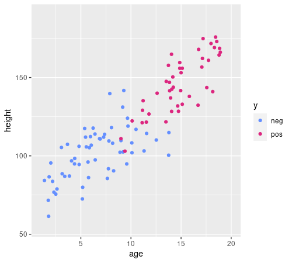]
<!--
d %>% ggplot(aes(age,height,color=y))+geom_point()+xlim(c(1,20))+ylim(c(55,190))+scale_color_manual(values=c("#648FFF", "#DC267F", "#FE6100", "#785EF0", "#FFB000"))
-->
]
.c50[
The data exploration suggests that using ML is not a *terrible* idea.

Assume we are computer scientists and we *like* `if-then-else` (nested) structures:
can we **manually** build an `if-then-else` structure that allows to make a decision.

**Requirements** (to keep it feasible manually):
- each `if` condition should:
  - involve **just one independent** variable
  - consist of a **threshold comparison**
- the decision has to be .col2[●] or .col1[●]

**Strategy**:
- tell apart points of different colors

]
]

---

## Building the `if-then-else`

.cols[
.c50[
.w100p.center[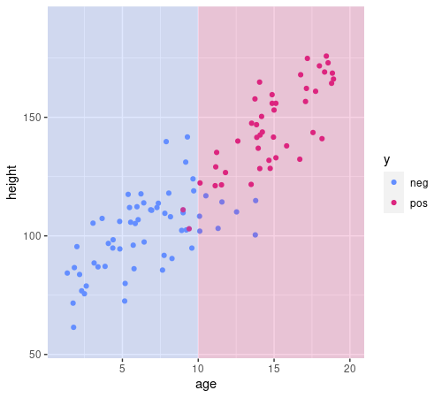]
<!--
d %>% ggplot(aes(age,height,color=y))+geom_point()+xlim(c(1,20))+ylim(c(55,190))+scale_color_manual(values=c("#648FFF", "#DC267F", "#FE6100", "#785EF0", "#FFB000"))+annotate("rect",xmin=10,xmax=+Inf,ymin=-Inf,ymax=Inf,fill="#DC267F",alpha=0.2)+annotate("rect",xmin=-Inf,xmax=10,ymin=-Inf,ymax=Inf,fill="#648FFF",alpha=0.2)
-->
]
.c50[
.pseudo-code[
function $\\text{predict}(\\vect{x})$ {  
.i[]if $x\\subtext{age}\\le 10$ then {  
.i[].i[]return .col1[●]  
.i[]} else {  
.i[].i[]return .col2[●]  
.i[]}  
}
]

- requirements are met
- background color at position $\\vect{x}=(x\\subtext{age},x\\subtext{height})$ is the color the code above will assign to that $\\vect{x}$, i.e., $f\\subtext{predict}(\\vect{x})$
- most of the examples fall in the correct colored region
  - maybe the `else` branch is too rough

**Let's improve it!**
]
]

---

## Building the `if-then-else`

.cols[
.c50[
.w100p.center[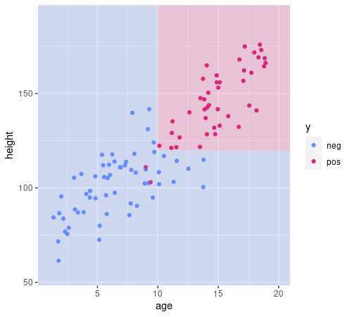]
<!--
d %>% ggplot(aes(age,height,color=y))+geom_point()+xlim(c(1,20))+ylim(c(55,190))+scale_color_manual(values=c("#648FFF", "#DC267F", "#FE6100", "#785EF0", "#FFB000"))+annotate("rect",xmin=10,xmax=+Inf,ymin=-Inf,ymax=120,fill="#648FFF",alpha=0.2)+annotate("rect",xmin=10,xmax=+Inf,ymin=120,ymax=Inf,fill="#DC267F",alpha=0.2)+annotate("rect",xmin=-Inf,xmax=10,ymin=-Inf,ymax=Inf,fill="#648FFF",alpha=0.2)
-->
]
.c50[
.pseudo-code[
function $\\text{predict}(\\vect{x})$ {  
.i[]if $x\\subtext{age}\\le 10$ then {  
.i[].i[]return .col1[●]  
.i[]} else {  
.i[].i[]if $x\\subtext{height}\\le 120$ then {  
.i[].i[].i[]return .col1[●]  
.i[].i[]} else {  
.i[].i[].i[]return .col2[●]  
.i[].i[]}  
.i[]}  
}
]

- requirements are met
- almost all the examples fall in the correct colored region

**Nice job!**
]
]

---

## The decision tree

.cols[
.c50[
This `if-then-else` nested structure can be represented as a **tree**:
.diagram.center.tree[
rect(100,0,140,40)
otext(170,20,'$x\\\\subtext{age}$ vs. $10$', 'small')
link([170,40,70,80])
otext(70,60,'$\\\\le$','small')
rect(45,80,50,40)
otext(70,100,'●','col1')
rect(200,80,140,40)
otext(270,60,'$>$','small')
link([170,40,270,80])
otext(270,100,'$x\\\\subtext{height}$ vs. $120$', 'small')
link([270,120,170,160])
otext(170,140,'$\\\\le$','small')
rect(145,160,50,40)
otext(170,180,'●','col1')
link([270,120,370,160])
otext(370,140,'$>$','small')
rect(345,160,50,40)
otext(370,180,'●','col2')
]
]
.c50[
.pseudo-code[
function $\\text{predict}(\\vect{x})$ {  
.i[]if $x\\subtext{age}\\le 10$ then {  
.i[].i[]return .col1[●]  
.i[]} else {  
.i[].i[]if $x\\subtext{height}\\le 120$ then {  
.i[].i[].i[]return .col1[●]  
.i[].i[]} else {  
.i[].i[].i[]return .col2[●]  
.i[].i[]}  
.i[]}  
}
]
]
]

We call this a .key[decision tree], since we use it inside an $f\\subtext{predict}$ for making a decision:
- it's a binary tree, since **nodes** have exactly 0 or 2 children
- non-terminal nodes (or **branch nodes**) hold a pair (independent variable, threshold)
- terminal nodes (or **leaf nodes**) hold one value $y \\in Y$

---

## De-hard-coding $f\\subtext{predict}$

.cols[
.c50[
**Now**: our human learned $f\\subtext{predict}$
.diagram.center[
link([0,25,75,25],'a')
rect(75,0,150,50)
link([225,25,300,25],'a')
otext(150,25,"$f\\\\subtext{predict}$")
otext(37.5,10,'$x$')
otext(262.5,10,'$y$')
]

.pseudo-code.compact[
function $\\text{predict}(\\vect{x})$ {  
.i[]if $x\\subtext{age}\\le 10$ then {  
.i[].i[]return .col1[●]  
.i[]} else {  
.i[].i[]if $x\\subtext{height}\\le 120$ then {  
.i[].i[].i[]return .col1[●]  
.i[].i[]} else {  
.i[].i[].i[]return .col2[●]  
.i[].i[]}  
.i[]}  
}
]
]
.c50[
**Goal**: an $f'\\subtext{predict}$ working on any tree
.diagram.center[
link([0,25,75,25],'a')
rect(75,0,150,50)
link([225,25,300,25],'a')
otext(150,25,"$f'\\\\subtext{predict}$")
otext(37.5,10,'$\\\\vect{x},m$')
otext(262.5,10,'$y$')
]

.pseudo-code.compact[
function $\\text{predict}(\\vect{x}, m)$ {  
.i[]...  
}
]
]
]

We *human learned* (i.e., manually designed) a function where the **decision tree** is **hard-coded** in the $\\text{predict}()$ function in the form of an `if-then-else` structure:
- can we *pull out* the decision tree out of it and make $\\text{predict}()$ a templated function?

---

## Formalizing the decision tree

.cols[
.c50[
**Scenario**: classification with multivariate numerical features:
- $X = X\_1 \\times \\dots \\times X\_p$, with each $X\_i\\subseteq\\mathbb{R}$
  - we write $\\vect{x} = (x\_1,\\dots,x\_p)=(x\_i)\_i$
- $Y$, finite without ordering

The **model** $t \\in T\_{p,Y}$ is a decision tree defined over $X\_1 \\times \\dots \\times X\_p,Y$, i.e.:
- each $t$ is a binary tree
- each **non-terminal** node is .note[labeled with] a **pair $(j,\\tau)$**, with $j \\in \\{1,\\dots,p\\}$ and $\\tau \\in \\mathbb{R}$
  - $j$ is the index of the independent variable
  - $\\tau$ is a threshold for comparison
- each **terminal** node is .note[labeled with] a $y \\in Y$
]
.c50[
.diagram.center.tree[
rect(100,0,140,40)
otext(170,20,'$x\\\\subtext{age}$ vs. $10$', 'small')
link([170,40,70,80])
otext(70,60,'$\\\\le$','small')
rect(45,80,50,40)
otext(70,100,'●','col1')
rect(200,80,140,40)
otext(270,60,'$>$','small')
link([170,40,270,80])
otext(270,100,'$x\\\\subtext{height}$ vs. $120$', 'small')
link([270,120,170,160])
otext(170,140,'$\\\\le$','small')
rect(145,160,50,40)
otext(170,180,'●','col1')
link([270,120,370,160])
otext(370,140,'$>$','small')
rect(345,160,50,40)
otext(370,180,'●','col2')
]
]
]

---

## Compact representation of (binary) trees

.cols[
.c50[
We represent a tree $t \\in T\_L$ as:
.center[$t = \\tree{\\c{3}{l}}{\\c{4}{t'}}{\\c{4}{t''}}$]
where $t', t'' \\in T\_L \\cup \\{\\varnothing\\}$ are the left and right .col4[**children**] trees and $l \\in L$ is the .col3[**label**].

If the tree is a **terminal node**¹, it has no children (i.e., $t'=t''=\\varnothing$) and we write:
.center[$t = \\tree{l}{\\varnothing}{\\varnothing}=\\treel{l}$]

**For decision trees**:
- $L= (\\{1,\\dots,p\\} \\times \\mathbb{R}) \\cup Y$, that is, a label can be a pair $(j,\\tau)$ or a $y$
- if $l \\in Y$, then $t'=t''=\\varnothing$

We shorten $T\_{(\\{1,\\dots,p\\} \\times \\mathbb{R}) \\cup Y}$ as $T\_{p,Y}$.

]
.c40[
.diagram.center.tree[
rect(100,0,140,40)
otext(170,20,'$x\\\\subtext{age}$ vs. $10$', 'small')
link([170,40,70,80])
otext(70,60,'$\\\\le$','small')
rect(45,80,50,40)
otext(70,100,'●','col1')
rect(200,80,140,40)
otext(270,60,'$>$','small')
link([170,40,270,80])
otext(270,100,'$x\\\\subtext{height}$ vs. $120$', 'small')
link([270,120,170,160])
otext(170,140,'$\\\\le$','small')
rect(145,160,50,40)
otext(170,180,'●','col1')
link([270,120,370,160])
otext(370,140,'$>$','small')
rect(345,160,50,40)
otext(370,180,'●','col2')
]

With:
- $X=X\\subtext{age} \\times X\\subtext{height} = X\_1 \\times X\_2$
- $Y=\\set{\\c{1}{●},\\c{2}{●}}$

This tree is:
.center[$t = \\tree{(1,10)}{\\treel{\\c{1}{●}}}{\\tree{(2,120)}{\\treel{\\c{1}{●}}}{\\treel{\\c{2}{●}}}}$]

.note[Would you be able to write a parser for this?]
]
]

.footnote[
1. Actually, node = tree, i.e., a node is a tree and a tree is a node!
]


---

## Templated $f'\\subtext{predict}$

.cols[
.c50[
.pseudo-code.compact[
function $\\text{predict}(\\vect{x}, t)$ {  
.i[]if $\\neg\\text{has-children}(t)$ then {  
.i[].i[]$y \\gets \\text{label-of}(t)$  
.i[].i[]return $y$  
.i[]} else { .comment[//hence $r$ is a branch node]  
.i[].i[]$(j, \\tau) \\gets \\text{label-of}(t)$  
.i[].i[]if $x\_j \\le \\tau$ then {  
.i[].i[].i[]return $\\text{predict}(\\vect{x}, \\text{left-child-of}(t))$ .comment[//recursion]  
.i[].i[]} else {  
.i[].i[].i[]return $\\text{predict}(\\vect{x}, \\text{right-child-of}(t))$ .comment[//recursion]  
.i[].i[]}  
.i[]}  
}
]
]
.c50[
- $\\text{has-children}(t)$ is true iff $t$ is not terminal
- $\\text{label-of}(t)$ returns the label of $t$
  - a $y \\in Y$ for terminal nodes
  - a $(j,\\tau) \\in \\{1,\\dots,p\\} \\times \\mathbb{R}$ for non-terminal nodes
- $\\text{left-child-of}(t)$ and $\\text{right-child-of}(t)$ return the left or right child of $t$
  - that are other trees, in general
]
]

.cols[
.c50[
It's a **recursive** function that:
- works with any $t \\in T\_{p,Y}$ and any $\\vect{x} \\in \\mathbb{R}^p$
- always returns a $y \\in Y$
]
.c50[
.diagram.center[
link([0,25,75,25],'a')
rect(75,0,150,50)
link([225,25,300,25],'a')
otext(150,25,"$f'\\\\subtext{predict}$")
otext(37.5,10,'$\\\\vect{x},t$')
otext(262.5,10,'$y$')
]
]
]

---

## $f'\\subtext{predict}$ application example

.cols[
.c60[
**1st call**: .compact[$\\vect{x}=(14,155), t = \\tree{(1,10)}{\\treel{\\c{1}{●}}}{\\tree{(2,120)}{\\treel{\\c{1}{●}}}{\\treel{\\c{2}{●}}}}$]

.compact[
$\\neg\\text{has-children}(t)=\\text{false}$  
$(j,\\tau)=(1,10)$  
$x\_1 \\le 10 = \\text{false}$  
$\\text{right-child-of}(r)= \\tree{(2,120)}{\\treel{\\c{1}{●}}}{\\treel{\\c{2}{●}}}$
]

.i[]**2nd call**: .compact[$\\vect{x}=(14,155), t = \\tree{(2,120)}{\\treel{\\c{1}{●}}}{\\treel{\\c{2}{●}}}$]

.i[]$\\neg\\text{has-children}(t)=\\text{false}$  
.i[]$(j,\\tau)=(2,120)$  
.i[]$x\_2 \\le 120 = \\text{false}$  
.i[]$\\text{right-child-of}(r)= [\\c{2}{●}]$

.i[].i[]**3rd call**: .compact[$\\vect{x}=(14,155), t = \\treel{\\c{2}{●}}$]

.i[].i[]$\\neg\\text{has-children}(t)=\\text{true}$  
.i[].i[]$y=\\c{2}{●}$ .note[return return return]
]
.c40[
.pseudo-code.compact[
function $\\text{predict}(\\vect{x}, t)$ {  
.i[]if $\\neg\\text{has-children}(t)$ then {  
.i[].i[]$y \\gets \\text{label-of}(t)$  
.i[].i[]return $y$  
.i[]} else {  
.i[].i[]$(j, \\tau) \\gets \\text{label-of}(t)$  
.i[].i[]if $x\_j \\le \\tau$ then {  
.i[].i[].i[]return $\\text{predict}(\\vect{x}, \\text{left-child-of}(t))$  
.i[].i[]} else {  
.i[].i[].i[]return $\\text{predict}(\\vect{x}, \\text{right-child-of}(t))$  
.i[].i[]}  
.i[]}    
}
]
]
]
---

## Towards tree learning

We have our $f'\\subtext{predict}: \\mathbb{R}^p \\times T\_{p,Y} \\to Y$; for having a learning technique we miss only the learning function, i.e., $f'\\subtext{learn}: \\mathcal{P}^*(\\mathbb{R}^p \\times Y) \\to T\_{p,Y}$:
.diagram.center[
link([0,25,150,25],'a')
rect(150,0,150,50)
link([300,25,400,25],'a')
otext(225,25,"$f'\\\\subtext{learn}$")
otext(75,10,'$\\\\seq{(\\\\vect{x}^{(i)},y^{(i)})}{i}$')
otext(350,10,'$t$')
]

What we did manually (i.e., how we *human learned*):
1. **until** we are satisfied
2. put a vertical/horizontal line that **well separates** the data
3. **repeat** from step 1 once for each on the two resulting regions

Let's rewrite it as (pseudo-)code!

---

## Recursive binary splitting

.cols[
.c60[
.pseudo-code.compact[
function $\\text{learn}(\\seq{(\\vect{x}^{(i)},y^{(i)})}{i})$ {  
.i[]if .col1[$\\text{should-stop}(\\seq{y^{(i)}}{i})$] then {  
.i[].i[]$y^\\star \\gets \\argmax\_{y \\in Y} \\sum\_i \\mathbf{1}(y^{(i)}=y)$ .comment[//$y^\\star$ is the most frequent class]  
.i[].i[]return $\\text{node-from}(y^\\star,\\varnothing,\\varnothing)$  
.i[]} else { .comment[//hence $r$ is a branch node]  
.i[].i[].col2[$(j, \\tau) \\gets \\text{find-best-branch}(\\seq{(\\vect{x}^{(i)},y^{(i)})}{i})$]  
.i[].i[]$t \\gets \\text{node-from}($  
.i[].i[].i[]$(j,\\tau),$  
.i[].i[].i[]$\\c{3}{\\text{learn}(\\seq{(\\vect{x}^{(i)},y^{(i)})}{i}\\big\\rvert\_{x^{(i)}\_j \\le \\tau})},$ .comment[//recursion]  
.i[].i[].i[]$\\c{3}{\\text{learn}(\\seq{(\\vect{x}^{(i)},y^{(i)})}{i}\\big\\rvert\_{x^{(i)}\_j > \\tau})}$ .comment[//recursion]  
.i[].i[])  
.i[].i[]return $t$  
.i[]}  
}
]
]
.c40[
.diagram.center[
link([0,25,150,25],'a')
rect(150,0,150,50)
link([300,25,400,25],'a')
otext(225,25,"$f'\\\\subtext{learn}$")
otext(75,10,'$\\\\seq{(\\\\vect{x}^{(i)},y^{(i)})}{i}$')
otext(350,10,'$t$')
]

1. .col1[until we are satisfied]
2. .col2[put a vertical/horizontal line that well separates the data]
3. .col3[repeat step 1 once for each on the two resulting regions]

.note[
$\\seq{(\\vect{x}^{(i)},y^{(i)})}{i}\\big\\rvert\_{x^{(i)}\_j \\le \\tau}$ is the sub-multiset of $\\seq{(\\vect{x}^{(i)},y^{(i)})}{i}$ composed of pairs for which $x\_j \\le \\tau$
]
]
]

This $f'\\subtext{learn}$ is called .key[recursive binary splitting]:
- it's **recursive**
- when recurses, **splits** the data in two parts (**binary**)
  - it's a top-down approach: starts from the big problem and makes it smaller (**divide-et-impera**)
- when stopping recursion, put a node with the **most frequent class**

---

## Finding the best branch

**Intuitively**:
- consider all variables (i.e., all $j$) and *all*¹ threshold values
- choose the pair (variable, threshold) that best separate the data
  - i.e., that results in the lowest rate of **misclassified** examples

.cols[
.c60[
**In detail** (and formally):
.pseudo-code.compact[
function $\\text{find-best-branch}(\\seq{(\\vect{x}^{(i)},y^{(i)})}{i})$ {  
.i[]$(j^\\star, \\tau^\\star) \\gets \\argmin\_{j,\\tau} \\left(\\text{error}(\\c{1}{\\seq{y^{(i)}}{i}\\big\\rvert\_{x^{(i)}\_j \\le \\tau}})+\\text{error}(\\c{1}{\\seq{y^{(i)}}{i}\\big\\rvert\_{x^{(i)}\_j > \\tau}})\\right)$  
.i[]return $(j^\\star, \\tau^\\star)$  
}
]
and
.pseudo-code.compact[
function $\\text{error}(\\seq{y^{(i)}}{i})$ { .comment[//the error of the dummy classifier on $\\seq{y^{(i)}}{i}$]  
.i[].col2[$y^\\star \\gets \\argmax\_y \\sum\_i \\mathbf{1}(y^{(i)}=y)$] .comment[//$y^\\star$ is the most freq class]  
.i[]return .col2[$\\frac{1}{n} \\sum\_i \\mathbf{1}(y^{(i)} \\ne y^\\star)$] .comment[//$n=|\\seq{y^{(i)}}{i}|$]  
}
]
]
.c40[
**Interpretation**: if we .col1[split the data at this point] (i.e., a $(j, \\tau)$ pair) and use one .col2[dummy classifier] on each of the two sides, what would be the resulting error?

This approach is **greedy**, since it tries to obtain the maximum result (finding the branch), with the minimum effort (using just two dummy classifiers later on):
- in practice, it makes this learning technique **computationally light**!
]
]

.footnote[
1. you just need to consider, for each $j$-th feature, the **midpoints** of $(x\_j^{(i)})\_i$: at most $n$ of them
]

---

## Deciding when to stop (recursion)

**Intuitively**:
- if all the examples belong to the .col1[same class], stop
  - splitting would be pointless!
- or, if the number examples is .col2[very small], stop .note[$\\approx$ what we did while *human learning*]
  - no need to bother

.cols[
.c50[
**In detail** (and formally):
.pseudo-code.compact[
function $\\text{should-stop}(\\seq{y^{(i)}}{i}, n\\subtext{min})$ {  
.i[]if .col2[$n \\le n\\subtext{min}$] then { .comment[//$n=|\\seq{y^{(i)}}{i}|$]  
.i[].i[] return $\\text{true}$;  
.i[]}  
.i[]if .col1[$\\text{error}(\\seq{y^{(i)}}{i})=0$] then {  
.i[].i[] return $\\text{true}$;  
.i[]}  
.i[]return $\\text{false}$  
}
]

.note[
Checking the first condition is, in general, cheaper than checking the second condition.
]
]
.c50[
- only $\\seq{y^{(i)}}{i}$ is needed to decide whether to stop, $\\seq{x^{(i)}}{i}$ is not used!
- $n\\subtext{min}$ is a **parameter** of $f\\subtext{should-stop}$
  - it represents the "very small" criterion
  - it propagates to $f'\\subtext{learn}$, which uses $f\\subtext{should-stop}$
  - (also denoted as $k\\subtext{min}$)
- since $\\text{error()}$ is the classification error done by the dummy classifier, it is $=0$ iff the most frequent class $y^\\star$ is the only class in $\\seq{y^{(i)}}{i}$
]
]

---

## $f'\\subtext{learn}$ application example

.cols[
.c60.compact[

.cols.pcompact[
.c40[
**1st call:**  
$(j,\\tau) = (1,7)$
]
.c60[
.diagram.neutral.center[
link([-10,5,310,5],'a coln')
link([0,0,0,10],'coln')
otext(0,-10,'0')
otext(300,-10,'10')
link([30,0,30,10],'coln')
link([60,0,60,10],'coln')
link([90,0,90,10],'coln')
link([120,0,120,10],'coln')
link([150,0,150,10],'coln')
link([180,0,180,10],'coln')
link([210,0,210,10],'col3')
link([240,0,240,10],'coln')
link([270,0,270,10],'coln')
link([300,0,300,10],'coln')
otext(15,-5,'●','col1')
otext(45,-5,'●','col1')
otext(75,-5,'●','col2')
otext(105,-5,'●','col2')
otext(135,-5,'●','col1')
otext(165,-5,'●','col1')
otext(195,-5,'●','col2')
otext(225,-5,'●','col3')
otext(255,-5,'●','col3')
otext(285,-5,'●','col3')
otext(30,20,'$\\\\c{1}{\\\\frac{0}{1}} \\\\c{1}{\\\\frac{6}{9}}$','smaller')
otext(60,20,'$\\\\c{1}{\\\\frac{0}{2}} \\\\c{2}{\\\\frac{5}{8}}$','smaller')
otext(90,20,'$\\\\c{1}{\\\\frac{1}{3}} \\\\c{3}{\\\\frac{4}{7}}$','smaller')
otext(120,20,'$\\\\c{1}{\\\\frac{2}{4}} \\\\c{3}{\\\\frac{3}{6}}$','smaller')
otext(150,20,'$\\\\c{1}{\\\\frac{2}{5}} \\\\c{3}{\\\\frac{2}{5}}$','smaller')
otext(180,20,'$\\\\c{1}{\\\\frac{2}{6}} \\\\c{3}{\\\\frac{1}{4}}$','smaller')
otext(210,20,'$\\\\c{1}{\\\\frac{3}{7}} \\\\c{3}{\\\\frac{0}{3}}$','smaller')
otext(240,20,'$\\\\c{1}{\\\\frac{4}{8}} \\\\c{3}{\\\\frac{0}{2}}$','smaller')
otext(270,20,'$\\\\c{1}{\\\\frac{5}{9}} \\\\c{3}{\\\\frac{0}{1}}$','smaller')
]
]
]

.cols.pcompact[
.c40[
.i[]**1st-l call:**  
.i[]$(j,\\tau) = (1,2)$
]
.c60[
.diagram.neutral.center[
link([-10,5,310,5],'a coln')
link([0,0,0,10],'coln')
otext(0,-10,'0')
otext(300,-10,'10')
link([30,0,30,10],'coln')
link([60,0,60,10],'col3')
link([90,0,90,10],'coln')
link([120,0,120,10],'coln')
link([150,0,150,10],'coln')
link([180,0,180,10],'coln')
link([210,0,210,10],'coln')
link([240,0,240,10],'coln')
link([270,0,270,10],'coln')
link([300,0,300,10],'coln')
otext(15,-5,'●','col1')
otext(45,-5,'●','col1')
otext(75,-5,'●','col2')
otext(105,-5,'●','col2')
otext(135,-5,'●','col1')
otext(165,-5,'●','col1')
otext(195,-5,'●','col2')
otext(30,20,'$\\\\c{1}{\\\\frac{0}{1}} \\\\c{1}{\\\\frac{3}{6}}$','smaller')
otext(60,20,'$\\\\c{1}{\\\\frac{0}{2}} \\\\c{2}{\\\\frac{2}{5}}$','smaller')
otext(90,20,'$\\\\c{1}{\\\\frac{1}{3}} \\\\c{1}{\\\\frac{2}{4}}$','smaller')
otext(120,20,'$\\\\c{1}{\\\\frac{2}{4}} \\\\c{1}{\\\\frac{1}{3}}$','smaller')
otext(150,20,'$\\\\c{1}{\\\\frac{2}{5}} \\\\c{1}{\\\\frac{1}{2}}$','smaller')
otext(180,20,'$\\\\c{1}{\\\\frac{2}{6}} \\\\c{1}{\\\\frac{0}{1}}$','smaller')
]
]
]

.cols.pcompact[
.c40[
.i[].i[]**1st-l-l call:**  
.i[].i[]return $\\treel{\\c{1}{●}}$
]
.c60[
.diagram.neutral.center[
link([-10,5,310,5],'a coln')
link([0,0,0,10],'coln')
otext(0,-10,'0')
otext(300,-10,'10')
link([30,0,30,10],'coln')
link([60,0,60,10],'coln')
link([90,0,90,10],'coln')
link([120,0,120,10],'coln')
link([150,0,150,10],'coln')
link([180,0,180,10],'coln')
link([210,0,210,10],'coln')
link([240,0,240,10],'coln')
link([270,0,270,10],'coln')
link([300,0,300,10],'coln')
otext(15,-5,'●','col1')
otext(45,-5,'●','col1')
]
]
]

.cols.pcompact[
.c40[
.i[].i[]**1st-l-r call:**  
.i[].i[]$(j,\\tau) = (1,4)$
]
.c60[
.diagram.neutral.center[
link([-10,5,310,5],'a coln')
link([0,0,0,10],'coln')
otext(0,-10,'0')
otext(300,-10,'10')
link([30,0,30,10],'coln')
link([60,0,60,10],'coln')
link([90,0,90,10],'coln')
link([120,0,120,10],'col3')
link([150,0,150,10],'coln')
link([180,0,180,10],'coln')
link([210,0,210,10],'coln')
link([240,0,240,10],'coln')
link([270,0,270,10],'coln')
link([300,0,300,10],'coln')
otext(75,-5,'●','col2')
otext(105,-5,'●','col2')
otext(135,-5,'●','col1')
otext(165,-5,'●','col1')
otext(195,-5,'●','col2')
otext(90,20,'$\\\\c{2}{\\\\frac{0}{1}} \\\\c{2}{\\\\frac{2}{4}}$','smaller')
otext(120,20,'$\\\\c{2}{\\\\frac{0}{2}} \\\\c{1}{\\\\frac{1}{3}}$','smaller')
otext(150,20,'$\\\\c{2}{\\\\frac{1}{3}} \\\\c{1}{\\\\frac{1}{2}}$','smaller')
otext(180,20,'$\\\\c{2}{\\\\frac{2}{4}} \\\\c{2}{\\\\frac{0}{1}}$','smaller')
]
]
]

.cols.pcompact[
.c40[
.i[].i[].i[]**1st-l-r-l call:**  
.i[].i[].i[]return $\\treel{\\c{2}{●}}$
]
.c60[
.diagram.neutral.center[
link([-10,5,310,5],'a coln')
link([0,0,0,10],'coln')
otext(0,-10,'0')
otext(300,-10,'10')
link([30,0,30,10],'coln')
link([60,0,60,10],'coln')
link([90,0,90,10],'coln')
link([120,0,120,10],'coln')
link([150,0,150,10],'coln')
link([180,0,180,10],'coln')
link([210,0,210,10],'coln')
link([240,0,240,10],'coln')
link([270,0,270,10],'coln')
link([300,0,300,10],'coln')
otext(75,-5,'●','col2')
otext(105,-5,'●','col2')
]
]
]

.cols.pcompact[
.c40[
.i[].i[].i[]**1st-l-r-r call:**  
.i[].i[].i[]return $\\treel{\\c{1}{●}}$
]
.c60[
.diagram.neutral.center[
link([-10,5,310,5],'a coln')
link([0,0,0,10],'coln')
otext(0,-10,'0')
otext(300,-10,'10')
link([30,0,30,10],'coln')
link([60,0,60,10],'coln')
link([90,0,90,10],'coln')
link([120,0,120,10],'coln')
link([150,0,150,10],'coln')
link([180,0,180,10],'coln')
link([210,0,210,10],'coln')
link([240,0,240,10],'coln')
link([270,0,270,10],'coln')
link([300,0,300,10],'coln')
otext(135,-5,'●','col1')
otext(165,-5,'●','col1')
otext(195,-5,'●','col2')
]
]
]

.i[].i[]return $\\tree{(1,4)}{\\treel{\\c{2}{●}}}{\\treel{\\c{1}{●}}}$  
.i[]return $\\tree{(1,2)}{\\treel{\\c{1}{●}}}{\\tree{(1,4)}{\\treel{\\c{2}{●}}}{\\treel{\\c{1}{●}}}}$

.cols.pcompact[
.c40[
.i[]**1st-r call:**  
.i[]return $\\treel{\\c{3}{●}}$
]
.c60[
.diagram.neutral.center[
link([-10,5,310,5],'a coln')
link([0,0,0,10],'coln')
otext(0,-10,'0')
otext(300,-10,'10')
link([30,0,30,10],'coln')
link([60,0,60,10],'coln')
link([90,0,90,10],'coln')
link([120,0,120,10],'coln')
link([150,0,150,10],'coln')
link([180,0,180,10],'coln')
link([210,0,210,10],'coln')
link([240,0,240,10],'coln')
link([270,0,270,10],'coln')
link([300,0,300,10],'coln')
otext(225,-5,'●','col3')
otext(255,-5,'●','col3')
otext(285,-5,'●','col3')
]
]
]

return $\\tree{(1,7)}{\\tree{(1,2)}{\\treel{\\c{1}{●}}}{\\tree{(1,4)}{\\treel{\\c{2}{●}}}{\\treel{\\c{1}{●}}}}}{\\treel{\\c{3}{●}}}$

]
.c40.compact[
Assume:
- $X=\\mathbb{R}^1=\\mathbb{R}$, $Y=\\{\\c{1}{●},\\c{2}{●},\\c{3}{●}\\}$
- $n\\subtext{min}=3$

.pseudo-code.compact[
function $\\text{learn}(\\seq{(\\vect{x}^{(i)},y^{(i)})}{i}, n\\subtext{min})$ {  
.i[]if $\\text{should-stop}(\\seq{y^{(i)}}{i}, n\\subtext{min})$ then {  
.i[].i[]$y^\\star \\gets \\argmax\_{y \\in Y} \\sum\_i \\mathbf{1}(y^{(i)}=y)$  
.i[].i[]return $\\text{node-from}(y^\\star,\\varnothing,\\varnothing)$  
.i[]} else {  
.i[].i[]$(j, \\tau) \\gets \\text{find-best-branch}(\\seq{(\\vect{x}^{(i)},y^{(i)})}{i})$  
.i[].i[]$t \\gets \\text{node-from}($  
.i[].i[].i[]$(j,\\tau),$  
.i[].i[].i[]$\\text{learn}(\\seq{(\\vect{x}^{(i)},y^{(i)})}{i}\\big\\rvert\_{x^{(i)}\_j \\le \\tau}, n\\subtext{min}),$  
.i[].i[].i[]$\\text{learn}(\\seq{(\\vect{x}^{(i)},y^{(i)})}{i}\\big\\rvert\_{x^{(i)}\_j > \\tau}, n\\subtext{min})$  
.i[].i[])  
.i[].i[]return $t$  
.i[]}  
}
]
]
]

.question[Question]: what's the accuracy of this $t$ on the learning set?

---

## Alternatives for $\\text{find-best-branch}()$

.pseudo-code.compact[
function $\\text{find-best-branch}(\\seq{(\\vect{x}^{(i)},y^{(i)})}{i})$ {  
.i[]$(j^\\star, \\tau^\\star) \\gets \\argmin\_{j,\\tau} \\left(\\c{1}{\\text{error}(\\seq{y^{(i)}}{i}\\big\\rvert\_{x^{(i)}\_j \\le \\tau})}+\\c{1}{\\text{error}(\\seq{y^{(i)}}{i}\\big\\rvert\_{x^{(i)}\_j > \\tau})}\\right)$  
.i[]return $(j^\\star, \\tau^\\star)$  
}
]

$\\text{error}(\\seq{y^{(i)}}{i})$ is the error the dummy classifier would do on $\\seq{y^{(i)}}{i}$:
.center[$\\c{1}{\\text{error}(\\seq{y^{(i)}}{i})}=1 - \\max\_y \\freq{y, \\seq{y^{(i)}}{i}}$]

Instead of $\\text{error}()$, two other variants can be used:
- **Gini index**: $\\c{1}{\\text{gini}(\\seq{y^{(i)}}{i})}=\\sum\_y \\freq{y, \\seq{y^{(i)}}{i}} \\left(1-\\freq{y, \\seq{y^{(i)}}{i}}\\right)$
- **Cross entropy**: $\\c{1}{\\text{cross-entropy}(\\seq{y^{(i)}}{i})}=-\\sum\_y \\freq{y, \\seq{y^{(i)}}{i}} \\log \\freq{y, \\seq{y^{(i)}}{i}}$

--

For all:
.cols[
.c70[
- **the lower, the better**
- they measure the .key[node impurity], i.e., the *amount* $e$ of cases different from the most frequent one among the examples *arrived* at a certain node
]
.c30[
.diagram.center[
link([0,25,75,25],'a')
rect(75,0,150,50)
link([225,25,325,25],'a')
otext(150,25,"$f\\\\subtext{impurity}$")
otext(37.5,10,'$\\\\seq{y^{(i)}}{i}$')
otext(275,10,'$e \\\\in \\\\mathbb{R}^+$')
]
]
]

---

## Node impurity

.pseudo-code.compact[
function $\\text{find-best-branch}(\\seq{(\\vect{x}^{(i)},y^{(i)})}{i}, \\c{1}{f\\subtext{impurity}})$ {  
.i[]$(j^\\star, \\tau^\\star) \\gets \\argmin\_{j,\\tau} \\left(\\c{1}{f\\subtext{impurity}(\\seq{y^{(i)}}{i}\\big\\rvert\_{x^{(i)}\_j \\le \\tau})}+\\c{1}{f\\subtext{impurity}(\\seq{y^{(i)}}{i}\\big\\rvert\_{x^{(i)}\_j > \\tau})}\\right)$  
.i[]return $(j^\\star, \\tau^\\star)$  
}
]

The way to measure the node impurity might be a .col1[parameter] of $\\text{find-best-branch}()$, but it has been found that **Gini is better** for learning trees than error.

.cols[
.c40[
.h30ex.center[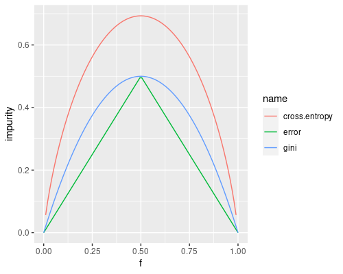]
<!--
f=seq(0,1,length.out=100)
error = 1-pmax(f,1-f)
gini = 2*f*(1-f)
cross.entropy = -f*log(f)-(1-f)*log(1-f)
as.data.frame(cbind(f,error,gini,cross.entropy)) %>% pivot_longer(!f,values_to="impurity") %>% ggplot(aes(x=f,y=impurity,color=name))+geom_line()
-->
]
.c60[
Here, for binary classification:
- on the $x$-axis: the frequency $f=\\freq{\\text{pos}, \\seq{y^{(i)}}{i}}$ of the positive class
  - $f=0.5$ (.col1[●].col1[●].col1[●].col2[●].col2[●].col2[●]) is the worst case
  - $f=0$ (.col1[●].col1[●].col1[●].col1[●].col1[●].col1[●]) and $f=1$ (.col2[●].col2[●].col2[●].col2[●].col2[●].col2[●]) are the best cases
- on the $y$-axis: the three impurity indexes

Gini and cross-entropy are **smoother** than the error.
]
]

---

## Alternatives for $\\text{should-stop}()$

.cols[
.c50[
*Original* version: (**data size**)
- too few examples or
- no errors

.center[.col1[$n \\le n\\subtext{min}$] or .col1[$\\text{error}(\\seq{y^{(i)}}{i})=0$]]

Alternative 1 (**tree depth**):
- node depth deeper than $\\tau_m$ or
- no errors

.note[requires propagating recursively the depth of the node being currently built]

Alternative 1 (**node impurity**):
- impurity lower than a $\\tau\_\\epsilon$

]
.c50[
.pseudo-code.compact[
function $\\text{should-stop}(\\seq{y^{(i)}}{i}, n\\subtext{min})$ {  
.i[]if .col1[$n \\le n\\subtext{min}$] then {  
.i[].i[] return $\\text{true}$;  
.i[]}  
.i[]if .col1[$\\text{error}(\\seq{y^{(i)}}{i})=0$] then {  
.i[].i[] return $\\text{true}$;  
.i[]}  
.i[]return $\\text{false}$  
}
]

Impact of the parameter:
- the lower $n\\subtext{min}$, the **larger** the tree
- the greater $\\tau\_m$, the **larger** the tree
- the lower $\\tau\_\\epsilon$, the **larger** the tree

(for the same dataset, in general)
]
]

---

## Tree learning with probability

.cols[
.c40[
Learning technique with probability:
- $f'\\subtext{learn}: \\mathcal{P}^*(X \\times Y) \\to M$
- $f''\\subtext{predict}: X \\times M \\to P\_Y$
]
.c60[
.diagram.center[
link([0,50,125,50],'a')
link([75,35,125,35],'a')
rect(50,0,425,100)
rect(125,25,100,50)
link([225,50,275,50],'a')
rect(275,25,150,50)
link([425,50,550,50],'a')
otext(25,35,'$x$')
otext(100,20,'$m$')
otext(175,50,"$f''\\\\subtext{predict}$")
otext(250,35,'$p$')
otext(350,50,"$\\\\argmax\\\\sub{y \\\\in Y}$")
otext(512.5,35,'$y$')
]
]
]

For tree learning:
- $f'\\subtext{learn}: \\c{1}{\\mathcal{P}^*(X\_1 \\times \\dots \\times X\_p \\times Y)} \\to \\c{2}{T\_{(\\{1,\\dots,p\\}\\times\\mathbb{R}) \\cup P\_Y}}$
  - given a .col1[multivariate dataset], returns a .col2[tree] in $T\_{(\\{1,\\dots,p\\}\\times\\mathbb{R}) \\cup P\_Y}$
- $f''\\subtext{predict}: \\c{1}{X\_1 \\times \\dots \\times X\_p} \\times \\c{2}{T\_{(\\{1,\\dots,p\\}\\times\\mathbb{R}) \\cup P\_Y}} \\to \\c{3}{P\_Y}$
  - given a .col1[multivariate observation] and a .col2[tree], returns a .col3[discrete probability distribution] $p \\in P\_Y$

Set of trees $T\_{\\c{1}{(\\{1,\\dots,p\\}\\times\\mathbb{R})} \\cup \\c{2}{P\_Y}}$:
- $L=\\c{1}{(\\{1,\\dots,p\\}\\times\\mathbb{R})} \\cup \\c{2}{P\_Y}$ is the set of node labels
- $\\c{1}{(\\{1,\\dots,p\\}\\times\\mathbb{R})}$ are branch node labels
- $\\c{2}{P\_Y}$ are terminal node labels
  - i.e., terminal nodes **return discrete probabiliy distributions**

---

## $f'\\subtext{learn}$ with probability

.cols[
.c50[
.pseudo-code.compact[
function $\\text{learn}(\\seq{(\\vect{x}^{(i)},y^{(i)})}{i}, n\\subtext{min})$ {  
.i[]if $\\text{should-stop}(\\seq{y^{(i)}}{i}, n\\subtext{min})$ then {  
.i[].i[].col1[$p \\gets y \\mapsto \\freq{y, \\seq{y^{(i)}}{i}}$]  
.i[].i[].col1[return $\\text{node-from}(p,\\varnothing,\\varnothing)$]  
.i[]} else {  
.i[].i[]$(j, \\tau) \\gets \\text{find-best-branch}(\\seq{(\\vect{x}^{(i)},y^{(i)})}{i})$  
.i[].i[]$t \\gets \\text{node-from}($  
.i[].i[].i[]$(j,\\tau),$  
.i[].i[].i[]$\\text{learn}(\\seq{(\\vect{x}^{(i)},y^{(i)})}{i}\\big\\rvert\_{x^{(i)}\_j \\le \\tau}, n\\subtext{min}),$  
.i[].i[].i[]$\\text{learn}(\\seq{(\\vect{x}^{(i)},y^{(i)})}{i}\\big\\rvert\_{x^{(i)}\_j > \\tau}, n\\subtext{min})$  
.i[].i[])  
.i[].i[]return $t$  
.i[]}  
}
]
]
.c50[
- $y \\mapsto \\freq{y, \\seq{y^{(i)}}{i}}$ is a way to specify the concrete function that, given a $y \\in Y$ returns its frequency $\\freq{y, \\seq{y^{(i)}}{i}} \\in [0,1]$
- "$p \\gets \\dots$" means "the variable¹ $p$ takes the value $\\dots$" or "the variable $p$ becomes $\\dots$"
- hence, .col1[$p \\gets y \\mapsto \\freq{y, \\seq{y^{(i)}}{i}}$] means ".col1[$p$ becomes the function that maps each $y$ to its frequency $\\freq{y, \\seq{y^{(i)}}{i}}$ in  $\\seq{y^{(i)}}{i}$]"

.note[
1. here, "variable" as a computer programming term
]
]
]

.cols[
.c50[
**Before** (without probability):
.pseudo-code.compact[
$y^\\star \\gets \\argmax\_{y \\in Y} \\sum\_i \\mathbf{1}(y^{(i)}=y)$  
return $\\text{node-from}(y^\\star,\\varnothing,\\varnothing)$
]
with $\\seq{y^{(i)}}{i}$ being .col1[●].col3[●].col1[●].col1[●].col2[●]  
returns $\\treel{\\c{1}{●}}$
]
.c50[
**After** (with probability):
.pseudo-code.compact[
$p \\gets y \\mapsto \\freq{y, \\seq{y^{(i)}}{i}}$  
return $\\text{node-from}(p,\\varnothing,\\varnothing)$
]
with $\\seq{y^{(i)}}{i}$ being .col1[●].col3[●].col1[●].col1[●].col2[●]  
returns $\\treel{(\\c{1}{● \\smaller{\\frac{3}{5}}}, \\c{2}{● \\smaller{\\frac{1}{5}}}, \\c{3}{● \\smaller{\\frac{1}{5}}})}$
]
]

---

## $f'\\subtext{predict}$ with probability

.cols[
.c50[
$f'\\subtext{predict}: X \\times M \\to Y$

.pseudo-code.compact[
function $\\text{predict}(\\vect{x}, t)$ {  
.i[]if $\\neg\\text{has-children}(t)$ then {  
.i[].i[].col1[$p \\gets \\text{label-of}(t)$]  
.i[].i[].col1[$y^\\star \\gets \\argmax\_{y \\in Y} p(y)$]  
.i[].i[].col1[return $y^\\star$]  
.i[]} else {  
.i[].i[]$(j, \\tau) \\gets \\text{label-of}(t)$  
.i[].i[]if $x\_j \\le \\tau$ then {  
.i[].i[].i[]return $\\text{predict}(\\vect{x}, \\text{left-child-of}(t))$  
.i[].i[]} else {  
.i[].i[].i[]return $\\text{predict}(\\vect{x}, \\text{right-child-of}(t))$  
.i[].i[]}  
.i[]}  
}
]
]
.c50[
$f''\\subtext{predict}: X \\times M \\to P\_Y$

.pseudo-code.compact[
function $\\text{predict-with-prob}(\\vect{x}, t)$ {  
.i[]if $\\neg\\text{has-children}(t)$ then {  
.i[].i[].col1[$p \\gets \\text{label-of}(t)$]  
.i[].i[].col1[return $p$]  
.i[]} else {  
.i[].i[]$(j, \\tau) \\gets \\text{label-of}(t)$  
.i[].i[]if $x\_j \\le \\tau$ then {  
.i[].i[].i[]return $\\text{predict}(\\vect{x}, \\text{left-child-of}(t))$  
.i[].i[]} else {  
.i[].i[].i[]return $\\text{predict}(\\vect{x}, \\text{right-child-of}(t))$  
.i[].i[]}  
.i[]}  
}
]
]
]

Usually, ML software libraries/tools provide way to access both $\\hat{y}$ and $p$, that are produced out of a single execution.

---

## $f'\\subtext{learn}$ with probability application example

.cols[
.c60.compact[

.cols.pcompact[
.c40[
**1st call:**  
$(j,\\tau) = (1,7)$
]
.c60[
.diagram.neutral.center[
link([-10,5,310,5],'a coln')
link([0,0,0,10],'coln')
otext(0,-10,'0')
otext(300,-10,'10')
link([30,0,30,10],'coln')
link([60,0,60,10],'coln')
link([90,0,90,10],'coln')
link([120,0,120,10],'coln')
link([150,0,150,10],'coln')
link([180,0,180,10],'coln')
link([210,0,210,10],'col3')
link([240,0,240,10],'coln')
link([270,0,270,10],'coln')
link([300,0,300,10],'coln')
otext(15,-5,'●','col1')
otext(45,-5,'●','col1')
otext(75,-5,'●','col2')
otext(105,-5,'●','col2')
otext(135,-5,'●','col1')
otext(165,-5,'●','col1')
otext(195,-5,'●','col2')
otext(225,-5,'●','col3')
otext(255,-5,'●','col3')
otext(285,-5,'●','col3')
otext(30,20,'$\\\\c{1}{\\\\frac{0}{1}} \\\\c{1}{\\\\frac{6}{9}}$','smaller')
otext(60,20,'$\\\\c{1}{\\\\frac{0}{2}} \\\\c{2}{\\\\frac{5}{8}}$','smaller')
otext(90,20,'$\\\\c{1}{\\\\frac{1}{3}} \\\\c{3}{\\\\frac{4}{7}}$','smaller')
otext(120,20,'$\\\\c{1}{\\\\frac{2}{4}} \\\\c{3}{\\\\frac{3}{6}}$','smaller')
otext(150,20,'$\\\\c{1}{\\\\frac{2}{5}} \\\\c{3}{\\\\frac{2}{5}}$','smaller')
otext(180,20,'$\\\\c{1}{\\\\frac{2}{6}} \\\\c{3}{\\\\frac{1}{4}}$','smaller')
otext(210,20,'$\\\\c{1}{\\\\frac{3}{7}} \\\\c{3}{\\\\frac{0}{3}}$','smaller')
otext(240,20,'$\\\\c{1}{\\\\frac{4}{8}} \\\\c{3}{\\\\frac{0}{2}}$','smaller')
otext(270,20,'$\\\\c{1}{\\\\frac{5}{9}} \\\\c{3}{\\\\frac{0}{1}}$','smaller')
]
]
]

.cols.pcompact[
.c40[
.i[]**1st-l call:**  
.i[]$(j,\\tau) = (1,2)$
]
.c60[
.diagram.neutral.center[
link([-10,5,310,5],'a coln')
link([0,0,0,10],'coln')
otext(0,-10,'0')
otext(300,-10,'10')
link([30,0,30,10],'coln')
link([60,0,60,10],'col3')
link([90,0,90,10],'coln')
link([120,0,120,10],'coln')
link([150,0,150,10],'coln')
link([180,0,180,10],'coln')
link([210,0,210,10],'coln')
link([240,0,240,10],'coln')
link([270,0,270,10],'coln')
link([300,0,300,10],'coln')
otext(15,-5,'●','col1')
otext(45,-5,'●','col1')
otext(75,-5,'●','col2')
otext(105,-5,'●','col2')
otext(135,-5,'●','col1')
otext(165,-5,'●','col1')
otext(195,-5,'●','col2')
otext(30,20,'$\\\\c{1}{\\\\frac{0}{1}} \\\\c{1}{\\\\frac{3}{6}}$','smaller')
otext(60,20,'$\\\\c{1}{\\\\frac{0}{2}} \\\\c{2}{\\\\frac{2}{5}}$','smaller')
otext(90,20,'$\\\\c{1}{\\\\frac{1}{3}} \\\\c{1}{\\\\frac{2}{4}}$','smaller')
otext(120,20,'$\\\\c{1}{\\\\frac{2}{4}} \\\\c{1}{\\\\frac{1}{3}}$','smaller')
otext(150,20,'$\\\\c{1}{\\\\frac{2}{5}} \\\\c{1}{\\\\frac{1}{2}}$','smaller')
otext(180,20,'$\\\\c{1}{\\\\frac{2}{6}} \\\\c{1}{\\\\frac{0}{1}}$','smaller')
]
]
]

.cols.pcompact[
.c40[
.i[].i[]**1st-l-l call:**  
.i[].i[]return $\\treel{(\\c{1}{● \\smaller{1}})}$
]
.c60[
.diagram.neutral.center[
link([-10,5,310,5],'a coln')
link([0,0,0,10],'coln')
otext(0,-10,'0')
otext(300,-10,'10')
link([30,0,30,10],'coln')
link([60,0,60,10],'coln')
link([90,0,90,10],'coln')
link([120,0,120,10],'coln')
link([150,0,150,10],'coln')
link([180,0,180,10],'coln')
link([210,0,210,10],'coln')
link([240,0,240,10],'coln')
link([270,0,270,10],'coln')
link([300,0,300,10],'coln')
otext(15,-5,'●','col1')
otext(45,-5,'●','col1')
]
]
]

.cols.pcompact[
.c40[
.i[].i[]**1st-l-r call:**  
.i[].i[]$(j,\\tau) = (1,4)$
]
.c60[
.diagram.neutral.center[
link([-10,5,310,5],'a coln')
link([0,0,0,10],'coln')
otext(0,-10,'0')
otext(300,-10,'10')
link([30,0,30,10],'coln')
link([60,0,60,10],'coln')
link([90,0,90,10],'coln')
link([120,0,120,10],'col3')
link([150,0,150,10],'coln')
link([180,0,180,10],'coln')
link([210,0,210,10],'coln')
link([240,0,240,10],'coln')
link([270,0,270,10],'coln')
link([300,0,300,10],'coln')
otext(75,-5,'●','col2')
otext(105,-5,'●','col2')
otext(135,-5,'●','col1')
otext(165,-5,'●','col1')
otext(195,-5,'●','col2')
otext(90,20,'$\\\\c{2}{\\\\frac{0}{1}} \\\\c{2}{\\\\frac{2}{4}}$','smaller')
otext(120,20,'$\\\\c{2}{\\\\frac{0}{2}} \\\\c{1}{\\\\frac{1}{3}}$','smaller')
otext(150,20,'$\\\\c{2}{\\\\frac{1}{3}} \\\\c{1}{\\\\frac{1}{2}}$','smaller')
otext(180,20,'$\\\\c{2}{\\\\frac{2}{4}} \\\\c{2}{\\\\frac{0}{1}}$','smaller')
]
]
]

.cols.pcompact[
.c40[
.i[].i[].i[]**1st-l-r-l call:**  
.i[].i[].i[]return $\\treel{(\\c{2}{● \\smaller{1}})}$
]
.c60[
.diagram.neutral.center[
link([-10,5,310,5],'a coln')
link([0,0,0,10],'coln')
otext(0,-10,'0')
otext(300,-10,'10')
link([30,0,30,10],'coln')
link([60,0,60,10],'coln')
link([90,0,90,10],'coln')
link([120,0,120,10],'coln')
link([150,0,150,10],'coln')
link([180,0,180,10],'coln')
link([210,0,210,10],'coln')
link([240,0,240,10],'coln')
link([270,0,270,10],'coln')
link([300,0,300,10],'coln')
otext(75,-5,'●','col2')
otext(105,-5,'●','col2')
]
]
]

.cols.pcompact[
.c40[
.i[].i[].i[]**1st-l-r-r call:**  
.i[].i[].i[]ret. $\\treel{(\\c{1}{● \\smaller{\\frac{2}{3}}}, \\c{2}{● \\smaller{\\frac{1}{3}}})}$
]
.c60[
.diagram.neutral.center[
link([-10,5,310,5],'a coln')
link([0,0,0,10],'coln')
otext(0,-10,'0')
otext(300,-10,'10')
link([30,0,30,10],'coln')
link([60,0,60,10],'coln')
link([90,0,90,10],'coln')
link([120,0,120,10],'coln')
link([150,0,150,10],'coln')
link([180,0,180,10],'coln')
link([210,0,210,10],'coln')
link([240,0,240,10],'coln')
link([270,0,270,10],'coln')
link([300,0,300,10],'coln')
otext(135,-5,'●','col1')
otext(165,-5,'●','col1')
otext(195,-5,'●','col2')
]
]
]

.i[].i[]return $\\tree{(1,4)}{\\treel{(\\c{2}{●  \\smaller{1}})}}{\\treel{(\\c{1}{● \\smaller{\\frac{2}{3}}}, \\c{2}{● \\smaller{\\frac{1}{3}}})}}$  
.i[]return $\\tree{(1,2)}{\\treel{(\\c{1}{● \\smaller{1}})}}{\\tree{(1,4)}{\\treel{(\\c{2}{●  \\smaller{1}})}}{\\treel{(\\c{1}{● \\smaller{\\frac{2}{3}}}, \\c{2}{● \\smaller{\\frac{1}{3}}})}}}$

.cols.pcompact[
.c40[
.i[]**1st-r call:**  
.i[]return $\\treel{(\\c{3}{● \\smaller{1}})}$
]
.c60[
.diagram.neutral.center[
link([-10,5,310,5],'a coln')
link([0,0,0,10],'coln')
otext(0,-10,'0')
otext(300,-10,'10')
link([30,0,30,10],'coln')
link([60,0,60,10],'coln')
link([90,0,90,10],'coln')
link([120,0,120,10],'coln')
link([150,0,150,10],'coln')
link([180,0,180,10],'coln')
link([210,0,210,10],'coln')
link([240,0,240,10],'coln')
link([270,0,270,10],'coln')
link([300,0,300,10],'coln')
otext(225,-5,'●','col3')
otext(255,-5,'●','col3')
otext(285,-5,'●','col3')
]
]
]

return $\\tree{(1,7)}{\\tree{(1,2)}{\\treel{(\\c{1}{● \\smaller{1}})}}{\\tree{(1,4)}{\\treel{(\\c{2}{●  \\smaller{1}})}}{\\treel{(\\c{1}{● \\smaller{\\frac{2}{3}}}, \\c{2}{● \\smaller{\\frac{1}{3}}})}}}}{\\treel{(\\c{3}{● \\smaller{1}})}}$

]
.c40.compact[
Assume:
- $X=\\mathbb{R}^1=\\mathbb{R}$, $Y=\\{\\c{1}{●},\\c{2}{●},\\c{3}{●}\\}$
- $n\\subtext{min}=3$

.pseudo-code.compact[
function $\\text{learn}(\\seq{(\\vect{x}^{(i)},y^{(i)})}{i}, n\\subtext{min})$ {  
.i[]if $\\text{should-stop}(\\seq{y^{(i)}}{i}, n\\subtext{min})$ then {  
.i[].i[].col1[$p \\gets y \\mapsto \\freq{y, \\seq{y^{(i)}}{i}}$]  
.i[].i[].col1[return $\\text{node-from}(p,\\varnothing,\\varnothing)$]  
.i[]} else {  
.i[].i[]$(j, \\tau) \\gets \\text{find-best-branch}(\\seq{(\\vect{x}^{(i)},y^{(i)})}{i})$  
.i[].i[]$t \\gets \\text{node-from}($  
.i[].i[].i[]$(j,\\tau),$  
.i[].i[].i[]$\\text{learn}(\\seq{(\\vect{x}^{(i)},y^{(i)})}{i}\\big\\rvert\_{x^{(i)}\_j \\le \\tau}, n\\subtext{min}),$  
.i[].i[].i[]$\\text{learn}(\\seq{(\\vect{x}^{(i)},y^{(i)})}{i}\\big\\rvert\_{x^{(i)}\_j > \\tau}, n\\subtext{min})$  
.i[].i[])  
.i[].i[]return $t$  
.i[]}  
}
]
]
]

---

## Let's use the learning technique

If we apply our $f'\\subtext{learn}$ to the carousel dataset with $n\\subtext{min}=1$ we obtain:
.cols[
.c50[
.w100p.center[]
]
.c50[
<!--
1) root 103 25.2038800 0.42718450  
   2) height< 120.086 57  1.9298250 0.03508772  
     4) age< 8.954265 43  0.0000000 0.00000000 *
     5) age>=8.954265 14  1.7142860 0.14285710  
      10) age>=9.001593 13  0.9230769 0.07692308  
        20) age>=9.489772 10  0.0000000 0.00000000 *
        21) age< 9.489772 3  0.6666667 0.33333330  
          42) age< 9.306067 2  0.0000000 0.00000000 *
          43) age>=9.306067 1  0.0000000 1.00000000 *
      11) age< 9.001593 1  0.0000000 1.00000000 *
   3) height>=120.086 46  3.6521740 0.91304350  
     6) age< 9.886902 4  0.0000000 0.00000000 *
     7) age>=9.886902 42  0.0000000 1.00000000 *
-->
.diagram.center.tree[
rect(100,0,140,30)
otext(170,15,'$x\\\\subtext{height}$ vs. $120$', 'small')
link([170,30,70,60])
otext(70,45,'$\\\\le$','small')
rect(0,60,140,30)
otext(70,75,'$x\\\\subtext{age}$ vs. $8.954$', 'small')
link([170,30,270,60])
otext(270,45,'$>$','small')
rect(200,60,140,30)
otext(270,75,'$x\\\\subtext{age}$ vs. $9.887$', 'small')
link([70,90,15,120])
otext(15,105,'$\\\\le$','small')
rect(-5,120,40,30)
otext(15,135,'$(\\\\c{1}{●\\\\smaller{1}})$','small')
link([70,90,130,120])
otext(130,105,'$>$','small')
rect(60,120,140,30)
otext(130,135,'$x\\\\subtext{age}$ vs. $9.002$', 'small')
link([270,90,235,120])
otext(235,105,'$\\\\le$','small')
rect(215,120,40,30)
otext(235,135,'$(\\\\c{1}{●\\\\smaller{1}})$','small')
link([270,90,305,120])
otext(305,105,'$>$','small')
rect(285,120,40,30)
otext(305,135,'$(\\\\c{2}{●\\\\smaller{1}})$','small')
link([130,150,70,180])
otext(70,165,'$\\\\le$','small')
rect(50,180,40,30)
otext(70,195,'$(\\\\c{2}{●\\\\smaller{1}})$','small')
link([130,150,185,180])
otext(185,165,'$>$','small')
rect(115,180,140,30)
otext(185,195,'$x\\\\subtext{age}$ vs. $9.49$', 'small')
link([185,210,125,240])
otext(125,225,'$\\\\le$','small')
link([185,210,245,240])
otext(245,225,'$>$','small')
rect(55,240,140,30)
otext(125,255,'$x\\\\subtext{age}$ vs. $9.306$', 'small')
rect(225,240,40,30)
otext(245,255,'$(\\\\c{1}{●\\\\smaller{1}})$','small')
link([125,270,90,300])
otext(90,285,'$\\\\le$', 'small')
rect(70,300,40,30)
otext(90,315,'$(\\\\c{1}{●\\\\smaller{1}})$','small')
link([125,270,160,300])
otext(160,285,'$>$', 'small')
rect(140,300,40,30)
otext(160,315,'$(\\\\c{2}{●\\\\smaller{1}})$','small')
]

.question[Question]: **is this tree ok for you?**

.note[hint: recall the *other* way of assessing a model, w/o the behavior]
]
]

---

## Tree size

If we compare the tree (i.e., the **model**) against the attendant's reasoning (i.e., the **real system**), **this tree appears too large**!

We can do this, because:
- trees are inherently **inspectionable**
- we **know** (actually, we have a rough idea about) how the real system works

.cols[
.c50[
.w100p.center[]
]
.c50[
.diagram.center.tree[
rect(100,0,140,30)
otext(170,15,'$x\\\\subtext{height}$ vs. $120$', 'small')
link([170,30,70,60])
otext(70,45,'$\\\\le$','small')
rect(0,60,140,30)
otext(70,75,'$x\\\\subtext{age}$ vs. $8.954$', 'small')
link([170,30,270,60])
otext(270,45,'$>$','small')
rect(200,60,140,30)
otext(270,75,'$x\\\\subtext{age}$ vs. $9.887$', 'small')
link([70,90,15,120])
otext(15,105,'$\\\\le$','small')
rect(-5,120,40,30)
otext(15,135,'$(\\\\c{1}{●\\\\smaller{1}})$','small')
link([70,90,130,120])
otext(130,105,'$>$','small')
rect(60,120,140,30)
otext(130,135,'$x\\\\subtext{age}$ vs. $9.002$', 'small')
link([270,90,235,120])
otext(235,105,'$\\\\le$','small')
rect(215,120,40,30)
otext(235,135,'$(\\\\c{1}{●\\\\smaller{1}})$','small')
link([270,90,305,120])
otext(305,105,'$>$','small')
rect(285,120,40,30)
otext(305,135,'$(\\\\c{2}{●\\\\smaller{1}})$','small')
link([130,150,70,180])
otext(70,165,'$\\\\le$','small')
rect(50,180,40,30)
otext(70,195,'$(\\\\c{2}{●\\\\smaller{1}})$','small')
link([130,150,185,180])
otext(185,165,'$>$','small')
rect(115,180,140,30)
otext(185,195,'$x\\\\subtext{age}$ vs. $9.49$', 'small')
link([185,210,125,240])
otext(125,225,'$\\\\le$','small')
link([185,210,245,240])
otext(245,225,'$>$','small')
rect(55,240,140,30)
otext(125,255,'$x\\\\subtext{age}$ vs. $9.306$', 'small')
rect(225,240,40,30)
otext(245,255,'$(\\\\c{1}{●\\\\smaller{1}})$','small')
link([125,270,90,300])
otext(90,285,'$\\\\le$', 'small')
rect(70,300,40,30)
otext(90,315,'$(\\\\c{1}{●\\\\smaller{1}})$','small')
link([125,270,160,300])
otext(160,285,'$>$', 'small')
rect(140,300,40,30)
otext(160,315,'$(\\\\c{2}{●\\\\smaller{1}})$','small')
]
]
]

---

## Model complexity

The tree was large because:
- $n\\subtext{min}$ was $1$, i.e., $f'\\subtext{learn}$ had no bounds while learning the tree
- **and**, the dataset made $f'\\subtext{learn}$ exploit the low value of $n\\subtext{min}$
  - i.e., the dataset required a large tree to be modeled completely

--

In general, *almost every* kind of model can have different degrees of .key[model complexity].
- for trees, captured by the size the tree

Moreover, *almost every* learning technique has at least one parameter affecting the maximum complexity of the learnable models, often called **flexibility**:
.cols[
.c60[
- a sort of **availability of complexity**
- for trees learned with recursive binary splitting, $n\\subtext{min}$

Usually, to obtain a complex model, you should have:
- a learning technique with great flexibility
- a dataset requiring flexibility
]
.c40[
.diagram.center[
link([0,75,150,75],'a')
rect(150,50,100,50)
link([250,75,350,75],'a')
otext(200,75,"$f'\\\\subtext{learn}$")
otext(75,60,'$\\\\seq{(x^{(i)},y^{(i)})}{i}$')
otext(300,60,'$m$')
link([200,20,200,50],'a')
otext(200,5,'flexibility')
]
]
]

---

## This tree complexity: motivation

Why is our tree *too* complex?

.cols[
.c50[
.cols[
.c80.vcentered[
**Because of these two points**! .col2[●●] $\\rightarrow$
]
.c20[
<div style="width:100px;height:100px;background: no-repeat -150px -220px url('images/carousel-points.png')"></div>
]
]

What are they?
- maybe the attendant was distracted
- maybe they were two "Portoghesi"
- maybe they were the attendant's kids
  - i.e., the real system is stochastic and we observed a case where the least probable case happened
- maybe the owner wrongly wrote down two observations

More in general: there's some **noise in the data**!
]
.c50[
.w100p.center[]
]
]

---

## Fitting the noise?

.diagram.center[
link([0,75,100,75],'a')
rect(100,50,100,50)
link([200,75,300,75],'a')
circle(325,75,25)
link([350,75,450,75],'a')
otext(150,75,"$s$")
otext(75,60,'$x$')
otext(250,60,'$y$')
otext(325,75,"$+$")
otext(400,60,'$y\\\\prime$')
link([325,20,325,50],'a')
otext(325,5,'noise')
]

In practice, we *often* don't have a noise-free dataset $\\seq{(x^{(i)},y^{(i)})}{i}$, but have instead a dataset $\\seq{(x^{(i)},y'^{(i)})}{i}$ with some noise, i.e., **we have the $y'$ instead of the $y$**:
- errors in data collection
- $s$ being stochastic and having produced unlikely behaviors

However, our goal is to **model $s$, not $s+ $ noise**!

---

## Overfitting

When we have a **noisy dataset** (potentially *always*) **and we allow for large complexity**, by setting a flexibility parameter to a **high flexibility**, the learning technique **fits the noisy data** $\\seq{(x^{(i)},y'^{(i)})}{i}$ **instead of fitting the real system** $s$, that is, .key[overfitting] occurs.

--

.cols[
.c40[
.w100p.center[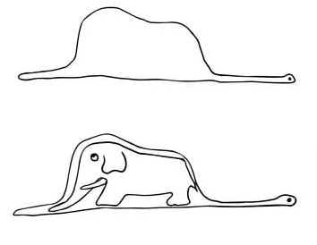]
.note[Image from "Il piccolo principe"]
]
.c60.vcentered[
**Overfits** = "fits too much", hence making apparent also those **artifacts** that are **not part** of the object being wrapped
- the model: the snake skin
- the real system: the snake body
- the (exaggerated) artifact: the elephant...
]
]

---

## Underfitting

When instead we do not allow for enough complexity to model a complex real system, by setting a flexibility parameter to **low flexibility**, the learning technique **does not fit neither the data, nor the system**, that is, .key[underfitting] occurs.

--

.cols[
.c40[
.w100p.center[]
]
.c60.vcentered[
**Underfits** = "doesn't fit enough", hence **proper characteristics** of the object being wrapped are **not captured**
- the model: the cardboard box
- the real system: the T-rex
- the uncaptured characteristics: everything of the T-rex...
]
]

---

## Overfitting/underfitting with trees

In $f'\\subtext{learn}$, $n\\subtext{min}$ represents the flexibility:
- the greater $n\\subtext{min}$, the lower the flexibility

Extreme values:
- $n\\subtext{min}=1$ $\\rightarrow$ **maximum flexibility**
  - the tree will always be as large as it has to be to perfectly¹ model the dataset
- $n\\subtext{min}=+\\infty$ $\\rightarrow$ minimum, i.e., **no flexibility**
  - the tree will be the smallest possible

.footnote[
1. Always perfectly? Give a counterexample.
]

---

## Carousel tree with $n\\subtext{min}=+\\infty$

.cols[
.c50[
.w100p.center[]
]
.c50[
.pseudo-code.compact[
function $\\text{learn}(\\seq{(\\vect{x}^{(i)},y^{(i)})}{i}, n\\subtext{min})$ {  
.i[]if .col1[$\\text{should-stop}(\\seq{y^{(i)}}{i}, n\\subtext{min})$] then {  
.i[].i[]$p \\gets y \\mapsto \\freq{y, \\seq{y^{(i)}}{i}}$  
.i[].i[]return $\\text{node-from}(p,\\varnothing,\\varnothing)$  
.i[]} else {  
.i[].i[]...  
.i[]}  
}
]

.vspace[]

.pseudo-code.compact[
function $\\text{should-stop}(\\seq{y^{(i)}}{i}, n\\subtext{min})$ {  
.i[]if .col1[$n \\le n\\subtext{min}$] then {  
.i[].i[] return $\\text{true}$;  
.i[]}  
.i[]...  
.i[]return $\\text{false}$  
}
]

The learned tree is a **dummy classifier** (with probability):
.cols[
.c50[
.diagram.center.tree[
rect(0,0,110,40)
otext(55,20,'$(\\\\c{1}{\\\\text{●}\\\\smaller{\\\\frac{59}{103}}}, \\\\c{2}{\\\\text{●}\\\\smaller{\\\\frac{44}{103}}})$')
]
]
.c50.center[
$t=\\treel{(\\c{1}{\\text{●}\\smaller{\\frac{59}{103}}}, \\c{2}{\\text{●}\\smaller{\\frac{44}{103}}})}$
]
]

]
]
.compact[$t$ does not attempt to model the dependency between $x$ and $y$, because its complexity budget is completely exhausted by the single leaf node]

---

## Bias and variance

As an alternative name for **underfitting**, we say that a learning technique exhibits .key[high bias]:
- because it tends to generate models that incorporate a **bias towards some $y$ values**, regardless of the $x$, i.e., models that fail in capturing the $x$-$y$ dependency
  - as extreme case, the dummy classifier completely disregards the $x$

--

As an alternative name for **overfitting**, we say that a learning technique exhibits .key[high variance]:
- because, if we repeat the learning with **different datasets coming from the same real system**, they give **different models**; this is bad, because they should be the same, since they model the same system

---

## Spotting underfitting/overfitting

In principle:
1. observe the model
2. observe the system
3. compare their complexity:
  - if the model is **too simple** with respect to the system, that's **underfitting**
  - if the model is **too complex** with respect to the system, that's **overfitting**

--

In practice, this is *often* (i.e., almost always) **unfeasible**:
- you don't know the system complexity
- you cannot observe the system internals (or the system itself)
- sometimes, you cannot observe the model internals

---

## Spotting underfitting/overfitting with data

.cols[
.c50.compact[
With **too low flexibility** (here with error):
- the model cannot capture system characteristic that are also in the learning data
  - $\\Rightarrow$ both errors are high
- increasing the flexibility decreases both errors

With **too large flexibility**:
- the model captures also data artifacts (i.e., noise)
  - $\\Rightarrow$ **learning error is low** because noise is modeled and used to assess the model itself
  - $\\Rightarrow$ **test error is large** because the model describes characteristic that are not proper of the real system and hence not visible in data different from the learning data
- increasing the flexibility decreases the lerning error and increases the test error

Here, overfitting *starts* with flexibility $\\ge 0.62$
- not a real parameter...
]
.c50[
.w75p.center[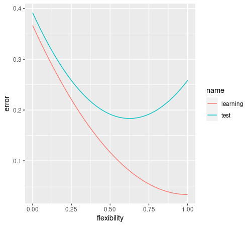]
<!--
x=seq(0,1,by=0.01)
as.data.frame(cbind(flexibility=x,learning=((x-1)*(x-1)+0.1)/3)) %>% mutate(test=learning+0.025+flexibility^2/5) %>% pivot_longer(!flexibility,values_to="error") %>% ggplot(aes(x=flexibility,y=error,color=name))+geom_line()
-->
.compact[
Practical procedure:
1. consider **several values of the flexibility** parameter
2. for each value of the flexibility parameter
  1. learn a model
  2. measure¹ its effectiveness² on the **learning** data
  3. measure¹ its effectiveness² on the **test** data
]
]
]

.footnote[
1. with 80/20 static split, CV, ...
2. with error, accuracy, AUC, ...
]

---

## How to choose the proper flexibility?

More in general, **how to choose** a good value for one or more **parameters of the learning technique**?

**Assumption**: "good" means "the one that corresponds to the greatest effectiveness".

From another point of view, we have $k$ slightly different (i.e., they differ only in the value of the parameter) learning techniques and we have to choose one:
- that is, we do a **comparison** among learning techniques

--

In practice:
- choose the $k$ candidate **parameter values** (e.g., $n\\subtext{min}=1,2,3,\\dots,10$)
- choose a suitable **effectiveness index** (e.g., AUC, accuracy, ...)
- choose a suitable **learning/test division** method (e.g., 10-fold CV)
- for each of the $k$ values, **measure** the index, **take** the one corresponding to the **best** value

--

This procedure applies to parameters in general, not just to those affecting flexibility;
- and possibly to indexes related to efficiency, rather than just effectiveness

---

## Hyperparameter tuning

.cols[
.c60[
Given a learning technique with $h$ parameters $p\_1,\\dots,p\_h$, each $p\_j$ defined in its domain $P\_j$, .key[hyperparameter tuning] is the task of finding the tuple $p^\\star\_1,\\dots,p^\\star\_h$ that corresponds to the **best effectiveness** of the learning technique.
]
.c40[
.diagram.center[
link([0,75,150,75],'a')
rect(150,50,100,50)
link([250,75,350,75],'a')
otext(200,75,"$f'\\\\subtext{learn}$")
otext(75,60,'$\\\\seq{(x^{(i)},y^{(i)})}{i}$')
otext(300,60,'$m$')
link([200,20,200,50],'a')
otext(200,5,'$p\\_1,\\\\dots,p\\_h$')
]
]
]

--

$p\_1,\\dots,p\_h$ are called **hyperparameters**, rather than just parameter, because in some communities and for some learning technique, the model is defined by one or more **parameters** (often numerical);
- does not fit well the case of trees

It's called **tuning** because we slightly change the hyperparameter values until we are happy with the results.

--

Hyperparameter tuning it's a form of **optimization**, since we are searching the space $P\_1 \\times \\dots \\times P\_h$ for the tuple giving the best, i.e., $\\approx$ optimal, effectiveness:
- since it automatizes part of the design of an ML system, hyperparameter tuning may be considered a simple form of AutoML

---

## Grid search

A simple form of hyperparameter tuning:
1. for each $j$-th parameter, choose a *small* set of $P'\_j \\subseteq P\_j$ values
2. choose a suitable **effectiveness index**
3. choose a suitable **learning/test division** method
4. consider all the tuples resulting from the cartesian product $P'\_1 \\times \\dots \\times P'\_h$ (i.e., the **grid**)
5. take the best hyperparameters $p^\\star\_1,\\dots,p^\\star\_h$ such that: $$(p^\\star\_1,\\dots,p^\\star\_h)=\\argmax\_{(p\_1,\\dots,p\_h) \\in P'\_1 \\times \\dots \\times P'\_h} \\c{1}{f\\subtext{learn-effect}}(\\c{2}{f'\\subtext{learn}(\\cdot,p\_1,\\dots,p\_h),f'\\subtext{predict}},D)$$

Remarks:
- .col1[$f\\subtext{learn-effect}$] is the chosen .col1[assessment method] measuring the chosen (step 2) effectiveness index with the chosen (step 3) learning/test division: it takes a learning technique **and a dataset** $D$
  - .col2[$f'\\subtext{learn}(\\cdot,p^\\star\_1,\\dots,p^\\star\_h),f'\\subtext{predict}$] is the learning technique; $f'\\subtext{learn}(\\c{3}{\\cdot},\\c{4}{p\_1,\\dots,p\_h})$ is the learning function with fixed hyperparameters .col4[$p\_1,\\dots,p\_h$] and variable .col3[dataset $\\cdot$]
- to be feasible, $P'\_1 \\times \\dots \\times P'\_h$ must be **small**!

---

## Grid search with the trees

Consider the $f'\\subtext{learn}$ for trees and these two hyperparameters:
- $n\\subtext{min} = p\_1 \\in \\mathbb{N} = P\_1$
- $p\\subtext{impurity} = p\_2 \\in \\{\\text{error}, \\text{Gini}, \\text{cross-entropy}\\}$

Let's do hyperparameter tuning with grid search (assuming $|D|=n=1000$):

--

.cols[
.c50.compact[
1. $P'\_1=\\{1,2,5,10,25\\}$¹ and $P'\_2=P\_2$
2. AUC (with midpoints)
3. 10-fold CV
4. grid size of $5 \\times 3 = 15$
5. ...
]
.c50.compact[
1. for each $j$-th parameter, choose a *small* set of $P'\_j \\subseteq P\_j$ values
2. choose a suitable effectiveness index
3. choose a suitable learning/test division method
4. consider all the tuples resulting from the cartesian product $P'\_1 \\times \\dots \\times P'\_h$ (i.e., the **grid**)
5. take the best hyperparameters $p^\\star\_1,\\dots,p^\\star\_h$
]
]

.question[Questions]
- how many times is $f'\\subtext{learn}$ invoked? .note[without considering recurrent invokations]
- how many times is $f''\\subtext{predict}$ invoked?


.footnote[
1. must be chosen considering the size $n$ of the dataset
]

---

## Hyperparameter-free learning

Can't we just **always do grid search** for doing hyperparameter tuning?

**Pros**:
- no need to manually choose the values of the parameters
- hopefully chosen parameters are better than "default" values (if any) $\\rightarrow$ **better effectiveness**

**Cons**:
- computationally expensive ($\\propto$ grid size) $\\rightarrow$ **worse efficiency**
- depends on a dataset, must be checked for **generalization** ability
- suitable "ranges" of values for each hyperparameter have still to be set manually
  - but default ranges are often ok

--

If you do it, you can **transform any learning tech. w/ params in a learning tech. w/o params**:

.cols[
.c30[
.diagram.center[
link([0,75,150,75],'a')
rect(150,50,100,50)
link([250,75,350,75],'a')
otext(200,75,"$f'\\\\subtext{learn}$")
otext(75,55,'$\\\\seq{(x^{(i)},y^{(i)})}{i}$')
otext(300,60,'$m$')
link([200,20,200,50],'a')
otext(200,5,'$p\\_1,\\\\dots,p\\_h$')
]
]
.c70[
.diagram.center[
link([0,75,150,75],'a')
otext(75,55,'$\\\\seq{(x^{(i)},y^{(i)})}{i}$')
rect(150,0,375,150)
link([170,50,230,50,230,60,250,60],'a')
otext(200,30,"$\\\\seq{P'\\_j}{j}$")
link([150,75,250,75],'a')
link([170,125,230,125,230,90,250,90],'a')
otext(200,105,"$f'\\\\subtext{learn}$")
rect(250,50,100,50)
otext(300,75,"grid search",'small')
link([350,75,440,75,440,90],'a')
otext(395,55,"$\\\\seq{p^\\\\star\\_j}{j}$")
rect(400,90,80,50)
otext(440,115,"$f'\\\\subtext{learn}$")
link([160,75,160,140,370,140,370,115,400,115],'a')
link([480,115,500,115,500,75,575,75],'a')
otext(550,60,'$m$')
]
]
]

---

## Hyperparameter-free learning

.diagram.center[
link([0,75,150,75],'a')
otext(75,55,'$\\\\seq{(x^{(i)},y^{(i)})}{i}$')
rect(150,0,375,150)
link([170,50,230,50,230,60,250,60],'a')
otext(200,30,"$\\\\seq{P'\\_j}{j}$")
link([150,75,250,75],'a')
link([170,125,230,125,230,90,250,90],'a')
otext(200,105,"$f'\\\\subtext{learn}$")
rect(250,50,100,50)
otext(300,75,"grid search",'small')
link([350,75,440,75,440,90],'a')
otext(395,55,"$\\\\seq{p^\\\\star\\_j}{j}$")
rect(400,90,80,50)
otext(440,115,"$f'\\\\subtext{learn}$")
link([160,75,160,140,370,140,370,115,400,115],'a')
link([480,115,500,115,500,75,575,75],'a')
otext(550,60,'$m$')
]

.cols[
.c50[
.pseudo-code.compact[
function $\\text{learn-free}(D)$ {  
.i[]$f'\\subtext{learn}, f'\\subtext{predict} \\gets \\dots$  
.i[].col1[$P'\\_1,\\dots,P'\\_h \\gets \\dots$]  
.i[].col3[$f\\subtext{learn-effect} \\gets \\dots$]  
.i[]$p^\\star\_1,\\dots,p^\\star\_h \\gets \\varnothing$  
.i[]$v\_{\\text{max},\\text{effect}} \\gets -\\infty$  
.i[].col2[foreach $p\\_1,\\dots,p\\_h \\in P'\\_1\\times \\dots\\times P'\\_h$ {]  
.i[].i[].col2[$v\\subtext{effect} \\gets f\\subtext{learn-effect}(f'\\subtext{learn}(\\cdot,p\\_1,\\dots,p\\_h),f'\\subtext{predict},D)$]  
.i[].i[].col2[if $v\\subtext{effect} \\ge v\\_{\\text{max},\\text{effect}}$ then {]  
.i[].i[].i[].col2[$v\\_{\\text{max},\\text{effect}} \\gets v\\subtext{effect}$]  
.i[].i[].i[].col2[$p^\\star\\_1,\\dots,p^\\star\\_h \\gets p\\_1,\\dots,p\\_h$]  
.i[].i[].col2[}]  
.i[].col2[}]  
.i[]return $f'\\subtext{learn}(D,p^\\star\_1,\\dots,p^\\star\_h)$  
}
]
]
.c50[
.compact[
1. .col1[for each $j$-th parameter, choose a *small* set of $P'\_j \\subseteq P\_j$ values]
2. .col3[choose a suitable effectiveness index]
3. .col3[choose a suitable learning/test division method]
4. .col2[consider all the tuples resulting from the cartesian product $P'\_1 \\times \\dots \\times P'\_h$]
5. .col2[take the best hyperparameters $p^\\star\_1,\\dots,p^\\star\_h$]
  - i.e., $\\argmax$
5. learn a model with on full dataset and the best found parameters
]
]
]

---

## Hyperparameter-free tree learning exercise

Consider the $f'\\subtext{learn}$ for trees and these two hyperparameters:
- $n\\subtext{min} = p\_1 \\in \\mathbb{N} = P\_1$
- $p\\subtext{impurity} = p\_2 \\in \\{\\text{error}, \\text{Gini}, \\text{cross-entropy}\\}$

Consider the improved, hyperparameter-free version of $f'\\subtext{learn}$ called $f'\\subtext{learn-free}$:
- with accuracy and 10-fold CV
- with $|P'\_1|=10$ and $|P'\_2|=|P\_2|=3$

Suppose you want to compare it against the plain version (with $n\\subtext{min}=10$ and $p\\subtext{impurity}=\\text{Gini}$):
- with AUC (midpoints) and 10-fold CV
- using a dataset $|D|=n=1000$.

.question[Questions]
- what phases of the ML design process are we doing?
- how many times is $f'\\subtext{learn-free}$ invoked?
- how many times is $f'\\subtext{learn}$ invoked? .note[without considering recurrent invokations]
- how many times is $f''\\subtext{predict}$ invoked? .note[assuming $f''\\subtext{predict}$ is invoked internally by $f'\\subtext{predict}$]
- how many times is $f'\\subtext{predict}$ invoked?

---

class: middle, center

### Categorical independent variables and regression

---

## Applicability of $f'\\subtext{learn}$

Up to now, the $f'\\subtext{learn}$ for trees (i.e., recursive binary splitting) was defined¹ as:
$$f'\\subtext{learn}: \\mathcal{P}^*(X\_1 \\times \\dots \\times X\_p \\times Y) \\to T\_{(\\{1,\\dots,p\\}\\times \\mathbb{R}) \\cup Y}$$
with:
- each $X\_j \\subseteq \\mathbb{R}$, i.e., with **each .col1[independent] variable being .col1[numerical]**
- $Y$ finite and without ordering, i.e., with the **.col2[dependent] variable being .col2[categorical]**

These **constraints** were needed because:
- the branch nodes contain conditions in the form .col1[$x\_j \\le \\tau$], hence an order relation has to be defined in $X\_j$; $\\mathbb{R}$ meets this requirement
- the leaf nodes contain a .col2[class label $y$]

Can we remove these constraints?

.footnote[
1. here we have the version without probability; with the one with, the codomain of $f'\\subtext{learn}$ is $T\_{(\\{1,\\dots,p\\}\\times \\mathbb{R}) \\cup P\_Y}$
]

---

## Trees on categorical independent variables

.cols[
.c50[
**With numerical variables** ($x\_j \\in \\mathbb{R}$):

With $\\text{find-best-branch()}$, we find (the index $j$ of) a variable $x\_j$ and a .col1[**threshold value** $\\tau$] that well separates the data, i.e., we split the data in:
- observations such that .col1[$x\_j \\le \\tau$]
- observations such that .col1[$x\_j > \\tau$]

No other cases exist: it's a binary split.

**Example**

$x\\subtext{age} \\in [0,120]$

.diagram.center.tree[
rect(0,0,160,30)
otext(80,15,'$x\\\\subtext{age}$ vs. $10$', 'small')
link([80,30,15,80])
otext(15,60,'$\\\\le$','small')
rect(0,80,30,30)
otext(15,95,'●','col1')
link([80,30,160,80])
otext(160,60,'$>$','small')
rect(80,80,160,30)
otext(160,95,'$x\\_{\\\\dots}$ vs. $\\\\dots$', 'small')
link([160,110,140,130])
link([160,110,180,130])
]

]
.c50[
**With categorical variables** ($x\_j \\in X\_j$):

With $\\text{find-best-branch()}$, we find (the index $j$ of) a variable $x\_j$ and a .col1[**set of values** $X'\_j \\subset X\_j$] that well separates the data, i.e., we split the data in:
- observations such that .col1[$x\_j \\in X'\_j$]
- observations such that .col1[$x\_j \\not\\in X'\_j$]

No other cases exist: it's a binary split.

**Example**

$x\\subtext{city} \\in \\{\\text{Ts},\\text{Ud},\\text{Ve},\\text{Pn},\\text{Go}\\}$

.diagram.center.tree[
rect(0,0,160,30)
otext(80,15,'$x\\\\subtext{city}$ vs. $\\\\{\\\\text{Ts},\\\\text{Ve}\\\\}$', 'small')
link([80,30,15,80])
otext(15,60,'$\\\\in$','small')
rect(0,80,30,30)
otext(15,95,'●','col1')
link([80,30,160,80])
otext(160,60,'$\\\\not\\\\in$','small')
rect(80,80,160,30)
otext(160,95,'$x\\_{\\\\dots}$ vs. $\\\\dots$', 'small')
link([160,110,140,130])
link([160,110,180,130])
]

]
]

---

## Efficiency with categorical variables

For a given **numerical variable** $x\_j \\in \\mathbb{R}$, we choose $\\tau^\\star$ such that:
$$\\tau^\\star = \\argmin\_{\\c{1}{\\tau \\in \\mathbb{R}}} \\left(f\\subtext{impurity}(\\seq{y^{(i)}}{i}\\big\\rvert\_{x^{(i)}\_j \\le \\tau})+f\\subtext{impurity}(\\seq{y^{(i)}}{i}\\big\\rvert\_{x^{(i)}\_j > \\tau})\\right)$$
In practice, we .col1[search the set of midpoints] rather than the entire $\\mathbb{R}$: there are $n-1$ midpoints in a dataset with $n$ elements.

.note[
Even better, we can consider only the midpoints between consecutive values $x\_j^{(i\_1)},x\_j^{(i\_2)}$ for which the labels are different, i.e., $y\_j^{(i\_1)} \\ne y\_j^{(i\_2)}$
]

For a given **categorical variable** $x\_j \\in X\_j$, we choose $X^\\star\_j \\subset X\_j$ such that:
$$X^\\star\_j = \\argmin\_{\\c{1}{X'\_j \\in \\mathcal{P}(X\_j)}} \\left(f\\subtext{impurity}(\\seq{y^{(i)}}{i}\\big\\rvert\_{x^{(i)}\_j \\in X'\_j})+f\\subtext{impurity}(\\seq{y^{(i)}}{i}\\big\\rvert\_{x^{(i)}\_j \\not\\in X'\_j})\\right)$$
We .col1[search the set $\\mathcal{P}(X\_j)$] of subsets (i.e., the powerset) of $X\_j$, which has $2^{|X\_j|}$ values.

---

## Trees with both kinds of variables

Assume a problem with $X = \\c{1}{X\_1 \\times \\dots \\times X\_{p\\subtext{num}}} \\times \\c{2}{X\_{p\\subtext{num}+1} \\times \\dots \\times X\_{p\\subtext{num}+p\\subtext{cat}}}$, i.e.:
- $p\\subtext{num}$ .col1[numerical variables]
- $p\\subtext{cat}$ .col2[categorical variables]

The labels of the tree nodes can be:
- class labels $y \\in \\c{3}{Y}$ or discrete probability distribution $p \\in \\c{3}{P\_y}$ (terminal nodes)
- branch conditions $\\c{1}{\\{1,\\dots,p\\subtext{num}\\} \\times \\mathbb{R}}$ for numerical variables (non-terminal nodes)
- branch conditions $\\c{2}{\\bigcup_{j=p\\subtext{num}+1}^{j=p\\subtext{num}+p\\subtext{cat}} \\{j\\} \\times \\mathcal{P}(X\_j)}$ for categorical variables (non-terminal nodes)
  - i.e., each variable with its corresponding powerset of possible values

So the model is a $t \\in$:
- $T\_{\\c{1}{\\{1,\\dots,p\\subtext{num}\\} \\times \\mathbb{R}} \\; \\cup \\; \\c{2}{\\bigcup_{j=p\\subtext{num}+1}^{j=p\\subtext{num}+p\\subtext{cat}} \\{j\\} \\times \\mathcal{P}(X\_j)} \\; \\cup \\; \\c{3}{Y}}$, without probability
- or $T\_{\\c{1}{\\{1,\\dots,p\\subtext{num}\\} \\times \\mathbb{R}} \\; \\cup \\; \\c{2}{\\bigcup_{j=p\\subtext{num}+1}^{j=p\\subtext{num}+p\\subtext{cat}} \\{j\\} \\times \\mathcal{P}(X\_j)} \\; \\cup \\; \\c{3}{P\_Y}}$, with probability

---

## Regression trees

Recursive binary splitting may be used for regression: the learned trees are called .key[regression trees].

**Required changes**:
- in $f'\\subtext{learn}$, when $\\text{should-stop}()$ is met, "most frequent class label" does not make sense anymore
  - because we have numbers, not classes
- in $\\text{find-best-branch}()$, minimizing the $\\text{error}()$ does not make sense anymore (same for $\\text{gini}()$ and $\\text{cross-entropy}()$)
  - because these indexes are for categorical values, not numbers
- in $\\text{should-stop}()$, checking if $\\text{error}()=0$ does not make sense anymore
  - because (classification) error is for categorical values, not numbers

---

## Terminal node labels

In $f'\\subtext{learn}$, when $\\text{should-stop}()$ is met, "most frequent class label" does not make sense anymore.

**Solution**: use the mean $\\overline{y}$.

.cols[
.c50[
**Classification**

The terminal node label is the **most frequent class**:
.col1[$$y^\\star=\\argmax\_{y \\in Y} \\freq{y,\\seq{y^{(i)}}{i}}$$]

If you have to choose just one $y$, $y^\\star$ is the one that minimizes the **classification error**.

]
.c50[
**Regression**

The terminal node label is the **mean $y$ value**:
.col1[$$y^\\star=\\frac{1}{n} \\sum\_i y^{(i)}=\\overline{y}$$]

If you have to choose just one $y$, $y^\\star$ is the one that minimizes the **MSE**.
]
]

--

Indeed a *dummy regressor* predicting always the mean value $\\overline{y}$ should be considered a baseline for regression, like the dummy classifier is a baseline for classification:
- if you want to do a prediction without using the $x$, then $\\overline{y}$ is the best you can do (on the learning dataset)

---

## Finding the best branch

In $\\text{find-best-branch}()$, minimizing the $\\text{error}()$ does not make sense anymore (same for $\\text{gini}()$ and $\\text{cross-entropy}()$).

**Solution**: use the **residual sum of squares (RSS)**.

.cols[
.c50[
**Classification**

The branch is chosen for which **the sum of the impurity** on the two sides is the lowest:
$$\\c{1}{\\begin{align\*}
  (j^\\star, \\tau^\\star) \\gets \\argmin\_{j,\\tau} ( &\\text{error}(\\seq{y^{(i)}}{i}\\big\\rvert\_{x^{(i)}\_j \\le \\tau})+\\\\
  & \\text{error}(\\seq{y^{(i)}}{i}\\big\\rvert\_{x^{(i)}\_j > \\tau}))\\end{align\*}}$$
.note[similarly, for categorical variables]

]
.c50[
**Regression**

The branch is chosen for which **the sum of the RSS** on the two sides is the lowest:
$$\\c{1}{\\begin{align\*}
  (j^\\star, \\tau^\\star) \\gets \\argmin\_{j,\\tau} ( &\\text{RSS}(\\seq{y^{(i)}}{i}\\big\\rvert\_{x^{(i)}\_j \\le \\tau})+\\\\
  & \\text{RSS}(\\seq{y^{(i)}}{i}\\big\\rvert\_{x^{(i)}\_j > \\tau}))\\end{align\*}}$$
where:
$$\\text{RSS}(\\seq{y^{(i)}}{i}) = \\sum\_i \\left(y^{(i)}-\\overline{y}\\right)^2$$

.note[similarly, for categorical variables; $\\text{RSS}(\\cdot) = n \\text{MSE}(\\cdot)$]
]
]

---

## Stopping criterion

In $\\text{should-stop}()$, checking if $\\text{error}()=0$ does not make sense anymore.

**Solution**: just use RSS.

.cols[
.c50[
**Classification**

Stop if $n\\le n\\subtext{min}$ or $\\text{error}()=0$.

.pseudo-code.compact[
function $\\text{should-stop}(\\seq{y^{(i)}}{i}, n\\subtext{min})$ {  
.i[]if $n \\le n\\subtext{min}$ then {  
.i[].i[] return $\\text{true}$;  
.i[]}  
.i[]if .col1[$\\text{error}(\\seq{y^{(i)}}{i})=0$] then {  
.i[].i[] return $\\text{true}$;  
.i[]}  
.i[]return $\\text{false}$  
}
]

]
.c50[
**Regression**

Stop if $n\\le n\\subtext{min}$ or $\\text{RSS}()=0$.

.pseudo-code.compact[
function $\\text{should-stop}(\\seq{y^{(i)}}{i}, n\\subtext{min})$ {  
.i[]if $n \\le n\\subtext{min}$ then {  
.i[].i[] return $\\text{true}$;  
.i[]}  
.i[]if .col1[$\\text{RSS}(\\seq{y^{(i)}}{i})=0$] then {  
.i[].i[] return $\\text{true}$;  
.i[]}  
.i[]return $\\text{false}$  
}
]

In practice, the condition $\\text{RSS}()=0$ holds much more unfrequently than the condition $\\text{error}()=0$.
]
]

---

## Visualizing the model

With few variables, $p\\le 2$ for classification, $p=1$ for regression, the model can be visualized.

.cols[
.c50[
**Classification**

.w75p.center[]

The colored regions are **the model**.
The border(s) between regions with different colors (i.e., different decisions) is the  .key[decision boundary].
]
.c50[
**Regression**

.w75p.center[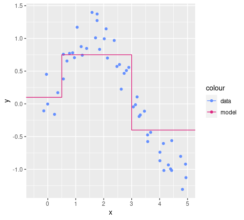]

<!--
x=seq(0,5,0.1)
x=x+rnorm(length(x))*0.1
d=as.data.frame(rbind(cbind(x=x,y=sin(x)+rnorm(length(x))*0.2,name="data"),cbind(x=c(-1,0.5,3,6),y=c(0.1,0.75,-0.4,-0.4),name="model")))
d$x=as.numeric(d$x);d$y=as.numeric(d$y);d$name=factor(d$name)
d %>% pivot_wider(values_from="y") %>% ggplot(aes(x,y=data,color="data"))+geom_point()+geom_step(aes(x,y=model,color="model"))+scale_color_manual(values=c("#648FFF", "#DC267F", "#FE6100", "#785EF0", "#FFB000"))+ylab("y")+coord_cartesian(xlim=c(-0.5,5))
-->

The line is **the model**.

.question[Question]: can you draw the tree for this model?
]
]

---

## Overfitting with regression trees

.cols[
.c70[
.w100p.center[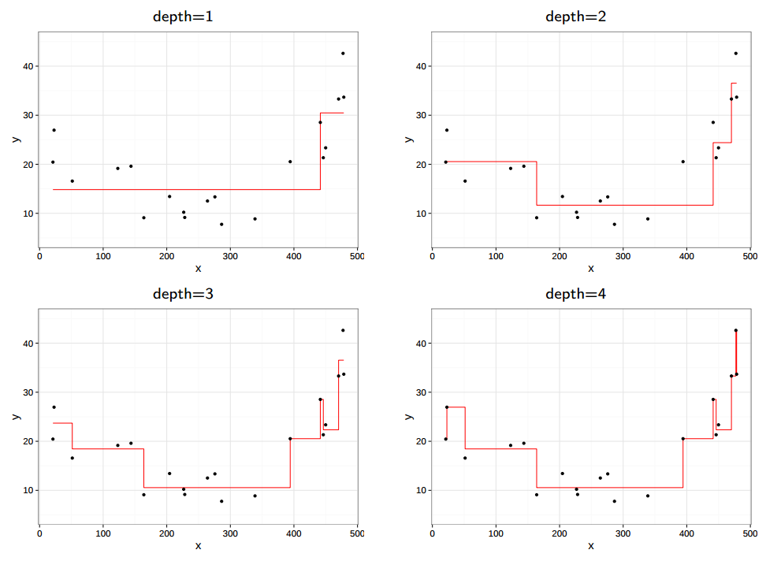]

.note[image from Fabio Daolio]
]
.c30[
.question[Questions]
- what's the problem size ($n$ and $p$)?
- what's the model complexity?
- how is the real system made?

]
]

---

class: middle, center

### Tree learning: brief recap

---

## Summary

**Applicability** 👍👍
- 👍 $Y$: both **regression and classification** (binary and multiclass)
- 👍 $X$: multivariate $X$ with both **numerical and categorical** variables
- 👍 models give probability¹
- 🫳³ learning technique has one single parameter

**Efficiency** 👍
- 👍 in practice, pretty **fast** both in learning and prediction phase

**Explainability/interpretability** 👍👍👍
- 👍 the models can be *easily*² **visualized** (**global** explainability)
- 👍 the decisions can be analyzed (**local** explainability)
- 👍 the learning technique is itself comprehensible
  - you should be able to implement by yourself

.footnote[
1. for classification; if $n\\subtext{min}=1$, it's *always* $100\%$
2. if they are small enough...
3. 1 is better than $>1$, but worse than parameter-free, so 🫳
]

--

**So, why are we not using trees for/in every ML system?**

---

## Decision tree effectiveness

.cols[
.c50[
.w100p.center[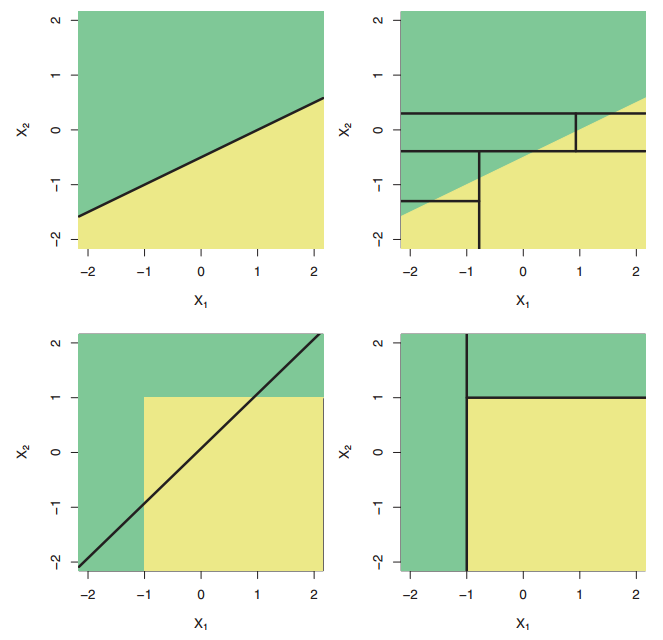]
.note[image from .ref[James, Gareth, et al.; An introduction to statistical learning. Vol. 112. New York: springer, 2013]]
]
.c50[
The effectiveness depends on the problem and may be limited by the fact that branch nodes consider **one variable at once**.

The decision boundary of the model is hence constrained to be locally parallel to one of the axes:
- may be a limitation or not, depending on the problem
- makes $\\text{find-best-branch()}$ computationally feasible
  - because the search space is small
  - because computing the error of the dummy classifier is fast (**greedy**)

.note[
There exist **oblique decision trees**, which should overcome this limitation.
]
]
]

---

class: middle, center
name: towards-1st-lab

## Towards the first lab

### Software for ML

---

## Implementing ML systems

.cols[
.c50[
1. Decide: should I use ML?
2. Decide: supervised vs. unsupervised
3. Define the problem (problem statement):
  - define $X$ and $Y$
  - define a way for assessing solutions
      - before designing!
      - applicable to any compatible ML solution
4. Design the ML system
  - choose a learning technique
  - choose/design pre- and post-processing steps
5. .col1[Implement the ML system]
  - .col1[learning/prediction phases]
  - .col1[obtain the data]
6. .col1[Assess the ML system]
]
.c50[
Actual execution of:
- pre-processing
- learning
- prediction
- assessment

is not made *by hand*, but by a **computer** that executes some software.
]
]

---

## Software for ML

.cols[
.c50[
Nowadays, there are many options.

A few:
- **libraries** for general purpose languages:
  - Java: e.g., [SMILE](https://haifengl.github.io/)
  - Python: e.g., [scikit-learn](https://scikit-learn.org/stable/)
  - ...
- specialized software **environments**:
  - [Octave](https://en.wikipedia.org/wiki/GNU_Octave)
  - [R](https:
//en.wikipedia.org/wiki/R_%28programming_language%29)
- a software written from scratch

And [many others](https://en.wikipedia.org/wiki/Category:Data_mining_and_machine_learning_software).
]
.c50[
**How to choose an ML software?**

Possible criteria:
- platform constraints
- degree of data pre/post-processing
- production/prototype
- documentation availability
- community size
- your previous familiarity/knowledge/skills
]
]

---

## Interface

In general, the ML software provides an interface that models the key concepts of **learning** ($f'\\subtext{learn}$) and **prediction** ($f'\\subtext{predict}$) phases and the one of the **model**.

Example (**Java+SMILE**):
```java
DataFrame dataFrame = ...
RandomForest classifier = RandomForest.fit(Formula.lhs("label"), dataFrame);
Tuple observation = ...;
int predictedLabel = classifier.predict(observation);
```

Example (**R**):
```r
d = ...
classifier = randomForest(label~., d)
newD = ...
newLabels = predict(classifier, newD)
```

---

class: middle, center
name: brief-r-intro

### A (very) brief Introduction to R

---

## What is R?

.cols[
.c50[
**R** is:
- a programming language
- a software environments with a text-based interactive UI (a *console*)

[RStudio](https://www.rstudio.com/) is:
- an IDE¹ built around R
- also for making **notebooks**, like in Python

.note[
1. integrated development environment
]
]
.c50[
Some R resources:
- language documentation
  - "[manual](https://cran.r-project.org/doc/manuals/r-release/R-lang.html)"
- packages documentation
  - for all: Comprehensive R Archive Network (CRAN)
      - e.g., package manual for [RandomForest](https://cran.r-project.org/web/packages/randomForest/index.html)
  - for "biggest" packages: their own site
      - [Tidyverse](https://www.tidyverse.org/)
- help from online communities
  - [CrossValidated](http://stats.stackexchange.com/) (where `r` is the most popular tag)
  - [StackOverflow](http://stackoverflow.com/)
]
]

---

## RStudio appearance

.w75p.center[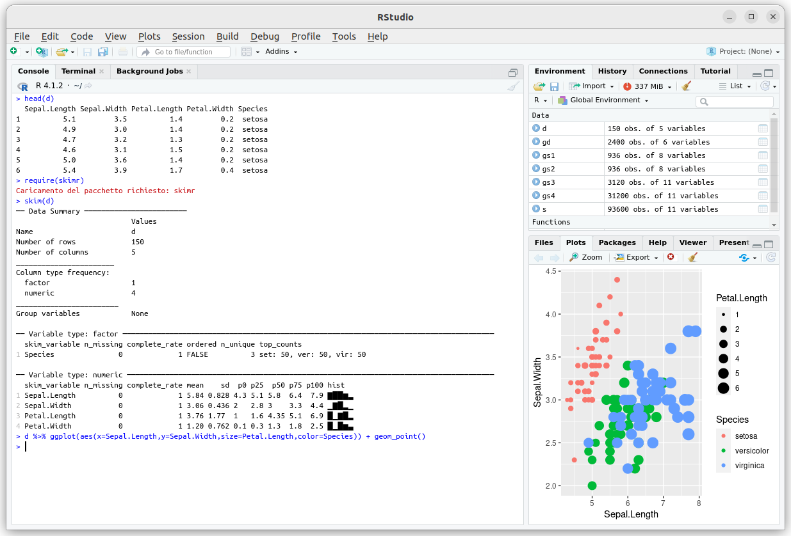]

---

## RStudio appearance with a notebook

.w75p.center[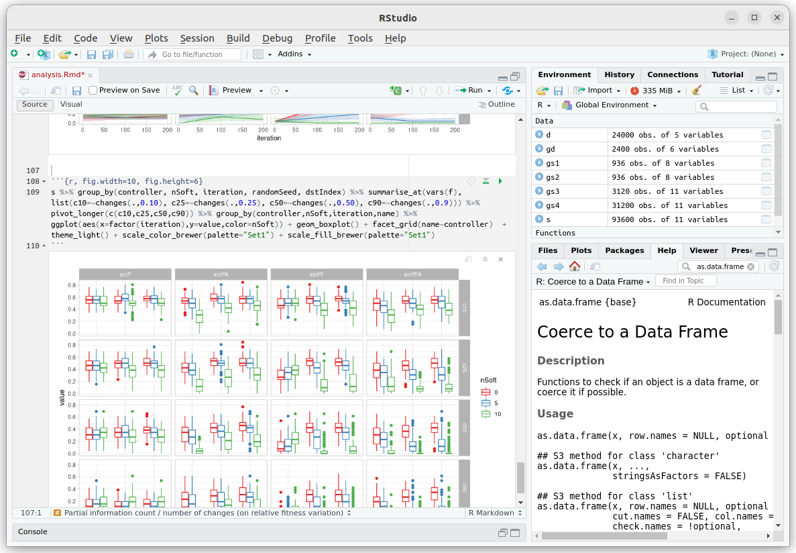]

---

## An R notebook on Google Colab 

.w75p.center[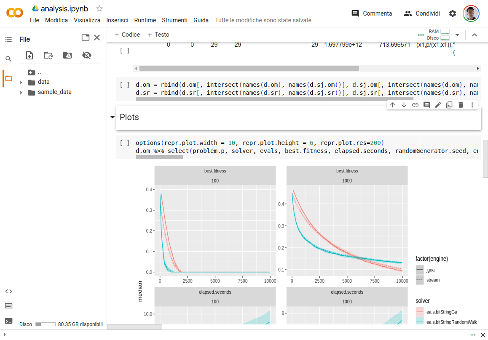]

---

## Data types

There are some built-in data types.

.cols[
.c50[
Basic:
- numeric
- character (i.e., strings)
- logical (i.e., Booleans)
- factor (i.e., categorical)
- function
- formula
]
.c50[
Composed:
- vector
- matrix
- data frame
- list
]
]

R is **not strongly typed**: there are (some) implicit conversions.

--

A peculiar data type is **formula**:
- it describes a dependency
- literals specify dependent and independent variables, e.g.:
  - `decision~age+height`
  - `Species~.` .note[`.` means "every other variable"]

---

## Assigning values

.cols[
.c60[
```r
> a=3
> a
[1] 3
> v=c(1,2,3)
> v
[1] 1 2 3
> d=as.data.frame(cbind(age=c(20,21,21))))
> d$gender=factor(c("m","m","f"))
> d
  age gender
1  20      2
2  21      2
3  21      1
> levels(d$gender)
[1] "f" "m"
> dep=salary~degree.level+age
> dep
salary ~ degree.level + age
> f = function(x) {x+3}
> f(2)
[1] 5
```
]
.c40[
- `a` is a numeric
- `v` is a vector of numeric
- `d` is a data frame
- `dep` is a formula
- `f` is a function
- `cbind()` stays for column bind (there's an `rbind()` too)
- `factor()` makes a vector of character a vector of factors
- `levels()` gives the possible values of a factor, i.e.:
  - `d$gender` is $\\seq{x\_2^{(i)}}{i}$
  - `levels(d$gender)` is $X\_2$
]
]

---

## Reading/writing data

There are many packages for reading weird file types.

Some built-in functions for reading/writing CSV files (and variants):
- `read.csv()`, `read.csv2()`, `read.table()`
- `write.csv()`, `write.csv2()`, `write.table()`

Some built-in functions for reading/writing data in an R-native format:
- `save()`
- `load()`

---

## Basic exploration of data

.cols[
.c50[
With `summary()` (built-in)
```r
> d=iris
> summary(d)
  Sepal.Length    Sepal.Width     Petal.Length  
 Min.   :4.300   Min.   :2.000   Min.   :1.000  
 1st Qu.:5.100   1st Qu.:2.800   1st Qu.:1.600  
 Median :5.800   Median :3.000   Median :4.350  
 Mean   :5.843   Mean   :3.057   Mean   :3.758  
 3rd Qu.:6.400   3rd Qu.:3.300   3rd Qu.:5.100  
 Max.   :7.900   Max.   :4.400   Max.   :6.900  
  Petal.Width          Species  
 Min.   :0.100   setosa    :50  
 1st Qu.:0.300   versicolor:50  
 Median :1.300   virginica :50  
 Mean   :1.199                  
 3rd Qu.:1.800                  
 Max.   :2.500      
```
]
.c50[
With `skim()` from `skimr` package
.compact[
```r
> skim(d)
── Data Summary ────────────────────────
                           Values
Name                       d     
Number of rows             150   
Number of columns          5     
_______________________          
Column type frequency:           
  factor                   1     
  numeric                  4     
________________________         
Group variables            None  

── Variable type: factor ────────────────────────────
  skim_variable n_missing complete_rate ordered
1 Species               0             1 FALSE  
  n_unique top_counts               
1        3 set: 50, ver: 50, vir: 50

── Variable type: numeric ───────────────────────────
  skim_variable n_missing complete_rate mean    sd
1 Sepal.Length          0             1 5.84 0.828
2 Sepal.Width           0             1 3.06 0.436
3 Petal.Length          0             1 3.76 1.77
4 Petal.Width           0             1 1.20 0.762
   p0 p25  p50 p75 p100 hist
1 4.3 5.1 5.8  6.4  7.9 ▆▇▇▅▂
2 2   2.8 3    3.3  4.4 ▁▆▇▂▁
3 1   1.6 4.35 5.1  6.9 ▇▁▆▇▂
4 0.1 0.3 1.3  1.8  2.5 ▇▁▇▅▃
```
]
]
]

Sizes with `length()`, `dim()`, `nrow()`, `ncol()`; names with `names()` (same of `colnames()`), `rownames()`
- names change with `names(d)[2:3] =  c("cows", "dogs")`

.note[
Here `d` is a multivariate dataset, but which variable is $y$ is not specified.
]

---

## Selecting portions of data

.cols[
.c50[
On vectors:
```r
> v=seq(1,2,by=0.25)
> v
[1] 1.00 1.25 1.50 1.75 2.00
> v[2]
[1] 1.25
> v[2:3]
[1] 1.25 1.50
> v[-2]
[1] 1.00 1.50 1.75 2.00
> v[c(1,2,4)]
[1] 1.00 1.25 1.75
> v[c(T,F,F,T)]
[1] 1.00 1.75 2.00
> v[v<1.6]
[1] 1.00 1.25 1.50
> v[which(v<1.6)]
[1] 1.00 1.25 1.50
```
]
.c50[
On data frames:
```r
> d
  age gender
1  20      m
2  21      m
3  21      f
> d[1,2]
[1] m
Levels: f m
> d[,2]
[1] m m f
Levels: f m
> d[1,]
  age gender
1  20      m
> d$age
[1] 20 21 21
```

.question[Question]: what *is* `d[,c("age","age")]`?
]
]

---

## Like a pro with `tidyverse`

.cols[
.c60[
```r
> iris %>% group_by(Species) %>%
  summarize_at(vars(Sepal.Length,Sepal.Width),
  list(mean=mean,sd=sd))
  %>% pivot_longer(-Species)
# A tibble: 12 × 3
   Species    name              value
   <fct>      <chr>             <dbl>
 1 setosa     Sepal.Length_mean 5.01
 2 setosa     Sepal.Width_mean  3.43
 3 setosa     Sepal.Length_sd   0.352
 4 setosa     Sepal.Width_sd    0.379
 5 versicolor Sepal.Length_mean 5.94
 6 versicolor Sepal.Width_mean  2.77
 7 versicolor Sepal.Length_sd   0.516
 8 versicolor Sepal.Width_sd    0.314
 9 virginica  Sepal.Length_mean 6.59
10 virginica  Sepal.Width_mean  2.97
11 virginica  Sepal.Length_sd   0.636
12 virginica  Sepal.Width_sd    0.322
```
]
.c40[
Useful for:
- transforming data with `dplyr` ([cheatsheet](https://github.com/rstudio/cheatsheets/blob/main/data-transformation.pdf))
- plotting¹ with `ggplot2` ([cheatsheet](https://github.com/rstudio/cheatsheets/blob/main/data-visualization-2.1.pdf))
- reshaping with `tidyr` ([cheatsheet](https://github.com/rstudio/cheatsheets/blob/main/tidyr.pdf))
- reading data with `readr` ([cheatsheet](https://readr.tidyverse.org/#cheatsheet))

**Very useful**, indeed!

.note[
1. The built-in function for plotting is `plot()`; since it is overloaded for many custom data types, you can always try feeding `plot()` with something and see what happens...
]

]
]

---

class: middle, center

### (Ready for the) first lab!

---

class: labo

## Lab 1: hardest variable in Iris

1. consider the Iris dataset
2. design and implement an ML-based procedure for answering this question:

.center[**what's the hardest variable to be predicted in the dataset?**]

.vspace1[]

**Hints**:
- the Iris dataset is built-in in R: `iris`
- there are (at least) two packages for tree learning with R
  - `tree`
  - `rpart` .note[this might be a bit better]
- most packages for doing supervised learning have two functions for learning and prediction:
  - packageName`()` for learning (e.g., `tree` or `rpart`)
  - `predict()` for prediction
