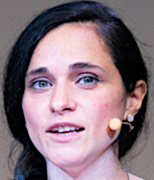

class: middle, center

# (Introduction to) Machine Learning
### 456MI, 470SM

[Eric Medvet](http://medvet.inginf.units.it/)

A.Y. 2025/2026

---

## Lecturer

Eric Medvet
- associate Professor of Computer Engineering at [Department of Engineering and Architecture](https://dia.units.it/), [University of Trieste](https://www.units.it/)
- online at: [medvet.inginf.units.it](http://medvet.inginf.units.it/)

Research interests:
- evolutionary computation
- embodied artificial intelligence
- machine learning applications

Labs:
- [Evolutionary Robotics and Artificial Life lab](https://erallab.inginf.units.it/)
- [Machine Learning lab](https://machinelearning.inginf.units.it/)

---

## Computer Engineering (ING-INF/05) group

.cols.compact[
.c50[
.h5ex.vam[]
[Sylvio Barbon Jr.](https://www.barbon.com.br/)  
<i class="fa-solid fa-chalkboard-user col2"></i> Fondamenti di informatica  
<i class="fa-solid fa-chalkboard-user col2"></i> Progettazione del software e dei sistemi informativi  
<i class="fa-regular fa-lightbulb col2"></i> *meta learning, applied ML, process mining*

.h5ex.vam[]
[Alberto Bartoli](https://bartoli.inginf.units.it/)  
<i class="fa-solid fa-chalkboard-user col2"></i> Reti di calcolatori  
<i class="fa-solid fa-chalkboard-user col2"></i> Computer networks 2 and introduction to cybersecurity  
<i class="fa-regular fa-lightbulb col2"></i> *security, applied ML, evolutionary computation*

.h5ex.vam[]
[Andrea De Lorenzo](https://delorenzo.inginf.units.it/)  
<i class="fa-solid fa-chalkboard-user col2"></i> Basi di dati  
<i class="fa-solid fa-chalkboard-user col2"></i> Programmazione web  
<i class="fa-regular fa-lightbulb col2"></i> *security, applied AI&ML, information retrieval, GP*

.h5ex.vam[]
[Eric Medvet](https://medvet.inginf.units.it/)  
<i class="fa-solid fa-chalkboard-user col2"></i> Programmazione avanzata  
<i class="fa-solid fa-chalkboard-user col2"></i> Introduction to machine learning and evolutionary robotics  
<i class="fa-regular fa-lightbulb col2"></i> *evolutionary computation, embodied AI, applied ML*
]
.c50[

.h5ex.vam[]
[Laura Nenzi](https://lauranenzi.github.io/)  
<i class="fa-solid fa-chalkboard-user col2"></i> Safe and verified AI  
<i class="fa-solid fa-chalkboard-user col2"></i> Information retrieval and data visualization  
<i class="fa-solid fa-chalkboard-user col2"></i> Laboratorio di programmazione I e II  
<i class="fa-regular fa-lightbulb col2"></i> *formal methods, runtime verification*

.h5ex.vam[]
[Alessandro Renda](https://alerenda.github.io/)  
<i class="fa-solid fa-chalkboard-user col2"></i> Fondamenti di informatica  
<i class="fa-solid fa-chalkboard-user col2"></i> Cybersecurity lab  
<i class="fa-regular fa-lightbulb col2"></i> *federated learning, explainable AI, applied ML*

.h5ex.vam[]
[Martino Trevisan](https://trevisan.inginf.units.it/)  
<i class="fa-solid fa-chalkboard-user col2"></i> Reti di calcolatori  
<i class="fa-solid fa-chalkboard-user col2"></i> Sistemi operativi  
<i class="fa-solid fa-chalkboard-user col2"></i> Architetture dei sistemi digitali  
<i class="fa-regular fa-lightbulb col2"></i> *network measurements, data privacy, big data*
]
]

---

## Structure of the course

6 CFUs, 48 hours: .note[for: [IN23](https://corsi.units.it/IN23/descrizione-corso), [IN19](https://corsi.units.it/IN19/descrizione-corso), [SM38](https://corsi.units.it/SM38/descrizione-corso), [SM34](https://corsi.units.it/SM34/descrizione-corso), [SM23](https://corsi.units.it/SM23/descrizione-corso), [SM28](https://corsi.units.it/SM28/descrizione-corso), [SM13](https://corsi.units.it/SM13/descrizione-corso), and [SM64](https://corsi.units.it/SM64/descrizione-corso)]
- what is machine learning?
  - [definitions](#ml-definitions), [recap](#ml-definitions-recap)
- evaluating an ML system
  - [supervised ML](#supervised-ml-assessment), [classification](#classification-assessment), [binary classification](#binary-classification-assessment), [multiclass and regression](#multiclass-regression-assessment), [learning technique](#learning-assessment), [examples](#assessment-examples), [recap](#supervised-ml-assessment-recap)
- supervised learning techniques
  - [tree-based](#tree-based), [bagging](#tree-bagging), [Random Forest](#random-forest), [SVM](#svm), [Naive Bayes](#naive-bayes), [kNN](#knn), [data pre- and post-processing](#improving-applicability), [intro to R](#brief-r-intro)
- clustering
  - [definition and assessment](#clustering-definition-assessment), [hierarchical](#hierarchical-clustering), [k-means](#k-means)
- [application to text](#ml-to-text)

Focus on **methodology**:
- how to **design**, build, and **evaluate** an ML system?

---

## Materials

Teacher slides:
- available on the course [web page](https://medvet.inginf.units.it/teaching/2526-ml/#course-material)
- might be updated during the course

Notebooks for the lab activity:
- available on the course [web page](https://medvet.inginf.units.it/teaching/2526-ml/#course-material)
- please, to fully enjoy lab activities, **do not look** at notebooks **in advance**

---

## How to attend lectures

Depending on your *learning style and habits*, you might want to **take notes** to *augment the slide content*.

---

## Visual syntax

.cols[
.c50[
This is an **important concept**.

This is a very important .key[key concept], like a definition.

Sometimes there is something that is marginally important, it is an aside.
.note[like this]

There will be scientific papers or books to be referred to, like this book: .ref[James, Gareth, et al.; An introduction to statistical learning. Vol. 112. New York: springer, 2013]

External resourses (e.g., videos, [software tools](https://en.wikipedia.org/wiki/Comparison_of_deep_learning_software), ...) will be linked directly.

.footnote[Palette is *color-blind safe*: .col1[⬤].col2[⬤].col3[⬤].col4[⬤].col5[⬤]]
]
.c50[
**Pseudo-code** for describing algorithms in an abstract way:
.pseudo-code[
function $\\text{factorial}(n)$ {  
.i[]$p \\gets 1$  
.i[]while $n>1$ {  
.i[].i[]$p \\gets n p$  
.i[].i[]$n \\gets n -1$  
.i[]}  
.i[]return $p$;  
}
]

Code in a concrete programming language:
```java
public static String sayHello(String name) {
  return "Hello %s".formatted(name);
}
```
]
]

---

## Lab activities and how to attend

Focus on **methodology**:
- how to **design**, build, and **evaluate** an ML (or EC) system?

Practice (in designing, building, evaluating) **is fundamental!**

You'll practice doing **lab activities**:
- $\\approx$ **15 hours** in the 1st part
- in classroom
  - the teacher is there and always available
  - the teacher actively monitors your progresses
  - ... but **you can** do the activities also **at home**
- "solution" shown at the end
  - solution = **one** way of doing design, build, evaluate
- **agnostic w.r.t. concrete tools** used
  - teacher is more familiar with **R**
  - **tutor** is more familiar with **Python**
- suitable to be done in small group (2–4 students)

---

## Lecture times

Where:
- .col1[Room B, building C7, Piazzale Europa Campus]
- .col2[Room C, building C7, Piazzale Europa Campus]

When:
- **Tuesday**, 8.00–10.00, .col1[B, C7] $\\rightarrow$ **8.30–10.00**
- **Thursday**, 16.00–19.00, .col2[C, C7] $\\rightarrow$ **16.00–18.30**

---

## Tutor

?

Role of the tutor:
- assisting students **during lab activities**, together with the teacher
- first point-of-contact for course-related questions by students
  - the teacher is **always available**

---

## Exam

The exam may be done in two ways:
1. **project** and **written test**
2. **written test** only

The written test consists of few ($\\approx$ 6) questions, some with medium-length answer, some with short answer, to be done in 1h.

The project consists in the design, development, and assessment of an ML system dealing with one "problem" chosen among a few options ([examples](https://medvet.inginf.units.it/teaching/2223-intro-ml-er/project/)).
- **the student delivers a description, not the software**
- the description is evaluated for **clarity**, technical soundness, (amount of) results
- may be done in group (you are **encouraged to form groups**!)

The grade is the **average** of written test and project grades:
- both must be $\\ge 18$
- parts can be repeated
- honors (*lode*) if and only if both parts $\\ge 30$ and one $> 30$

---

## On the usage of generative AI (ChatGPT and alike)

**Disclaimer**:
In any type of content produced by the student for admission to or participation in an exam (projects, reports, exercises, tests), the use of Large Language Model tools (such as ChatGPT and the like) must be explicitly declared.
This requirement must be met even in the case of partial use. Regardless of the method of assessment, the teacher reserves the right to further investigate the student's actual contribution with an oral exam for any type of content produced.

.vspace1[]

My two cents:

- the human (here, the student) is the only **responsible** for the produced content, even if obtained through generative AI (see also below)
- **the larger the role generative AI** is playing in producing a content (here, designing and implementing a ML system), the smaller the human's (here, the student's) role; hence, **the less useful the human**

---

## You?
