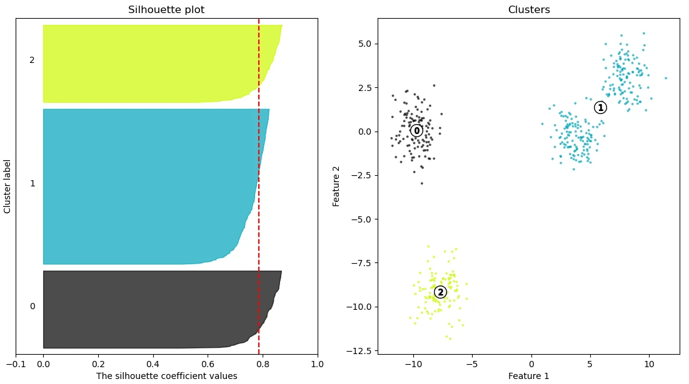
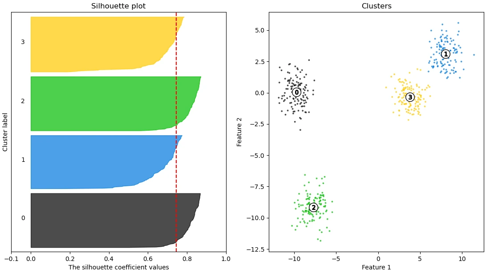
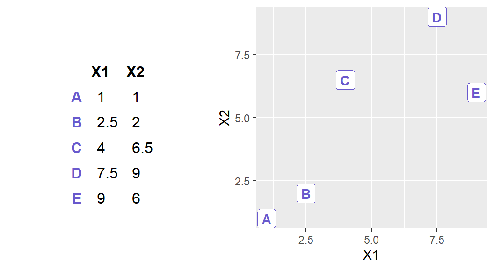
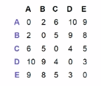
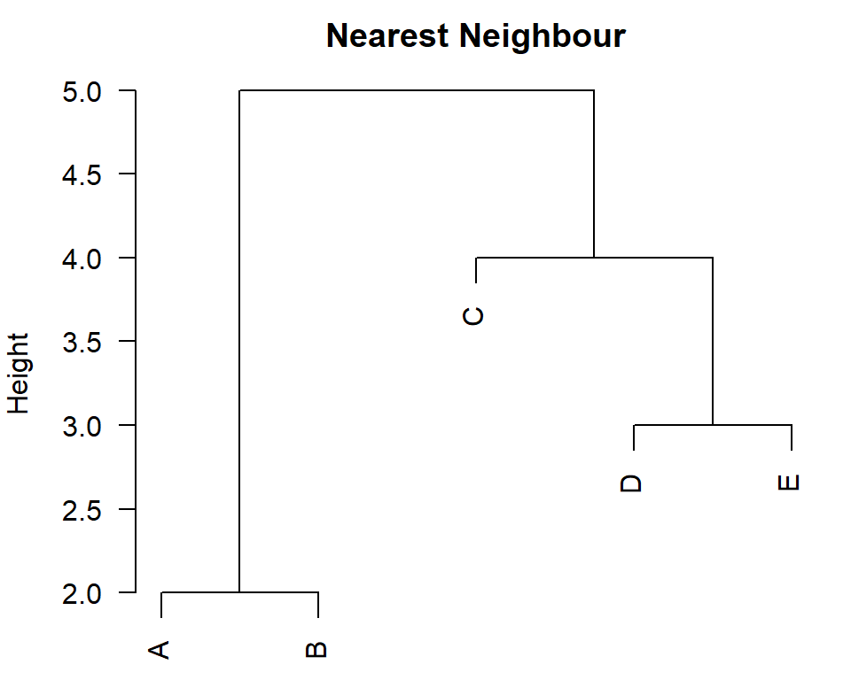
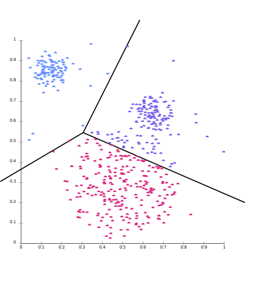

class: middle, center
name: clustering-definition-assessment

# Unsupervised learning

## Clustering

---

## Back to the origin

.important[
.key[Machine Learning] is the science of getting computers to learn without being explicitly programmed.
]

.cols[
.c50[
.center[$\\downarrow$]

.important[
.key[Supervised (Machine) Learning] is the science of getting computers to learn $f: X \\to Y$ from examples autonomously.
]
]
.c50[
.center[$\\downarrow$]

.important[
.key[Unsupervised (Machine) Learning] is the science of getting computers to learn **patterns from data** autonomously.
]
]
]

---

## Unsupervised learning definition

.important[
.key[Unsupervised (Machine) Learning] is the science of getting computers to learn **patterns from data** autonomously.
]

.vspace1[]

What's a **pattern**?
- .dict-def[*pattern \[ˈpat(ə)n\]*: a model or design used as a guide in needlework and other crafts]

In practice:
- we assume that the system that generates the data **follows some scheme** (the pattern)
- we do not know the pattern
- we want to **discover the pattern from a dataset**

---

## Supervised vs. unsupervised

.cols[
.c50[
.important[
.key[Supervised (Machine) Learning] is the science of getting computers to learn $f: X \\to Y$ from examples autonomously.
]
]
.c50[
.important[
.key[Unsupervised (Machine) Learning] is the science of getting computers to learn **patterns from data** autonomously.
]
]
]

.vspace1[]

**Key differences**

.cols[
.c50[
- $y$ is a property of $x$
- one example is a pair $(x,y)$
- what we learn from a dataset can be applied to other $x$
]
.c50[
- the pattern is a property of the system $s$
- *the example* is the dataset $\\mathcal{P}^*(X)$
- what we learn from the dataset is not, in general, usable on another dataset
  - hence, "**find** patterns from data" is fairer than "**learn** patterns from data"
]
]

---

## Pattern?

.cols[
.c70[
In most of the cases, the pattern one is looking for is **grouping**:
- i.e., we assume the system generates data that is grouped, but we do not know what are the groups

.vspace1[]

This form of unsupervised learning is called .key[clustering]:
- given a dataset, find the clusters
  - .dict-def[*cluster \[kluhs-ter\]*: a group of things or persons close together]
  - "close together" $\\rightarrow$ there is some implicit notion of distance (or similarity)
]
.c30[
.w75p.center[]
]
]

---

## Clustering, more formally

Given a dataset $D \\in \\mathcal{P}^*(X)$, find a partitioning $\\{D\_1, \\dots, D\_k\\}$ of $D$ such that the elements in each $D\_i$ are "close together".
- each $D\_i$ is a **cluster**

--

.compact[
**Is this a formal and complete definition?** No!
- what does it mean "close together"?
  - we need a distance/(dis)similarity metric $d: X \\times X \\to \\R^+$, but it's not an input of the problem .note[it's not in the "given" part]
- second, how close? what elements?
  - intuitively, we want that **any two elements of the same cluster are closer each other than any two elements of different clusters**
- third: where does $k$ (the number of clusters) come from? like $d$, it's not an input of the problem
]

--

.compact[
**In practice**:
- $d$ is dictated by $X$ and is reasonable
  - that is, you first shape $X$ (**feature engineering**), than select an reasonable $d$ for that $X$
- $k$ is unknown
  - mostly suggested/bounded by the context
  - within the reasonable range, picked
]

---

## Clustering as optimization

In principle, clustering looks like a (biobjecive) optimization problem (given $D \\in \\mathcal{P}^*(X)$, $k \\in \\{1,\\dots,|D|\\}$, and $d: X \\times X \\to \\mathbb{R}^+$):

.cols[
.c70[
$$
\\begin{align\*}
\\max\_{D\_1, \\dots, D\_k} & \\; \\left(\\c{4}{\\sum \_{i,i': i\\ne i'}\\sum\_{x \\in D\_i, x' \\in D\_{i'}} d(x,x')}\\right) - \\left(\\c{2}{\\sum\_i \\sum\_{x, x' \\in D\_i} d(x,x')}\\right) \\\\
\\text{subject to} & \\;
\\begin{array}{ll}
\\c{3}{D\_1 \\cup \\dots \\cup D\_k = D} \\\\
\\c{3}{D\_i \\cap D\_{i'} = \\emptyset} & \\c{3}{\\forall i,i' \\in \\{1, \\dots, k\\}}
\\end{array}
\\end{align\*}
$$

For any $k,d$, there exists (at least) one optimal solution.
In principle, to find it you can *just* try all the partitions and measure the distance.

In **practice**:
- you don't know $k$
- trying all partitions is unfeasible

]
.c30[
- .col4[**maximize**] the distance between any two $x,x'$ when they belong to **different clusters**
- .col2[**minimize**] (i.e., maximize with $-$) the distance between any two $x,x'$ when they belong to the **same cluster**
- clusters have to .col3[form a **partition**]
]
]

.note[
Here $D$ and each $D\_i$ are **bags, not sets**.
A partition on a bag is better defined if you define a bag as a $m: A \\to \\mathbb{N}$, where $A$ is a set and $m(a)$ is the **multiplicity** of $a \\in A$ in the bag.
However, for clustering we can reason on sets, because in practice pairs $x,x$ should always end up being in the same cluster.
]

---

## Assessing clustering

If you assume to know $k$ and $d$, a clustering method:
- is **effective** on a $D$ if it produces the optimal partition
  - or, the closer the produced partition to the optimal one, the more effective
- is **efficient** if it does it taking low resources (i.e., quickly)

But in practice you don't know $k$...

**Can we just optimize also $k$?**
That is, can we solve the optimization problem for *every* $k$ and take the best?

--

.cols[
.c60.compact[
$$
\\begin{align\*}
\\max\_{k, D\_1, \\dots, D\_k} & \\; \\left(\\c{4}{\\sum \_{i,i': i\\ne i'}\\sum\_{x \\in D\_i, x' \\in D\_{i'}} d(x,x')}\\right) - \\left(\\c{2}{\\sum\_i \\sum\_{x, x' \\in D\_i} d(x,x')}\\right) \\\\
\\text{subject to} & \\;
\\begin{array}{ll}
\\c{3}{D\_1 \\cup \\dots \\cup D\_k = D} \\\\
\\c{3}{D\_i \\cap D\_{i'} = \\emptyset} & \\c{3}{\\forall i,i' \\in \\{1, \\dots, k\\}}
\\end{array}
\\end{align\*}
$$

If you also optimize $k$, then the optimal solution is the one with $k=|D|$...

**Can we just optimize also $k$?**
**No!** It's pointless.
]
.c40.compact[
**Extreme cases**:
- $k=1$, no clustering, just $D\_1=D$
  - $\\c{4}{\\sum\\sub{i,i'}\\sum}=0$, $\\c{2}{\\sum\\sub{i}\\sum}=d\\subtext{all}$ is large, hence the objective is **large negative**
- $k=|D|$, each observation is a cluster
  - $\\c{4}{\\sum\\sub{i,i'}\\sum}=d\\subtext{all}$ is large, $\\c{2}{\\sum\\sub{i}\\sum}=0$, hence the objective is **large positive**
- in between, always increasing

]
]

---

## Assessing clustering in practice

How do you evaluate a partitioning of $D$ **in practice**?
- you **inspect it manually**
- you insert the clustering inside the larger information processing system it belongs to and measure some other index .note[e.g., how rich 💰💰💰 you become with this, rather than that, clustering technique?]
  - a form of **extrinsic evaluation**: you look at the result in a larger context
- you **measure** some **performance indexes** devised for clustering
  - a form of **intrinsic evaluation**: you look at the result alone

.vspace1[]

.question[Question]: is manual inspection intrinsic or exstrinsic?

---

## Clustering performance indexes

There are **many** of them; most are based on the idea of measuring **separateness** or **density** of clustering.

.vspace1[]

.key[Silhouette index]: it considers, for each observation, the .col2[average distance to the observations in the same cluster] and the .col1[min distance to the observations in other clusters]:
$$\\bar{s}(\\seq{D\_i}{i=1}^{i=k})=\\frac{1}{\\left|\\bigcup\_i D\_i\\right|}\\sum\_{x \\in \\bigcup\_i D\_i}\\frac{\\c{1}{d\\subtext{out}(x,\\seq{D\_i}{i})}-\\c{2}{d\\subtext{in}(x,\\seq{D\_i}{i})}}{\\max\\left(\\c{1}{d\\subtext{out}(x,\\seq{D\_i}{i})},\\c{2}{d\\subtext{in}(x,\\seq{D\_i}{i})}\\right)}$$
where:

.cols[
.c50[
$$\\c{1}{d\\subtext{out}(x,\\seq{D\_i}{i})}=\\min\_{D\_i \\not\\ni x} \\min\_{x' \\in D\_i} d(x, x')$$
]
.c50[
$$\\c{2}{d\\subtext{in}(x,\\seq{D\_i}{i})}=\\frac{1}{|D\_i \\ni x|-1}\\sum\_{x' \\in D\_i \\ni x \\land x \\ne x'} d(x, x')$$
]
]

$\\bar{s}(\\cdot) \\in [-1,1]$: **the larger** (closer to $1$), **the better** (i.e., the more separated the clusters).

.note[
A similar index is the [Dunn index](https://en.wikipedia.org/wiki/Dunn_index).
]

---

## Silhouette in practice

.cols[
.c80[
.w100p.center[]

]
.c20[
$\\bar{s}(\\seq{D\_i}{i})=0.78$

.question[Questions]:
- $X$?
- $k$?
- $d$?
]
]

---

## Silhouette in practice

.cols[
.c80[
.w100p.center[]

]
.c20[
$\\bar{s}(\\seq{D\_i}{i})=0.74$

**In practice**:
- the greater $k$, the lower $\\bar{s}(\\cdot)$
- you choose the $k$ where **there is a knee** (or elbow)
]
]

---

class: middle, center
name: hierarchical-clustering

## Hierarchical clustering

---

## Hierarchical clustering

.key[Hierarchical clustering] is an iterative method that exists in two versions:
For both:
- at each $j$-th iteration, there exist one partition $D\_1, \\dots, D\_{k\_j}$
- at most two clusters differ between partionts at subsequent iterations
- you don't set $k$

That is, partition are refined by merging (in **agglomerative** hierarchical clustering) or by division (in **divisive** hierarchical clustering).

Moreover, since there the partition is refined over iterations, an **hierarchy** among clusters is established:
- that is, this clustering method gives some more than a simple partition

We'll see just the agglomerative version.

---

## .key[Agglomerative hierarchical clustering]

.cols[
.c50[
.pseudo-code.compact[
function $\\text{cluster}(\\seq{x^{(i)}}{i=1}^{i=n})$ {  
.i[]$j \\gets 0$  
.i[]$\\c{1}{\\mathcal{D}\_j} \\gets \\{\\{x^{(1)}\\},\\dots,\\{x^{(n)}\\}\\}$  
.i[]while $|\\c{1}{\\mathcal{D}\_j}|>1$ {  
.i[].i[]$(i^\\star,i^{\\prime\\star}) \\gets \\argmin\_{i,i' \\in \\{1,\\dots,|\\mathcal{D}|\\}\\land i \\ne i'} \\c{2}{d\\subtext{cluster}}(D\_{j,i},D\_{j,i'})$  
.i[].i[]$\\c{1}{\\mathcal{D}\_{j+1}} \\gets \\c{1}{\\mathcal{D}\_j} \\oplus D\_{j,i^\\star} \\cup D\_{j,i^{\\prime\\star}} \\ominus D\_{j,i^\\star} \\ominus D\_{j,i^{\\prime\\star}}$  
.i[].i[]$j \\gets j+1$  
.i[]}  
.i[]return $\\c{1}{\\mathcal{D}\_j}$  
}
]
]
.c50[
- $\\c{1}{\\mathcal{D}\_j}=\\{D\_{j,1},\\dots,D\_{j,k\_j}\\}$ is the partition at the $j$-th iteration
- $\\c{2}{d\\subtext{cluster}}: \\mathcal{P}^\\ast(X) \\times \\mathcal{P}^\\ast(X) \\to \\mathbb{R}^+$ is a (dis)similarity metric defined over sets of observations
  - it's a **parameter** of the technique
- $\\mathcal{D} \\oplus D$ *adds* $D$ to $\\mathcal{D}$
- $\\mathcal{D} \\ominus D$ *removes* $D$ from $\\mathcal{D}$
]
]

At each iteration:
1. consider the current clusters in $\\c{1}{\\mathcal{D}}$
2. find the closest ones $D\_{i^\\star},D\_{i^{\\prime\\star}}$
3. build the next iteration clusters by
  - copying all the existing but $D\_{i^\\star}$ and $D\_{i^{\\prime\\star}}$
  - adding $D\_{i^\\star} \\cup D\_{i^{\\prime\\star}}$

---

## Cluster distances

There exist a few options for $d\\subtext{cluster}: \\mathcal{P}^\\ast(X) \\times \\mathcal{P}^\\ast(X) \\to \\mathbb{R}^+$.
All are based on a (dis)similarity metric $d$ defined over observations, i.e., $d: X \\times X \\to \\mathbb{R}^+$.

.cols[
.c50[- .key[Single linkage] (nearest):]
.c50[$$d\\subtext{cluster}(D,D')= \\min\_{x \\in D, x' \\in D'} d(x,x')$$]
]
.cols[
.c50[- .key[Complete linkage] (farthest):]
.c50[$$d\\subtext{cluster}(D,D')= \\max\_{x \\in D, x' \\in D'} d(x,x')$$]
]
.cols[
.c50[- .key[Average linkage]:]
.c50[$$d\\subtext{cluster}(D,D')= \\frac{1}{|D| |D'|}\\sum\_{x \\in D, x' \\in D'} d(x,x')$$]
]
.cols[
.c50[- .key[Centroid]: (only if $X=\\mathbb{R}^p$)]
.c50[$$d\\subtext{cluster}(D,D')= d(c(D),c(D'))$$]
]

where $c(D)=\\bar{\\vect{x}}=\\frac{1}{|D|}\\sum\\sub{\\vect{x} \\in D} \\vect{x}$ and $\\bar{\\vect{x}}$ is the **centroid** of $D$.

.note[
.question[Question]: what's the efficiency of the 4 $d\\subtext{cluster}$?
]

---

## Example in $\\mathbb{R}^1$

.cols[
.c50.compact[
**Input**:
$D=\\{1,2,3,6,7,9,11,12,15,18\\}$

**Execution**¹:

.nicetable.compact[
| $j$ | $\\mathcal{D}\_j$ |
| --- | --- |
| 0 | $\\c{1}{\\{1\\}}, \\c{1}{\\{2\\}}, \\{3\\}, \\{6\\}, \\{7\\}, \\{9\\}, \\{11\\}, \\{12\\}, \\{15\\}, \\{18\\}$ |
| 1 | $\\c{1}{\\{1, 2\\}}, \\c{1}{\\{3\\}}, \\{6\\}, \\{7\\}, \\{9\\}, \\{11\\}, \\{12\\}, \\{15\\}, \\{18\\}$ |
| 2 | $\\{1, 2,3\\}, \\c{1}{\\{6\\}}, \\c{1}{\\{7\\}}, \\{9\\}, \\{11\\}, \\{12\\}, \\{15\\}, \\{18\\}$ |
| 3 | $\\{1, 2,3\\}, \\{6,7\\}, \\{9\\}, \\c{1}{\\{11\\}}, \\c{1}{\\{12\\}}, \\{15\\}, \\{18\\}$ |
| 4 | $\\{1, 2,3\\}, \\c{1}{\\{6,7\\}}, \\c{1}{\\{9\\}}, \\{11,12\\}, \\{15\\}, \\{18\\}$ |
| 5 | $\\{1, 2,3\\}, \\c{1}{\\{6,7,9\\}}, \\c{1}{\\{11,12\\}}, \\{15\\}, \\{18\\}$ |
| 6 | $\\c{1}{\\{1, 2,3\\}}, \\c{1}{\\{6,7,9,11,12\\}}, \\{15\\}, \\{18\\}$ |
| 7 | $\\c{1}{\\{1, 2,3,6,7,9,11,12\\}}, \\c{1}{\\{15\\}}, \\{18\\}$ |
| 8 | $\\c{1}{\\{1, 2,3,6,7,9,11,12,15\\}}, \\c{1}{\\{18\\}}$ |
| 9 | $\\{1, 2,3,6,7,9,11,12,15, 18\\}$ |
]

]
.c50[
.pseudo-code.compact[
function $\\text{cluster}(\\seq{x\_i}{i=1}^{i=n})$ {  
.i[]$j \\gets 0$  
.i[]$\\mathcal{D}\_j \\gets \\{\\{x\_1\\},\\dots,\\{x\_n\\}\\}$  
.i[]while $|\\mathcal{D}\_j|>1$ {  
.i[].i[]$(i^\\star,i^{\\prime\\star}) \\gets \\c{2}{\\argmin}\_{i,i' \\in \\{1,\\dots,|\\mathcal{D}|\\}\\land i \\ne i'} d\\subtext{cluster}(D\_{j,i},D\_{j,i'})$  
.i[].i[]$\\mathcal{D}\_{j+1} \\gets \\mathcal{D}\_j \\oplus D\_{j,i^\\star} \\cup D\_{j,i^{\\prime\\star}} \\ominus D\_{j,i^\\star} \\ominus D\_{j,i^{\\prime\\star}}$  
.i[].i[]$j \\gets j+1$  
.i[]}  
.i[]return $\\mathcal{D}\_j$  
}
]

Assume single linkage:
- $d\\subtext{cluster}(D,D')= \\min\_{x \\in D, x' \\in D'} d(x,x')$
]
]

The output, i.e., the partition of $D$, is $\\mathcal{D}\_9$: the **hierarchy** is the entire sequence $\\mathcal{D}\_9,\\dots,\\mathcal{D}\_0$.

.footnote[
1. We assume that, in case of tie, the first one is selected by .col2[$\\argmin$], i.e., the pair $i,i'$ for which $i+i'$ is the lowest.
]

---

## Example in $\\mathbb{R}^2$

.cols[
.c40[
.w100p.center[]
]
.c30[
.w75p.center[]
]
.c30[
.w100p.center[]
]
]

The **hierarchy** $\\seq{\\mathcal{D}\_j}{j}$, not just the partition $\\mathcal{D}\_{n-1}$, can be visualized in the form of a .key[dendrogram] where:
- each node is a $D' \\subseteq D$
- the root node is $D$
- each node $D'$ has two children $D'\_1,D''\_2$ that have been merged when forming $D'$
- the **height of each node** is the distance $d\\subtext{cluster}$ of its two children

.footnote[
.question[Question]: what $d\\subtext{cluster}$ is being used here?
]

---

## Hierarchical clustering on Iris

.cols[
.c50[
.h50ex.center[]
]
.c50[
- $y$ is ignored while doing the clustering
  - but used for coloring the dendrogram

.vspace1[]

By looking at the dendrogram, one can choose an appropriate $k$, or simply look at the dendrogram as the pattern.
]
]

---

class: middle, center
name: k-means

## Partitional clustering

### k-means

---

## Refining the partition

Consider the optimization problem behind clustering and the following heuristic¹ for solving it:

1. start with a random partition $\\seq{D\_h}{h}$
2. until $\\seq{D\_h}{h}$ is good enough
  1. refine $\\seq{D\_h}{h}$
3. return $\\seq{D\_h}{h}$

.footnote[
1. .dict-def[*heuristic \[hyoo-ris-tik\]*:  a trial-and-error method of problem solving used when an ~~algorithmic~~ *exact* approach is impractical.]
]

--

.vspace1[]

- **Good**?
  - the cluster are well separated
- **Good enough**?
  - the partition cannot be further improved
  - or some computational budget has been consumed

---

## .key[k-means clustering]

.cols[
.c50[
.pseudo-code.compact[
function $\\text{cluster}(\\seq{\\vect{x}^{(i)}}{i=1}^{i=n}, k)$ {  
.i[]for $h \\in \\{1,\\dots,k\\}$ { .comment[//set initial centroids]  
.i[].i[]$\\c{1}{\\vect{\\mu}\_h} \\gets \\vect{x}^{(\\sim U(\\{1,\\dots,n\\}))}$  
.i[]}  
.i[]$\\mathcal{D} \\gets \\c{2}{\\text{assign}}(\\seq{\\vect{x}^{(i)}}{i=1}^{i=n}, \\c{1}{\\seq{\\vect{\\mu}\_h}{h=1}^{h=k}})$  
.i[]while $\\neg\\text{should-stop()}$ {  
.i[].i[]for $h \\in \\{1,\\dots,k\\}$ { .comment[//recompute centroids]  
.i[].i[].i[]$\\vect{\\mu}\_h \\gets \\frac{1}{|D\_h|} \\sum\_{\\vect{x} \\in D\_h} \\vect{x} $  
.i[].i[]}  
.i[].i[]$\\mathcal{D}' \\gets \\c{2}{\\text{assign}}(\\seq{\\vect{x}^{(i)}}{i=1}^{i=n}, \\c{1}{\\seq{\\vect{\\mu}\_h}{h=1}^{h=k}})$  
.i[].i[]if .col3[$\\mathcal{D}'=\\mathcal{D}$] {  
.i[].i[].i[]break  
.i[].i[]}  
.i[].i[]$\\mathcal{D} \\gets \\mathcal{D}'$  
.i[]}  
.i[]return $\\mathcal{D}$  
}
]

.vspace025[]

.pseudo-code.compact[
function $\\c{2}{\\text{assign}}(\\seq{\\vect{x}^{(i)}}{i=1}^{i=n}, \\c{1}{\\seq{\\vect{\\mu}\_h}{h=1}^{h=k}})$ {  
.i[]$\\mathcal{D} \\gets \\{\\emptyset,\\dots,\\emptyset\\}$ .comment[//$k$ empty *sets*]  
.i[]for $i \\in \\{1,\\dots,n\\}$ {  
.i[].i[]$h^\\star = \\argmin\_{h \\in \\{1,\\dots,k\\}} d(\\vect{x}^{(i)},\\c{1}{\\vect{\\mu}\_h})$  
.i[].i[]$D\_{h^\\star} \\gets D\_{h^\\star} \\cup \\{\\vect{x}^{(i)}\\}$ .comment[//*assign to* the closest centroid]  
.i[]}  
.i[]return $\\mathcal{D}$  
}
]
]
.c50[
- $X = \\mathbb{R}^p$
  - otherwise you cannot compute the mean as $\\c{1}{\\vect{\\mu}\_h} \\gets \\frac{1}{|D\_h|} \\sum\_{\\vect{x} \\in D\_h} \\vect{x} $
- .col1[$\\vect{\\mu}\_1,\\dots,\\vect{\\mu}\_k$] are the means of the clusters and act as centroids
  - there are **$k$ means**!
  - randomly chosen at the first iteration
- .col2[$\\text{assign()}$] assigns observations, i.e., points, to closest centroids
- when there's .col3[no change in the partition], the loop is stop
  - $\\text{should-stop()}$ may employ additional stopping criteria, e.g:
      - number of iterations
      - distance traveled by the centroids
- this technique is **not deterministic**, due to the initial random assignment
  - $\\sim U(\\{1,\\dots,n\\})$ .note[without repetition]

]
]

---

## Example in $\\mathbb{R}^1$

.cols[
.c60.compact[
**Input**:
$D=\\{1,2,3,6,7,9,11,12,15,18\\}$, $k=3$

**Execution** (one initial random assignment):

.nicetable.compact[
| $\\mathcal{D}\_j$ | $\\vect{\\mu}\_1$ | $\\vect{\\mu}\_2$ | $\\vect{\\mu}\_3$ |
| --- | --- | --- | --- |
| $\\{\\c{1}{1},\\c{1}{2},\\c{1}{3},\\c{1}{6},\\c{2}{7},\\c{2}{9},\\c{2}{11},\\c{2}{12},\\c{4}{15},\\c{4}{18}\\}$ | $\\c{1}{1}$ | $\\c{2}{11}$ | $\\c{4}{15}$ |
| $\\{\\c{1}{1},\\c{1}{2},\\c{1}{3},\\c{1}{6},\\c{2}{7},\\c{2}{9},\\c{2}{11},\\c{2}{12},\\c{4}{15},\\c{4}{18}\\}$ | $\\c{1}{3}$ | $\\c{2}{9.8}$ | $\\c{4}{16.5}$ |
| $\\{\\c{1}{1},\\c{1}{2},\\c{1}{3},\\c{1}{6},\\c{2}{7},\\c{2}{9},\\c{2}{11},\\c{2}{12},\\c{4}{15},\\c{4}{18}\\}$ | $\\c{1}{3}$ | $\\c{2}{9.8}$ | $\\c{4}{16.5}$ |
]

.vspace1[]

**Execution** (another initial random assignment):

.nicetable.compact[
| $\\mathcal{D}\_j$ | $\\vect{\\mu}\_1$ | $\\vect{\\mu}\_2$ | $\\vect{\\mu}\_3$ |
| --- | --- | --- | --- |
| $\\{\\c{1}{1},\\c{2}{2},\\c{4}{3},\\c{4}{6},\\c{4}{7},\\c{4}{9},\\c{4}{11},\\c{4}{12},\\c{4}{15},\\c{4}{18}\\}$ | $\\c{1}{1}$ | $\\c{2}{2}$ | $\\c{4}{3}$ |
| $\\{\\c{1}{1},\\c{2}{2},\\c{2}{3},\\c{4}{6},\\c{4}{7},\\c{4}{9},\\c{4}{11},\\c{4}{12},\\c{4}{15},\\c{4}{18}\\}$ | $\\c{1}{1}$ | $\\c{2}{2}$ | $\\c{4}{10.1}$ |
| $\\{\\c{1}{1},\\c{2}{2},\\c{2}{3},\\c{2}{6},\\c{4}{7},\\c{4}{9},\\c{4}{11},\\c{4}{12},\\c{4}{15},\\c{4}{18}\\}$ | $\\c{1}{1}$ | $\\c{2}{2.5}$ | $\\c{4}{11.1}$ |
| $\\{\\c{1}{1},\\c{1}{2},\\c{2}{3},\\c{2}{6},\\c{2}{7},\\c{4}{9},\\c{4}{11},\\c{4}{12},\\c{4}{15},\\c{4}{18}\\}$ | $\\c{1}{1}$ | $\\c{2}{3.7}$ | $\\c{4}{12}$ |
| $\\{\\c{1}{1},\\c{1}{2},\\c{1}{3},\\c{2}{6},\\c{2}{7},\\c{2}{9},\\c{4}{11},\\c{4}{12},\\c{4}{15},\\c{4}{18}\\}$ | $\\c{1}{1.5}$ | $\\c{2}{5.3}$ | $\\c{4}{13}$ |
| $\\{\\c{1}{1},\\c{1}{2},\\c{1}{3},\\c{2}{6},\\c{2}{7},\\c{2}{9},\\c{4}{11},\\c{4}{12},\\c{4}{15},\\c{4}{18}\\}$ | $\\c{1}{2}$ | $\\c{2}{7.3}$ | $\\c{4}{14}$ |
| $\\{\\c{1}{1},\\c{1}{2},\\c{1}{3},\\c{2}{6},\\c{2}{7},\\c{2}{9},\\c{4}{11},\\c{4}{12},\\c{4}{15},\\c{4}{18}\\}$ | $\\c{1}{2}$ | $\\c{2}{7.3}$ | $\\c{4}{14}$ |
]

.footnote[.question[Question:] what's the best clustering? can we answer this question?]

]
.c40[
.pseudo-code.compact[
function $\\text{cluster}(\\seq{\\vect{x}^{(i)}}{i=1}^{i=n}, k)$ {  
.i[]for $h \\in \\{1,\\dots,k\\}$ {  
.i[].i[]$\\vect{\\mu}\_h \\gets \\vect{x}^{(\\sim U(\\{1,\\dots,n\\}))}$  
.i[]}  
.i[]$\\mathcal{D} \\gets \\text{assign}(\\seq{\\vect{x}^{(i)}}{i=1}^{i=n}, \\seq{\\vect{\\mu}\_h}{h=1}^{h=k})$  
.i[]while $\\neg\\text{should-stop()}$ {  
.i[].i[]for $h \\in \\{1,\\dots,k\\}$ {  
.i[].i[].i[]$\\vect{\\mu}\_h \\gets \\frac{1}{|D\_h|} \\sum\_{\\vect{x} \\in D\_h} \\vect{x} $  
.i[].i[]}  
.i[].i[]$\\mathcal{D}' \\gets \\text{assign}(\\seq{\\vect{x}^{(i)}}{i=1}^{i=n}, \\seq{\\vect{\\mu}\_h}{h=1}^{h=k})$  
.i[].i[]if $\\mathcal{D}'=\\mathcal{D}$ {  
.i[].i[].i[]break  
.i[].i[]}  
.i[].i[]$\\mathcal{D} \\gets \\mathcal{D}'$  
.i[]}  
.i[]return $\\mathcal{D}$  
}
]
]
]

---

## Example in $\\mathbb{R}^2$

.cols[
.c50[
.w100p.center[]

]
.c50[
Given two points $\\vect{\\mu}\_1,\\vect{\\mu}\_2$, the line which
- is orthogonal to the segment $\\overlinesegment{\\vect{\\mu}\_1\\vect{\\mu}\_2}$ and
- goes through its midpoint

divides the space in points closer to $\\vect{\\mu}\_1$ and those closer to $\\vect{\\mu}\_2$.

.footnote[
.note[Image from [Wikipedia](https://commons.wikimedia.org/wiki/Cluster_analysis)]
]
]
]
