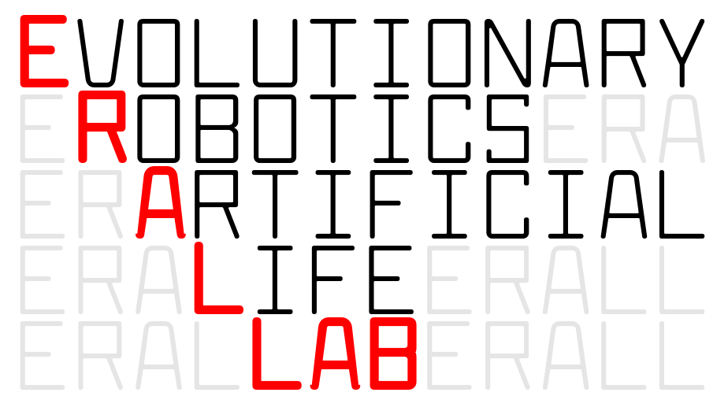
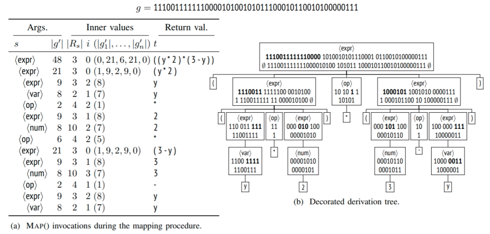
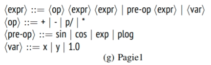
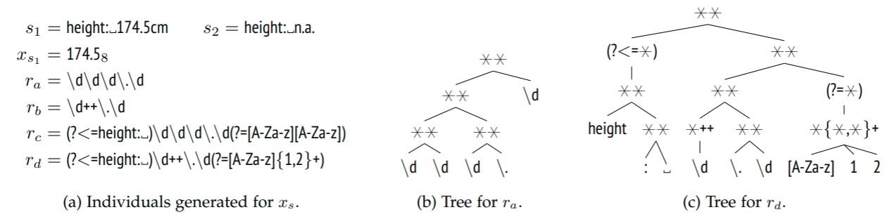
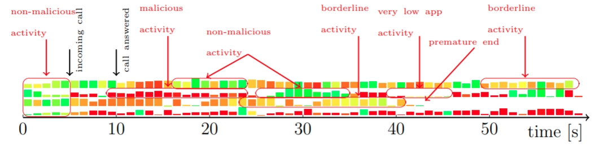
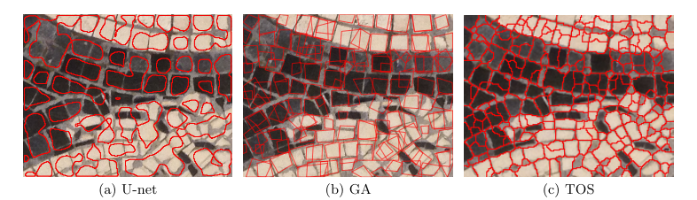
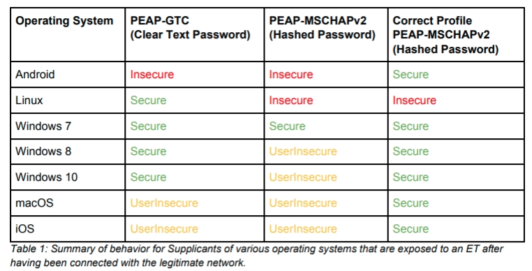
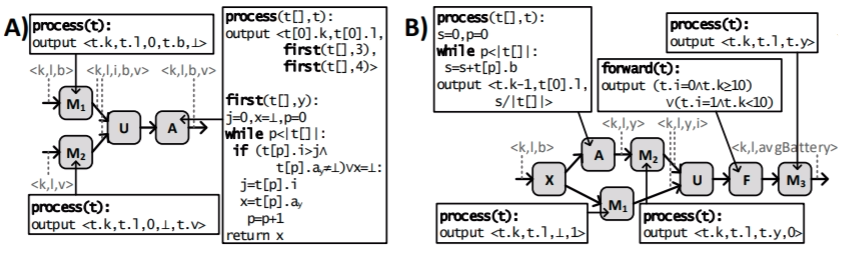
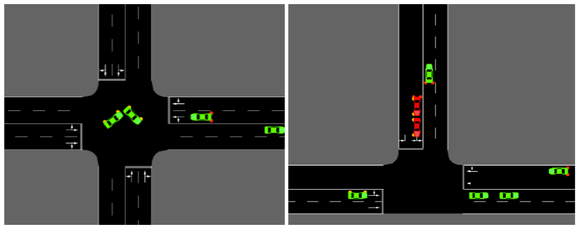
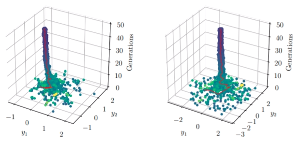

class: middle, center

# Research activity overview

[Eric Medvet](http://medvet.inginf.units.it/), University of Trieste

.vam[]@EricMedvetTs

12/2/2020, Simula@OsloMet

.cols[
.fifty.center[
.h10ex[]
]
.fifty.center[
.h10ex[]
]
]

---

## Grammatical evolution

.cols[
.fifty[
.h15ex.center[]
]
.fifty[
.h15ex.center[]
]
]

- .ref[Bartoli, De Lorenzo, Medvet, Squillero, [Multi-level Diversity Promotion Strategies for Grammar-guided Genetic Programming](http://medvet.inginf.units.it/publications/multileveldiversitypromotionstrategiesforgrammarguidedgeneticprogramming), Applied Soft Computing, 2019]
- .ref[Bartoli, Castelli, Medvet, [Weighted Hierarchical Grammatical Evolution](http://medvet.inginf.units.it/publications/weightedhierarchicalgrammaticalevolution), IEEE Transactions on Cybernetics, 2018]
- .ref[Medvet, Bartoli, De Lorenzo, Tarlao, [Designing Automatically a Representation for Grammatical Evolution](http://medvet.inginf.units.it/publications/designingautomaticallyarepresentationforgrammaticalevolution), Genetic Programming and Evolvable Machines, 2018 (extension of **EuroGP best paper**)]
- .ref[Medvet, Bartoli, De Lorenzo, Tarlao, [GOMGE: Gene-pool Optimal Mixing on Grammatical Evolution](http://medvet.inginf.units.it/publications/gomgegenepooloptimalmixingongrammaticalevolution), 15th International Conference on Parallel Problem Solving from Nature (PPSN), 2018, Coimbra (Portugal)]
- .ref[Medvet, Daolio, Tagliapietra, [Evolvability in Grammatical Evolution](http://medvet.inginf.units.it/publications/evolvabilityingrammaticalevolution), ACM Genetic and Evolutionary Computation Conference (GECCO), 2017, Berlin (Germany)]
- .ref[Medvet, [A Comparative Analysis of Dynamic Locality and Redundancy in Grammatical Evolution](http://medvet.inginf.units.it/publications/acomparativeanalysisofdynamiclocalityandredundancyingrammaticalevolution), 20th European Conference on Genetic Programming (EuroGP), 2017, Amsterdam (Netherlands)]

---

## Evolutionary inference of regular expressions

.w75p.center[]

- .ref[Bartoli, De Lorenzo, Medvet, Tarlao, [Automatic Search-and-Replace from Examples with Coevolutionary Genetic Programming](http://medvet.inginf.units.it/publications/automaticsearchandreplacefromexampleswithcoevolutionarygeneticprogramming), IEEE Transactions on Cybernetics, 2019]
- .ref[Bartoli, De Lorenzo, Medvet, Tarlao, [Active Learning of Regular Expressions for Entity Extraction](http://medvet.inginf.units.it/publications/activelearningofregularexpressionsforentityextraction), IEEE Transactions on Cybernetics, 2017]
- .ref[Bartoli, De Lorenzo, Medvet, Tarlao, [Inference of Regular Expressions for Text Extraction from Examples](http://medvet.inginf.units.it/publications/inferenceofregularexpressionsfortextextractionfromexamples), IEEE Transactions on Knowledge and Data Engineering, 2016, **Silver Medal 13-th HUMIES**]
- .ref[Bartoli, De Lorenzo, Medvet, Tarlao, [Can A Machine Replace Humans In Building Regular Expressions? A Case Study](http://medvet.inginf.units.it/publications/canamachinereplacehumansinbuildingregularexpressionsacasestudy), IEEE Intelligent Systems, 2016, **Silver Medal 13-th HUMIES**]
- .ref[Bartoli, De Lorenzo, Medvet, [Automatic String Replace by Examples](http://medvet.inginf.units.it/publications/automaticstringreplacebyexamples), ACM Genetic and Evolutionary Computation Conference (GECCO), 2013, Amsterdam (Netherlands)]
- .ref[Bartoli, Davanzo, De Lorenzo, Mauri, Medvet, Sorio, [Automatic Generation of Regular Expressions from Examples with Genetic Programming](http://medvet.inginf.units.it/publications/automaticgenerationofregularexpressionsfromexampleswithgeneticprogramming), ACM Genetic and Evolutionary Computation Conference (GECCO), 2012, Philadelphia (USA)]

---

## Android malware detection

.w75p.center[]

- .ref[De Lorenzo, Martinelli, Medvet, Mercaldo, Santone, [Visualizing the Outcome of Dynamic Analysis of Android Malware with VizMal](http://medvet.inginf.units.it/publications/visualizingtheoutcomeofdynamicanalysisofandroidmalwarewithvizmal), Journal of Information Security and Applications, 2020]
- .ref[Bacci, Bartoli, Martinelli, Medvet, Mercaldo, [Detection of Obfuscation Techniques in Android Applications](http://medvet.inginf.units.it/publications/detectionofobfuscationtechniquesinandroidapplications), 7th International Workshop on Security of Mobile Applications (IWSMA), 2018, Hamburg (Germany)]
- .ref[Bacci, Bartoli, Martinelli, Medvet, Mercaldo, Visaggio, [Impact of Code Obfuscation on Android Malware Detection based on Static and Dynamic Analysis](http://medvet.inginf.units.it/publications/impactofcodeobfuscationonandroidmalwaredetectionbasedonstaticanddynamicanalysis), International Conference on Information Systems Security and Privacy (ICISSP), 2018, Madeira (Portugal)]
- .ref[Canfora, Medvet, Mercaldo, Visaggio, [Acquiring and Analysing App Metrics for Effective Mobile Malware Detection](http://medvet.inginf.units.it/publications/acquiringandanalysingappmetricsforeffectivemobilemalwaredetection), 2nd ACM International Workshop on Security And Privacy Analytics (IWSPA), 2016, New Orleans (USA)]
- .ref[Canfora, De Lorenzo, Medvet, Mercaldo, Visaggio, [Effectiveness of Opcode ngrams for Detection of Multi Family Android Malware](http://medvet.inginf.units.it/publications/effectivenessofopcodengramsfordetectionofmultifamilyandroidmalware), 4th International Workshop on Security of Mobile Applications (IWSMA), 2015, Toulouse (France)]
- .ref[Canfora, Medvet, Mercaldo, Visaggio, [Detecting Android Malware using Sequences of System Calls](http://medvet.inginf.units.it/publications/detectingandroidmalwareusingsequencesofsystemcalls), 3rd International Workshop on Software Development Lifecycle for Mobile (DeMobile), 2015, Bergamo (Italy)]

---

## Computer vision (w/ or w/o deep learning)

.w75p.center[]

- .ref[Ansuini, Medvet, Pellegrino, Zullich, [On the Similarity between Hidden Layers of Pruned and Unpruned Convolutional Neural Networks](http://medvet.inginf.units.it/publications/onthesimilaritybetweenhiddenlayersofprunedandunprunedconvolutionalneuralnetworks), 9th International Conference on Pattern Recognition Applications and Methods (ICPRAM), 2020, Valletta (Malta)]
- .ref[Fenu, Medvet, Panfilo, Pellegrino, [Mosaic Images Segmentation using U-Net](http://medvet.inginf.units.it/publications/mosaicimagessegmentationusingunet), 9th International Conference on Pattern Recognition Applications and Methods (ICPRAM), 2020, Valletta (Malta)]
- .ref[Bartoli, De Lorenzo, Medvet, Tarlao, [How Phishing Pages Look Like?](http://medvet.inginf.units.it/publications/howphishingpageslooklike), Cybernetics and Information Technologies, 2018]
- .ref[Bartoli, De Lorenzo, Medvet, Tarlao, [Personalized, Browser-based Visual Phishing Detection Based on Deep Learning](http://medvet.inginf.units.it/publications/personalizedbrowserbasedvisualphishingdetectionbasedondeeplearning), 13th International Conference on Risks and Security of Internet and Systems (CRiSIS), 2018, Arachon (France)]
- .ref[De Marco, Fenu, Medvet, Pellegrino, [Computer Vision for the Blind: a Comparison of Face Detectors in a Relevant Scenario](http://medvet.inginf.units.it/publications/computervisionfortheblindacomparisonoffacedetectorsinarelevantscenario), 2nd EAI International Conference on Smart Objects and Technologies for Social Good (GOODTECHS), 2016, Venezia (Italy)]

---

## Computer Security

.h25ex.center[]

- .ref[Bartoli, Medvet, De Lorenzo, Tarlao, [Enterprise Wi-Fi: we need devices that are secure by default](http://medvet.inginf.units.it/publications/enterprisewifiweneeddevicesthataresecurebydefault), Communications of the ACM, 2019]
- .ref[Bartoli, Medvet, Onesti, [Evil Twins and WPA2 Enterprise: A Coming Security Disaster?](http://medvet.inginf.units.it/publications/eviltwinsandwpaenterpriseacomingsecuritydisaster), Computers & Security, 2018]
- .ref[Bartoli, Medvet, De Lorenzo, Tarlao, [Back To The Basics: Security of Software Downloads for Smart Objects](http://medvet.inginf.units.it/publications/backtothebasicssecurityofsoftwaredownloadsforsmartobjects), 4th EAI International Conference on Smart Objects and Technologies for Social Good (GOODTECHS), 2018, Bologna (Italy)]
- .ref[Davanzo, Medvet, Bartoli, [Anomaly Detection Techniques for a Web Defacement Monitoring Service](http://medvet.inginf.units.it/publications/anomalydetectiontechniquesforawebdefacementmonitoringservice), Expert Systems with Applications, 2011]
- .ref[Bartoli, Davanzo, Medvet, [A Framework for Large-Scale Detection of Web Site Defacements](http://medvet.inginf.units.it/publications/aframeworkforlargescaledetectionofwebsitedefacements), ACM Transaction on Internet Technology, 2010]
- .ref[Medvet, Kirda, Kruegel, [Visual Similarity-Based Phishing Detection](http://medvet.inginf.units.it/publications/visualsimilaritybasedphishingdetection), 4th International Conference on Security and Privacy in Comminication Networks (SecureComm), 2008, Istanbul]

---

## Multi-agent Systems

.center[
.h15ex[]
.h15ex[]
]

- .ref[Talamini, Medvet, Bartoli, [Communication-based Cooperative Tasks: how the Language Expressiveness affects Reinforcement Learning](http://medvet.inginf.units.it/publications/communicationbasedcooperativetaskshowthelanguageexpressivenessaffectsreinforcementlearning), 34th ACM/SIGAPP Symposium on Applied Computing (SAC), 2019, Limassol (Cyprus)]
- .ref[Bortolussi, Gulisano, Medvet, Palyvos-Giannas, [Automatic Translation of Spatio-Temporal Logics to Streaming-Based Monitoring Applications for IoT-Equipped Autonomous Agents](http://medvet.inginf.units.it/publications/automatictranslationofspatiotemporallogicstostreamingbasedmonitoringapplicationsforiotequippedautonomousagents), 6th International Workshop on Middleware and Applications for the Internet of Things (M4IoT@Middleware), 2019, Davis (USA)]
- .ref[Talamini, Scaini, Medvet, Bartoli, [Selfish vs. Global Behavior Promotion in Car Controller Evolution](http://medvet.inginf.units.it/publications/selfishvsglobalbehaviorpromotionincarcontrollerevolution), 1st GECCO Workshop on Decomposition Techniques in Evolutionary Optimization (DTEO@GECCO), 2018, Kyoto (Japan)]
- .ref[Lombardi, Medvet, Bartoli, [A Language for UAV Traffic Rules in an Urban Environment and Decentralized Scenario](http://medvet.inginf.units.it/publications/alanguageforuavtrafficrulesinanurbanenvironmentanddecentralizedscenario), IEEE International Conference on Tools with Artificial Intelligence (ICTAI), 2017, Boston (USA)]
- .ref[Medvet, Bartoli, Talamini, [Road Traffic Rules Synthesis using Grammatical Evolution](http://medvet.inginf.units.it/publications/roadtrafficrulessynthesisusinggrammaticalevolution), 20th European Conference on the Applications of Evolutionary Computation (EvoApplication), 2017, Amsterdam (Netherlands)]

---

## Misc

.cols[
.fifty.center[
.h15ex[]
]
.fifty.center[
.h15ex[]
]
]

- Visualization for Evolutionary Computation
  - .ref[De Lorenzo, Medvet, Tušar, Bartoli, [An Analysis of Dimensionality Reduction Techniques for Visualizing Evolution](http://medvet.inginf.units.it/publications/ananalysisofdimensionalityreductiontechniquesforvisualizingevolution), 10th Annual workshop on Visualisation in Genetic and Evolutionary Computation (VizGEC@GECCO), 2019, Prague (Czech Republic)]
  - .ref[Medvet, Virgolin, Castelli, Bosman, Gonçalves, Tušar, [Unveiling Evolutionary Algorithm Representation with DU Maps](http://medvet.inginf.units.it/publications/unveilingevolutionaryalgorithmrepresentationwithdumaps), Genetic Programming and Evolvable Machines, 2018]
- Natural language generation
  - .ref[Bartoli, De Lorenzo, Medvet, Morello, Tarlao, ["Best Dinner Ever!!!": Automatic Generation of Restaurant Reviews with LSTM-RNN](http://medvet.inginf.units.it/publications/bestdinnereverautomaticgenerationofrestaurantreviewswithlstmrnn), IEEE/WIC/ACM International Conference on Web Intelligence (WI), 2016, Omaha (USA)]
  - .ref[Bartoli, De Lorenzo, Medvet, Tarlao, [Your Paper has been Accepted, Rejected, or whatever: Automatic Generation of Scientific Paper Reviews](http://medvet.inginf.units.it/publications/yourpaperhasbeenacceptedrejectedorwhateverautomaticgenerationofscientificpaperreviews), International Cross Domain Conference and Workshop (CD-ARES), 2016, Salzburg (Austria)]
