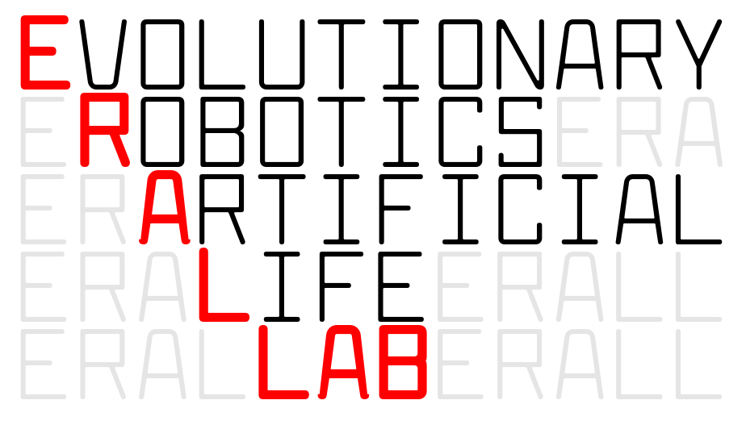
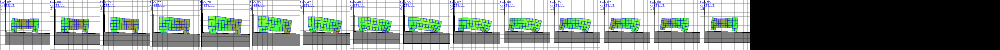

# Voxel-based Soft Robots
## a platform for investigating Learning, Evolution, and Everything

[Eric Medvet](http://medvet.inginf.units.it/), University of Trieste

Simula@OsloMet

---

## Outline

1. What are Voxel-based Soft Robots (VSRs)?
2. Do they actually exist?
3. How to design them?
4. What's next, from a research perspective?

---

## Who/what/where am I?

Associate Professor of Computer Engineering, University of **Trieste, Italy**

University of Trieste

Italy

---

## Who/what/where am I?

.container[
  .col[
    ciao
  ]
  .col[
    mondo!
  ]
]

Ailo _non va_ <b>I</b>I!

---

## What are VSRs?

