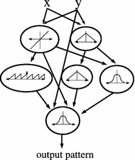

class: middle, center

# Voxel-based Soft Robots
## A platform for investigating Learning, Evolution, and Everything

[Eric Medvet](http://medvet.inginf.units.it/), University of Trieste

11/12/2020, Simula@OsloMet

---

## Agenda

1. **What** are Voxel-based Soft Robots (VSRs)?
2. Do they actually **exist**?
3. How to **design** them?
4. What's next, from a **research** perspective?

---

## Who/what/where am I?

Associate Professor of **Computer Engineering**, University of Trieste, Italy

.cols[
.fifty[
.center[
University of Trieste

.h15ex[]
]
- almost all disciplines
  - 30+34+11 degree programs
- ≈16k students (7% foreign)
- ≈300 PhDs (11% foreign)
- 401-500 THE [ranking](https://www.units.it/ranking)
  - 8th in Italy
]
.fifty[
.center[
Trieste, Italy

.h15ex[]
.h15ex[]
]
- ≈200k population
- 2 universities, many other institutions
  - 37 researchers on 1000 pers.
- high life quality
  - 6th in Italy
  - great coffee!
]
]

---

## Who/what/where am I?

.cols[
.fifty[
.center[.h10ex[]]

Co-head, co-founder, since ≈10y

Research topics:
- applications of ML:
  - computer/web security
  - information extraction
- evolutionary computation and applications
  - genetic programming & grammatical evolution
  - regular expressions
]
.fifty[
.center[.h10ex[]]

Head, founder, since ≈1y

Research topics:
- evolutionary robotics
- social learning (with evo)
- multi-agent systems
]
]

---

class: middle, center

# *What* are VSRs?

---

## Hi! I'm a VSR!

.center[]

VSR:
- **aggregation** of many soft blocks (_voxels_)
- voxels can change their **volume**
- **behavior** determined by interaction of volumes change

Terminology:
- shape and materials → _body_
- law for volume change → _brain_ or _controller_

.footnote[Image from .ref[Kriegman, Sam, et al. "[Simulating the evolution of soft and rigid-body robots](https://dl.acm.org/doi/abs/10.1145/3067695.3082051)." Proceedings of the Genetic and Evolutionary Computation Conference Companion. 2017.]]

---

## Look! I am alive!

.center[<iframe width="800" height="450" src="https://www.youtube.com/embed/Ee2sU-AZWC4" frameborder="0" allow="accelerometer; autoplay; encrypted-media; gyroscope; picture-in-picture" allowfullscreen></iframe>]

.footnote[Video from .ref[Kriegman, Sam, Nick Cheney, and Josh Bongard. "[How morphological development can guide evolution](https://www.nature.com/articles/s41598-018-31868-7)." Scientific reports 8.1 (2018): 1-10.]]

---

## Why relevant?

- Soft-robotics
- Embodied cognition
- Lifelike behaviors
- Modularity

---

### Soft-robotics

.cols[
.fifty[
.center[.w50p[]]]
.fifty[
.center[.w50p[]]]
]

- *Infinite degrees of freedom*: soft robots can solve tasks that are hard for rigid Robots
- VSRs as materials with contiuous properties

.footnote[Left from .ref[Cheney, Nick, Josh Bongard, and Hod Lipson. "[Evolving soft robots in tight spaces](https://dl.acm.org/doi/abs/10.1145/2739480.2754662)." Proceedings of the 2015 annual conference on Genetic and Evolutionary Computation. 2015.]
Right from .ref[Hiller, Jonathan, and Hod Lipson. "[Automatic design and manufacture of soft robots](https://ieeexplore.ieee.org/abstract/document/6096440)." IEEE Transactions on Robotics 28.2 (2011): 457-466.]]

---

### Embodied cognition paradigm

> "both bodies and brains combine to produce complex behaviors, in contrast to the traditional view that the only seat of intelligence is the brain"

In VSRs, much more in the bodies than in the brains
- many *simple* behaviors result in a *complex* behavior
- the intelligence is in how they combine, which is more related to the body than to the brain

.footnote[Quote rom .ref[Pfeifer, Rolf, and Josh Bongard. [How the body shapes the way we think: a new view of intelligence](https://books.google.it/books?id=EHPMv9MfgWwC&lpg=PR7&ots=WVTQlU_gwv&lr&hl=it&pg=PR7#v=onepage&q&f=false). MIT press, 2006.]]

---

### Lifelike behaviors

.center[.w50p[]]

VSRs as a gym for studying/reproducing (artificial) life (**alife**!)
- for specific mechanisms at different time scales
- for curiosity *alone*

.footnote[Image from .ref[Fenton, Flavio H., et al. "[Modeling wave propagation in realistic heart geometries using the phase-field method](https://aip.scitation.org/doi/abs/10.1063/1.1840311)." Chaos: An Interdisciplinary Journal of Nonlinear Science 15.1 (2005): 013502.]]

---

### Modularity

.cols[
.fifty[
VSRs emply fine-grained modularity
- re-usability
- redundancy, robustness
- more practical realization
  - robotic reproduction?
]
.fifty[.center[]]
]

.footnote[Image from .ref[Hale, Matthew F., et al. "[The ARE Robot Fabricator: How to (Re) produce Robots that Can Evolve in the Real World](https://www.mitpressjournals.org/doi/abs/10.1162/isal_a_00147)." The 2018 Conference on Artificial Life: A Hybrid of the European Conference on Artificial Life (ECAL) and the International Conference on the Synthesis and Simulation of Living Systems (ALIFE). One Rogers Street, Cambridge, MA 02142-1209 USA journals-info@ mit. edu: MIT Press, 2019.]]

---

## And in practice...

.center[
modularity + re-usability + effectivenss = ?

Eventually, applications.
]

.cols[
.fifty[
E.g., disaster response:
1. have a bag of voxels, empty it at disaster site
2. voxels assemble and form a VSR suitable for task/site
3. VSR does the work
4. collect, dissassemble, put in bag

What do we still miss for doing that?
]
.fifty[
.center[
.w50p[]
.w50p[]
]
]
]

---

class: middle, center

# Do they actually *exist*?

---

## Physically building VSRs - "first" attempt: foam

.cols[
.fifty[
Initial motivation for VSRs:
- automated **design _and_ manufacture** of static and locomotion objects
- advances in multimaterial fabrication

Details
- _material_: silicone foam rubber
- _actuation_: environment pressure modulation
- _fabrication_: 3-D printing, fairly automated

Notes:
- simulation and static/dynamic validation
- rather unpractical
]
.fifty[.center[]]
]

.footnote[.ref[Hiller, Jonathan, and Hod Lipson. "[Automatic design and manufacture of soft robots](https://ieeexplore.ieee.org/abstract/document/6096440)." IEEE Transactions on Robotics 28.2 (2011): 457-466.]]

---

## Second attempt: silicone

.cols[
.fifty[
Motivation:
- include fabrication in the design optimization loop
  - fight the **sim2real** problem

Details
- _material_: silicone
- _actuation_: pneumatical
- _fabrication_: molding machine and big manual effort

Notes:
- modular (manual/static assembly)
- cable-driven actuation
]
.fifty[.center[

.w50p[]]
]
]

.footnote[.ref[Kriegman, Sam, et al. "[Scalable sim-to-real transfer of soft robot designs](https://arxiv.org/pdf/1911.10290.pdf)." arXiv preprint arXiv:1911.10290 (2019).]]

---

## Third attempt: silicone + magnets

.cols[
.fifty[
Motivation:
- physical **reconfigurability**

Details
- _material_: silicone + vaseline + magnets
- _actuation_: pneumatic
- _fabrication_: mostly manual, but once

Notes:
- reconfigurable
- actually one module = many voxels
]
.fifty[.center[

]]
]

.footnote[.ref[Sui, Xin, et al. "[Automatic Generation of Locomotion Patterns for Soft Modular Reconfigurable Robots](https://www.mdpi.com/2076-3417/10/1/294)." Applied Sciences 10.1 (2020): 294.]]

---

## Fourth attempt: living matter

.cols[
.fifty[
Motivation:
- building machines with **living matter**
  - self-renewing, biocompatible

Details
- _material_: _Xenopus laevis_ (a frog!) cells
  - cardiac progenitor cells (active)
  - pluripotent stem cells (passive)
- _actuation_: self, in acqueos env., lasts weeks
- _fabrication_: eggs growing, animal "manipulation", microsurgery

Notes:
- pipeline with filters
  - including sort of domain randomization
]
.fifty[.center[

.w50p[]
]]
]

.footnote[.ref[Kriegman, Sam, et al. "[A scalable pipeline for designing reconfigurable organisms](https://www.pnas.org/content/117/4/1853)." Proceedings of the National Academy of Sciences (2020).]]

---

## Why _attempts_?

Still no method gives practical:
- actuation
- re-reconfigurability
- sensoring and processing

---

class: middle, center

# How to *design* them?

---

## Auto vs. manual design

Manual design of VSR is difficult:
- *non-trivial interactions* of many components
- *large search space*: many things can be optimized

.cols[
.fifty.center[
.w75p[]
]
.fifty.center[
.w75p[]
]
]

⇒ Automatic design!
- Evolutionary Computation

---

## Evolutionary Computation (for optimizing VSR)

Key ingredients:
- what to optimize
  - solution representation, search space
- how to measure solution quality
- how to perform optimization
  - evolutionary algorithms (EA) and its params

And:
- why to optimize?

---

## VSR body evolution

.ref[Cheney, Nick, et al. "[Unshackling evolution: evolving soft robots with multiple materials and a powerful generative encoding](https://dl.acm.org/doi/abs/10.1145/2661735.2661737)." ACM SIGEVOlution 7.1 (2014): 11-23.]

**Goal**: optimize a body of up $10 \times 10 \times 10$ voxels (from a couple of materials) that is good at *locomotion*

- _Fitness_: traveled distance
- _Representation_: indirect (generative) based on CPPN vs. indirect
- _EA_: neuroevolution of augmented topologies (NEAT)

---

### CPPN

.cols[
.fifty[
Based on CPPN: compositional pattern-producing network
- a network of basic mathematical functions
- a number of inputs equal to the dimensionality of the pattern (here 3)
- one or more (here 2 for the material) output encoding pattern value

.center[

]
]
.fifty.center[

.w75p[]
]
]
.footnote[.ref[Stanley, Kenneth O. "[Compositional pattern producing networks: A novel abstraction of development](https://link.springer.com/article/10.1007/s10710-007-9028-8)." Genetic programming and evolvable machines 8.2 (2007): 131-162.]]

---

### CPPN for VSRs body

.center[]

---

### Direct representation

A $10 \times 10 \times 10$ vector directly encoding material presence:
- little effort in representation designs
- little domain knowledge
  - no patterns

---

### Controller

Implicit in the material: voxel of different materials contract and expands differently:
- soft passive tissue
- hard passive tissue
- contract/expand active tissue
- expand/contract active tissue ($\Delta \phi = \pi$)

No sensors, no processing

---

### Results (main)

.center[
.w50p[]
.h25ex[]
]

---

### Results (secondary)

.cols[
.fifty[
How many materials?
.center[]
]
.fifty[
Different cost of materials
.center[]
]
]

---

### In action

.center[<iframe width="800" height="450" src="https://www.youtube.com/embed/z9ptOeByLA4?start=25" frameborder="0" allow="accelerometer; autoplay; encrypted-media; gyroscope; picture-in-picture" allowfullscreen></iframe>]

---

## Evolution (and development) of non-sensing controller

.ref[Kriegman, Sam, Nick Cheney, and Josh Bongard. "[How morphological development can guide evolution](https://www.nature.com/articles/s41598-018-31868-7)." Scientific reports 8.1 (2018): 1-10.]

**Goal**: show that devo+evo is better than just evo, using VSRs and locomotion

- _Fitness_: traveled distance
- _Representation_: numerical vector representing a simple non-sensing controller of a fixed-body VSR ($4 \times 4 \times 3$)
- _EA_: simple Age-Fitness-Pareto

Note: VSRs are used for addressing a broader research question

---

### Representation

Each voxel volume varies with sin function:
.center[$s_i(k) = s_i^0+a \sin(2 \pi f k \Delta t + \phi_i)$]

Amplitude and frequency equal for all the voxels; phase $\phi_i$ and resting volume $s_i^0$ are subjected to evolution.
- individual is $\theta_\text{NS} = (s_1^0, \phi_1, \dots, s_n^0, \phi_n)$
- with bilateral symmetry for resting volumes

No sensors, no processing

---

### EA

- mutation-only
- Pareto-dominance based optimization: maximize fitness, minimize age ⇒ favor diversity
- overlapping and truncation selection ⇒ high selective pressure

---

### Evo vs. evo+devo

- Evo only: resting volumes do not change during the "life" of the robot (simulation)
- Evo+devo: resting volumes linearly change over the life

.center.w50p[]

---

### Results

.center[]

- Controllers evolved with evo+devo are better ⇒ development increase evolvability
  - even w/o devo
  - more behaviors are discovered (e.g., rolling)
- Side effect: evo+devo improve robustness to noise on parameters

---

### In action

.center[<iframe width="800" height="450" src="https://www.youtube.com/embed/Ee2sU-AZWC4?start=53" frameborder="0" allow="accelerometer; autoplay; encrypted-media; gyroscope; picture-in-picture" allowfullscreen></iframe>]
